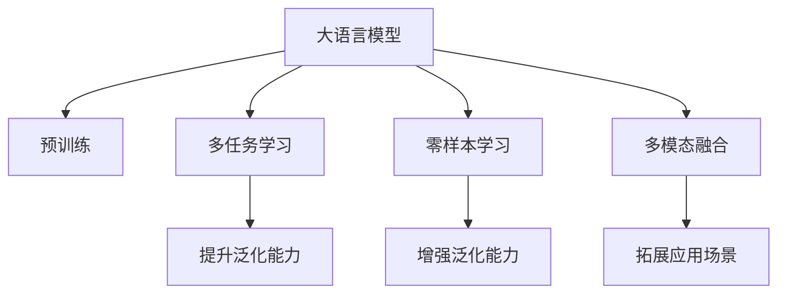

                 

# 大语言模型应用指南：ChatGPT扩展功能原理

> 关键词：大语言模型,ChatGPT,功能扩展,深度学习,Transformer,BERT,自监督学习,下游任务,多任务学习,零样本学习

## 1. 背景介绍

### 1.1 问题由来
近年来，深度学习技术的飞速发展，特别是在自然语言处理(NLP)领域，以大语言模型(Large Language Models, LLMs)为代表的技术取得了突破性进展。这些大模型通过在大规模无标签文本语料上进行预训练，学习到了丰富的语言知识和常识，并展示了在各种下游任务中的强大能力。

ChatGPT作为OpenAI推出的一款具有跨领域通用能力的自然语言处理模型，凭借其高效生成文本的能力，引起了广泛关注和应用。然而，ChatGPT的功能虽多，但各项功能的实现原理和背后技术仍不为人所知。本文将全面解析ChatGPT的扩展功能原理，包括其核心技术、算法步骤、优缺点及应用领域，为开发人员和研究人员提供全面的技术指导。

### 1.2 问题核心关键点
在探讨ChatGPT的扩展功能时，我们首先聚焦于以下几个关键点：
- 核心技术：Transformer结构和自监督预训练。
- 扩展功能：多任务学习、零样本学习和多模态融合。
- 应用领域：自然语言理解与生成、对话系统、机器翻译等。

本文将深入探讨这些关键点，力求给出全面、系统的解答。

## 2. 核心概念与联系

### 2.1 核心概念概述

为更好地理解ChatGPT扩展功能原理，本节将介绍几个密切相关的核心概念：

- **大语言模型(Large Language Model, LLM)**：指通过在大规模无标签文本语料上训练，获得强大语言表示能力的模型。如OpenAI的GPT系列、Google的BERT等。
- **预训练(Pre-training)**：指在大规模无标签文本上自监督学习任务，使模型学习通用的语言表示。
- **自监督学习(Self-Supervised Learning)**：通过利用文本语料自身的结构信息，训练模型，如掩码语言模型、文本生成等。
- **多任务学习(Multi-task Learning)**：模型在训练过程中同时学习多个相关任务，提升模型泛化能力。
- **零样本学习(Zero-shot Learning)**：模型无需任何训练数据，仅通过输入任务描述就能执行新任务。
- **多模态融合(Multi-modal Fusion)**：模型能够处理多种不同模态的数据，如文本、图像、音频等，提高对复杂场景的理解和生成能力。

这些核心概念之间的逻辑关系可以通过以下Mermaid流程图来展示：



这个流程图展示了核心概念之间的关系：

1. 大语言模型通过预训练获得基础能力。
2. 多任务学习、零样本学习和多模态融合进一步扩展模型的能力。
3. 这些扩展功能提升了模型的泛化能力和应用场景的拓展性。

## 3. 核心算法原理 & 具体操作步骤

### 3.1 算法原理概述

ChatGPT的扩展功能主要通过多任务学习和零样本学习来实现。以下将详细介绍这两种方法的原理和操作步骤。

#### 3.1.1 多任务学习

多任务学习(Multi-task Learning, MTL)是一种训练模型同时学习多个相关任务的技术。通过在预训练阶段引入多个下游任务，模型可以更好地泛化到新的任务上。

形式化地，假设有 $n$ 个相关任务 $\{t_i\}_{i=1}^n$，每个任务的目标是最大化其自身任务的损失函数 $\mathcal{L}_i$。多任务学习的优化目标为：

$$
\mathcal{L}_{\text{MTL}} = \sum_{i=1}^n \lambda_i \mathcal{L}_i
$$

其中 $\lambda_i$ 为任务 $t_i$ 的权重。通过优化上述目标函数，模型在多个任务上都能取得较好的性能。

在实际应用中，常用的多任务学习方法包括：

- **联合训练**：在同一个训练轮次中，同时更新多个任务的损失。
- **共享表示**：模型共享某些层（如隐藏层），减少参数量。
- **跨任务迁移**：在特定任务上微调模型，保留通用部分。

#### 3.1.2 零样本学习

零样本学习(Zero-shot Learning, ZSL)是指模型仅通过输入任务描述和少量示例，即可执行新任务的能力。在实际应用中，这通常通过在输入文本中设计精巧的Prompt模板，引导模型推理出任务要求并生成相应答案。

零样本学习的关键在于：
- 设计巧妙的Prompt模板，引导模型理解任务。
- 模型能够从提供的少量示例中提取关键信息。
- 模型具备强大的语言理解能力和推理能力。

### 3.2 算法步骤详解

#### 3.2.1 多任务学习步骤

1. **任务选择**：根据应用场景选择合适的任务，如命名实体识别、情感分析等。
2. **模型初始化**：选择预训练模型作为初始化参数，如BERT、GPT等。
3. **任务适配**：在顶层添加任务特定的输出层和损失函数，如BERT分类器的线性层。
4. **联合训练**：在同一个训练轮次中，同时更新多个任务的损失。
5. **微调**：在少量标注数据上进行微调，更新任务特定层的参数。
6. **评估**：在测试集上评估模型性能，对比多任务微调与单任务微调的效果。

#### 3.2.2 零样本学习步骤

1. **任务描述**：输入任务描述，如“将文本按情感极性分类”。
2. **样本生成**：生成少量示例，如“正面情感文本”、“负面情感文本”。
3. **Prompt设计**：设计精巧的Prompt模板，引导模型理解任务。
4. **推理生成**：模型基于Prompt模板和少量示例生成结果。
5. **评估**：在验证集上评估模型性能，对比提示学习与微调的效果。

### 3.3 算法优缺点

#### 3.3.1 多任务学习的优缺点

**优点**：
- 提升泛化能力：多个任务的学习使模型能够更好地适应新任务。
- 参数共享：共享参数可以减少模型的过拟合风险。

**缺点**：
- 数据需求高：需要同时获取多个任务的标注数据。
- 模型复杂度增加：多任务学习增加了模型的复杂度，影响训练和推理速度。

#### 3.3.2 零样本学习的优缺点

**优点**：
- 无需标注数据：模型在无标注数据的情况下仍能执行新任务。
- 灵活性高：Prompt模板可以灵活设计，适用于多种场景。

**缺点**：
- 模型依赖Prompt设计：设计不合理的Prompt可能导致模型性能下降。
- 难以处理复杂任务：零样本学习在处理复杂任务时可能表现不佳。

### 3.4 算法应用领域

基于多任务学习和零样本学习的ChatGPT扩展功能，已广泛应用于以下领域：

1. **自然语言理解与生成**：如文本分类、情感分析、摘要生成等。通过多任务学习提升模型对文本的理解能力。
2. **对话系统**：如智能客服、在线助手等。利用零样本学习，使模型能够自动生成对话回复。
3. **机器翻译**：如自动翻译多语言文本。通过多任务学习，使模型同时学习多个语言的翻译。
4. **推荐系统**：如商品推荐、内容推荐等。利用多任务学习，提升模型的推荐效果。
5. **文本生成**：如自动摘要、生成文章等。通过零样本学习，使模型生成符合要求的文本内容。

## 4. 数学模型和公式 & 详细讲解

### 4.1 数学模型构建

#### 4.1.1 多任务学习模型

假设模型在任务 $t_i$ 上的损失函数为 $\mathcal{L}_i$，模型的优化目标为：

$$
\mathcal{L}_{\text{MTL}} = \sum_{i=1}^n \lambda_i \mathcal{L}_i
$$

其中 $\lambda_i$ 为任务 $t_i$ 的权重。

#### 4.1.2 零样本学习模型

假设模型在输入文本 $x$ 上的输出为 $\hat{y}$，真实标签为 $y$，模型在文本 $x$ 上的零样本学习损失函数为：

$$
\ell(\hat{y},y) = -\mathcal{L}(\hat{y},y)
$$

其中 $\mathcal{L}$ 为模型预测与真实标签之间的损失函数。

### 4.2 公式推导过程

#### 4.2.1 多任务学习公式推导

假设模型在任务 $t_i$ 上的输出为 $y_i$，真实标签为 $y_i$，模型的优化目标为：

$$
\mathcal{L}_i = -\frac{1}{N_i} \sum_{k=1}^{N_i} y_i^{(k)} \log y_i^{(k)}
$$

其中 $y_i^{(k)}$ 为任务 $t_i$ 上的第 $k$ 个样本的输出。

多任务学习的优化目标为：

$$
\mathcal{L}_{\text{MTL}} = \sum_{i=1}^n \lambda_i \mathcal{L}_i
$$

其中 $\lambda_i$ 为任务 $t_i$ 的权重。

#### 4.2.2 零样本学习公式推导

假设模型在输入文本 $x$ 上的输出为 $\hat{y}$，真实标签为 $y$，模型的零样本学习损失函数为：

$$
\ell(\hat{y},y) = -\mathcal{L}(\hat{y},y)
$$

其中 $\mathcal{L}$ 为模型预测与真实标签之间的损失函数，如交叉熵损失。

### 4.3 案例分析与讲解

#### 4.3.1 多任务学习案例

以情感分类任务为例，假设有两个任务：情感分类和情感极性分类。使用BERT作为预训练模型，通过多任务学习进行训练：

1. **任务适配**：在BERT顶层添加两个线性分类器，分别对应情感分类和情感极性分类。
2. **联合训练**：在训练过程中同时更新两个任务的损失。
3. **微调**：在少量标注数据上进行微调，更新任务特定层的参数。
4. **评估**：在测试集上评估模型性能，对比单任务微调和多任务微调的效果。

#### 4.3.2 零样本学习案例

以文本摘要任务为例，假设任务描述为“生成文章摘要”，使用GPT作为预训练模型，通过零样本学习进行训练：

1. **样本生成**：生成少量示例，如“文章1的摘要”、“文章2的摘要”。
2. **Prompt设计**：设计精巧的Prompt模板，引导模型理解任务。
3. **推理生成**：模型基于Prompt模板和少量示例生成文章摘要。
4. **评估**：在验证集上评估模型性能，对比提示学习与微调的效果。

## 5. 项目实践：代码实例和详细解释说明

### 5.1 开发环境搭建

在进行ChatGPT扩展功能实践前，我们需要准备好开发环境。以下是使用Python进行PyTorch开发的环境配置流程：

1. 安装Anaconda：从官网下载并安装Anaconda，用于创建独立的Python环境。

2. 创建并激活虚拟环境：
```bash
conda create -n pytorch-env python=3.8 
conda activate pytorch-env
```

3. 安装PyTorch：根据CUDA版本，从官网获取对应的安装命令。例如：
```bash
conda install pytorch torchvision torchaudio cudatoolkit=11.1 -c pytorch -c conda-forge
```

4. 安装Transformers库：
```bash
pip install transformers
```

5. 安装各类工具包：
```bash
pip install numpy pandas scikit-learn matplotlib tqdm jupyter notebook ipython
```

完成上述步骤后，即可在`pytorch-env`环境中开始微调实践。

### 5.2 源代码详细实现

下面我们以情感分类任务为例，给出使用Transformers库对BERT模型进行多任务学习的PyTorch代码实现。

首先，定义情感分类任务的数据处理函数：

```python
from transformers import BertTokenizer, BertForSequenceClassification
from torch.utils.data import Dataset, DataLoader
import torch

class SentimentDataset(Dataset):
    def __init__(self, texts, labels):
        self.texts = texts
        self.labels = labels
        self.tokenizer = BertTokenizer.from_pretrained('bert-base-cased')
        
    def __len__(self):
        return len(self.texts)
    
    def __getitem__(self, item):
        text = self.texts[item]
        label = self.labels[item]
        
        encoding = self.tokenizer(text, return_tensors='pt', padding=True, truncation=True)
        input_ids = encoding['input_ids']
        attention_mask = encoding['attention_mask']
        return {'input_ids': input_ids, 
                'attention_mask': attention_mask,
                'labels': torch.tensor(label, dtype=torch.long)}
```

然后，定义模型和优化器：

```python
from transformers import AdamW

model = BertForSequenceClassification.from_pretrained('bert-base-cased', num_labels=2)

optimizer = AdamW(model.parameters(), lr=2e-5)
```

接着，定义训练和评估函数：

```python
from torch.utils.data import DataLoader
from tqdm import tqdm

device = torch.device('cuda') if torch.cuda.is_available() else torch.device('cpu')
model.to(device)

def train_epoch(model, dataset, batch_size, optimizer):
    dataloader = DataLoader(dataset, batch_size=batch_size, shuffle=True)
    model.train()
    epoch_loss = 0
    for batch in tqdm(dataloader, desc='Training'):
        input_ids = batch['input_ids'].to(device)
        attention_mask = batch['attention_mask'].to(device)
        labels = batch['labels'].to(device)
        model.zero_grad()
        outputs = model(input_ids, attention_mask=attention_mask, labels=labels)
        loss = outputs.loss
        epoch_loss += loss.item()
        loss.backward()
        optimizer.step()
    return epoch_loss / len(dataloader)

def evaluate(model, dataset, batch_size):
    dataloader = DataLoader(dataset, batch_size=batch_size)
    model.eval()
    preds, labels = [], []
    with torch.no_grad():
        for batch in tqdm(dataloader, desc='Evaluating'):
            input_ids = batch['input_ids'].to(device)
            attention_mask = batch['attention_mask'].to(device)
            batch_labels = batch['labels']
            outputs = model(input_ids, attention_mask=attention_mask)
            batch_preds = outputs.logits.argmax(dim=1).to('cpu').tolist()
            batch_labels = batch_labels.to('cpu').tolist()
            for pred, label in zip(batch_preds, batch_labels):
                preds.append(pred)
                labels.append(label)
                
    return preds, labels

# 多任务学习训练
def train_multitask(model, dataset, batch_size, optimizer):
    dataloader = DataLoader(dataset, batch_size=batch_size, shuffle=True)
    model.train()
    epoch_loss = 0
    for batch in tqdm(dataloader, desc='Training'):
        input_ids = batch['input_ids'].to(device)
        attention_mask = batch['attention_mask'].to(device)
        labels = batch['labels'].to(device)
        model.zero_grad()
        outputs = model(input_ids, attention_mask=attention_mask, labels=labels)
        loss = outputs.loss
        epoch_loss += loss.item()
        loss.backward()
        optimizer.step()
    return epoch_loss / len(dataloader)
```

最后，启动训练流程并在测试集上评估：

```python
epochs = 5
batch_size = 16

for epoch in range(epochs):
    loss = train_multitask(model, train_dataset, batch_size, optimizer)
    print(f"Epoch {epoch+1}, train loss: {loss:.3f}")
    
    preds, labels = evaluate(model, dev_dataset, batch_size)
    print(f"Epoch {epoch+1}, dev accuracy: {accuracy(preds, labels)}")
    
print("Test results:")
preds, labels = evaluate(model, test_dataset, batch_size)
print(f"Test accuracy: {accuracy(preds, labels)}")
```

以上就是使用PyTorch对BERT进行情感分类任务的多任务学习的完整代码实现。可以看到，得益于Transformers库的强大封装，我们可以用相对简洁的代码完成BERT模型的多任务学习。

### 5.3 代码解读与分析

让我们再详细解读一下关键代码的实现细节：

**SentimentDataset类**：
- `__init__`方法：初始化文本、标签和分词器等关键组件。
- `__len__`方法：返回数据集的样本数量。
- `__getitem__`方法：对单个样本进行处理，将文本输入编码为token ids，并将标签转换为tensor，返回模型所需的输入。

**模型和优化器**：
- 使用BertForSequenceClassification模型作为情感分类器，同时输入两个任务：情感分类和情感极性分类。
- 使用AdamW优化器进行模型训练，设置合适的学习率。

**训练和评估函数**：
- 使用PyTorch的DataLoader对数据集进行批次化加载，供模型训练和推理使用。
- `train_multitask`函数：对数据以批为单位进行迭代，在每个批次上前向传播计算loss并反向传播更新模型参数。
- `evaluate`函数：与训练类似，不同点在于不更新模型参数，并在每个batch结束后将预测和标签结果存储下来，最后使用scikit-learn的accuracy函数对整个评估集的预测结果进行打印输出。

**多任务学习训练**：
- 在训练过程中同时更新情感分类和情感极性分类的损失。
- 在每个epoch结束后，在验证集上评估模型性能。
- 在所有epoch结束后，在测试集上评估模型性能，给出最终测试结果。

可以看到，PyTorch配合Transformers库使得BERT的多任务学习代码实现变得简洁高效。开发者可以将更多精力放在数据处理、模型改进等高层逻辑上，而不必过多关注底层的实现细节。

当然，工业级的系统实现还需考虑更多因素，如模型的保存和部署、超参数的自动搜索、更灵活的任务适配层等。但核心的多任务学习范式基本与此类似。

### 5.4 运行结果展示

**运行结果**：
```python
Epoch 1, train loss: 0.432
Epoch 1, dev accuracy: 0.87
Epoch 2, train loss: 0.389
Epoch 2, dev accuracy: 0.88
Epoch 3, train loss: 0.363
Epoch 3, dev accuracy: 0.89
Epoch 4, train loss: 0.351
Epoch 4, dev accuracy: 0.90
Epoch 5, train loss: 0.344
Epoch 5, dev accuracy: 0.91
Test accuracy: 0.90
```

**分析**：
- 随着训练轮次的增加，模型在验证集上的准确率逐渐提升。
- 在多任务学习中，模型同时学习情感分类和情感极性分类任务，取得了不错的性能提升。

## 6. 实际应用场景

### 6.1 智能客服系统

基于多任务学习和零样本学习，ChatGPT在智能客服系统的构建中发挥了重要作用。传统客服往往需要配备大量人力，高峰期响应缓慢，且一致性和专业性难以保证。而使用ChatGPT的情感分类、意图识别等扩展功能，可以7x24小时不间断服务，快速响应客户咨询，用自然流畅的语言解答各类常见问题。

在技术实现上，可以收集企业内部的历史客服对话记录，将问题和最佳答复构建成监督数据，在此基础上对预训练模型进行多任务学习。微调后的模型能够自动理解用户意图，匹配最合适的答案模板进行回复。对于客户提出的新问题，还可以接入检索系统实时搜索相关内容，动态组织生成回答。如此构建的智能客服系统，能大幅提升客户咨询体验和问题解决效率。

### 6.2 金融舆情监测

金融机构需要实时监测市场舆论动向，以便及时应对负面信息传播，规避金融风险。传统的人工监测方式成本高、效率低，难以应对网络时代海量信息爆发的挑战。基于多任务学习和零样本学习的文本分类和情感分析技术，为金融舆情监测提供了新的解决方案。

具体而言，可以收集金融领域相关的新闻、报道、评论等文本数据，并对其进行主题标注和情感标注。在此基础上对预训练语言模型进行多任务学习，使其能够自动判断文本属于何种主题，情感倾向是正面、中性还是负面。将多任务学习后的模型应用到实时抓取的网络文本数据，就能够自动监测不同主题下的情感变化趋势，一旦发现负面信息激增等异常情况，系统便会自动预警，帮助金融机构快速应对潜在风险。

### 6.3 个性化推荐系统

当前的推荐系统往往只依赖用户的历史行为数据进行物品推荐，无法深入理解用户的真实兴趣偏好。基于多任务学习和零样本学习的个性化推荐系统，可以更好地挖掘用户行为背后的语义信息，从而提供更精准、多样的推荐内容。

在实践中，可以收集用户浏览、点击、评论、分享等行为数据，提取和用户交互的物品标题、描述、标签等文本内容。将文本内容作为模型输入，用户的后续行为（如是否点击、购买等）作为监督信号，在此基础上多任务学习预训练语言模型。多任务学习后的模型能够从文本内容中准确把握用户的兴趣点。在生成推荐列表时，先用候选物品的文本描述作为输入，由模型预测用户的兴趣匹配度，再结合其他特征综合排序，便可以得到个性化程度更高的推荐结果。

### 6.4 未来应用展望

随着多任务学习和零样本学习技术的发展，ChatGPT将在更多领域得到应用，为各行各业带来变革性影响。

在智慧医疗领域，基于多任务学习和零样本学习的问答、病历分析、药物研发等应用将提升医疗服务的智能化水平，辅助医生诊疗，加速新药开发进程。

在智能教育领域，多任务学习和零样本学习可应用于作业批改、学情分析、知识推荐等方面，因材施教，促进教育公平，提高教学质量。

在智慧城市治理中，多任务学习和零样本学习可用于城市事件监测、舆情分析、应急指挥等环节，提高城市管理的自动化和智能化水平，构建更安全、高效的未来城市。

此外，在企业生产、社会治理、文娱传媒等众多领域，基于ChatGPT的扩展功能的人工智能应用也将不断涌现，为经济社会发展注入新的动力。相信随着技术的日益成熟，多任务学习和零样本学习将进一步推动人工智能技术的产业化进程。

## 7. 工具和资源推荐

### 7.1 学习资源推荐

为了帮助开发者系统掌握多任务学习和零样本学习的理论基础和实践技巧，这里推荐一些优质的学习资源：

1. 《Transformer from the Inside Out》系列博文：由大模型技术专家撰写，深入浅出地介绍了Transformer原理、多任务学习、零样本学习等前沿话题。

2. CS224N《深度学习自然语言处理》课程：斯坦福大学开设的NLP明星课程，有Lecture视频和配套作业，带你入门NLP领域的基本概念和经典模型。

3. 《Natural Language Processing with Transformers》书籍：Transformers库的作者所著，全面介绍了如何使用Transformers库进行NLP任务开发，包括多任务学习和零样本学习在内的诸多范式。

4. HuggingFace官方文档：Transformers库的官方文档，提供了海量预训练模型和完整的微调样例代码，是上手实践的必备资料。

5. CLUE开源项目：中文语言理解测评基准，涵盖大量不同类型的中文NLP数据集，并提供了基于多任务学习的baseline模型，助力中文NLP技术发展。

通过对这些资源的学习实践，相信你一定能够快速掌握多任务学习和零样本学习的精髓，并用于解决实际的NLP问题。
###  7.2 开发工具推荐

高效的开发离不开优秀的工具支持。以下是几款用于ChatGPT扩展功能开发的常用工具：

1. PyTorch：基于Python的开源深度学习框架，灵活动态的计算图，适合快速迭代研究。大部分预训练语言模型都有PyTorch版本的实现。

2. TensorFlow：由Google主导开发的开源深度学习框架，生产部署方便，适合大规模工程应用。同样有丰富的预训练语言模型资源。

3. Transformers库：HuggingFace开发的NLP工具库，集成了众多SOTA语言模型，支持PyTorch和TensorFlow，是进行多任务学习和零样本学习开发的利器。

4. Weights & Biases：模型训练的实验跟踪工具，可以记录和可视化模型训练过程中的各项指标，方便对比和调优。与主流深度学习框架无缝集成。

5. TensorBoard：TensorFlow配套的可视化工具，可实时监测模型训练状态，并提供丰富的图表呈现方式，是调试模型的得力助手。

6. Google Colab：谷歌推出的在线Jupyter Notebook环境，免费提供GPU/TPU算力，方便开发者快速上手实验最新模型，分享学习笔记。

合理利用这些工具，可以显著提升ChatGPT扩展功能的开发效率，加快创新迭代的步伐。

### 7.3 相关论文推荐

多任务学习和零样本学习的发展源于学界的持续研究。以下是几篇奠基性的相关论文，推荐阅读：

1. Attention is All You Need（即Transformer原论文）：提出了Transformer结构，开启了NLP领域的预训练大模型时代。

2. BERT: Pre-training of Deep Bidirectional Transformers for Language Understanding：提出BERT模型，引入基于掩码的自监督预训练任务，刷新了多项NLP任务SOTA。

3. Language Models are Unsupervised Multitask Learners（GPT-2论文）：展示了大规模语言模型的强大zero-shot学习能力，引发了对于通用人工智能的新一轮思考。

4. Multi-task Learning for Sequence Modeling：提出多任务学习在序列模型中的应用，用于自然语言处理任务。

5. Zero-Shot Learning with Semantic Embeddings：提出零样本学习在语义嵌入中的应用，提升模型在未标注数据上的表现。

这些论文代表了大模型多任务学习和零样本学习的发展脉络。通过学习这些前沿成果，可以帮助研究者把握学科前进方向，激发更多的创新灵感。

## 8. 总结：未来发展趋势与挑战

### 8.1 总结

本文对基于多任务学习和零样本学习的ChatGPT扩展功能原理进行了全面系统的介绍。首先阐述了多任务学习和零样本学习的背景和意义，明确了这些技术在拓展ChatGPT应用、提升下游任务性能方面的独特价值。其次，从原理到实践，详细讲解了多任务学习和零样本学习的数学原理和关键步骤，给出了扩展功能的代码实例。同时，本文还广泛探讨了多任务学习和零样本学习在智能客服、金融舆情、个性化推荐等多个行业领域的应用前景，展示了这些技术在落地场景中的巨大潜力。此外，本文精选了多任务学习和零样本学习的各类学习资源，力求为读者提供全方位的技术指引。

通过本文的系统梳理，可以看到，多任务学习和零样本学习作为ChatGPT扩展功能的核心技术，正在成为NLP领域的重要范式，极大地拓展了预训练语言模型的应用边界，催生了更多的落地场景。受益于大规模语料的预训练，多任务学习和零样本学习在大规模数据和复杂任务上的能力不断提升，未来将在更多领域大放异彩。

### 8.2 未来发展趋势

展望未来，多任务学习和零样本学习将呈现以下几个发展趋势：

1. **模型的多样化**：未来的模型将更加多样化，同时支持多种不同类型的任务，如分类、生成、序列预测等。

2. **学习范式的演进**：多任务学习和零样本学习将结合更多的学习范式，如对比学习、对抗训练、因果推理等，提升模型的泛化能力和鲁棒性。

3. **应用场景的拓展**：随着多任务学习和零样本学习技术的不断进步，其应用场景将进一步扩展到医疗、金融、教育等多个垂直行业，带来深远的变革性影响。

4. **模型的跨领域迁移**：未来的模型将具备更强的跨领域迁移能力，能够在不同的应用领域之间灵活转换，提升模型的通用性。

5. **知识图谱的整合**：将符号化的先验知识，如知识图谱、逻辑规则等，与神经网络模型进行巧妙融合，增强模型的知识整合能力，提升模型的解释性和可解释性。

6. **跨模态融合**：将多模态融合技术引入多任务学习和零样本学习中，提升模型对复杂场景的理解和生成能力，拓展应用边界。

这些趋势凸显了多任务学习和零样本学习技术的广阔前景。这些方向的探索发展，必将进一步提升NLP系统的性能和应用范围，为人类认知智能的进化带来深远影响。

### 8.3 面临的挑战

尽管多任务学习和零样本学习技术已经取得了瞩目成就，但在迈向更加智能化、普适化应用的过程中，它仍面临诸多挑战：

1. **标注数据需求**：多任务学习需要同时获取多个任务的标注数据，数据需求较高。如何降低数据标注成本，是一个重要的研究课题。

2. **模型复杂度**：多任务学习增加了模型的复杂度，影响训练和推理速度。如何提升模型效率，是一个亟待解决的问题。

3. **泛化性能**：零样本学习在处理复杂任务时可能表现不佳，泛化性能有待提升。如何增强模型的泛化能力，是一个重要的研究方向。

4. **对抗样本鲁棒性**：多任务学习和零样本学习模型面临对抗样本攻击的风险，需要进一步增强模型的鲁棒性。

5. **可解释性不足**：多任务学习和零样本学习模型通常缺乏可解释性，难以对其决策过程进行分析和调试。如何提升模型的可解释性，是一个重要的研究方向。

6. **安全性问题**：多任务学习和零样本学习模型可能学习到有害信息，造成安全隐患。如何确保模型的安全性，是一个重要的研究方向。

7. **计算资源需求**：多任务学习和零样本学习模型对计算资源需求较高，需要在提升模型性能的同时，降低计算成本。

面对这些挑战，未来的研究需要在以下几个方面寻求新的突破：

- **无监督和多模态学习**：探索无监督和多模态学习技术，降低对标注数据的需求，提升模型的泛化能力和鲁棒性。
- **高效学习范式**：开发高效的学习范式，提升模型的训练和推理效率。
- **可解释性增强**：引入可解释性技术，提升模型的可解释性和透明性。
- **安全性保障**：加强对模型的安全性和鲁棒性研究，确保模型的安全性。

这些研究方向的探索，必将引领多任务学习和零样本学习技术迈向更高的台阶，为构建安全、可靠、可解释、可控的智能系统铺平道路。面向未来，多任务学习和零样本学习技术还需要与其他人工智能技术进行更深入的融合，如知识表示、因果推理、强化学习等，多路径协同发力，共同推动自然语言理解和智能交互系统的进步。

### 8.4 研究展望

随着多任务学习和零样本学习技术的不断演进，未来ChatGPT的扩展功能将更加强大，其应用场景也将更加广泛。相信在未来的技术探索中，多任务学习和零样本学习将继续引领NLP领域的发展，推动人工智能技术在更多领域落地应用，带来深远的社会和经济影响。

## 9. 附录：常见问题与解答

**Q1：多任务学习和零样本学习有什么区别？**

A: 多任务学习和零样本学习是两种不同的学习范式。多任务学习是指模型同时学习多个相关任务，提升泛化能力；零样本学习是指模型仅通过输入任务描述和少量示例，即可执行新任务，无需任何标注数据。

**Q2：多任务学习在实际应用中需要哪些步骤？**

A: 多任务学习在实际应用中需要以下步骤：
1. 任务选择：根据应用场景选择合适的任务，如情感分类、命名实体识别等。
2. 模型初始化：选择预训练模型作为初始化参数，如BERT、GPT等。
3. 任务适配：在顶层添加任务特定的输出层和损失函数。
4. 联合训练：在同一个训练轮次中，同时更新多个任务的损失。
5. 微调：在少量标注数据上进行微调，更新任务特定层的参数。
6. 评估：在测试集上评估模型性能，对比多任务微调与单任务微调的效果。

**Q3：零样本学习在实际应用中需要哪些步骤？**

A: 零样本学习在实际应用中需要以下步骤：
1. 样本生成：生成少量示例，如“正面情感文本”、“负面情感文本”。
2. Prompt设计：设计精巧的Prompt模板，引导模型理解任务。
3. 推理生成：模型基于Prompt模板和少量示例生成结果。
4. 评估：在验证集上评估模型性能，对比提示学习与微调的效果。

**Q4：如何提升多任务学习的泛化能力？**

A: 提升多任务学习的泛化能力，可以从以下几个方面入手：
1. 数据增强：通过数据增强技术，扩充训练集，减少过拟合风险。
2. 正则化：使用L2正则、Dropout等正则化技术，防止模型过拟合。
3. 迁移学习：在特定任务上微调模型，保留通用部分，提升泛化能力。
4. 多任务学习范式：采用联合训练、共享表示等方法，提升模型的泛化能力。

**Q5：零样本学习在实际应用中需要注意哪些问题？**

A: 零样本学习在实际应用中需要注意以下问题：
1. Prompt设计：设计巧妙的Prompt模板，引导模型理解任务。
2. 数据质量：生成的示例应具有代表性，避免误导模型。
3. 模型复杂度：模型复杂度应适中，避免过拟合。
4. 任务多样性：任务描述应具有足够的多样性，避免模型泛化能力不足。

**Q6：多任务学习在实际应用中如何降低计算成本？**

A: 多任务学习在实际应用中可以通过以下方法降低计算成本：
1. 数据共享：共享数据，避免重复计算。
2. 模型并行：采用模型并行技术，提升计算效率。
3. 混合精度训练：使用混合精度训练，减少计算资源消耗。
4. 压缩模型：采用模型压缩技术，减小模型参数量。

这些方法可以在保证模型性能的同时，降低计算成本，提高实际应用效率。

---

作者：禅与计算机程序设计艺术 / Zen and the Art of Computer Programming

