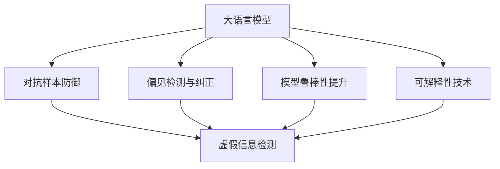

                 

# 大语言模型应用指南：大语言模型的安全技术

## 1. 背景介绍

### 1.1 问题由来
近年来，随着人工智能技术的快速发展，大语言模型在自然语言处理(NLP)领域取得了巨大突破。大语言模型通过在海量无标签文本数据上进行预训练，学习到丰富的语言知识和常识，可以用于文本分类、情感分析、机器翻译、问答系统等多种NLP任务。然而，大语言模型在带来巨大便利的同时，也暴露出一系列安全风险。例如，由于大模型可以生成文本，且具有强大的语言理解和生成能力，因此容易被恶意利用进行虚假信息传播、网络欺诈等。此外，大模型还可能生成含有偏见或有害信息的文本，对社会造成不良影响。因此，大语言模型的安全技术成为了当前AI研究的一个重要课题。

### 1.2 问题核心关键点
大语言模型安全技术的研究主要集中在以下几个方面：

1. **检测虚假信息**：通过训练模型来识别虚假信息和恶意言论，防止其在大模型上传播。
2. **对抗样本防御**：研究如何防御对抗样本攻击，保护模型免受攻击者的干扰。
3. **偏见检测与纠正**：检测和纠正大模型中潜在的偏见和有害信息，提高模型输出的可信赖性。
4. **模型鲁棒性提升**：通过优化模型架构和训练方法，提高大模型对攻击和数据变化的鲁棒性。
5. **可解释性和透明性**：使模型输出更加透明和可解释，便于用户理解和使用。

### 1.3 问题研究意义
研究大语言模型的安全技术，对于保障大语言模型的安全应用，防止恶意信息传播，保护用户隐私和权益，具有重要意义：

1. 防止虚假信息传播：大语言模型生成的文本容易被用来制造虚假信息，危害公共安全和秩序。通过检测和防御虚假信息，可以有效减少其传播。
2. 保护用户隐私：大模型在处理敏感信息时，可能泄露用户的隐私，带来法律和道德风险。安全技术可以防止数据泄露，保护用户隐私。
3. 提升模型可信赖性：大模型输出的文本可能含有偏见或有害信息，影响社会稳定。通过检测和纠正偏见，可以提升模型的可信赖性。
4. 增强模型鲁棒性：大模型可能受到对抗样本攻击，导致输出错误。通过提升模型鲁棒性，可以有效防御攻击。
5. 提高模型透明性：大模型通常被视为"黑盒"模型，用户难以理解其内部机制。通过可解释性技术，可以增加用户对模型的信任。

## 2. 核心概念与联系

### 2.1 核心概念概述

为更好地理解大语言模型安全技术，本节将介绍几个密切相关的核心概念：

- **大语言模型(Large Language Model, LLM)**：以自回归(如GPT)或自编码(如BERT)模型为代表的大规模预训练语言模型。通过在大规模无标签文本语料上进行预训练，学习通用的语言表示，具备强大的语言理解和生成能力。
- **对抗样本**：在输入数据中加入扰动，使得模型输出发生错误。例如，对抗文本攻击、对抗图像攻击等。
- **可解释性**：使模型输出具有透明性和可理解性，便于用户理解和使用。
- **偏见检测**：检测模型中潜在的偏见，并采取措施进行纠正。
- **鲁棒性**：模型对对抗样本、数据变化等的抵抗能力。

这些核心概念之间的逻辑关系可以通过以下Mermaid流程图来展示：



这个流程图展示了大语言模型的核心概念及其之间的关系：

1. 大语言模型通过对抗样本攻击、偏见检测与纠正、模型鲁棒性提升等手段，增强了其安全性。
2. 可解释性技术使模型输出更加透明，便于用户理解和使用。
3. 虚假信息检测可以防止恶意信息的传播。

这些概念共同构成了大语言模型的安全技术框架，使得模型能够在各种场景下保证其安全性。通过理解这些核心概念，我们可以更好地把握大语言模型安全技术的工作原理和优化方向。

## 3. 核心算法原理 & 具体操作步骤
### 3.1 算法原理概述

大语言模型的安全技术主要基于监督学习、生成对抗网络(GANs)、自适应对抗训练等方法。其核心思想是：通过训练模型来识别虚假信息、对抗样本、偏见信息等，并采取相应措施进行防御和纠正，提升模型的鲁棒性和可解释性。

形式化地，假设大语言模型为 $M_{\theta}$，其中 $\theta$ 为模型参数。给定对抗样本 $x'$，假设其对抗损失函数为 $\ell(\theta, x')$。则模型的对抗训练目标为最小化对抗损失函数，即：

$$
\hat{\theta} = \mathop{\arg\min}_{\theta} \ell(\theta, x')
$$

通过对抗训练，可以提升模型对对抗样本的抵抗能力。此外，还可以通过监督学习、正则化等方法，进一步增强模型的安全性和可解释性。

### 3.2 算法步骤详解

基于监督学习的大语言模型安全技术一般包括以下几个关键步骤：

**Step 1: 准备数据集和标签**
- 收集含有虚假信息、对抗样本、偏见信息等的数据集，标注数据集中的样本是否为安全样本。

**Step 2: 训练模型**
- 选择合适的优化算法及其参数，如 AdamW、SGD 等，设置学习率、批大小、迭代轮数等。
- 在数据集上训练模型，最小化对抗损失函数。

**Step 3: 测试和评估**
- 在测试集上评估模型的性能，计算模型在对抗样本、虚假信息、偏见信息等样本上的识别率。
- 通过可视化工具检查模型的决策边界和特征，增加模型的可解释性。

### 3.3 算法优缺点

大语言模型安全技术具有以下优点：
1. 简单高效。只需准备少量标注数据，即可训练出能识别虚假信息和对抗样本的模型。
2. 鲁棒性强。通过对抗训练，可以显著提升模型对对抗样本的抵抗能力。
3. 可解释性强。通过可视化工具，可以增加模型的可解释性，便于用户理解和使用。

同时，该方法也存在一定的局限性：
1. 依赖标注数据。安全技术的效果很大程度上取决于标注数据的质量和数量，获取高质量标注数据的成本较高。
2. 泛化能力有限。当数据分布与测试集差异较大时，模型可能无法泛化到新的数据。
3. 对抗样本多样性。对抗样本的类型和形态多样，模型难以对所有攻击形式进行有效防御。
4. 动态攻击防御。攻击者可能不断调整攻击手段，模型需要持续更新才能保证安全。

尽管存在这些局限性，但就目前而言，大语言模型安全技术仍是大规模语言模型应用的重要保障。未来相关研究的重点在于如何进一步降低安全技术对标注数据的依赖，提高模型的泛化能力和动态攻击防御能力，同时兼顾可解释性和鲁棒性等因素。

### 3.4 算法应用领域

大语言模型的安全技术已经被广泛应用于多个领域，例如：

- 网络安全：检测虚假信息、恶意软件、网络欺诈等。
- 金融安全：检测和防范金融欺诈、钓鱼攻击等。
- 医疗安全：检测虚假医疗信息、误导性药品广告等。
- 司法安全：检测虚假证据、伪造犯罪记录等。
- 公共安全：检测虚假新闻、谣言、恐怖威胁等。

这些安全技术的应用领域展示了大语言模型在保护社会安全方面的巨大潜力。随着大语言模型安全技术的不断进步，相信其在更多领域的应用将不断扩展，为社会安全带来新的保障。

## 4. 数学模型和公式 & 详细讲解  
### 4.1 数学模型构建

本节将使用数学语言对大语言模型安全技术进行更加严格的刻画。

记大语言模型为 $M_{\theta}$，其中 $\theta$ 为模型参数。假设对抗样本为 $x'$，对抗损失函数为 $\ell(\theta, x')$。训练目标为：

$$
\hat{\theta} = \mathop{\arg\min}_{\theta} \ell(\theta, x')
$$

在实践中，我们通常使用基于梯度的优化算法（如SGD、Adam等）来近似求解上述最优化问题。设 $\eta$ 为学习率，$\lambda$ 为正则化系数，则参数的更新公式为：

$$
\theta \leftarrow \theta - \eta \nabla_{\theta}\ell(\theta, x') - \eta\lambda\theta
$$

其中 $\nabla_{\theta}\ell(\theta, x')$ 为对抗损失函数对参数 $\theta$ 的梯度，可通过反向传播算法高效计算。

### 4.2 公式推导过程

以下我们以对抗样本检测为例，推导对抗损失函数及其梯度的计算公式。

假设模型 $M_{\theta}$ 在输入 $x'$ 上的输出为 $\hat{y}=M_{\theta}(x') \in [0,1]$，表示样本为安全样本的概率。真实标签 $y' \in \{0,1\}$。则二分类对抗损失函数定义为：

$$
\ell(M_{\theta}(x'),y') = -[y'\log \hat{y} + (1-y')\log(1-\hat{y})]
$$

将其代入训练目标，得：

$$
\mathcal{L}(\theta) = -\frac{1}{N}\sum_{i=1}^N [y_i\log M_{\theta}(x_i)+(1-y_i)\log(1-M_{\theta}(x_i))]
$$

根据链式法则，对抗损失函数对参数 $\theta_k$ 的梯度为：

$$
\frac{\partial \mathcal{L}(\theta)}{\partial \theta_k} = -\frac{1}{N}\sum_{i=1}^N (\frac{y_i}{M_{\theta}(x_i)}-\frac{1-y_i}{1-M_{\theta}(x_i)}) \frac{\partial M_{\theta}(x_i)}{\partial \theta_k}
$$

其中 $\frac{\partial M_{\theta}(x_i)}{\partial \theta_k}$ 可进一步递归展开，利用自动微分技术完成计算。

在得到对抗损失函数的梯度后，即可带入参数更新公式，完成模型的迭代优化。重复上述过程直至收敛，最终得到适应对抗样本检测的最优模型参数 $\theta^*$。

## 5. 项目实践：代码实例和详细解释说明
### 5.1 开发环境搭建

在进行安全技术实践前，我们需要准备好开发环境。以下是使用Python进行PyTorch开发的环境配置流程：

1. 安装Anaconda：从官网下载并安装Anaconda，用于创建独立的Python环境。

2. 创建并激活虚拟环境：
```bash
conda create -n pytorch-env python=3.8 
conda activate pytorch-env
```

3. 安装PyTorch：根据CUDA版本，从官网获取对应的安装命令。例如：
```bash
conda install pytorch torchvision torchaudio cudatoolkit=11.1 -c pytorch -c conda-forge
```

4. 安装Transformers库：
```bash
pip install transformers
```

5. 安装各类工具包：
```bash
pip install numpy pandas scikit-learn matplotlib tqdm jupyter notebook ipython
```

完成上述步骤后，即可在`pytorch-env`环境中开始安全技术实践。

### 5.2 源代码详细实现

这里我们以对抗样本检测任务为例，给出使用Transformers库对BERT模型进行对抗训练的PyTorch代码实现。

首先，定义对抗样本检测任务的数据处理函数：

```python
from transformers import BertTokenizer
from torch.utils.data import Dataset
import torch

class AdversarialExampleDataset(Dataset):
    def __init__(self, texts, labels, tokenizer, max_len=128):
        self.texts = texts
        self.labels = labels
        self.tokenizer = tokenizer
        self.max_len = max_len
        
    def __len__(self):
        return len(self.texts)
    
    def __getitem__(self, item):
        text = self.texts[item]
        label = self.labels[item]
        
        encoding = self.tokenizer(text, return_tensors='pt', max_length=self.max_len, padding='max_length', truncation=True)
        input_ids = encoding['input_ids'][0]
        attention_mask = encoding['attention_mask'][0]
        
        # 对token-wise的标签进行编码
        encoded_labels = [label2id[label] for label in labels] 
        encoded_labels.extend([label2id['O']] * (self.max_len - len(encoded_labels)))
        labels = torch.tensor(encoded_labels, dtype=torch.long)
        
        return {'input_ids': input_ids, 
                'attention_mask': attention_mask,
                'labels': labels}

# 标签与id的映射
label2id = {'O': 0, 'A': 1}
id2label = {v: k for k, v in label2id.items()}

# 创建dataset
tokenizer = BertTokenizer.from_pretrained('bert-base-cased')

train_dataset = AdversarialExampleDataset(train_texts, train_labels, tokenizer)
dev_dataset = AdversarialExampleDataset(dev_texts, dev_labels, tokenizer)
test_dataset = AdversarialExampleDataset(test_texts, test_labels, tokenizer)
```

然后，定义模型和优化器：

```python
from transformers import BertForTokenClassification, AdamW

model = BertForTokenClassification.from_pretrained('bert-base-cased', num_labels=len(label2id))

optimizer = AdamW(model.parameters(), lr=2e-5)
```

接着，定义训练和评估函数：

```python
from torch.utils.data import DataLoader
from tqdm import tqdm
from sklearn.metrics import classification_report

device = torch.device('cuda') if torch.cuda.is_available() else torch.device('cpu')
model.to(device)

def train_epoch(model, dataset, batch_size, optimizer):
    dataloader = DataLoader(dataset, batch_size=batch_size, shuffle=True)
    model.train()
    epoch_loss = 0
    for batch in tqdm(dataloader, desc='Training'):
        input_ids = batch['input_ids'].to(device)
        attention_mask = batch['attention_mask'].to(device)
        labels = batch['labels'].to(device)
        model.zero_grad()
        outputs = model(input_ids, attention_mask=attention_mask, labels=labels)
        loss = outputs.loss
        epoch_loss += loss.item()
        loss.backward()
        optimizer.step()
    return epoch_loss / len(dataloader)

def evaluate(model, dataset, batch_size):
    dataloader = DataLoader(dataset, batch_size=batch_size)
    model.eval()
    preds, labels = [], []
    with torch.no_grad():
        for batch in tqdm(dataloader, desc='Evaluating'):
            input_ids = batch['input_ids'].to(device)
            attention_mask = batch['attention_mask'].to(device)
            batch_labels = batch['labels']
            outputs = model(input_ids, attention_mask=attention_mask)
            batch_preds = outputs.logits.argmax(dim=2).to('cpu').tolist()
            batch_labels = batch_labels.to('cpu').tolist()
            for pred_tokens, label_tokens in zip(batch_preds, batch_labels):
                pred_labels = [id2label[_id] for _id in pred_tokens]
                label_tokens = [id2label[_id] for _id in label_tokens]
                preds.append(pred_labels[:len(label_tokens)])
                labels.append(label_tokens)
                
    print(classification_report(labels, preds))
```

最后，启动训练流程并在测试集上评估：

```python
epochs = 5
batch_size = 16

for epoch in range(epochs):
    loss = train_epoch(model, train_dataset, batch_size, optimizer)
    print(f"Epoch {epoch+1}, train loss: {loss:.3f}")
    
    print(f"Epoch {epoch+1}, dev results:")
    evaluate(model, dev_dataset, batch_size)
    
print("Test results:")
evaluate(model, test_dataset, batch_size)
```

以上就是使用PyTorch对BERT进行对抗样本检测任务的对抗训练的完整代码实现。可以看到，得益于Transformers库的强大封装，我们可以用相对简洁的代码完成BERT模型的加载和对抗训练。

### 5.3 代码解读与分析

让我们再详细解读一下关键代码的实现细节：

**AdversarialExampleDataset类**：
- `__init__`方法：初始化文本、标签、分词器等关键组件。
- `__len__`方法：返回数据集的样本数量。
- `__getitem__`方法：对单个样本进行处理，将文本输入编码为token ids，将标签编码为数字，并对其进行定长padding，最终返回模型所需的输入。

**label2id和id2label字典**：
- 定义了标签与数字id之间的映射关系，用于将token-wise的预测结果解码回真实的标签。

**训练和评估函数**：
- 使用PyTorch的DataLoader对数据集进行批次化加载，供模型训练和推理使用。
- 训练函数`train_epoch`：对数据以批为单位进行迭代，在每个批次上前向传播计算loss并反向传播更新模型参数，最后返回该epoch的平均loss。
- 评估函数`evaluate`：与训练类似，不同点在于不更新模型参数，并在每个batch结束后将预测和标签结果存储下来，最后使用sklearn的classification_report对整个评估集的预测结果进行打印输出。

**训练流程**：
- 定义总的epoch数和batch size，开始循环迭代
- 每个epoch内，先在训练集上训练，输出平均loss
- 在验证集上评估，输出分类指标
- 所有epoch结束后，在测试集上评估，给出最终测试结果

可以看到，PyTorch配合Transformers库使得BERT的对抗训练代码实现变得简洁高效。开发者可以将更多精力放在数据处理、模型改进等高层逻辑上，而不必过多关注底层的实现细节。

当然，工业级的系统实现还需考虑更多因素，如模型的保存和部署、超参数的自动搜索、更灵活的任务适配层等。但核心的安全技术基本与此类似。

## 6. 实际应用场景
### 6.1 网络安全

基于大语言模型的安全技术，可以广泛应用于网络安全领域。传统的安全技术主要依赖规则和特征检测，但这些方法对新型攻击手段的防御能力有限。而使用微调后的安全模型，可以更好地检测和防御新型攻击，保护网络安全。

在技术实现上，可以收集网络攻击数据，将攻击模式和正常流量作为监督数据，训练大语言模型。微调后的模型能够自动识别和分类攻击模式，及时发现和阻止恶意行为。例如，在检测恶意软件时，可以先将恶意代码转为文本描述，再将描述作为模型输入，判断是否为恶意软件。

### 6.2 金融安全

金融行业对数据安全和隐私保护的要求极高，大语言模型的安全技术在此领域具有重要应用价值。例如，可以使用大语言模型检测和防范金融欺诈、钓鱼攻击等。

具体而言，可以收集金融领域的交易记录和网络行为数据，训练大语言模型进行异常检测。微调后的模型能够实时监控交易和网络行为，及时发现异常交易和可疑行为，并采取相应措施，防止金融风险。例如，在检测可疑交易时，可以先将交易记录转换为文本，再通过微调后的模型进行检测。

### 6.3 医疗安全

医疗行业对数据安全和隐私保护同样要求极高。使用大语言模型的安全技术，可以检测虚假医疗信息、误导性药品广告等，保护患者隐私和医疗数据安全。

具体而言，可以收集医疗领域的文本数据，如病历记录、医生笔记等，训练大语言模型进行内容审核。微调后的模型能够自动识别和过滤虚假医疗信息，防止误导性信息传播。例如，在检测虚假医疗信息时，可以先将病历记录转换为文本，再通过微调后的模型进行检测。

### 6.4 公共安全

大语言模型的安全技术在公共安全领域同样具有重要应用价值。例如，可以用于检测虚假新闻、谣言、恐怖威胁等，维护社会稳定。

具体而言，可以收集社交媒体和新闻网站上的文本数据，训练大语言模型进行内容审核。微调后的模型能够自动识别和过滤虚假新闻和谣言，防止误导性信息传播。例如，在检测虚假新闻时，可以先将新闻内容转换为文本，再通过微调后的模型进行检测。

## 7. 工具和资源推荐
### 7.1 学习资源推荐

为了帮助开发者系统掌握大语言模型安全技术的理论基础和实践技巧，这里推荐一些优质的学习资源：

1. 《Transformer从原理到实践》系列博文：由大模型技术专家撰写，深入浅出地介绍了Transformer原理、BERT模型、对抗训练等前沿话题。

2. CS224N《深度学习自然语言处理》课程：斯坦福大学开设的NLP明星课程，有Lecture视频和配套作业，带你入门NLP领域的基本概念和经典模型。

3. 《Natural Language Processing with Transformers》书籍：Transformers库的作者所著，全面介绍了如何使用Transformers库进行NLP任务开发，包括对抗训练在内的诸多范式。

4. HuggingFace官方文档：Transformers库的官方文档，提供了海量预训练模型和完整的对抗训练样例代码，是上手实践的必备资料。

5. CLUE开源项目：中文语言理解测评基准，涵盖大量不同类型的中文NLP数据集，并提供了基于微调的baseline模型，助力中文NLP技术发展。

通过对这些资源的学习实践，相信你一定能够快速掌握大语言模型安全技术的精髓，并用于解决实际的NLP问题。
###  7.2 开发工具推荐

高效的开发离不开优秀的工具支持。以下是几款用于大语言模型安全技术开发的常用工具：

1. PyTorch：基于Python的开源深度学习框架，灵活动态的计算图，适合快速迭代研究。大部分预训练语言模型都有PyTorch版本的实现。

2. TensorFlow：由Google主导开发的开源深度学习框架，生产部署方便，适合大规模工程应用。同样有丰富的预训练语言模型资源。

3. Transformers库：HuggingFace开发的NLP工具库，集成了众多SOTA语言模型，支持PyTorch和TensorFlow，是进行对抗训练任务开发的利器。

4. Weights & Biases：模型训练的实验跟踪工具，可以记录和可视化模型训练过程中的各项指标，方便对比和调优。与主流深度学习框架无缝集成。

5. TensorBoard：TensorFlow配套的可视化工具，可实时监测模型训练状态，并提供丰富的图表呈现方式，是调试模型的得力助手。

6. Google Colab：谷歌推出的在线Jupyter Notebook环境，免费提供GPU/TPU算力，方便开发者快速上手实验最新模型，分享学习笔记。

合理利用这些工具，可以显著提升大语言模型安全技术的开发效率，加快创新迭代的步伐。

### 7.3 相关论文推荐

大语言模型安全技术的研究源于学界的持续研究。以下是几篇奠基性的相关论文，推荐阅读：

1. Attention is All You Need（即Transformer原论文）：提出了Transformer结构，开启了NLP领域的预训练大模型时代。

2. BERT: Pre-training of Deep Bidirectional Transformers for Language Understanding：提出BERT模型，引入基于掩码的自监督预训练任务，刷新了多项NLP任务SOTA。

3. Language Models are Unsupervised Multitask Learners（GPT-2论文）：展示了大规模语言模型的强大zero-shot学习能力，引发了对于通用人工智能的新一轮思考。

4. Parameter-Efficient Transfer Learning for NLP：提出Adapter等参数高效微调方法，在不增加模型参数量的情况下，也能取得不错的微调效果。

5. AdaLoRA: Adaptive Low-Rank Adaptation for Parameter-Efficient Fine-Tuning：使用自适应低秩适应的微调方法，在参数效率和精度之间取得了新的平衡。

6. Explaining and Interpreting deep learning models and predictions：对深度学习模型的可解释性进行了深入研究，提出了多种可解释性技术。

这些论文代表了大语言模型安全技术的发展脉络。通过学习这些前沿成果，可以帮助研究者把握学科前进方向，激发更多的创新灵感。

## 8. 总结：未来发展趋势与挑战

### 8.1 总结

本文对大语言模型安全技术进行了全面系统的介绍。首先阐述了大语言模型安全技术的研究背景和意义，明确了安全技术在保障大语言模型安全应用方面的重要作用。其次，从原理到实践，详细讲解了大语言模型安全技术的数学原理和关键步骤，给出了安全技术任务开发的完整代码实例。同时，本文还广泛探讨了大语言模型安全技术在网络安全、金融安全、医疗安全等多个领域的应用前景，展示了安全技术在保障社会安全方面的巨大潜力。此外，本文精选了大语言模型安全技术的各类学习资源，力求为读者提供全方位的技术指引。

通过本文的系统梳理，可以看到，大语言模型安全技术在保障模型安全性方面具有重要价值，能够有效防范虚假信息、对抗样本、偏见信息等安全威胁，保障社会安全。未来，伴随大语言模型安全技术的不断进步，相信其在更多领域的应用将不断扩展，为社会安全带来新的保障。

### 8.2 未来发展趋势

展望未来，大语言模型安全技术将呈现以下几个发展趋势：

1. 对抗样本多样性增强。随着攻击手段的多样化和复杂化，对抗样本的种类和形态将不断增加，模型需要不断更新和优化对抗样本防御策略。
2. 可解释性需求增加。随着大语言模型在金融、医疗等领域的应用，其可解释性需求将不断增加，需要引入更多可解释性技术，提升用户信任度。
3. 多模态安全技术发展。当前的对抗样本检测主要集中在文本领域，未来将拓展到图像、视频、语音等多模态数据，提升模型的鲁棒性和泛化能力。
4. 模型鲁棒性提升。未来需要在模型的架构和训练方法上不断优化，提升模型对对抗样本、数据变化等的抵抗能力。
5. 动态攻击防御。攻击者可能不断调整攻击手段，模型需要持续更新和优化，以适应动态攻击环境。

以上趋势凸显了大语言模型安全技术的研究方向。这些方向的探索发展，必将进一步提升模型的安全性和可靠性，为社会安全提供更强的保障。

### 8.3 面临的挑战

尽管大语言模型安全技术已经取得了一定进展，但在迈向更加智能化、普适化应用的过程中，仍面临诸多挑战：

1. 对抗样本生成能力。攻击者可以不断生成更复杂、更难以识别的对抗样本，模型需要不断更新和优化对抗样本防御策略。
2. 动态攻击防御。随着攻击手段的不断变化，模型需要持续更新和优化，以适应动态攻击环境。
3. 可解释性不足。大语言模型的内部机制和决策过程难以解释，用户难以理解和信任其输出。
4. 对抗训练泛化能力。对抗训练对训练数据的分布要求较高，当训练集与测试集分布差异较大时，模型的泛化能力有限。
5. 资源消耗较大。对抗训练需要大量的计算资源和时间，模型的训练和推理效率有待提升。

尽管存在这些挑战，但大语言模型安全技术的研究仍具有重要意义。未来，需要在对抗样本生成、动态攻击防御、可解释性等方面取得新的突破，进一步提升大语言模型的安全性。

### 8.4 研究展望

面向未来，大语言模型安全技术需要在以下几个方面寻求新的突破：

1. 对抗样本生成与防御：研究对抗样本生成的新方法，提升模型的防御能力。例如，通过生成对抗性文本、图像等，测试和优化模型的鲁棒性。
2. 动态攻击防御：研究动态攻击的检测和防御技术，使模型能够实时适应攻击变化，提升防御能力。例如，通过实时监控和反馈机制，及时调整模型参数。
3. 可解释性增强：研究更多可解释性技术，提升模型输出的透明性和可理解性。例如，通过可视化工具，展现模型的决策过程和关键特征。
4. 多模态安全技术：研究多模态数据的安全技术，提升模型对复杂场景的识别能力。例如，结合文本、图像、语音等多模态数据，进行综合分析和判断。
5. 鲁棒性优化：研究模型鲁棒性的优化方法，提升模型对对抗样本和数据变化的抵抗能力。例如，通过模型压缩、剪枝等技术，减小模型的复杂度。

这些研究方向的探索，必将引领大语言模型安全技术迈向更高的台阶，为构建安全、可靠、可解释、可控的智能系统铺平道路。面向未来，大语言模型安全技术还需要与其他人工智能技术进行更深入的融合，如知识表示、因果推理、强化学习等，多路径协同发力，共同推动人工智能技术的发展。只有勇于创新、敢于突破，才能不断拓展语言模型的边界，让智能技术更好地造福人类社会。

## 9. 附录：常见问题与解答

**Q1：大语言模型对抗训练是否适用于所有安全任务？**

A: 大语言模型对抗训练在大多数安全任务上都能取得不错的效果，特别是对于数据量较小的任务。但对于一些特定领域的任务，如医疗、法律等，仅仅依靠通用语料预训练的模型可能难以很好地适应。此时需要在特定领域语料上进一步预训练，再进行对抗训练，才能获得理想效果。此外，对于一些需要时效性、个性化很强的任务，如对话、推荐等，对抗训练方法也需要针对性的改进优化。

**Q2：大语言模型对抗训练如何避免过拟合？**

A: 对抗训练易造成模型过拟合，尤其是在训练数据较少的情况下。常见的缓解策略包括：
1. 数据增强：通过回译、近义替换等方式扩充训练集。
2. 正则化：使用L2正则、Dropout、Early Stopping等防止过拟合。
3. 对抗训练与自监督学习结合：在对抗训练过程中，引入自监督学习任务，提高模型的泛化能力。

这些策略往往需要根据具体任务和数据特点进行灵活组合。只有在数据、模型、训练、推理等各环节进行全面优化，才能最大限度地发挥对抗训练的威力。

**Q3：大语言模型安全技术在部署时需要注意哪些问题？**

A: 将安全技术转化为实际应用，还需要考虑以下因素：
1. 模型裁剪：去除不必要的层和参数，减小模型尺寸，加快推理速度。
2. 量化加速：将浮点模型转为定点模型，压缩存储空间，提高计算效率。
3. 服务化封装：将模型封装为标准化服务接口，便于集成调用。
4. 弹性伸缩：根据请求流量动态调整资源配置，平衡服务质量和成本。
5. 监控告警：实时采集系统指标，设置异常告警阈值，确保服务稳定性。
6. 安全防护：采用访问鉴权、数据脱敏等措施，保障数据和模型安全。

大语言模型安全技术为NLP应用带来了新的安全保障，但如何将强大的性能转化为稳定、高效、安全的业务价值，还需要工程实践的不断打磨。只有在数据、算法、工程、业务等多个维度协同发力，才能真正实现人工智能技术在垂直行业的规模化落地。总之，安全技术需要开发者根据具体任务，不断迭代和优化模型、数据和算法，方能得到理想的效果。

---

作者：禅与计算机程序设计艺术 / Zen and the Art of Computer Programming

