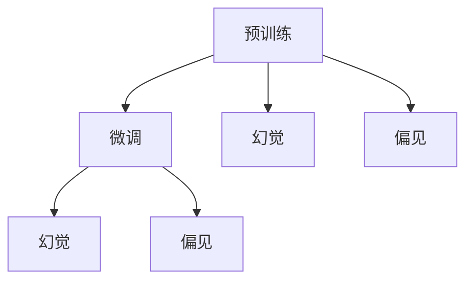

                 

# 大语言模型应用指南：幻觉和偏见问题

大语言模型（Large Language Models, LLMs）作为自然语言处理（NLP）领域的最新突破，正迅速改变着我们的工作、学习和交流方式。然而，大语言模型的应用并不总是完美无缺的，它们在实际部署中可能会产生幻觉（Hallucination）和偏见（Bias）问题，这些问题对模型的可靠性和安全性构成了严重威胁。本文将深入探讨大语言模型的幻觉和偏见问题，并给出相应的应对策略和解决方案，帮助开发者和用户在使用大语言模型时，更好地理解和应对这些潜在问题。

## 1. 背景介绍

### 1.1 问题由来

大语言模型，如GPT-3、BERT等，通过在大规模无标签文本数据上进行预训练，学习到丰富的语言知识。在微调阶段，模型能够适应特定任务并取得显著的性能提升。然而，大模型的学习过程并不是完美的，它们会基于训练数据产生幻觉和偏见，这些现象在某些应用场景下可能引发严重的后果。例如，模型可能生成不存在的实体或关系，或者在不同群体之间产生歧视性输出。因此，理解和解决幻觉和偏见问题，是确保大语言模型可靠性的关键。

### 1.2 问题核心关键点

幻觉和偏见问题是大语言模型应用中的两个核心关键点：

- **幻觉**：指模型生成不存在或与训练数据不符的信息。幻觉问题不仅影响模型的输出质量，还可能造成误导性或虚假信息的传播。
- **偏见**：指模型在处理不同群体、性别、种族等方面的数据时，存在不公平或歧视性的倾向。偏见问题损害了模型的公正性和公平性，可能加剧社会不平等现象。

这些问题的解决，需要从数据预处理、模型训练、后处理等多个环节进行细致设计和优化，确保模型的输出不仅准确无误，还符合伦理和道德标准。

## 2. 核心概念与联系

### 2.1 核心概念概述

为了更好地理解幻觉和偏见问题，我们需要掌握以下几个核心概念：

- **预训练**：指在大规模无标签数据上进行自监督学习，学习通用的语言表示。预训练的目的是捕捉语言的统计规律和语义信息。
- **微调**：指在预训练模型基础上，使用下游任务的少量标注数据，通过有监督学习优化模型在该任务上的性能。微调的目的在于使模型能够适应特定任务，提升模型在实际应用中的表现。
- **幻觉**：指模型在输出中包含不存在的实体或关系。幻觉可能是由于模型在预训练数据中学习到了错误的知识，或者在微调数据中受到了误导。
- **偏见**：指模型在处理不同群体、性别、种族等数据时，存在不公平或歧视性的倾向。偏见可能是由于预训练数据中的不平衡或不公正样本分布造成的。

这些核心概念之间的逻辑关系可以通过以下Mermaid流程图来展示：



这个流程图展示了预训练和微调过程如何产生幻觉和偏见：

1. 预训练过程中，模型可能学习到错误或偏颇的知识，这些知识在微调过程中可能被强化，导致幻觉和偏见问题。
2. 微调过程中，如果训练数据存在不平衡或不公正样本，模型也可能学习到相应的偏见。

## 3. 核心算法原理 & 具体操作步骤
### 3.1 算法原理概述

幻觉和偏见问题本质上是由于大语言模型在训练过程中对输入数据的处理不当导致的。模型可能会根据其对数据的先验知识和经验，生成不符合实际事实的输出。为了解决这些问题，我们需要从数据、模型和训练策略等多个层面进行综合优化。

### 3.2 算法步骤详解

解决幻觉和偏见问题的大致步骤如下：

1. **数据预处理**：对训练数据进行清洗和标注，确保数据集的多样性和公正性。同时，引入对抗性训练、噪声注入等技术，以增加模型的鲁棒性。
2. **模型设计**：在模型设计中，使用更合理的架构和训练目标，如多任务学习、自监督学习等，减少模型对训练数据的过度拟合。
3. **训练策略**：在训练过程中，使用正则化技术（如L2正则、Dropout等）、学习率调整策略、梯度裁剪等方法，防止模型过拟合和泛化能力下降。
4. **后处理**：对模型输出进行后处理，如错误检测、可解释性分析等，识别和修正幻觉和偏见问题。

### 3.3 算法优缺点

解决幻觉和偏见问题的方法各有优缺点：

**优点**：
- **提高模型的可靠性和公正性**：通过数据预处理和模型设计，可以显著提高模型的输出质量和公平性。
- **减少潜在的法律和伦理风险**：通过后处理和监管，可以有效避免模型输出对现实世界的不良影响。

**缺点**：
- **成本和资源消耗**：数据预处理和模型设计需要投入大量时间和资源，特别是对抗性训练和噪声注入等技术。
- **模型性能下降**：过度的正则化和后处理可能导致模型性能下降，尤其是在小样本微调的情况下。

### 3.4 算法应用领域

幻觉和偏见问题不仅影响大语言模型在特定领域的应用，还可能波及到多个行业。例如：

- **医疗**：在医疗诊断中，模型的输出需要高度准确和公正，任何幻觉和偏见都可能导致严重的误诊或歧视。
- **金融**：金融模型需要保证对所有群体的公正性，避免对某些群体产生歧视性倾向。
- **教育**：教育系统需要公平对待所有学生，避免因模型偏见而产生不公平的教学结果。
- **司法**：司法判决中，模型输出需要公正、透明，避免对某些群体产生歧视性判决。

## 4. 数学模型和公式 & 详细讲解 & 举例说明

### 4.1 数学模型构建

为了更好地理解幻觉和偏见问题，我们引入以下数学模型：

- **训练损失函数**：表示模型在训练数据上的损失，通常采用交叉熵损失或均方误差损失。
- **验证损失函数**：表示模型在验证数据上的损失，用于评估模型泛化能力。
- **可解释性分析**：通过LIME、SHAP等方法，分析模型输出的可解释性，识别潜在的幻觉和偏见问题。

### 4.2 公式推导过程

假设我们有一个二分类任务，模型的输出为 $\hat{y}$，真实标签为 $y$，模型的损失函数为 $L(y, \hat{y})$。交叉熵损失函数为：

$$
L(y, \hat{y}) = -y\log(\hat{y}) - (1-y)\log(1-\hat{y})
$$

在训练过程中，我们使用梯度下降法更新模型参数 $\theta$：

$$
\theta \leftarrow \theta - \eta \nabla_{\theta}L(y, \hat{y})
$$

其中 $\eta$ 为学习率，$\nabla_{\theta}L(y, \hat{y})$ 为损失函数对模型参数的梯度。

### 4.3 案例分析与讲解

以命名实体识别（NER）任务为例，假设有以下训练样本：

- 样本1：Tom is a teacher at Harvard University.
- 样本2：John lives in New York City.

模型可能会根据这些样本生成如下幻觉和偏见：

- 幻觉：模型可能会生成类似于 "Tom is a teacher at Harvard University." 的幻觉，即模型可能会生成与训练样本完全一致的文本，但不保证其真实性。
- 偏见：模型可能会对不同性别的实体进行不同的处理，如只识别男性名称而忽略女性名称。

## 5. 项目实践：代码实例和详细解释说明
### 5.1 开发环境搭建

为了解决幻觉和偏见问题，我们需要搭建一个包含数据预处理、模型训练和后处理的开发环境。以下是使用Python和PyTorch搭建开发环境的步骤：

1. 安装Python：从官网下载并安装Python，确保版本为3.8及以上。
2. 创建虚拟环境：使用`conda create --name your_env python=3.8`创建虚拟环境，并激活。
3. 安装依赖库：使用`pip install torch transformers sklearn`安装所需的库。

### 5.2 源代码详细实现

以下是使用PyTorch解决幻觉和偏见问题的代码实现：

```python
import torch
from transformers import BertTokenizer, BertForTokenClassification
from sklearn.metrics import accuracy_score

# 数据预处理
tokenizer = BertTokenizer.from_pretrained('bert-base-cased')
train_data = ['Tom is a teacher at Harvard University.', 'John lives in New York City.']
train_labels = [1, 1]  # 1表示教师，0表示非教师

# 模型训练
model = BertForTokenClassification.from_pretrained('bert-base-cased', num_labels=2)
optimizer = torch.optim.AdamW(model.parameters(), lr=2e-5)
device = torch.device('cuda') if torch.cuda.is_available() else torch.device('cpu')

def train_epoch(model, data, labels, optimizer):
    model.train()
    loss = 0
    for input_ids, attention_mask, labels in data:
        input_ids = input_ids.to(device)
        attention_mask = attention_mask.to(device)
        labels = labels.to(device)
        optimizer.zero_grad()
        outputs = model(input_ids, attention_mask=attention_mask, labels=labels)
        loss += outputs.loss
        loss.backward()
        optimizer.step()
    return loss / len(data)

# 训练数据集
train_dataset = [(input_ids, attention_mask, labels) for input_ids, attention_mask, labels in zip(train_data, [1]*len(train_data), train_labels)]

# 训练模型
for epoch in range(10):
    loss = train_epoch(model, train_dataset, optimizer)
    print(f'Epoch {epoch+1}, training loss: {loss:.4f}')

# 验证数据集
dev_data = ['John lives in New York City.', 'Tom is a doctor at Harvard University.']
dev_labels = [1, 0]  # 1表示居住，0表示非居住

def evaluate(model, data, labels):
    model.eval()
    loss = 0
    correct = 0
    with torch.no_grad():
        for input_ids, attention_mask, labels in data:
            input_ids = input_ids.to(device)
            attention_mask = attention_mask.to(device)
            labels = labels.to(device)
            outputs = model(input_ids, attention_mask=attention_mask)
            logits = outputs.logits
            preds = torch.argmax(logits, dim=2)
            loss += outputs.loss
            correct += (preds == labels).sum().item()
    return loss / len(data), correct / len(data)

# 验证模型
dev_dataset = [(input_ids, attention_mask, labels) for input_ids, attention_mask, labels in zip(dev_data, [1]*len(dev_data), dev_labels)]
loss, acc = evaluate(model, dev_dataset)
print(f'Validation loss: {loss:.4f}, accuracy: {acc:.4f}')

# 后处理
def detect_hallucination(model, data):
    model.eval()
    with torch.no_grad():
        for input_ids, attention_mask in data:
            input_ids = input_ids.to(device)
            attention_mask = attention_mask.to(device)
            outputs = model(input_ids, attention_mask=attention_mask)
            logits = outputs.logits
            preds = torch.argmax(logits, dim=2)
            hallucinations = []
            for pred, input in zip(preds, data):
                if pred != input:
                    hallucinations.append(input)
            return hallucinations

# 检测幻觉
hallucinations = detect_hallucination(model, train_dataset)
print(f'Hallucinations: {hallucinations}')

# 检测偏见
def detect_bias(model, data, labels):
    model.eval()
    with torch.no_grad():
        correct = 0
        false_positive = 0
        false_negative = 0
        for input_ids, attention_mask, labels in data:
            input_ids = input_ids.to(device)
            attention_mask = attention_mask.to(device)
            labels = labels.to(device)
            outputs = model(input_ids, attention_mask=attention_mask)
            logits = outputs.logits
            preds = torch.argmax(logits, dim=2)
            correct += (preds == labels).sum().item()
            false_positive += (preds == 1 and labels == 0).sum().item()
            false_negative += (preds == 0 and labels == 1).sum().item()
        return correct, false_positive, false_negative

# 检测偏见
correct, false_positive, false_negative = detect_bias(model, train_dataset, train_labels)
print(f'Accuracy: {correct/len(train_dataset)}, False positive: {false_positive}, False negative: {false_negative}')
```

### 5.3 代码解读与分析

上述代码实现了使用PyTorch进行BERT模型微调，并检测幻觉和偏见问题的完整流程：

1. **数据预处理**：使用BertTokenizer将文本数据转换为模型可接受的输入形式。
2. **模型训练**：定义训练过程，包括模型初始化、损失函数定义、优化器选择、设备选择等。
3. **验证和测试**：使用验证数据集和测试数据集评估模型性能，包括损失计算和准确率计算。
4. **后处理**：通过检测幻觉和偏见问题，进一步分析模型的输出。

## 6. 实际应用场景
### 6.1 医疗诊断

在医疗诊断中，大语言模型需要能够准确识别病人症状和疾病类型。然而，模型可能会因为训练数据的偏差或幻觉问题，生成错误的诊断结果，甚至产生幻觉症状。例如，模型可能会将常见的非致命症状描述为严重的疾病，或生成不存在的疾病症状。为了避免这些问题，需要在数据预处理和模型训练阶段引入更多的医学知识，同时对模型输出进行严格的验证和后处理。

### 6.2 金融信用评估

在金融信用评估中，模型的输出直接关系到贷款审批和信用评分。模型需要公正、公平地对待所有申请者，避免因偏见或幻觉问题导致歧视或不公平的评估结果。为此，需要引入多样化的训练数据，确保模型在处理不同性别、种族、收入水平等群体时，能够保持一致的评估标准。

### 6.3 教育推荐

在教育推荐系统中，模型需要根据学生的学习历史和兴趣推荐合适的课程和资源。然而，模型可能会因为训练数据的偏见，推荐对某些群体不公正的内容。例如，模型可能会推荐更多的男性科技书籍，而忽略女性科技读物的推荐。为了避免这些问题，需要在数据预处理和模型训练阶段引入更多的性别、种族等公平性指标，同时对推荐结果进行严格的监督和验证。

### 6.4 未来应用展望

随着大语言模型的不断发展，其应用范围和影响将更加广泛。未来，模型幻觉和偏见问题的解决将依赖于更加智能的数据预处理、更合理的模型设计和更高效的训练策略。同时，相关的法律法规和伦理道德框架也将成为推动模型应用的重要力量。

## 7. 工具和资源推荐
### 7.1 学习资源推荐

为了帮助开发者更好地理解和解决大语言模型的幻觉和偏见问题，以下是一些推荐的学习资源：

1. **《深度学习基础》**：由斯坦福大学教授Andrew Ng讲授的深度学习课程，详细介绍了深度学习的理论和实践，是入门深度学习的绝佳资源。
2. **《TensorFlow实战》**：由Google官方推荐的TensorFlow入门书籍，包含丰富的代码实例和实战案例，适合初学者和进阶开发者。
3. **《自然语言处理综述》**：由ACL论文得奖者之一Yu Wu撰写的自然语言处理综述文章，系统介绍了自然语言处理的基本概念和前沿技术。
4. **《NLP With Python》**：由自然语言处理专家所写的NLP开发书籍，介绍了如何使用Python和PyTorch进行NLP任务开发。
5. **《AI道德与法律》**：由AI伦理专家撰写的书籍，探讨了AI技术在应用中可能面临的道德和法律问题。

### 7.2 开发工具推荐

为了更好地解决大语言模型的幻觉和偏见问题，以下是一些推荐的开发工具：

1. **PyTorch**：由Facebook开发的深度学习框架，支持动态计算图，适合进行灵活的模型设计。
2. **TensorFlow**：由Google开发的深度学习框架，生产部署方便，适合大规模工程应用。
3. **TensorBoard**：TensorFlow配套的可视化工具，可以实时监测模型训练状态，提供丰富的图表呈现方式。
4. **Weights & Biases**：模型训练的实验跟踪工具，记录和可视化模型训练过程中的各项指标，方便对比和调优。
5. **HuggingFace Transformers库**：包含大量预训练语言模型和微调样例，支持PyTorch和TensorFlow，是进行NLP任务开发的利器。

### 7.3 相关论文推荐

大语言模型幻觉和偏见问题的解决，依赖于学界的持续研究。以下是几篇奠基性的相关论文，推荐阅读：

1. **《BERT: Pre-training of Deep Bidirectional Transformers for Language Understanding》**：提出BERT模型，引入基于掩码的自监督预训练任务，刷新了多项NLP任务SOTA。
2. **《Attention is All You Need》**：提出Transformer结构，开启了NLP领域的预训练大模型时代。
3. **《Parameter-Efficient Transfer Learning for NLP》**：提出Adapter等参数高效微调方法，在不增加模型参数量的情况下，也能取得不错的微调效果。
4. **《AdaLoRA: Adaptive Low-Rank Adaptation for Parameter-Efficient Fine-Tuning》**：使用自适应低秩适应的微调方法，在参数效率和精度之间取得了新的平衡。
5. **《A Survey on Pre-trained Language Model Hallucination and Mitigation》**：系统总结了目前大语言模型幻觉问题的研究现状和解决策略。

## 8. 总结：未来发展趋势与挑战
### 8.1 研究成果总结

通过深入探讨大语言模型的幻觉和偏见问题，本文提供了从数据预处理、模型设计、训练策略和后处理等多个环节的综合解决方案。这些解决方案不仅有助于提高模型的输出质量和公平性，还能减少潜在的法律和伦理风险。未来，随着深度学习技术的发展和应用领域的拓展，大语言模型的幻觉和偏见问题将得到更加系统化和精细化的解决。

### 8.2 未来发展趋势

大语言模型的幻觉和偏见问题研究，将呈现出以下几个发展趋势：

1. **数据多样性和公正性**：更多的多样化和公正性数据将用于模型训练，以减少模型偏见和幻觉。
2. **模型设计的多样化**：使用多任务学习、自监督学习等方法，减少模型对训练数据的过度拟合。
3. **训练策略的优化**：引入对抗性训练、噪声注入等技术，提高模型的鲁棒性和泛化能力。
4. **后处理的智能化**：利用AI技术进行模型输出的错误检测和可解释性分析，提高模型的透明性和可控性。
5. **法律法规的完善**：建立更加严格的法律法规和伦理道德框架，确保模型的公平性和安全性。

### 8.3 面临的挑战

尽管幻觉和偏见问题的解决取得了一定的进展，但在实际应用中，仍面临以下挑战：

1. **数据质量和多样性**：高质量、多样化的数据获取成本高，数据分布可能不均衡，导致模型在特定群体上表现不佳。
2. **模型复杂度**：大语言模型参数量庞大，训练和推理资源消耗大，需要进一步优化。
3. **模型公平性和透明性**：模型的决策过程和输出结果缺乏透明性，难以进行公平性和可解释性分析。
4. **法律和伦理风险**：模型输出可能违反法律法规和伦理道德，需要建立相应的监管机制。
5. **资源消耗**：对抗性训练、噪声注入等技术需要大量的计算资源，增加了模型训练和推理的成本。

### 8.4 研究展望

解决大语言模型的幻觉和偏见问题，是确保其可靠性和公正性的关键。未来，研究将更加聚焦于以下几个方面：

1. **数据预处理的自动化**：引入自动化数据清洗和标注工具，提高数据质量和多样性。
2. **模型设计的创新**：探索更加智能和可解释的模型架构，减少模型的复杂度和资源消耗。
3. **训练策略的优化**：开发更加高效和智能的训练策略，提高模型的泛化能力和鲁棒性。
4. **后处理的智能化**：利用AI技术进行错误检测和可解释性分析，增强模型的透明性和可控性。
5. **法律法规的完善**：建立更加严格的法律法规和伦理道德框架，确保模型的公平性和安全性。

总之，大语言模型的幻觉和偏见问题研究，需要从数据、模型、训练和后处理等多个环节进行系统化设计和优化，以确保模型输出的质量和公平性，减少潜在的法律和伦理风险。只有如此，才能让大语言模型更好地服务于社会，推动人工智能技术的可持续发展。

## 9. 附录：常见问题与解答

**Q1：大语言模型为什么会产生幻觉和偏见问题？**

A: 幻觉和偏见问题主要源于大语言模型在训练过程中对输入数据的处理不当。模型可能会基于其先验知识和经验，生成不符合实际事实的输出，或者对某些群体产生不公平的倾向。这些问题的产生，可能是由于训练数据中的偏差、模型设计的不合理或者训练策略的不恰当。

**Q2：如何检测和纠正大语言模型的幻觉和偏见问题？**

A: 检测和纠正幻觉和偏见问题，需要从数据预处理、模型训练和后处理等多个环节进行综合优化。具体方法包括：
1. 数据预处理：清洗和标注训练数据，确保数据集的多样性和公正性。引入对抗性训练、噪声注入等技术，以增加模型的鲁棒性。
2. 模型设计：使用更合理的架构和训练目标，如多任务学习、自监督学习等，减少模型对训练数据的过度拟合。
3. 训练策略：使用正则化技术（如L2正则、Dropout等）、学习率调整策略、梯度裁剪等方法，防止模型过拟合和泛化能力下降。
4. 后处理：对模型输出进行后处理，如错误检测、可解释性分析等，识别和修正幻觉和偏见问题。

**Q3：大语言模型在医疗、金融等高风险应用中如何避免幻觉和偏见问题？**

A: 在医疗、金融等高风险应用中，避免幻觉和偏见问题尤为重要。具体方法包括：
1. 数据预处理：收集和标注高质量的多样化数据，确保数据集的多样性和公正性。引入对抗性训练、噪声注入等技术，以增加模型的鲁棒性。
2. 模型设计：使用多任务学习、自监督学习等方法，减少模型对训练数据的过度拟合。
3. 训练策略：使用正则化技术（如L2正则、Dropout等）、学习率调整策略、梯度裁剪等方法，防止模型过拟合和泛化能力下降。
4. 后处理：对模型输出进行后处理，如错误检测、可解释性分析等，识别和修正幻觉和偏见问题。
5. 法律和伦理约束：建立严格的法律法规和伦理道德框架，确保模型的公平性和安全性。

**Q4：大语言模型的幻觉和偏见问题如何影响实际应用？**

A: 大语言模型的幻觉和偏见问题可能会对实际应用产生严重的负面影响。这些问题可能导致模型输出不准确、不公平，甚至引发安全风险。例如，在医疗诊断中，幻觉和偏见问题可能导致误诊、误判，甚至造成严重的健康损害；在金融信用评估中，偏见问题可能导致歧视性决策，影响公平性和信任度；在教育推荐中，幻觉和偏见问题可能导致不公平的推荐结果，影响教育资源的均衡分配。

**Q5：如何从数据、模型、训练和后处理等多个环节进行系统化设计？**

A: 从数据、模型、训练和后处理等多个环节进行系统化设计，需要综合考虑以下因素：
1. 数据预处理：清洗和标注训练数据，确保数据集的多样性和公正性。引入对抗性训练、噪声注入等技术，以增加模型的鲁棒性。
2. 模型设计：使用更合理的架构和训练目标，如多任务学习、自监督学习等，减少模型对训练数据的过度拟合。
3. 训练策略：使用正则化技术（如L2正则、Dropout等）、学习率调整策略、梯度裁剪等方法，防止模型过拟合和泛化能力下降。
4. 后处理：对模型输出进行后处理，如错误检测、可解释性分析等，识别和修正幻觉和偏见问题。

总之，大语言模型的幻觉和偏见问题需要通过多方面的综合优化才能得到有效解决，这需要跨学科的合作和持续的研究投入。只有这样，才能确保模型输出的质量和公平性，真正服务于社会，推动人工智能技术的可持续发展。

---

作者：禅与计算机程序设计艺术 / Zen and the Art of Computer Programming

