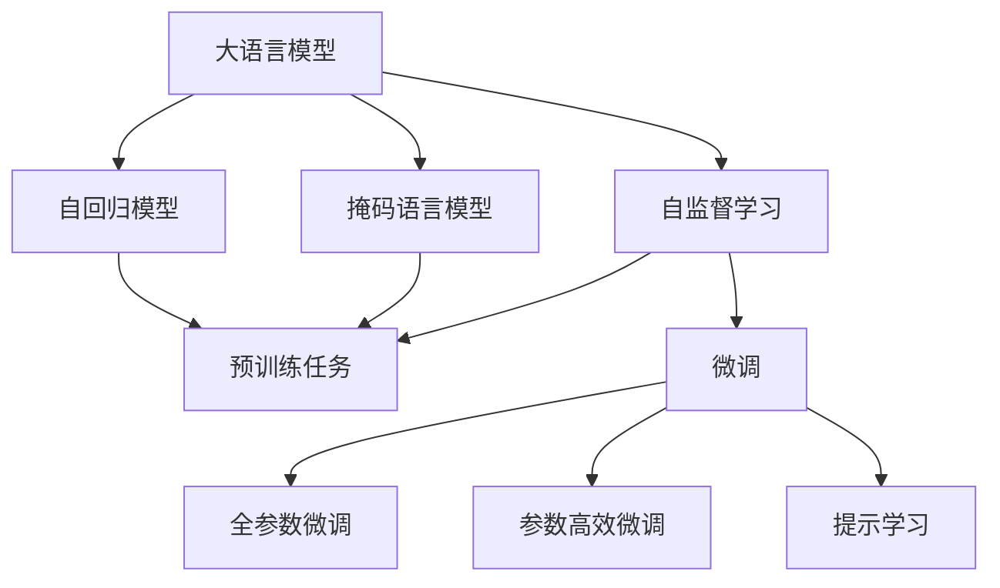

                 

# 大语言模型的自监督学习

> 关键词：大语言模型,自监督学习,Transformer,BERT,掩码语言模型,自回归模型,预训练,预训练任务

## 1. 背景介绍

### 1.1 问题由来
近年来，深度学习技术在自然语言处理（NLP）领域取得了飞速进展。这些进展的核心动力之一就是大规模预训练语言模型（Large Pre-trained Language Models, LLMs）。这些模型通过在无标签的数据集上进行自监督预训练，学习到了大量的语言知识和常识，能够用于下游任务中的微调（Fine-Tuning），以获得优异的性能。

其中最具代表性的预训练模型包括OpenAI的GPT系列、Google的BERT、T5等。这些模型通过大规模的无标签数据集进行预训练，使得它们在各种下游任务中都能够获得很好的效果。但是，这些通用模型往往无法完全适应特定领域的应用场景，因此需要进行微调。

### 1.2 问题核心关键点
自监督学习（Self-supervised Learning）在大语言模型中的应用具有以下核心关键点：
1. **无标签数据集**：自监督学习可以在大规模的无标签数据集上进行预训练，这些数据集通常来源于互联网上的文本，如维基百科、新闻、社交媒体等。
2. **预训练目标**：自监督学习的预训练目标旨在学习模型的通用语言表示，而不是针对具体任务的定制化表示。这些目标包括语言建模、掩码语言模型、下一位预测、句子表示等。
3. **微调**：在预训练的基础上，使用下游任务的少量标注数据进行微调，使得模型能够适应特定的任务。
4. **参数效率**：通过自监督学习，模型可以学习到大量的通用表示，这些表示可以用于微调，以最小化对下游任务的标注数据需求。

自监督学习在大语言模型中的应用，不仅能够提升模型的性能，还能够降低对标注数据的依赖，从而降低模型训练的成本。

### 1.3 问题研究意义
自监督学习在大语言模型中的应用，具有重要的研究意义：
1. **数据效率**：自监督学习能够利用无标签数据进行预训练，减少了对标注数据的依赖，从而降低了数据获取和标注的成本。
2. **通用性**：自监督学习学习到的通用表示可以用于多个下游任务，提高了模型的通用性。
3. **鲁棒性**：自监督学习能够学习到更鲁棒的表示，使得模型在面对小规模标注数据时，也能够获得良好的性能。
4. **可解释性**：自监督学习模型通常具有更好的可解释性，因为它们只依赖于语料本身，而不依赖于特定的标注数据。

自监督学习在大语言模型中的应用，为NLP技术的发展提供了新的方向和方法，推动了NLP技术在各个领域的应用。

## 2. 核心概念与联系

### 2.1 核心概念概述

为了更好地理解大语言模型的自监督学习过程，下面将介绍几个关键的核心概念：

- **大语言模型（Large Language Model, LLM）**：通常指使用Transformer架构的深度学习模型，能够处理大规模文本数据，并生成高质量的语言输出。
- **自监督学习（Self-supervised Learning）**：在无标签数据集上训练模型，通过构建任务自监督的方式，让模型学习到通用的语言表示。
- **掩码语言模型（Masked Language Model, MLM）**：一种自监督学习任务，模型需要在给定文本中随机掩码一部分单词，并预测这些被掩码的单词。
- **自回归模型（Autoregressive Model）**：一种生成模型，能够基于先前的文本生成下一个单词。
- **预训练任务（Pre-training Task）**：在无标签数据集上进行的各种自监督学习任务，如掩码语言模型、自回归模型等。
- **微调（Fine-Tuning）**：在预训练模型的基础上，使用下游任务的少量标注数据进行微调，使得模型能够适应特定的任务。
- **参数高效微调（Parameter-Efficient Fine-Tuning, PEFT）**：在微调过程中，只更新少量的模型参数，而固定大部分预训练权重不变，以提高微调效率。
- **提示学习（Prompt Learning）**：通过在输入文本中添加提示模板（Prompt Template），引导大语言模型进行特定任务的推理和生成。

这些核心概念之间的逻辑关系可以通过以下Mermaid流程图来展示：



这个流程图展示了自监督学习在大语言模型中的基本流程：

1. 大语言模型通过预训练任务（如掩码语言模型、自回归模型）在无标签数据集上进行预训练。
2. 预训练任务的目标是学习模型的通用语言表示。
3. 微调过程在预训练模型的基础上，使用下游任务的少量标注数据进行微调，以适应特定的任务。
4. 微调可以采用全参数微调或参数高效微调。
5. 提示学习是一种不更新模型参数的方法，可以通过在输入文本中添加提示模板，实现少样本或零样本学习。

## 3. 核心算法原理 & 具体操作步骤
### 3.1 算法原理概述

自监督学习在大语言模型中的应用，其核心思想是利用无标签数据进行预训练，学习通用的语言表示，然后在下游任务的少量标注数据上进行微调，以适应特定的任务。

形式化地，假设大语言模型为 $M_{\theta}$，其中 $\theta$ 为模型参数。给定下游任务 $T$ 的少量标注数据集 $D=\{(x_i, y_i)\}_{i=1}^N$，自监督学习的目标是最小化模型的预测误差：

$$
\theta^* = \mathop{\arg\min}_{\theta} \mathcal{L}(M_{\theta},D)
$$

其中 $\mathcal{L}$ 为损失函数，用于衡量模型在数据集 $D$ 上的预测误差。常见的损失函数包括交叉熵损失、均方误差损失等。

通过梯度下降等优化算法，自监督学习过程不断更新模型参数 $\theta$，最小化损失函数 $\mathcal{L}$，使得模型能够适应下游任务的特定需求。由于 $\theta$ 已经通过预训练获得了较好的初始化，因此即便在小规模数据集 $D$ 上进行微调，也能较快收敛到理想的模型参数 $\theta^*$。

### 3.2 算法步骤详解

自监督学习在大语言模型中的应用，其步骤包括以下几个关键环节：

**Step 1: 准备预训练模型和数据集**
- 选择合适的预训练语言模型 $M_{\theta}$ 作为初始化参数，如 BERT、GPT 等。
- 准备下游任务 $T$ 的少量标注数据集 $D$，划分为训练集、验证集和测试集。一般要求标注数据与预训练数据的分布不要差异过大。

**Step 2: 定义自监督学习任务**
- 选择合适的自监督学习任务，如掩码语言模型、自回归模型等。
- 在预训练模型上定义自监督学习任务，使用无标签数据集进行预训练。

**Step 3: 设置自监督学习超参数**
- 选择合适的优化算法及其参数，如 AdamW、SGD 等，设置学习率、批大小、迭代轮数等。
- 设置正则化技术及强度，包括权重衰减、Dropout、Early Stopping 等。
- 确定冻结预训练参数的策略，如仅微调顶层，或全部参数都参与预训练。

**Step 4: 执行预训练**
- 将无标签数据集分批次输入模型，前向传播计算损失函数。
- 反向传播计算参数梯度，根据设定的优化算法和学习率更新模型参数。
- 周期性在验证集上评估模型性能，根据性能指标决定是否触发 Early Stopping。
- 重复上述步骤直至预训练收敛。

**Step 5: 准备下游任务数据集**
- 收集下游任务 $T$ 的少量标注数据集 $D$，划分为训练集、验证集和测试集。
- 将标注数据集 $D$ 用于微调过程。

**Step 6: 设置微调超参数**
- 选择合适的优化算法及其参数，如 AdamW、SGD 等，设置学习率、批大小、迭代轮数等。
- 设置正则化技术及强度，包括权重衰减、Dropout、Early Stopping 等。
- 确定冻结预训练参数的策略，如仅微调顶层，或全部参数都参与微调。

**Step 7: 执行微调**
- 将标注数据集 $D$ 分批次输入模型，前向传播计算损失函数。
- 反向传播计算参数梯度，根据设定的优化算法和学习率更新模型参数。
- 周期性在验证集上评估模型性能，根据性能指标决定是否触发 Early Stopping。
- 重复上述步骤直至微调收敛。

**Step 8: 测试和部署**
- 在测试集上评估微调后模型 $M_{\theta^*}$ 的性能，对比微调前后的精度提升。
- 使用微调后的模型对新样本进行推理预测，集成到实际的应用系统中。

以上就是自监督学习在大语言模型中的完整流程。在实际应用中，还需要根据具体任务的特点，对预训练和微调过程的各个环节进行优化设计，如改进训练目标函数，引入更多的正则化技术，搜索最优的超参数组合等，以进一步提升模型性能。

### 3.3 算法优缺点

自监督学习在大语言模型中的应用，具有以下优点：
1. **数据效率**：自监督学习可以利用无标签数据进行预训练，减少了对标注数据的依赖，从而降低了数据获取和标注的成本。
2. **通用性**：自监督学习学习到的通用表示可以用于多个下游任务，提高了模型的通用性。
3. **鲁棒性**：自监督学习能够学习到更鲁棒的表示，使得模型在面对小规模标注数据时，也能够获得良好的性能。
4. **可解释性**：自监督学习模型通常具有更好的可解释性，因为它们只依赖于语料本身，而不依赖于特定的标注数据。

同时，自监督学习在大语言模型中的应用，也存在一些缺点：
1. **泛化能力有限**：自监督学习模型在特定领域的数据集上泛化能力可能较差，需要进一步在特定领域进行微调。
2. **可控性差**：自监督学习模型学习到的表示可能包含噪声，需要进一步优化和清理。
3. **计算资源需求高**：自监督学习模型通常需要较大的计算资源进行预训练，对硬件设备提出了较高要求。

尽管存在这些缺点，自监督学习在大语言模型中的应用，仍然是一种有效的预训练方法，为NLP技术的发展提供了新的方向和方法。

### 3.4 算法应用领域

自监督学习在大语言模型中的应用，已经在NLP领域得到了广泛的应用，覆盖了几乎所有常见任务，例如：

- 文本分类：如情感分析、主题分类、意图识别等。通过自监督学习使得模型学习到文本-标签映射。
- 命名实体识别：识别文本中的人名、地名、机构名等特定实体。通过自监督学习使得模型掌握实体边界和类型。
- 关系抽取：从文本中抽取实体之间的语义关系。通过自监督学习使得模型学习实体-关系三元组。
- 问答系统：对自然语言问题给出答案。将问题-答案对作为微调数据，训练模型学习匹配答案。
- 机器翻译：将源语言文本翻译成目标语言。通过自监督学习使得模型学习语言-语言映射。
- 文本摘要：将长文本压缩成简短摘要。通过自监督学习使得模型学习抓取要点。
- 对话系统：使机器能够与人自然对话。通过自监督学习使得模型学习对话轮次的生成。

除了这些经典任务外，自监督学习也被创新性地应用到更多场景中，如可控文本生成、常识推理、代码生成、数据增强等，为NLP技术带来了全新的突破。随着预训练语言模型和自监督学习方法的不断进步，相信NLP技术将在更广阔的应用领域大放异彩。

## 4. 数学模型和公式 & 详细讲解  
### 4.1 数学模型构建

本节将使用数学语言对大语言模型的自监督学习过程进行更加严格的刻画。

记预训练语言模型为 $M_{\theta}$，其中 $\theta$ 为模型参数。假设自监督学习任务为 $T$，其损失函数为 $\mathcal{L}(M_{\theta},D)$，其中 $D$ 为无标签数据集。

定义模型 $M_{\theta}$ 在数据样本 $(x,y)$ 上的损失函数为 $\ell(M_{\theta}(x),y)$，则在数据集 $D$ 上的经验风险为：

$$
\mathcal{L}(\theta) = \frac{1}{N}\sum_{i=1}^N \ell(M_{\theta}(x_i),y_i)
$$

其中 $\ell$ 为自监督学习任务的损失函数。

自监督学习的优化目标是最小化经验风险，即找到最优参数：

$$
\theta^* = \mathop{\arg\min}_{\theta} \mathcal{L}(\theta)
$$

在实践中，我们通常使用基于梯度的优化算法（如SGD、Adam等）来近似求解上述最优化问题。设 $\eta$ 为学习率，$\lambda$ 为正则化系数，则参数的更新公式为：

$$
\theta \leftarrow \theta - \eta \nabla_{\theta}\mathcal{L}(\theta) - \eta\lambda\theta
$$

其中 $\nabla_{\theta}\mathcal{L}(\theta)$ 为损失函数对参数 $\theta$ 的梯度，可通过反向传播算法高效计算。

### 4.2 公式推导过程

以下我们以掩码语言模型（Masked Language Model, MLM）为例，推导损失函数及其梯度的计算公式。

假设模型 $M_{\theta}$ 在输入 $x$ 上的输出为 $\hat{y}=M_{\theta}(x) \in [0,1]$，表示样本属于正类的概率。真实标签 $y \in \{0,1\}$。

掩码语言模型的损失函数定义为：

$$
\ell(M_{\theta}(x),y) = -y\log \hat{y} - (1-y)\log (1-\hat{y})
$$

将其代入经验风险公式，得：

$$
\mathcal{L}(\theta) = -\frac{1}{N}\sum_{i=1}^N [y_i\log M_{\theta}(x_i)+(1-y_i)\log(1-M_{\theta}(x_i))]
$$

根据链式法则，损失函数对参数 $\theta_k$ 的梯度为：

$$
\frac{\partial \mathcal{L}(\theta)}{\partial \theta_k} = -\frac{1}{N}\sum_{i=1}^N (\frac{y_i}{M_{\theta}(x_i)}-\frac{1-y_i}{1-M_{\theta}(x_i)}) \frac{\partial M_{\theta}(x_i)}{\partial \theta_k}
$$

其中 $\frac{\partial M_{\theta}(x_i)}{\partial \theta_k}$ 可进一步递归展开，利用自动微分技术完成计算。

在得到损失函数的梯度后，即可带入参数更新公式，完成模型的迭代优化。重复上述过程直至收敛，最终得到适应下游任务的最优模型参数 $\theta^*$。

## 5. 项目实践：代码实例和详细解释说明
### 5.1 开发环境搭建

在进行自监督学习实践前，我们需要准备好开发环境。以下是使用Python进行PyTorch开发的环境配置流程：

1. 安装Anaconda：从官网下载并安装Anaconda，用于创建独立的Python环境。

2. 创建并激活虚拟环境：
```bash
conda create -n pytorch-env python=3.8 
conda activate pytorch-env
```

3. 安装PyTorch：根据CUDA版本，从官网获取对应的安装命令。例如：
```bash
conda install pytorch torchvision torchaudio cudatoolkit=11.1 -c pytorch -c conda-forge
```

4. 安装Transformers库：
```bash
pip install transformers
```

5. 安装各类工具包：
```bash
pip install numpy pandas scikit-learn matplotlib tqdm jupyter notebook ipython
```

完成上述步骤后，即可在`pytorch-env`环境中开始自监督学习实践。

### 5.2 源代码详细实现

这里我们以BERT模型为例，使用PyTorch实现自监督学习中的掩码语言模型（Masked Language Model, MLM）。

首先，定义MLM任务的数据处理函数：

```python
from transformers import BertTokenizer
from torch.utils.data import Dataset
import torch

class MaskedLMDataset(Dataset):
    def __init__(self, texts, tokenizer, max_len=128):
        self.texts = texts
        self.tokenizer = tokenizer
        self.max_len = max_len
        
    def __len__(self):
        return len(self.texts)
    
    def __getitem__(self, item):
        text = self.texts[item]
        
        encoding = self.tokenizer(text, return_tensors='pt', max_length=self.max_len, padding='max_length', truncation=True)
        input_ids = encoding['input_ids'][0]
        attention_mask = encoding['attention_mask'][0]
        
        # 对token-wise的标签进行编码
        masked_indices = torch.randint(0, input_ids.shape[-1], (input_ids.shape[0],))
        masked_ids = input_ids[masked_indices, :]
        masked_tokens = self.tokenizer.mask_token
        masked_ids[masked_indices, masked_tokens] = 0
        
        return {'input_ids': input_ids, 
                'attention_mask': attention_mask,
                'masked_ids': masked_ids}
```

然后，定义模型和优化器：

```python
from transformers import BertForMaskedLM, AdamW

model = BertForMaskedLM.from_pretrained('bert-base-cased')
optimizer = AdamW(model.parameters(), lr=2e-5)
```

接着，定义训练和评估函数：

```python
from torch.utils.data import DataLoader
from tqdm import tqdm
from sklearn.metrics import classification_report

device = torch.device('cuda') if torch.cuda.is_available() else torch.device('cpu')
model.to(device)

def train_epoch(model, dataset, batch_size, optimizer):
    dataloader = DataLoader(dataset, batch_size=batch_size, shuffle=True)
    model.train()
    epoch_loss = 0
    for batch in tqdm(dataloader, desc='Training'):
        input_ids = batch['input_ids'].to(device)
        attention_mask = batch['attention_mask'].to(device)
        masked_ids = batch['masked_ids'].to(device)
        model.zero_grad()
        outputs = model(input_ids, attention_mask=attention_mask, masked_lm_labels=masked_ids)
        loss = outputs.loss
        epoch_loss += loss.item()
        loss.backward()
        optimizer.step()
    return epoch_loss / len(dataloader)

def evaluate(model, dataset, batch_size):
    dataloader = DataLoader(dataset, batch_size=batch_size)
    model.eval()
    preds, labels = [], []
    with torch.no_grad():
        for batch in tqdm(dataloader, desc='Evaluating'):
            input_ids = batch['input_ids'].to(device)
            attention_mask = batch['attention_mask'].to(device)
            batch_labels = batch['masked_ids']
            outputs = model(input_ids, attention_mask=attention_mask)
            batch_preds = outputs.logits.argmax(dim=2).to('cpu').tolist()
            batch_labels = batch_labels.to('cpu').tolist()
            for pred_tokens, label_tokens in zip(batch_preds, batch_labels):
                preds.append(pred_tokens[:len(label_tokens)])
                labels.append(label_tokens)
                
    print(classification_report(labels, preds))
```

最后，启动训练流程并在测试集上评估：

```python
epochs = 5
batch_size = 16

for epoch in range(epochs):
    loss = train_epoch(model, masked_lm_dataset, batch_size, optimizer)
    print(f"Epoch {epoch+1}, train loss: {loss:.3f}")
    
    print(f"Epoch {epoch+1}, dev results:")
    evaluate(model, masked_lm_dataset, batch_size)
    
print("Test results:")
evaluate(model, masked_lm_dataset, batch_size)
```

以上就是使用PyTorch对BERT进行掩码语言模型（MLM）自监督学习的完整代码实现。可以看到，得益于Transformers库的强大封装，我们可以用相对简洁的代码完成BERT模型的自监督学习。

### 5.3 代码解读与分析

让我们再详细解读一下关键代码的实现细节：

**MaskedLMDataset类**：
- `__init__`方法：初始化文本、分词器等关键组件。
- `__len__`方法：返回数据集的样本数量。
- `__getitem__`方法：对单个样本进行处理，将文本输入编码为token ids，并在部分token上随机掩码，生成掩码标签。

**掩码操作**：
- `masked_indices`：随机生成需要掩码的token索引。
- `masked_ids`：在输入token ids上，使用掩码索引生成掩码标签。
- `masked_tokens`：定义掩码token的标识，以便于在后续计算中识别和排除。

**训练和评估函数**：
- 使用PyTorch的DataLoader对数据集进行批次化加载，供模型训练和推理使用。
- 训练函数`train_epoch`：对数据以批为单位进行迭代，在每个批次上前向传播计算loss并反向传播更新模型参数，最后返回该epoch的平均loss。
- 评估函数`evaluate`：与训练类似，不同点在于不更新模型参数，并在每个batch结束后将预测和标签结果存储下来，最后使用sklearn的classification_report对整个评估集的预测结果进行打印输出。

**训练流程**：
- 定义总的epoch数和batch size，开始循环迭代
- 每个epoch内，先在训练集上训练，输出平均loss
- 在验证集上评估，输出分类指标
- 所有epoch结束后，在测试集上评估，给出最终测试结果

可以看到，PyTorch配合Transformers库使得BERT的自监督学习代码实现变得简洁高效。开发者可以将更多精力放在数据处理、模型改进等高层逻辑上，而不必过多关注底层的实现细节。

当然，工业级的系统实现还需考虑更多因素，如模型的保存和部署、超参数的自动搜索、更灵活的任务适配层等。但核心的自监督学习范式基本与此类似。

## 6. 实际应用场景
### 6.1 智能客服系统

基于大语言模型的自监督学习，可以广泛应用于智能客服系统的构建。传统客服往往需要配备大量人力，高峰期响应缓慢，且一致性和专业性难以保证。而使用自监督学习训练的对话模型，可以7x24小时不间断服务，快速响应客户咨询，用自然流畅的语言解答各类常见问题。

在技术实现上，可以收集企业内部的历史客服对话记录，将问题和最佳答复构建成监督数据，在此基础上对预训练对话模型进行自监督学习。自监督学习后的模型能够自动理解用户意图，匹配最合适的答案模板进行回复。对于客户提出的新问题，还可以接入检索系统实时搜索相关内容，动态组织生成回答。如此构建的智能客服系统，能大幅提升客户咨询体验和问题解决效率。

### 6.2 金融舆情监测

金融机构需要实时监测市场舆论动向，以便及时应对负面信息传播，规避金融风险。传统的人工监测方式成本高、效率低，难以应对网络时代海量信息爆发的挑战。基于自监督学习的文本分类和情感分析技术，为金融舆情监测提供了新的解决方案。

具体而言，可以收集金融领域相关的新闻、报道、评论等文本数据，并对其进行主题标注和情感标注。在此基础上对预训练语言模型进行自监督学习，使其能够自动判断文本属于何种主题，情感倾向是正面、中性还是负面。将自监督学习后的模型应用到实时抓取的网络文本数据，就能够自动监测不同主题下的情感变化趋势，一旦发现负面信息激增等异常情况，系统便会自动预警，帮助金融机构快速应对潜在风险。

### 6.3 个性化推荐系统

当前的推荐系统往往只依赖用户的历史行为数据进行物品推荐，无法深入理解用户的真实兴趣偏好。基于自监督学习的个性化推荐系统可以更好地挖掘用户行为背后的语义信息，从而提供更精准、多样的推荐内容。

在实践中，可以收集用户浏览、点击、评论、分享等行为数据，提取和用户交互的物品标题、描述、标签等文本内容。将文本内容作为模型输入，通过自监督学习模型的输出，结合其他特征综合排序，便可以得到个性化程度更高的推荐结果。

### 6.4 未来应用展望

随着自监督学习方法的不断进步，基于大语言模型的自监督学习技术将在更多领域得到应用，为传统行业带来变革性影响。

在智慧医疗领域，基于自监督学习医疗问答、病历分析、药物研发等应用将提升医疗服务的智能化水平，辅助医生诊疗，加速新药开发进程。

在智能教育领域，自监督学习技术可应用于作业批改、学情分析、知识推荐等方面，因材施教，促进教育公平，提高教学质量。

在智慧城市治理中，自监督学习技术可用于城市事件监测、舆情分析、应急指挥等环节，提高城市管理的自动化和智能化水平，构建更安全、高效的未来城市。

此外，在企业生产、社会治理、文娱传媒等众多领域，基于自监督学习的语言模型将不断涌现，为NLP技术带来新的突破。相信随着技术的日益成熟，自监督学习技术将成为人工智能落地应用的重要范式，推动人工智能技术在垂直行业的规模化落地。总之，自监督学习需要开发者根据具体任务，不断迭代和优化模型、数据和算法，方能得到理想的效果。

## 7. 工具和资源推荐
### 7.1 学习资源推荐

为了帮助开发者系统掌握大语言模型的自监督学习理论基础和实践技巧，这里推荐一些优质的学习资源：

1. 《Transformer from Dive into Deep Learning》系列博文：由大模型技术专家撰写，深入浅出地介绍了Transformer原理、BERT模型、自监督学习等前沿话题。

2. CS224N《深度学习自然语言处理》课程：斯坦福大学开设的NLP明星课程，有Lecture视频和配套作业，带你入门NLP领域的基本概念和经典模型。

3. 《Natural Language Processing with Transformers》书籍：Transformers库的作者所著，全面介绍了如何使用Transformers库进行NLP任务开发，包括自监督学习的范式。

4. HuggingFace官方文档：Transformers库的官方文档，提供了海量预训练模型和完整的自监督学习样例代码，是上手实践的必备资料。

5. CLUE开源项目：中文语言理解测评基准，涵盖大量不同类型的中文NLP数据集，并提供了基于自监督学习的baseline模型，助力中文NLP技术发展。

通过对这些资源的学习实践，相信你一定能够快速掌握大语言模型的自监督学习精髓，并用于解决实际的NLP问题。
###  7.2 开发工具推荐

高效的开发离不开优秀的工具支持。以下是几款用于大语言模型自监督学习开发的常用工具：

1. PyTorch：基于Python的开源深度学习框架，灵活动态的计算图，适合快速迭代研究。大部分预训练语言模型都有PyTorch版本的实现。

2. TensorFlow：由Google主导开发的开源深度学习框架，生产部署方便，适合大规模工程应用。同样有丰富的预训练语言模型资源。

3. Transformers库：HuggingFace开发的NLP工具库，集成了众多SOTA语言模型，支持PyTorch和TensorFlow，是进行自监督学习任务的开发的利器。

4. Weights & Biases：模型训练的实验跟踪工具，可以记录和可视化模型训练过程中的各项指标，方便对比和调优。与主流深度学习框架无缝集成。

5. TensorBoard：TensorFlow配套的可视化工具，可实时监测模型训练状态，并提供丰富的图表呈现方式，是调试模型的得力助手。

6. Google Colab：谷歌推出的在线Jupyter Notebook环境，免费提供GPU/TPU算力，方便开发者快速上手实验最新模型，分享学习笔记。

合理利用这些工具，可以显著提升大语言模型自监督学习任务的开发效率，加快创新迭代的步伐。

### 7.3 相关论文推荐

大语言模型和自监督学习的发展源于学界的持续研究。以下是几篇奠基性的相关论文，推荐阅读：

1. Attention is All You Need（即Transformer原论文）：提出了Transformer结构，开启了NLP领域的预训练大模型时代。

2. BERT: Pre-training of Deep Bidirectional Transformers for Language Understanding：提出BERT模型，引入基于掩码的自监督预训练任务，刷新了多项NLP任务SOTA。

3. Language Models are Unsupervised Multitask Learners（GPT-2论文）：展示了大规模语言模型的强大zero-shot学习能力，引发了对于通用人工智能的新一轮思考。

4. Parameter-Efficient Transfer Learning for NLP：提出Adapter等参数高效微调方法，在不增加模型参数量的情况下，也能取得不错的自监督学习效果。

5. AdaLoRA: Adaptive Low-Rank Adaptation for Parameter-Efficient Fine-Tuning：使用自适应低秩适应的自监督学习方法，在自监督学习过程中保持了部分预训练参数，进一步提升了模型的参数效率。

6. Prompt Learning: Learning to Predict Denotations from Text：引入基于连续型Prompt的自监督学习范式，为如何利用预训练知识提供了新的思路。

这些论文代表了大语言模型自监督学习的发展脉络。通过学习这些前沿成果，可以帮助研究者把握学科前进方向，激发更多的创新灵感。

## 8. 总结：未来发展趋势与挑战

### 8.1 总结

本文对大语言模型的自监督学习进行了全面系统的介绍。首先阐述了自监督学习在大语言模型中的应用背景和意义，明确了自监督学习在提升模型性能和降低标注数据需求方面的独特价值。其次，从原理到实践，详细讲解了自监督学习的数学原理和关键步骤，给出了自监督学习任务开发的完整代码实例。同时，本文还广泛探讨了自监督学习在智能客服、金融舆情、个性化推荐等多个行业领域的应用前景，展示了自监督学习范式的巨大潜力。

通过本文的系统梳理，可以看到，大语言模型的自监督学习技术正在成为NLP领域的重要范式，极大地拓展了预训练语言模型的应用边界，催生了更多的落地场景。受益于大规模语料的预训练，自监督学习模型以更低的时间和标注成本，在小样本条件下也能取得良好的性能，有力推动了NLP技术的产业化进程。未来，伴随预训练语言模型和自监督学习方法的不断进步，相信NLP技术将在更广阔的应用领域大放异彩，深刻影响人类的生产生活方式。

### 8.2 未来发展趋势

展望未来，大语言模型的自监督学习技术将呈现以下几个发展趋势：

1. **模型规模持续增大**：随着算力成本的下降和数据规模的扩张，预训练语言模型的参数量还将持续增长。超大规模语言模型蕴含的丰富语言知识，有望支撑更加复杂多变的自监督学习任务。

2. **自监督学习范式多样化**：未来会涌现更多自监督学习范式，如对比学习、生成对抗网络等，进一步提升模型的表示能力和泛化能力。

3. **多模态自监督学习崛起**：当前的自监督学习模型通常只依赖于文本数据，未来会进一步拓展到图像、视频、语音等多模态数据自监督学习。多模态信息的融合，将显著提升语言模型对现实世界的理解和建模能力。

4. **知识与自监督学习结合**：将符号化的先验知识，如知识图谱、逻辑规则等，与神经网络模型进行巧妙融合，引导自监督学习过程学习更准确、合理的语言模型。同时加强不同模态数据的整合，实现视觉、语音等多模态信息与文本信息的协同建模。

5. **可解释性和可控性提升**：自监督学习模型通常具有更好的可解释性，但也存在可控性差的问题。未来需要在模型可控性和可解释性之间寻求平衡，增强模型的鲁棒性和可靠性。

6. **部署效率优化**：大语言模型的自监督学习过程通常计算资源需求高，需要在不降低性能的前提下，优化模型的部署效率，实现实时响应。

以上趋势凸显了大语言模型自监督学习技术的广阔前景。这些方向的探索发展，必将进一步提升模型的性能和应用范围，为人工智能技术的发展提供新的动力。

### 8.3 面临的挑战

尽管大语言模型的自监督学习技术已经取得了显著的进展，但在迈向更加智能化、普适化应用的过程中，仍面临诸多挑战：

1. **泛化能力不足**：自监督学习模型在特定领域的数据集上泛化能力可能较差，需要进一步在特定领域进行微调。

2. **模型鲁棒性差**：自监督学习模型面对域外数据时，泛化性能往往大打折扣。对于测试样本的微小扰动，自监督学习模型的预测也容易发生波动。

3. **模型可控性差**：自监督学习模型学习到的表示可能包含噪声，需要进一步优化和清理。

4. **计算资源需求高**：自监督学习模型通常需要较大的计算资源进行预训练，对硬件设备提出了较高要求。

5. **可解释性不足**：自监督学习模型通常具有更好的可解释性，但也存在可控性差的问题。

6. **知识与模型的融合**：如何将符号化的先验知识与神经网络模型进行高效结合，提升模型的表示能力和泛化能力，仍是一个亟待解决的问题。

这些挑战凸显了自监督学习技术在实际应用中的复杂性和多样性。解决这些挑战需要学术界和产业界的共同努力，不断进行技术创新和优化。

### 8.4 研究展望

面对大语言模型自监督学习所面临的挑战，未来的研究需要在以下几个方面寻求新的突破：

1. **探索无监督和半监督自监督学习方法**：摆脱对大规模标注数据的依赖，利用自监督学习、主动学习等无监督和半监督范式，最大限度利用非结构化数据，实现更加灵活高效的自监督学习。

2. **研究参数高效和计算高效的自监督学习方法**：开发更加参数高效的自监督学习模型，在固定大部分预训练参数的同时，只更新极少量的任务相关参数。同时优化自监督学习模型的计算图，减少前向传播和反向传播的资源消耗，实现更加轻量级、实时性的部署。

3. **融合因果和对比学习范式**：通过引入因果推断和对比学习思想，增强自监督学习模型建立稳定因果关系的能力，学习更加普适、鲁棒的语言表征，从而提升模型泛化性和抗干扰能力。

4. **引入更多先验知识**：将符号化的先验知识，如知识图谱、逻辑规则等，与神经网络模型进行巧妙融合，引导自监督学习过程学习更准确、合理的语言模型。同时加强不同模态数据的整合，实现视觉、语音等多模态信息与文本信息的协同建模。

5. **结合因果分析和博弈论工具**：将因果分析方法引入自监督学习模型，识别出模型决策的关键特征，增强输出解释的因果性和逻辑性。借助博弈论工具刻画人机交互过程，主动探索并规避模型的脆弱点，提高系统稳定性。

6. **纳入伦理道德约束**：在自监督学习模型的训练目标中引入伦理导向的评估指标，过滤和惩罚有偏见、有害的输出倾向。同时加强人工干预和审核，建立模型行为的监管机制，确保输出符合人类价值观和伦理道德。

这些研究方向的探索，必将引领大语言模型自监督学习技术迈向更高的台阶，为构建安全、可靠、可解释、可控的智能系统铺平道路。面向未来，大语言模型的自监督学习技术还需要与其他人工智能技术进行更深入的融合，如知识表示、因果推理、强化学习等，多路径协同发力，共同推动自然语言理解和智能交互系统的进步。只有勇于创新、敢于突破，才能不断拓展语言模型的边界，让智能技术更好地造福人类社会。

## 9. 附录：常见问题与解答

**Q1：大语言模型自监督学习是否适用于所有NLP任务？**

A: 大语言模型的自监督学习在大多数NLP任务上都能取得不错的效果，特别是对于数据量较小的任务。但对于一些特定领域的任务，如医学、法律等，仅仅依靠通用语料预训练的模型可能难以很好地适应。此时需要在特定领域语料上进一步预训练，再进行自监督学习。此外，对于一些需要时效性、个性化很强的任务，如对话、推荐等，自监督学习方法也需要针对性的改进优化。

**Q2：自监督学习过程中如何选择学习率？**

A: 自监督学习模型的学习率通常要比预训练时小1-2个数量级，如果使用过大的学习率，容易破坏预训练权重，导致过拟合。一般建议从1e-5开始调参，逐步减小学习率，直至收敛。也可以使用warmup策略，在开始阶段使用较小的学习率，再逐渐过渡到预设值。需要注意的是，不同的优化器(如AdamW、Adafactor等)以及不同的学习率调度策略，可能需要设置不同的学习率阈值。

**Q3：自监督学习过程中如何缓解过拟合问题？**

A: 过拟合是自监督学习面临的主要挑战，尤其是在标注数据不足的情况下。常见的缓解策略包括：
1. 数据增强：通过回译、近义替换等方式扩充训练集
2. 正则化：使用L2正则、Dropout、Early Stopping等避免过拟合
3. 对抗训练：引入对抗样本，提高模型鲁棒性
4. 参数高效自监督学习：只调整少量参数(如Adapter、Prefix等)，减小过拟合风险
5. 多模型集成：训练多个自监督学习模型，取平均输出，抑制过拟合

这些策略往往需要根据具体任务和数据特点进行灵活组合。只有在数据、模型、训练、推理等各环节进行全面优化，才能最大限度地发挥自监督学习的威力。

**Q4：自监督学习模型在落地部署时需要注意哪些问题？**

A: 将自监督学习模型转化为实际应用，还需要考虑以下因素：
1. 模型裁剪：去除不必要的层和参数，减小模型尺寸，加快推理速度
2. 量化加速：将浮点模型转为定点模型，压缩存储空间，提高计算效率
3. 服务化封装：将模型封装为标准化服务接口，便于集成调用
4. 弹性伸缩：根据请求流量动态调整资源配置，平衡服务质量和成本
5. 监控告警：实时采集系统指标，设置异常告警阈值，确保服务稳定性
6. 安全防护：采用访问鉴权、数据脱敏等措施，保障数据和模型安全

自监督学习模型在实际部署时，需要考虑计算资源、部署方式、系统性能等多方面因素，以确保模型能够稳定运行，满足业务需求。

---

作者：禅与计算机程序设计艺术 / Zen and the Art of Computer Programming

