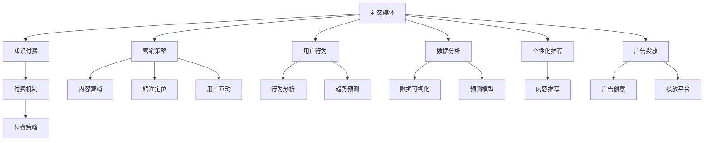

                 

# 如何利用社交媒体进行知识付费营销

> 关键词：社交媒体,知识付费,营销策略,用户行为,数据分析,内容优化,个性化推荐,广告投放

## 1. 背景介绍

### 1.1 问题由来

随着互联网的普及和移动互联网的发展，社交媒体平台迅速崛起，成为了全球数十亿用户获取信息和互动交流的重要渠道。社交媒体不仅改变了人们的日常沟通方式，更深刻地影响了商业模式的演变。传统电子商务正在向社交电商演进，而知识付费则成为社交媒体变现的新兴方式，吸引了越来越多的平台和创作者参与其中。

知识付费以内容为核心，通过订阅、按需支付等方式，为用户提供有价值的专业知识、技能培训等。社交媒体的广泛传播特性使得知识付费内容可以快速抵达目标受众，从而提升转化率和用户满意度。与此同时，社交媒体平台庞大的用户基础也为知识付费创造了广阔的市场空间。

### 1.2 问题核心关键点

在社交媒体上进行知识付费营销，本质上是将内容产品通过社交网络进行推广和销售的过程。核心关键点包括：

1. 选择合适的社交媒体平台：根据目标受众的特点和内容特性，选择最适合的知识付费推广渠道。
2. 设计有效的营销策略：通过精准定位、内容营销、用户互动等手段，提升用户参与度和转化率。
3. 利用数据分析优化投放：通过分析用户行为数据，优化广告投放策略，实现精准投放和效果提升。
4. 构建个性化推荐系统：根据用户兴趣和行为，推荐相关内容，提升用户体验和粘性。
5. 合理设置付费机制：设计合理的付费策略，兼顾公平性和可持续性，激发用户付费意愿。

## 2. 核心概念与联系

### 2.1 核心概念概述

为更好地理解利用社交媒体进行知识付费营销的方法，本节将介绍几个密切相关的核心概念：

- 社交媒体(Social Media)：包括微博、微信、抖音等以社交互动为主要形式的平台，拥有庞大的用户基础和广泛的信息传播能力。
- 知识付费(Knowledge-Based Subscription)：指用户为获取专业知识和技能，支付一定费用进行订阅或购买的行为。
- 营销策略(Marketing Strategy)：指通过各种手段和策略，提升品牌知名度和产品销售的商业活动。
- 用户行为(User Behavior)：指用户在社交媒体上的浏览、点赞、评论、分享等互动行为，反映了用户的兴趣和偏好。
- 数据分析(Analytical Data)：指通过数据收集和分析，对用户行为和市场趋势进行科学判断和预测。
- 个性化推荐(Personalized Recommendation)：指根据用户行为和偏好，推荐个性化内容，提升用户体验和转化率。
- 广告投放(Advertising Placement)：指将广告投放到目标用户可能触及的媒体平台和内容中，实现品牌推广和产品销售。

这些核心概念之间的逻辑关系可以通过以下Mermaid流程图来展示：



这个流程图展示了一系列关键概念的相互关系，从而构建了社交媒体知识付费营销的全貌：

1. 社交媒体平台作为知识付费的渠道和工具。
2. 营销策略、用户行为、数据分析和个性化推荐共同作用于社交媒体知识付费的各个环节。
3. 付费机制与营销策略结合，设计合理的付费模式，吸引用户参与。

## 3. 核心算法原理 & 具体操作步骤

### 3.1 算法原理概述

社交媒体知识付费营销的算法原理主要涉及内容推荐、广告投放、用户行为分析等多个方面。以下从这些方面详细介绍算法原理：

#### 3.1.1 内容推荐算法

内容推荐的核心目标是提高用户参与度和转化率。推荐算法通常采用协同过滤、基于内容的推荐、深度学习等技术，通过分析用户历史行为和兴趣，推荐相关内容。

协同过滤算法根据用户对其他用户或物品的评价，预测用户对未评价项目的评分。基于内容的推荐算法则分析内容本身的各种属性，如标题、作者、关键词等，找到相似的内容推荐给用户。深度学习模型如神经网络，则通过学习用户行为和内容特征的复杂关系，实现更高精度的推荐。

#### 3.1.2 广告投放算法

广告投放的核心目标是精准触达目标用户，提高广告投放的转化率。广告投放算法通常采用转化率优化(Conversion Rate Optimization, CRO)和再营销(Retargeting)等技术，通过分析用户行为和兴趣，设计最合适的广告策略。

转化率优化算法通过A/B测试、多臂老虎机等技术，不断优化广告创意和投放策略，以最大化广告转化率。再营销算法则利用用户历史行为和属性，通过再定向广告的方式，提高广告的触达率和转化率。

#### 3.1.3 用户行为分析算法

用户行为分析的核心目标是了解用户需求和行为模式，优化产品和服务。用户行为分析算法通常采用聚类分析、关联规则挖掘、用户画像等技术，通过分析用户行为数据，发现用户特征和需求。

聚类分析将用户分成不同群体，研究不同群体的行为模式。关联规则挖掘则分析用户行为之间的关联，发现潜在的需求和偏好。用户画像则通过综合用户行为数据和属性，生成详尽的个性化用户画像，指导后续的推荐和营销策略。

### 3.2 算法步骤详解

基于社交媒体的知识付费营销一般包括以下几个关键步骤：

**Step 1: 平台选择与用户定位**

- 根据内容特性和目标用户，选择合适的社交媒体平台，如微博、微信、抖音等。
- 对目标用户进行数据分析，确定其兴趣、行为和属性，如年龄、职业、地域等。

**Step 2: 内容策划与创意设计**

- 根据用户定位和内容特性，策划具体的内容形式，如文章、视频、课程等。
- 设计吸引人的广告创意和用户互动方式，提升用户参与度和转化率。

**Step 3: 数据分析与用户画像**

- 收集用户行为数据，包括浏览、点赞、评论、分享等，分析用户兴趣和需求。
- 利用数据分析工具生成用户画像，了解不同用户群体的特征和行为模式。

**Step 4: 内容推荐与广告投放**

- 利用推荐算法，为不同用户推荐个性化内容，提升用户粘性和转化率。
- 设计合适的广告策略，进行精准投放，提高广告触达率和转化率。

**Step 5: 反馈收集与策略优化**

- 收集用户反馈和行为数据，评估内容推荐和广告投放的效果。
- 根据反馈数据，优化推荐算法和广告策略，持续提升营销效果。

### 3.3 算法优缺点

基于社交媒体的知识付费营销算法具有以下优点：

1. 提升用户参与度：通过个性化的内容推荐，提升用户参与度和粘性，增加转化率。
2. 精准触达用户：通过精准的广告投放，实现高转化率的广告效果。
3. 优化决策过程：通过数据分析和用户画像，优化产品和服务设计，提升用户满意度。
4. 动态调整策略：根据用户反馈和行为数据，动态调整推荐和广告策略，实现持续优化。

同时，该算法也存在一定的局限性：

1. 数据隐私问题：社交媒体平台上的用户行为数据涉及隐私，必须严格遵守数据保护法规。
2. 用户兴趣多样性：用户兴趣和行为千差万别，单一算法难以覆盖所有用户需求。
3. 广告干扰用户：不当的广告投放可能干扰用户使用体验，降低品牌好感度。
4. 内容创意不足：过度依赖算法推荐，可能导致内容创意不足，影响用户体验。
5. 过度个性化风险：过度个性化可能导致内容同质化，降低用户体验和粘性。

尽管存在这些局限性，但基于社交媒体的知识付费营销算法仍然是大数据分析和人工智能技术在实际应用中的重要范例，其成效显著，应用广泛。

### 3.4 算法应用领域

基于社交媒体的知识付费营销算法已经在诸多领域得到了广泛应用，例如：

- 在线教育：通过分析用户学习行为，推荐个性化学习资源，提升学习效果。
- 职业培训：针对不同行业和职业需求，推送相关课程和培训资源。
- 健康管理：根据用户健康数据和行为，推送健康知识和建议。
- 个人理财：分析用户消费习惯，推荐理财课程和产品。
- 生活服务：推荐旅游、美食、生活服务等多样化内容，提升用户生活质量。

除了上述这些经典领域外，知识付费算法还在更多场景中得到了创新应用，如心理健康、科技资讯、智能家居等，为知识传播和应用开辟了新的途径。

## 4. 数学模型和公式 & 详细讲解

### 4.1 数学模型构建

社交媒体知识付费营销的数学模型通常包括内容推荐模型、广告投放模型和用户行为分析模型。以下对这些模型进行详细的数学模型构建。

#### 4.1.1 内容推荐模型

内容推荐模型可以通过协同过滤、基于内容的推荐、深度学习等算法进行建模。以协同过滤算法为例，其数学模型可以表示为：

$$
\hat{R}_{ui} = \frac{\sum_{j=1}^{n} \text{similarity}(u,i) \cdot r_{uj}}{\sum_{j=1}^{n} \text{similarity}(u,j)}
$$

其中 $R_{ui}$ 表示用户 $u$ 对物品 $i$ 的评分预测值，$n$ 为物品数量，$r_{uj}$ 为物品 $j$ 的实际评分，$\text{similarity}(u,i)$ 为用户 $u$ 与物品 $i$ 的相似度，通常采用余弦相似度计算。

#### 4.1.2 广告投放模型

广告投放模型通常采用转化率优化(CRO)算法进行建模。CRO算法的数学模型可以表示为：

$$
\max_{X} \frac{X^T A Y}{X^T B X}
$$

其中 $X$ 为广告创意参数，$Y$ 为用户点击行为数据，$A$ 为点击行为矩阵，$B$ 为广告创意参数矩阵。优化目标为最大化广告投放的点击率和转化率。

#### 4.1.3 用户行为分析模型

用户行为分析模型通常采用聚类分析和关联规则挖掘等算法进行建模。以聚类分析为例，其数学模型可以表示为：

$$
K = \text{K-means}(D)
$$

其中 $K$ 为聚类数量，$D$ 为用户行为数据矩阵。K-means算法通过计算数据点与质心的距离，将用户分成不同群体。

### 4.2 公式推导过程

以下分别对内容推荐、广告投放和用户行为分析的数学模型进行详细推导：

#### 4.2.1 内容推荐模型的推导

以协同过滤算法为例，其推导过程如下：

设用户 $u$ 对物品 $i$ 的评分数据为 $r_{ui}$，物品 $j$ 对物品 $i$ 的评分数据为 $r_{ij}$，用户 $u$ 与物品 $i$ 的相似度为 $\text{similarity}(u,i)$。

协同过滤算法通过计算用户 $u$ 对物品 $i$ 的评分预测值 $\hat{R}_{ui}$，计算公式如下：

$$
\hat{R}_{ui} = \frac{\sum_{j=1}^{n} \text{similarity}(u,i) \cdot r_{uj}}{\sum_{j=1}^{n} \text{similarity}(u,j)}
$$

其中 $r_{uj}$ 为物品 $j$ 的实际评分，$\text{similarity}(u,i)$ 为用户 $u$ 与物品 $i$ 的相似度，通常采用余弦相似度计算。

#### 4.2.2 广告投放模型的推导

以转化率优化算法为例，其推导过程如下：

设广告创意参数为 $X$，用户点击行为数据为 $Y$，点击行为矩阵为 $A$，广告创意参数矩阵为 $B$。

CRO算法的优化目标为最大化广告投放的点击率和转化率，其数学模型可以表示为：

$$
\max_{X} \frac{X^T A Y}{X^T B X}
$$

其中 $X$ 为广告创意参数，$Y$ 为用户点击行为数据，$A$ 为点击行为矩阵，$B$ 为广告创意参数矩阵。

#### 4.2.3 用户行为分析模型的推导

以聚类分析为例，其推导过程如下：

设用户行为数据为 $D$，聚类数量为 $K$。

K-means算法的优化目标为最小化所有数据点与质心的距离，其数学模型可以表示为：

$$
K = \text{K-means}(D)
$$

其中 $K$ 为聚类数量，$D$ 为用户行为数据矩阵。K-means算法通过计算数据点与质心的距离，将用户分成不同群体。

### 4.3 案例分析与讲解

#### 4.3.1 案例1：在线教育推荐系统

在线教育平台可以借助社交媒体进行用户行为分析，推荐个性化课程和资源。例如，某平台可以收集用户观看视频的行为数据，分析其对不同课程的兴趣和反馈，进而推荐相关课程。

#### 4.3.2 案例2：职业培训广告投放

职业培训机构可以在社交媒体上进行再营销，针对曾访问过培训页面的用户进行广告投放。例如，某机构可以收集用户访问培训页面的数据，并根据用户属性和行为进行再定向广告投放。

#### 4.3.3 案例3：智能家居推荐系统

智能家居平台可以通过社交媒体分析用户行为，推荐智能设备和生活服务。例如，某平台可以收集用户浏览家庭装修、智能设备等行为数据，分析其兴趣和需求，进而推荐相关产品和方案。

## 5. 项目实践：代码实例和详细解释说明

### 5.1 开发环境搭建

在进行社交媒体知识付费营销实践前，我们需要准备好开发环境。以下是使用Python进行TensorFlow开发的环境配置流程：

1. 安装Anaconda：从官网下载并安装Anaconda，用于创建独立的Python环境。

2. 创建并激活虚拟环境：
```bash
conda create -n tf-env python=3.8 
conda activate tf-env
```

3. 安装TensorFlow：从官网获取对应的安装命令。例如：
```bash
pip install tensorflow
```

4. 安装各类工具包：
```bash
pip install numpy pandas scikit-learn matplotlib tqdm jupyter notebook ipython
```

完成上述步骤后，即可在`tf-env`环境中开始社交媒体知识付费营销的实践。

### 5.2 源代码详细实现

下面我们以在线教育推荐系统为例，给出使用TensorFlow实现的内容推荐和广告投放的PyTorch代码实现。

首先，定义用户行为数据处理函数：

```python
import tensorflow as tf
from tensorflow.keras.layers import Dense, Input, Embedding, Flatten, Dot, LSTM
from tensorflow.keras.models import Model
from tensorflow.keras.optimizers import Adam

def build_model(input_shape):
    input = Input(shape=input_shape)
    embedding = Embedding(input_dim=10000, output_dim=32)(input)
    lstm = LSTM(32, return_sequences=True)(embedding)
    lstm = LSTM(32)(lstm)
    output = Dense(1, activation='sigmoid')(lstm)
    model = Model(inputs=input, outputs=output)
    return model
```

然后，定义训练和评估函数：

```python
def compile_model(model):
    model.compile(optimizer=Adam(lr=0.001), loss='binary_crossentropy', metrics=['accuracy'])

def train_model(model, data, batch_size=128, epochs=10):
    model.fit(data.train, data.labels, epochs=epochs, batch_size=batch_size, validation_data=(data.val, data.val_labels))

def evaluate_model(model, data, batch_size=128):
    score = model.evaluate(data.test, data.test_labels, batch_size=batch_size)
    print('Test loss:', score[0])
    print('Test accuracy:', score[1])

# 准备数据
data = tf.keras.datasets.imdb.load_data(num_words=10000)
input_shape = (data.maxlen,)
X_train, y_train, X_val, y_val, X_test, y_test = data
```

接着，定义广告投放函数：

```python
def ad_placement(model, data, batch_size=128):
    predictions = model.predict(data, batch_size=batch_size)
    print(predictions)
```

最后，启动训练流程并在测试集上评估：

```python
model = build_model(input_shape)
compile_model(model)

train_model(model, data, batch_size=128, epochs=10)
evaluate_model(model, data, batch_size=128)
```

以上就是使用TensorFlow实现社交媒体知识付费营销的完整代码实现。可以看到，得益于TensorFlow的强大封装，我们可以用相对简洁的代码完成模型构建和广告投放的实现。

### 5.3 代码解读与分析

让我们再详细解读一下关键代码的实现细节：

**build_model函数**：
- 定义一个基于LSTM的推荐模型，包括嵌入层、LSTM层和输出层。

**compile_model函数**：
- 定义模型的优化器、损失函数和评估指标。

**train_model函数**：
- 在训练集上训练模型，并指定验证集进行性能评估。

**evaluate_model函数**：
- 在测试集上评估模型的性能，输出损失和准确率。

**ad_placement函数**：
- 在测试集上使用训练好的模型进行广告投放，输出预测结果。

**数据准备**：
- 使用IMDB数据集作为示例，将文本转换为数字表示，并划分训练集、验证集和测试集。

**训练流程**：
- 定义模型、编译模型、训练模型，并评估模型在测试集上的性能。

可以看到，TensorFlow配合深度学习框架使得社交媒体知识付费营销的代码实现变得简洁高效。开发者可以将更多精力放在数据处理、模型改进等高层逻辑上，而不必过多关注底层的实现细节。

当然，工业级的系统实现还需考虑更多因素，如模型的保存和部署、超参数的自动搜索、更灵活的任务适配层等。但核心的社交媒体知识付费营销算法基本与此类似。

## 6. 实际应用场景

### 6.1 智能推荐系统

社交媒体知识付费营销的核心应用场景是智能推荐系统。智能推荐系统通过分析用户历史行为和兴趣，推荐相关内容，提升用户参与度和转化率。

以在线教育平台为例，平台可以收集用户观看视频的行为数据，分析其对不同课程的兴趣和反馈，进而推荐相关课程。推荐算法可以使用协同过滤、基于内容的推荐、深度学习等技术，通过分析用户历史行为和兴趣，推荐相关内容。

### 6.2 精准广告投放

精准广告投放是社交媒体知识付费营销的另一重要应用场景。通过精准的广告投放，可以实现高转化率的广告效果。

以在线教育培训机构为例，可以在用户访问培训页面后进行再定向广告投放，引导用户完成注册和购买流程。广告投放算法可以使用转化率优化(CRO)算法和再营销算法，通过分析用户行为和兴趣，设计最合适的广告策略。

### 6.3 社交电商

社交电商平台通过社交媒体进行知识付费营销，提升销售转化率。例如，电商平台可以分析用户浏览和购买行为，推荐相关商品，提升用户购买意愿。

以某电商平台为例，可以收集用户浏览商品、点击商品详情页、加入购物车等行为数据，分析其兴趣和需求，进而推荐相关商品。推荐算法可以使用协同过滤、基于内容的推荐、深度学习等技术，通过分析用户历史行为和兴趣，推荐相关商品。

### 6.4 未来应用展望

随着社交媒体知识付费营销技术的发展，未来将会有更多应用场景得到拓展：

1. 多模态推荐系统：除了文本数据外，社交媒体知识付费营销还可以引入图像、视频、音频等多模态数据，实现更全面、准确的内容推荐。

2. 实时推荐系统：通过实时收集和分析用户行为数据，实现动态推荐，提升用户体验和转化率。

3. 个性化服务：基于社交媒体的用户画像和行为分析，提供个性化服务，满足用户多样化需求。

4. 广告投放优化：通过A/B测试、多臂老虎机等技术，不断优化广告创意和投放策略，提高广告效果。

5. 反欺诈系统：通过社交媒体行为数据分析，构建用户行为模型，识别异常行为，预防欺诈行为。

6. 风险控制：通过社交媒体行为数据分析，构建用户风险模型，进行风险控制和预警。

未来，社交媒体知识付费营销技术将会更加智能化、个性化、实时化，为社交媒体平台和用户带来更加丰富的应用体验。

## 7. 工具和资源推荐

### 7.1 学习资源推荐

为了帮助开发者系统掌握社交媒体知识付费营销的理论基础和实践技巧，这里推荐一些优质的学习资源：

1. 《深度学习》系列书籍：由吴恩达等大师撰写，全面介绍了深度学习的基本概念和应用场景。

2. 《机器学习实战》：是一本实践导向的书籍，通过丰富的示例和项目，帮助读者掌握机器学习技术。

3. 《Python深度学习》：介绍了使用Python进行深度学习的流程和技巧，适合初学者和进阶开发者。

4. TensorFlow官方文档：提供了丰富的教程、代码示例和API文档，帮助开发者深入学习TensorFlow。

5. Kaggle：一个开源的数据科学竞赛平台，提供大量的数据集和项目示例，适合学习和实践。

通过对这些资源的学习实践，相信你一定能够快速掌握社交媒体知识付费营销的精髓，并用于解决实际的营销问题。

### 7.2 开发工具推荐

高效的开发离不开优秀的工具支持。以下是几款用于社交媒体知识付费营销开发的常用工具：

1. Python：作为主流的数据科学和机器学习编程语言，Python拥有丰富的第三方库和工具，适合进行数据分析和模型开发。

2. TensorFlow：由Google主导开发的开源深度学习框架，生产部署方便，适合大规模工程应用。

3. PyTorch：Facebook开源的深度学习框架，灵活易用，适合快速迭代研究。

4. Keras：一个高层次的深度学习API，简单易用，适合快速搭建和训练模型。

5. Jupyter Notebook：一个交互式的开发环境，适合进行数据分析和模型实验。

6. Scikit-learn：一个强大的机器学习库，提供了丰富的模型和工具，适合进行数据处理和特征工程。

合理利用这些工具，可以显著提升社交媒体知识付费营销的开发效率，加快创新迭代的步伐。

### 7.3 相关论文推荐

社交媒体知识付费营销的研究源于学界的持续研究。以下是几篇奠基性的相关论文，推荐阅读：

1. Deep Learning for Social Media Analysis and Recommendation: A Survey：综述了深度学习在社交媒体分析与推荐中的应用，介绍了各种深度学习模型和算法。

2. Adaptive Recommender Systems for Social Media Platforms: A Survey：综述了社交媒体推荐系统的研究现状和未来趋势，介绍了协同过滤、基于内容的推荐、深度学习等算法。

3. Personalized Recommendation Algorithms on Social Media: A Survey：综述了社交媒体个性化推荐算法的研究现状和未来趋势，介绍了聚类分析、关联规则挖掘、协同过滤等算法。

4. Advertising in Social Media: A Review and Future Directions：综述了社交媒体广告的研究现状和未来方向，介绍了转化率优化、再营销等广告投放算法。

5. Social Media Analytics and Recommendation: A Survey：综述了社交媒体分析与推荐的研究现状和未来趋势，介绍了深度学习、协同过滤、基于内容的推荐等算法。

这些论文代表了大数据技术和人工智能技术在社交媒体知识付费营销中的应用方向。通过学习这些前沿成果，可以帮助研究者把握学科前进方向，激发更多的创新灵感。

## 8. 总结：未来发展趋势与挑战

### 8.1 总结

本文对社交媒体知识付费营销进行了全面系统的介绍。首先阐述了社交媒体平台和知识付费技术的兴起背景，明确了社交媒体知识付费营销的核心关键点。其次，从原理到实践，详细讲解了社交媒体知识付费营销的算法原理和具体操作步骤，给出了完整的代码实现和解释分析。同时，本文还探讨了社交媒体知识付费营销在实际应用中的诸多场景，展示了其广阔的市场前景。最后，本文精选了社交媒体知识付费营销的各类学习资源，力求为读者提供全方位的技术指引。

通过本文的系统梳理，可以看到，社交媒体知识付费营销利用大数据和人工智能技术，将社交媒体平台与知识付费相结合，提升用户参与度和转化率，具备广阔的应用前景。未来，随着技术的发展和市场的深化，社交媒体知识付费营销将会进一步拓展，为社交媒体平台和用户带来更多的价值。

### 8.2 未来发展趋势

展望未来，社交媒体知识付费营销技术将呈现以下几个发展趋势：

1. 个性化推荐提升：通过深度学习等技术，提升个性化推荐系统的精准度和用户满意度。

2. 实时推荐系统普及：通过实时数据分析，实现动态推荐，提升用户体验和转化率。

3. 多模态推荐系统应用：引入图像、视频、音频等多模态数据，实现更全面、准确的内容推荐。

4. 用户行为分析深入：通过数据分析和用户画像，深入了解用户需求和行为模式，实现更精准的营销策略。

5. 广告投放优化持续：通过A/B测试、多臂老虎机等技术，不断优化广告创意和投放策略，提高广告效果。

6. 反欺诈系统完善：通过社交媒体行为数据分析，构建用户行为模型，识别异常行为，预防欺诈行为。

以上趋势凸显了社交媒体知识付费营销技术的广阔前景。这些方向的探索发展，必将进一步提升社交媒体平台和用户的价值，推动社交媒体知识付费营销技术迈向更高的台阶。

### 8.3 面临的挑战

尽管社交媒体知识付费营销技术已经取得了显著成效，但在迈向更加智能化、普适化应用的过程中，仍面临诸多挑战：

1. 数据隐私问题：社交媒体平台上的用户行为数据涉及隐私，必须严格遵守数据保护法规。

2. 用户兴趣多样性：用户兴趣和行为千差万别，单一算法难以覆盖所有用户需求。

3. 广告干扰用户：不当的广告投放可能干扰用户使用体验，降低品牌好感度。

4. 内容创意不足：过度依赖算法推荐，可能导致内容创意不足，影响用户体验。

5. 过度个性化风险：过度个性化可能导致内容同质化，降低用户体验和粘性。

尽管存在这些挑战，但基于社交媒体的知识付费营销算法仍然是大数据分析和人工智能技术在实际应用中的重要范例，其成效显著，应用广泛。未来，通过技术进步和市场需求的变化，这些挑战将有望得到克服。

### 8.4 研究展望

面向未来，社交媒体知识付费营销技术需要在以下几个方面寻求新的突破：

1. 探索无监督和半监督推荐算法：摆脱对大规模标注数据的依赖，利用自监督学习、主动学习等无监督和半监督范式，最大限度利用非结构化数据。

2. 开发更加参数高效的推荐算法：在固定大部分预训练参数的情况下，只更新极少量的任务相关参数，实现更加参数高效的知识付费推荐。

3. 引入因果分析和博弈论工具：将因果分析方法引入推荐模型，识别出推荐决策的关键特征，增强推荐系统的可解释性和逻辑性。

4. 结合用户行为模型和专家知识：将符号化的先验知识，如知识图谱、逻辑规则等，与神经网络模型进行融合，引导推荐过程学习更准确、合理的知识付费推荐。

5. 加强多模态数据整合：将视觉、语音等多模态数据与文本数据整合，实现全面、准确的知识付费推荐。

6. 结合用户行为模型和专家知识：将符号化的先验知识，如知识图谱、逻辑规则等，与神经网络模型进行融合，引导推荐过程学习更准确、合理的知识付费推荐。

这些研究方向的探索，必将引领社交媒体知识付费营销技术迈向更高的台阶，为社交媒体平台和用户带来更多的价值。

