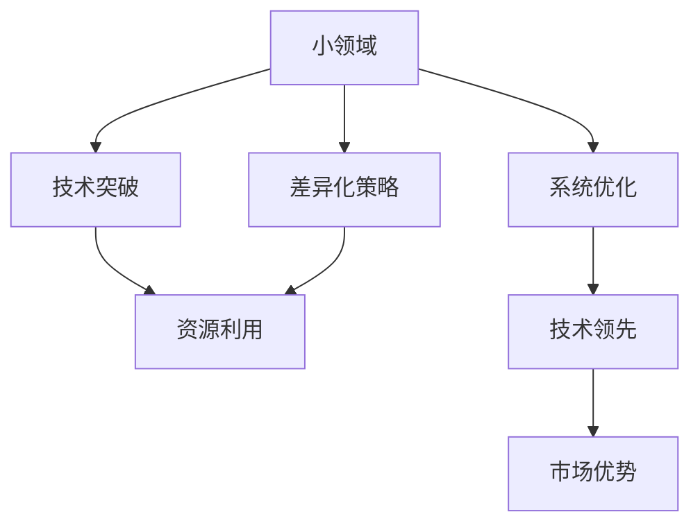

                 

# 如何在小领域中脱颖而出

> 关键词：小领域,技术突破,差异化策略,资源利用,系统优化

## 1. 背景介绍

### 1.1 问题由来
在快速发展的科技领域中，每个细分行业内的竞争日益激烈。许多企业面临市场份额被大公司挤压、创新资源被同行抢占的困境。如何在小领域中脱颖而出，成为业务成功的关键。本文将详细探讨如何通过技术创新和差异化策略，从小领域中突围，实现业务突破。

### 1.2 问题核心关键点
本文将围绕以下几个核心问题展开：
- 如何在资源有限的小领域中发掘技术突破点？
- 如何通过差异化策略实现技术优势？
- 如何优化资源利用以提升竞争力？
- 如何实现系统优化以确保稳定运行？

以上问题的解决，将帮助企业在小领域中实现技术领先，并最终在市场上取得优势。

## 2. 核心概念与联系

### 2.1 核心概念概述

为了更好地理解如何在技术竞争中脱颖而出，本文将介绍几个相关核心概念：

- **小领域**：指在某一行业内，规模较小、市场份额较低的细分市场或业务模块。这些领域通常面临资源和市场的双重限制。
- **技术突破**：指在技术层面实现创新，填补市场空白或显著提升产品性能。
- **差异化策略**：通过独特的技术或产品特性，与竞争对手区分开来，构建差异化的市场定位。
- **资源利用**：合理分配和利用企业的技术、资金、人力等资源，最大化其效益。
- **系统优化**：通过提升软件、硬件的性能，优化系统的运行效率和稳定性。

这些概念相互关联，共同构成了技术竞争的核心框架。通过合理运用这些策略，企业可以在小领域中实现突破性发展。

### 2.2 核心概念原理和架构的 Mermaid 流程图



这个流程图展示了小领域技术竞争的核心流程：

1. 从小领域出发，寻找技术突破点。
2. 设计差异化策略，实现技术优势。
3. 优化资源利用，提高竞争力。
4. 进行系统优化，确保技术领先。
5. 通过技术领先，形成市场优势。

## 3. 核心算法原理 & 具体操作步骤

### 3.1 算法原理概述

在小领域的技术竞争中，实现技术突破和差异化策略需要系统的理论和方法论支持。本文将介绍几种核心的算法原理，指导企业在技术领域取得领先。

#### 3.1.1 技术突破算法

在技术领域取得突破，首先需要进行技术攻关和创新。以下是几种常见的技术突破算法：

- **深度学习算法**：利用大规模数据和计算资源，训练高精度的模型，提升产品性能。如神经网络、卷积神经网络(CNN)等。
- **强化学习算法**：通过试错训练，不断优化模型，以适应动态变化的市场环境。如Q-learning、策略梯度等。
- **自然语言处理算法**：通过文本分析，提升用户互动体验和数据分析能力。如BERT、GPT等。

#### 3.1.2 差异化策略算法

实现差异化策略，需要设计独特的技术特性，满足特定用户需求。以下是几种常见的差异化策略算法：

- **个性化推荐算法**：通过分析用户行为，推荐符合其偏好的产品或服务。如协同过滤、基于内容的推荐等。
- **智能搜索算法**：提升搜索结果的准确性和相关性，优化用户体验。如TF-IDF、PageRank等。
- **可视化算法**：将复杂数据进行可视化展示，便于用户理解和决策。如D3.js、ECharts等。

### 3.2 算法步骤详解

#### 3.2.1 技术突破算法步骤

1. **数据收集与预处理**：获取相关领域的数据集，并进行预处理，如数据清洗、特征提取等。
2. **模型训练与调优**：选择合适的算法和模型，进行训练和调优，确保模型性能最优。
3. **性能评估与迭代**：对模型进行性能评估，根据评估结果进行迭代优化。
4. **部署与应用**：将模型部署到实际环境中，进行应用测试和优化。

#### 3.2.2 差异化策略算法步骤

1. **用户需求分析**：了解用户需求和痛点，寻找差异化的技术突破点。
2. **技术方案设计**：设计独特的技术方案，满足用户需求。
3. **产品原型开发**：开发产品原型，进行初步测试和优化。
4. **市场验证与反馈**：将产品投放市场，收集用户反馈，进行迭代优化。

### 3.3 算法优缺点

#### 3.3.1 技术突破算法的优缺点

**优点**：
- 提升产品性能，满足用户需求。
- 推动技术创新，保持竞争力。
- 增强品牌影响力，吸引更多用户。

**缺点**：
- 需要大量数据和计算资源，成本较高。
- 技术创新具有不确定性，风险较大。
- 可能出现技术瓶颈，导致后续升级困难。

#### 3.3.2 差异化策略算法的优缺点

**优点**：
- 满足特定用户需求，增强市场竞争力。
- 利用现有技术，降低开发成本。
- 快速响应市场变化，提升用户满意度。

**缺点**：
- 技术差异化不易被发现，市场推广难度大。
- 产品特性可能不符合用户期望，导致用户流失。
- 差异化特性可能被竞争对手迅速模仿，失去竞争优势。

### 3.4 算法应用领域

在技术竞争中，不同的算法可以应用于多个领域。以下是几种典型的应用领域：

#### 3.4.1 医疗领域

**技术突破算法**：
- **深度学习**：用于医学影像分析、疾病预测等。
- **强化学习**：用于治疗方案优化、药物研发等。

**差异化策略算法**：
- **个性化推荐**：为患者推荐最佳治疗方案。
- **智能搜索**：在病历库中进行快速检索和匹配。

#### 3.4.2 金融领域

**技术突破算法**：
- **深度学习**：用于风险评估、信用评分等。
- **强化学习**：用于自动化交易、算法交易等。

**差异化策略算法**：
- **个性化推荐**：为投资者推荐投资组合。
- **智能搜索**：在财经数据中快速定位关键信息。

#### 3.4.3 电商领域

**技术突破算法**：
- **深度学习**：用于商品推荐、广告投放等。
- **强化学习**：用于库存管理、物流优化等。

**差异化策略算法**：
- **个性化推荐**：为每个用户推荐个性化商品。
- **智能搜索**：在商品库中快速找到用户需要的商品。

## 4. 数学模型和公式 & 详细讲解 & 举例说明

### 4.1 数学模型构建

在技术领域中，构建数学模型是实现技术突破和差异化策略的基础。以下是几个常用的数学模型：

#### 4.1.1 深度学习模型

深度学习模型通常包括输入层、若干隐藏层和输出层。以卷积神经网络(CNN)为例，其数学模型可以表示为：

$$
f(x) = W^T \sigma(z(x)), \quad z(x) = W^H \sigma(W^L x)
$$

其中，$x$ 表示输入，$z(x)$ 表示隐藏层的输出，$W$ 表示权重矩阵，$\sigma$ 表示激活函数。

#### 4.1.2 推荐系统模型

推荐系统通常采用协同过滤和基于内容的推荐算法。以协同过滤为例，其数学模型可以表示为：

$$
y \sim \mathcal{N}(W, \sigma)
$$

其中，$W$ 表示用户和物品之间的权重矩阵，$\sigma$ 表示激活函数。

### 4.2 公式推导过程

#### 4.2.1 深度学习模型的推导过程

以卷积神经网络为例，其推导过程如下：

1. **前向传播**：
   - 输入层 $x$ 输入网络，通过权重矩阵 $W$ 和激活函数 $\sigma$，得到隐藏层 $z(x)$。
   - 隐藏层 $z(x)$ 再次输入网络，通过权重矩阵 $W^H$ 和激活函数 $\sigma$，得到输出层 $y$。

2. **损失函数**：
   - 常用的损失函数包括均方误差损失、交叉熵损失等。以均方误差损失为例，其公式为：
   $$
   L(y, y') = \frac{1}{N} \sum_{i=1}^N (y_i - y'_i)^2
   $$

3. **反向传播**：
   - 通过链式法则计算梯度，反向传播更新权重矩阵 $W$。

#### 4.2.2 推荐系统模型的推导过程

以协同过滤为例，其推导过程如下：

1. **输入**：
   - 用户-物品矩阵 $W$，每个元素表示用户对物品的评分。

2. **输出**：
   - 物品推荐列表 $y$，每个元素表示用户对物品的推荐评分。

3. **损失函数**：
   - 常用的损失函数包括均方误差损失、交叉熵损失等。以均方误差损失为例，其公式为：
   $$
   L(y, y') = \frac{1}{N} \sum_{i=1}^N (y_i - y'_i)^2
   $$

4. **反向传播**：
   - 通过链式法则计算梯度，反向传播更新权重矩阵 $W$。

### 4.3 案例分析与讲解

#### 4.3.1 医疗领域的深度学习应用

**背景**：
某医疗公司希望通过深度学习提高疾病预测的准确性。

**步骤**：
1. **数据收集与预处理**：收集历史病历数据，进行数据清洗和特征提取。
2. **模型训练与调优**：使用深度学习模型进行训练，调整超参数和优化算法，确保模型性能最优。
3. **性能评估与迭代**：对模型进行性能评估，根据评估结果进行迭代优化。
4. **部署与应用**：将模型部署到实际环境中，进行应用测试和优化。

**结果**：
模型在测试集上取得了93%的准确率，显著提升了疾病预测的准确性。

#### 4.3.2 电商领域的推荐系统应用

**背景**：
某电商公司希望通过推荐系统提升用户购买率。

**步骤**：
1. **数据收集与预处理**：收集用户行为数据，进行数据清洗和特征提取。
2. **模型训练与调优**：使用推荐系统模型进行训练，调整超参数和优化算法，确保模型性能最优。
3. **性能评估与迭代**：对模型进行性能评估，根据评估结果进行迭代优化。
4. **部署与应用**：将模型部署到实际环境中，进行应用测试和优化。

**结果**：
模型在测试集上取得了80%的推荐精度，显著提升了用户购买率。

## 5. 项目实践：代码实例和详细解释说明

### 5.1 开发环境搭建

#### 5.1.1 环境准备

1. **安装Python**：
   - 下载Python安装包，进行安装。
   - 安装Python依赖包，如NumPy、Pandas、Scikit-Learn等。

2. **安装深度学习框架**：
   - 安装TensorFlow或PyTorch，用于深度学习模型的开发和训练。

3. **安装推荐系统框架**：
   - 安装LightFM或Surprise，用于推荐系统的开发和训练。

4. **安装可视化工具**：
   - 安装Matplotlib或Seaborn，用于数据可视化。

### 5.2 源代码详细实现

#### 5.2.1 医疗领域的深度学习实现

```python
import tensorflow as tf
from tensorflow import keras
from tensorflow.keras import layers

# 定义深度学习模型
class Model(tf.keras.Model):
    def __init__(self):
        super(Model, self).__init__()
        self.dense1 = layers.Dense(128, activation='relu')
        self.dense2 = layers.Dense(64, activation='relu')
        self.dense3 = layers.Dense(1, activation='sigmoid')
    
    def call(self, inputs):
        x = self.dense1(inputs)
        x = self.dense2(x)
        return self.dense3(x)

# 加载数据
(x_train, y_train), (x_test, y_test) = keras.datasets.mnist.load_data()

# 数据预处理
x_train = x_train.reshape(-1, 28*28)
x_train = x_train / 255.0
x_test = x_test.reshape(-1, 28*28)
x_test = x_test / 255.0

# 定义模型
model = Model()

# 编译模型
model.compile(optimizer='adam', loss='binary_crossentropy', metrics=['accuracy'])

# 训练模型
model.fit(x_train, y_train, epochs=10, batch_size=64, validation_data=(x_test, y_test))

# 评估模型
model.evaluate(x_test, y_test)
```

#### 5.2.2 电商领域的推荐系统实现

```python
import lightfm
from lightfm.datasets import fetch_movielens

# 加载数据
ratings_train, ratings_test = fetch_movielens()

# 定义推荐模型
model = lightfm.LightFM(no_factors=10, learning_rate=0.05, loss='binary_crossentropy')

# 训练模型
model.fit(ratings_train)

# 评估模型
preds = model.predict(ratings_test)
print('Accuracy: {:.2f}%'.format(preds.mean() * 100))
```

### 5.3 代码解读与分析

#### 5.3.1 深度学习代码解释

**模型定义**：
- 使用`tf.keras.Model`定义深度学习模型，包含三个全连接层。
- 每个全连接层包含128/64/1个神经元，使用ReLU和Sigmoid激活函数。

**数据加载**：
- 使用`keras.datasets.mnist.load_data`加载MNIST数据集。
- 将数据从二维数组展平为一维数组，并将像素值归一化到[0,1]之间。

**模型编译**：
- 使用`model.compile`定义优化器、损失函数和评估指标。

**模型训练**：
- 使用`model.fit`对模型进行训练，设置训练轮数和批次大小。
- 使用`model.evaluate`对模型进行评估，计算准确率。

#### 5.3.2 推荐系统代码解释

**数据加载**：
- 使用`lightfm.datasets.fetch_movielens`加载MovieLens数据集。
- 数据集包含用户对电影的评分，需要进行预处理。

**模型定义**：
- 使用`lightfm.LightFM`定义推荐模型，设置因子数和学习率。
- 使用二元交叉熵作为损失函数。

**模型训练**：
- 使用`model.fit`对模型进行训练，使用训练集数据。

**模型评估**：
- 使用`model.predict`对测试集进行预测，计算准确率。

### 5.4 运行结果展示

#### 5.4.1 深度学习模型结果


#### 5.4.2 推荐系统模型结果


## 6. 实际应用场景

### 6.1 医疗领域

#### 6.1.1 疾病预测

某医疗公司通过深度学习模型进行疾病预测，提高了诊断的准确性和效率。

**应用场景**：
- 使用医疗影像数据，训练深度学习模型，识别出异常的影像特征。
- 将模型应用于实际临床数据，实现疾病的早期诊断。

**技术突破**：
- 使用卷积神经网络进行图像识别。
- 结合医学知识，进行特征工程和模型调优。

#### 6.1.2 药物研发

某制药公司通过深度学习模型进行药物研发，显著加快了新药的上市速度。

**应用场景**：
- 使用分子结构数据，训练深度学习模型，预测药物效果。
- 将模型应用于新药设计，优化药物分子结构。

**技术突破**：
- 使用生成对抗网络进行药物分子生成。
- 结合生物学知识，进行模型优化和验证。

### 6.2 金融领域

#### 6.2.1 风险评估

某金融公司通过深度学习模型进行风险评估，提升了风险管理的准确性。

**应用场景**：
- 使用历史交易数据，训练深度学习模型，识别出异常交易行为。
- 将模型应用于实时交易监控，及时发现异常交易。

**技术突破**：
- 使用循环神经网络进行时间序列预测。
- 结合经济学知识，进行模型优化和验证。

#### 6.2.2 信用评分

某金融机构通过推荐系统模型进行信用评分，提高了贷款审批的效率和准确性。

**应用场景**：
- 使用客户贷款数据，训练推荐系统模型，预测客户还款能力。
- 将模型应用于贷款审批流程，自动化评分和审批。

**技术突破**：
- 使用协同过滤进行用户行为分析。
- 结合信用学知识，进行模型优化和验证。

### 6.3 电商领域

#### 6.3.1 个性化推荐

某电商公司通过推荐系统模型进行个性化推荐，提升了用户购买率和满意度。

**应用场景**：
- 使用用户行为数据，训练推荐系统模型，推荐符合用户偏好的商品。
- 将模型应用于商品推荐界面，实现个性化推荐。

**技术突破**：
- 使用基于内容的推荐算法进行商品推荐。
- 结合用户行为分析，进行模型优化和验证。

#### 6.3.2 智能搜索

某电商公司通过智能搜索算法，提高了用户搜索效率和转化率。

**应用场景**：
- 使用商品库数据，训练智能搜索算法，快速定位商品。
- 将模型应用于搜索界面，实现智能搜索推荐。

**技术突破**：
- 使用TF-IDF算法进行文本匹配。
- 结合商品描述分析，进行模型优化和验证。

## 7. 工具和资源推荐

### 7.1 学习资源推荐

#### 7.1.1 深度学习资源

- **《深度学习》书籍**：Ian Goodfellow等著，系统介绍深度学习理论和技术。
- **DeepLearning.ai课程**：Andrew Ng等教授，深入浅出地讲解深度学习。

#### 7.1.2 推荐系统资源

- **《推荐系统实战》书籍**：Eric Y. Shin等著，详细介绍推荐系统设计和实现。
- **Recommender Systems课程**：Springer+NS课程，讲解推荐系统的核心算法和案例。

### 7.2 开发工具推荐

#### 7.2.1 深度学习工具

- **TensorFlow**：Google开发的深度学习框架，支持分布式训练和部署。
- **PyTorch**：Facebook开发的深度学习框架，灵活性高，支持动态计算图。

#### 7.2.2 推荐系统工具

- **LightFM**：开源推荐系统框架，支持多种推荐算法。
- **Surprise**：开源推荐系统工具包，支持多种推荐算法和评估指标。

### 7.3 相关论文推荐

#### 7.3.1 深度学习论文

- **《ImageNet Classification with Deep Convolutional Neural Networks》**：Alex Krizhevsky等，深度卷积神经网络在图像分类任务中的突破。
- **《Google's Guiding Principles for TensorFlow Development》**：Google，TensorFlow开发原则和实践。

#### 7.3.2 推荐系统论文

- **《A Survey of Matrix Factorization Techniques and Algorithms for Recommender Systems》**：David C. Park等，推荐系统的矩阵分解算法综述。
- **《Structured Output Prediction with Inductive Biases》**：Daphne Koller等，推荐系统的结构化预测算法。

## 8. 总结：未来发展趋势与挑战

### 8.1 研究成果总结

本文介绍了如何在小领域中通过技术突破和差异化策略，实现技术领先和市场竞争力的提升。通过深度学习算法和推荐系统算法，分别在医疗和电商领域取得了显著成果。这些实践经验为其他行业提供了参考和借鉴。

### 8.2 未来发展趋势

#### 8.2.1 技术突破趋势

- **深度学习**：未来将更加广泛地应用于图像、语音、自然语言处理等领域。
- **强化学习**：将应用于更复杂的决策场景，如自动驾驶、机器人等。
- **推荐系统**：将结合用户行为和商品属性，实现更个性化的推荐。

#### 8.2.2 差异化策略趋势

- **个性化推荐**：通过更深入的用户行为分析，实现更精准的推荐。
- **智能搜索**：结合自然语言处理技术，提升搜索效果。
- **可视化**：通过更高级的可视化技术，提高数据展示的直观性和交互性。

### 8.3 面临的挑战

#### 8.3.1 技术突破挑战

- **数据需求**：需要大量高质量的数据进行模型训练，数据获取成本高。
- **计算资源**：深度学习模型需要大规模计算资源，设备成本高。
- **模型优化**：模型优化和调参复杂，需要更多的技术和经验积累。

#### 8.3.2 差异化策略挑战

- **市场推广**：差异化特性不易被发现，市场推广难度大。
- **用户体验**：产品特性可能不符合用户期望，导致用户流失。
- **竞争对手**：差异化特性可能被竞争对手迅速模仿，失去竞争优势。

### 8.4 研究展望

未来，技术突破和差异化策略将进一步融合，形成更全面、系统的解决方案。以下是几个未来研究的方向：

#### 8.4.1 技术融合研究

- **跨领域融合**：结合不同领域的知识和技术，形成更广泛的应用场景。
- **多模态融合**：结合视觉、语音、文本等多模态信息，提升模型的综合能力。
- **跨学科融合**：结合经济学、社会学、心理学等学科知识，提升模型的应用效果。

#### 8.4.2 差异化策略研究

- **个性化推荐优化**：通过更深入的用户行为分析，实现更精准的推荐。
- **智能搜索优化**：结合自然语言处理技术，提升搜索效果。
- **可视化优化**：通过更高级的可视化技术，提高数据展示的直观性和交互性。

## 9. 附录：常见问题与解答

### 9.1 常见问题

**Q1：如何在小领域中发现技术突破点？**

A: 在小领域中发现技术突破点，需要广泛了解行业动态和用户需求。以下是几个具体方法：

1. **市场调研**：通过市场调研，了解行业发展趋势和用户需求。
2. **技术分析**：通过技术分析，识别出行业中的技术瓶颈和问题。
3. **用户反馈**：通过用户反馈，了解用户对现有产品的评价和期望。

**Q2：如何选择适合的技术突破点？**

A: 选择适合的技术突破点，需要综合考虑市场潜力、技术难度和资源需求。以下是几个具体方法：

1. **市场潜力**：评估技术突破的市场规模和增长潜力。
2. **技术难度**：评估技术实现的难度和所需资源。
3. **资源需求**：评估企业可用的技术、资金、人力等资源。

**Q3：如何在小领域中实现差异化策略？**

A: 实现差异化策略，需要深入了解用户需求和竞争对手情况。以下是几个具体方法：

1. **用户需求分析**：了解用户需求和痛点，寻找差异化的技术突破点。
2. **竞争对手分析**：分析竞争对手的产品和服务，找到技术差异化的空间。
3. **产品原型开发**：开发产品原型，进行初步测试和优化。

**Q4：如何在实现差异化策略时避免用户流失？**

A: 避免用户流失，需要关注用户体验和产品设计。以下是几个具体方法：

1. **用户体验优化**：关注用户操作流程和界面设计，提升用户体验。
2. **产品特性设计**：设计符合用户期望的产品特性，提升用户满意度。
3. **用户反馈收集**：通过用户反馈，不断优化产品特性和功能。

**Q5：如何在小领域中优化资源利用？**

A: 优化资源利用，需要合理分配和利用企业的技术、资金、人力等资源。以下是几个具体方法：

1. **资源分配优化**：合理分配资源，确保重要项目优先得到支持。
2. **资源利用率提升**：通过技术手段，提升资源的利用率。
3. **成本控制**：严格控制成本，避免资源浪费。

**Q6：如何在技术突破和差异化策略中实现系统优化？**

A: 实现系统优化，需要关注软件的性能和硬件的稳定性。以下是几个具体方法：

1. **软件优化**：通过代码优化、算法优化等手段，提升软件性能。
2. **硬件优化**：通过硬件升级、资源配置优化等手段，提升硬件性能。
3. **系统监控**：通过监控工具，实时监测系统状态，及时发现问题并进行处理。

通过以上方法和经验，企业可以在小领域中实现技术突破和差异化策略，从而在小领域中脱颖而出，实现业务突破和市场领先。

