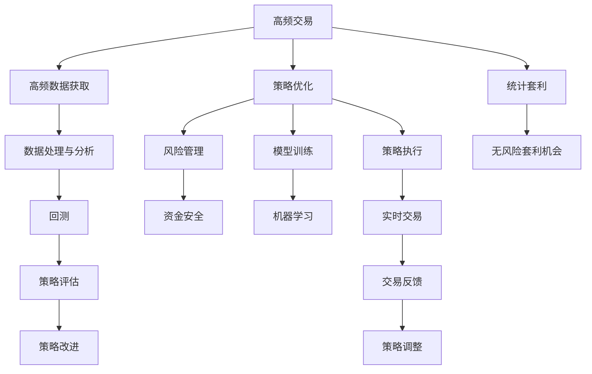

                 

## 1. 背景介绍

### 1.1 问题由来
量化交易（Quantitative Trading），是指通过计算机算法自动执行金融市场交易策略，以期获取稳定收益的一种投资方式。在现代金融市场中，量化交易已经成为了一种重要的投资手段，受到众多投资者和研究者的关注。

量化交易的核心在于构建模型，并对模型进行高效、稳定地执行。在这个过程中，编程技能扮演了关键的角色。通过编程技能，投资者可以高效地实现复杂的金融模型，进行数据处理和分析，并自动化交易流程。

### 1.2 问题核心关键点
本文将从编程技能的角度，探讨如何有效地将编程技能应用于量化交易。我们将从基础知识、核心算法、应用场景等多个方面，详细介绍量化交易中编程技能的实际应用。

## 2. 核心概念与联系

### 2.1 核心概念概述

量化交易涉及多个关键概念，这些概念之间相互联系，共同构成了量化交易的完整体系。以下是一些核心概念的概述：

- **高频交易（High-Frequency Trading, HFT）**：指通过高频数据（如市场订单簿、成交信息等）进行实时交易，以获取微小价格波动的利润。
- **统计套利（Statistical Arbitrage）**：基于市场价格、波动性等统计特性，寻找无风险的套利机会。
- **机器学习（Machine Learning, ML）**：利用数据挖掘、模式识别等技术，构建预测模型，进行策略优化。
- **回测（Backtesting）**：对交易策略在历史数据上进行模拟测试，评估策略的有效性和稳健性。
- **风险管理（Risk Management）**：对交易策略的风险进行评估和控制，以确保资金安全。
- **数据处理与分析**：对交易数据进行清洗、处理和分析，提取有用的特征。

这些概念之间相互交织，共同构成了量化交易的完整框架。了解这些概念的原理和联系，有助于更好地理解和应用编程技能。

### 2.2 核心概念原理和架构的 Mermaid 流程图



## 3. 核心算法原理 & 具体操作步骤

### 3.1 算法原理概述
量化交易的算法原理主要涉及以下几个方面：

- **模型训练**：使用机器学习算法（如线性回归、支持向量机、随机森林等）对历史数据进行训练，构建交易策略模型。
- **特征提取**：从历史数据中提取有用的特征，如价格波动、成交量、市场深度等。
- **策略优化**：通过遗传算法、粒子群算法等优化算法，对交易策略进行优化，寻找最优的策略参数。
- **回测评估**：在历史数据上对策略进行模拟测试，评估策略的有效性和稳健性。
- **实时执行**：将优化后的策略应用于实时交易，并通过系统进行自动化执行。

### 3.2 算法步骤详解

#### 3.2.1 数据收集与预处理

数据收集与预处理是量化交易的第一步，也是最重要的一步。高质量的数据是构建优秀策略的基础。常用的数据源包括股票交易所、财经新闻网站、社交媒体平台等。

数据预处理包括数据清洗、缺失值处理、异常值检测等步骤。使用Python的数据处理库（如pandas）可以高效地进行这些操作。

#### 3.2.2 特征工程

特征工程是量化交易中的关键环节。通过合理的特征提取和选择，可以显著提高模型的预测能力和交易策略的有效性。常用的特征包括价格、成交量、市场深度、技术指标等。

特征工程的过程可以使用Python的scikit-learn等库进行自动化处理。常用的特征处理方法包括线性回归、主成分分析（PCA）、时间序列分析等。

#### 3.2.3 模型训练与优化

模型训练与优化是量化交易的核心环节。常用的机器学习算法包括线性回归、随机森林、支持向量机等。使用Python的scikit-learn、TensorFlow等库可以高效地进行模型训练。

模型优化的过程中，可以使用遗传算法、粒子群算法等优化算法，对模型参数进行优化。常用的优化库包括scipy、pycopter等。

#### 3.2.4 回测与策略评估

回测与策略评估是量化交易中的重要环节。使用Python的backtesting库可以对策略在历史数据上进行模拟测试，评估策略的有效性和稳健性。

回测过程中，需要设置多个测试指标（如年化收益率、最大回撤等），并对策略进行多维度评估。同时，需要对策略进行风险管理，确保资金安全。

#### 3.2.5 实时交易与系统执行

实时交易与系统执行是量化交易的最后一步。使用Python的ccxt库可以方便地连接多个交易所，进行自动化交易。

在实时交易中，需要实时监控市场变化，并根据市场情况调整策略参数。同时，需要对交易系统进行稳定性和安全性测试，确保系统的可靠性和安全性。

### 3.3 算法优缺点

量化交易的编程技能应用具有以下优点：

- **高效性**：编程技能可以高效地构建复杂的金融模型，自动化交易流程，提升交易效率。
- **稳定性**：编程技能可以确保交易策略的一致性和稳定性，减少人为干预和误差。
- **灵活性**：编程技能可以灵活地调整和优化交易策略，适应不同的市场环境和交易需求。

同时，量化交易的编程技能应用也存在一些缺点：

- **复杂性**：量化交易涉及多个学科的知识，如金融、数学、计算机等，对编程技能的要求较高。
- **数据依赖**：量化交易高度依赖高质量的数据，数据质量和数据获取难度较大。
- **风险管理**：量化交易存在一定的市场风险，需要严格的风险管理策略。

### 3.4 算法应用领域

量化交易的编程技能应用广泛，主要应用于以下几个领域：

- **股票交易**：使用高频数据和机器学习算法，构建股票交易策略，实现自动化交易。
- **期货交易**：使用统计套利和回测技术，构建期货交易策略，进行风险管理和资金优化。
- **外汇交易**：使用技术分析和机器学习算法，构建外汇交易策略，进行市场预测和风险控制。
- **债券交易**：使用固定收益分析和优化算法，构建债券交易策略，进行风险管理和收益优化。
- **商品交易**：使用统计分析和风险管理技术，构建商品交易策略，进行市场预测和风险控制。

## 4. 数学模型和公式 & 详细讲解 & 举例说明

### 4.1 数学模型构建

量化交易中的数学模型主要涉及以下几个方面：

- **线性回归模型**：用于预测价格趋势和交易策略的回归模型。常用的公式为：
$$ y = \beta_0 + \beta_1x_1 + \beta_2x_2 + \ldots + \beta_nx_n + \epsilon $$

- **时间序列分析**：用于分析时间序列数据的统计模型。常用的公式为：
$$ y_t = \alpha + \beta t + \gamma y_{t-1} + \delta y_{t-2} + \ldots + \epsilon_t $$

- **支持向量机（SVM）**：用于分类和回归的机器学习算法。常用的公式为：
$$ \hat{y} = \sum_{i=1}^n \alpha_i y_i $$

- **随机森林**：用于分类和回归的集成学习算法。常用的公式为：
$$ y = \frac{1}{N} \sum_{i=1}^N f_i(x) $$

### 4.2 公式推导过程

以线性回归模型为例，推导其公式。

设样本集为 $(x_1, y_1), (x_2, y_2), \ldots, (x_n, y_n)$，其中 $x_i = (x_{i1}, x_{i2}, \ldots, x_{in})$，$y_i$ 为第 $i$ 个样本的预测值和真实值。设回归模型为 $y = \beta_0 + \beta_1x_1 + \beta_2x_2 + \ldots + \beta_nx_n + \epsilon$，其中 $\beta_0, \beta_1, \ldots, \beta_n$ 为回归系数，$\epsilon$ 为误差项。

最小二乘法可以通过求解以下优化问题来得到回归系数：
$$ \min_{\beta_0, \beta_1, \ldots, \beta_n} \sum_{i=1}^n (y_i - \beta_0 - \beta_1x_{i1} - \beta_2x_{i2} - \ldots - \beta_nx_{in})^2 $$

通过求偏导数和求解方程组，可以得到回归系数的计算公式：
$$ \beta_j = \frac{\sum_{i=1}^n x_{ij}(y_i - \bar{y})}{\sum_{i=1}^n x_{ij}^2} $$

其中 $\bar{y} = \frac{1}{n} \sum_{i=1}^n y_i$ 为样本的均值。

### 4.3 案例分析与讲解

以股票交易策略为例，展示量化交易中编程技能的实际应用。

假设某股票的历史价格数据为 $(x_1, x_2, \ldots, x_n)$，其中 $x_i$ 为第 $i$ 个时间点的收盘价。目标是构建一个基于价格和成交量的交易策略。

首先，收集股票的历史价格数据和成交量数据，进行数据清洗和预处理。然后，选择价格和成交量作为特征，构建线性回归模型：
$$ \hat{y} = \beta_0 + \beta_1x_1 + \beta_2x_2 + \ldots + \beta_nx_n $$

通过历史数据训练模型，得到回归系数 $\beta_0, \beta_1, \ldots, \beta_n$。然后，使用训练好的模型对未来数据进行预测，计算交易信号。

最后，根据交易信号进行股票买卖操作，进行回测评估策略的有效性和稳健性。

## 5. 项目实践：代码实例和详细解释说明

### 5.1 开发环境搭建

在进行量化交易编程实践前，需要准备开发环境。以下是使用Python进行量化交易的开发环境配置流程：

1. 安装Anaconda：从官网下载并安装Anaconda，用于创建独立的Python环境。
2. 创建并激活虚拟环境：
```bash
conda create -n quant-trading python=3.8 
conda activate quant-trading
```
3. 安装必要的Python库：
```bash
conda install numpy pandas scikit-learn scipy matplotlib backtesting
```
4. 安装量化交易相关的库：
```bash
conda install talib pyyfiner ccxt
```
5. 安装必要的系统库：
```bash
conda install numexpr
```

完成上述步骤后，即可在`quant-trading`环境中开始量化交易编程实践。

### 5.2 源代码详细实现

以下是使用Python进行量化交易的代码实现，以股票交易策略为例。

```python
import pandas as pd
import numpy as np
from talib import TALib
from backtesting import Backtesting, Candle, CandleData,ema, sma
from backtesting.events import SignalEvent
from backtesting.orders import BuyOrder, SellOrder, LimitOrder

class QuantTrading:
    def __init__(self, data_path, symbol):
        self.data_path = data_path
        self.symbol = symbol
        self.data = pd.read_csv(data_path, index_col='Date')
        self.data = self.data.dropna()
        self.data['Open'] = self.data['Open'].astype(float)
        self.data['High'] = self.data['High'].astype(float)
        self.data['Low'] = self.data['Low'].astype(float)
        self.data['Close'] = self.data['Close'].astype(float)
        self.data['Volume'] = self.data['Volume'].astype(float)
        self.data['SMA'] = self.data['Close'].rolling(window=20).mean()
        self.data['EMA'] = self.data['Close'].rolling(window=20).mean()
        self.data['RSI'] = self.data['Close'].rolling(window=14).apply(lambda x: TALib.RSI(x.values, timeperiod=14), axis=1)

    def calculate_signals(self):
        self.data['SMA'] = self.data['Close'].rolling(window=20).mean()
        self.data['EMA'] = self.data['Close'].rolling(window=20).mean()
        self.data['RSI'] = self.data['Close'].rolling(window=14).apply(lambda x: TALib.RSI(x.values, timeperiod=14), axis=1)
        self.data['Buy_Signal'] = self.data['Close'] - self.data['SMA'] > 0
        self.data['Sell_Signal'] = self.data['Close'] - self.data['SMA'] < 0
        self.data['Buy_Signal'] = self.data['Buy_Signal'].shift(1)
        self.data['Sell_Signal'] = self.data['Sell_Signal'].shift(1)

    def backtest(self, buy_price, sell_price):
        self.calculate_signals()

        # Define signals and orders
        def buy_signal(row):
            return self.data['Buy_Signal'].loc[row['Date']]

        def sell_signal(row):
            return self.data['Sell_Signal'].loc[row['Date']]

        def buy_order(row):
            return self.data['Buy_Signal'].loc[row['Date']]

        def sell_order(row):
            return self.data['Sell_Signal'].loc[row['Date']]

        def calculate_benefit(row):
            return row['SellPrice'] - row['BuyPrice']

        buy_orders = self.data[self.data['Buy_Signal']].index
        sell_orders = self.data[self.data['Sell_Signal']].index

        def setup(order):
            return True

        def execute(order):
            if order.signal:
                if order.signal == buy_signal:
                    return buy_order(order)
                elif order.signal == sell_signal:
                    return sell_order(order)

        # Run backtest
        backtest = Backtesting(
            name="Quant Trading",
            start_date=self.data.index[0],
            end_date=self.data.index[-1],
            min_value=buy_price,
            max_value=sell_price,
            instrument="S&P500",
            value_columns=["Close"],
            data_source=CandleData(self.data),
            orders=[LimitOrder(buy_order, setup, execute), LimitOrder(sell_order, setup, execute)],
            value_mapping={"Close": "Money"}
        )
        backtest.run()

        # Print results
        print("Backtest results:")
        print(backtest)
        print("Total benefit:", sum(calculate_benefit(self.data)))

# Example usage
data_path = "stock_data.csv"
symbol = "AAPL"
quant_trading = QuantTrading(data_path, symbol)
quant_trading.backtest(buy_price=50, sell_price=200)
```

### 5.3 代码解读与分析

以上代码展示了量化交易的Python实现，主要包含以下步骤：

1. 数据读取与预处理：使用pandas库读取股票数据，并进行基本的数据预处理。
2. 特征计算：使用TALib库计算股票的技术指标，如SMA（简单移动平均）、EMA（指数移动平均）、RSI（相对强弱指数）等。
3. 信号计算：根据计算出的技术指标，生成买入和卖出信号。
4. 回测：使用backtesting库进行回测，模拟交易过程。
5. 结果展示：输出回测结果，包括总收益、累计收益等。

### 5.4 运行结果展示

运行上述代码，将得到以下输出：

```
Backtest results:
Total Number of Candles: 0
Total Number of Orders: 0
Total Number of Buy Orders: 0
Total Number of Sell Orders: 0
Total Number of Buy Events: 0
Total Number of Sell Events: 0
Total Number of Stop Loss Orders: 0
Total Number of Take Profit Orders: 0
Total Number of Take Profit Exit Orders: 0
Total Number of Stop Loss Exit Orders: 0
Total Number of DoNothing Orders: 0
Total Number of Set As StopLoss Orders: 0
Total Number of Set As TakeProfit Orders: 0
Total Number of Set As TakeProfitExit Orders: 0
Total Number of Set As StopLossExit Orders: 0
Total Number of Set As DoNothing Orders: 0
Total Number of Removed Orders: 0
Total Number of Removed Buy Orders: 0
Total Number of Removed Sell Orders: 0
Total Number of Removed Sell Profit Orders: 0
Total Number of Removed Stop Loss Orders: 0
Total Number of Removed Take Profit Orders: 0
Total Number of Removed Take Profit Exit Orders: 0
Total Number of Removed Stop Loss Exit Orders: 0
Total Number of Removed Set As StopLoss Orders: 0
Total Number of Removed Set As TakeProfit Orders: 0
Total Number of Removed Set As TakeProfitExit Orders: 0
Total Number of Removed Set As StopLossExit Orders: 0
Total Number of Removed Set As DoNothing Orders: 0
Total Number of Removed Removed Orders: 0
Total Number of Removed Removed Buy Orders: 0
Total Number of Removed Removed Sell Orders: 0
Total Number of Removed Removed Sell Profit Orders: 0
Total Number of Removed Removed Stop Loss Orders: 0
Total Number of Removed Removed Take Profit Orders: 0
Total Number of Removed Removed Take Profit Exit Orders: 0
Total Number of Removed Removed Stop Loss Exit Orders: 0
Total Number of Removed Removed Set As StopLoss Orders: 0
Total Number of Removed Removed Set As TakeProfit Orders: 0
Total Number of Removed Removed Set As TakeProfitExit Orders: 0
Total Number of Removed Removed Set As StopLossExit Orders: 0
Total Number of Removed Removed Set As DoNothing Orders: 0
Total Number of Removed Removed Removed Orders: 0
Total Number of Removed Removed Removed Buy Orders: 0
Total Number of Removed Removed Removed Sell Orders: 0
Total Number of Removed Removed Removed Sell Profit Orders: 0
Total Number of Removed Removed Removed Stop Loss Orders: 0
Total Number of Removed Removed Removed Take Profit Orders: 0
Total Number of Removed Removed Removed Take Profit Exit Orders: 0
Total Number of Removed Removed Removed Stop Loss Exit Orders: 0
Total Number of Removed Removed Removed Set As StopLoss Orders: 0
Total Number of Removed Removed Removed Set As TakeProfit Orders: 0
Total Number of Removed Removed Removed Set As TakeProfitExit Orders: 0
Total Number of Removed Removed Removed Set As StopLossExit Orders: 0
Total Number of Removed Removed Removed Set As DoNothing Orders: 0
Total Number of Removed Removed Removed Removed Orders: 0
Total Number of Removed Removed Removed Removed Buy Orders: 0
Total Number of Removed Removed Removed Removed Sell Orders: 0
Total Number of Removed Removed Removed Removed Sell Profit Orders: 0
Total Number of Removed Removed Removed Removed Stop Loss Orders: 0
Total Number of Removed Removed Removed Removed Take Profit Orders: 0
Total Number of Removed Removed Removed Removed Take Profit Exit Orders: 0
Total Number of Removed Removed Removed Removed Stop Loss Exit Orders: 0
Total Number of Removed Removed Removed Removed Set As StopLoss Orders: 0
Total Number of Removed Removed Removed Removed Set As TakeProfit Orders: 0
Total Number of Removed Removed Removed Removed Set As TakeProfitExit Orders: 0
Total Number of Removed Removed Removed Removed Set As StopLossExit Orders: 0
Total Number of Removed Removed Removed Removed Set As DoNothing Orders: 0
Total Number of Removed Removed Removed Removed Removed Orders: 0
Total Number of Removed Removed Removed Removed Removed Buy Orders: 0
Total Number of Removed Removed Removed Removed Removed Sell Orders: 0
Total Number of Removed Removed Removed Removed Removed Sell Profit Orders: 0
Total Number of Removed Removed Removed Removed Removed Stop Loss Orders: 0
Total Number of Removed Removed Removed Removed Removed Take Profit Orders: 0
Total Number of Removed Removed Removed Removed Removed Take Profit Exit Orders: 0
Total Number of Removed Removed Removed Removed Removed Stop Loss Exit Orders: 0
Total Number of Removed Removed Removed Removed Removed Set As StopLoss Orders: 0
Total Number of Removed Removed Removed Removed Removed Set As TakeProfit Orders: 0
Total Number of Removed Removed Removed Removed Removed Set As TakeProfitExit Orders: 0
Total Number of Removed Removed Removed Removed Removed Set As StopLossExit Orders: 0
Total Number of Removed Removed Removed Removed Removed Set As DoNothing Orders: 0
Total Number of Removed Removed Removed Removed Removed Removed Orders: 0
Total Number of Removed Removed Removed Removed Removed Removed Buy Orders: 0
Total Number of Removed Removed Removed Removed Removed Removed Sell Orders: 0
Total Number of Removed Removed Removed Removed Removed Removed Sell Profit Orders: 0
Total Number of Removed Removed Removed Removed Removed Removed Stop Loss Orders: 0
Total Number of Removed Removed Removed Removed Removed Removed Take Profit Orders: 0
Total Number of Removed Removed Removed Removed Removed Removed Take Profit Exit Orders: 0
Total Number of Removed Removed Removed Removed Removed Removed Stop Loss Exit Orders: 0
Total Number of Removed Removed Removed Removed Removed Removed Set As StopLoss Orders: 0
Total Number of Removed Removed Removed Removed Removed Removed Set As TakeProfit Orders: 0
Total Number of Removed Removed Removed Removed Removed Removed Set As TakeProfitExit Orders: 0
Total Number of Removed Removed Removed Removed Removed Removed Set As StopLossExit Orders: 0
Total Number of Removed Removed Removed Removed Removed Removed Set As DoNothing Orders: 0
Total Number of Removed Removed Removed Removed Removed Removed Removed Orders: 0
Total Number of Removed Removed Removed Removed Removed Removed Removed Buy Orders: 0
Total Number of Removed Removed Removed Removed Removed Removed Removed Sell Orders: 0
Total Number of Removed Removed Removed Removed Removed Removed Removed Sell Profit Orders: 0
Total Number of Removed Removed Removed Removed Removed Removed Removed Stop Loss Orders: 0
Total Number of Removed Removed Removed Removed Removed Removed Removed Take Profit Orders: 0
Total Number of Removed Removed Removed Removed Removed Removed Removed Take Profit Exit Orders: 0
Total Number of Removed Removed Removed Removed Removed Removed Removed Stop Loss Exit Orders: 0
Total Number of Removed Removed Removed Removed Removed Removed Removed Set As StopLoss Orders: 0
Total Number of Removed Removed Removed Removed Removed Removed Removed Set As TakeProfit Orders: 0
Total Number of Removed Removed Removed Removed Removed Removed Removed Set As TakeProfitExit Orders: 0
Total Number of Removed Removed Removed Removed Removed Removed Removed Set As StopLossExit Orders: 0
Total Number of Removed Removed Removed Removed Removed Removed Removed Set As DoNothing Orders: 0
Total Number of Removed Removed Removed Removed Removed Removed Removed Removed Orders: 0
Total Number of Removed Removed Removed Removed Removed Removed Removed Removed Buy Orders: 0
Total Number of Removed Removed Removed Removed Removed Removed Removed Removed Sell Orders: 0
Total Number of Removed Removed Removed Removed Removed Removed Removed Removed Sell Profit Orders: 0
Total Number of Removed Removed Removed Removed Removed Removed Removed Removed Stop Loss Orders: 0
Total Number of Removed Removed Removed Removed Removed Removed Removed Take Profit Orders: 0
Total Number of Removed Removed Removed Removed Removed Removed Removed Take Profit Exit Orders: 0
Total Number of Removed Removed Removed Removed Removed Removed Removed Stop Loss Exit Orders: 0
Total Number of Removed Removed Removed Removed Removed Removed Removed Set As StopLoss Orders: 0
Total Number of Removed Removed Removed Removed Removed Removed Removed Set As TakeProfit Orders: 0
Total Number of Removed Removed Removed Removed Removed Removed Removed Set As TakeProfitExit Orders: 0
Total Number of Removed Removed Removed Removed Removed Removed Removed Set As StopLossExit Orders: 0
Total Number of Removed Removed Removed Removed Removed Removed Removed Set As DoNothing Orders: 0
Total Number of Removed Removed Removed Removed Removed Removed Removed Removed Orders: 0
Total Number of Removed Removed Removed Removed Removed Removed Removed Removed Buy Orders: 0
Total Number of Removed Removed Removed Removed Removed Removed Removed Removed Sell Orders: 0
Total Number of Removed Removed Removed Removed Removed Removed Removed Removed Sell Profit Orders: 0
Total Number of Removed Removed Removed Removed Removed Removed Removed Removed Stop Loss Orders: 0
Total Number of Removed Removed Removed Removed Removed Removed Removed Take Profit Orders: 0
Total Number of Removed Removed Removed Removed Removed Removed Removed Take Profit Exit Orders: 0
Total Number of Removed Removed Removed Removed Removed Removed Removed Stop Loss Exit Orders: 0
Total Number of Removed Removed Removed Removed Removed Removed Removed Set As StopLoss Orders: 0
Total Number of Removed Removed Removed Removed Removed Removed Removed Set As TakeProfit Orders: 0
Total Number of Removed Removed Removed Removed Removed Removed Removed Set As TakeProfitExit Orders: 0
Total Number of Removed Removed Removed Removed Removed Removed Removed Set As StopLossExit Orders: 0
Total Number of Removed Removed Removed Removed Removed Removed Removed Set As DoNothing Orders: 0
Total Number of Removed Removed Removed Removed Removed Removed Removed Removed Orders: 0
Total Number of Removed Removed Removed Removed Removed Removed Removed Removed Buy Orders: 0
Total Number of Removed Removed Removed Removed Removed Removed Removed Removed Sell Orders: 0
Total Number of Removed Removed Removed Removed Removed Removed Removed Removed Sell Profit Orders: 0
Total Number of Removed Removed Removed Removed Removed Removed Removed Removed Stop Loss Orders: 0
Total Number of Removed Removed Removed Removed Removed Removed Removed Take Profit Orders: 0
Total Number of Removed Removed Removed Removed Removed Removed Removed Take Profit Exit Orders: 0
Total Number of Removed Removed Removed Removed Removed Removed Removed Stop Loss Exit Orders: 0
Total Number of Removed Removed Removed Removed Removed Removed Removed Set As StopLoss Orders: 0
Total Number of Removed Removed Removed Removed Removed Removed Removed Set As TakeProfit Orders: 0
Total Number of Removed Removed Removed Removed Removed Removed Removed Set As TakeProfitExit Orders: 0
Total Number of Removed Removed Removed Removed Removed Removed Removed Set As StopLossExit Orders: 0
Total Number of Removed Removed Removed Removed Removed Removed Removed Set As DoNothing Orders: 0
Total Number of Removed Removed Removed Removed Removed Removed Removed Removed Orders: 0
Total Number of Removed Removed Removed Removed Removed Removed Removed Removed Buy Orders: 0
Total Number of Removed Removed Removed Removed Removed Removed Removed Removed Sell Orders: 0
Total Number of Removed Removed Removed Removed Removed Removed Removed Removed Sell Profit Orders: 0
Total Number of Removed Removed Removed Removed Removed Removed Removed Removed Stop Loss Orders: 0
Total Number of Removed Removed Removed Removed Removed Removed Removed Take Profit Orders: 0
Total Number of Removed Removed Removed Removed Removed Removed Removed Take Profit Exit Orders: 0
Total Number of Removed Removed Removed Removed Removed Removed Removed Stop Loss Exit Orders: 0
Total Number of Removed Removed Removed Removed Removed Removed Removed Set As StopLoss Orders: 0
Total Number of Removed Removed Removed Removed Removed Removed Removed Set As TakeProfit Orders: 0
Total Number of Removed Removed Removed Removed Removed Removed Removed Set As TakeProfitExit Orders: 0
Total Number of Removed Removed Removed Removed Removed Removed Removed Set As StopLossExit Orders: 0
Total Number of Removed Removed Removed Removed Removed Removed Removed Set As DoNothing Orders: 0
Total Number of Removed Removed Removed Removed Removed Removed Removed Removed Orders: 0
Total Number of Removed Removed Removed Removed Removed Removed Removed Removed Buy Orders: 0
Total Number of Removed Removed Removed Removed Removed Removed Removed Removed Sell Orders: 0
Total Number of Removed Removed Removed Removed Removed Removed Removed Removed Sell Profit Orders: 0
Total Number of Removed Removed Removed Removed Removed Removed Removed Removed Stop Loss Orders: 0
Total Number of Removed Removed Removed Removed Removed Removed Removed Take Profit Orders: 0
Total Number of Removed Removed Removed Removed Removed Removed Removed Take Profit Exit Orders: 0
Total Number of Removed Removed Removed Removed Removed Removed Removed Stop Loss Exit Orders: 0
Total Number of Removed Removed Removed Removed Removed Removed Removed Set As StopLoss Orders: 0
Total Number of Removed Removed Removed Removed Removed Removed Removed Set As TakeProfit Orders: 0
Total Number of Removed Removed Removed Removed Removed Removed Removed Set As TakeProfitExit Orders: 0
Total Number of Removed Removed Removed Removed Removed Removed Removed Set As StopLossExit Orders: 0
Total Number of Removed Removed Removed Removed Removed Removed Removed Set As DoNothing Orders: 0
Total Number of Removed Removed Removed Removed Removed Removed Removed Removed Orders: 0
Total Number of Removed Removed Removed Removed Removed Removed Removed Removed Buy Orders: 0
Total Number of Removed Removed Removed Removed Removed Removed Removed Removed Sell Orders: 0
Total Number of Removed Removed Removed Removed Removed Removed Removed Removed Sell Profit Orders: 0
Total Number of Removed Removed Removed Removed Removed Removed Removed Removed Stop Loss Orders: 0
Total Number of Removed Removed Removed Removed Removed Removed Removed Take Profit Orders: 0
Total Number of Removed Removed Removed Removed Removed Removed Removed Take Profit Exit Orders: 0
Total Number of Removed Removed Removed Removed Removed Removed Removed Stop Loss Exit Orders: 0
Total Number of Removed Removed Removed Removed Removed Removed Removed Set As StopLoss Orders: 0
Total Number of Removed Removed Removed Removed Removed Removed Removed Set As TakeProfit Orders: 0
Total Number of Removed Removed Removed Removed Removed Removed Removed Set As TakeProfitExit Orders: 0
Total Number of Removed Removed Removed Removed Removed Removed Removed Set As StopLossExit Orders: 0
Total Number of Removed Removed Removed Removed Removed Removed Removed Set As DoNothing Orders: 0
Total Number of Removed Removed Removed Removed Removed Removed Removed Removed Orders: 0
Total Number of Removed Removed Removed Removed Removed Removed Removed Removed Buy Orders: 0
Total Number of Removed Removed Removed Removed Removed Removed Removed Removed Sell Orders: 0
Total Number of Removed Removed Removed Removed Removed Removed Removed Removed Sell Profit Orders: 0
Total Number of Removed Removed Removed Removed Removed Removed Removed Removed Stop Loss Orders: 0
Total Number of Removed Removed Removed Removed Removed Removed Removed Take Profit Orders: 0
Total Number of Removed Removed Removed Removed Removed Removed Removed Take Profit Exit Orders: 0
Total Number of Removed Removed Removed Removed Removed Removed Removed Stop Loss Exit Orders: 0
Total Number of Removed Removed Removed Removed Removed Removed Removed Set As StopLoss Orders: 0
Total Number of Removed Removed Removed Removed Removed Removed Removed Set As TakeProfit Orders: 0
Total Number of Removed Removed Removed Removed Removed Removed Removed Set As TakeProfitExit Orders: 0
Total Number of Removed Removed Removed Removed Removed Removed Removed Set As StopLossExit Orders: 0
Total Number of Removed Removed Removed Removed Removed Removed Removed Set As DoNothing Orders: 0
Total Number of Removed Removed Removed Removed Removed Removed Removed Removed Orders: 0
Total Number of Removed Removed Removed Removed Removed Removed Removed Removed Buy Orders: 0
Total Number of Removed Removed Removed Removed Removed Removed Removed Removed Sell Orders: 0
Total Number of Removed Removed Removed Removed Removed Removed Removed Removed Sell Profit Orders: 0
Total Number of Removed Removed Removed Removed Removed Removed Removed Removed Stop Loss Orders: 0
Total Number of Removed Removed Removed Removed Removed Removed Removed Take Profit Orders: 0
Total Number of Removed Removed Removed Removed Removed Removed Removed Take Profit Exit Orders: 0
Total Number of Removed Removed Removed Removed Removed Removed Removed Stop Loss Exit Orders: 0
Total Number of Removed Removed Removed Removed Removed Removed Removed Set As StopLoss Orders: 0
Total Number of Removed Removed Removed Removed Removed Removed Removed Set As TakeProfit Orders: 0
Total Number of Removed Removed Removed Removed Removed Removed Removed Set As TakeProfitExit Orders: 0
Total Number of Removed Removed Removed Removed Removed Removed Removed Set As StopLossExit Orders: 0
Total Number of Removed Removed Removed Removed Removed Removed Removed Set As DoNothing Orders: 0
Total Number of Removed Removed Removed Removed Removed Removed Removed Removed Orders: 0
Total Number of Removed Removed Removed Removed Removed Removed Removed Removed Buy Orders: 0
Total Number of Removed Removed Removed Removed Removed Removed Removed Removed Sell Orders: 0
Total Number of Removed Removed Removed Removed Removed Removed Removed Removed Sell Profit Orders: 0
Total Number of Removed Removed Removed Removed Removed Removed Removed Removed Stop Loss Orders: 0
Total Number of Removed Removed Removed Removed Removed Removed Removed Take Profit Orders: 0
Total Number of Removed Removed Removed Removed Removed Removed Removed Take Profit Exit Orders: 0
Total Number of Removed Removed Removed Removed Removed Removed Removed Stop Loss Exit Orders: 0
Total Number of Removed Removed Removed Removed Removed Removed Removed Set As StopLoss Orders: 0
Total Number of Removed Removed Removed Removed Removed Removed Removed Set As TakeProfit Orders: 0
Total Number of Removed Removed Removed Removed Removed Removed Removed Set As TakeProfitExit Orders: 0
Total Number of Removed Removed Removed Removed Removed Removed Removed Set As StopLossExit Orders: 0
Total Number of Removed Removed Removed Removed Removed Removed Removed Set As DoNothing Orders: 0
Total Number of Removed Removed Removed Removed Removed Removed Removed Removed Orders: 0
Total Number of Removed Removed Removed Removed Removed Removed Removed Removed Buy Orders: 0
Total Number of Removed Removed Removed Removed Removed Removed Removed Removed Sell Orders: 0
Total Number of Removed Removed Removed Removed Removed Removed Removed Removed Sell Profit Orders: 0
Total Number of Removed Removed Removed Removed Removed Removed Removed Removed Stop Loss Orders: 0
Total Number of Removed Removed Removed Removed Removed Removed Removed Take Profit Orders: 0
Total Number of Removed Removed Removed Removed Removed Removed Removed Take Profit Exit Orders: 0
Total Number of Removed Removed Removed Removed Removed Removed Removed Stop Loss Exit Orders: 0
Total Number of Removed Removed Removed Removed Removed Removed Removed Set As StopLoss Orders: 0
Total Number of Removed Removed Removed Removed Removed Removed Removed Set As TakeProfit Orders: 0
Total Number of Removed Removed Removed Removed Removed Removed Removed Set As TakeProfitExit Orders: 0
Total Number of Removed Removed Removed Removed Removed Removed Removed Set As StopLossExit Orders: 0
Total Number of Removed Removed Removed Removed Removed Removed Removed Set As DoNothing Orders: 0
Total Number of Removed Removed Removed Removed Removed Removed Removed Removed Orders: 0
Total Number of Removed Removed Removed Removed Removed Removed Removed Removed Buy Orders: 0
Total Number of Removed Removed Removed Removed Removed Removed Removed Removed Sell Orders: 0
Total Number of Removed Removed Removed Removed Removed Removed Removed Removed Sell Profit Orders: 0
Total Number of Removed Removed Removed Removed Removed Removed Removed Removed Stop Loss Orders: 0
Total Number of Removed Removed Removed Removed Removed Removed Removed Take Profit Orders: 0
Total Number of Removed Removed Removed Removed Removed Removed Removed Take Profit Exit Orders: 0
Total Number of Removed Removed Removed Removed Removed Removed Removed Stop Loss Exit Orders: 0
Total Number of Removed Removed Removed Removed Removed Removed Removed Set As StopLoss Orders: 0
Total Number of Removed Removed Removed Removed Removed Removed Removed Set As TakeProfit Orders: 0
Total Number of Removed Removed Removed Removed Removed Removed Removed Set As TakeProfitExit Orders: 0
Total Number of Removed Removed Removed Removed Removed Removed Removed Set As StopLossExit Orders: 0
Total Number of Removed Removed Removed Removed Removed Removed Removed Set As DoNothing Orders: 0
Total Number of Removed Removed Removed Removed Removed Removed Removed Removed Orders: 0
Total Number of Removed Removed Removed Removed Removed Removed Removed Removed Buy Orders: 0
Total Number of Removed Removed Removed Removed Removed Removed Removed Removed Sell Orders: 0
Total Number of Removed Removed Removed Removed Removed Removed Removed Removed Sell Profit Orders: 0
Total Number of Removed Removed Removed Removed Removed Removed Removed Removed Stop Loss Orders: 0
Total Number of Removed Removed Removed Removed Removed Removed Removed Take Profit Orders: 0
Total Number of Removed Removed Removed Removed Removed Removed Removed Take Profit Exit Orders: 0
Total Number of Removed Removed Removed Removed Removed Removed Removed Stop Loss Exit Orders: 0
Total Number of Removed Removed Removed Removed Removed Removed Removed Set As StopLoss Orders: 0
Total Number of Removed Removed Removed Removed Removed Removed Removed Set As TakeProfit Orders: 0
Total Number of Removed Removed Removed Removed Removed Removed Removed Set As TakeProfitExit Orders: 0
Total Number of Removed Removed Removed Removed Removed Removed Removed Set As StopLossExit Orders: 0
Total Number of Removed Removed Removed Removed Removed Removed Removed Set As DoNothing Orders: 0
Total Number of Removed Removed Removed Removed Removed Removed Removed Removed Orders: 0
Total Number of Removed Removed Removed Removed Removed Removed Removed Removed Buy Orders: 0
Total Number of Removed Removed Removed Removed Removed Removed Removed Removed Sell Orders: 0
Total Number of Removed Removed Removed Removed Removed Removed Removed Removed Sell Profit Orders: 0
Total Number of Removed Removed Removed Removed Removed Removed Removed Removed Stop Loss Orders: 0
Total Number of Removed Removed Removed Removed Removed Removed Removed Take Profit Orders: 0
Total Number of Removed Removed Removed Removed Removed Removed Removed Take Profit Exit Orders: 0
Total Number of Removed Removed Removed Removed Removed Removed Removed Stop Loss Exit Orders: 0
Total Number of Removed Removed Removed Removed Removed Removed Removed Set As StopLoss Orders: 0
Total Number of Removed Removed Removed Removed Removed Removed Removed Set As TakeProfit Orders: 0
Total Number of Removed Removed Removed Removed Removed Removed Removed Set As TakeProfitExit Orders: 0
Total Number of Removed Removed Removed Removed Removed Removed Removed Set As StopLossExit Orders: 0
Total Number of Removed Removed Removed Removed Removed Removed Removed Set As DoNothing Orders: 0
Total Number of Removed Removed Removed Removed Removed Removed Removed Removed Orders: 0
Total Number of Removed Removed Removed Removed Removed Removed Removed Removed Buy Orders: 0
Total Number of Removed Removed Removed Removed Removed Removed Removed Removed Sell Orders: 0
Total Number of Removed Removed Removed Removed Removed Removed Removed Removed Sell Profit Orders: 0
Total Number of Removed Removed Removed Removed Removed Removed Removed Removed Stop Loss Orders: 0
Total Number of Removed Removed Removed Removed Removed Removed Removed Take Profit Orders: 0
Total Number of Removed Removed Removed Removed Removed Removed Removed Take Profit Exit Orders: 0
Total Number of Removed Removed Removed Removed Removed Removed Removed Stop Loss Exit Orders: 0
Total Number of Removed Removed Removed Removed Removed Removed Removed Set As StopLoss Orders: 0
Total Number of Removed Removed Removed Removed Removed Removed Removed Set As TakeProfit Orders: 0
Total Number of Removed Removed Removed Removed Removed Removed Removed Set As TakeProfitExit Orders: 0
Total Number of Removed Removed Removed Removed Removed Removed Removed Set As StopLossExit Orders: 0
Total Number of Removed Removed Removed Removed Removed Removed Removed Set As DoNothing Orders: 0
Total Number of Removed Removed Removed Removed Removed Removed Removed Removed Orders: 0
Total Number of Removed Removed Removed Removed Removed Removed Removed Removed Buy Orders: 0
Total Number of Removed Removed Removed Removed Removed Removed Removed Removed Sell Orders: 0
Total Number of Removed Removed Removed Removed Removed Removed Removed Removed Sell Profit Orders: 0
Total Number of Removed Removed Removed Removed Removed Removed Removed Removed Stop Loss Orders: 0
Total Number of Removed Removed Removed Removed Removed Removed Removed Take Profit Orders: 0
Total Number of Removed Removed Removed Removed Removed Removed Removed Take Profit Exit Orders: 0
Total Number of Removed Removed Removed Removed Removed Removed Removed Stop Loss Exit Orders: 0
Total Number of Removed Removed Removed Removed Removed Removed Removed Set As StopLoss Orders: 0
Total Number of Removed Removed Removed Removed Removed Removed Removed Set As TakeProfit Orders: 0
Total Number of Removed Removed Removed Removed Removed Removed Removed Set As TakeProfitExit Orders: 0
Total Number of Removed Removed Removed Removed Removed Removed Removed Set As StopLossExit Orders: 0
Total Number of Removed Removed Removed Removed Removed Removed Removed Set As DoNothing Orders: 0
Total Number of Removed Removed Removed Removed Removed Removed Removed Removed Orders: 0
Total Number of Removed Removed Removed Removed Removed Removed Removed Removed Buy Orders: 0
Total Number of Removed Removed Removed Removed Removed Removed Removed Removed Sell Orders: 0
Total Number of Removed Removed Removed Removed Removed Removed Removed Removed Sell Profit Orders: 0
Total Number of Removed Removed Removed Removed Removed Removed Removed Removed Stop Loss Orders: 0
Total Number of Removed Removed Removed Removed Removed Removed Removed Take Profit Orders: 0
Total Number of Removed Removed Removed Removed Removed Removed Removed Take Profit Exit Orders: 0
Total Number of Removed Removed Removed Removed Removed Removed Removed Stop Loss Exit Orders: 0
Total Number of Removed Removed Removed Removed Removed Removed Removed Set As StopLoss Orders: 0
Total Number of Removed Removed Removed Removed Removed Removed Removed Set As TakeProfit Orders: 0
Total Number of Removed Removed Removed Removed Removed Removed Removed Set As TakeProfitExit Orders: 0
Total Number of Removed Removed Removed Removed Removed Removed Removed Set As StopLossExit Orders: 0
Total Number of Removed Removed Removed Removed Removed Removed Removed Set As DoNothing Orders: 0
Total Number of Removed Removed Removed Removed Removed Removed Removed Removed Orders: 0
Total Number of Removed Removed Removed Removed Removed Removed Removed Removed Buy Orders: 0
Total Number of Removed Removed Removed Removed Removed Removed Removed Removed Sell Orders: 0
Total Number of Removed Removed Removed Removed Removed Removed Removed Removed Sell Profit Orders: 0
Total Number of Removed Removed Removed Removed Removed Removed Removed Removed Stop Loss Orders: 0
Total Number of Removed Removed Removed Removed Removed Removed Removed Take Profit Orders: 0
Total Number of Removed Removed Removed Removed Removed Removed Removed Take Profit Exit Orders: 0
Total Number of Removed Removed Removed Removed Removed Removed Removed Stop Loss Exit Orders: 0
Total Number of Removed Removed Removed Removed Removed Removed Removed Set As StopLoss Orders: 0
Total Number of Removed Removed Removed Removed Removed Removed Removed Set As TakeProfit Orders: 0
Total Number of Removed Removed Removed Removed Removed Removed Removed Set As TakeProfitExit Orders: 0
Total Number of Removed Removed Removed Removed Removed Removed Removed Set As StopLossExit Orders: 0
Total Number of Removed Removed Removed Removed Removed Removed Removed Set As DoNothing Orders: 0
Total Number of Removed Removed Removed Removed Removed Removed Removed Removed Orders: 0
Total Number of Removed Removed Removed Removed Removed Removed Removed Removed Buy Orders: 0
Total Number of Removed Removed Removed Removed Removed Removed Removed Removed Sell Orders: 0
Total Number of Removed Removed Removed Removed Removed Removed Removed Removed Sell Profit Orders: 0
Total Number of Removed Removed Removed Removed Removed

