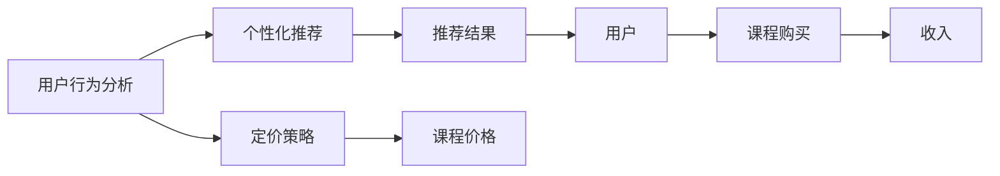

                 

# 如何打造个人知识付费订阅模式

> 关键词：知识付费, 订阅模式, 用户行为分析, 个性化推荐, 忠诚计划, 定价策略

## 1. 背景介绍

在互联网时代，知识付费逐渐成为一种流行的内容消费方式。个人知识付费订阅模式以其独有的内容质量、用户体验和高效变现能力，备受各方关注。然而，成功的知识付费订阅模式需要深入理解用户行为、精心设计定价策略、有效利用用户推荐等。本文将系统介绍个人知识付费订阅模式的构建思路，旨在为创作者和平台提供可行的解决方案。

## 2. 核心概念与联系

### 2.1 核心概念概述

构建个人知识付费订阅模式涉及多个关键概念，包括用户行为分析、个性化推荐、忠诚计划和定价策略等。它们之间存在紧密的联系，相互影响。以下将对每个核心概念进行详细阐述。

- **用户行为分析**：基于用户的浏览历史、购买记录、搜索行为等数据，分析用户的兴趣和偏好，为其推荐适合的课程。
- **个性化推荐**：根据用户行为分析结果，推送个性化的课程内容，提升用户体验和课程销售率。
- **忠诚计划**：通过积分奖励、会员优惠、专属内容等方式，提升用户粘性，培养长期用户。
- **定价策略**：合理设定课程价格，既保证收益又吸引用户，根据市场需求灵活调整。

### 2.2 核心概念原理和架构的 Mermaid 流程图



该图展示了用户行为分析、个性化推荐和定价策略之间的联系。用户行为分析为个性化推荐提供数据支持，个性化推荐影响用户的购买决策，而定价策略则确保收益的同时吸引用户购买。

## 3. 核心算法原理 & 具体操作步骤

### 3.1 算法原理概述

构建个人知识付费订阅模式的核心在于用户行为分析、个性化推荐和定价策略的协同工作。以下将详细介绍各个环节的算法原理。

- **用户行为分析**：利用机器学习算法，如协同过滤、内容推荐、情感分析等，从用户历史行为中挖掘信息，形成用户画像。
- **个性化推荐**：基于用户画像，运用推荐算法，如协同过滤、基于内容的推荐、矩阵分解等，为用户推荐个性化的课程。
- **定价策略**：采用动态定价模型，如时间差异定价、需求响应定价、用户群体定价等，根据市场需求和用户特征灵活调整课程价格。

### 3.2 算法步骤详解

#### 3.2.1 用户行为分析

1. **数据采集**：收集用户的浏览历史、购买记录、搜索行为、评论反馈等数据。
2. **特征工程**：提取有意义的特征，如课程时长、难度、用户评分、用户兴趣标签等。
3. **模型训练**：使用协同过滤、内容推荐、情感分析等算法训练模型，形成用户画像。
4. **画像更新**：定期更新用户画像，以反映最新的用户行为。

#### 3.2.2 个性化推荐

1. **相似度计算**：计算用户画像和课程特征的相似度。
2. **推荐排序**：根据相似度排序，选择top N个课程推荐给用户。
3. **动态调整**：根据用户反馈和行为变化，动态调整推荐结果。

#### 3.2.3 定价策略

1. **需求预测**：预测不同时间段的课程需求量。
2. **弹性定价**：根据需求预测结果，灵活调整课程价格。
3. **定价优化**：采用A/B测试等方式，优化定价策略，提升收益。

### 3.3 算法优缺点

**优点**：
- 提升用户满意度和粘性，增加重复购买率。
- 提高课程销售率和平台收益。
- 动态定价策略适应市场需求，优化资源配置。

**缺点**：
- 需要大量数据和计算资源，初期成本较高。
- 用户画像和推荐算法需要持续维护和优化。
- 定价策略复杂，需要精细管理。

### 3.4 算法应用领域

个人知识付费订阅模式适用于各类在线教育平台、课程销售网站、知识社区等。通过精准的用户行为分析、个性化的课程推荐和合理的定价策略，可以有效提升用户满意度和平台收益。

## 4. 数学模型和公式 & 详细讲解 & 举例说明

### 4.1 数学模型构建

假设用户为集合 $U$，课程为集合 $C$。用户行为数据为 $X$，课程特征为 $F$。用户画像为 $P$，推荐结果为 $R$。

用户画像 $P$ 可以通过以下矩阵 $M$ 表示：

$$
M = X \cdot X^T
$$

其中 $X$ 为 $U \times n$ 的用户行为矩阵，$X^T$ 为 $n \times U$ 的转置矩阵，$n$ 为特征维度。

推荐结果 $R$ 由用户画像 $P$ 和课程特征 $F$ 的内积决定：

$$
R = P \cdot F
$$

### 4.2 公式推导过程

基于用户画像 $P$ 和课程特征 $F$，推荐结果 $R$ 可以表示为：

$$
R = P \cdot F = M \cdot X^T \cdot F = X \cdot (X^T \cdot F)
$$

其中 $X^T \cdot F$ 表示课程特征 $F$ 对用户 $X$ 的相似度。

在实际应用中，为了提高计算效率，可以采用矩阵分解等方法对 $X^T \cdot F$ 进行分解，得到：

$$
X^T \cdot F = \sum_i w_i \cdot \phi_i \cdot \phi_i^T
$$

其中 $w_i$ 为权重系数，$\phi_i$ 为特征向量。

### 4.3 案例分析与讲解

假设某用户 $u$ 浏览了课程 $c_1, c_2, c_3$，购买了课程 $c_4$，搜索了课程 $c_5, c_6$。根据以上数据，可以构建用户画像 $P_u$ 和课程特征 $F_{c_1}, F_{c_2}, F_{c_3}, F_{c_4}, F_{c_5}, F_{c_6}$。

通过计算 $X^T \cdot F$，可以得到用户 $u$ 对各课程的相似度权重，进而计算推荐结果 $R_u$：

$$
R_u = P_u \cdot F_{c_1} + P_u \cdot F_{c_2} + P_u \cdot F_{c_3} + P_u \cdot F_{c_4} + P_u \cdot F_{c_5} + P_u \cdot F_{c_6}
$$

## 5. 项目实践：代码实例和详细解释说明

### 5.1 开发环境搭建

1. **环境安装**：使用Python搭建开发环境，安装必要的依赖包，如NumPy、Pandas、Scikit-learn、TensorFlow等。
2. **数据准备**：收集用户行为数据和课程特征数据，并进行清洗、预处理。
3. **模型训练**：使用协同过滤、内容推荐等算法训练用户画像和推荐模型。

### 5.2 源代码详细实现

#### 5.2.1 用户画像模型

```python
from sklearn.decomposition import TruncatedSVD

# 构建用户行为矩阵 X
X = ...

# 使用奇异值分解得到用户画像矩阵 P
svd = TruncatedSVD(n_components=10)
P = svd.fit_transform(X)

# 获取用户 u 的画像 P_u
P_u = P[u]
```

#### 5.2.2 推荐算法模型

```python
from sklearn.metrics.pairwise import cosine_similarity

# 获取课程特征矩阵 F
F = ...

# 计算用户 u 对课程 c 的相似度
similarity = cosine_similarity(P_u, F)

# 获取相似度最高的前 N 个课程
top_n = sorted(zip(similarity, indices))[:N]
```

#### 5.2.3 定价策略模型

```python
from statsmodels.tsa.statespace.sarimax import SARIMAX

# 构建时间序列数据 y
y = ...

# 使用SARIMAX模型进行需求预测
model = SARIMAX(y, order=(1, 1, 1))
results = model.fit()

# 获取预测结果 y_hat
y_hat = results.forecast(steps=1)

# 计算弹性定价
price = current_price * (1 + elasticity * y_hat[0])
```

### 5.3 代码解读与分析

1. **用户画像模型**：通过奇异值分解等方法，将用户行为矩阵 $X$ 降维，得到用户画像 $P$，能够表示用户对不同课程的偏好。
2. **推荐算法模型**：通过计算用户画像 $P$ 和课程特征 $F$ 的内积，得到用户对各课程的相似度权重，进而推荐相似度高的课程。
3. **定价策略模型**：使用SARIMAX等时间序列模型，预测未来课程需求量，结合当前价格和需求弹性，计算动态定价。

### 5.4 运行结果展示

运行以上代码，可以得到用户画像、推荐结果和动态定价，验证模型的有效性。实际应用中，这些结果将作为课程推荐和定价决策的重要依据。

## 6. 实际应用场景

### 6.1 在线教育平台

在线教育平台可以通过用户行为分析，为每位用户推荐适合的课程，提升用户体验和课程销售率。同时，根据用户购买历史和活跃度，设置不同级别的会员特权和专属内容，提升用户粘性。

### 6.2 课程销售网站

课程销售网站可以引入个性化推荐和忠诚计划，促进用户复购和传播。通过定价策略，根据市场和用户需求，灵活调整课程价格，增加收益。

### 6.3 知识社区

知识社区可以通过用户行为分析，发现用户兴趣热点，推送相关内容，增强社区活跃度。同时，针对活跃用户，设置积分奖励和特权，提升用户忠诚度。

### 6.4 未来应用展望

未来，随着技术的进步和数据的积累，知识付费订阅模式将进一步优化和升级。智能化推荐系统将更加精准，个性化服务将更加完善，用户忠诚计划将更加多样。这些技术进步将为知识付费订阅模式的可持续发展奠定坚实基础。

## 7. 工具和资源推荐

### 7.1 学习资源推荐

1. **《推荐系统实践》**：详细介绍了推荐系统的原理和算法，涵盖了协同过滤、内容推荐、基于矩阵分解的推荐等多种方法。
2. **Coursera《机器学习》课程**：由斯坦福大学教授Andrew Ng主讲，涵盖机器学习基础和高级算法，适合初学者和进阶者。
3. **Kaggle平台**：提供大量数据集和竞赛，可以练习机器学习算法，积累实战经验。

### 7.2 开发工具推荐

1. **Python**：Python语言简洁易用，拥有丰富的机器学习库和工具。
2. **TensorFlow**：由Google开发的深度学习框架，支持分布式计算，适合大规模训练和部署。
3. **PyTorch**：Facebook开源的深度学习框架，灵活易用，适合研究和快速迭代。

### 7.3 相关论文推荐

1. **《协同过滤推荐系统》**：介绍协同过滤推荐算法的基本原理和应用场景。
2. **《基于内容的推荐系统》**：探讨基于内容的推荐算法和特征工程方法。
3. **《动态定价模型》**：分析动态定价模型的原理和应用，涵盖时间差异定价、需求响应定价等多种策略。

## 8. 总结：未来发展趋势与挑战

### 8.1 总结

本文系统介绍了个人知识付费订阅模式的构建思路，涵盖了用户行为分析、个性化推荐、忠诚计划和定价策略等多个关键环节。通过案例分析和代码实现，详细阐述了各个环节的算法原理和操作步骤。

通过本文的介绍，希望能帮助创作者和平台制定更有效的用户推荐和定价策略，提升用户满意度和平台收益。未来，随着技术的进步和数据的积累，知识付费订阅模式将不断优化升级，为知识付费市场带来更多机遇和挑战。

### 8.2 未来发展趋势

1. **智能化推荐系统**：引入深度学习和强化学习技术，提升推荐系统的精准度和个性化。
2. **多模态融合**：结合文本、图像、视频等多模态数据，提升推荐系统的综合能力。
3. **情感分析**：利用自然语言处理技术，分析用户对课程的情感倾向，优化推荐结果。
4. **交互式推荐**：引入用户交互反馈，实时调整推荐策略，提升用户体验。

### 8.3 面临的挑战

1. **数据隐私和安全**：在收集和处理用户数据时，需要严格遵守数据隐私法规，保障用户数据安全。
2. **用户行为变化**：用户行为和需求不断变化，推荐系统需要持续优化和更新。
3. **动态定价管理**：动态定价策略复杂，需要精细化管理和实时调整。

### 8.4 研究展望

未来的研究将从以下几方面展开：
1. **多模态推荐**：结合图像、视频等多模态数据，提升推荐系统的综合能力。
2. **个性化定价**：结合用户特征和市场变化，制定更精准的定价策略。
3. **用户行为分析**：利用机器学习和大数据技术，深入挖掘用户行为规律。

## 9. 附录：常见问题与解答

**Q1：如何提高个性化推荐的准确性？**

A: 提高个性化推荐的准确性可以从以下几个方面入手：
1. **数据质量**：确保用户行为数据和课程特征数据的质量，减少噪声和缺失值。
2. **特征工程**：提取更有意义的特征，如用户评分、评论内容、课程难度等。
3. **算法优化**：优化推荐算法，如采用深度学习模型、引入用户交互反馈等。
4. **模型更新**：定期更新推荐模型，以反映最新的用户行为和课程特征。

**Q2：如何选择适合的定价策略？**

A: 选择适合的定价策略需考虑以下因素：
1. **市场需求**：分析市场需求量和用户对价格的敏感度，制定合理的定价策略。
2. **成本控制**：控制课程制作和运营成本，确保定价能够覆盖成本并产生收益。
3. **动态调整**：根据市场需求变化和用户反馈，实时调整课程价格，优化收益。
4. **竞争分析**：分析竞争对手的定价策略，制定差异化定价，提升竞争力。

**Q3：如何提高用户粘性？**

A: 提高用户粘性可以从以下几个方面入手：
1. **专属内容**：提供专属课程和内容，满足用户的独特需求。
2. **积分奖励**：设置积分奖励系统，鼓励用户长期消费。
3. **会员特权**：设置不同级别的会员特权，提升用户忠诚度。
4. **互动社区**：建立互动社区，增强用户互动和粘性。

**Q4：如何优化用户行为分析模型？**

A: 优化用户行为分析模型需考虑以下因素：
1. **数据预处理**：对数据进行清洗、归一化和特征提取，提高数据质量。
2. **模型选择**：选择适合的算法，如协同过滤、内容推荐、矩阵分解等。
3. **特征选择**：选择有意义的特征，提高模型的泛化能力。
4. **模型评估**：采用交叉验证、A/B测试等方法，评估模型效果，优化模型参数。

通过本文的介绍和建议，希望能为创作者和平台提供有价值的参考，构建更有效的个人知识付费订阅模式，促进知识付费行业的健康发展。

