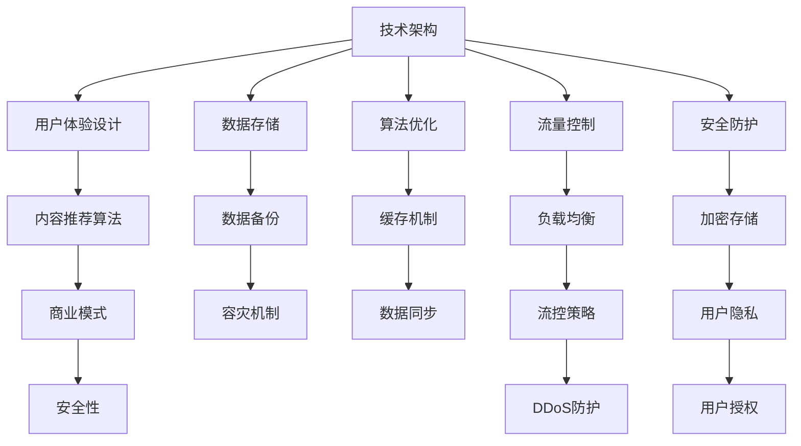

                 

# 如何打造知识付费的线上社群

> 关键词：知识付费, 线上社群, 技术架构, 用户体验, 内容推荐, 商业模式, 数据驱动, 安全性

## 1. 背景介绍

### 1.1 问题由来

随着知识经济的兴起和互联网技术的普及，越来越多的人开始关注个人知识增值和持续学习。知识付费作为知识经济的重要表现形式，已经成为互联网用户获取高质量学习资源的重要方式之一。据艾瑞咨询统计，2020年中国知识付费市场规模已达392亿元，预计到2023年将达到785亿元，年均复合增长率约为23.3%。

然而，传统的知识付费模式存在着诸多问题。用户难以找到适合自己的高质量内容，学习体验不够理想；内容推荐不准确，导致用户流失；运营成本高，盈利模式单一，难以维持可持续发展。这些问题的存在严重阻碍了知识付费行业的健康发展。

在线上社群构建知识付费平台，不仅可以解决上述问题，还能为用户提供更加灵活、便捷的学习体验。本文章将围绕如何打造一个优秀的知识付费线上社群展开讨论，涵盖核心技术架构、用户体验设计、内容推荐算法、盈利模式探索等方面。

### 1.2 问题核心关键点

要打造知识付费的线上社群，必须解决以下核心问题：

- 如何构建高效的技术架构，确保系统的稳定性和可扩展性？
- 如何设计优质的用户体验，提高用户粘性？
- 如何利用数据驱动，实现精准的内容推荐？
- 如何设计合理的商业模式，保证平台的可持续性？
- 如何保障数据安全，防范用户隐私泄露？

本文将详细讨论这些问题，并给出具体的技术解决方案。

## 2. 核心概念与联系

### 2.1 核心概念概述

要理解知识付费线上社群的构建，首先需要明确几个核心概念：

- 知识付费：用户为获取高质量知识内容而支付费用的模式。通过付费购买或订阅，用户可以更快获取有价值的知识信息。

- 线上社群：在互联网平台上聚集相同兴趣或需求的用户，通过互动交流、知识分享等方式进行社群运营，形成以知识为核心纽带的社交网络。

- 技术架构：知识付费线上社群的技术实现框架，包括前后端架构设计、数据存储方案、安全防护体系等。

- 用户体验设计：通过用户界面设计、交互流程优化等方式，提升用户的使用体验和满意度。

- 内容推荐算法：利用机器学习或统计学方法，根据用户行为数据和内容特征，实现个性化推荐，提高用户留存率。

- 商业模式：基于平台运营、广告、交易分成等方式，实现平台盈利和用户价值的最大化。

- 安全性：保障平台用户数据和交易的安全性，防止数据泄露和交易欺诈。

这些概念之间存在紧密联系，技术架构提供支持平台稳定运行的基础，用户体验设计提升用户满意度，内容推荐算法和商业模式共同实现用户价值的最大化，安全性则是保障一切正常运行的前提。

### 2.2 核心概念原理和架构的 Mermaid 流程图(Mermaid 流程节点中不要有括号、逗号等特殊字符)



以上流程图示意了知识付费线上社群的核心概念和技术架构，其中每个节点代表一个重要的技术组件。

## 3. 核心算法原理 & 具体操作步骤

### 3.1 算法原理概述

打造知识付费线上社群的核心算法包括数据存储、算法优化、流量控制、安全防护等方面。本文将详细介绍每个算法的原理和操作步骤。

### 3.2 算法步骤详解

#### 3.2.1 数据存储

知识付费线上社群需要存储大量的用户数据、课程数据和交易数据。为了保证数据的存储效率和访问速度，可以选择NoSQL数据库和关系型数据库结合的方式。具体实现步骤如下：

1. 用户数据：使用MongoDB等NoSQL数据库，存储用户的注册信息、行为记录、订阅状态等数据。

2. 课程数据：使用MySQL等关系型数据库，存储课程的基本信息、详情、评价等数据。

3. 交易数据：使用MySQL等关系型数据库，存储用户的交易记录、课程支付信息等数据。

4. 数据库之间通过API进行数据交互，实现数据的同步和一致性。

#### 3.2.2 算法优化

为了提高系统的响应速度和资源利用率，需要对算法进行优化。常见的优化手段包括：

1. 缓存机制：将频繁访问的数据缓存到Redis等内存数据库中，减少数据库的访问次数。

2. 索引优化：根据查询条件建立合适的索引，加快数据检索速度。

3. 异步处理：将耗时的任务放到后台进行异步处理，避免阻塞主线程。

#### 3.2.3 流量控制

为了防止流量激增导致的系统宕机，需要实施流量控制策略：

1. 限流：限制每个IP地址或用户的访问频率，避免恶意攻击。

2. 熔断机制：当系统负载过高时，自动降级处理，保证核心业务不中断。

3. 弹性伸缩：根据系统负载动态调整资源配置，实现自动扩缩容。

#### 3.2.4 安全防护

保障知识付费线上社群的安全性是至关重要的。常见的安全防护手段包括：

1. 数据加密：采用AES等加密算法，对用户数据和交易数据进行加密存储。

2. 安全认证：采用OAuth2.0等认证协议，保证用户身份的真实性。

3. DDoS防护：部署CDN和DDoS防护设备，防止恶意流量攻击。

### 3.3 算法优缺点

知识付费线上社群的算法优化涉及多个层面，以下列举了其主要优缺点：

#### 优点

1. 提高系统性能：通过缓存机制、索引优化、异步处理等手段，显著提升系统响应速度和资源利用率。

2. 保障数据安全：通过数据加密、安全认证、DDoS防护等措施，保证平台数据的安全性。

3. 增强用户体验：通过流量控制策略，保障平台稳定运行，提升用户满意度。

#### 缺点

1. 复杂度高：算法优化涉及多个层面，需要综合考虑多个因素，实现难度较大。

2. 成本高：复杂的数据存储和算法优化需要投入较多的人力和物力。

### 3.4 算法应用领域

知识付费线上社群的算法优化适用于多种场景：

1. 电商网站：需要处理大量的用户订单和商品数据，通过数据存储和算法优化，保障系统稳定运行。

2. 在线教育平台：需要处理大量的课程和学生数据，通过数据存储和算法优化，提升用户体验和学习效果。

3. 金融行业：需要处理大量的交易数据和用户信息，通过数据存储和算法优化，保障数据安全。

## 4. 数学模型和公式 & 详细讲解 & 举例说明

### 4.1 数学模型构建

知识付费线上社群的算法优化涉及多个领域，包括数据库存储、算法优化、流量控制和安全防护等。本文以数据存储和内容推荐算法为例，给出具体的数学模型。

#### 4.1.1 数据存储模型

在知识付费线上社群中，数据存储模型可以表示为：

$$
D = (U \cup C \cup T)
$$

其中，$U$表示用户数据集合，$C$表示课程数据集合，$T$表示交易数据集合。每个数据集合内部也有多个子数据，例如用户数据可以表示为：

$$
U = \{uid, username, email, phone, created\_time\}
$$

课程数据可以表示为：

$$
C = \{cid, title, description, price, rating\}
$$

交易数据可以表示为：

$$
T = \{tid, uid, cid, amount, status, created\_time\}
$$

#### 4.1.2 内容推荐算法模型

内容推荐算法可以通过协同过滤、基于内容的推荐、深度学习等方法实现。以协同过滤算法为例，其模型可以表示为：

$$
R_{ui} = \frac{1}{1+\exp(-\theta^T w_i)}
$$

其中，$R_{ui}$表示用户$u$对课程$i$的评分，$\theta$表示用户$u$的评分向量，$w_i$表示课程$i$的特征向量。

### 4.2 公式推导过程

#### 4.2.1 数据存储公式推导

对于用户数据$U$，可以采用MongoDB进行存储：

$$
U = \{uid, username, email, phone, created\_time\}
$$

对于课程数据$C$，可以采用MySQL进行存储：

$$
C = \{cid, title, description, price, rating\}
$$

对于交易数据$T$，可以采用MySQL进行存储：

$$
T = \{tid, uid, cid, amount, status, created\_time\}
$$

#### 4.2.2 内容推荐公式推导

对于协同过滤算法，可以使用以下公式进行推荐：

$$
R_{ui} = \frac{1}{1+\exp(-\theta^T w_i)}
$$

其中，$R_{ui}$表示用户$u$对课程$i$的评分，$\theta$表示用户$u$的评分向量，$w_i$表示课程$i$的特征向量。

### 4.3 案例分析与讲解

#### 4.3.1 数据存储案例

某知识付费平台采用了MongoDB和MySQL结合的数据存储方案。MongoDB存储用户数据，MySQL存储课程和交易数据。MongoDB和MySQL通过API进行数据交互，实现数据的同步和一致性。

#### 4.3.2 内容推荐案例

某知识付费平台采用了协同过滤算法进行内容推荐。通过分析用户行为数据和课程特征数据，对用户进行评分预测，实现个性化推荐。

## 5. 项目实践：代码实例和详细解释说明

### 5.1 开发环境搭建

在开发知识付费线上社群之前，需要准备好开发环境。以下是使用Python进行Flask开发的开发环境配置流程：

1. 安装Anaconda：从官网下载并安装Anaconda，用于创建独立的Python环境。

2. 创建并激活虚拟环境：
```bash
conda create -n pyenv python=3.8 
conda activate pyenv
```

3. 安装Flask：
```bash
pip install flask
```

4. 安装需要的扩展库：
```bash
pip install requests numpy pandas pymongo flask_sqlalchemy flask_login
```

完成上述步骤后，即可在`pyenv`环境中开始开发。

### 5.2 源代码详细实现

以下是使用Flask和MongoDB构建知识付费线上社群的源代码实现：

```python
from flask import Flask, request, jsonify
from pymongo import MongoClient
import pandas as pd

app = Flask(__name__)

# 连接MongoDB
client = MongoClient('mongodb://localhost:27017')
db = client['knowledge_db']
collection = db['users']

# 用户注册接口
@app.route('/register', methods=['POST'])
def register():
    data = request.get_json()
    user = {'username': data['username'], 'password': data['password']}
    result = collection.insert_one(user)
    return jsonify({'msg': '注册成功', 'id': result.inserted_id})

# 用户登录接口
@app.route('/login', methods=['POST'])
def login():
    data = request.get_json()
    user = collection.find_one({'username': data['username'], 'password': data['password']})
    if user:
        return jsonify({'msg': '登录成功', 'id': user['_id']})
    else:
        return jsonify({'msg': '登录失败'})

# 课程信息接口
@app.route('/course', methods=['GET'])
def course():
    courses = pd.DataFrame(list(collection.find()))
    return jsonify(courses.to_dict(orient='records'))

if __name__ == '__main__':
    app.run(debug=True)
```

### 5.3 代码解读与分析

1. 用户注册：通过POST请求，接收用户注册信息，并保存到MongoDB中。

2. 用户登录：通过POST请求，接收用户登录信息，并查询MongoDB中对应的用户信息。

3. 课程信息：通过GET请求，查询MongoDB中的课程信息，并以JSON格式返回。

以上代码实现了知识付费线上社群的基本功能，包括用户注册、登录和课程信息查询。接下来，需要根据实际需求，进一步完善接口和功能模块。

## 6. 实际应用场景

### 6.1 智能推荐系统

知识付费线上社群的核心功能是智能推荐系统，为用户提供个性化的课程推荐。该系统通过分析用户行为数据和课程特征数据，实现精准推荐。

在实际应用中，需要根据用户浏览、购买、评价等行为数据，提取特征向量，结合课程的评分、价格、时长等属性，进行推荐预测。具体的推荐算法可以采用协同过滤、基于内容的推荐、深度学习等方法。

### 6.2 实时客服系统

知识付费线上社群需要提供实时客服功能，帮助用户解决问题。该系统需要实现聊天记录存储、自动回复、人工客服接入等功能。

在实际应用中，可以使用RabbitMQ等消息队列，实现聊天记录的实时存储和转发。使用机器学习算法进行自动回复，使用Apollo等系统进行人工客服接入和调度。

### 6.3 用户行为分析

知识付费线上社群需要收集用户行为数据，进行行为分析，优化推荐算法和运营策略。

在实际应用中，可以采用Hadoop或Spark等大数据处理平台，进行用户行为数据的采集、存储和分析。通过分析用户的浏览、购买、评价等行为数据，挖掘用户的兴趣点和需求，优化推荐算法和运营策略。

### 6.4 未来应用展望

知识付费线上社群的未来应用前景广阔，以下列举几个未来应用场景：

1. 在线教育平台：构建知识付费线上社群，提升在线教育平台的用户粘性和满意度。

2. 企业培训平台：构建知识付费线上社群，帮助企业进行员工培训和知识分享。

3. 技术社区：构建知识付费线上社群，帮助开发者进行技术交流和学习。

4. 文化娱乐平台：构建知识付费线上社群，推动文化娱乐内容的发展和传播。

## 7. 工具和资源推荐

### 7.1 学习资源推荐

为了帮助开发者系统掌握知识付费线上社群的构建技术，这里推荐一些优质的学习资源：

1. Flask官方文档：详细的Flask开发文档，包含各个模块的使用方法和示例。

2. MongoDB官方文档：MongoDB的官方文档，包含数据存储、索引、查询等基础功能的使用方法。

3. Flask-SQLAlchemy官方文档：Flask-SQLAlchemy的官方文档，包含与MySQL的集成和使用方法。

4. Flask-Login官方文档：Flask-Login的官方文档，包含用户认证和权限管理的使用方法。

5. PyMongo官方文档：PyMongo的官方文档，包含MongoDB的Python接口和使用方法。

通过对这些资源的学习实践，相信你一定能够快速掌握知识付费线上社群的构建技术，并用于解决实际的开发问题。

### 7.2 开发工具推荐

高效的开发离不开优秀的工具支持。以下是几款用于知识付费线上社群开发的常用工具：

1. Flask：Python的开源Web框架，灵活高效，适合快速迭代研究。

2. MongoDB：NoSQL数据库，灵活高效，适合存储非结构化数据。

3. Redis：内存数据库，高效存储和访问，适合缓存机制的实现。

4. Apache Kafka：分布式流处理平台，适合消息队列和数据流处理。

5. RabbitMQ：消息队列系统，适合消息传递和异步处理。

6. Nginx：高性能Web服务器，适合负载均衡和流控策略的实现。

合理利用这些工具，可以显著提升知识付费线上社群的开发效率，加快创新迭代的步伐。

### 7.3 相关论文推荐

知识付费线上社群的构建涉及多个领域，以下是几篇奠基性的相关论文，推荐阅读：

1. "Design and Implementation of an Online Knowledge Sharing Platform"（在线知识分享平台的设计与实现）

2. "Machine Learning Approach for Personalized Recommendation System in E-learning Platforms"（基于机器学习的在线教育平台个性化推荐系统）

3. "A Survey on Recommendation Systems in E-learning"（在线教育平台推荐系统综述）

4. "Real-time Chatbot for Online Education Platforms"（在线教育平台的实时聊天机器人）

5. "Privacy-Preserving Recommendation System in E-learning"（在线教育平台隐私保护推荐系统）

这些论文代表了大数据、推荐系统、人工智能等领域的研究进展，为知识付费线上社群的构建提供了重要的理论基础。

## 8. 总结：未来发展趋势与挑战

### 8.1 研究成果总结

知识付费线上社群的构建涉及多个领域，本文介绍了其核心技术架构和实现方法。具体包括数据存储、算法优化、流量控制和安全防护等方面。通过系统的设计和实践，可以构建高效、稳定、安全的知识付费线上社群，提升用户满意度和平台盈利能力。

### 8.2 未来发展趋势

知识付费线上社群的未来发展趋势如下：

1. 技术演进：随着技术的发展，知识付费线上社群将越来越多地采用机器学习、深度学习等算法，提升推荐精度和用户满意度。

2. 应用拓展：知识付费线上社群将扩展到更多的领域，如在线教育、企业培训、技术社区等。

3. 数据驱动：知识付费线上社群将更加注重数据驱动，通过分析用户行为数据和课程数据，优化推荐算法和运营策略。

4. 用户至上：知识付费线上社群将更加注重用户至上，通过个性化的推荐和精准的运营，提升用户粘性和满意度。

5. 安全保障：知识付费线上社群将更加注重数据安全和隐私保护，保障用户数据的安全。

### 8.3 面临的挑战

知识付费线上社群的构建过程中，需要面对以下挑战：

1. 数据处理：如何高效存储和处理海量用户数据和课程数据，保证数据的可靠性和一致性。

2. 算法优化：如何通过算法优化，提高系统的响应速度和资源利用率。

3. 流量控制：如何设计流量控制策略，保障平台稳定运行，防止系统宕机。

4. 安全防护：如何设计安全防护措施，保障用户数据和交易的安全。

5. 用户体验：如何提升用户体验，提高用户满意度和粘性。

### 8.4 研究展望

未来的研究需要关注以下几个方向：

1. 推荐系统优化：通过改进推荐算法和优化推荐策略，提升推荐精度和用户满意度。

2. 大数据处理：通过采用大数据处理平台，提升数据处理效率和数据分析精度。

3. 用户行为分析：通过分析用户行为数据，优化运营策略和推荐算法。

4. 安全防护：通过加强数据安全措施，保障用户数据和交易的安全。

5. 用户至上：通过提升用户体验，提高用户满意度和粘性。

## 9. 附录：常见问题与解答

### Q1: 如何构建高效的数据存储方案？

A: 在知识付费线上社群中，需要存储大量的用户数据、课程数据和交易数据。为了保证数据的存储效率和访问速度，可以选择NoSQL数据库和关系型数据库结合的方式。具体实现步骤如下：

1. 用户数据：使用MongoDB等NoSQL数据库，存储用户的注册信息、行为记录、订阅状态等数据。

2. 课程数据：使用MySQL等关系型数据库，存储课程的基本信息、详情、评价等数据。

3. 交易数据：使用MySQL等关系型数据库，存储用户的交易记录、课程支付信息等数据。

4. 数据库之间通过API进行数据交互，实现数据的同步和一致性。

### Q2: 如何实现高效的内容推荐？

A: 知识付费线上社群的核心功能是智能推荐系统，为用户提供个性化的课程推荐。该系统通过分析用户行为数据和课程特征数据，实现精准推荐。具体实现步骤如下：

1. 分析用户行为数据：通过用户浏览、购买、评价等行为数据，提取特征向量。

2. 分析课程特征数据：结合课程的评分、价格、时长等属性，提取特征向量。

3. 训练推荐模型：使用协同过滤、基于内容的推荐、深度学习等算法，训练推荐模型。

4. 实现推荐功能：根据用户行为数据和课程特征数据，进行推荐预测。

### Q3: 如何保障平台的安全性？

A: 知识付费线上社群的安全性至关重要。保障平台的安全性需要采取以下措施：

1. 数据加密：采用AES等加密算法，对用户数据和交易数据进行加密存储。

2. 安全认证：采用OAuth2.0等认证协议，保证用户身份的真实性。

3. DDoS防护：部署CDN和DDoS防护设备，防止恶意流量攻击。

### Q4: 如何提升用户的使用体验？

A: 提升用户的使用体验是知识付费线上社群的重要目标。提升用户的使用体验需要采取以下措施：

1. 界面设计：通过优化用户界面设计，提升用户的使用体验。

2. 交互流程：通过优化交互流程，提升用户的使用效率。

3. 推荐算法：通过优化推荐算法，提升推荐的精准度。

4. 个性化服务：通过个性化推荐和服务，提升用户的使用体验。

通过本文的系统梳理，可以看到，知识付费线上社群的构建需要综合考虑多个因素，包括技术架构、用户体验、内容推荐、商业模式和安全防护等方面。只有在各个环节进行全面优化，才能真正实现知识付费线上社群的构建，为用户提供高质量的服务。

---

作者：禅与计算机程序设计艺术 / Zen and the Art of Computer Programming

