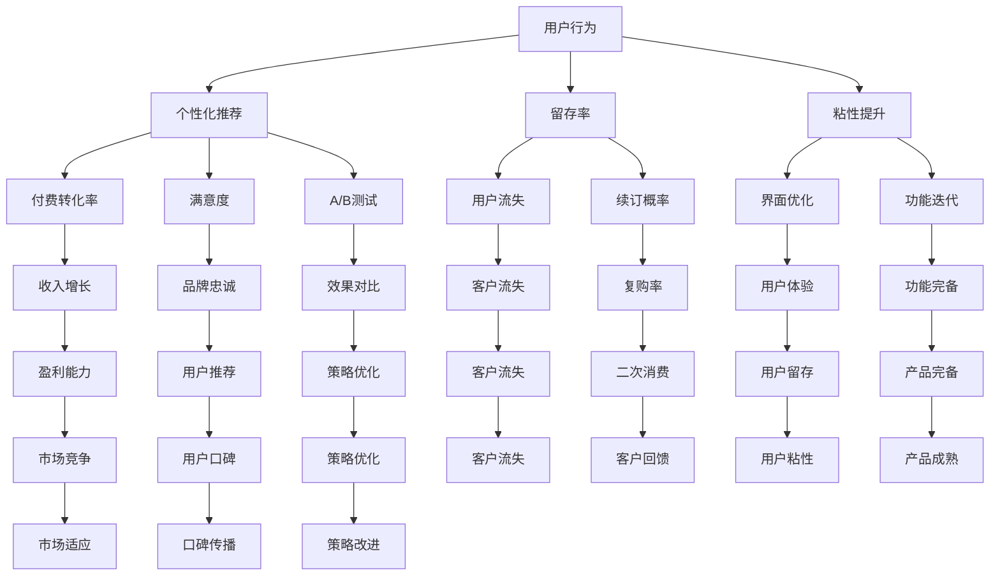

                 

# 如何提高知识付费产品的用户忠诚度

> 关键词：知识付费,用户行为,个性化推荐,留存率,粘性提升

## 1. 背景介绍

在数字化、信息化的浪潮下，知识付费作为一种新兴的学习方式，正日益受到人们的关注。通过付费获取知识，不仅能够节省时间成本，还能获得系统化、高品质的内容。但与此同时也面临着用户流失率高、用户粘性不足等问题。如何提高知识付费产品的用户忠诚度，成为摆在每一个产品团队面前的重要课题。

## 2. 核心概念与联系

### 2.1 核心概念概述

为深入探讨用户忠诚度的提升方法，本节将介绍几个核心概念及其相互关联：

- **用户忠诚度**：指用户对某个知识付费产品的持续使用和忠实程度。高用户忠诚度不仅意味着用户消费频次和消费金额的增加，还表明用户对产品的认可和推荐。

- **用户行为**：用户对知识付费产品的使用行为，包括访问频率、停留时间、付费频次等。深入理解用户行为，有助于优化产品功能，提升用户体验。

- **个性化推荐**：基于用户历史行为、偏好，精准推送符合用户需求的内容，从而提升用户满意度和粘性。

- **留存率**：用户在一次付费后持续使用产品的概率。留存率是衡量用户忠诚度的重要指标之一。

- **粘性提升**：通过优化用户界面、功能等，增加用户在产品上的停留时间，增强用户的黏性。

- **A/B测试**：通过同时测试两种或多种策略，对比其效果，从而找到最优的提升方案。

- **数据驱动**：以用户行为数据为基础，指导产品设计和优化，使产品更符合用户需求。

这些核心概念通过一定的方式联系起来，形成一个整体框架，指导知识付费产品提升用户忠诚度的实践。

### 2.2 核心概念原理和架构的 Mermaid 流程图



## 3. 核心算法原理 & 具体操作步骤

### 3.1 算法原理概述

知识付费产品的用户忠诚度提升，本质上是一个多目标优化问题。主要关注以下几个指标：

- **付费转化率**：提升付费转化率，增加新用户，扩大用户基础。
- **留存率**：提高用户留存率，增加用户使用时长。
- **满意度**：提升用户满意度，增强用户对产品的认可和忠诚。

这些目标互相联系，构成一个有机的整体。因此，提升用户忠诚度的关键在于平衡这些目标，从而构建一个循环反馈的优化过程。

### 3.2 算法步骤详解

以下步骤详细描述了提升知识付费产品用户忠诚度的算法实现：

**Step 1: 数据收集与清洗**
- 收集用户行为数据，包括登录次数、停留时长、阅读时长、付费记录等。
- 对数据进行清洗，去除异常值和噪声，确保数据质量。

**Step 2: 特征工程**
- 根据用户行为数据，提取有意义的特征，如用户活跃度、消费频率、偏好标签等。
- 对特征进行归一化、标准化等预处理，提高后续模型的准确性。

**Step 3: 模型训练与优化**
- 选择合适的机器学习算法，如随机森林、梯度提升树、深度学习等，建立用户行为预测模型。
- 在训练集上训练模型，使用交叉验证等方法评估模型效果。
- 对模型进行调参优化，提高预测精度和泛化能力。

**Step 4: 个性化推荐**
- 基于用户行为预测模型，推荐个性化内容。
- 引入协同过滤、基于内容的推荐等技术，增强推荐效果。
- 对推荐结果进行实时更新和迭代，不断优化。

**Step 5: A/B测试**
- 设计多个推荐策略，如推荐算法、内容种类、推荐时间等。
- 同时测试不同策略，对比其效果。
- 根据测试结果，选择最优策略。

**Step 6: 反馈与调整**
- 收集用户反馈，根据用户需求和反馈不断调整产品策略。
- 定期评估各个目标的达成情况，如付费转化率、留存率、满意度等。
- 根据评估结果，持续优化推荐算法和模型，提升用户忠诚度。

### 3.3 算法优缺点

提升知识付费产品用户忠诚度的算法具有以下优点：
- 基于数据驱动，能够客观评估用户行为和需求，提高推荐效果。
- 能够多目标优化，平衡付费转化率、留存率和满意度，提升整体用户体验。
- 通过A/B测试等实验手段，不断优化策略，确保效果最大化。

同时，该算法也存在一定的局限性：
- 对数据质量要求较高，需进行清洗和预处理。
- 模型训练和调参过程较为复杂，需要专业知识。
- 个性化推荐算法需要持续更新，增加运营成本。

尽管存在这些局限性，但通过不断迭代优化，该算法仍能够显著提升知识付费产品的用户忠诚度。

### 3.4 算法应用领域

基于此算法，知识付费产品能够广泛应用在以下场景：

- **新用户激活**：通过个性化推荐，引导新用户快速适应产品，并转化为付费用户。
- **老用户留存**：针对不同用户的长期行为特征，进行精准内容推送，延长用户在产品中的停留时间。
- **二次消费**：根据用户的历史行为和消费记录，推荐新内容，促进用户二次消费。
- **品牌传播**：通过内容质量提升和用户口碑建设，增强用户粘性，提升品牌影响力。

## 4. 数学模型和公式 & 详细讲解

### 4.1 数学模型构建

设用户$i$在时间$t$内，付费转化率为$R_i$，留存率为$S_i$，满意度为$H_i$。假设这些变量由以下模型决定：

$$
R_i = f(x_i), \quad S_i = g(x_i), \quad H_i = h(x_i)
$$

其中，$x_i$为用户的特征向量。

### 4.2 公式推导过程

假设模型$f$、$g$、$h$均为线性回归模型，则有：

$$
f(x_i) = \beta_0 + \sum_{k=1}^n \beta_k x_{ik}, \quad g(x_i) = \gamma_0 + \sum_{k=1}^m \gamma_k x_{ik}, \quad h(x_i) = \delta_0 + \sum_{k=1}^o \delta_k x_{ik}
$$

其中，$\beta_k$、$\gamma_k$、$\delta_k$为模型的系数，$x_{ik}$为特征向量的第$k$个元素。

### 4.3 案例分析与讲解

以推荐系统为例，假设用户$i$在时间$t$内，对内容$j$的点击率为$C_{ij}$，消费概率为$P_{ij}$。假设这些变量由以下模型决定：

$$
C_{ij} = \alpha_0 + \sum_{k=1}^n \alpha_k x_{ik} + \sum_{k=1}^o \alpha_k x_{ij}, \quad P_{ij} = \beta_0 + \sum_{k=1}^m \beta_k x_{ik} + \sum_{k=1}^o \beta_k x_{ij}
$$

其中，$\alpha_k$、$\beta_k$为模型的系数，$x_{ik}$为用户的第$k$个特征，$x_{ij}$为内容的特征。

通过上述模型，可以预测用户对不同内容的点击和消费行为，进而进行个性化推荐。

## 5. 项目实践：代码实例和详细解释说明

### 5.1 开发环境搭建

在进行知识付费产品用户忠诚度提升的实践前，需要搭建好开发环境。以下是Python开发环境搭建的步骤：

1. 安装Python：从官网下载安装Python，建议安装最新版本，以获取最新的功能和性能。
2. 安装依赖包：安装必要的Python库，如NumPy、Pandas、Scikit-learn、TensorFlow等，用于数据处理和模型训练。
3. 配置环境：配置虚拟环境，以便独立管理不同项目的依赖。

### 5.2 源代码详细实现

以下是一个基于机器学习模型的个性化推荐系统的示例代码：

```python
import numpy as np
from sklearn.model_selection import train_test_split
from sklearn.ensemble import RandomForestRegressor
from sklearn.metrics import mean_absolute_error, mean_squared_error

# 数据加载与预处理
data = pd.read_csv('user_behavior.csv')
X = data[['feature1', 'feature2', 'feature3', ...]]
y_r = data['revenue']
y_s = data['satisfaction']
y_c = data['churn_rate']

# 特征工程
X_train, X_test, y_r_train, y_r_test = train_test_split(X, y_r, test_size=0.2)
X_s_train, X_s_test, y_s_train, y_s_test = train_test_split(X, y_s, test_size=0.2)
X_c_train, X_c_test, y_c_train, y_c_test = train_test_split(X, y_c, test_size=0.2)

# 模型训练与评估
model_r = RandomForestRegressor(n_estimators=100, random_state=42)
model_s = RandomForestRegressor(n_estimators=100, random_state=42)
model_c = RandomForestRegressor(n_estimators=100, random_state=42)

model_r.fit(X_train, y_r_train)
model_s.fit(X_train, y_s_train)
model_c.fit(X_train, y_c_train)

# 模型评估
score_r = mean_absolute_error(y_r_test, model_r.predict(X_test))
score_s = mean_squared_error(y_s_test, model_s.predict(X_test))
score_c = mean_absolute_error(y_c_test, model_c.predict(X_test))

# 结果输出
print(f'Revenue prediction MAE: {score_r:.2f}, Satisfaction prediction MSE: {score_s:.2f}, Churn rate MAE: {score_c:.2f}')
```

### 5.3 代码解读与分析

**用户行为数据**：
- `pd.read_csv('user_behavior.csv')`：从CSV文件中读取用户行为数据。
- `X = data[['feature1', 'feature2', 'feature3', ...]]`：选择特征列，构建特征矩阵。

**模型训练与评估**：
- `RandomForestRegressor`：使用随机森林回归模型进行训练。
- `train_test_split`：将数据集划分为训练集和测试集，用于模型评估。
- `mean_absolute_error`和`mean_squared_error`：分别用于评估回归模型的MAE和MSE。

**结果输出**：
- `print(f'Revenue prediction MAE: {score_r:.2f}, Satisfaction prediction MSE: {score_s:.2f}, Churn rate MAE: {score_c:.2f}')`：输出模型的预测精度和评估指标。

## 6. 实际应用场景

### 6.1 在线教育平台

在线教育平台通过知识付费服务，为用户提供系统化、高质量的教育资源。为了提高用户忠诚度，平台可以通过个性化推荐，精准推送符合用户需求的内容，如课程、书籍、视频等。同时，平台可以通过分析用户学习行为，提供定制化学习计划，提升用户满意度和粘性。

### 6.2 健康管理应用

健康管理应用通过知识付费，为用户提供科学的健康知识和个性化健康方案。通过个性化推荐，应用可以根据用户健康数据和偏好，推荐适合的健康计划和知识内容。同时，应用可以分析用户健康数据，提供健康指导和建议，提升用户满意度和粘性。

### 6.3 财务管理工具

财务管理工具通过知识付费，提供财务管理知识和工具，帮助用户更好地管理财务。通过个性化推荐，工具可以根据用户理财需求，推荐适合的理财课程、书籍和工具。同时，工具可以分析用户消费行为，提供个性化理财建议，提升用户满意度和粘性。

### 6.4 未来应用展望

随着技术的发展，知识付费产品的用户忠诚度提升将会有更多的应用场景：

- **虚拟现实(VR)互动**：结合VR技术，为用户提供沉浸式的学习体验，增强用户粘性。
- **AI辅助**：引入AI技术，提升个性化推荐和内容生成的效果，提升用户体验。
- **社区互动**：建立用户社区，促进用户交流和互动，增强用户归属感和忠诚度。
- **跨平台协同**：在不同平台间协同优化用户体验，提升整体用户忠诚度。

## 7. 工具和资源推荐

### 7.1 学习资源推荐

为了帮助开发者系统掌握知识付费产品用户忠诚度提升的理论基础和实践技巧，这里推荐一些优质的学习资源：

1. 《数据科学与机器学习》系列课程：涵盖数据科学和机器学习的全面知识，适合初学者和进阶者。
2. 《Python编程快速上手》书籍：介绍Python编程的基础知识和实践技巧，适合初学者。
3. 《推荐系统实战》书籍：详细介绍推荐系统的理论基础和算法实现，适合进阶开发者。
4. 《Kaggle竞赛指南》书籍：介绍Kaggle竞赛的经验和技巧，适合竞赛选手和开发者。
5. 《深度学习理论与实践》课程：涵盖深度学习的基础理论和实践应用，适合进阶开发者。

通过对这些资源的学习实践，相信你一定能够快速掌握知识付费产品用户忠诚度提升的精髓，并用于解决实际的NLP问题。

### 7.2 开发工具推荐

高效的开发离不开优秀的工具支持。以下是几款用于知识付费产品用户忠诚度提升开发的常用工具：

1. Jupyter Notebook：交互式编程环境，便于数据分析和模型训练。
2. Git：版本控制工具，便于团队协作和版本管理。
3. Docker：容器化部署工具，便于应用发布和迁移。
4. Kubernetes：容器编排工具，便于应用部署和管理。
5. Hadoop：大数据处理平台，便于大规模数据处理。
6. Spark：分布式计算平台，便于快速数据处理和分析。

合理利用这些工具，可以显著提升知识付费产品用户忠诚度提升的开发效率，加快创新迭代的步伐。

### 7.3 相关论文推荐

知识付费产品用户忠诚度提升的研究源于学界的持续研究。以下是几篇奠基性的相关论文，推荐阅读：

1. "User-Centricity and Adoption of Personalized Recommender Systems"：研究用户需求在个性化推荐系统中的重要性。
2. "Churn Prediction and User Retention Strategies for Online Learning Platforms"：研究在线学习平台的流失用户预测和留存策略。
3. "AI-based Personalization for Knowledge Product Recommendation"：研究AI技术在知识付费产品个性化推荐中的应用。
4. "Behavioral Economics of Subscription-based Products"：研究订阅产品的用户行为和经济模型。
5. "Value Driven Personalization for SaaS Products"：研究SaaS产品的价值驱动个性化策略。

这些论文代表了大语言模型微调技术的发展脉络。通过学习这些前沿成果，可以帮助研究者把握学科前进方向，激发更多的创新灵感。

## 8. 总结：未来发展趋势与挑战

### 8.1 研究成果总结

本文对知识付费产品用户忠诚度提升的方法进行了全面系统的介绍。首先阐述了用户忠诚度的重要性，并介绍了提升用户忠诚度的关键步骤。其次，详细讲解了算法的原理和具体操作步骤，给出了代码实例和详细解释。同时，本文还探讨了算法的优缺点及其应用领域，提供了丰富的学习资源和开发工具。

通过本文的系统梳理，可以看到，知识付费产品用户忠诚度提升方法具有较高的实用价值和广阔的应用前景。这些方法的实际应用，不仅能够提升用户体验，还能带来可观的商业价值，有助于知识付费产品的持续发展。

### 8.2 未来发展趋势

展望未来，知识付费产品用户忠诚度提升将呈现以下几个发展趋势：

1. **AI技术深度应用**：AI技术在个性化推荐、内容生成等方面的应用将更加广泛，提升用户体验和粘性。
2. **数据隐私保护**：用户隐私保护将成为重要研究方向，如何在保障用户隐私的同时，提升推荐效果，是未来的重要课题。
3. **跨平台协同优化**：不同平台间的协同优化，能够提升用户整体体验，增强用户忠诚度。
4. **持续优化与迭代**：用户需求和行为不断变化，需要持续优化和迭代推荐算法，保持用户粘性。
5. **新业务模式的探索**：结合知识付费产品的新业务模式，如虚拟现实、社区互动等，进一步提升用户忠诚度。

### 8.3 面临的挑战

尽管知识付费产品用户忠诚度提升方法取得了显著成效，但在实现过程中，仍面临以下挑战：

1. **数据质量问题**：用户行为数据存在缺失、噪声等质量问题，影响模型的准确性和效果。
2. **算法复杂性**：推荐算法和模型训练需要专业知识，对开发人员要求较高。
3. **用户隐私保护**：用户隐私保护和数据安全问题，成为制约知识付费产品发展的瓶颈。
4. **成本和收益平衡**：个性化推荐系统的建设和维护成本较高，需要合理的商业模型来平衡成本和收益。

### 8.4 研究展望

面对知识付费产品用户忠诚度提升面临的挑战，未来的研究需要在以下几个方面寻求新的突破：

1. **数据质量提升**：通过数据清洗和预处理，提高数据质量和准确性，确保推荐效果。
2. **算法简化**：开发更加简洁高效的推荐算法，降低开发难度和成本。
3. **隐私保护技术**：引入隐私保护技术，如差分隐私、联邦学习等，保障用户隐私安全。
4. **成本优化**：设计合理的商业模型，平衡个性化推荐系统的建设和维护成本。
5. **新业务模式探索**：结合新兴技术和新业务模式，探索提升用户忠诚度的新途径。

这些研究方向将引领知识付费产品用户忠诚度提升技术迈向更高的台阶，为构建安全、可靠、可解释、可控的智能系统铺平道路。面向未来，知识付费产品用户忠诚度提升技术还需要与其他人工智能技术进行更深入的融合，如知识表示、因果推理、强化学习等，多路径协同发力，共同推动自然语言理解和智能交互系统的进步。只有勇于创新、敢于突破，才能不断拓展语言模型的边界，让智能技术更好地造福人类社会。

## 9. 附录：常见问题与解答

**Q1: 如何获取高质量的用户行为数据？**

A: 获取高质量的用户行为数据，需要进行详细的数据规划和收集策略：
1. 明确数据采集目标，如用户活跃度、消费频次、偏好标签等。
2. 选择合适的数据来源，如网站、应用、社交媒体等。
3. 使用数据采集工具，如Web爬虫、API接口等，获取用户行为数据。
4. 对数据进行清洗和预处理，去除噪声和异常值。
5. 定期更新数据，确保数据的时效性和准确性。

**Q2: 如何平衡个性化推荐和用户隐私？**

A: 在个性化推荐中，隐私保护是一个重要考虑因素。以下是一些常见的隐私保护措施：
1. 差分隐私：通过添加噪声，保护用户隐私的同时，确保推荐效果。
2. 联邦学习：在不泄露用户数据的前提下，进行模型训练和优化。
3. 数据匿名化：对用户数据进行匿名化处理，保护用户隐私。
4. 用户控制：允许用户自主控制数据使用权限，保护用户隐私。

**Q3: 如何选择推荐算法？**

A: 推荐算法的选择应根据具体业务需求和数据特征进行：
1. 基于协同过滤的推荐：适用于用户和物品数据较多的场景。
2. 基于内容的推荐：适用于物品特征丰富的场景。
3. 混合推荐：结合多种推荐算法，提高推荐效果。
4. 深度学习推荐：适用于数据量较大、特征较多的场景。

**Q4: 如何评估推荐系统的效果？**

A: 推荐系统的评估主要通过以下指标：
1. 准确率（Precision）：预测正确用户或物品的概率。
2. 召回率（Recall）：预测到所有正确用户或物品的比例。
3. F1-score：综合考虑准确率和召回率。
4. NDCG（Normalized Discounted Cumulative Gain）：衡量推荐系统的排序效果。
5. HR（Hit Rate）：推荐结果中包含正确用户或物品的比例。

通过以上指标，可以全面评估推荐系统的效果，并进行优化。

---

作者：禅与计算机程序设计艺术 / Zen and the Art of Computer Programming

