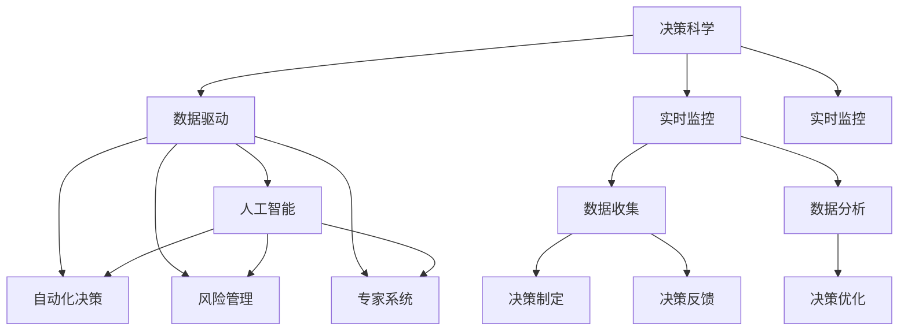
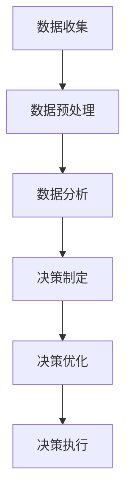

                 

# 如何提高管理决策的质量

> 关键词：
1. 决策科学
2. 数据驱动
3. 人工智能
4. 自动化决策
5. 风险管理
6. 专家系统
7. 实时监控

## 1. 背景介绍

在现代企业管理中，决策的质量直接影响着企业的运营效率和竞争力。传统的管理决策往往依赖于管理者的经验和直觉，容易受到偏见、情绪等因素的影响，导致决策错误。而随着信息技术的进步，特别是人工智能和大数据技术的崛起，为提高管理决策质量提供了新的可能性。通过引入决策科学和人工智能技术，可以实现数据驱动的决策分析，提高决策的科学性和客观性，降低决策风险，提升决策效率和效果。本文将系统介绍如何利用人工智能技术提高管理决策的质量，帮助管理者做出更明智的决策。

## 2. 核心概念与联系

### 2.1 核心概念概述

要提高管理决策的质量，首先需要理解一些关键概念：

- **决策科学**：以数据和理论为基础，通过科学方法制定和管理决策的过程。
- **数据驱动决策**：基于大量数据和分析结果进行决策，减少主观偏差，提高决策的准确性和可靠性。
- **人工智能**：模拟人类智能过程，使用机器学习、自然语言处理等技术解决复杂问题的技术。
- **自动化决策**：通过算法和规则自动化处理决策过程，提高决策效率。
- **风险管理**：通过风险评估和控制手段，降低决策过程中的不确定性和风险。
- **专家系统**：通过模拟人类专家的知识与推理过程，提供决策支持和建议。
- **实时监控**：通过传感器、监控系统等技术实时收集和分析数据，及时发现和处理问题，保障决策过程的连续性和实时性。

这些概念之间的联系可以通过以下Mermaid流程图来展示：



这个流程图展示了各个概念之间的逻辑关系：

1. 决策科学提供决策理论基础，数据驱动和人工智能技术基于理论支持，提高决策的科学性。
2. 自动化决策和专家系统利用人工智能技术辅助决策，提高决策效率和准确性。
3. 风险管理通过数据驱动的决策风险评估，降低决策过程中的不确定性。
4. 实时监控实时收集数据，保障决策过程的连续性和实时性，增强决策的时效性。

## 3. 核心算法原理 & 具体操作步骤

### 3.1 算法原理概述

利用人工智能技术提高管理决策质量的核心在于数据驱动的决策分析。主要通过以下几个步骤实现：

1. **数据收集**：通过传感器、监控系统等技术，实时收集业务数据。
2. **数据预处理**：清洗和转换数据，使其可用于分析。
3. **数据分析**：利用机器学习、深度学习等技术，对数据进行分析和建模。
4. **决策制定**：基于分析结果，制定决策方案。
5. **决策优化**：通过迭代优化，提高决策效果。
6. **决策执行**：将决策方案转化为具体行动。

这些步骤可以通过一个简单的流程图来表示：



### 3.2 算法步骤详解

#### 3.2.1 数据收集

数据收集是决策分析的基础。需要通过各种传感器、监控设备等技术手段，实时收集业务数据。例如：

- **传感器**：温度、湿度、压力等环境参数，设备运行状态等。
- **监控系统**：视频监控、网络流量、用户行为等。
- **用户反馈**：通过问卷、互动等方式获取用户反馈。

#### 3.2.2 数据预处理

数据预处理是对收集到的原始数据进行清洗、转换和标准化，使其可用于分析。主要步骤如下：

1. **数据清洗**：去除异常值、缺失值等无效数据。
2. **数据转换**：将原始数据转换为标准格式，如日期时间标准化、数据类型转换等。
3. **数据归一化**：将数据缩放到一定的范围，便于后续分析。

#### 3.2.3 数据分析

数据分析是利用机器学习、深度学习等技术，对数据进行分析和建模。主要步骤如下：

1. **特征工程**：提取和构建数据特征，选择重要特征。
2. **模型训练**：选择合适的算法，如回归、分类、聚类等，对数据进行建模。
3. **模型评估**：使用交叉验证、测试集等方法评估模型效果。

#### 3.2.4 决策制定

基于数据分析结果，制定决策方案。主要步骤如下：

1. **方案设计**：设计多个备选方案，评估每个方案的优缺点。
2. **方案选择**：通过模型评估和专家判断，选择最优方案。
3. **方案实施**：将决策方案转化为具体行动。

#### 3.2.5 决策优化

通过迭代优化，提高决策效果。主要步骤如下：

1. **反馈收集**：收集实施结果的反馈信息。
2. **效果评估**：评估实施效果，识别问题。
3. **优化调整**：根据反馈信息，调整决策方案。
4. **再次实施**：迭代执行优化后的方案。

#### 3.2.6 决策执行

决策执行是将决策方案转化为具体行动。主要步骤如下：

1. **任务分配**：将决策方案分配给具体的执行者。
2. **执行监控**：实时监控执行过程，确保执行结果符合预期。
3. **结果评估**：评估执行结果，记录效果。

### 3.3 算法优缺点

利用人工智能技术提高管理决策质量的方法具有以下优点：

1. **客观性强**：基于大量数据和分析结果，减少主观偏差，提高决策的客观性和可靠性。
2. **效率高**：利用自动化决策和专家系统，可以快速制定和优化决策方案，提高决策效率。
3. **风险控制**：通过风险评估和控制手段，降低决策过程中的不确定性和风险。
4. **可扩展性强**：可以通过添加新的数据和算法，快速扩展决策分析的范围和深度。

但这些方法也存在一些缺点：

1. **数据质量要求高**：需要高质量的数据和完善的预处理流程，否则会影响决策效果。
2. **算法复杂度高**：高级算法和模型的实现和调优需要较高的技术门槛。
3. **成本高**：数据收集、模型训练和优化需要投入大量人力和财力资源。

### 3.4 算法应用领域

人工智能技术在提高管理决策质量方面，可以应用于多个领域，例如：

- **生产管理**：通过实时监控设备运行状态和产品质量，优化生产流程，降低成本，提高效率。
- **库存管理**：通过数据分析，预测市场需求和供应链变化，优化库存管理策略。
- **客户服务**：通过数据分析和客户反馈，优化客户服务流程，提高客户满意度。
- **市场营销**：通过数据分析和客户行为预测，制定精准的市场营销策略，提高市场竞争力。
- **财务管理**：通过数据分析，优化财务决策，提高资金使用效率，降低财务风险。

## 4. 数学模型和公式 & 详细讲解 & 举例说明

### 4.1 数学模型构建

在数据驱动的决策分析中，数学模型是核心工具。本节将介绍一个简单的决策模型：线性回归模型。

设 $y$ 为决策结果，$x_1, x_2, ..., x_n$ 为决策相关因素，$\beta_0, \beta_1, ..., \beta_n$ 为模型系数，则线性回归模型为：

$$
y = \beta_0 + \beta_1 x_1 + \beta_2 x_2 + ... + \beta_n x_n + \epsilon
$$

其中，$\epsilon$ 为随机误差项。

### 4.2 公式推导过程

线性回归模型的推导过程如下：

1. **最小二乘法**：求解使得预测值与实际值差的平方和最小的系数 $\beta_0, \beta_1, ..., \beta_n$。
2. **正则化**：为避免过拟合，可以引入正则化项，如L1正则、L2正则等。
3. **模型评估**：使用均方误差、R方等指标评估模型效果。

### 4.3 案例分析与讲解

假设某企业希望通过销售数据预测未来销售额。其销售数据包含月份、气温、节假日等因素。我们可以构建一个线性回归模型来预测未来销售额，具体步骤如下：

1. **数据收集**：收集过去一年的销售数据和相关因素数据。
2. **数据预处理**：将数据进行清洗、转换和归一化。
3. **模型训练**：使用线性回归模型进行建模，求解系数。
4. **模型评估**：使用测试集评估模型效果。
5. **决策制定**：基于模型预测结果，制定未来销售策略。

## 5. 项目实践：代码实例和详细解释说明

### 5.1 开发环境搭建

在进行决策分析实践前，我们需要准备好开发环境。以下是使用Python进行Pandas、Scikit-learn开发的实践环境配置流程：

1. 安装Anaconda：从官网下载并安装Anaconda，用于创建独立的Python环境。
2. 创建并激活虚拟环境：
```bash
conda create -n decision-env python=3.8 
conda activate decision-env
```

3. 安装Pandas、Scikit-learn：
```bash
conda install pandas scikit-learn
```

4. 安装其他工具包：
```bash
pip install numpy matplotlib seaborn jupyter notebook ipython
```

完成上述步骤后，即可在`decision-env`环境中开始决策分析实践。

### 5.2 源代码详细实现

下面以销售数据预测为例，给出使用Pandas、Scikit-learn进行线性回归模型开发的PyTorch代码实现。

首先，定义销售数据处理函数：

```python
import pandas as pd
from sklearn.preprocessing import StandardScaler

def preprocess_data(data_path):
    data = pd.read_csv(data_path)
    # 数据清洗
    data = data.dropna()
    # 数据转换
    data['month'] = pd.to_datetime(data['month']).dt.month
    data['weekday'] = data['date'].dt.weekday
    # 数据归一化
    scaler = StandardScaler()
    data[['temperature', 'sales']] = scaler.fit_transform(data[['temperature', 'sales']])
    return data
```

然后，定义模型训练和评估函数：

```python
from sklearn.linear_model import LinearRegression
from sklearn.model_selection import train_test_split
from sklearn.metrics import mean_squared_error, r2_score

def train_model(data, features, target, test_size=0.2, n_features=1):
    X = data[features]
    y = data[target]
    X_train, X_test, y_train, y_test = train_test_split(X, y, test_size=test_size)
    model = LinearRegression()
    model.fit(X_train, y_train)
    y_pred = model.predict(X_test)
    mse = mean_squared_error(y_test, y_pred)
    r2 = r2_score(y_test, y_pred)
    return mse, r2

def evaluate_model(data, features, target, test_size=0.2, n_features=1):
    X = data[features]
    y = data[target]
    X_train, X_test, y_train, y_test = train_test_split(X, y, test_size=test_size)
    model = LinearRegression()
    model.fit(X_train, y_train)
    y_pred = model.predict(X_test)
    mse = mean_squared_error(y_test, y_pred)
    r2 = r2_score(y_test, y_pred)
    return mse, r2
```

最后，启动训练流程并在测试集上评估：

```python
data = preprocess_data('sales.csv')
mse, r2 = train_model(data, ['month', 'temperature'], 'sales')
print(f"训练集均方误差: {mse:.3f}, R方: {r2:.3f}")

mse, r2 = evaluate_model(data, ['month', 'temperature'], 'sales')
print(f"测试集均方误差: {mse:.3f}, R方: {r2:.3f}")
```

以上就是使用Pandas、Scikit-learn进行线性回归模型开发的完整代码实现。可以看到，利用Python的强大数据分析库，可以轻松实现决策分析的模型训练和评估。

### 5.3 代码解读与分析

让我们再详细解读一下关键代码的实现细节：

**preprocess_data函数**：
- `pd.read_csv(data_path)`：读取数据集文件。
- `data.dropna()`：去除含有缺失值的行。
- `data['month'] = pd.to_datetime(data['month']).dt.month`：将月份转换为数字。
- `data['weekday'] = data['date'].dt.weekday`：获取星期几。
- `scaler.fit_transform(data[['temperature', 'sales']])`：对温度和销售额进行归一化处理。

**train_model函数**：
- `train_test_split`：将数据集划分为训练集和测试集。
- `LinearRegression()`：创建线性回归模型。
- `model.fit(X_train, y_train)`：训练模型。
- `model.predict(X_test)`：预测测试集结果。
- `mean_squared_error`：计算均方误差。
- `r2_score`：计算R方系数。

**evaluate_model函数**：
- `train_test_split`：将数据集划分为训练集和测试集。
- `LinearRegression()`：创建线性回归模型。
- `model.fit(X_train, y_train)`：训练模型。
- `model.predict(X_test)`：预测测试集结果。
- `mean_squared_error`：计算均方误差。
- `r2_score`：计算R方系数。

**训练流程**：
- `data = preprocess_data('sales.csv')`：预处理数据集。
- `mse, r2 = train_model(data, ['month', 'temperature'], 'sales')`：在训练集上训练模型，输出均方误差和R方系数。
- `mse, r2 = evaluate_model(data, ['month', 'temperature'], 'sales')`：在测试集上评估模型，输出均方误差和R方系数。

可以看出，利用Pandas、Scikit-learn等库，可以轻松实现数据预处理、模型训练和评估的流程。开发者可以将更多精力放在模型设计和数据分析上，而不必过多关注底层实现细节。

## 6. 实际应用场景

### 6.1 生产管理

在生产管理中，通过实时监控设备和产品质量，可以优化生产流程，降低成本，提高效率。例如：

- **设备状态监控**：利用传感器监控设备运行状态，及时发现和处理设备故障，保障生产连续性。
- **质量控制**：通过数据分析和机器学习模型，预测产品缺陷，及时调整生产工艺，提高产品质量。

### 6.2 库存管理

在库存管理中，通过数据分析，可以优化库存管理策略，降低库存成本。例如：

- **需求预测**：利用机器学习模型，预测市场需求变化，优化库存水平。
- **供应链管理**：通过数据分析和模型优化，平衡供应链各个环节的库存，提高供应链效率。

### 6.3 客户服务

在客户服务中，通过数据分析和客户反馈，可以优化客户服务流程，提高客户满意度。例如：

- **客户行为分析**：利用数据分析，识别客户需求和行为模式，制定精准的营销策略。
- **服务质量监控**：通过实时监控客户服务过程，及时发现和处理客户问题，提升服务质量。

### 6.4 市场营销

在市场营销中，通过数据分析，可以制定精准的市场营销策略，提高市场竞争力。例如：

- **市场趋势分析**：利用机器学习模型，分析市场趋势和客户需求，制定精准的营销策略。
- **广告效果评估**：通过数据分析和模型优化，评估广告效果，优化广告投放策略。

### 6.5 财务管理

在财务管理中，通过数据分析，可以优化财务决策，提高资金使用效率，降低财务风险。例如：

- **风险管理**：利用数据分析和模型评估，识别财务风险，制定风险控制策略。
- **资金优化**：通过数据分析和模型优化，优化资金使用效率，提高资金使用效果。

## 7. 工具和资源推荐

### 7.1 学习资源推荐

为了帮助开发者系统掌握决策科学和人工智能技术，这里推荐一些优质的学习资源：

1. 《决策科学》系列课程：由国际知名学者讲授，深入浅出地介绍了决策科学的理论和实践。
2. 《机器学习》课程：斯坦福大学开设的机器学习经典课程，涵盖算法原理和实现细节。
3. 《深度学习》课程：DeepLearning.ai开设的深度学习系列课程，介绍深度学习框架和算法。
4. 《Python数据科学手册》书籍：涵盖Python在数据科学中的应用，包括Pandas、Scikit-learn、TensorFlow等工具。
5. 《决策分析与统计建模》书籍：介绍决策分析的方法和工具，包括统计学、线性回归等技术。
6. 《人工智能入门》系列博文：由大模型技术专家撰写，深入浅出地介绍了人工智能的基本概念和应用。

通过对这些资源的学习实践，相信你一定能够快速掌握决策科学和人工智能技术，并用于解决实际的决策问题。

### 7.2 开发工具推荐

高效的开发离不开优秀的工具支持。以下是几款用于决策分析开发的常用工具：

1. Jupyter Notebook：免费的在线笔记本环境，支持Python、R等多种语言，适合数据处理和模型开发。
2. RStudio：R语言的数据分析工具，集成了丰富的数据分析包和可视化工具。
3. Excel：广泛使用的电子表格工具，适合简单的数据分析和可视化。
4. Tableau：强大的数据可视化工具，支持大规模数据集，适合数据分析和展示。
5. Power BI：微软的商业智能工具，适合数据可视化和报告。

合理利用这些工具，可以显著提升决策分析的开发效率，加快创新迭代的步伐。

### 7.3 相关论文推荐

决策科学和人工智能技术的发展源于学界的持续研究。以下是几篇奠基性的相关论文，推荐阅读：

1. "The Data Warehousing Methodology: A Comprehensive View"：介绍数据仓库技术和决策支持系统的经典论文。
2. "Artificial Intelligence: A Modern Approach"：人工智能领域的经典教材，涵盖机器学习和自然语言处理等内容。
3. "Predictive Maintenance: A Survey"：预测性维护领域的研究综述，介绍机器学习在设备故障预测中的应用。
4. "Customer Lifetime Value Analysis"：客户生命周期价值分析的研究论文，介绍数据挖掘和机器学习在客户分析中的应用。
5. "Advanced Analytics: Practices, Technology, and Tools"：高级数据分析领域的综述性论文，涵盖数据预处理、模型选择和评估等内容。

这些论文代表了大数据和人工智能技术的发展脉络。通过学习这些前沿成果，可以帮助研究者把握学科前进方向，激发更多的创新灵感。

## 8. 总结：未来发展趋势与挑战

### 8.1 总结

本文对利用人工智能技术提高管理决策质量的方法进行了全面系统的介绍。首先阐述了决策科学和人工智能技术在提高管理决策质量中的重要性和应用前景。其次，从原理到实践，详细讲解了数据驱动决策的各个步骤，并给出了完整的代码实现。最后，探讨了决策分析在生产管理、库存管理、客户服务、市场营销和财务管理等多个领域的应用前景。

通过本文的系统梳理，可以看到，人工智能技术在决策科学中的应用前景广阔，为提高管理决策质量提供了新的可能。未来，伴随人工智能技术的不断发展，决策分析将会在更多领域大放异彩，深刻影响人类的生产生活方式。

### 8.2 未来发展趋势

展望未来，决策分析技术将呈现以下几个发展趋势：

1. **自动化决策**：通过智能算法和专家系统，实现自动化的决策过程，提升决策效率。
2. **智能优化**：利用机器学习和大数据技术，优化决策过程，提高决策效果。
3. **实时决策**：通过实时数据采集和分析，实现实时决策，提高决策的时效性。
4. **跨领域应用**：决策分析技术将在更多领域得到应用，为各行各业带来变革性影响。
5. **可解释性**：提高决策模型的可解释性，增强决策过程的透明性和可信度。

这些趋势凸显了决策分析技术的广阔前景。这些方向的探索发展，必将进一步提升决策分析的科学性和可靠性，为构建人机协同的智能系统铺平道路。

### 8.3 面临的挑战

尽管决策分析技术已经取得了显著进展，但在迈向更加智能化、普适化应用的过程中，仍面临诸多挑战：

1. **数据质量和量级**：需要高质量的数据和大量数据，才能保证决策分析的效果。数据质量和量级不足，会影响决策分析的准确性和可靠性。
2. **技术门槛**：决策分析需要较高的技术门槛，包括数据预处理、模型选择和评估等。缺乏技术支持，难以进行有效的决策分析。
3. **成本和资源**：数据收集、模型训练和优化需要投入大量人力和财力资源，成本较高。
4. **模型复杂性**：高级算法和模型的实现和调优需要较高的技术门槛，难以进行有效的模型选择和优化。
5. **安全性和隐私**：决策分析需要处理敏感数据，可能面临数据泄露和隐私保护问题。

### 8.4 研究展望

面对决策分析面临的这些挑战，未来的研究需要在以下几个方面寻求新的突破：

1. **大数据与人工智能结合**：通过大数据技术，提升决策分析的数据量和质量，结合人工智能技术，实现更高精度的决策分析。
2. **模型优化与选择**：开发更加参数高效和计算高效的决策分析模型，提升模型训练和调优的效率和效果。
3. **实时决策系统**：结合物联网和大数据技术，实现实时数据采集和分析，支持实时决策。
4. **多模态决策**：结合语音、图像、文本等多种模态数据，实现多模态决策分析，提升决策效果。
5. **可解释性**：开发可解释的决策模型，提高决策过程的透明性和可信度。
6. **智能决策辅助系统**：结合专家知识和人工智能技术，构建智能决策辅助系统，辅助管理者进行决策。

这些研究方向的研究突破，必将引领决策分析技术迈向更高的台阶，为构建安全、可靠、可解释、可控的智能系统提供新的思路和方法。

## 9. 附录：常见问题与解答

**Q1：数据质量如何影响决策分析效果？**

A: 数据质量是决策分析的基础。高质量的数据能够提供准确的决策依据，降低决策错误的风险。低质量的数据可能包含噪声、缺失值、异常值等，影响决策分析的准确性和可靠性。

**Q2：如何选择适合的决策模型？**

A: 选择适合的决策模型需要考虑多个因素，包括数据特点、决策目标、模型复杂度等。一般来说，可以从简单的线性回归、逻辑回归等模型入手，逐步引入更复杂的模型，如决策树、随机森林、神经网络等。

**Q3：如何提高决策模型的可解释性？**

A: 提高决策模型的可解释性可以通过多种方法，包括特征重要性分析、模型可视化、规则提取等。特征重要性分析可以识别模型中最重要的特征，模型可视化可以展示模型的决策过程，规则提取可以提取模型的决策规则，增强模型的透明性和可信度。

**Q4：如何优化决策模型的性能？**

A: 优化决策模型的性能可以从数据预处理、模型选择、超参数调优等方面入手。数据预处理包括数据清洗、特征工程、归一化等；模型选择包括选择合适的算法和模型结构；超参数调优包括调整学习率、正则化系数、迭代次数等。

**Q5：如何进行多模态决策分析？**

A: 多模态决策分析需要结合语音、图像、文本等多种模态数据，通过融合不同模态的数据信息，实现更全面、准确的决策分析。可以使用深度学习模型，如卷积神经网络、循环神经网络等，对不同模态数据进行特征提取和融合。

---

作者：禅与计算机程序设计艺术 / Zen and the Art of Computer Programming

