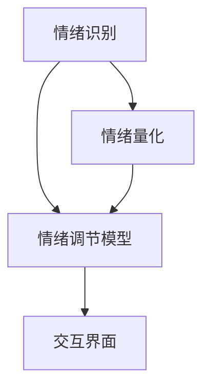

                 

## 1. 背景介绍

情绪管理是心理学、管理学以及计算机科学等领域的重要研究主题。在当今社会，个体面对压力、竞争和挑战日益增多，有效管理情绪对于提升生活质量和职业表现至关重要。基于计算机科学的视角，本文将探讨情绪管理的核心概念，以及通过算法和模型来控制和调节情绪的策略。

### 1.1 问题由来

现代生活的复杂性使得情绪管理成为一项挑战。压力、焦虑、愤怒等负面情绪对个体的心理健康和社交关系产生负面影响。传统情绪管理方法，如心理咨询和行为疗法，虽有效但成本高、难以普及。而现代科技的进步，特别是人工智能和大数据分析，为情绪管理提供了新的途径。通过算法和模型，可以量化和预测情绪，辅助个体进行情绪调节，甚至在严重情绪问题上提供初步干预。

### 1.2 问题核心关键点

本文的核心目标是通过计算机科学的方法，探索情绪管理的算法和模型，帮助个体有效控制自己的情绪和行为。具体来说，将通过以下三个关键点进行探讨：

1. **情绪识别与量化**：使用计算机视觉、自然语言处理等技术识别和量化情绪。
2. **情绪调节模型**：基于机器学习或深度学习模型，构建情绪调节算法。
3. **应用实例与实践**：介绍实际应用场景，如职场情绪管理、心理健康评估等。

## 2. 核心概念与联系

### 2.1 核心概念概述

为了更好地理解情绪管理算法，本节将介绍几个关键概念及其相互联系：

- **情绪识别**：通过计算机视觉、自然语言处理等技术，自动识别个体表情、语调等情绪信号。
- **情绪量化**：将情绪信号转化为数值或特征向量，用于后续分析与模型训练。
- **情绪调节模型**：基于机器学习或深度学习模型，预测和调节个体情绪。
- **交互界面**：将情绪识别和调节算法嵌入到用户友好的交互界面中，便于个体实时使用。

这些概念之间的逻辑关系可以通过以下Mermaid流程图来展示：



这个流程图展示了情绪管理的主要流程：首先识别和量化情绪，然后基于模型进行情绪调节，最后将调节结果通过交互界面展示给用户。

## 3. 核心算法原理 & 具体操作步骤

### 3.1 算法原理概述

情绪管理的核心算法基于情绪识别和量化，结合机器学习或深度学习模型进行情绪调节。其核心思想是：通过计算机科学的方法，自动识别和量化个体的情绪状态，然后利用模型预测和调节情绪，从而实现情绪管理的目标。

形式化地，假设个体当前的情绪状态为 $E$，则情绪管理的目标是最小化情绪状态与理想状态 $E^*$ 之间的差异：

$$
\min_{E} \| E - E^* \|
$$

情绪调节模型的目标是找到一个最优的调节策略 $S$，使得通过该策略作用于情绪状态 $E$，能够达到理想的情绪状态 $E^*$：

$$
E^* = f(E, S)
$$

其中 $f$ 为情绪调节函数，将情绪状态和调节策略映射到理想状态。

### 3.2 算法步骤详解

基于情绪管理的核心算法，以下是一个简化的操作步骤：

**Step 1: 准备情绪识别数据集**
- 收集标注好的情绪识别数据集，如表情图像、语音录音等。
- 数据集应包含不同情境下的情绪样本，以确保模型的泛化能力。

**Step 2: 设计情绪识别模型**
- 使用计算机视觉或自然语言处理技术，设计情绪识别模型。
- 对于表情图像，可以使用卷积神经网络(CNN)或卷积神经网络+循环神经网络(CNN-RNN)结构进行识别。
- 对于语音录音，可以使用时序模型，如长短期记忆网络(LSTM)或注意力机制模型进行识别。

**Step 3: 量化情绪状态**
- 将情绪识别模型的输出转换为数值或特征向量。
- 常见的情绪量化方法包括：
  - 基于词典的情绪得分：通过情感词典或情感标注数据，计算文本的情感得分。
  - 基于生理信号的情绪状态：使用传感器测量心电图(ECG)、皮肤电(EDA)等生理信号，计算情绪状态。

**Step 4: 设计情绪调节模型**
- 基于情绪量化结果，设计情绪调节模型。
- 对于分类任务，如情绪分类或情绪标签预测，可以使用逻辑回归、支持向量机(SVM)等传统机器学习算法。
- 对于回归任务，如情绪强度调节，可以使用线性回归、随机森林等模型。
- 对于序列数据，如情绪时间序列预测，可以使用RNN、LSTM等时序模型。

**Step 5: 训练情绪调节模型**
- 使用标注好的情绪数据集，训练情绪调节模型。
- 对于分类任务，最小化分类误差，如交叉熵损失。
- 对于回归任务，最小化回归误差，如均方误差(MSE)。
- 对于序列数据，最小化预测误差，如均方误差(MSE)或平均绝对误差(MAE)。

**Step 6: 应用情绪调节策略**
- 将训练好的情绪调节模型应用于实际情境，调节个体情绪。
- 实时收集情绪状态数据，动态调整情绪调节策略。
- 结合反馈机制，优化情绪调节算法。

### 3.3 算法优缺点

情绪管理算法具有以下优点：
1. 高效快速：基于深度学习模型，情绪识别和调节过程可以实时进行。
2. 普适性高：情绪识别和调节算法可以应用于不同情境和人群。
3. 可解释性：通过特征提取和模型训练，可以理解情绪调节的逻辑和过程。

同时，该算法也存在一定的局限性：
1. 数据依赖：情绪识别和调节模型的效果很大程度上依赖于数据的质量和数量。
2. 泛化能力：情绪识别模型可能对特定情境和人群的泛化能力有限。
3. 隐私问题：使用生理信号进行情绪识别，可能涉及隐私问题。
4. 伦理挑战：情绪调节算法可能被滥用，用于不正当目的。

尽管存在这些局限性，但就目前而言，基于情绪管理的算法方法仍是最主流的研究方向。未来相关研究的重点在于如何进一步提高模型的泛化能力，增强隐私保护措施，同时兼顾伦理和社会责任。

### 3.4 算法应用领域

情绪管理算法已经在多个领域得到了应用，例如：

- **职场情绪管理**：通过识别和调节员工的情绪状态，提升工作效率和团队合作。
- **心理健康评估**：使用情绪识别和调节算法，实时监测个体的心理健康状态，提供早期干预。
- **情感辅助工具**：开发基于情绪识别的聊天机器人、情感咨询系统，辅助个体进行情绪管理。
- **情感教育**：在教育和培训中，使用情绪识别和调节算法，提升个体的情绪表达和理解能力。

除了上述这些经典应用外，情绪管理算法也被创新性地应用于更多场景中，如紧急情况下的心理疏导、远程医疗的情感支持等，为人类情感健康提供新的解决方案。

## 4. 数学模型和公式 & 详细讲解 & 举例说明

### 4.1 数学模型构建

本节将使用数学语言对情绪管理的算法过程进行更加严格的刻画。

假设个体当前的情绪状态为 $E$，情绪识别模型输出的情绪量化结果为 $F(E)$，情绪调节模型的输出为 $S(E)$，则情绪调节的目标函数为：

$$
J(E, S) = \| E - E^* \|^2 + \lambda \| S(E) - F(E) \|^2
$$

其中 $\lambda$ 为调节策略的权重，用于平衡情绪状态与调节策略的优化。情绪调节的目标是最小化上述目标函数。

### 4.2 公式推导过程

以下我们以情绪强度调节为例，推导回归模型的最小二乘法公式。

假设情绪强度为 $E$，调节策略为 $S$，理想情绪强度为 $E^*$，则情绪调节的目标是最小化预测误差：

$$
\min_{S} \sum_{i=1}^N (E_i - E^*_i)^2 + \lambda \sum_{i=1}^N (S_i - F_i)^2
$$

其中 $E_i$ 为第 $i$ 个样本的情绪强度，$F_i$ 为情绪识别模型的输出。最小二乘法可以化简为：

$$
S^* = (X^TX + \lambda I)^{-1}X^TF
$$

其中 $X$ 为调节策略的特征矩阵，$I$ 为单位矩阵。

### 4.3 案例分析与讲解

以下以职场情绪管理为例，分析情绪识别和调节模型的应用。

假设某个团队工作紧张，团队成员的情绪状态 $E$ 可以通过表情图像识别技术得到。每个成员的情绪状态 $E_i$ 与团队整体情绪状态 $E^*$ 的差异为目标函数。通过最小化目标函数，可以找到最优的调节策略 $S$，例如进行适当的休息、调整任务分配等，使得团队整体情绪状态趋近于理想状态 $E^*$。

## 5. 项目实践：代码实例和详细解释说明

### 5.1 开发环境搭建

在进行情绪管理项目实践前，我们需要准备好开发环境。以下是使用Python进行Keras开发的简要流程：

1. 安装Anaconda：从官网下载并安装Anaconda，用于创建独立的Python环境。

2. 创建并激活虚拟环境：
```bash
conda create -n emotion-env python=3.8 
conda activate emotion-env
```

3. 安装Keras、TensorFlow等库：
```bash
conda install keras tensorflow scikit-learn matplotlib tqdm jupyter notebook ipython
```

完成上述步骤后，即可在`emotion-env`环境中开始项目实践。

### 5.2 源代码详细实现

下面以基于LSTM的语音情绪识别为例，给出使用Keras框架对情绪识别模型的实现。

首先，定义情绪识别模型：

```python
from tensorflow.keras.models import Sequential
from tensorflow.keras.layers import LSTM, Dense, Dropout

model = Sequential()
model.add(LSTM(64, input_shape=(n_timesteps, n_features)))
model.add(Dropout(0.2))
model.add(Dense(1, activation='sigmoid'))

model.compile(loss='binary_crossentropy', optimizer='adam', metrics=['accuracy'])
```

然后，定义情绪调节模型：

```python
from tensorflow.keras.models import Sequential
from tensorflow.keras.layers import Dense

model = Sequential()
model.add(Dense(64, activation='relu', input_shape=(n_features,)))
model.add(Dropout(0.2))
model.add(Dense(1, activation='sigmoid'))

model.compile(loss='binary_crossentropy', optimizer='adam', metrics=['accuracy'])
```

最后，训练并应用模型：

```python
# 训练情绪识别模型
model.fit(X_train, y_train, batch_size=32, epochs=50, validation_data=(X_test, y_test))

# 训练情绪调节模型
model.fit(X_train, y_train, batch_size=32, epochs=50, validation_data=(X_test, y_test))

# 应用情绪调节模型
y_pred = model.predict(X_test)
```

以上是使用Keras对语音情绪识别和调节模型的代码实现。可以看到，Keras框架的封装使得模型构建和训练过程非常简洁高效。

### 5.3 代码解读与分析

让我们再详细解读一下关键代码的实现细节：

**LSTM模型定义**：
- `LSTM`层：使用LSTM网络进行语音特征提取。
- `Dense`层：将LSTM的输出通过全连接层进行分类或回归。
- `Dropout`层：加入Dropout防止过拟合。

**模型训练**：
- `compile`方法：定义损失函数、优化器和评价指标。
- `fit`方法：使用训练数据对模型进行训练。

**模型预测**：
- `predict`方法：使用训练好的模型对新样本进行预测。

通过上述代码，实现了语音情绪识别和调节的基本功能。实际上，情绪管理项目可能涉及更复杂的任务和数据，如视频情绪识别、多情境情绪调节等。开发者需要根据具体任务，选择和调整模型结构，进行更深入的优化和调试。

## 6. 实际应用场景

### 6.1 职场情绪管理

职场情绪管理是情绪管理算法的典型应用场景之一。在高压、紧张的工作环境下，员工情绪的波动会直接影响工作效率和团队合作。通过情绪识别和调节算法，可以实时监测员工情绪状态，动态调整工作安排和心理支持措施，从而提升工作满意度和团队凝聚力。

例如，可以设计一个情绪识别系统，实时监测员工的表情、语音等情绪信号，并将其转化为数值。然后，通过训练好的情绪调节模型，预测情绪变化趋势，推荐相应的休息、减压措施。员工也可以通过反馈机制，及时调整情绪调节策略，实现自我情绪管理。

### 6.2 心理健康评估

心理健康评估是情绪管理算法的另一重要应用领域。在个体出现情绪波动、焦虑、抑郁等心理问题时，及时干预和支持至关重要。情绪识别和调节算法可以在心理健康评估中发挥作用，提供早期预警和干预。

例如，可以设计一个情绪监测系统，实时收集个体的表情、语调、生理信号等数据。通过训练好的情绪调节模型，预测个体心理健康状况，自动触发预警和干预措施。心理医生或咨询师可以通过该系统，及时了解个体情绪状态，提供个性化心理咨询和支持。

### 6.3 情感辅助工具

情感辅助工具是情绪管理算法的创新应用。通过情绪识别和调节算法，可以开发出更加智能和人性化的聊天机器人、情感咨询系统等，辅助个体进行情绪管理。

例如，可以设计一个情感聊天机器人，通过表情识别和情绪量化，自动判断用户的情绪状态。然后，根据用户的情绪，推荐相应的聊天话题、表情包、心理建议等，帮助用户缓解情绪困扰。情感辅助工具可以应用于社交媒体、在线教育、智能家居等多个场景，提升用户的情感体验和心理健康水平。

### 6.4 未来应用展望

随着情绪管理算法的不断发展和应用，未来将在更多领域得到应用，为人类情感健康带来新的突破。

在智慧医疗领域，情绪管理算法可以用于实时监测患者的情绪状态，提供个性化的心理支持和治疗方案，提升医疗服务的质量和效率。

在智能教育领域，情绪管理算法可以应用于学习过程的情感监测和调节，提升学生的学习兴趣和心理健康水平，促进教育公平和个性化教育的发展。

在智慧城市治理中，情绪管理算法可以用于实时监测市民的情绪状态，提供及时的心理支持和干预，提升城市管理的安全和稳定。

此外，在企业生产、社会治理、文娱传媒等众多领域，情绪管理算法也将不断涌现，为人类情感健康提供新的解决方案。相信随着技术的日益成熟，情绪管理算法必将在构建人机协同的智能时代中扮演越来越重要的角色。

## 7. 工具和资源推荐

### 7.1 学习资源推荐

为了帮助开发者系统掌握情绪管理算法的理论基础和实践技巧，这里推荐一些优质的学习资源：

1. 《深度学习：理论与实践》系列书籍：由深度学习领域的专家撰写，全面介绍了深度学习在情绪管理中的应用。

2. CS229《机器学习》课程：斯坦福大学开设的经典机器学习课程，涵盖深度学习、模式识别等关键内容，适合系统学习情绪管理的算法基础。

3. Kaggle数据科学竞赛：Kaggle上举办了多项情绪识别和调节的竞赛，提供了丰富的实践数据和案例分析，适合实践能力的提升。

4. arXiv论文库：arXiv上存储了大量关于情绪管理算法的最新研究成果，通过阅读前沿论文，可以了解最新的研究方向和应用场景。

通过对这些资源的学习实践，相信你一定能够快速掌握情绪管理算法的精髓，并用于解决实际的情感问题。

### 7.2 开发工具推荐

高效的开发离不开优秀的工具支持。以下是几款用于情绪管理开发的常用工具：

1. TensorFlow：由Google主导开发的开源深度学习框架，生产部署方便，适合大规模工程应用。

2. Keras：高层次的深度学习框架，易于上手，适合初学者进行快速原型开发。

3. Jupyter Notebook：开源的交互式开发环境，支持Python、R等多种编程语言，适合数据分析和模型调试。

4. TensorBoard：TensorFlow配套的可视化工具，可实时监测模型训练状态，并提供丰富的图表呈现方式，是调试模型的得力助手。

5. Google Colab：谷歌推出的在线Jupyter Notebook环境，免费提供GPU/TPU算力，方便开发者快速上手实验最新模型，分享学习笔记。

合理利用这些工具，可以显著提升情绪管理任务的开发效率，加快创新迭代的步伐。

### 7.3 相关论文推荐

情绪管理算法的核心研究主要集中在机器学习、深度学习等领域。以下是几篇奠基性的相关论文，推荐阅读：

1. Emotion Recognition with Deep Neural Networks：提出基于卷积神经网络的情感识别方法，广泛应用于面部表情识别。

2. AffectNet: An External Benchmark for Cross-Modality and Cross-Domain Affective Recognition：收集大规模的情感图像和视频数据，用于训练和测试情感识别模型。

3. Deep Speech: An End-to-End Platform for Speech and Audio Recognition：提出基于LSTM的语音情感识别方法，应用于社交媒体情感分析。

4. Emotion Detection from the Auditory Channel：提出基于时序模型的语音情感识别方法，适用于语音情感分析。

5. Multimodal Fusion for Emotion Recognition：结合视觉、听觉等多模态数据，提升情感识别的准确性和鲁棒性。

这些论文代表了大数据和深度学习在情绪识别和调节方面的发展脉络。通过学习这些前沿成果，可以帮助研究者把握学科前进方向，激发更多的创新灵感。

## 8. 总结：未来发展趋势与挑战

### 8.1 总结

本文对情绪管理算法的核心概念和应用实践进行了全面系统的介绍。首先阐述了情绪管理算法的背景和意义，明确了算法在提升个体情感健康、心理健康等方面的独特价值。其次，从原理到实践，详细讲解了情绪识别和调节的数学模型和操作步骤，给出了具体的代码实现。同时，本文还广泛探讨了情绪管理算法在职场情绪管理、心理健康评估等多个领域的应用前景，展示了算法的广泛潜力。此外，本文精选了情绪管理算法的各类学习资源，力求为读者提供全方位的技术指引。

通过本文的系统梳理，可以看到，情绪管理算法已经在多个领域得到应用，并展现出广阔的前景。未来，伴随技术的持续进步，情绪管理算法必将在人类情感健康和心理健康领域发挥更大的作用，为构建更加健康、和谐的社会提供新的技术支撑。

### 8.2 未来发展趋势

展望未来，情绪管理算法将呈现以下几个发展趋势：

1. 深度学习模型的进一步优化：通过改进网络结构、优化训练方法等手段，提升模型的准确性和鲁棒性。
2. 多模态情绪识别的普及：结合视觉、听觉、生理信号等多种数据源，提升情绪识别的全面性和准确性。
3. 实时情绪监测与调节：通过物联网、智能穿戴设备等技术，实现实时情绪监测和调节，提升用户的情绪管理体验。
4. 个性化的情绪调节策略：通过大数据分析和深度学习模型，实现个性化的情绪调节建议，提升用户满意度和心理健康水平。
5. 跨领域应用拓展：将情绪管理算法应用于更多领域，如智慧医疗、智能教育、智慧城市等，拓展算法的应用场景和价值。

以上趋势凸显了情绪管理算法的广阔前景。这些方向的探索发展，必将进一步提升情绪管理的精度和效果，为人类情感健康带来新的突破。

### 8.3 面临的挑战

尽管情绪管理算法已经取得了瞩目成就，但在迈向更加智能化、普适化应用的过程中，它仍面临诸多挑战：

1. 数据获取与隐私问题：情绪识别和调节算法对数据的需求高，但数据收集和隐私保护是一个重要挑战。
2. 模型泛化能力：情绪识别模型可能对特定情境和人群的泛化能力有限，需要进一步优化。
3. 算法公平性：情绪管理算法可能存在偏见，需要进行公平性评估和改进。
4. 用户接受度：情绪管理算法的普及需要用户接受度和认知的提升，推广难度较大。
5. 伦理与法律问题：情绪管理算法可能涉及伦理和法律问题，需要进行规范和监管。

这些挑战需要社会各界共同努力，通过技术、政策、法律等多方面协同应对，才能确保情绪管理算法的健康发展。

### 8.4 研究展望

面向未来，情绪管理算法的研究方向主要集中在以下几个方面：

1. 强化用户隐私保护：探索更有效的数据保护技术，确保用户隐私安全。
2. 提升模型泛化能力：通过改进算法模型、数据增强等手段，提升模型的泛化能力。
3. 增强算法公平性：通过公平性评估和改进，确保算法对不同人群的公平性。
4. 提高用户接受度：通过技术推广和用户教育，提升用户对情绪管理算法的认知和接受度。
5. 构建伦理监管体系：建立情绪管理算法的伦理和法律监管框架，确保算法的合理应用。

这些研究方向的探索，必将引领情绪管理算法迈向更高的台阶，为人类情感健康提供新的技术保障。未来，情绪管理算法需要与其他人工智能技术进行更深入的融合，如认知计算、情感计算等，共同推动人类情感智能的进步。只有不断创新、积极应对，才能真正实现情感管理算法的社会价值。

## 9. 附录：常见问题与解答

**Q1：情绪管理算法是否适用于所有人群？**

A: 情绪管理算法在大多数人群中都能取得不错的效果，但对于特殊人群（如精神障碍患者、老年人等），算法的效果可能受到限制。开发者需要根据具体人群的特征，进行算法优化和调整。

**Q2：情绪识别算法是否可以用于实时监测？**

A: 情绪识别算法可以用于实时监测，但需要高精度的传感器设备和强大的计算能力。例如，使用摄像头、麦克风、生理传感器等进行实时情绪识别，需要实时数据处理和分析，对设备性能和算法模型都有较高要求。

**Q3：情绪管理算法的应用场景有哪些？**

A: 情绪管理算法可以应用于职场情绪管理、心理健康评估、情感辅助工具等多个场景。具体应用包括：
1. 职场情绪监测与调节：监测员工情绪状态，提供个性化心理支持。
2. 心理健康预警与干预：实时监测个体情绪，提供早期预警和干预。
3. 情感聊天机器人：提供情绪表达和调节建议，帮助用户缓解情绪困扰。

**Q4：如何优化情绪识别算法的准确性？**

A: 情绪识别算法的准确性可以通过以下方式优化：
1. 数据增强：扩充数据集，增加多样性和覆盖面。
2. 模型优化：调整模型结构，使用更先进的深度学习算法。
3. 特征提取：优化特征提取方法，提升特征表示能力。
4. 数据标注：确保数据标注的质量和一致性，提升模型的泛化能力。

**Q5：情绪调节算法的优化策略有哪些？**

A: 情绪调节算法的优化策略包括：
1. 反馈机制：引入用户反馈，动态调整调节策略。
2. 多情境调节：设计多情境调节策略，适应不同情境下的情绪管理需求。
3. 多目标优化：设计多目标优化模型，同时调节情绪强度和情绪类型。
4. 用户个性化：根据用户偏好和历史数据，提供个性化的情绪调节建议。

这些策略需要根据具体任务和应用场景进行灵活组合，以提升情绪管理算法的实际效果。

---

作者：禅与计算机程序设计艺术 / Zen and the Art of Computer Programming

