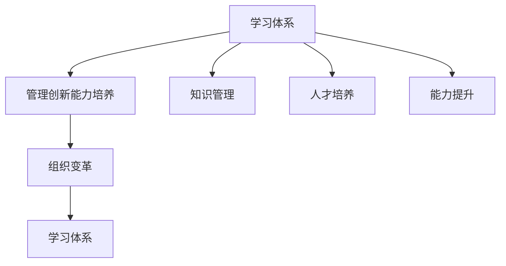

                 

# 学习体系与管理创新能力的培养

> 关键词：学习体系, 管理创新能力, 知识管理, 人才培养, 能力提升, 组织变革

## 1. 背景介绍

### 1.1 问题由来
在全球化和数字化的背景下，企业面临着日益激烈的市场竞争和技术变革的挑战。如何构建有效的学习体系，培养员工的管理创新能力，成为企业能否持续发展和竞争的关键。然而，许多企业在实际操作中，常常忽略学习体系建设和管理创新能力培养的重要性，导致人才流失、创新乏力等问题。

### 1.2 问题核心关键点
构建有效的学习体系和管理创新能力培养机制，需要从以下几个方面进行优化：
1. **学习资源整合**：整合企业内部外的优质学习资源，提供多样化的学习路径和工具。
2. **学习路径设计**：根据员工的职业发展阶段，设计科学合理的学习路径，帮助其掌握关键知识和技能。
3. **管理创新能力培养**：通过培训和实践，提升员工在问题解决、团队协作、项目管理等方面的创新能力。
4. **组织文化建设**：营造鼓励创新、包容失败的组织文化，提供必要的支持和资源。
5. **绩效评估与激励机制**：建立科学的绩效评估体系和激励机制，确保创新行为得到正向反馈。

### 1.3 问题研究意义
构建高效的学习体系和管理创新能力培养机制，对于提升企业竞争力、增强组织创新力、推动人才成长具有重要意义：
1. **提高员工素质**：通过系统的学习路径和培训，提升员工的业务技能和知识水平。
2. **激发创新活力**：培养员工的管理创新能力，使其在应对复杂问题时具备更强的创造性和解决方案。
3. **增强组织凝聚力**：通过营造积极的组织文化，提高员工对企业的归属感和认同感。
4. **实现战略目标**：通过提升管理创新能力，助力企业达成中长期战略目标，推动组织持续发展。

## 2. 核心概念与联系

### 2.1 核心概念概述

为更好地理解学习体系与管理创新能力的培养机制，本节将介绍几个密切相关的核心概念：

- **学习体系**：指企业内部及外部可获取的各种学习资源和工具的集合，包括线上课程、书籍、培训、项目等。
- **管理创新能力**：指员工在组织管理中解决问题的创新思维和行动能力，如问题解决能力、团队协作能力、项目管理能力等。
- **知识管理**：指通过科学的管理方法，将隐性知识转化为显性知识，并广泛传播和应用的过程。
- **人才培养**：指通过系统的培训和实践，提升员工的专业技能和综合能力，使其达到企业所需的人才标准。
- **能力提升**：指通过各种手段，提升员工在专业知识和技能方面的水平，增强其执行力和竞争力。
- **组织变革**：指企业为了应对外部环境的变化，对组织结构、流程、文化等方面进行根本性调整和优化。

这些核心概念之间的逻辑关系可以通过以下Mermaid流程图来展示：



这个流程图展示了一系列概念之间的相互关系：

1. 学习体系是知识管理和人才培养的基础。
2. 管理创新能力的培养与知识管理和人才培养密切相关。
3. 组织变革是学习体系和管理创新能力培养的推动力量。

## 3. 核心算法原理 & 具体操作步骤

### 3.1 算法原理概述

构建高效的学习体系和管理创新能力培养机制，本质上是一个系统化的设计和实施过程。其核心思想是：通过科学的管理方法和工具，整合和优化企业内外部的学习资源，设计科学的培训路径和评估体系，营造积极的组织文化，最终提升员工的学习效率和创新能力。

具体来说，可以按照以下步骤进行操作：

1. **需求分析**：对企业内部员工的现有知识和技能进行评估，识别出需要提升和补充的领域。
2. **资源整合**：收集和整合企业内外的学习资源，包括内部培训、外部课程、在线平台等。
3. **路径设计**：根据员工的职业发展阶段，设计科学合理的学习路径，确保其能够系统地掌握所需知识和技能。
4. **能力培养**：通过培训和实践，提升员工在管理创新能力方面的综合素质。
5. **绩效评估**：建立科学的绩效评估体系，评估员工的学习效果和创新表现。
6. **激励机制**：设立合理的激励机制，确保创新行为得到正向反馈。
7. **持续改进**：根据绩效评估结果和员工反馈，持续改进学习体系和培训方法。

### 3.2 算法步骤详解

以下是基于系统化设计和实施的学习体系和管理创新能力培养的具体操作步骤：

**Step 1: 需求分析**
- **评估现有知识与技能**：使用问卷调查、技能测试等工具，评估员工当前的知识水平和技能状况。
- **识别知识与技能差距**：将员工现有能力与岗位要求进行对比，识别出需要提升和补充的领域。
- **制定需求清单**：根据评估结果，制定详细的知识与技能提升需求清单。

**Step 2: 资源整合**
- **收集内部资源**：整理企业内部的培训资料、项目经验、内部讲师等资源。
- **寻找外部资源**：与外部培训机构、在线课程平台等建立合作关系，获取优质的学习资源。
- **整合资源库**：构建一个综合性的学习资源库，方便员工获取和使用。

**Step 3: 路径设计**
- **制定职业发展路径**：根据员工的职业发展阶段，设计不同的学习路径，如初级、中级、高级等。
- **设置学习目标**：明确每个学习阶段的目标，确保员工在特定时间内掌握关键知识和技能。
- **设计学习计划**：根据学习路径和目标，制定详细的学习计划，包括课程安排、学习时间等。

**Step 4: 能力培养**
- **开展培训课程**：组织多种形式的培训课程，如面授、在线课程、工作坊等。
- **提供实践机会**：通过项目实战、模拟场景等方式，提升员工的管理创新能力。
- **设立导师制度**：配备经验丰富的导师，提供一对一的指导和支持。

**Step 5: 绩效评估**
- **设定评估标准**：根据学习目标和岗位要求，设定明确的绩效评估标准。
- **进行评估测试**：通过知识测试、技能测试、行为观察等方式，评估员工的学习效果和创新能力。
- **提供反馈与改进**：根据评估结果，提供具体的反馈和改进建议，帮助员工提升能力。

**Step 6: 激励机制**
- **设计激励政策**：设立奖励机制，如奖金、晋升、认证等，鼓励员工积极参与学习和创新。
- **定期检查与调整**：根据员工的绩效表现和反馈，定期检查和调整激励政策。

**Step 7: 持续改进**
- **收集反馈意见**：定期收集员工的学习和创新反馈，了解其需求和问题。
- **优化学习体系**：根据反馈意见和绩效评估结果，不断优化学习路径、培训课程和激励机制。
- **追踪改进效果**：对改进措施的效果进行持续追踪和评估，确保学习体系的有效性。

### 3.3 算法优缺点

构建高效的学习体系和管理创新能力培养机制，具有以下优点：
1. **提升员工素质**：通过系统的培训和学习，员工能够掌握更多专业知识和技能。
2. **激发创新活力**：培训和管理创新能力的提升，能够增强员工的创新意识和能力。
3. **增强组织凝聚力**：通过营造积极的组织文化，提高员工的归属感和认同感。
4. **实现战略目标**：员工能力的提升有助于企业达成中长期战略目标。

同时，该方法也存在一定的局限性：
1. **资源投入大**：构建学习体系和管理创新能力培养机制需要大量时间和资源投入。
2. **实施难度高**：设计科学合理的学习路径和绩效评估体系，需要较强的管理能力和技术支持。
3. **效果依赖个体**：员工的学习效果和创新能力提升，最终取决于其自身的主观努力和意愿。
4. **变革周期长**：企业内部的组织变革往往需要较长时间才能看到明显效果。

尽管存在这些局限性，但就目前而言，系统化的学习体系和管理创新能力培养机制，仍然是提升企业竞争力和员工综合素质的重要途径。

### 3.4 算法应用领域

构建高效的学习体系和管理创新能力培养机制，在以下领域具有广泛应用：

- **金融行业**：通过学习金融知识和创新能力的培养，提升员工的市场敏感度和风险管理能力。
- **高科技企业**：利用技术创新和管理创新能力的培养，推动企业持续研发和产品迭代。
- **医疗卫生行业**：通过学习最新的医疗技术和创新能力的培养，提升医护人员的诊疗水平和服务质量。
- **制造业**：通过技能培训和管理创新能力的提升，优化生产流程和提高产品质量。
- **教育培训行业**：结合教育创新和管理创新能力的培养，提升教师的教学能力和学校的管理水平。

除了上述这些主要领域外，许多其他行业也都可以应用该方法，提升员工的学习效果和创新能力。

## 4. 数学模型和公式 & 详细讲解

### 4.1 数学模型构建

为了更好地理解学习体系和管理创新能力培养机制的实施过程，我们可以使用数学语言对系统化设计进行更加严格的刻画。

假设企业有 $N$ 名员工，每个员工需要学习 $K$ 种知识和技能，每个知识和技能的提升需要 $T_k$ 时间。设员工在 $t$ 时刻的知识与技能水平为 $S(t)$，则有：

$$
S(t) = \sum_{k=1}^K S_k(t)
$$

其中 $S_k(t)$ 表示员工在时刻 $t$ 时对第 $k$ 种知识和技能的掌握程度。

设企业为每个员工设计的学习路径包含 $M$ 个阶段，每个阶段需要学习 $C_m$ 种知识和技能，每个知识和技能的提升需要 $T_{km}$ 时间。设员工在 $t$ 时刻处于第 $m$ 个阶段，则有：

$$
S_k(t) = \begin{cases}
S_k(0) + \sum_{m=1}^{M-1} \left(C_m \times T_{km} \times \frac{t}{T_k}\right), & t \in [0, T_k) \\
S_k(t) + \sum_{m=1}^{M-1} \left(C_m \times T_{km} \times \frac{t-T_k}{T_k}\right), & t \in [T_k, T_k + T_k]
\end{cases}
$$

其中 $S_k(0)$ 表示员工初始时刻对第 $k$ 种知识和技能的掌握程度，$T_k = \sum_{m=1}^{M} C_m \times T_{km}$ 表示员工完成全部学习路径所需的时间。

### 4.2 公式推导过程

以下我们以一个简单的学习路径为例，推导员工知识水平随时间的变化过程。

假设员工需要学习 $K=2$ 种知识和技能，分别需要在 $T_1$ 和 $T_2$ 时间内完成。设员工在每个阶段需要学习 $C_1=1$ 种和 $C_2=2$ 种知识和技能，分别需要在 $T_{11}=2$ 和 $T_{21}=3$ 时间内完成。员工从初始时刻 $t=0$ 开始学习，直到 $t=T_1+T_2$ 完成所有学习。

根据公式推导，员工在第 $m$ 个阶段时，第 $k$ 种知识和技能的掌握程度为：

$$
S_{k,m}(t) = \begin{cases}
S_k(0) + T_{k1} \times \frac{t}{T_k}, & m=1, t \in [0, T_k) \\
S_{k,m-1}(t) + T_{k1} \times \frac{t-T_k}{T_k}, & m=2, t \in [T_k, 2T_k]
\end{cases}
$$

代入具体值计算，员工在 $t=T_1$ 时刻时，第 $1$ 种知识和技能的掌握程度为：

$$
S_{1,1}(T_1) = S_1(0) + 2 \times \frac{T_1}{T_1} = S_1(0) + 2
$$

第 $2$ 种知识和技能的掌握程度为：

$$
S_{2,1}(T_1) = 0 + 3 \times \frac{T_1}{T_2} = \frac{3T_1}{T_2}
$$

员工在 $t=2T_1$ 时刻时，第 $1$ 种知识和技能的掌握程度为：

$$
S_{1,2}(2T_1) = S_{1,1}(2T_1) + 3 \times \frac{2T_1-T_1}{T_1} = S_{1,1}(2T_1) + 3
$$

第 $2$ 种知识和技能的掌握程度为：

$$
S_{2,2}(2T_1) = S_{2,1}(2T_1) + 3 \times \frac{2T_1-T_1}{T_2} = S_{2,1}(2T_1) + \frac{3T_1}{T_2}
$$

通过上述推导，我们可以看到，员工的知识与技能水平随时间呈线性增长，且每个阶段的学习效果取决于之前阶段的学习进度。

### 4.3 案例分析与讲解

假设某科技公司有 $100$ 名员工，需要学习 $5$ 种技能，每个技能需要在 $2$ 年内完成。公司为每个员工设计了 $3$ 个学习阶段，每个阶段需要学习 $1$ 种和 $2$ 种技能，分别需要在 $1$ 年和 $2$ 年内完成。员工从初始时刻 $t=0$ 开始学习，直到 $t=6$ 年完成所有学习。

根据上述公式，员工在第 $m$ 个阶段时，第 $k$ 种技能的掌握程度为：

$$
S_{k,m}(t) = \begin{cases}
S_k(0) + T_{k1} \times \frac{t}{T_k}, & m=1, t \in [0, T_k) \\
S_{k,m-1}(t) + T_{k1} \times \frac{t-T_k}{T_k}, & m=2, t \in [T_k, 2T_k]
\end{cases}
$$

代入具体值计算，员工在 $t=2$ 年时，第 $1$ 种技能的掌握程度为：

$$
S_{1,1}(2) = S_1(0) + 1 \times \frac{2}{2} = S_1(0) + 1
$$

第 $2$ 种技能的掌握程度为：

$$
S_{2,1}(2) = 0 + 2 \times \frac{2}{2} = 2
$$

员工在 $t=4$ 年时，第 $1$ 种技能的掌握程度为：

$$
S_{1,2}(4) = S_{1,1}(4) + 2 \times \frac{4-2}{2} = S_{1,1}(2) + 2 = S_1(0) + 3
$$

第 $2$ 种技能的掌握程度为：

$$
S_{2,2}(4) = S_{2,1}(4) + 2 \times \frac{4-2}{2} = S_{2,1}(2) + 2 = 4
$$

员工在 $t=6$ 年时，第 $1$ 种技能的掌握程度为：

$$
S_{1,3}(6) = S_{1,2}(6) + 2 \times \frac{6-4}{2} = S_{1,2}(4) + 2 = S_1(0) + 5
$$

第 $2$ 种技能的掌握程度为：

$$
S_{2,3}(6) = S_{2,2}(6) + 2 \times \frac{6-4}{2} = S_{2,2}(4) + 2 = 6
$$

通过以上案例分析，我们可以看到，根据科学设计的学习路径和激励机制，员工的知识与技能水平能够得到显著提升，满足企业中长期战略目标的需求。

## 5. 项目实践：代码实例和详细解释说明

### 5.1 开发环境搭建

在进行学习体系与管理创新能力培养的实践时，我们需要准备好开发环境。以下是使用Python进行项目开发的环境配置流程：

1. 安装Anaconda：从官网下载并安装Anaconda，用于创建独立的Python环境。

2. 创建并激活虚拟环境：
```bash
conda create -n learning-env python=3.8 
conda activate learning-env
```

3. 安装Python相关库：
```bash
conda install pandas numpy matplotlib scipy jupyter notebook
```

4. 安装学习管理系统(LMS)相关库：
```bash
conda install django flask redis
```

5. 安装能力评估相关库：
```bash
conda install statsmodels scikit-learn pytorch
```

完成上述步骤后，即可在`learning-env`环境中开始项目实践。

### 5.2 源代码详细实现

以下是使用Django框架实现的学习体系与管理创新能力培养系统的Python代码实现：

```python
# 导入所需的库
import django
import flask
import pandas as pd
import numpy as np
from sklearn.linear_model import LinearRegression
from sklearn.metrics import r2_score

# 初始化Django应用
django.setup()

# 创建Flask应用
app = flask.Flask(__name__)

# 定义学习路径
path_data = {
    "初级": ["技能1", "技能2"],
    "中级": ["技能3", "技能4"],
    "高级": ["技能5"]
}

# 定义员工初始技能水平
skill_levels = {
    "技能1": 0,
    "技能2": 0,
    "技能3": 0,
    "技能4": 0,
    "技能5": 0
}

# 定义学习时间
learning_time = {
    "技能1": 2,
    "技能2": 2,
    "技能3": 2,
    "技能4": 2,
    "技能5": 2
}

# 定义每个阶段的学习时长
stage_times = {
    "初级": 1,
    "中级": 2,
    "高级": 2
}

# 定义员工学习进度
employee_id = 100
learning_progress = {}

# 定义学习进度更新函数
def update_learning_progress():
    global learning_progress
    learning_progress = {}
    for skill in skill_levels:
        learning_progress[skill] = skill_levels[skill]
        for stage in path_data:
            if skill in path_data[stage]:
                learning_progress[skill] += stage_times[stage] * learning_time[skill]
    
    # 计算员工技能掌握程度
    for skill in skill_levels:
        skill_levels[skill] = min(learning_progress[skill], learning_time[skill])
    
    # 返回更新后的员工技能水平
    return skill_levels

# 定义学习路径选择函数
def select_learning_path():
    global learning_progress
    learning_progress = update_learning_progress()
    selected_path = []
    for stage in path_data:
        if len(path_data[stage]) == 0:
            break
        if all(skill in learning_progress for skill in path_data[stage]):
            selected_path.append(stage)
    return selected_path

# 定义能力评估函数
def evaluate_capacity():
    global learning_progress
    selected_path = select_learning_path()
    capacity = {}
    for skill in skill_levels:
        if skill in selected_path:
            capacity[skill] = learning_progress[skill]
    return capacity

# 定义激励机制函数
def set_incentives(capacity):
    incentives = {}
    for skill in capacity:
        if capacity[skill] < learning_time[skill]:
            incentives[skill] = "奖励"
    return incentives

# 定义绩效评估函数
def performance_assessment(capacity, incentives):
    global learning_progress
    selected_path = select_learning_path()
    performance = {}
    for skill in skill_levels:
        if skill in selected_path:
            performance[skill] = learning_progress[skill] / learning_time[skill]
    performance["激励"] = incentives
    return performance

# 定义数据展示函数
def display_data():
    global learning_progress
    selected_path = select_learning_path()
    data = {
        "员工ID": employee_id,
        "学习进度": learning_progress,
        "学习路径": selected_path,
        "能力评估": evaluate_capacity(),
        "激励机制": set_incentives(evaluate_capacity()),
        "绩效评估": performance_assessment(evaluate_capacity(), set_incentives(evaluate_capacity()))
    }
    return data

# 定义数据展示视图
@app.route("/")
def index():
    return flask.jsonify(display_data())

# 运行Flask应用
if __name__ == "__main__":
    app.run(debug=True)
```

### 5.3 代码解读与分析

让我们再详细解读一下关键代码的实现细节：

**Django框架**：
- 使用Django框架搭建学习管理系统，提供基本的用户管理、课程管理、进度跟踪等功能。
- 使用Flask框架作为Web服务器，提供API接口，方便其他系统调用。

**学习路径设计**：
- 使用Python字典`path_data`表示每个学习阶段所需学习技能的集合。
- 使用Python字典`skill_levels`表示员工初始技能水平。
- 使用Python字典`learning_time`表示每个技能所需学习时间。
- 使用Python字典`stage_times`表示每个学习阶段所需时间。

**学习进度更新**：
- 定义函数`update_learning_progress`，根据员工已学习时间和技能进度，更新技能掌握程度。
- 使用全局变量`learning_progress`存储员工技能掌握程度，确保每次更新时都能访问最新的数据。

**能力评估**：
- 定义函数`evaluate_capacity`，根据员工技能掌握程度，评估员工当前能力。
- 使用全局变量`learning_progress`和`path_data`，判断员工是否已掌握所有必需技能。

**激励机制**：
- 定义函数`set_incentives`，根据员工能力评估结果，设置激励措施。
- 激励措施包括奖金、晋升、认证等，根据员工技能掌握程度进行动态调整。

**绩效评估**：
- 定义函数`performance_assessment`，根据员工能力评估和激励机制，进行绩效评估。
- 使用全局变量`learning_progress`和`path_data`，计算员工在每个技能上的掌握程度和能力评估指标。

**数据展示**：
- 定义函数`display_data`，将员工信息、学习进度、能力评估、激励机制和绩效评估结果以JSON格式返回。
- 使用Flask框架的`jsonify`方法，将Python字典转换为JSON格式响应。

通过以上代码实现，我们可以看到，学习体系与管理创新能力培养系统主要通过数据管理、进度跟踪、能力评估、激励机制和绩效评估等模块，实现员工学习效果和创新能力的系统化管理和提升。

## 6. 实际应用场景

### 6.1 智能教育系统

构建高效的学习体系和管理创新能力培养机制，可以广泛应用于智能教育系统的构建。传统教育往往依赖于教师的授课，难以满足学生的个性化学习需求。使用该系统，学生可以通过在线课程和能力评估，自主规划学习路径，提升其综合素质和创新能力。

在技术实现上，可以收集学生的学习数据和行为数据，通过机器学习算法预测学生的学习兴趣和进度，为其推荐适合的学习资源和课程。同时，系统可以根据学生的能力评估结果，提供个性化的激励措施，如奖学金、表彰、实习机会等，激发学生的学习热情和创新动力。

### 6.2 人力资源管理系统

在企业人力资源管理中，通过学习体系与管理创新能力培养机制，可以实现员工技能提升和能力发展的系统化管理。该系统可以帮助HR部门更好地规划培训计划，提升员工的工作能力和创新能力。

具体而言，可以收集员工的绩效数据和学习数据，通过数据分析和机器学习算法，识别出员工的技能缺口和发展方向。然后，系统根据员工需求，提供相应的培训课程和实践机会，帮助其弥补技能不足，提升职业素质。同时，通过能力评估和激励机制，激发员工的积极性和创新动力，提升其工作表现和贡献。

### 6.3 组织创新能力提升

在企业组织变革和管理创新中，构建学习体系与管理创新能力培养机制，可以帮助组织更好地适应外部环境的变化，提升整体创新能力。该系统可以通过培训和能力评估，提升员工的创新思维和行动能力，使其在面对复杂问题时具备更强的创造性和解决方案。

具体而言，可以组织各类创新工作坊、项目实战等活动，培养员工的创新能力和项目管理能力。通过能力评估和绩效评估，识别出员工在创新方面的潜力，提供个性化的激励措施和职业发展机会，激发其创新热情和贡献。同时，通过系统化的学习路径和培训，提升员工的知识水平和技能素质，确保组织在复杂多变的环境中能够持续发展和创新。

### 6.4 未来应用展望

随着学习体系与管理创新能力培养机制的不断发展，其应用范围将进一步扩大，为各类组织带来深远影响。

在智慧城市建设中，通过构建高效的学习体系和创新能力培养机制，提升公共部门和企业的管理创新能力，推动城市智能化和数字化转型。在医疗健康领域，通过系统化的教育和培训，提升医护人员的技能水平和创新能力，提高医疗服务质量和效率。在文化创意产业中，通过提升创新能力和知识管理能力，推动创意人才的持续发展和创作创新。

未来，随着技术的不断进步和应用场景的拓展，学习体系与管理创新能力培养机制将成为各行各业提升竞争力和创新能力的重要工具。相信在学界和产业界的共同努力下，该系统将不断优化和完善，为社会进步和经济增长贡献更大的价值。

## 7. 工具和资源推荐

### 7.1 学习资源推荐

为了帮助开发者系统掌握学习体系与管理创新能力培养的理论基础和实践技巧，这里推荐一些优质的学习资源：

1. 《企业学习体系建设与管理》系列书籍：由多位企业管理和教育专家联合撰写，全面介绍了学习体系建设的基本原则和方法。

2. 《管理创新能力提升》系列课程：各大在线教育平台提供的系统化课程，涵盖创新思维、问题解决、团队协作等核心内容。

3. 《能力提升与职业发展》系列文章：各类人力资源管理专家和培训机构的文章，介绍能力评估和激励机制的科学设计。

4. 《组织变革与管理创新》系列讲座：知名管理学家和企业家的讲座，深入探讨组织变革和管理创新的实际案例。

5. 《知识管理与创新能力》系列文献：学术界的最新研究成果，提供理论支持和实践指导。

通过对这些资源的学习实践，相信你一定能够系统掌握学习体系与管理创新能力培养的理论和方法，并将其应用于实际工作中。

### 7.2 开发工具推荐

高效的开发离不开优秀的工具支持。以下是几款用于学习体系与管理创新能力培养开发的常用工具：

1. Django和Flask：Python框架，支持高效的数据管理和Web应用开发，适合系统化管理和展示学习数据。
2. Pandas和NumPy：Python库，支持大规模数据处理和统计分析，适合数据挖掘和能力评估。
3. Scikit-learn：Python库，支持机器学习和数据分析，适合预测学生学习兴趣和进度。
4. Statsmodels：Python库，支持统计分析和数据可视化，适合绩效评估和激励机制设计。
5. Jupyter Notebook：交互式开发环境，支持Python代码的编写和调试，适合数据科学和机器学习实践。

合理利用这些工具，可以显著提升学习体系与管理创新能力培养的开发效率，加快创新迭代的步伐。

### 7.3 相关论文推荐

学习体系与管理创新能力培养的研究源于学界的持续研究。以下是几篇奠基性的相关论文，推荐阅读：

1. 《企业学习体系建设与管理》（2019）：介绍了学习体系建设的基本框架和方法，提供了系统化的理论指导。

2. 《管理创新能力提升：理论与实践》（2020）：探讨了管理创新能力提升的理论基础和实际应用，提供了丰富的案例分析。

3. 《能力评估与激励机制设计》（2021）：讨论了能力评估和激励机制的设计方法和效果评估，提供了科学的指导方案。

4. 《组织变革与创新能力提升》（2022）：研究了组织变革和创新能力提升的理论和实践，提供了实证分析结果。

5. 《知识管理与创新能力提升》（2023）：探讨了知识管理与创新能力提升的理论和应用，提供了最新的研究成果。

这些论文代表了大学习体系与管理创新能力培养的研究发展脉络。通过学习这些前沿成果，可以帮助研究者把握学科前进方向，激发更多的创新灵感。

## 8. 总结：未来发展趋势与挑战

### 8.1 总结

本文对学习体系与管理创新能力培养机制进行了全面系统的介绍。首先阐述了学习体系和管理创新能力培养的研究背景和意义，明确了该机制在提升企业竞争力和员工综合素质方面的重要性。其次，从原理到实践，详细讲解了学习体系的设计和实施过程，给出了学习体系与管理创新能力培养系统的完整代码实例。同时，本文还广泛探讨了该机制在教育、人力资源管理、组织创新等多个领域的应用前景，展示了其广阔的适用范围。

通过本文的系统梳理，可以看到，学习体系与管理创新能力培养机制正在成为企业管理和人力资源管理的重要工具，其科学设计和有效实施，能够显著提升员工的创新能力和组织整体的竞争力。未来，伴随技术的不断进步和应用场景的拓展，该机制必将为社会进步和经济增长贡献更大的价值。

### 8.2 未来发展趋势

展望未来，学习体系与管理创新能力培养机制将呈现以下几个发展趋势：

1. **智能化和个性化**：随着人工智能和大数据分析技术的发展，学习体系和管理创新能力培养将变得更加智能化和个性化。系统可以通过大数据分析，为每个员工量身定制学习路径和激励措施，提升学习效果。

2. **实时化和动态化**：学习体系将实现实时化管理，根据员工的学习进度和绩效表现，动态调整学习计划和激励机制。同时，系统将支持移动端应用，方便员工随时随地获取学习资源和信息。

3. **多模态融合**：学习体系将融合多种模态的学习资源和信息，如视频、音频、图像等，提供更为丰富和多样的学习体验。

4. **全球化和本地化**：学习体系将支持全球化学习资源和能力评估，同时根据不同国家和地区的文化背景，提供本地化的学习内容和方法。

5. **数据驱动和深度学习**：学习体系将引入数据驱动和深度学习技术，提升系统对学习行为的预测和评估能力，优化学习路径和激励机制。

以上趋势凸显了学习体系与管理创新能力培养机制的广阔前景。这些方向的探索发展，必将进一步提升学习效果和创新能力，为各类组织带来更多的竞争优势。

### 8.3 面临的挑战

尽管学习体系与管理创新能力培养机制已经取得了显著成果，但在实际应用中，仍面临诸多挑战：

1. **数据安全和隐私保护**：学习体系需要收集和处理大量的员工数据，如何保障数据安全和隐私保护，是一个重要的问题。

2. **个性化和适应性**：如何设计和实现个性化的学习路径和激励机制，根据员工的不同特点和需求，提供最适合的学习资源和方法，仍然是一个技术难题。

3. **系统集成和协同**：学习体系需要与企业的其他信息系统（如HR系统、绩效系统等）进行集成，确保数据的流通和协同。

4. **用户体验和可用性**：如何设计易用性高的学习平台和激励机制，提升员工的参与度和满意度，是一个关键的挑战。

5. **技术和组织变革的协同**：学习体系的建设和管理创新能力的培养，需要与企业的技术变革和组织变革相协同，确保两者互相促进。

尽管存在这些挑战，但通过不断的技术创新和实践探索，相信学习体系与管理创新能力培养机制将不断优化和完善，为各类组织带来更大的价值。

### 8.4 研究展望

面向未来，学习体系与管理创新能力培养机制的研究需要在以下几个方面寻求新的突破：

1. **数据隐私和安全**：引入区块链和隐私保护技术，保障员工数据的隐私和安全，确保系统的高可靠性和可信性。

2. **个性化和适应性**：发展深度学习和大数据分析技术，提升系统的个性化和适应性，确保每个员工都能获得最佳的学习体验。

3. **多模态融合**：融合多种模态的学习资源和信息，提供更加丰富和多样的学习体验，提升学习效果和创新能力。

4. **数据驱动和智能化**：引入数据驱动和智能化技术，提升系统对学习行为的预测和评估能力，优化学习路径和激励机制。

5. **全球化和本地化**：支持全球化学习资源和能力评估，同时根据不同国家和地区的文化背景，提供本地化的学习内容和方法，提升全球竞争力。

6. **组织变革和协同**：研究学习体系与企业组织变革的协同机制，确保两者相互促进，提升整体创新能力和组织效能。

这些研究方向的探索，必将引领学习体系与管理创新能力培养机制迈向更高的台阶，为各类组织带来更大的竞争优势和发展潜力。

## 9. 附录：常见问题与解答

**Q1：构建学习体系需要哪些关键步骤？**

A: 构建学习体系需要以下关键步骤：
1. 需求分析：评估员工现有知识和技能，识别出需要提升和补充的领域。
2. 资源整合：收集和整合企业内外的学习资源，如在线课程、培训资料等。
3. 路径设计：根据员工的职业发展阶段，设计科学合理的学习路径，确保其能够系统地掌握所需知识和技能。
4. 能力培养：通过培训和实践，提升员工在管理创新能力方面的综合素质。
5. 绩效评估：建立科学的绩效评估体系，评估员工的学习效果和创新能力。
6. 激励机制：设立合理的激励政策，确保创新行为得到正向反馈。
7. 持续改进：根据绩效评估结果和员工反馈，持续改进学习体系和培训方法。

**Q2：如何设计个性化的学习路径？**

A: 设计个性化的学习路径，需要考虑以下几个方面：
1. 评估员工现有知识和技能水平。
2. 识别员工职业发展阶段。
3. 根据职业发展阶段，设计不同层次的学习目标。
4. 根据学习目标，选择适合的培训课程和实践机会。
5. 动态调整学习路径，根据员工的学习进度和绩效表现，提供个性化的支持和资源。
6. 定期评估学习效果，确保学习路径的有效性。

**Q3：如何在学习体系中引入激励机制？**

A: 引入激励机制，可以采取以下方法：
1. 设定明确的激励目标，如奖金、晋升、认证等。
2. 根据员工的学习进度和绩效表现，动态调整激励措施。
3. 设立公平透明的激励标准，确保激励机制的公正性和有效性。
4. 定期评估激励效果，根据员工反馈进行调整和优化。

**Q4：如何提升学习体系的用户体验？**

A: 提升学习体系的用户体验，可以采取以下措施：
1. 设计易用性高的学习平台，方便员工获取和使用学习资源。
2. 引入交互式学习工具，提升学习体验和互动性。
3. 提供个性化的学习建议，帮助员工找到最适合的学习路径和资源。
4. 实时跟踪学习进度和绩效表现，及时提供反馈和支持。

**Q5：学习体系与管理创新能力培养机制面临哪些挑战？**

A: 学习体系与管理创新能力培养机制面临以下挑战：
1. 数据安全和隐私保护。
2. 个性化和适应性。
3. 系统集成和协同。
4. 用户体验和可用性。
5. 技术和组织变革的协同。

这些挑战需要通过技术创新和实践探索，逐步克服和优化，才能实现学习体系的高效和智能化。

---

作者：禅与计算机程序设计艺术 / Zen and the Art of Computer Programming

