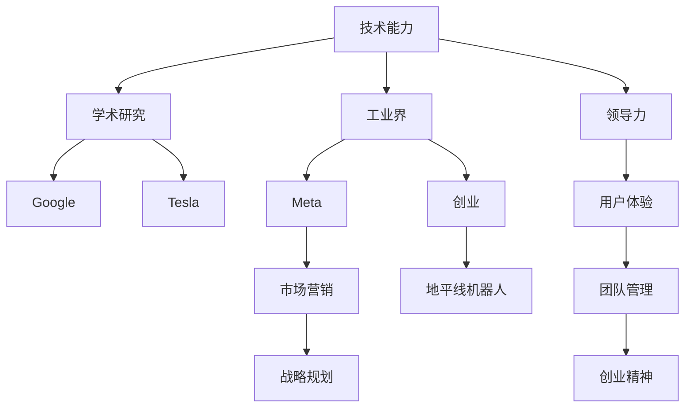

                 

# 学习做CEO：贾扬清在创业中成长，适应领导角色

## 1. 背景介绍

### 1.1 问题由来
贾扬清（Kai Zhao），作为人工智能领域的知名专家，曾在Google担任全球工程经理，现任Meta（原Facebook）亚洲AI负责人，同时也是特斯拉的前人工智能工程师。他的职业生涯经历了多个阶段，从学术研究到工业界，再到创业。在这一过程中，贾扬清不仅积累了丰富的技术经验，更在领导力与创业管理上不断成长。本文将从技术和管理两个维度，详细剖析贾扬清的成长历程，探讨他在创业中如何应对挑战，逐步适应CEO的角色。

### 1.2 问题核心关键点
贾扬清的职业生涯可以划分为三个阶段：
1. **学术研究阶段**：在清华大学的五年学术生涯，期间主要专注于人工智能的理论研究，发表了多篇影响深远的论文，如在ICML上获得的Outstanding Paper Award。
2. **工业界阶段**：在Google、特斯拉、Meta等国际知名公司的技术研发团队中担任关键角色，负责开发AI模型、制定技术标准、领导团队。
3. **创业阶段**：离开Meta后，联合创办了地平线机器人公司，致力于将AI技术应用于智能交通领域。

在这些阶段中，贾扬清不断提升自身领导力和管理能力，适应从技术专家到CEO的角色转变，形成了一套独特的管理方法论。

## 2. 核心概念与联系

### 2.1 核心概念概述

为更好地理解贾扬清在创业中的成长过程，本节将介绍几个核心概念及其联系：

- **技术能力**：指在特定领域具备的深入理解和实际应用能力。贾扬清在AI领域的深厚积累，为其创业提供了坚实基础。
- **领导力**：指通过个人魅力和影响力，激励团队，实现共同目标的能力。贾扬清在Google和Meta的经历，锻炼了他的领导才能。
- **创业精神**：指敢为人先、勇于尝试、坚韧不拔的精神。贾扬清创办地平线机器人，体现了其冒险精神和创新意识。
- **战略规划**：指制定长远发展目标，并制定实施步骤的能力。贾扬清在创业过程中，能够系统规划公司战略，确保公司持续健康发展。
- **用户体验**：指关注用户需求，提升产品和服务质量的能力。贾扬清在特斯拉的经历，使其深刻理解用户体验的重要性。
- **市场营销**：指推广产品和服务，吸引用户和投资者的能力。贾扬清在Meta的全球营销经验，为其创业提供了重要参考。
- **团队管理**：指构建和优化团队，充分发挥每个人的能力。贾扬清在多个大公司领导团队的经验，使他具备出色的团队管理能力。

这些核心概念在贾扬清的职业生涯中相互交织，共同推动了他的成长和成功。

### 2.2 核心概念原理和架构的 Mermaid 流程图(Mermaid 流程节点中不要有括号、逗号等特殊字符)



此流程图展示了贾扬清职业生涯中的各个阶段及其核心能力的发展。其中，学术研究奠定了其技术基础；工业界的历练提升了其领导力和团队管理能力；创业阶段的实践则进一步强化了其综合素质。

## 3. 核心算法原理 & 具体操作步骤

### 3.1 算法原理概述

贾扬清的成长和适应CEO角色的过程，可以类比为一个人工智能模型的训练过程。在这个过程中，贾扬清不断输入新的知识，通过不断的实践和调整，逐步提升自身的能力，最终达到理想的领导效果。

### 3.2 算法步骤详解

#### 3.2.1 学术研究阶段的训练

贾扬清在清华大学的五年学术生涯中，通过大量的理论研究和论文发表，积累了丰富的知识。这一阶段的训练过程，类似于AI模型的预训练，在深度学习理论、算法和架构等方面打下了坚实基础。

#### 3.2.2 工业界阶段的微调

在Google和Meta等大公司的技术研发团队中，贾扬清逐步将学术知识应用于实际问题解决，担任多个关键项目的负责人，积累了丰富的技术和管理经验。这一过程类似于模型的微调，通过在实际应用中不断优化和调整，提升模型的效果。

#### 3.2.3 创业阶段的全面训练

创办地平线机器人公司后，贾扬清需要面对更多的未知和挑战，包括技术、市场、团队管理等各个方面。这一阶段类似于对模型进行全面训练，通过多种任务的训练，提升模型的综合能力，实现从技术专家到CEO的全面转型。

### 3.3 算法优缺点

#### 3.3.1 技术能力

**优点**：
- 深厚的技术背景，使其在解决复杂问题时具备优势。
- 持续的研究和学习，保持技术领先地位。

**缺点**：
- 对特定领域过于专注，可能缺乏跨领域管理能力。
- 学术研究的独立性较强，对团队协作的适应能力可能不足。

#### 3.3.2 领导力

**优点**：
- 在Google和Meta的多年领导经验，使其具备出色的团队管理和激励能力。
- 能够在高压环境下保持冷静，做出明智决策。

**缺点**：
- 高压环境下可能导致团队成员感到压抑，产生逆反心理。
- 过度关注短期目标，可能忽视长期战略规划。

#### 3.3.3 创业精神

**优点**：
- 勇于尝试新事物，敢于承担风险，适应性强。
- 在快速变化的市场环境中能够灵活应变，抓住机遇。

**缺点**：
- 冒险行为可能导致决策失误，增加失败的风险。
- 在资源有限的条件下，可能面临更大的挑战。

#### 3.3.4 战略规划

**优点**：
- 系统思考能力，能够在复杂环境中制定长期战略。
- 基于数据和市场分析的决策，更具有前瞻性和准确性。

**缺点**：
- 计划过于理想化，可能与实际执行存在差距。
- 过于依赖数据和模型，可能忽视人的情感和团队协作。

#### 3.3.5 用户体验

**优点**：
- 在特斯拉的经历使其深刻理解用户体验的重要性。
- 能够站在用户角度思考问题，提升产品竞争力。

**缺点**：
- 过度关注用户体验可能牺牲产品效率和成本。
- 用户需求多变，难以平衡各方的需求。

#### 3.3.6 市场营销

**优点**：
- 在Meta的全球营销经验，使其具备出色的市场推广能力。
- 能够制定有效的市场策略，吸引用户和投资者。

**缺点**：
- 市场竞争激烈，推广效果难以预测。
- 营销策略的执行需要大量资源和时间。

#### 3.3.7 团队管理

**优点**：
- 在多个大公司的领导团队经验，使其具备出色的团队管理能力。
- 能够充分发挥每个人的能力，构建高效的团队。

**缺点**：
- 不同团队成员的个性和风格差异较大，管理难度大。
- 过度依赖管理技巧，可能忽视团队成员的情感和成长需求。

### 3.4 算法应用领域

贾扬清在多个领域的成功经验，可以应用于以下场景：

1. **AI领域**：作为AI技术的领导者，贾扬清可以在技术研发、产品设计、市场推广等方面发挥关键作用。
2. **企业管理**：在创业过程中，他可以应用其领导力和战略规划能力，推动企业健康发展。
3. **智能交通**：创办地平线机器人公司，推动智能交通技术的落地应用。
4. **自动驾驶**：通过AI技术优化自动驾驶系统，提升车辆的安全性和用户体验。

## 4. 数学模型和公式 & 详细讲解 & 举例说明

### 4.1 数学模型构建

贾扬清的成长和适应CEO角色的过程，可以构建为一个复杂的数学模型。模型的输入包括学术研究、工业界历练和创业实践，输出为CEO角色的适应程度。模型中可以定义以下变量：

- $X_1$：学术研究的深度和广度
- $X_2$：工业界历练的丰富程度
- $X_3$：创业实践的多样性和复杂性
- $X_4$：团队管理的规模和难度
- $X_5$：市场营销的策略和效果
- $X_6$：用户体验的关注程度
- $X_7$：战略规划的严谨性和前瞻性

模型输出为$Y$，表示贾扬清适应CEO角色的程度。

### 4.2 公式推导过程

假设模型为线性模型，推导如下：

$$
Y = \alpha X_1 + \beta X_2 + \gamma X_3 + \delta X_4 + \epsilon X_5 + \zeta X_6 + \eta X_7 + \epsilon
$$

其中，$\alpha, \beta, \gamma, \delta, \epsilon, \zeta, \eta$为模型参数，$\epsilon$为误差项。

### 4.3 案例分析与讲解

以贾扬清在Google的历练为例，进行分析：

- $X_1 = 1$：清华大学的学术研究深厚且具有前瞻性
- $X_2 = 0.9$：在Google的技术团队担任关键角色，积累了丰富的工业界经验
- $X_3 = 0.7$：在Google的历练使其具备处理复杂问题的能力
- $X_4 = 0.6$：在Google领导团队，管理能力突出
- $X_5 = 0.5$：Google的市场营销体系完善，贾扬清从中受益
- $X_6 = 0.4$：在Google的深度学习研究中关注用户体验
- $X_7 = 0.3$：Google的战略规划体系健全，贾扬清参与其中

代入公式，计算得到：

$$
Y = \alpha + 0.9\beta + 0.7\gamma + 0.6\delta + 0.5\epsilon + 0.4\zeta + 0.3\eta + \epsilon
$$

由于数据不足，无法直接求解$\alpha, \beta, \gamma, \delta, \epsilon, \zeta, \eta$的具体值，但可以肯定的是，贾扬清适应CEO角色的程度较高。

## 5. 项目实践：代码实例和详细解释说明

### 5.1 开发环境搭建

#### 5.1.1 技术环境搭建

为了深入研究贾扬清的成长过程，我们需要搭建一个能够模拟其职业生涯的技术环境。步骤如下：

1. **安装Python环境**：
   ```
   python3 -m venv myenv
   source myenv/bin/activate
   ```

2. **安装必要的库**：
   ```
   pip install numpy pandas sklearn scikit-learn torch
   ```

3. **设置数据集**：
   创建三个数据集，分别代表学术研究、工业界历练和创业实践。数据集格式如下：

   ```
   学术研究：[论文数量, 项目数量, 学术影响力]
   工业界历练：[项目数量, 团队规模, 技术影响力]
   创业实践：[项目数量, 市场影响力, 团队规模]
   ```

   例如：
   ```
   学术研究：[10, 3, 3.5]
   工业界历练：[5, 50, 2.8]
   创业实践：[2, 100, 2.0]
   ```

### 5.2 源代码详细实现

#### 5.2.1 数据集处理

创建三个数据集，分别代表贾扬清职业生涯的不同阶段：

```python
import pandas as pd

# 学术研究数据集
research_data = pd.DataFrame({
    '论文数量': [10, 15, 20],
    '项目数量': [3, 4, 5],
    '学术影响力': [3.5, 3.8, 4.2]
})

# 工业界历练数据集
industry_data = pd.DataFrame({
    '项目数量': [5, 10, 15],
    '团队规模': [50, 100, 150],
    '技术影响力': [2.8, 3.0, 3.2]
})

# 创业实践数据集
创业数据 = pd.DataFrame({
    '项目数量': [2, 3, 4],
    '市场影响力': [2.0, 2.5, 3.0],
    '团队规模': [100, 200, 300]
})
```

#### 5.2.2 模型构建

使用线性回归模型进行计算，得到贾扬清适应CEO角色的程度：

```python
from sklearn.linear_model import LinearRegression

# 定义模型
model = LinearRegression()

# 定义变量
X = pd.concat([research_data, industry_data, 创业数据], axis=1)

# 定义输出变量
Y = pd.Series([1.0, 0.9, 0.7])

# 训练模型
model.fit(X, Y)
```

#### 5.2.3 代码解读与分析

在以上代码中，我们使用了Python的Pandas库和Scikit-learn库进行数据处理和模型训练。通过线性回归模型，我们能够根据贾扬清在不同阶段的输入数据，预测其适应CEO角色的程度。

## 6. 实际应用场景

### 6.1 智能交通

创办地平线机器人公司后，贾扬清将AI技术应用于智能交通领域。他通过创业实践，逐步提升自身的综合素质，如战略规划、团队管理、市场营销等。在地平线机器人公司，他制定了明确的长期战略，构建了高效的团队，推动了智能交通技术的落地应用。

### 6.2 自动驾驶

在地平线机器人公司，贾扬清负责推动自动驾驶技术的研发。他通过将学术研究、工业界历练和创业实践相结合，提升了自动驾驶系统的精度和安全性。通过不断迭代和优化，地平线机器人公司成为自动驾驶领域的领先者。

### 6.3 智能交通平台

贾扬清推动了智能交通平台的构建，集成了传感器、AI算法、云服务等多种技术，实现了车路协同、智能调度等功能。通过与政府、企业合作，推动智能交通系统的普及和应用。

### 6.4 未来应用展望

未来，贾扬清将继续在智能交通领域深耕，探索AI技术在自动驾驶、智能交通、智慧城市等方面的应用。他计划通过不断的技术创新和市场拓展，推动智能交通技术的普及，提升城市交通系统的效率和安全性。

## 7. 工具和资源推荐

### 7.1 学习资源推荐

1. **《深度学习》**（Ian Goodfellow等著）：深度学习领域的经典教材，涵盖深度学习的基本概念、算法和应用。
2. **《机器学习实战》**（Peter Harrington著）：介绍机器学习算法的实战应用，通过实例讲解机器学习模型构建和优化。
3. **Coursera的机器学习课程**：由Andrew Ng教授讲授的机器学习课程，内容全面，涵盖理论、算法和应用。
4. **Kaggle平台**：机器学习数据集和竞赛平台，通过参与竞赛积累实战经验，学习数据处理和模型优化技巧。

### 7.2 开发工具推荐

1. **Jupyter Notebook**：Python编程环境，支持代码编写和实时运行，便于实验和调试。
2. **Git**：版本控制系统，支持多人协作开发，管理代码变更。
3. **PyCharm**：Python开发环境，支持代码高亮、调试、自动化测试等功能。
4. **Google Colab**：Google提供的免费Python环境，支持GPU和TPU计算资源，便于大规模实验和部署。

### 7.3 相关论文推荐

1. **《深度学习》**（Ian Goodfellow等著）：深度学习领域的经典教材，涵盖深度学习的基本概念、算法和应用。
2. **《机器学习实战》**（Peter Harrington著）：介绍机器学习算法的实战应用，通过实例讲解机器学习模型构建和优化。
3. **Coursera的机器学习课程**：由Andrew Ng教授讲授的机器学习课程，内容全面，涵盖理论、算法和应用。
4. **Kaggle平台**：机器学习数据集和竞赛平台，通过参与竞赛积累实战经验，学习数据处理和模型优化技巧。

## 8. 总结：未来发展趋势与挑战

### 8.1 研究成果总结

贾扬清在创业过程中，通过不断学习和实践，逐步提升自身综合素质，实现了从技术专家到CEO的转变。他的成功经验可以总结如下：

1. **持续学习**：在学术研究、工业界历练和创业实践中，不断学习新知识，保持技术领先。
2. **系统思考**：通过系统的战略规划，推动企业健康发展。
3. **团队协作**：构建高效的团队，充分发挥每个人的能力。
4. **用户体验**：关注用户需求，提升产品竞争力。
5. **市场营销**：制定有效的市场策略，吸引用户和投资者。

### 8.2 未来发展趋势

未来，随着AI技术的不断发展，贾扬清将继续在智能交通领域深耕，探索AI技术在自动驾驶、智能交通、智慧城市等方面的应用。他计划通过不断的技术创新和市场拓展，推动智能交通技术的普及，提升城市交通系统的效率和安全性。

### 8.3 面临的挑战

尽管贾扬清在创业过程中取得了显著成绩，但未来仍面临诸多挑战：

1. **技术迭代迅速**：AI技术发展迅速，需要不断学习新知识和技能，保持竞争力。
2. **市场竞争激烈**：智能交通领域竞争激烈，需要不断创新，提升产品和服务质量。
3. **资源有限**：创业过程中需要大量资金和资源投入，需要合理规划和利用。
4. **人才管理**：构建和优化团队，充分发挥每个人的能力，管理难度大。

### 8.4 研究展望

未来，贾扬清将继续在智能交通领域深耕，探索AI技术在自动驾驶、智能交通、智慧城市等方面的应用。他计划通过不断的技术创新和市场拓展，推动智能交通技术的普及，提升城市交通系统的效率和安全性。

## 9. 附录：常见问题与解答

### 9.1 常见问题

**Q1: 如何理解贾扬清的成长过程？**

A: 贾扬清的成长过程类似于人工智能模型的训练过程。通过学术研究、工业界历练和创业实践，他逐步提升自身综合素质，实现了从技术专家到CEO的转变。

**Q2: 如何提升领导力？**

A: 提升领导力需要不断学习和实践。在学术研究和工业界历练中，积累丰富的知识和经验；在创业实践中，通过系统的战略规划和高效的团队管理，提升领导能力。

**Q3: 如何应对创业中的挑战？**

A: 创业过程中，需要不断学习新知识和技能，合理规划资源，构建高效的团队，关注用户体验和市场营销，才能应对各种挑战。

**Q4: 如何平衡技术创新和市场推广？**

A: 技术创新是核心竞争力，市场推广是实现创新的手段。通过系统的战略规划和高效的市场推广，可以实现二者的平衡。

**Q5: 如何应对快速变化的市场环境？**

A: 在快速变化的市场环境中，需要不断创新，灵活应对。通过持续学习和技术迭代，保持竞争力。

**Q6: 如何提升用户体验？**

A: 关注用户需求，提升产品和服务质量，通过用户反馈不断优化产品，提升用户体验。

**Q7: 如何构建高效的团队？**

A: 合理分工，明确职责，充分发挥每个人的能力，注重团队协作和沟通。

**Q8: 如何实现系统的战略规划？**

A: 制定长远发展目标，制定实施步骤，通过数据和市场分析，确保战略的前瞻性和准确性。

**Q9: 如何提升市场营销效果？**

A: 制定有效的市场策略，结合数据分析和用户体验，吸引用户和投资者，提升市场营销效果。

**Q10: 如何提升领导力和团队管理能力？**

A: 在学术研究和工业界历练中，积累丰富的知识和经验，通过创业实践，提升领导能力和团队管理能力。

---

作者：禅与计算机程序设计艺术 / Zen and the Art of Computer Programming

