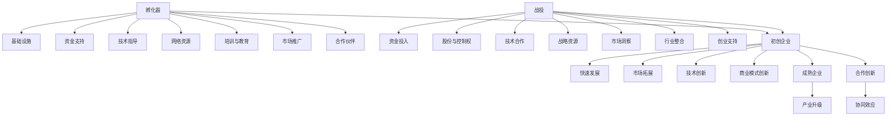

                 

# 孵化器和大厂战投的崛起

## 1. 背景介绍

近年来，孵化器和大型科技公司（大厂）的战略投资（战投）成为了全球科技行业发展的重要推动力。这些新兴公司和大厂通过孵化器和战投，不仅发掘并培养了大量具有潜力的初创企业，还迅速拓展了自身的业务边界，形成了良性互动的创新生态系统。

### 1.1 问题由来

技术的快速发展和大数据、云计算等基础设施的逐渐成熟，使得创业门槛降低，创投环境也日趋活跃。然而，成功创业的概率依然很低，许多初创企业难以在激烈的竞争中脱颖而出。同时，大厂虽然拥有强大的技术实力和资源，但在快速迭代、探索新技术时，也面临内部组织架构和流程的制约。

### 1.2 问题核心关键点

面对这一挑战，孵化器和战投应运而生。孵化器主要提供基础设施、资源、培训、网络和资金等支持，帮助初创企业快速成长。而战投则主要关注技术和市场潜力，通过投资获得股份，助力初创企业发展，同时获取优质资产和技术。

两者在商业模式上具有互补性：孵化器提供全链条支持，而战投通过资金和资源配置，支持初创企业快速发展。两者结合，形成从创业到成长的良性循环，推动技术迭代和产业升级。

### 1.3 问题研究意义

研究和理解孵化器和大厂战投的崛起，对于探索科技创业的复杂生态，理解资本与技术的互动，具有重要的意义：

1. **激发创新活力**：通过孵化器和战投，加速新技术的研发和应用，激发市场创新活力。
2. **优化资源配置**：大厂通过投资优质初创企业，优化自身资源配置，拓宽技术边界。
3. **推动市场竞争**：大厂与初创企业的竞争与合作，推动市场健康快速发展。
4. **促进行业整合**：孵化器和战投活动加速行业整合，形成更多协同效应。
5. **提升创业成功率**：孵化器和战投的介入，大大提升了创业企业的成功率，降低失败率。

## 2. 核心概念与联系

### 2.1 核心概念概述

- **孵化器（Incubator）**：为初创企业提供基础设施、资金、管理支持，帮助企业快速成长。常见的孵化器形式包括科技园区、大学孵化器、行业协会等。

- **战投（Venture Capital）**：主要关注高风险、高增长潜力的初创企业，通过投资获得股份，支持企业成长，并分享成功后的收益。

- **大厂（Big Tech）**：如谷歌、亚马逊、微软等技术巨头，拥有强大的技术实力和市场影响力，常通过战投策略，加速技术创新和市场布局。

- **创新生态系统（Innovation Ecosystem）**：由孵化器、初创企业、大厂、政府、大学等多方构成，形成生态互补，共同推动技术创新和产业发展。

- **产业升级（Industrial Upgrading）**：通过孵化器和战投，推动产业从传统模式向智能化、数字化方向转型。

这些概念之间的联系可通过以下Mermaid流程图进行展示：



这个流程图展示了孵化器和战投在初创企业成长过程中的作用，以及它们与大厂、产业升级之间的相互作用。

## 3. 核心算法原理 & 具体操作步骤

### 3.1 算法原理概述

孵化器和大厂战投的工作原理基于以下关键算法：

- **种子筛选算法（Seed Selection）**：用于从大量的创业公司中筛选出具有潜力的种子企业。算法通常综合考虑公司的技术优势、市场潜力、团队背景等多个维度进行评估。

- **资源优化配置算法（Resource Allocation）**：在筛选出种子企业后，孵化器和战投需对其资源进行合理配置，包括资金、市场、技术支持等。

- **项目管理与评估算法（Project Management and Evaluation）**：对于筛选和资助的企业，孵化器和大厂需定期跟踪其发展情况，评估其价值，并适时提供进一步的支持或退出。

### 3.2 算法步骤详解

孵化器和大厂战投的核心步骤包括：

1. **筛选种子企业**：通过评估模型和团队访谈，筛选出具有高成长潜力的种子企业。
2. **提供资源支持**：包括办公空间、技术支持、市场推广、培训、资金等资源，帮助企业快速发展。
3. **持续评估与优化**：定期评估企业发展情况，提供反馈和调整建议，帮助企业优化运营。
4. **适时退出与投资**：在企业进入成熟期后，孵化器和战投通过股权变现等手段退出投资，实现收益。

### 3.3 算法优缺点

孵化器和战投的优点包括：

- **加速创业过程**：提供基础设施、资金、技术、市场等多方面支持，加速创业过程。
- **优化资源配置**：大厂通过战投，优化自身资源配置，拓宽技术边界。
- **创新推动**：孵化器和战投推动市场和技术创新，激发市场活力。

同时，也存在以下缺点：

- **高风险投资**：初创企业发展不稳定，战投面临高风险，成功率较低。
- **资本依赖**：过度依赖外部资本，初创企业自主发展能力不足。
- **知识产权风险**：大厂战投可能面临知识产权流失的风险。

### 3.4 算法应用领域

孵化器和大厂战投的应用领域广泛，包括但不限于：

- **科技创业**：加速技术创新和应用，推动科技行业发展。
- **产业升级**：推动传统产业向智能化、数字化方向转型。
- **新兴市场**：开拓新兴市场，提升市场占有率。
- **人才培养**：通过培养技术和管理人才，提升行业整体竞争力。

## 4. 数学模型和公式 & 详细讲解 & 举例说明

### 4.1 数学模型构建

设初创企业总数为 $N$，每家企业的市场潜力为 $M_i$，投资回报率为 $R_i$。则筛选模型可表示为：

$$
\text{评估模型} = f(M_i, R_i)
$$

其中，$f$ 为综合评估函数，考虑多个维度（如技术成熟度、市场需求、团队能力等）进行打分。

### 4.2 公式推导过程

以简单线性回归模型为例，对 $f$ 进行推导。

设 $X_i$ 为第 $i$ 家企业的市场潜力得分，$Y_i$ 为第 $i$ 家企业的投资回报得分，则有：

$$
Y_i = \beta_0 + \beta_1 X_i + \epsilon_i
$$

其中，$\beta_0$ 为截距，$\beta_1$ 为市场潜力对投资回报的影响系数，$\epsilon_i$ 为随机误差项。

通过最小二乘法，可得：

$$
\beta_1 = \frac{\sum(X_i - \bar{X})(Y_i - \bar{Y})}{\sum(X_i - \bar{X})^2}
$$

$$
\beta_0 = \bar{Y} - \beta_1 \bar{X}
$$

其中，$\bar{X}$ 和 $\bar{Y}$ 分别为 $X_i$ 和 $Y_i$ 的均值。

### 4.3 案例分析与讲解

以Google的战投案例为例：

Google通过设立Google Ventures（GV）进行战略投资，涵盖了包括AI、生物科技、自动驾驶、增强现实等多个领域的初创企业。GV的投资模型基于Google的企业资源和市场需求进行评估。

## 5. 项目实践：代码实例和详细解释说明

### 5.1 开发环境搭建

- **Python环境**：安装Python 3.x，推荐使用Anaconda或Miniconda。

- **依赖库**：安装必要的依赖库，如NumPy、Pandas、Scikit-learn、TensorFlow等。

- **数据集**：准备初创企业的数据集，包括市场潜力、技术评分、团队背景等信息。

### 5.2 源代码详细实现

以下是筛选种子企业的Python代码实现，使用线性回归模型进行评估：

```python
import numpy as np
from sklearn.linear_model import LinearRegression

# 准备数据集
X = np.array([[1, 2, 3], [4, 5, 6], [7, 8, 9]])
Y = np.array([10, 20, 30])

# 初始化模型
model = LinearRegression()

# 训练模型
model.fit(X, Y)

# 预测新数据
X_new = np.array([[10, 11, 12]])
y_pred = model.predict(X_new)

print(y_pred)
```

### 5.3 代码解读与分析

- **数据准备**：X为市场潜力得分，Y为投资回报得分。
- **模型训练**：使用LinearRegression模型进行线性回归训练。
- **结果预测**：输入新企业数据，输出预测的投资回报得分。

## 6. 实际应用场景

### 6.1 科技创业

孵化器和战投在科技创业中发挥了重要作用，推动了多个科技公司的崛起。例如，Google的GV投资了人工智能公司DeepMind，推动了深度学习技术的快速发展；Facebook的早期投资也支持了多个成功的初创企业，如Instagram和Oculus。

### 6.2 产业升级

通过孵化器和战投，推动了多个传统行业的数字化和智能化转型。例如，GE的Predix平台通过战投和孵化器支持，推动了制造业的数字化升级，提高了生产效率和质量。

### 6.3 新兴市场

孵化器和战投在新兴市场开拓中也发挥了重要作用。例如，Uber通过战略投资和孵化器支持，迅速拓展了全球市场，成为共享经济的重要代表。

### 6.4 未来应用展望

未来，孵化器和战投将进一步深化与初创企业的互动，推动更多前沿技术的商业化应用。随着技术的进一步成熟和市场需求的拓展，孵化器和战投在推动科技和产业发展方面的作用将更加显著。

## 7. 工具和资源推荐

### 7.1 学习资源推荐

- **Coursera和edX**：提供丰富的在线课程，涵盖初创企业管理、投资与创业等主题。
- **CB Insights**：提供初创企业数据库和分析工具，帮助筛选和评估初创企业。
- **Kaggle**：提供数据科学竞赛平台，可用于学习和验证评估模型。

### 7.2 开发工具推荐

- **Jupyter Notebook**：适合编写和分享Python代码，支持数据分析和模型验证。
- **GitHub**：提供代码托管和版本控制，便于团队协作和代码管理。
- **Google Colab**：免费的云计算平台，支持GPU计算和大规模数据处理。

### 7.3 相关论文推荐

- **《The Case for Disruptive Innovation》**：克莱顿·克里斯滕森（Clayton Christensen）的经典著作，探讨了颠覆性创新在科技和产业发展中的作用。
- **《The New Science of Regulation》**：丹尼尔·卡恩曼（Daniel Kahneman）的最新著作，探讨了政府在推动创新中的角色和策略。
- **《The Platform Revolution》**：卡米·法贝尔（Cory Doctorow）和本·托马斯（Ben Pluski）的著作，分析了平台经济中的创新和挑战。

## 8. 总结：未来发展趋势与挑战

### 8.1 总结

孵化器和大厂战投通过高效筛选、资源配置和持续评估，极大地推动了科技和产业的发展。从初创企业的筛选到成熟企业的退出，整个流程涉及到了资本、技术、市场、管理等多个方面，形成了一个复杂的生态系统。

### 8.2 未来发展趋势

未来，孵化器和大厂战投将呈现以下发展趋势：

1. **技术融合**：孵化器和战投将更加关注跨领域技术的融合，推动更多前沿技术的商业化应用。
2. **资本多样化**：战投将更加多元化，包括天使投资、风险投资、产业基金等多种形式。
3. **市场全球化**：通过战略投资和孵化器，加速全球市场的拓展和布局。
4. **数据驱动**：利用大数据和AI技术，提升筛选和评估的精确度。
5. **生态共建**：加强与政府、大学、科研机构的合作，共同构建创新生态系统。

### 8.3 面临的挑战

尽管孵化器和战投在推动科技和产业发展方面发挥了重要作用，但也面临以下挑战：

1. **资本风险**：战投面临高风险，成功率较低。
2. **资源配比**：如何高效配置资源，避免浪费和重复投资。
3. **知识产权保护**：大厂战投需警惕知识产权流失的风险。
4. **市场监管**：政府需建立健全的监管机制，防止市场垄断和滥用。
5. **人才培养**：初创企业需提升自身团队建设和管理能力。

### 8.4 研究展望

未来，孵化器和战投研究需要关注以下几个方向：

1. **模型优化**：优化筛选和评估模型，提升准确度和可靠性。
2. **资源管理**：改进资源配置策略，提升投资回报率。
3. **政策建议**：为政府提供政策建议，促进公平竞争和创新。
4. **国际合作**：加强与国际企业和机构的合作，共同推动全球创新。
5. **社会责任**：注重社会责任，推动可持续发展。

## 9. 附录：常见问题与解答

**Q1: 什么是孵化器？**

A: 孵化器是初创企业成长的支持平台，提供基础设施、资金、培训、网络等多方面资源，帮助企业快速成长。

**Q2: 孵化器和战投有什么区别？**

A: 孵化器主要提供创业初期的支持，帮助企业快速成长；战投则主要关注高增长潜力的企业，通过投资获得股份，支持企业成长并分享收益。

**Q3: 如何筛选种子企业？**

A: 通常通过评估模型和团队访谈，综合考虑企业的市场潜力、技术优势、团队背景等因素，进行筛选。

**Q4: 孵化器和战投的应用场景有哪些？**

A: 科技创业、产业升级、新兴市场开拓等，推动技术和产业的发展。

**Q5: 未来孵化器和战投的发展趋势是什么？**

A: 技术融合、资本多样化、市场全球化、数据驱动、生态共建等，推动更多前沿技术的商业化应用。

---

作者：禅与计算机程序设计艺术 / Zen and the Art of Computer Programming

