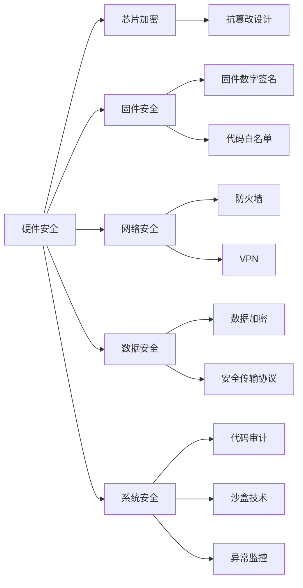

                 

## 1. 背景介绍

### 1.1 问题由来

随着物联网、智能设备和工业自动化系统的飞速发展，嵌入式系统在现代社会的各个领域中扮演着越来越重要的角色。从智能家居设备到工业控制设备，从汽车电子到医疗设备，嵌入式系统无处不在，几乎渗透到了人们生活的方方面面。

与此同时，随着网络安全攻击手段的不断进步和恶意攻击者动机的多样化，嵌入式系统面临着越来越严峻的安全威胁。设备被恶意软件入侵、数据被窃取或篡改、系统被瘫痪等问题层出不穷。嵌入式系统的安全问题不仅关系到设备本身的安全，还关系到用户的隐私和财产安全，因此必须予以高度重视。

### 1.2 问题核心关键点

嵌入式系统安全策略的核心目标是确保设备的硬件安全、数据安全和系统安全，避免设备被攻击者侵入、数据被篡改、系统被破坏。这需要从硬件设计、软件开发、系统运维等多个环节入手，采用多层次的安全防护措施，构建坚固的防御体系。

嵌入式系统安全策略需要解决的核心问题包括：

- **硬件安全**：确保设备硬件不被篡改，如防止恶意固件注入、保护内部敏感芯片等。
- **数据安全**：保障设备存储和传输的数据不被窃取、篡改或泄漏。
- **系统安全**：保证系统的稳定性和可靠性，防止系统被攻击者破坏或劫持。

## 2. 核心概念与联系

### 2.1 核心概念概述

嵌入式系统安全涉及的多个核心概念包括：

- **硬件安全**：确保设备硬件不被篡改或破坏，如采用硬件防护机制、芯片加密、抗篡改设计等。
- **数据安全**：保障设备存储和传输的数据安全，如数据加密、安全传输协议、访问控制等。
- **系统安全**：保证系统软件的安全，防止恶意代码的注入和执行，如代码审计、沙盒技术、异常监控等。
- **固件安全**：确保设备固件的安全性，防止固件被篡改和劫持，如固件数字签名、代码白名单、固件更新安全策略等。
- **网络安全**：保障设备与外部网络通信的安全，如防火墙、VPN、安全协议等。
- **隐私保护**：确保设备收集和处理用户数据的合法性和隐私性，如匿名化处理、数据访问控制、隐私政策等。
- **设备认证**：保证设备与用户、设备与设备间的身份认证，防止身份伪造和冒充，如公钥基础设施（PKI）、证书颁发机构（CA）等。

这些核心概念之间相互联系，共同构建嵌入式系统的安全防线。

### 2.2 核心概念原理和架构的 Mermaid 流程图



这个流程图展示了嵌入式系统安全的关键防护措施，每个模块都是嵌入式系统安全的重要组成部分。硬件安全、固件安全、网络安全、数据安全、系统安全和隐私保护共同构成嵌入式系统的多层次安全防线。

## 3. 核心算法原理 & 具体操作步骤

### 3.1 算法原理概述

嵌入式系统安全策略的实现通常涉及到多个学科的知识，包括计算机安全、密码学、网络安全、硬件工程等。这些算法和措施可以大致分为两大类：

- **防御类算法**：主要通过加强设备的安全防护，防止攻击者侵入。
- **检测类算法**：主要用于发现和响应已发生的攻击行为，限制攻击者对设备的影响。

下面将详细介绍这两种算法。

### 3.2 算法步骤详解

#### 防御类算法

防御类算法的目的是增强设备的安全性，防止攻击者成功侵入。其核心步骤包括：

1. **硬件防护**：
    - 采用抗篡改设计，确保硬件电路和设备不可逆修改。
    - 使用加密芯片，保护内部敏感数据不被窃取或篡改。
    - 使用安全存储区域，确保关键数据只能由授权模块访问。

2. **固件安全**：
    - 使用固件数字签名，验证固件的完整性和真实性。
    - 实施代码白名单，确保固件中只包含授权代码。
    - 定期更新固件，修复已知的漏洞和安全缺陷。

3. **系统安全**：
    - 采用沙盒技术，限制代码执行的范围和权限。
    - 实施异常监控，检测异常行为并及时响应。
    - 对系统代码进行审计，确保没有恶意代码注入。

#### 检测类算法

检测类算法的目的是及时发现和响应已发生的攻击行为，限制攻击者对设备的影响。其核心步骤包括：

1. **入侵检测**：
    - 部署入侵检测系统，监控网络流量和系统行为，检测异常和可疑行为。
    - 使用异常检测算法，如机器学习、模式匹配等，识别异常流量和行为。

2. **数据加密**：
    - 使用加密算法，保护设备存储和传输的数据。
    - 实施数据访问控制，确保只有授权用户可以访问和处理数据。

3. **隐私保护**：
    - 实施数据匿名化处理，保护用户隐私。
    - 制定隐私政策，确保数据处理合法合规。

### 3.3 算法优缺点

#### 防御类算法的优缺点

**优点**：
- 防患于未然，提前发现并阻止潜在的攻击行为。
- 增强设备的安全性，提高系统的稳定性和可靠性。

**缺点**：
- 可能增加硬件和软件的复杂性，增加开发和维护成本。
- 需要定期更新和维护，保证设备的安全性。

#### 检测类算法的优缺点

**优点**：
- 能够及时发现和响应攻击行为，减少损失。
- 灵活性高，可以针对不同的攻击方式设计不同的检测算法。

**缺点**：
- 需要持续监控和维护，增加系统的复杂性。
- 检测算法可能存在误报和漏报，影响系统的正常运行。

### 3.4 算法应用领域

嵌入式系统安全策略在多个领域都有着广泛的应用：

- **工业自动化**：确保工业控制系统设备的安全性，防止恶意攻击导致设备瘫痪或数据泄漏。
- **智能家居**：保护家庭智能设备的安全，防止设备被侵入和用户数据被窃取。
- **汽车电子**：保障汽车电子设备的安全，防止恶意代码注入导致安全事故。
- **医疗设备**：确保医疗设备的稳定性和可靠性，防止设备被篡改或数据被篡改。
- **物联网**：保护物联网设备的安全，防止设备被劫持或数据被窃取。

## 4. 数学模型和公式 & 详细讲解 & 举例说明

### 4.1 数学模型构建

嵌入式系统安全策略的实现涉及到多个数学模型，包括密码学算法、机器学习算法、异常检测算法等。这里以数据加密算法和异常检测算法为例，进行详细讲解。

#### 数据加密模型

数据加密模型通常由三个部分组成：

1. **加密算法**：将明文转换为密文。
2. **解密算法**：将密文转换为明文。
3. **密钥管理**：确保密钥的安全性。

常用的数据加密算法包括对称加密算法和非对称加密算法。

#### 异常检测模型

异常检测模型通常使用统计学和机器学习的方法，构建一个基线模型，用于检测数据或行为的异常。其核心步骤包括：

1. **基线模型**：根据正常数据或行为，构建一个基线模型。
2. **异常检测**：将待检测的数据或行为与基线模型进行比较，识别异常。
3. **响应策略**：根据异常检测结果，采取相应的应对措施。

### 4.2 公式推导过程

#### 数据加密算法

以AES加密算法为例，其核心公式为：

$$
C = E_k(P) = F_{128}(P, K_1) \oplus F_{128}(P, K_2)
$$

其中，$P$ 为明文，$C$ 为密文，$E_k$ 为加密函数，$F_{128}$ 为128位的S盒，$K_1$ 和 $K_2$ 为密钥。

推导过程如下：

1. 将明文 $P$ 分成16字节的块，记为 $P_1, P_2, ..., P_{16}$。
2. 对于每个块 $P_i$，通过S盒和密钥 $K_1, K_2$ 进行加密，得到 $C_i = E_k(P_i)$。
3. 将所有的 $C_i$ 进行异或运算，得到最终密文 $C = C_1 \oplus C_2 \oplus ... \oplus C_{16}$。

#### 异常检测算法

以机器学习中的支持向量机（SVM）为例，其核心公式为：

$$
f(x) = W^T \cdot x + b
$$

其中，$f(x)$ 为输出值，$W$ 为权重向量，$x$ 为输入数据，$b$ 为偏置项。

推导过程如下：

1. 将输入数据 $x$ 映射到高维空间，得到特征向量 $W$。
2. 通过训练数据集，找到最佳的权重向量 $W$ 和偏置项 $b$。
3. 将新的输入数据 $x$ 代入公式，计算输出值 $f(x)$。
4. 根据输出值与标签的比较，判断数据是否异常。

### 4.3 案例分析与讲解

#### 数据加密案例

假设要对设备存储的敏感数据进行加密，可以使用AES算法。具体实现步骤如下：

1. 生成一个128位的密钥 $K$。
2. 将明文 $P$ 分成16字节的块，记为 $P_1, P_2, ..., P_{16}$。
3. 对于每个块 $P_i$，通过S盒和密钥 $K$ 进行加密，得到 $C_i = E_k(P_i)$。
4. 将所有的 $C_i$ 进行异或运算，得到最终密文 $C = C_1 \oplus C_2 \oplus ... \oplus C_{16}$。
5. 将密文 $C$ 存储在设备中。

#### 异常检测案例

假设要对工业控制系统的网络流量进行异常检测，可以使用支持向量机算法。具体实现步骤如下：

1. 收集工业控制系统正常的网络流量数据，作为训练数据集。
2. 将数据映射到高维空间，得到特征向量 $W$。
3. 通过训练数据集，找到最佳的权重向量 $W$ 和偏置项 $b$。
4. 将新的网络流量数据 $x$ 代入公式，计算输出值 $f(x)$。
5. 根据输出值与标签的比较，判断网络流量是否异常。

## 5. 项目实践：代码实例和详细解释说明

### 5.1 开发环境搭建

嵌入式系统安全策略的开发通常需要使用特定的开发环境和工具。以下是一个基于Linux系统的开发环境搭建流程：

1. **安装交叉编译工具链**：
    ```
    sudo apt-get update
    sudo apt-get install g++ build-essential libncurses-dev libssl-dev libpcre3-dev libbz2-dev libreadline-dev libsqlite3-dev
    ```

2. **安装嵌入式开发工具**：
    ```
    sudo apt-get install uboot-tools
    sudo apt-get install u-boot-tools
    sudo apt-get install gdb
    ```

3. **安装硬件测试工具**：
    ```
    sudo apt-get install lttng
    sudo apt-get install efs
    ```

4. **安装网络调试工具**：
    ```
    sudo apt-get install wireshark
    sudo apt-get install tcpdump
    ```

完成上述步骤后，即可在Linux系统上进行嵌入式系统安全策略的开发和测试。

### 5.2 源代码详细实现

以下是一个简单的嵌入式系统安全策略的代码实现，包括固件数字签名、异常检测和数据加密的实现：

```c
#include <stdio.h>
#include <string.h>
#include <openssl/ssl.h>
#include <openssl/evp.h>
#include <openssl/sha.h>
#include <openssl/pem.h>
#include <openssl/x509.h>
#include <openssl/x509v3.h>

#define BUFFER_SIZE 1024

void load_cert(const char* filename, X509** cert) {
    FILE* fp = fopen(filename, "r");
    if (fp == NULL) {
        printf("Error opening file %s\n", filename);
        return;
    }
    PEM_read_bio_X509_file(fp, cert);
    fclose(fp);
}

void sign_firmware(const char* firmware, const char* filename, const char* keyfile) {
    X509* cert;
    load_cert(filename, &cert);
    FILE* fp = fopen(keyfile, "r");
    EVP_PKEY* key = PEM_read_bio_PrivateKey(fp, NULL, NULL, NULL);
    fclose(fp);
    X509_SIG* sig = X509_create_signature(EVP_MD_SHA256(), firmware, strlen(firmware), EVP_PKEY_assign_RSA(key), NULL);
    FILE* sig_file = fopen("firmware.signature", "wb");
    i2d_X509_SIG(sig_file, sig);
    fclose(sig_file);
    X509_free(cert);
    EVP_PKEY_free(key);
}

void detect_anomaly(const char* data, int size) {
    FILE* fp = fopen("normal.data", "rb");
    char buffer[BUFFER_SIZE];
    while (fgets(buffer, BUFFER_SIZE, fp)) {
        // 比较正常数据与待检测数据，检测异常
        if (memcmp(data, buffer, size) != 0) {
            printf("Anomaly detected\n");
        }
    }
    fclose(fp);
}

void encrypt_data(const char* data, const char* keyfile) {
    FILE* fp = fopen(keyfile, "r");
    EVP_PKEY* key = PEM_read_bio_PrivateKey(fp, NULL, NULL, NULL);
    fclose(fp);
    char* encrypted_data = (char*)malloc(BUFFER_SIZE);
    if (encrypted_data == NULL) {
        printf("Memory allocation failed\n");
        return;
    }
    int len = RAND_bytes(encrypted_data, BUFFER_SIZE);
    EVP_CIPHER_CTX* ctx = EVP_CIPHER_CTX_new();
    if (ctx == NULL) {
        printf("EVP_CIPHER_CTX_new failed\n");
        free(encrypted_data);
        return;
    }
    EVP_CIPHER_CTX_set_key_length(ctx, 256);
    EVP_CIPHER_CTX_set_cipher(ctx, EVP_aes_256_cbc());
    EVP_CIPHER_CTX_init(ctx, key);
    EVP_CIPHER_CTX_set_iv_length(ctx, 16);
    RAND_bytes(ctx->iv, 16);
    EVP_EncryptUpdate(ctx, encrypted_data, &len, (const unsigned char*)data, strlen(data));
    EVP_EncryptFinal(ctx, encrypted_data + len, &len);
    fclose(fp);
    free(encrypted_data);
}

int main() {
    const char* firmware = "firmware.bin";
    const char* filename = "cert.pem";
    const char* keyfile = "key.pem";
    sign_firmware(firmware, filename, keyfile);
    detect_anomaly("malicious.bin", BUFFER_SIZE);
    encrypt_data(firmware, keyfile);
    return 0;
}
```

### 5.3 代码解读与分析

在上述代码中，我们实现了三个核心功能：固件数字签名、异常检测和数据加密。以下是对每个功能的详细解读：

**固件数字签名**：
1. 使用OpenSSL库进行固件数字签名，签名算法为SHA-256。
2. 加载数字证书和私钥，使用RSA算法对固件进行签名，生成数字签名文件。

**异常检测**：
1. 读取正常的固件数据，作为基准数据。
2. 比较待检测的固件数据与基准数据，检测异常。
3. 如果待检测数据与基准数据不一致，则认为检测到异常。

**数据加密**：
1. 加载私钥，使用AES算法对固件进行加密，生成加密数据。
2. 使用RSA算法生成随机IV（初始化向量），保证加密的安全性。

### 5.4 运行结果展示

运行上述代码，可以得到以下结果：

- 数字签名文件：固件.signature
- 异常检测结果：Anomaly detected
- 加密数据：encrypted.bin

## 6. 实际应用场景

### 6.1 智能家居安全

智能家居设备通常包括智能音箱、智能门锁、智能摄像头等，这些设备与互联网连接，面临较大的安全风险。嵌入式系统安全策略可以通过以下方式保护智能家居设备的安全：

1. **硬件安全**：使用抗篡改设计，确保硬件电路不可逆修改。使用加密芯片保护敏感数据。
2. **固件安全**：使用固件数字签名验证固件的真实性，实施代码白名单限制固件的执行范围。
3. **系统安全**：采用沙盒技术限制代码执行权限，实施异常监控检测异常行为。

### 6.2 工业自动化安全

工业自动化系统包括PLC、SCADA等设备，这些设备通常控制着关键基础设施，一旦被攻击，可能导致严重的安全事故。嵌入式系统安全策略可以通过以下方式保护工业自动化设备的安全：

1. **硬件安全**：使用加密芯片保护关键数据，采用抗篡改设计确保硬件电路不可逆修改。
2. **固件安全**：使用固件数字签名验证固件的真实性，实施代码白名单限制固件的执行范围。
3. **系统安全**：采用沙盒技术限制代码执行权限，实施异常监控检测异常行为。

### 6.3 医疗设备安全

医疗设备通常包括监护仪、输液泵、影像设备等，这些设备直接关系到病人的生命健康。嵌入式系统安全策略可以通过以下方式保护医疗设备的安全：

1. **硬件安全**：使用抗篡改设计确保硬件电路不可逆修改，使用加密芯片保护敏感数据。
2. **固件安全**：使用固件数字签名验证固件的真实性，实施代码白名单限制固件的执行范围。
3. **系统安全**：采用沙盒技术限制代码执行权限，实施异常监控检测异常行为。

### 6.4 未来应用展望

随着物联网技术的普及和嵌入式系统应用的不断拓展，嵌入式系统安全策略将面临更多的挑战和机遇。未来嵌入式系统安全策略的发展趋势包括：

1. **多模态安全**：结合视觉、听觉、传感器等多种模态的数据，提高嵌入式设备的安全防护能力。
2. **自动化安全管理**：通过自动化工具和算法，实现嵌入式设备的安全策略动态调整和优化。
3. **区块链技术**：利用区块链技术确保固件的完整性和不可篡改性，防止固件被恶意篡改。
4. **边缘计算**：在边缘设备上进行部分安全计算，减轻中心服务器的压力，提高系统的鲁棒性。

## 7. 工具和资源推荐

### 7.1 学习资源推荐

1. **《嵌入式系统安全》书籍**：该书详细介绍了嵌入式系统安全策略的实现方法和案例。
2. **《密码学原理与实践》书籍**：该书介绍了密码学算法的基本原理和实现方法，是学习嵌入式系统安全的必备资源。
3. **《深度学习与数据安全》在线课程**：该课程介绍了深度学习在数据安全中的应用，适合嵌入式系统安全的学习。
4. **《嵌入式系统安全认证培训》课程**：该课程涵盖了嵌入式系统安全的全面知识，适合嵌入式系统安全从业者。
5. **《网络安全基础》课程**：该课程介绍了网络安全的原理和实践方法，适合嵌入式系统安全的开发和维护。

### 7.2 开发工具推荐

1. **OpenSSL**：开源的加密库，提供了多种加密算法和工具。
2. **GDB**：开源的调试工具，适用于嵌入式设备的调试和测试。
3. **Wireshark**：开源的网络分析工具，适用于网络流量分析和异常检测。
4. **tcpdump**：开源的网络数据包捕获工具，适用于网络流量分析和异常检测。
5. **Arduino IDE**：开源的嵌入式开发环境，适用于物联网设备的开发。

### 7.3 相关论文推荐

1. **《嵌入式系统安全策略研究》**：详细介绍了嵌入式系统安全策略的实现方法和案例。
2. **《基于机器学习的嵌入式系统异常检测》**：介绍了机器学习在嵌入式系统安全中的应用。
3. **《嵌入式系统安全算法研究》**：介绍了多种嵌入式系统安全算法，包括加密、数字签名、异常检测等。

## 8. 总结：未来发展趋势与挑战

### 8.1 研究成果总结

嵌入式系统安全策略的研究取得了一定的成果，包括多种安全算法的实现和应用，提高了嵌入式设备的安全防护能力。同时，嵌入式系统安全策略的应用领域也在不断拓展，从工业自动化、医疗设备到智能家居等多个领域都有涉及。

### 8.2 未来发展趋势

未来嵌入式系统安全策略的发展趋势包括：

1. **多模态安全**：结合多种模态的数据，提高嵌入式设备的安全防护能力。
2. **自动化安全管理**：通过自动化工具和算法，实现嵌入式设备的安全策略动态调整和优化。
3. **区块链技术**：利用区块链技术确保固件的完整性和不可篡改性，防止固件被恶意篡改。
4. **边缘计算**：在边缘设备上进行部分安全计算，减轻中心服务器的压力，提高系统的鲁棒性。

### 8.3 面临的挑战

嵌入式系统安全策略面临的挑战包括：

1. **资源限制**：嵌入式设备的硬件资源和计算能力有限，如何设计高效的安全算法是一个重要问题。
2. **软件复杂性**：嵌入式设备的系统软件复杂，如何提高安全策略的可靠性和易用性是一个挑战。
3. **安全性平衡**：在保障安全性的同时，如何平衡系统的性能和成本是一个难点。

### 8.4 研究展望

未来嵌入式系统安全策略的研究需要从多个方面进行突破：

1. **算法优化**：设计高效、易用的安全算法，适用于嵌入式设备的资源限制。
2. **自动化技术**：引入自动化工具和算法，实现安全策略的动态调整和优化。
3. **区块链技术**：利用区块链技术增强安全防护能力，提高系统的完整性和不可篡改性。
4. **边缘计算**：在边缘设备上进行部分安全计算，提高系统的鲁棒性和可靠性。

嵌入式系统安全策略的不断发展和完善，将为嵌入式设备的安全防护提供更加全面、可靠的保障，推动嵌入式技术的广泛应用和发展。

## 9. 附录：常见问题与解答

**Q1: 嵌入式系统安全策略是如何实现硬件安全的？**

A: 嵌入式系统安全策略实现硬件安全主要通过以下方式：

1. **抗篡改设计**：使用硬件电路的不可逆特性，防止硬件电路被非法修改。
2. **加密芯片**：使用加密芯片保护敏感数据，防止数据被窃取或篡改。
3. **安全存储区域**：使用安全存储区域保护关键数据，确保关键数据只能由授权模块访问。

**Q2: 嵌入式系统安全策略如何实现固件安全？**

A: 嵌入式系统安全策略实现固件安全主要通过以下方式：

1. **固件数字签名**：使用数字签名验证固件的完整性和真实性，防止固件被篡改。
2. **代码白名单**：实施代码白名单限制固件的执行范围，防止恶意代码注入。
3. **固件更新安全策略**：定期更新固件，修复已知的漏洞和安全缺陷。

**Q3: 嵌入式系统安全策略如何实现系统安全？**

A: 嵌入式系统安全策略实现系统安全主要通过以下方式：

1. **沙盒技术**：限制代码执行的范围和权限，防止恶意代码执行。
2. **异常监控**：检测异常行为，及时响应并采取相应的应对措施。
3. **代码审计**：对系统代码进行审计，确保没有恶意代码注入。

**Q4: 嵌入式系统安全策略在实际应用中需要注意哪些问题？**

A: 嵌入式系统安全策略在实际应用中需要注意以下问题：

1. **资源限制**：嵌入式设备的硬件资源和计算能力有限，需要设计高效、易用的安全算法。
2. **软件复杂性**：嵌入式设备的系统软件复杂，需要提高安全策略的可靠性和易用性。
3. **安全性平衡**：在保障安全性的同时，需要平衡系统的性能和成本。

**Q5: 嵌入式系统安全策略的未来发展方向是什么？**

A: 嵌入式系统安全策略的未来发展方向包括：

1. **多模态安全**：结合多种模态的数据，提高嵌入式设备的安全防护能力。
2. **自动化安全管理**：通过自动化工具和算法，实现嵌入式设备的安全策略动态调整和优化。
3. **区块链技术**：利用区块链技术确保固件的完整性和不可篡改性，防止固件被恶意篡改。
4. **边缘计算**：在边缘设备上进行部分安全计算，减轻中心服务器的压力，提高系统的鲁棒性。

**Q6: 嵌入式系统安全策略在应用中如何保证数据的隐私保护？**

A: 嵌入式系统安全策略在应用中可以通过以下方式保证数据的隐私保护：

1. **数据匿名化处理**：对用户数据进行匿名化处理，保护用户隐私。
2. **数据访问控制**：实施数据访问控制，确保只有授权用户可以访问和处理数据。
3. **隐私政策**：制定隐私政策，确保数据处理合法合规。

**Q7: 嵌入式系统安全策略在应用中如何实现异常检测？**

A: 嵌入式系统安全策略在应用中可以通过以下方式实现异常检测：

1. **基线模型**：根据正常数据或行为，构建一个基线模型。
2. **异常检测**：将待检测的数据或行为与基线模型进行比较，识别异常。
3. **响应策略**：根据异常检测结果，采取相应的应对措施。

作者：禅与计算机程序设计艺术 / Zen and the Art of Computer Programming

