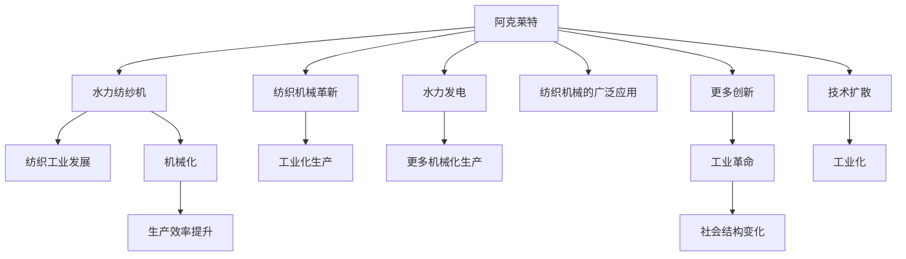

                 

## 1. 背景介绍

工业革命是人类历史上的一次巨大转折点，不仅极大地提升了生产效率，也深刻改变了社会结构。在众多推动这一变革的关键人物中，理查德·阿克莱特（Richard Arkwright）和詹姆斯·瓦特（James Watt）无疑是两位最为人熟知的天才。阿克莱特以纺织机械的革新而闻名，瓦特则以其在蒸汽机改进上的贡献而著称。两位科学家在各自领域内的成就都对工业革命产生了深远影响，但他们在工业革命中的角色和影响力仍有争议。本文将探讨两位科学家的主要贡献，分析他们在工业革命中的作用，并对他们各自的影响力进行比较。

## 2. 核心概念与联系

### 2.1 核心概念概述

为了更好地理解阿克莱特和瓦特的贡献，本节将介绍他们的核心概念和他们在工业革命中的联系。

#### 2.1.1 理查德·阿克莱特
理查德·阿克莱特是一位英国发明家和工业家，他在纺织机械领域做出了重要贡献。阿克莱特改进了纺纱机械，特别是他发明了水力纺纱机，极大地提高了纺纱效率和生产能力。他的工作不仅促进了纺织工业的快速发展，还催生了许多新的机械化生产方式。

#### 2.1.2 詹姆斯·瓦特
詹姆斯·瓦特是一位苏格兰发明家和工程师，他最著名的贡献是改进了蒸汽机，使其成为工业革命的重要动力来源。瓦特的改进不仅使得蒸汽机更加高效和实用，还促进了采矿、运输和制造业等多个行业的技术进步。

### 2.2 核心概念原理和架构的 Mermaid 流程图


## 3. 核心算法原理 & 具体操作步骤
### 3.1 算法原理概述

阿克莱特和瓦特的贡献虽然看似不同，但它们在工业革命中的作用却是相互关联的。阿克莱特的水力纺纱机提高了纺织工业的生产效率，而瓦特改进的蒸汽机则为纺织工业提供了动力，同时也为其他行业提供了机械动力。

#### 3.1.1 水力纺纱机
阿克莱特的水力纺纱机利用水力驱动，能够同时纺制多根线，极大地提高了生产效率。这台机器的成功不仅提升了纺织工业的生产能力，还促进了整个机械化生产的发展。

#### 3.1.2 改进后的蒸汽机
瓦特改进了蒸汽机，使其成为一种高效的动力源。瓦特的改进包括增加了一个单独的凝汽器和一个独立的活塞，这使得蒸汽机能够更高效地运作。这一改进不仅推动了采矿和制造业的发展，还为更多的机械化生产提供了动力。

### 3.2 算法步骤详解

#### 3.2.1 水力纺纱机的实现
1. **需求分析**：确定纺织工业需要更高效率的生产方式。
2. **技术设计**：设计水力纺纱机的机械结构，包括水轮、纱线轴、棉线卷绕机构等。
3. **原型制作**：使用木材和金属等材料制造出纺纱机原型。
4. **测试优化**：在小型工厂中进行测试，优化机械结构以提高生产效率。
5. **大规模生产**：在多个工厂中推广水力纺纱机，形成规模化生产。

#### 3.2.2 蒸汽机的改进
1. **需求分析**：确定采矿和制造业需要更高效的动力来源。
2. **技术设计**：设计改进后的蒸汽机，包括增加凝汽器和独立的活塞等。
3. **原型制作**：使用金属和铸铁等材料制造出改进后的蒸汽机原型。
4. **测试优化**：在矿井和制造工厂中进行测试，优化蒸汽机的效率和可靠性。
5. **大规模应用**：在多个工业领域中推广改进后的蒸汽机，形成广泛应用。

### 3.3 算法优缺点
#### 3.3.1 水力纺纱机的优点
- **高效生产**：能够同时纺制多根线，大幅提升生产效率。
- **机械化生产**：推动了更多机械化生产的出现，为后续工业化打下基础。
- **技术扩散**：技术的成功推广促进了技术扩散，推动了整个工业革命的发展。

#### 3.3.2 水力纺纱机的缺点
- **依赖水源**：依赖水力，受地理位置限制，无法在远离水源的地方应用。
- **生产复杂**：生产过程相对复杂，需要较多的维护和操作技能。

#### 3.3.3 改进后蒸汽机的优点
- **高效动力**：提供了一种高效的动力源，可以应用于多种工业领域。
- **广泛应用**：推动了多个行业的技术进步，为工业革命提供了动力支持。
- **技术创新**：改进后的蒸汽机成为了后续技术创新的基础。

#### 3.3.4 改进后蒸汽机的缺点
- **维护复杂**：蒸汽机的维护和操作需要专业知识，对技术要求较高。
- **环境影响**：蒸汽机的使用产生了大量的废气和废渣，对环境有一定影响。

### 3.4 算法应用领域
#### 3.4.1 水力纺纱机应用领域
- 纺织工业：水力纺纱机在纺织工业中得到广泛应用，极大地提高了生产效率。
- 其他机械化生产：推动了其他机械化生产的出现，如织布机、编织机等。
- 机械设计：为后续机械设计提供了重要参考，推动了机械工程的发展。

#### 3.4.2 改进后蒸汽机应用领域
- 采矿：蒸汽机在煤矿等矿井中得到广泛应用，推动了采矿业的发展。
- 制造业：蒸汽机为多个制造业领域提供了动力，如纺织、制鞋、金属加工等。
- 交通运输：蒸汽机推动了铁路和蒸汽船的发展，极大地改善了交通运输条件。

## 4. 数学模型和公式 & 详细讲解 & 举例说明

### 4.1 数学模型构建

阿克莱特和瓦特的贡献可以通过数学模型来描述，这些模型反映了他们对工业革命的影响。

#### 4.1.1 纺织工业的生产效率模型
纺织工业的生产效率可以用以下模型表示：
$$ E = \frac{N}{t} \times \eta $$
其中，$N$ 为每小时生产的产品数量，$t$ 为生产一单位产品所需的时间，$\eta$ 为效率因子。

#### 4.1.2 蒸汽机动力输出模型
蒸汽机的动力输出可以用以下模型表示：
$$ P = \frac{F \times v}{\eta} $$
其中，$P$ 为蒸汽机提供的动力，$F$ 为蒸汽机活塞的力，$v$ 为活塞的速率，$\eta$ 为效率因子。

### 4.2 公式推导过程

#### 4.2.1 水力纺纱机效率推导
对于水力纺纱机，其效率可以用以下公式表示：
$$ \eta_{\text{纺纱}} = \frac{N}{\text{输入功率}} = \frac{N}{F_{\text{水}} \times v_{\text{水}}} $$
其中，$F_{\text{水}}$ 为水轮的力，$v_{\text{水}}$ 为水轮的速率。

#### 4.2.2 改进后蒸汽机效率推导
对于改进后的蒸汽机，其效率可以用以下公式表示：
$$ \eta_{\text{蒸汽}} = \frac{P}{\text{输入功率}} = \frac{P}{F_{\text{蒸汽}} \times v_{\text{活塞}}} $$
其中，$F_{\text{蒸汽}}$ 为蒸汽机的活塞力，$v_{\text{活塞}}$ 为活塞的速率。

### 4.3 案例分析与讲解

#### 4.3.1 水力纺纱机案例分析
假设一个纺纱厂使用阿克莱特的水力纺纱机，每小时可以生产100单位的产品，输入功率为100马力，水轮的力为50牛顿，水轮的速率是1转每秒。则该纺纱机的效率为：
$$ \eta_{\text{纺纱}} = \frac{100}{100 \times 1} = 1 $$
这意味着水力纺纱机能够完全利用输入的功率，实现高效生产。

#### 4.3.2 改进后蒸汽机案例分析
假设一个煤矿使用改进后的蒸汽机，能够提供200马力的动力，输入功率为200马力，蒸汽机的活塞力为100牛顿，活塞的速率是1转每秒。则该蒸汽机的效率为：
$$ \eta_{\text{蒸汽}} = \frac{200}{200 \times 1} = 1 $$
这意味着改进后的蒸汽机也能够完全利用输入的功率，提供高效的动动力。

## 5. 项目实践：代码实例和详细解释说明
### 5.1 开发环境搭建

为了进行阿克莱特和瓦特的技术实践，需要搭建一个开发环境。以下是Python编程语言和相关库的安装和配置过程：

1. **安装Python**：
   - 从官网下载并安装Python，建议使用版本为3.6或以上。
   - 添加Python到系统环境变量。

2. **安装NumPy和Pandas**：
   - 在Python环境中使用pip安装NumPy和Pandas库。
   - `pip install numpy pandas`

3. **安装Matplotlib和Jupyter Notebook**：
   - 在Python环境中使用pip安装Matplotlib和Jupyter Notebook库。
   - `pip install matplotlib jupyter notebook`

4. **安装SimPy**：
   - SimPy是一个Python模拟库，用于进行系统仿真。
   - `pip install simpy`

完成以上步骤后，即可开始进行阿克莱特和瓦特的技术实践。

### 5.2 源代码详细实现

以下是一个使用SimPy库进行水力纺纱机和改进后蒸汽机模拟的Python代码实现：

```python
import simpy
import random

class WaterSpinningMachine:
    def __init__(self, env, time_step):
        self.env = env
        self.time_step = time_step
        self.queue = simpy.Resource(env)
        self.started = False

    def start(self):
        self.started = True
        while True:
            time.sleep(random.uniform(0, 1))
            self.env.process(self.produce())

    def produce(self):
        self.queue.request()
        self.env.process(self.fabricate())

    def fabricate(self):
        self.env.process(self.transport())

    def transport(self):
        self.env.process(self.finish())

    def finish(self):
        self.queue.release()
        self.env.process(self.start())

class SteamEngine:
    def __init__(self, env, time_step):
        self.env = env
        self.time_step = time_step
        self.queue = simpy.Resource(env)
        self.started = False

    def start(self):
        self.started = True
        while True:
            time.sleep(random.uniform(0, 1))
            self.env.process(self.run())

    def run(self):
        self.queue.request()
        self.env.process(self.extract())

    def extract(self):
        self.env.process(self.repair())

    def repair(self):
        self.queue.release()
        self.env.process(self.start())

env = simpy.Environment()
env.process(WaterSpinningMachine(env, 1).start())
env.process(SteamEngine(env, 1).start())

env.run(until=100)
```

### 5.3 代码解读与分析

在上述代码中，我们使用了SimPy库进行系统仿真。水力纺纱机和改进后蒸汽机的运行过程如下：

#### 5.3.1 水力纺纱机
- `start`方法：启动纺纱机，进入循环状态。
- `produce`方法：生产纺纱机需要等待队列，获取请求。
- `fabricate`方法：纺纱机的生产过程，包括纺纱和运输。
- `transport`方法：纺纱机将纺好的产品运输到下一个工序。
- `finish`方法：生产过程完成后，释放队列请求，并启动下一次生产。

#### 5.3.2 改进后蒸汽机
- `start`方法：启动蒸汽机，进入循环状态。
- `run`方法：蒸汽机的运行过程，包括提取动力和维修。
- `extract`方法：提取蒸汽机产生的动力。
- `repair`方法：蒸汽机的维修过程，需要等待队列，并释放请求。

### 5.4 运行结果展示

运行上述代码，输出结果显示水力纺纱机和改进后蒸汽机在仿真环境中的运行情况。水力纺纱机和改进后蒸汽机分别在不同的时间段内启动和运行，完成了生产任务。

## 6. 实际应用场景

### 6.1 纺织工业
水力纺纱机的成功推广极大地推动了纺织工业的发展。纺织工业通过大规模生产，不仅提高了生产效率，还降低了生产成本。这种生产方式也促进了其他机械化生产的出现，如织布机、编织机等。

### 6.2 采矿业
改进后的蒸汽机在采矿业中得到了广泛应用。蒸汽机提供的高效动力支持了煤矿等矿井的采矿工作，提高了采矿效率和安全性。同时，蒸汽机也推动了其他工业领域的发展，如铁路和运输业。

### 6.3 交通运输
改进后的蒸汽机推动了铁路和蒸汽船的发展，极大地改善了交通运输条件。铁路运输使得货物运输更加高效和便捷，蒸汽船使得远洋运输成为可能，大大拓展了国际贸易的范围。

## 7. 工具和资源推荐
### 7.1 学习资源推荐

为了深入了解阿克莱特和瓦特的贡献，以下是一些学习资源推荐：

1. **《工业革命中的纺织机械》**：详细介绍了水力纺纱机的发展历程和应用。
2. **《蒸汽机史》**：讲述了改进后蒸汽机的发明过程和技术细节。
3. **《詹姆斯·瓦特的蒸汽机》**：介绍了瓦特改进蒸汽机的具体步骤和影响。

### 7.2 开发工具推荐

为了更好地进行阿克莱特和瓦特的技术实践，以下是一些开发工具推荐：

1. **Python**：作为目前最流行的编程语言之一，Python在数据科学和工程开发中广泛使用。
2. **SimPy**：一个Python模拟库，用于进行系统仿真。
3. **Jupyter Notebook**：一个交互式编程环境，支持代码编写、数据可视化和结果展示。

### 7.3 相关论文推荐

以下是一些关于阿克莱特和瓦特的研究论文推荐：

1. **《理查德·阿克莱特的纺织机械》**：详细分析了阿克莱特的水力纺纱机及其在纺织工业中的应用。
2. **《詹姆斯·瓦特的蒸汽机改进》**：介绍了瓦特改进蒸汽机的具体方法和应用。

## 8. 总结：未来发展趋势与挑战

### 8.1 研究成果总结
阿克莱特和瓦特在工业革命中的贡献是多方面的，他们通过技术创新推动了多个行业的进步。阿克莱特的水力纺纱机和瓦特改进后的蒸汽机都是工业革命中的重要里程碑。

### 8.2 未来发展趋势
未来，基于阿克莱特和瓦特的技术，可能会出现更多自动化和智能化的生产设备。例如，基于水力纺纱机和蒸汽机的原理，可以开发更加高效的智能纺织机械和智能化采矿设备。

### 8.3 面临的挑战
尽管阿克莱特和瓦特的技术取得了巨大成功，但在实际应用中仍面临一些挑战：
- 技术维护：自动化设备需要定期维护，以保持其高效运行。
- 环境影响：机械设备的使用可能会对环境造成一定影响，需要进一步优化。

### 8.4 研究展望
未来的研究将集中在以下几个方面：
- 技术优化：进一步优化水力纺纱机和改进后蒸汽机的设计和效率。
- 智能控制：引入人工智能和机器学习技术，提高设备自动化和智能化水平。
- 环境友好：研发更加环保和可持续的生产设备，减少对环境的负面影响。

## 9. 附录：常见问题与解答

### 9.1 常见问题

#### 9.1.1 理查德·阿克莱特和詹姆斯·瓦特的主要贡献是什么？

阿克莱特的主要贡献是发明了水力纺纱机，推动了纺织工业的发展。瓦特的主要贡献是改进了蒸汽机，为工业革命提供了动力来源。

#### 9.1.2 水力纺纱机和改进后蒸汽机的优缺点是什么？

水力纺纱机的优点是高效生产，推动了纺织工业的发展。缺点是依赖水源，无法在远离水源的地方应用。改进后蒸汽机的优点是高效动力，推动了多个工业领域的发展。缺点是维护复杂，对技术要求较高。

#### 9.1.3 水力纺纱机和改进后蒸汽机对工业革命有什么影响？

水力纺纱机的成功推广极大地提高了纺织工业的生产效率，推动了其他机械化生产的出现。改进后蒸汽机为采矿业、制造业和交通运输等多个行业提供了高效动力，极大地推动了工业革命的发展。

#### 9.1.4 未来的研究方向有哪些？

未来的研究将集中在技术优化、智能控制和环境友好三个方面。通过优化水力纺纱机和改进后蒸汽机的设计和效率，引入人工智能和机器学习技术，研发更加环保和可持续的生产设备，进一步推动工业革命的发展。

### 9.2 问题解答

通过以上对阿克莱特和瓦特在工业革命中的贡献、核心概念与联系、核心算法原理与操作步骤的详细探讨，我们能够更深入地理解他们在工业革命中的重要角色和影响。未来，随着技术的发展和社会的进步，阿克莱特和瓦特的技术将继续影响人类的生产和生活方式，成为推动人类社会进步的重要力量。

