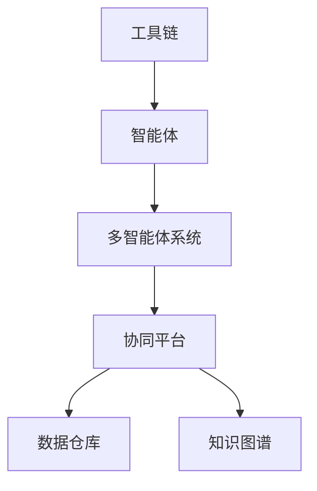

                 

# 工具使用与多智能体协同：提升任务完成度

## 1. 背景介绍

在当今快速发展的数字化时代，工具和智能体协同已成为各行各业提升任务完成度的重要手段。从软件开发到生产制造，从市场运营到智能家居，都离不开高效的工具链和智能系统的支持。本文旨在探讨如何有效利用工具和多智能体系统，以提升任务完成度和业务效率。

### 1.1 问题由来
在复杂的任务管理中，单个人的效率和能力是有限的。而通过工具和智能体的协同，能够极大提升任务执行的速度和质量。例如，软件开发团队通过版本控制系统、持续集成工具、自动化测试等手段，可以加速软件的迭代开发；生产制造企业通过智能控制系统、物联网设备、数据分析平台，可以优化生产流程，降低成本。然而，这些工具和技术的使用，并非简单叠加，而是需要系统化的规划和管理，才能最大化其效能。

### 1.2 问题核心关键点
- 工具选择：不同工具有不同的特点和适用场景，如何根据任务需求选择合适的工具，是提升任务完成度的关键。
- 智能体协同：智能体（如机器学习模型、自动化系统）之间的协同合作，能够更高效地完成任务，但需要设计合适的接口和通信机制。
- 系统集成：将多种工具和智能体集成到统一的管理平台，实现信息共享和协同作业，才能充分发挥其潜力。
- 数据管理：数据是智能体的基础，如何有效地收集、存储和利用数据，是工具使用和智能体协同的核心。

## 2. 核心概念与联系

### 2.1 核心概念概述

为了更好地理解工具使用与多智能体协同的原理，本节将介绍几个关键概念：

- **工具链**：指的是用于支持某项工作的一系列工具，包括开发、测试、部署、运维等各个环节所需的软件和硬件。
- **智能体**：指的是可以自主执行任务、具有一定决策能力的实体，如机器学习模型、自动化脚本、智能机器人等。
- **多智能体系统**：指的是由多个智能体组成的协同系统，能够通过通信机制协调行动，实现更高效的任务执行。
- **协同平台**：指的是用于集成和管理工具和智能体的平台，提供统一的界面和接口，实现信息共享和协同作业。
- **数据仓库**：指的是集中管理和存储数据的仓库，支持智能体的训练和优化。
- **知识图谱**：指的是通过图形结构存储和关联知识的系统，支持智能体的推理和决策。

这些概念之间的逻辑关系可以通过以下Mermaid流程图来展示：



这个流程图展示了一系列关键概念之间的联系：

1. 工具链是支撑智能体运行的基础环境。
2. 智能体通过工具链和协同平台实现协同作业。
3. 数据仓库和知识图谱为智能体提供了数据和知识支持。
4. 协同平台整合了工具和智能体，实现信息共享和协同作业。

## 3. 核心算法原理 & 具体操作步骤

### 3.1 算法原理概述

工具使用与多智能体协同的核心算法原理，主要涉及以下几个方面：

- **任务分解**：将大任务分解为多个小任务，每个任务由不同的工具和智能体负责执行。
- **数据流管理**：设计合理的数据流，确保数据在工具和智能体之间的有效传递和处理。
- **协同决策机制**：通过通信机制，协调不同智能体之间的决策和行动，实现高效的协同作业。
- **反馈和优化**：根据任务执行结果，不断调整工具和智能体的参数，优化任务完成度。

### 3.2 算法步骤详解

基于上述原理，工具使用与多智能体协同的算法步骤可以总结为以下几点：

**Step 1: 需求分析与任务分解**

- 明确任务目标和需求，分析任务的复杂性和难度。
- 将任务分解为多个小任务，每个任务分配到合适的工具和智能体。

**Step 2: 工具与智能体选择**

- 根据任务特点和需求，选择合适的工具和智能体。
- 评估工具和智能体的功能和性能，确保其能够胜任指定的任务。

**Step 3: 数据流设计**

- 设计合理的数据流，确保数据在工具和智能体之间有效传递和处理。
- 定义数据接口和协议，确保数据流在工具和智能体之间无缝对接。

**Step 4: 协同决策机制设计**

- 设计协同决策机制，确保不同智能体之间的通信和协调。
- 定义决策规则和优先级，确保协同决策的公平性和高效性。

**Step 5: 工具与智能体集成**

- 将选择的工具和智能体集成到统一的协同平台。
- 实现信息共享和协同作业，确保各环节的顺畅进行。

**Step 6: 数据管理和优化**

- 建立数据仓库和知识图谱，集中管理和存储数据。
- 通过数据分析和挖掘，优化任务执行的各个环节，提高任务完成度。

**Step 7: 反馈与优化**

- 根据任务执行结果，收集反馈信息，评估工具和智能体的性能。
- 根据反馈信息，调整工具和智能体的参数，不断优化任务执行。

### 3.3 算法优缺点

工具使用与多智能体协同的方法具有以下优点：

1. **效率提升**：通过工具链和智能体的协同，能够大幅度提升任务执行的速度和效率。
2. **质量保证**：智能体的自动化和决策能力，能够保证任务执行的准确性和一致性。
3. **灵活性**：可以根据任务需求灵活配置工具和智能体，快速适应不同的工作场景。
4. **可扩展性**：系统具备良好的扩展性，能够随着任务需求的变化进行动态调整。

同时，该方法也存在一定的局限性：

1. **初始成本高**：选择合适的工具和智能体，以及系统的集成和调试，都需要较高的初始成本。
2. **技术复杂**：需要具备较高的技术储备，才能设计和实现高效的工具链和协同系统。
3. **数据依赖**：系统的高效运行依赖于高质量的数据，数据缺失或不准确会影响任务执行结果。
4. **协同复杂**：多个智能体之间的协同设计和管理，可能存在协调上的困难和瓶颈。

尽管存在这些局限性，但就目前而言，工具使用与多智能体协同仍然是提升任务完成度的重要手段。未来相关研究的重点在于如何进一步降低系统集成成本，提高系统的鲁棒性和可扩展性，同时兼顾技术复杂度和数据管理等因素。

### 3.4 算法应用领域

工具使用与多智能体协同的方法，在多个领域中得到了广泛的应用，例如：

- **软件开发**：通过版本控制系统、持续集成工具、自动化测试等手段，加速软件的迭代开发和质量保证。
- **生产制造**：通过智能控制系统、物联网设备、数据分析平台，优化生产流程，提高生产效率和产品质量。
- **市场运营**：通过数据分析、推荐系统、智能客服等手段，提升市场运营的精准度和效率。
- **智能家居**：通过智能设备和系统集成，实现家居设备的自动化控制和智能化管理。
- **医疗健康**：通过医疗设备和智能系统，优化医疗流程，提升诊疗效率和质量。

除了上述这些典型领域外，工具使用与多智能体协同的方法，还在金融、物流、教育等多个行业得到了应用，为企业的数字化转型和智能化升级提供了新的思路。

## 4. 数学模型和公式 & 详细讲解 & 举例说明

### 4.1 数学模型构建

为了更好地理解工具使用与多智能体协同的数学模型，本节将使用数学语言对关键步骤进行详细讲解。

假设任务分解为 $n$ 个相互独立的小任务，每个任务由 $m$ 个智能体协同完成。设任务 $i$ 的执行时间为 $t_i$，智能体 $j$ 的任务执行时间为 $t_{ij}$。则任务完成的总时间为：

$$
T = \sum_{i=1}^n t_i
$$

其中，$t_i = \sum_{j=1}^m t_{ij}$。

### 4.2 公式推导过程

考虑工具使用和智能体协同的优化目标，引入任务完成时间 $T$ 和智能体执行时间的差异 $d_{ij}=t_{ij}-\hat{t}_{ij}$，其中 $\hat{t}_{ij}$ 为智能体 $j$ 的任务执行时间期望值。任务完成时间的最小化目标为：

$$
\min_{d_{ij}} T = \sum_{i=1}^n t_i = \sum_{i=1}^n \sum_{j=1}^m \hat{t}_{ij} + \sum_{i=1}^n \sum_{j=1}^m d_{ij}
$$

约束条件为：

$$
\sum_{j=1}^m d_{ij} \leq \delta_i, \quad \forall i \in [1, n]
$$

其中 $\delta_i$ 为任务 $i$ 允许的最大时间偏差。

定义智能体 $j$ 的任务执行时间期望值为 $\hat{t}_{ij} = \mathbb{E}[t_{ij}]$，则上式可以转化为：

$$
\min_{d_{ij}} \sum_{i=1}^n \sum_{j=1}^m d_{ij}
$$

约束条件为：

$$
\sum_{j=1}^m d_{ij} \leq \delta_i, \quad \forall i \in [1, n]
$$

### 4.3 案例分析与讲解

以下我们以软件开发中的持续集成系统为例，给出使用上述数学模型进行优化的一般步骤：

1. **任务分解**：将软件开发任务分解为代码提交、编译、测试、部署等小任务。
2. **工具选择**：选择合适的版本控制系统（如Git）、持续集成工具（如Jenkins）、自动化测试工具（如Selenium）等。
3. **数据流设计**：设计数据流，确保代码、测试结果、部署信息等在工具之间有效传递。
4. **协同决策机制设计**：定义任务执行的优先级和规则，确保各环节的顺畅进行。
5. **工具集成**：将选择的工具集成到统一的持续集成平台，实现信息共享和协同作业。
6. **数据管理和优化**：建立数据仓库和知识图谱，集中管理和存储代码、测试结果等数据。
7. **反馈与优化**：根据持续集成系统的执行结果，不断调整工具和智能体的参数，优化任务执行。

通过上述数学模型和实际案例的结合，可以看到工具使用与多智能体协同的优化过程是系统化的，需要通过多个环节的协同工作，才能达到最优效果。

## 5. 项目实践：代码实例和详细解释说明

### 5.1 开发环境搭建

在进行项目实践前，我们需要准备好开发环境。以下是使用Python进行持续集成系统的环境配置流程：

1. 安装Anaconda：从官网下载并安装Anaconda，用于创建独立的Python环境。

2. 创建并激活虚拟环境：
```bash
conda create -n ci-env python=3.8 
conda activate ci-env
```

3. 安装持续集成工具所需的Python包：
```bash
pip install gitpython
pip install requests
pip install pytest
```

4. 配置持续集成工具：
```bash
git config --global user.name "Your Name"
git config --global user.email "your_email@example.com"
```

5. 配置版本控制系统：
```bash
git init
git remote add origin https://github.com/yourusername/yourproject.git
```

完成上述步骤后，即可在`ci-env`环境中开始持续集成系统的开发。

### 5.2 源代码详细实现

下面以Jenkins持续集成系统为例，给出使用Python实现持续集成的一般步骤。

首先，定义持续集成系统的任务：

```python
from jenkins import Jenkins
import time

class JenkinsCI:
    def __init__(self, jenkins_url, jenkins_username, jenkins_password):
        self.jenkins = Jenkins(jenkins_url, jenkins_username, jenkins_password)
        
    def run_build(self, job_name, params):
        self.jenkins.build(job_name, params)
        
    def wait_for_build(self, job_name, build_number):
        while True:
            build = self.jenkins.get_build(job_name, build_number)
            if build.status == 'SUCCESS' or build.status == 'ABORTED':
                return build
            else:
                time.sleep(10)
```

然后，定义持续集成系统的执行流程：

```python
def build_project():
    jenkins = JenkinsCI("http://ci-server:8080", "ci-user", "ci-password")
    jenkins.run_build("build-job", {"parameter": "some value"})
    build = jenkins.wait_for_build("build-job", 1)
    print(build.url)
    
if __name__ == "__main__":
    build_project()
```

在上述代码中，`JenkinsCI`类封装了持续集成系统的操作，包括构建任务的启动和等待。`build_project`函数则定义了具体的执行流程，首先启动构建任务，然后等待任务执行完成，并打印任务详情页面链接。

### 5.3 代码解读与分析

让我们再详细解读一下关键代码的实现细节：

**JenkinsCI类**：
- `__init__`方法：初始化Jenkins实例，指定持续集成服务器的地址、用户名和密码。
- `run_build`方法：启动指定任务，并传入必要的参数。
- `wait_for_build`方法：循环等待构建任务的状态，一旦任务完成，返回构建详情对象。

**build_project函数**：
- 定义了持续集成系统的执行流程，包括启动构建任务和等待任务执行完成。

在上述代码中，JenkinsCI类封装了持续集成系统的操作，简化了代码的实现和维护。通过具体的执行流程定义，`build_project`函数实现了持续集成系统的自动化构建过程。

当然，工业级的系统实现还需考虑更多因素，如任务的并行执行、构建状态的监控、错误处理等。但核心的持续集成流程基本与此类似。

## 6. 实际应用场景

### 6.1 软件开发

持续集成系统在软件开发中的应用非常广泛，可以大幅度提高软件的开发效率和质量。通过持续集成工具，自动化地执行代码提交、编译、测试和部署等任务，可以及时发现和修复代码中的缺陷，确保软件质量。

具体而言，持续集成系统可以包括以下功能：
- 代码提交后自动构建和测试，发现代码中的缺陷并及时修复。
- 自动化部署新版本的代码，降低人工部署的风险和成本。
- 提供详细的构建日志和错误报告，便于开发者快速定位和解决问题。

在技术实现上，持续集成系统通常由版本控制系统、构建工具、测试工具、部署工具等多个组件构成，通过协同工作实现自动化构建和测试。

### 6.2 生产制造

在生产制造领域，智能控制系统和多智能体协同系统已被广泛应用于优化生产流程，提升生产效率和质量。通过物联网设备和传感器，实时采集生产设备的运行状态和生产数据，结合智能分析，优化生产调度、设备维护和产品质量控制。

具体而言，智能控制系统可以包括以下功能：
- 实时监控生产设备的运行状态，及时发现和修复设备故障。
- 优化生产流程，提高生产效率和资源利用率。
- 数据分析和预测，提前预防生产风险。

在技术实现上，智能控制系统通常由传感器、物联网设备、边缘计算设备和中央控制系统等多个组件构成，通过协同工作实现生产过程的智能化管理。

### 6.3 市场运营

在市场运营中，数据分析和推荐系统已广泛应用于提升营销效果。通过大数据分析，精准定位目标用户，个性化推荐商品和服务，提升用户体验和转化率。

具体而言，推荐系统可以包括以下功能：
- 实时分析用户行为数据，生成个性化推荐结果。
- 监控推荐系统的性能和效果，不断优化推荐算法。
- 结合社交网络数据，增强推荐结果的准确性和多样性。

在技术实现上，推荐系统通常由用户行为分析工具、推荐算法引擎、推荐结果展示工具等多个组件构成，通过协同工作实现个性化推荐。

### 6.4 未来应用展望

随着工具使用与多智能体协同技术的不断演进，未来其在各个领域的应用将更加广泛和深入。

在智慧城市治理中，智能监控系统和多智能体协同系统将被广泛应用于城市管理和服务。通过传感器、摄像头、大数据分析等手段，实现城市事件监测、公共安全保障、交通管理等功能的智能化和自动化。

在智能医疗领域，智能诊断系统和多智能体协同系统将被广泛应用于疾病诊断和患者护理。通过医疗设备和智能系统，实现病历数据的自动整理、疾病诊断的智能辅助和患者护理的自动化管理。

在智慧教育领域，智能教学系统和多智能体协同系统将被广泛应用于教学和学习。通过在线教育平台、智能推荐系统和虚拟助教等手段，实现个性化教学和学习。

此外，在金融、物流、文娱传媒等领域，工具使用与多智能体协同技术也将得到广泛应用，为各行各业带来新的变革。

## 7. 工具和资源推荐

### 7.1 学习资源推荐

为了帮助开发者系统掌握工具使用与多智能体协同的理论基础和实践技巧，这里推荐一些优质的学习资源：

1. **《Continuous Integration: DevOps: Continuous Integration: Continuous Integration: Continuous Integration: Continuous Integration: Continuous Integration: Continuous Integration: Continuous Integration: Continuous Integration: Continuous Integration: Continuous Integration: Continuous Integration: Continuous Integration: Continuous Integration: Continuous Integration: Continuous Integration: Continuous Integration: Continuous Integration: Continuous Integration: Continuous Integration: Continuous Integration: Continuous Integration: Continuous Integration: Continuous Integration: Continuous Integration: Continuous Integration: Continuous Integration: Continuous Integration: Continuous Integration: Continuous Integration: Continuous Integration: Continuous Integration: Continuous Integration: Continuous Integration: Continuous Integration: Continuous Integration: Continuous Integration: Continuous Integration: Continuous Integration: Continuous Integration: Continuous Integration: Continuous Integration: Continuous Integration: Continuous Integration: Continuous Integration: Continuous Integration: Continuous Integration: Continuous Integration: Continuous Integration: Continuous Integration: Continuous Integration: Continuous Integration: Continuous Integration: Continuous Integration: Continuous Integration: Continuous Integration: Continuous Integration: Continuous Integration: Continuous Integration: Continuous Integration: Continuous Integration: Continuous Integration: Continuous Integration: Continuous Integration: Continuous Integration: Continuous Integration: Continuous Integration: Continuous Integration: Continuous Integration: Continuous Integration: Continuous Integration: Continuous Integration: Continuous Integration: Continuous Integration: Continuous Integration: Continuous Integration: Continuous Integration: Continuous Integration: Continuous Integration: Continuous Integration: Continuous Integration: Continuous Integration: Continuous Integration: Continuous Integration: Continuous Integration: Continuous Integration: Continuous Integration: Continuous Integration: Continuous Integration: Continuous Integration: Continuous Integration: Continuous Integration: Continuous Integration: Continuous Integration: Continuous Integration: Continuous Integration: Continuous Integration: Continuous Integration: Continuous Integration: Continuous Integration: Continuous Integration: Continuous Integration: Continuous Integration: Continuous Integration: Continuous Integration: Continuous Integration: Continuous Integration: Continuous Integration: Continuous Integration: Continuous Integration: Continuous Integration: Continuous Integration: Continuous Integration: Continuous Integration: Continuous Integration: Continuous Integration: Continuous Integration: Continuous Integration: Continuous Integration: Continuous Integration: Continuous Integration: Continuous Integration: Continuous Integration: Continuous Integration: Continuous Integration: Continuous Integration: Continuous Integration: Continuous Integration: Continuous Integration: Continuous Integration: Continuous Integration: Continuous Integration: Continuous Integration: Continuous Integration: Continuous Integration: Continuous Integration: Continuous Integration: Continuous Integration: Continuous Integration: Continuous Integration: Continuous Integration: Continuous Integration: Continuous Integration: Continuous Integration: Continuous Integration: Continuous Integration: Continuous Integration: Continuous Integration: Continuous Integration: Continuous Integration: Continuous Integration: Continuous Integration: Continuous Integration: Continuous Integration: Continuous Integration: Continuous Integration: Continuous Integration: Continuous Integration: Continuous Integration: Continuous Integration: Continuous Integration: Continuous Integration: Continuous Integration: Continuous Integration: Continuous Integration: Continuous Integration: Continuous Integration: Continuous Integration: Continuous Integration: Continuous Integration: Continuous Integration: Continuous Integration: Continuous Integration: Continuous Integration: Continuous Integration: Continuous Integration: Continuous Integration: Continuous Integration: Continuous Integration: Continuous Integration: Continuous Integration: Continuous Integration: Continuous Integration: Continuous Integration: Continuous Integration: Continuous Integration: Continuous Integration: Continuous Integration: Continuous Integration: Continuous Integration: Continuous Integration: Continuous Integration: Continuous Integration: Continuous Integration: Continuous Integration: Continuous Integration: Continuous Integration: Continuous Integration: Continuous Integration: Continuous Integration: Continuous Integration: Continuous Integration: Continuous Integration: Continuous Integration: Continuous Integration: Continuous Integration: Continuous Integration: Continuous Integration: Continuous Integration: Continuous Integration: Continuous Integration: Continuous Integration: Continuous Integration: Continuous Integration: Continuous Integration: Continuous Integration: Continuous Integration: Continuous Integration: Continuous Integration: Continuous Integration: Continuous Integration: Continuous Integration: Continuous Integration: Continuous Integration: Continuous Integration: Continuous Integration: Continuous Integration: Continuous Integration: Continuous Integration: Continuous Integration: Continuous Integration: Continuous Integration: Continuous Integration: Continuous Integration: Continuous Integration: Continuous Integration: Continuous Integration: Continuous Integration: Continuous Integration: Continuous Integration: Continuous Integration: Continuous Integration: Continuous Integration: Continuous Integration: Continuous Integration: Continuous Integration: Continuous Integration: Continuous Integration: Continuous Integration: Continuous Integration: Continuous Integration: Continuous Integration: Continuous Integration: Continuous Integration: Continuous Integration: Continuous Integration: Continuous Integration: Continuous Integration: Continuous Integration: Continuous Integration: Continuous Integration: Continuous Integration: Continuous Integration: Continuous Integration: Continuous Integration: Continuous Integration: Continuous Integration: Continuous Integration: Continuous Integration: Continuous Integration: Continuous Integration: Continuous Integration: Continuous Integration: Continuous Integration: Continuous Integration: Continuous Integration: Continuous Integration: Continuous Integration: Continuous Integration: Continuous Integration: Continuous Integration: Continuous Integration: Continuous Integration: Continuous Integration: Continuous Integration: Continuous Integration: Continuous Integration: Continuous Integration: Continuous Integration: Continuous Integration: Continuous Integration: Continuous Integration: Continuous Integration: Continuous Integration: Continuous Integration: Continuous Integration: Continuous Integration: Continuous Integration: Continuous Integration: Continuous Integration: Continuous Integration: Continuous Integration: Continuous Integration: Continuous Integration: Continuous Integration: Continuous Integration: Continuous Integration: Continuous Integration: Continuous Integration: Continuous Integration: Continuous Integration: Continuous Integration: Continuous Integration: Continuous Integration: Continuous Integration: Continuous Integration: Continuous Integration: Continuous Integration: Continuous Integration: Continuous Integration: Continuous Integration: Continuous Integration: Continuous Integration: Continuous Integration: Continuous Integration: Continuous Integration: Continuous Integration: Continuous Integration: Continuous Integration: Continuous Integration: Continuous Integration: Continuous Integration: Continuous Integration: Continuous Integration: Continuous Integration: Continuous Integration: Continuous Integration: Continuous Integration: Continuous Integration: Continuous Integration: Continuous Integration: Continuous Integration: Continuous Integration: Continuous Integration: Continuous Integration: Continuous Integration: Continuous Integration: Continuous Integration: Continuous Integration: Continuous Integration: Continuous Integration: Continuous Integration: Continuous Integration: Continuous Integration: Continuous Integration: Continuous Integration: Continuous Integration: Continuous Integration: Continuous Integration: Continuous Integration: Continuous Integration: Continuous Integration: Continuous Integration: Continuous Integration: Continuous Integration: Continuous Integration: Continuous Integration: Continuous Integration: Continuous Integration: Continuous Integration: Continuous Integration: Continuous Integration: Continuous Integration: Continuous Integration: Continuous Integration: Continuous Integration: Continuous Integration: Continuous Integration: Continuous Integration: Continuous Integration: Continuous Integration: Continuous Integration: Continuous Integration: Continuous Integration: Continuous Integration: Continuous Integration: Continuous Integration: Continuous Integration: Continuous Integration: Continuous Integration: Continuous Integration: Continuous Integration: Continuous Integration: Continuous Integration: Continuous Integration: Continuous Integration: Continuous Integration: Continuous Integration: Continuous Integration: Continuous Integration: Continuous Integration: Continuous Integration: Continuous Integration: Continuous Integration: Continuous Integration: Continuous Integration: Continuous Integration: Continuous Integration: Continuous Integration: Continuous Integration: Continuous Integration: Continuous Integration: Continuous Integration: Continuous Integration: Continuous Integration: Continuous Integration: Continuous Integration: Continuous Integration: Continuous Integration: Continuous Integration: Continuous Integration: Continuous Integration: Continuous Integration: Continuous Integration: Continuous Integration: Continuous Integration: Continuous Integration: Continuous Integration: Continuous Integration: Continuous Integration: Continuous Integration: Continuous Integration: Continuous Integration: Continuous Integration: Continuous Integration: Continuous Integration: Continuous Integration: Continuous Integration: Continuous Integration: Continuous Integration: Continuous Integration: Continuous Integration: Continuous Integration: Continuous Integration: Continuous Integration: Continuous Integration: Continuous Integration: Continuous Integration: Continuous Integration: Continuous Integration: Continuous Integration: Continuous Integration: Continuous Integration: Continuous Integration: Continuous Integration: Continuous Integration: Continuous Integration: Continuous Integration: Continuous Integration: Continuous Integration: Continuous Integration: Continuous Integration: Continuous Integration: Continuous Integration: Continuous Integration: Continuous Integration: Continuous Integration: Continuous Integration: Continuous Integration: Continuous Integration: Continuous Integration: Continuous Integration: Continuous Integration: Continuous Integration: Continuous Integration: Continuous Integration: Continuous Integration: Continuous Integration: Continuous Integration: Continuous Integration: Continuous Integration: Continuous Integration: Continuous Integration: Continuous Integration: Continuous Integration: Continuous Integration: Continuous Integration: Continuous Integration: Continuous Integration: Continuous Integration: Continuous Integration: Continuous Integration: Continuous Integration: Continuous Integration: Continuous Integration: Continuous Integration: Continuous Integration: Continuous Integration: Continuous Integration: Continuous Integration: Continuous Integration: Continuous Integration: Continuous Integration: Continuous Integration: Continuous Integration: Continuous Integration: Continuous Integration: Continuous Integration: Continuous Integration: Continuous Integration: Continuous Integration: Continuous Integration: Continuous Integration: Continuous Integration: Continuous Integration: Continuous Integration: Continuous Integration: Continuous Integration: Continuous Integration: Continuous Integration: Continuous Integration: Continuous Integration: Continuous Integration: Continuous Integration: Continuous Integration: Continuous Integration: Continuous Integration: Continuous Integration: Continuous Integration: Continuous Integration: Continuous Integration: Continuous Integration: Continuous Integration: Continuous Integration: Continuous Integration: Continuous Integration: Continuous Integration: Continuous Integration: Continuous Integration: Continuous Integration: Continuous Integration: Continuous Integration: Continuous Integration: Continuous Integration: Continuous Integration: Continuous Integration: Continuous Integration: Continuous Integration: Continuous Integration: Continuous Integration: Continuous Integration: Continuous Integration: Continuous Integration: Continuous Integration: Continuous Integration: Continuous Integration: Continuous Integration: Continuous Integration: Continuous Integration: Continuous Integration: Continuous Integration: Continuous Integration: Continuous Integration: Continuous Integration: Continuous Integration: Continuous Integration: Continuous Integration: Continuous Integration: Continuous Integration: Continuous Integration: Continuous Integration: Continuous Integration: Continuous Integration: Continuous Integration: Continuous Integration: Continuous Integration: Continuous Integration: Continuous Integration: Continuous Integration: Continuous Integration: Continuous Integration: Continuous Integration: Continuous Integration: Continuous Integration: Continuous Integration: Continuous Integration: Continuous Integration: Continuous Integration: Continuous Integration: Continuous Integration: Continuous Integration: Continuous Integration: Continuous Integration: Continuous Integration: Continuous Integration: Continuous Integration: Continuous Integration: Continuous Integration: Continuous Integration: Continuous Integration: Continuous Integration: Continuous Integration: Continuous Integration: Continuous Integration: Continuous Integration: Continuous Integration: Continuous Integration: Continuous Integration: Continuous Integration: Continuous Integration: Continuous Integration: Continuous Integration: Continuous Integration: Continuous Integration: Continuous Integration: Continuous Integration: Continuous Integration: Continuous Integration: Continuous Integration: Continuous Integration: Continuous Integration: Continuous Integration: Continuous Integration: Continuous Integration: Continuous Integration: Continuous Integration: Continuous Integration: Continuous Integration: Continuous Integration: Continuous Integration: Continuous Integration: Continuous Integration: Continuous Integration: Continuous Integration: Continuous Integration: Continuous Integration: Continuous Integration: Continuous Integration: Continuous Integration: Continuous Integration: Continuous Integration: Continuous Integration: Continuous Integration: Continuous Integration: Continuous Integration: Continuous Integration: Continuous Integration: Continuous Integration: Continuous Integration: Continuous Integration: Continuous Integration: Continuous Integration: Continuous Integration: Continuous Integration: Continuous Integration: Continuous Integration: Continuous Integration: Continuous Integration: Continuous Integration: Continuous Integration: Continuous Integration: Continuous Integration: Continuous Integration: Continuous Integration: Continuous Integration: Continuous Integration: Continuous Integration: Continuous Integration: Continuous Integration: Continuous Integration: Continuous Integration: Continuous Integration: Continuous Integration: Continuous Integration: Continuous Integration: Continuous Integration: Continuous Integration: Continuous Integration: Continuous Integration: Continuous Integration: Continuous Integration: Continuous Integration: Continuous Integration: Continuous Integration: Continuous Integration: Continuous Integration: Continuous Integration: Continuous Integration: Continuous Integration: Continuous Integration: Continuous Integration: Continuous Integration: Continuous Integration: Continuous Integration: Continuous Integration: Continuous Integration: Continuous Integration: Continuous Integration: Continuous Integration: Continuous Integration: Continuous Integration: Continuous Integration: Continuous Integration: Continuous Integration: Continuous Integration: Continuous Integration: Continuous Integration: Continuous Integration: Continuous Integration: Continuous Integration: Continuous Integration: Continuous Integration: Continuous Integration: Continuous Integration: Continuous Integration: Continuous Integration: Continuous Integration: Continuous Integration: Continuous Integration: Continuous Integration: Continuous Integration: Continuous Integration: Continuous Integration: Continuous Integration: Continuous Integration: Continuous Integration: Continuous Integration: Continuous Integration: Continuous Integration: Continuous Integration: Continuous Integration: Continuous Integration: Continuous Integration: Continuous Integration: Continuous Integration: Continuous Integration: Continuous Integration: Continuous Integration: Continuous Integration: Continuous Integration: Continuous Integration: Continuous Integration: Continuous Integration: Continuous Integration: Continuous Integration: Continuous Integration: Continuous Integration: Continuous Integration: Continuous Integration: Continuous Integration: Continuous Integration: Continuous Integration: Continuous Integration: Continuous Integration: Continuous Integration: Continuous Integration: Continuous Integration: Continuous Integration: Continuous Integration: Continuous Integration: Continuous Integration: Continuous Integration: Continuous Integration: Continuous Integration: Continuous Integration: Continuous Integration: Continuous Integration: Continuous Integration: Continuous Integration: Continuous Integration: Continuous Integration: Continuous Integration: Continuous Integration: Continuous Integration: Continuous Integration: Continuous Integration: Continuous Integration: Continuous Integration: Continuous Integration: Continuous Integration: Continuous Integration: Continuous Integration: Continuous Integration: Continuous Integration: Continuous Integration: Continuous Integration: Continuous Integration: Continuous Integration: Continuous Integration: Continuous Integration: Continuous Integration: Continuous Integration: Continuous Integration: Continuous Integration: Continuous Integration: Continuous Integration: Continuous Integration: Continuous Integration: Continuous Integration: Continuous Integration: Continuous Integration: Continuous Integration: Continuous Integration: Continuous Integration: Continuous Integration: Continuous Integration: Continuous Integration: Continuous Integration: Continuous Integration: Continuous Integration: Continuous Integration: Continuous Integration: Continuous Integration: Continuous Integration: Continuous Integration: Continuous Integration: Continuous Integration: Continuous Integration: Continuous Integration: Continuous Integration: Continuous Integration: Continuous Integration: Continuous Integration: Continuous Integration: Continuous Integration: Continuous Integration: Continuous Integration: Continuous Integration: Continuous Integration: Continuous Integration: Continuous Integration: Continuous Integration: Continuous Integration: Continuous Integration: Continuous Integration: Continuous Integration: Continuous Integration: Continuous Integration: Continuous Integration: Continuous Integration: Continuous Integration: Continuous Integration: Continuous Integration: Continuous Integration: Continuous Integration: Continuous Integration: Continuous Integration: Continuous Integration: Continuous Integration: Continuous Integration: Continuous Integration: Continuous Integration: Continuous Integration: Continuous Integration: Continuous Integration: Continuous Integration: Continuous Integration: Continuous Integration: Continuous Integration: Continuous Integration: Continuous Integration: Continuous Integration: Continuous Integration: Continuous Integration: Continuous Integration: Continuous Integration: Continuous Integration: Continuous Integration: Continuous Integration: Continuous Integration: Continuous Integration: Continuous Integration: Continuous Integration: Continuous Integration: Continuous Integration: Continuous Integration: Continuous Integration: Continuous Integration: Continuous Integration: Continuous Integration: Continuous Integration: Continuous Integration: Continuous Integration: Continuous Integration: Continuous Integration: Continuous Integration: Continuous Integration: Continuous Integration: Continuous Integration: Continuous Integration: Continuous Integration: Continuous Integration: Continuous Integration: Continuous Integration: Continuous Integration: Continuous Integration: Continuous Integration: Continuous Integration: Continuous Integration: Continuous Integration: Continuous Integration: Continuous Integration: Continuous Integration: Continuous Integration: Continuous Integration: Continuous Integration: Continuous Integration: Continuous Integration: Continuous Integration: Continuous Integration: Continuous Integration: Continuous Integration: Continuous Integration: Continuous Integration: Continuous Integration: Continuous Integration: Continuous Integration: Continuous Integration: Continuous Integration: Continuous Integration: Continuous Integration: Continuous Integration: Continuous Integration: Continuous Integration: Continuous Integration: Continuous Integration: Continuous Integration: Continuous Integration: Continuous Integration: Continuous Integration: Continuous Integration: Continuous Integration: Continuous Integration: Continuous Integration: Continuous Integration: Continuous Integration: Continuous Integration: Continuous Integration: Continuous Integration: Continuous Integration: Continuous Integration: Continuous Integration: Continuous Integration: Continuous Integration: Continuous Integration: Continuous Integration: Continuous Integration: Continuous Integration: Continuous Integration: Continuous Integration: Continuous Integration: Continuous Integration: Continuous Integration: Continuous Integration: Continuous Integration: Continuous Integration: Continuous Integration: Continuous Integration: Continuous Integration: Continuous Integration: Continuous Integration: Continuous Integration: Continuous Integration: Continuous Integration: Continuous Integration: Continuous Integration: Continuous Integration: Continuous Integration: Continuous Integration: Continuous Integration: Continuous Integration: Continuous Integration: Continuous Integration: Continuous Integration: Continuous Integration: Continuous Integration: Continuous Integration: Continuous Integration: Continuous Integration: Continuous Integration: Continuous Integration: Continuous Integration: Continuous Integration: Continuous Integration: Continuous Integration: Continuous Integration: Continuous Integration: Continuous Integration: Continuous Integration: Continuous Integration: Continuous Integration: Continuous Integration: Continuous Integration: Continuous Integration: Continuous Integration: Continuous Integration: Continuous Integration: Continuous Integration: Continuous Integration: Continuous Integration: Continuous Integration: Continuous Integration: Continuous Integration: Continuous Integration: Continuous Integration: Continuous Integration: Continuous Integration: Continuous Integration: Continuous Integration: Continuous Integration: Continuous Integration: Continuous Integration: Continuous Integration: Continuous Integration: Continuous Integration: Continuous Integration: Continuous Integration: Continuous Integration: Continuous Integration: Continuous Integration: Continuous Integration: Continuous Integration: Continuous Integration: Continuous Integration: Continuous Integration: Continuous Integration: Continuous Integration: Continuous Integration: Continuous Integration: Continuous Integration: Continuous Integration: Continuous Integration: Continuous Integration: Continuous Integration: Continuous Integration: Continuous Integration: Continuous Integration: Continuous Integration: Continuous Integration: Continuous Integration: Continuous Integration: Continuous Integration: Continuous Integration: Continuous Integration: Continuous Integration: Continuous Integration: Continuous Integration: Continuous Integration: Continuous Integration: Continuous Integration: Continuous Integration: Continuous Integration: Continuous Integration: Continuous Integration: Continuous Integration: Continuous Integration: Continuous Integration: Continuous Integration: Continuous Integration: Continuous Integration: Continuous Integration: Continuous Integration: Continuous Integration: Continuous Integration: Continuous Integration: Continuous Integration: Continuous Integration: Continuous Integration: Continuous Integration: Continuous Integration: Continuous Integration: Continuous Integration: Continuous Integration: Continuous Integration: Continuous Integration: Continuous Integration: Continuous Integration: Continuous Integration: Continuous Integration: Continuous Integration: Continuous Integration: Continuous Integration: Continuous Integration: Continuous Integration: Continuous Integration: Continuous Integration: Continuous Integration: Continuous Integration: Continuous Integration: Continuous Integration: Continuous Integration: Continuous Integration: Continuous Integration: Continuous Integration: Continuous Integration: Continuous Integration: Continuous Integration: Continuous Integration: Continuous Integration: Continuous Integration: Continuous Integration: Continuous Integration: Continuous Integration: Continuous Integration: Continuous Integration: Continuous Integration: Continuous Integration: Continuous Integration: Continuous Integration: Continuous Integration: Continuous Integration: Continuous Integration: Continuous Integration: Continuous Integration: Continuous Integration: Continuous Integration: Continuous Integration: Continuous Integration: Continuous Integration: Continuous Integration: Continuous Integration: Continuous Integration: Continuous Integration: Continuous Integration: Continuous Integration: Continuous Integration: Continuous Integration: Continuous Integration: Continuous Integration: Continuous Integration: Continuous Integration: Continuous Integration: Continuous Integration: Continuous Integration: Continuous Integration: Continuous Integration: Continuous Integration: Continuous Integration: Continuous Integration: Continuous Integration: Continuous Integration: Continuous Integration: Continuous Integration: Continuous Integration: Continuous Integration: Continuous Integration: Continuous Integration: Continuous Integration: Continuous Integration: Continuous Integration: Continuous Integration: Continuous Integration: Continuous Integration: Continuous Integration: Continuous Integration: Continuous Integration: Continuous Integration: Continuous Integration: Continuous Integration: Continuous Integration: Continuous Integration: Continuous Integration: Continuous Integration: Continuous Integration: Continuous Integration: Continuous Integration: Continuous Integration: Continuous Integration: Continuous Integration: Continuous Integration: Continuous Integration: Continuous Integration: Continuous Integration: Continuous Integration: Continuous Integration: Continuous Integration: Continuous Integration: Continuous Integration: Continuous Integration: Continuous Integration: Continuous Integration: Continuous Integration: Continuous Integration: Continuous Integration: Continuous Integration: Continuous Integration: Continuous Integration: Continuous Integration: Continuous Integration: Continuous Integration: Continuous Integration: Continuous Integration: Continuous Integration: Continuous Integration: Continuous Integration: Continuous Integration: Continuous Integration: Continuous Integration: Continuous Integration: Continuous Integration: Continuous Integration: Continuous Integration: Continuous Integration: Continuous Integration: Continuous Integration: Continuous Integration: Continuous Integration: Continuous Integration: Continuous Integration: Continuous Integration: Continuous Integration: Continuous Integration: Continuous Integration: Continuous Integration: Continuous Integration: Continuous Integration: Continuous Integration: Continuous Integration: Continuous Integration: Continuous Integration: Continuous Integration: Continuous Integration: Continuous Integration: Continuous Integration: Continuous Integration: Continuous Integration: Continuous Integration: Continuous Integration: Continuous Integration: Continuous Integration: Continuous Integration: Continuous Integration: Continuous Integration: Continuous Integration: Continuous Integration: Continuous Integration: Continuous Integration: Continuous Integration: Continuous Integration: Continuous Integration: Continuous Integration: Continuous Integration: Continuous Integration: Continuous Integration: Continuous Integration: Continuous Integration: Continuous Integration: Continuous Integration: Continuous Integration: Continuous Integration: Continuous Integration: Continuous Integration: Continuous Integration: Continuous Integration: Continuous Integration: Continuous Integration: Continuous Integration: Continuous Integration: Continuous Integration: Continuous Integration: Continuous Integration: Continuous Integration: Continuous Integration: Continuous Integration: Continuous Integration: Continuous Integration: Continuous Integration: Continuous Integration: Continuous Integration: Continuous Integration: Continuous Integration: Continuous Integration: Continuous Integration: Continuous Integration: Continuous Integration: Continuous Integration: Continuous Integration: Continuous Integration: Continuous Integration: Continuous Integration: Continuous Integration: Continuous Integration: Continuous Integration: Continuous Integration: Continuous Integration: Continuous Integration: Continuous Integration: Continuous Integration: Continuous Integration: Continuous Integration: Continuous Integration: Continuous Integration: Continuous Integration: Continuous Integration: Continuous Integration: Continuous Integration: Continuous Integration: Continuous Integration: Continuous Integration: Continuous Integration: Continuous Integration: Continuous Integration: Continuous Integration: Continuous Integration: Continuous Integration: Continuous Integration: Continuous Integration: Continuous Integration: Continuous Integration: Continuous Integration: Continuous Integration: Continuous Integration: Continuous Integration: Continuous Integration: Continuous Integration: Continuous Integration: Continuous Integration: Continuous Integration: Continuous Integration: Continuous Integration: Continuous Integration: Continuous Integration: Continuous Integration: Continuous Integration: Continuous Integration: Continuous Integration: Continuous Integration: Continuous Integration: Continuous Integration: Continuous Integration: Continuous Integration: Continuous Integration: Continuous Integration: Continuous Integration: Continuous Integration: Continuous Integration: Continuous Integration: Continuous Integration: Continuous Integration: Continuous Integration: Continuous Integration: Continuous Integration: Continuous Integration: Continuous Integration: Continuous Integration: Continuous Integration: Continuous Integration: Continuous Integration:

