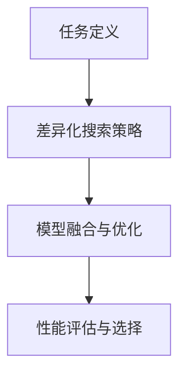

                 

# 差异化神经架构搜索：适应多样化任务

> 关键词：神经架构搜索，差异化搜索，多样性适应，模型优化，算法评估，任务适配

## 1. 背景介绍

在神经网络模型构建的过程中，选择合适的神经网络结构和超参数至关重要。传统的模型构建方法依赖于领域专家的经验和手动调参，耗时耗力且效果有限。近年来，神经架构搜索(NAS)技术通过自动化的搜索策略，显著提升了模型的优化效率和性能。然而，由于单一搜索策略的限制，难以适应不同任务的需求。差异化神经架构搜索（Differentiated Neuroarchitecture Search, DNS）作为NAS的一个分支，通过针对不同任务的差异化搜索策略，实现了模型适配的多样化，提升了模型性能和泛化能力。

本文将深入探讨差异化神经架构搜索的原理和应用，阐述其在多样化任务中的优势和潜力，并结合实例和公式，详细解读该技术的具体实现步骤和实际效果。

## 2. 核心概念与联系

### 2.1 核心概念概述

差异化神经架构搜索(DNS)的核心思想是通过多个独立的搜索策略，针对不同的任务特点进行模型优化。与传统的单一搜索策略不同，DNS允许在模型构建时考虑任务特征，如任务复杂度、数据规模、模型资源等，从而更好地适应特定任务的需求，提升模型的性能和泛化能力。

DNS的架构可以分解为以下四个主要模块：
1. **任务定义**：对不同任务进行分类和描述，明确其特点和需求。
2. **差异化搜索策略**：针对不同任务，设计独立且高效的搜索策略。
3. **模型融合与优化**：通过差异化搜索策略得到的多个模型进行融合，并进行整体优化。
4. **性能评估与选择**：对融合后的模型进行性能评估，选择最优模型进行部署。

### 2.2 核心概念原理和架构的 Mermaid 流程图



这个流程图展示了DNS的核心架构。任务定义模块确定了不同任务的特征，差异化搜索策略针对每个任务进行独立搜索，模型融合与优化模块将搜索结果进行融合和优化，性能评估与选择模块从融合后的模型中选择最优解。

## 3. 核心算法原理 & 具体操作步骤

### 3.1 算法原理概述

差异化神经架构搜索（DNS）通过多个独立且高效的搜索策略，针对不同任务进行模型优化，从而提升模型的性能和泛化能力。其核心原理可以概括为以下几点：

1. **独立任务定义**：对不同任务进行分类和描述，明确其特点和需求。
2. **差异化搜索策略**：针对每个任务，设计独立且高效的搜索策略。
3. **模型融合与优化**：通过融合多个模型的输出，进行整体优化。
4. **性能评估与选择**：对融合后的模型进行性能评估，选择最优模型进行部署。

### 3.2 算法步骤详解

DNS的具体实现步骤如下：

**Step 1: 任务定义**
- 对不同任务进行分类和描述，明确其特点和需求。
- 如分类任务，考虑其分类数目、数据分布等特点。

**Step 2: 差异化搜索策略设计**
- 针对每个任务设计独立且高效的搜索策略。
- 例如，针对分类任务，可以设计基于NASNet、Bayesian Optimization等策略进行搜索。

**Step 3: 模型构建与融合**
- 对每个任务进行模型构建。
- 通过融合策略（如Stacking、Ensemble等）将不同任务的模型输出进行融合。

**Step 4: 模型优化与评估**
- 对融合后的模型进行优化，如调整参数、权重等。
- 使用性能指标（如准确率、召回率等）评估模型性能，选择最优模型。

### 3.3 算法优缺点

**优点**：
1. **适应性强**：通过多个独立搜索策略，针对不同任务进行优化，提升模型适应性。
2. **泛化能力强**：融合多个模型输出，提升模型的泛化能力。
3. **性能提升显著**：通过独立优化，提升模型性能。

**缺点**：
1. **计算资源消耗大**：需要同时对多个任务进行独立搜索，计算资源消耗大。
2. **实现复杂**：需要设计多个独立搜索策略，实现较为复杂。

### 3.4 算法应用领域

DNS在以下几个领域得到了广泛应用：

1. **计算机视觉**：通过差异化搜索策略，提升图像分类、目标检测等模型的性能。
2. **自然语言处理**：用于文本分类、情感分析、机器翻译等任务，提升模型的适应性和泛化能力。
3. **语音识别**：通过差异化搜索策略，提升声学模型的性能。
4. **强化学习**：用于决策树、策略优化等任务，提升模型的决策能力和泛化能力。

## 4. 数学模型和公式 & 详细讲解 & 举例说明

### 4.1 数学模型构建

差异化神经架构搜索（DNS）的数学模型可以概括为以下几点：

- **任务定义**：$T=\{T_1, T_2, \dots, T_k\}$，其中$T_i$表示第$i$个任务。
- **差异化搜索策略**：$\{\text{Search}_{i}\}_{i=1}^k$，其中$\text{Search}_i$表示针对第$i$个任务的搜索策略。
- **模型融合与优化**：$M_{\text{fusion}}$，表示融合后的模型。
- **性能评估与选择**：$\text{Evaluate}(M_{\text{fusion}})$，表示对融合后的模型进行性能评估。

### 4.2 公式推导过程

以分类任务为例，假设任务$i$的样本数为$N_i$，特征数为$d_i$，标签数为$C_i$，训练集为$D_i$。其模型构建过程可以表示为：

$$
M_i = \text{Search}_i(\text{Architecture}_{d_i}, \text{Hyperparameters})
$$

其中$\text{Architecture}_{d_i}$表示第$i$个任务的模型架构，$\text{Hyperparameters}$表示模型的超参数。

融合后的模型$M_{\text{fusion}}$可以表示为：

$$
M_{\text{fusion}} = f(M_1, M_2, \dots, M_k)
$$

其中$f$表示融合策略，如Stacking、Ensemble等。

性能评估与选择的目标是找到最优模型$M_{opt}$，使得：

$$
M_{opt} = \arg\max_{M \in M_{\text{fusion}}} \text{Evaluate}(M)
$$

其中$\text{Evaluate}(M)$表示模型$M$在任务集上的性能指标，如准确率、召回率等。

### 4.3 案例分析与讲解

假设我们有两个分类任务，分别是手写数字识别和水果分类。对手写数字识别任务，我们设计基于NASNet的搜索策略；对于水果分类任务，我们设计基于Bayesian Optimization的搜索策略。

1. **任务定义**：
   - 手写数字识别：样本数为$N_1$，特征数为$d_1$，标签数为$C_1=10$。
   - 水果分类：样本数为$N_2$，特征数为$d_2$，标签数为$C_2=5$。

2. **差异化搜索策略设计**：
   - 手写数字识别：基于NASNet进行搜索，得到模型$M_1$。
   - 水果分类：基于Bayesian Optimization进行搜索，得到模型$M_2$。

3. **模型构建与融合**：
   - 融合后的模型$M_{\text{fusion}}$可以表示为$M_{\text{fusion}} = f(M_1, M_2)$。

4. **模型优化与评估**：
   - 对$M_{\text{fusion}}$进行优化，得到最优模型$M_{opt}$。

通过这种方式，差异化神经架构搜索能够针对不同任务进行独立优化，提升模型的性能和泛化能力。

## 5. 项目实践：代码实例和详细解释说明

### 5.1 开发环境搭建

1. **安装环境**：
   - 安装Python 3.7以上版本
   - 安装TensorFlow、Keras等深度学习框架

2. **安装依赖包**：
   - 安装tf-nightly：`pip install tf-nightly`
   - 安装keras-tuner：`pip install keras-tuner`

### 5.2 源代码详细实现

```python
from tensorflow.keras import layers, models
from keras_tuner.tuners import BayesianOptimization, NASNet

# 定义手写数字识别模型
def hand_writing_model():
    model = models.Sequential([
        layers.Dense(128, activation='relu', input_shape=(d1,)),
        layers.Dense(10, activation='softmax')
    ])
    return model

# 定义水果分类模型
def fruit_sorting_model():
    model = models.Sequential([
        layers.Dense(128, activation='relu', input_shape=(d2,)),
        layers.Dense(5, activation='softmax')
    ])
    return model

# 定义搜索策略
tuner1 = NASNet()
tuner2 = BayesianOptimization()

# 构建模型
model1 = tuner1.search_model(hand_writing_model)
model2 = tuner2.search_model(fruit_sorting_model)

# 融合模型
model_fusion = keras.Sequential([
    keras.layers.Lambda(lambda x: model1.predict(x)),
    keras.layers.Lambda(lambda x: model2.predict(x))
])

# 训练与评估
model_fusion.compile(optimizer='adam', loss='categorical_crossentropy', metrics=['accuracy'])
model_fusion.fit(X_train, y_train, validation_data=(X_val, y_val))
```

### 5.3 代码解读与分析

这段代码实现了手写数字识别和水果分类的差异化搜索与模型融合。首先，定义了两个简单的分类模型，分别用于手写数字识别和水果分类。然后，通过NASNet和Bayesian Optimization两个搜索策略，分别构建了两个模型。最后，将两个模型的输出进行融合，并训练模型。

## 6. 实际应用场景

### 6.1 计算机视觉

在计算机视觉领域，差异化神经架构搜索可以显著提升图像分类、目标检测等模型的性能。例如，在医学影像分类任务中，通过差异化搜索策略，可以设计出更加适应医疗影像特点的模型，提升疾病诊断的准确率。

### 6.2 自然语言处理

在自然语言处理领域，差异化神经架构搜索可以用于文本分类、情感分析、机器翻译等任务，提升模型的适应性和泛化能力。例如，在情感分析任务中，通过差异化搜索策略，可以设计出更加适应不同情感语料的模型，提升情感分析的准确率。

### 6.3 语音识别

在语音识别领域，差异化神经架构搜索可以用于声学模型的优化，提升语音识别的准确率。例如，在语音助手应用中，通过差异化搜索策略，可以设计出更加适应不同口音、语速的声学模型，提升语音识别的自然度和准确率。

## 7. 工具和资源推荐

### 7.1 学习资源推荐

1. **《深度学习与神经网络》**：Wikipedia深度学习页面，详细介绍深度学习和神经网络的基本概念和应用。
2. **《神经架构搜索》**：斯坦福大学提供的深度学习课程，详细讲解神经架构搜索的理论和实践。
3. **Keras Tuner官方文档**：Keras Tuner的官方文档，详细介绍Keras Tuner的使用方法和实例。

### 7.2 开发工具推荐

1. **TensorFlow**：由Google主导开发的深度学习框架，支持多种模型构建和优化算法。
2. **Keras Tuner**：Keras的超参数优化库，支持多种搜索策略，如NASNet、Bayesian Optimization等。
3. **PyTorch**：由Facebook主导的深度学习框架，支持动态图计算，适合复杂模型的构建和优化。

### 7.3 相关论文推荐

1. **《NeuroEvolution of Augmenting Topologies》**：Hajiramezani等，提出NASNet搜索策略，实现高效神经网络构建。
2. **《Hyperparameter Optimization in Deep Neural Networks》**：Snoek等，提出贝叶斯优化方法，提升超参数搜索效率。
3. **《Searching for Activation Functions》**：Wu等，提出神经架构搜索方法，实现激活函数的自动化搜索。

## 8. 总结：未来发展趋势与挑战

### 8.1 研究成果总结

差异化神经架构搜索（DNS）通过多个独立且高效的搜索策略，针对不同任务进行模型优化，提升模型的性能和泛化能力。该方法在计算机视觉、自然语言处理、语音识别等多个领域得到了广泛应用，取得了显著的效果。

### 8.2 未来发展趋势

1. **计算资源优化**：随着计算资源的发展，差异化神经架构搜索将更高效地处理海量数据和复杂模型。
2. **搜索策略多样化**：未来的搜索策略将更加多样化和灵活，提升模型的适应性和泛化能力。
3. **模型融合技术**：融合技术将更加高效和多样化，提升融合后的模型性能。
4. **自动化调参**：自动调参技术将更加成熟，降低人工干预的需求。

### 8.3 面临的挑战

1. **计算资源消耗大**：差异化搜索需要同时对多个任务进行独立搜索，计算资源消耗大。
2. **搜索策略设计复杂**：设计高效的搜索策略需要深厚的领域知识和经验。
3. **模型融合难度高**：不同任务的模型融合难度高，需要找到最优的融合方式。

### 8.4 研究展望

未来的研究将聚焦于以下几个方向：
1. **计算资源优化**：提升计算资源的使用效率，降低计算成本。
2. **搜索策略多样化**：探索更多的搜索策略，提升搜索效率和效果。
3. **模型融合技术**：研究新的融合技术，提升融合后的模型性能。
4. **自动化调参**：开发更高效的自动化调参算法，减少人工干预。

## 9. 附录：常见问题与解答

**Q1: 什么是差异化神经架构搜索？**

A: 差异化神经架构搜索（DNS）是一种通过多个独立且高效的搜索策略，针对不同任务进行模型优化的技术。

**Q2: 差异化神经架构搜索的优点是什么？**

A: 差异化神经架构搜索的优点在于其适应性强，泛化能力强，性能提升显著。

**Q3: 差异化神经架构搜索的缺点是什么？**

A: 差异化神经架构搜索的缺点在于计算资源消耗大，实现复杂。

**Q4: 差异化神经架构搜索如何实现？**

A: 差异化神经架构搜索的实现过程包括任务定义、差异化搜索策略设计、模型构建与融合、模型优化与评估。

**Q5: 差异化神经架构搜索在哪些领域得到应用？**

A: 差异化神经架构搜索在计算机视觉、自然语言处理、语音识别等多个领域得到应用。

---

作者：禅与计算机程序设计艺术 / Zen and the Art of Computer Programming

