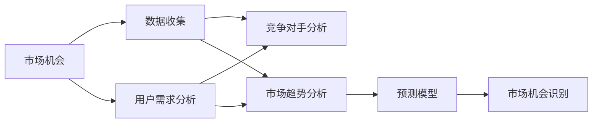

                 

# 市场机会识别：创业者的敏锐眼光

## 1. 背景介绍

在商业世界的瞬息万变中，创业者能否敏锐地识别出市场机会，直接决定了其创业项目的成败。市场机会识别不仅需要深厚的行业知识，更需要跨学科的智慧。近年来，人工智能技术的迅猛发展为市场机会识别带来了新的工具和方法，使得创业者能够更精确地洞察市场趋势，预测需求变化，制定有效的商业策略。本文将从人工智能技术的角度出发，探索如何利用数据科学和机器学习技术，提升市场机会识别的效率和准确性。

## 2. 核心概念与联系

### 2.1 核心概念概述

为更好地理解市场机会识别，首先需要定义几个关键概念：

- **市场机会**：指的是市场中尚未被充分满足的需求，或者存在改进潜力的现有产品或服务。市场机会的识别需要深入分析市场需求、用户痛点、行业趋势等多方面信息。
- **创业机会**：特指创业者可以利用的市场机会，通常伴随着新的商业模式、技术应用或产品创新的出现。
- **数据科学**：涉及数据收集、处理、分析等环节的科学方法，旨在从海量数据中提取有价值的信息，支持决策和预测。
- **机器学习**：通过算法让机器从数据中学习规律，做出预测或决策，广泛应用于自然语言处理、图像识别、推荐系统等领域。
- **市场预测**：利用数据和模型，对市场未来趋势和需求进行预测和评估，帮助企业制定战略。

这些概念之间存在紧密的联系，共同构成了市场机会识别的技术框架。通过整合数据科学和机器学习的技术，可以从复杂的市场环境中精准识别和抓住机会。

### 2.2 核心概念原理和架构的 Mermaid 流程图



这个流程图展示了市场机会识别的一般流程：

1. **数据收集**：获取市场相关的数据，包括用户反馈、销售数据、行业报告等。
2. **用户需求分析**：分析用户痛点和需求，找出市场中未被满足的部分。
3. **竞争对手分析**：研究竞争对手的产品和市场策略，找到差异化的空间。
4. **市场趋势分析**：通过分析市场数据，预测未来的需求变化和技术趋势。
5. **预测模型**：建立数据模型，根据历史数据和市场趋势预测未来的市场需求和机会。
6. **市场机会识别**：通过分析预测结果和用户需求，识别出潜在的市场机会。

## 3. 核心算法原理 & 具体操作步骤

### 3.1 算法原理概述

市场机会识别的核心算法原理主要基于以下两个方面：

1. **数据分析**：通过数据收集和处理，获取市场相关的高质量数据，为后续分析奠定基础。
2. **预测建模**：利用机器学习算法，建立预测模型，分析市场趋势和用户需求，从而识别市场机会。

### 3.2 算法步骤详解

市场机会识别一般包括以下关键步骤：

**Step 1: 数据收集和预处理**

- **数据源**：收集市场相关的数据，如销售数据、用户反馈、行业报告、新闻资讯等。
- **数据清洗**：对数据进行去重、去噪、格式转换等预处理，确保数据的质量。

**Step 2: 用户需求分析**

- **需求挖掘**：通过文本分析、情感分析等技术，挖掘用户对现有产品或服务的评价和需求。
- **需求分类**：将用户需求进行分类，找出共性和差异，识别未被满足的需求。

**Step 3: 竞争对手分析**

- **产品比较**：收集竞争对手的产品信息，进行功能和性能上的对比分析。
- **市场策略分析**：分析竞争对手的市场定位、定价策略、营销手段等，找出竞争优势和劣势。

**Step 4: 市场趋势分析**

- **时间序列分析**：对市场数据进行时间序列分析，预测市场趋势。
- **多维度分析**：利用多维数据分析技术，如聚类、关联规则等，发现潜在的市场变化和规律。

**Step 5: 预测模型建立**

- **特征工程**：根据分析结果，提取关键特征，用于模型训练。
- **模型选择**：选择合适的预测模型，如线性回归、决策树、随机森林、神经网络等。
- **模型训练**：利用历史数据训练模型，优化模型参数。
- **模型评估**：通过交叉验证、误差分析等方法，评估模型性能。

**Step 6: 市场机会识别**

- **机会评估**：根据预测结果和用户需求分析，评估潜在的市场机会。
- **机会筛选**：通过ROI、市场规模、竞争程度等多维度指标，筛选最有潜力的市场机会。

### 3.3 算法优缺点

基于数据分析和预测建模的市场机会识别方法具有以下优点：

1. **客观性**：数据驱动的分析方法比主观判断更客观，避免了人为偏差。
2. **全面性**：能够从多角度分析市场数据，发现更深层次的市场机会。
3. **效率高**：机器学习算法可以快速处理和分析大量数据，缩短市场分析的时间。

同时，该方法也存在一些局限性：

1. **数据依赖性**：数据质量和数量直接影响分析结果的准确性。
2. **模型复杂性**：复杂的预测模型需要更多的计算资源和专业知识。
3. **动态性不足**：预测模型通常无法实时反映市场动态变化。
4. **依赖于历史数据**：预测模型的有效性依赖于历史数据的准确性和代表性。

### 3.4 算法应用领域

市场机会识别算法在多个领域得到了广泛应用，包括但不限于：

- **电子商务**：识别新产品需求、优化商品陈列、制定促销策略。
- **金融投资**：预测股票市场趋势、识别投资机会、进行风险评估。
- **健康医疗**：分析疾病流行趋势、识别新药开发机会、优化医疗资源配置。
- **教育培训**：识别市场需求、开发新产品、优化课程设计。
- **物流运输**：预测运输需求、优化路线规划、提升配送效率。

## 4. 数学模型和公式 & 详细讲解 & 举例说明

### 4.1 数学模型构建

市场机会识别算法通常涉及以下数学模型：

- **回归模型**：如线性回归、逻辑回归、支持向量机等，用于预测市场趋势和用户需求。
- **分类模型**：如决策树、随机森林、神经网络等，用于识别市场机会和用户需求分类。
- **聚类分析**：如K-means、层次聚类等，用于发现市场中的不同用户群体和需求模式。
- **关联规则**：如Apriori算法、FP-growth算法等，用于发现市场数据中的相关性规则和趋势。

### 4.2 公式推导过程

以线性回归模型为例，推导市场趋势预测的公式：

设市场数据 $y$ 与时间 $t$ 的关系为线性模型：

$$
y = \beta_0 + \beta_1 t + \epsilon
$$

其中 $\beta_0$ 和 $\beta_1$ 为模型的截距和斜率，$\epsilon$ 为随机误差。根据最小二乘法，可以通过历史数据估计 $\beta_0$ 和 $\beta_1$：

$$
\hat{\beta}_1 = \frac{\sum_{i=1}^n (x_i - \bar{x})(y_i - \bar{y})}{\sum_{i=1}^n (x_i - \bar{x})^2}
$$

$$
\hat{\beta}_0 = \bar{y} - \hat{\beta}_1 \bar{x}
$$

其中 $\bar{x}$ 和 $\bar{y}$ 分别为时间 $t$ 和市场数据 $y$ 的均值。

### 4.3 案例分析与讲解

假设某电商公司想预测下季度手机销量，收集了过去5年的销售数据和季节性因素。通过建立线性回归模型，可以得到以下公式：

$$
y = \beta_0 + \beta_1 t + \epsilon
$$

其中 $\beta_0$ 和 $\beta_1$ 可通过最小二乘法求解。根据模型预测，公司可以提前制定促销策略，优化库存管理。

## 5. 项目实践：代码实例和详细解释说明

### 5.1 开发环境搭建

在进行市场机会识别项目实践时，需要搭建以下开发环境：

1. 安装Python：Python是市场分析中常用的编程语言，提供了丰富的数据处理和分析库。
2. 安装Pandas、NumPy等库：这些库提供了高效的数据处理和数值计算功能，是数据分析的基石。
3. 安装Scikit-learn、TensorFlow等机器学习库：用于构建和训练预测模型。
4. 安装Jupyter Notebook：这是一个交互式的开发环境，方便进行代码调试和结果展示。

### 5.2 源代码详细实现

以下是一个简单的市场机会识别项目代码实现，通过线性回归模型预测未来市场趋势：

```python
import pandas as pd
from sklearn.linear_model import LinearRegression

# 读取数据
data = pd.read_csv('sales_data.csv')

# 数据清洗
data = data.dropna()

# 特征工程
X = data[['time', 'promotion', 'temperature']]
y = data['sales']

# 模型训练
model = LinearRegression()
model.fit(X, y)

# 预测未来数据
future_data = pd.DataFrame({
    'time': [next_time],
    'promotion': [next_promotion],
    'temperature': [next_temperature]
})
future_data = future_data.dropna()
y_pred = model.predict(future_data)

print(y_pred)
```

### 5.3 代码解读与分析

代码中，首先使用Pandas库读取数据集，并进行基本的数据清洗。然后，进行特征工程，提取时间、促销和温度等关键特征，构建输入变量 $X$ 和输出变量 $y$。接着，使用Scikit-learn库中的线性回归模型进行训练，并用未来数据进行预测。

需要注意的是，实际项目中，数据预处理和特征工程是至关重要的步骤，需要根据具体情况进行优化。例如，可以采用时间序列分析、缺失值处理、异常值检测等方法，提高数据的质量和模型的准确性。

### 5.4 运行结果展示

运行上述代码，可以得到未来市场的预测结果。例如，输出预测销售额的列表，供公司进行决策。

## 6. 实际应用场景

### 6.1 电子商务

在电子商务领域，市场机会识别可以用于以下几个方面：

- **新产品开发**：通过分析用户需求和市场趋势，发现潜在的产品创新点。
- **库存管理**：根据历史销售数据和预测模型，优化库存水平，减少缺货或库存积压。
- **个性化推荐**：利用用户行为数据和市场预测，提供个性化的商品推荐，提高用户体验和转化率。

### 6.2 金融投资

金融领域中，市场机会识别可以用于以下几个方面：

- **股票预测**：通过分析历史股价和市场数据，预测未来股价走势，指导投资决策。
- **风险评估**：识别市场中的高风险资产，制定合理的风险控制策略。
- **市场趋势分析**：分析行业和宏观经济数据，发现潜在的投资机会。

### 6.3 健康医疗

健康医疗领域中，市场机会识别可以用于以下几个方面：

- **疾病预测**：通过分析健康数据和市场趋势，预测疾病的流行趋势，制定预防措施。
- **新药开发**：根据市场需求和用户反馈，识别新药开发的机会。
- **医疗资源优化**：分析医疗资源分布和需求，优化资源配置，提高医疗服务效率。

### 6.4 未来应用展望

未来，随着人工智能技术的进一步发展，市场机会识别将变得更加智能化和高效。以下是我们对未来发展趋势的展望：

1. **自动化分析**：机器学习和自然语言处理技术的结合，可以自动分析大量市场数据，提供更深入的市场洞察。
2. **实时预测**：利用在线数据流和实时计算技术，实现市场趋势的实时预测和动态调整。
3. **多模态分析**：结合多模态数据（如文本、图像、视频等），提升市场机会识别的全面性和准确性。
4. **跨领域应用**：市场机会识别的技术将在更多领域得到应用，如智能制造、智慧城市等。
5. **用户参与**：引入用户反馈和参与，优化预测模型和分析结果。

## 7. 工具和资源推荐

### 7.1 学习资源推荐

1. **《Python数据科学手册》**：这本书系统介绍了Python在数据科学中的应用，是学习市场分析的重要参考。
2. **Coursera《机器学习》课程**：由斯坦福大学教授Andrew Ng主讲，涵盖机器学习的基本概念和算法。
3. **Kaggle竞赛平台**：提供大量的市场分析竞赛数据集和社区交流，适合实战练习。
4. **arXiv预印本**：跟踪最新的市场分析研究成果，了解前沿技术和方法。
5. **DataCamp**：提供数据科学和机器学习的在线课程，适合自学和提升。

### 7.2 开发工具推荐

1. **Jupyter Notebook**：交互式的开发环境，方便代码调试和结果展示。
2. **Google Colab**：免费的云开发环境，支持GPU计算和代码分享。
3. **TensorBoard**：可视化工具，实时监测模型训练和性能。
4. **scikit-learn**：Python的机器学习库，提供丰富的模型和工具。
5. **PyTorch**：深度学习框架，支持动态计算图和分布式训练。

### 7.3 相关论文推荐

1. **《神经网络与深度学习》**：由Michael Nielsen撰写，详细介绍了神经网络和深度学习的基本原理和应用。
2. **《机器学习实战》**：Peter Harrington撰写的实战教程，适合初学者上手。
3. **《深度学习》**：Ian Goodfellow等撰写的深度学习经典教材，全面介绍了深度学习的基本理论和应用。
4. **《Python机器学习》**：Sebastian Raschka撰写，介绍了Python在机器学习中的应用。

## 8. 总结：未来发展趋势与挑战

### 8.1 总结

本文对市场机会识别的方法进行了全面系统的介绍。从数据收集、用户需求分析、竞争对手分析、市场趋势分析到预测建模和机会识别，详细阐述了市场机会识别的全流程。通过整合数据科学和机器学习技术，创业者可以更加准确地识别市场机会，制定有效的商业策略。

### 8.2 未来发展趋势

展望未来，市场机会识别的技术将呈现以下几个趋势：

1. **自动化和智能化**：随着AI技术的进步，市场分析将更加自动化和智能化，减少人工干预。
2. **实时化和大数据**：实时数据流和海量数据处理技术的应用，将使市场预测更加及时和准确。
3. **跨领域应用**：市场机会识别技术将在更多领域得到应用，推动各行业的数字化转型。
4. **多模态分析**：结合多模态数据，提升市场机会识别的全面性和准确性。
5. **用户参与**：引入用户反馈和参与，优化预测模型和分析结果。

### 8.3 面临的挑战

尽管市场机会识别技术已经取得了显著进展，但仍然面临一些挑战：

1. **数据质量**：数据收集和预处理的难度较大，数据质量直接影响分析结果。
2. **模型复杂性**：构建高精度的预测模型需要复杂的算法和大量的计算资源。
3. **动态变化**：市场环境瞬息万变，模型需要持续更新以保持准确性。
4. **可解释性**：模型的决策过程和输出结果需要具备可解释性，以便于理解和信任。
5. **伦理和隐私**：市场分析过程中涉及大量个人数据，需要关注伦理和隐私保护。

### 8.4 研究展望

未来，市场机会识别的研究应在以下几个方面寻求突破：

1. **数据收集和处理**：开发更高效的数据收集和处理工具，降低数据获取和预处理的难度。
2. **模型简化和优化**：研究更简单高效的模型和算法，降低计算资源的消耗。
3. **实时化和自动化**：开发实时化的市场分析工具，提高预测的及时性和准确性。
4. **多模态融合**：研究多模态数据融合技术，提升市场机会识别的全面性和准确性。
5. **可解释性和透明度**：开发更透明和可解释的模型，提高用户对分析结果的信任。

## 9. 附录：常见问题与解答

**Q1：市场机会识别是否适用于所有行业？**

A: 市场机会识别方法对大多数行业都有应用价值，尤其是在需要大量数据分析和预测的领域，如金融、电子商务、健康医疗等。对于数据量较小或数据结构复杂的行业，可能需要结合人工经验和专业知识，进行更深入的市场分析。

**Q2：如何选择合适的市场预测模型？**

A: 选择合适的市场预测模型需要考虑数据类型、预测目标和模型复杂度等因素。一般来说，可以从小规模模型（如线性回归、决策树）逐步过渡到大规模模型（如神经网络、深度学习），根据模型性能和计算资源进行优化。

**Q3：如何提高市场机会识别的准确性？**

A: 提高市场机会识别的准确性需要综合考虑多个因素：

1. 数据质量：确保数据收集和处理的质量，减少噪音和缺失值。
2. 特征工程：合理选择和提取特征，提升模型的表现。
3. 模型优化：通过交叉验证、调参等方法，优化模型参数和性能。
4. 多模态分析：结合多模态数据，提升市场机会识别的全面性和准确性。

**Q4：市场机会识别中的数据隐私问题如何处理？**

A: 市场机会识别过程中涉及大量个人数据，需要重视数据隐私和安全问题。可以采用数据脱敏、匿名化处理等方法，保护用户隐私。同时，建立严格的访问控制机制，确保数据的合法使用。

**Q5：市场机会识别中的模型可解释性如何保证？**

A: 模型可解释性是市场机会识别的重要考虑因素，可以采用以下方法：

1. 可视化分析：使用可视化工具展示模型的特征重要性和决策路径。
2. 简化的模型：构建简化的模型，降低复杂性，提高可解释性。
3. 用户反馈：引入用户反馈，优化模型的决策过程和输出结果。

总之，市场机会识别需要综合考虑数据质量、模型选择、用户参与等多方面因素，才能实现准确的市场分析。随着技术的进步，市场机会识别将变得更加自动化和智能化，为创业者提供更多的商业机遇。

