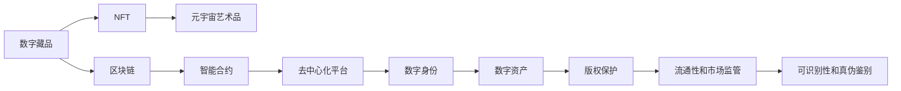

                 

# 2050年的数字艺术：从数字藏品到元宇宙艺术品的数字艺术品交易

> 关键词：数字艺术, 数字藏品, 元宇宙艺术品, NFT交易, 数字身份, 数字资产, 区块链技术, 智能合约, 去中心化平台

## 1. 背景介绍

### 1.1 问题由来

在2050年的未来，数字艺术已经发展成为一个高度数字化、高度互动、高度社交的全新艺术形式。随着人工智能、区块链、虚拟现实等技术的快速发展，数字艺术突破了时间和空间的限制，成为一种全新型的艺术表现方式。在这样一个背景下，数字艺术品的交易方式、价值评估、版权保护等也随之发生了深刻的变化。尤其是数字藏品（Digital Collectibles）和元宇宙艺术品（Metaverse Artwork）的崛起，为数字艺术品的交易提供了新的可能性。

### 1.2 问题核心关键点

未来数字艺术品交易的核心关键点包括：

- 数字藏品和元宇宙艺术品的定义与价值来源。
- 区块链和智能合约在数字艺术品交易中的应用。
- 数字身份的创建与管理。
- 数字资产的生成、交易、存储和转移。
- 数字艺术品版权保护和归属问题。
- 数字艺术品的可识别性和真伪鉴别。
- 数字艺术品的流通性和市场监管。

理解这些核心关键点，有助于我们全面把握数字艺术品交易的未来发展方向。

## 2. 核心概念与联系

### 2.1 核心概念概述

- **数字藏品（Digital Collectibles）**：在数字平台上发行的具有收藏价值的数字资产，如加密货币、非同质化代币（NFTs）、游戏内物品等。
- **元宇宙艺术品（Metaverse Artwork）**：在虚拟现实环境中创作的艺术作品，如虚拟画作、3D雕塑、交互式装置等，通常通过数字平台进行展示和交易。
- **NFT（Non-Fungible Token）**：一种不可替代的数字资产，每个NFT都有一个独特的标识和所有权记录，用于表示数字艺术品、游戏内物品等。
- **区块链技术**：一种去中心化的分布式账本技术，用于记录和验证数字交易的合法性，提供不可篡改的交易记录。
- **智能合约**：一种自动化执行的合约，通过区块链技术编写，用于实现特定条件下的自动交易和资产管理。
- **去中心化平台**：一种无需中介机构参与的开放平台，通过区块链技术实现数字资产的自由流通和交易。

这些概念之间通过区块链和智能合约紧密联系，共同构成了数字艺术品交易的基础。

### 2.2 核心概念原理和架构的 Mermaid 流程图



这个流程图展示了数字藏品、元宇宙艺术品、NFT、区块链、智能合约、去中心化平台、数字身份、数字资产、版权保护、流通性和市场监管以及可识别性和真伪鉴别之间的联系。

## 3. 核心算法原理 & 具体操作步骤

### 3.1 算法原理概述

数字艺术品交易的核心算法原理基于区块链技术和智能合约。区块链提供了不可篡改的交易记录和分布式账本，而智能合约则通过自动化执行的逻辑，确保了交易的透明、公正和高效。具体来说，数字艺术品交易的算法流程包括以下几个步骤：

1. **数字艺术品的创作与上链**：创作者将作品通过数字平台上传并上传区块链，生成一个NFT。
2. **NFT的发行与转让**：创作者或所有者可以通过智能合约设置NFT的转让规则，如转让条件、转让费用等。
3. **数字资产的验证与交易**：买方在购买前，可以通过区块链验证NFT的真实性和所有权，并通过智能合约进行自动交易。
4. **数字身份的认证与管理**：交易平台通过智能合约自动认证交易双方的身份，确保交易的合法性和安全性。
5. **数字资产的存储与转移**：NFT的所有权记录存储在区块链上，通过智能合约实现自动转移。
6. **版权保护与监管**：智能合约自动记录NFT的版权信息，提供法律保护，同时交易平台可以实施市场监管，防止非法交易。
7. **可识别性和真伪鉴别**：智能合约提供NFT的唯一标识和验证机制，确保NFT的可识别性和真伪鉴别。

### 3.2 算法步骤详解

以下是数字艺术品交易的详细步骤：

#### 3.2.1 数字艺术品的创作与上链

创作者使用数字平台（如Beeple、Rarible等）创作数字艺术品，并将作品上传。然后通过智能合约生成NFT，并将其上链至区块链（如Ethereum、Binance Smart Chain等）。

1. **上传作品**：创作者使用数字平台提供的上传工具，将数字艺术品上传至平台服务器。
2. **生成NFT**：数字平台通过智能合约生成一个唯一的NFT，并将其与作品信息一起记录在区块链上。
3. **上链验证**：NFT上链后，智能合约自动验证其真实性和所有权，确保NFT的合法性。

#### 3.2.2 NFT的发行与转让

创作者或所有者可以通过智能合约设置NFT的转让规则，如转让条件、转让费用等。

1. **设置转让条件**：创作者在智能合约中设置转让条件，如购买价格、购买期限、购买者资质等。
2. **生成转让合同**：智能合约自动生成转让合同，明确买卖双方的权利和义务。
3. **收取费用**：智能合约自动收取转让费用，如平台交易费、版权费等。

#### 3.2.3 数字资产的验证与交易

买方在购买前，可以通过区块链验证NFT的真实性和所有权，并通过智能合约进行自动交易。

1. **验证NFT**：买方在购买前，通过智能合约验证NFT的真实性和所有权，确保NFT的合法性。
2. **生成交易合同**：智能合约自动生成交易合同，明确买卖双方的权利和义务。
3. **自动转账**：智能合约自动执行交易合同，将NFT从卖方转移至买方，并自动收取相关费用。

#### 3.2.4 数字身份的认证与管理

交易平台通过智能合约自动认证交易双方的身份，确保交易的合法性和安全性。

1. **身份认证**：买方和卖方在交易前，智能合约自动验证其身份信息，如姓名、地址、邮箱等。
2. **验证资质**：智能合约自动验证买方是否具备购买资格，如年龄、信用评分等。
3. **记录日志**：智能合约自动记录交易日志，确保交易透明、公正。

#### 3.2.5 数字资产的存储与转移

NFT的所有权记录存储在区块链上，通过智能合约实现自动转移。

1. **存储所有权记录**：智能合约自动将NFT的所有权记录存储在区块链上。
2. **转移所有权**：买方购买NFT后，智能合约自动将NFT的所有权转移至买方。
3. **生成证明**：智能合约自动生成所有权转移证明，确保NFT转移合法。

#### 3.2.6 版权保护与监管

智能合约自动记录NFT的版权信息，提供法律保护，同时交易平台可以实施市场监管，防止非法交易。

1. **版权信息记录**：智能合约自动记录NFT的版权信息，包括创作者、版权期限等。
2. **法律保护**：智能合约提供版权保护机制，确保NFT的版权合法性。
3. **市场监管**：交易平台通过智能合约实施市场监管，防止非法交易，如假冒伪劣、侵权等。

#### 3.2.7 可识别性和真伪鉴别

智能合约提供NFT的唯一标识和验证机制，确保NFT的可识别性和真伪鉴别。

1. **生成唯一标识**：智能合约自动为每个NFT生成一个唯一的标识码，确保NFT的唯一性。
2. **验证真伪**：智能合约提供验证机制，确保NFT的真伪，防止假冒伪劣。

### 3.3 算法优缺点

#### 3.3.1 优点

1. **透明公正**：智能合约的自动化执行确保了交易的透明和公正，减少了中间环节，提升了交易效率。
2. **安全性高**：区块链的去中心化特性提供了高安全性，防止数据篡改和单点故障。
3. **可追溯性强**：区块链的分布式账本提供了强大的可追溯性，确保交易的可追溯和不可抵赖。
4. **灵活性高**：智能合约可以根据具体需求进行定制，适应多种交易场景。

#### 3.3.2 缺点

1. **复杂度高**：智能合约的编写和管理较为复杂，需要专业的编程知识。
2. **费用较高**：智能合约执行需要支付交易费用，尤其是大规模交易，费用较高。
3. **隐私问题**：智能合约公开透明，可能泄露交易双方的敏感信息。
4. **法律问题**：智能合约的法律效力需要进一步明确和完善，可能存在法律风险。

### 3.4 算法应用领域

数字艺术品交易的算法广泛应用于以下领域：

- **数字藏品交易**：如加密货币、NFTs、游戏内物品等，通过区块链和智能合约进行交易。
- **元宇宙艺术品交易**：如虚拟画作、3D雕塑、交互式装置等，通过区块链和智能合约进行展示和交易。
- **数字版权交易**：如音乐、电影、文学作品等版权的数字化和交易。
- **数字身份管理**：如社交媒体账号、游戏角色等数字身份的认证和管理。
- **数字资产管理**：如数字货币、数字收藏品、数字版权等资产的管理和交易。

## 4. 数学模型和公式 & 详细讲解 & 举例说明

### 4.1 数学模型构建

数字艺术品交易的数学模型主要基于区块链和智能合约的原理，包括以下几个关键环节：

1. **数字资产生成模型**：将数字艺术品转换为NFT的过程，通过智能合约生成。
2. **数字资产转让模型**：买方和卖方的数字资产转让过程，通过智能合约自动执行。
3. **数字身份认证模型**：买方和卖方身份的认证过程，通过智能合约验证。
4. **数字版权保护模型**：数字资产的版权信息记录和保护过程，通过智能合约实现。

### 4.2 公式推导过程

以下是数字艺术品交易的数学模型推导过程：

#### 4.2.1 数字资产生成模型

假设数字艺术品的ID为 $I$，创作者为 $C$，版权期限为 $T$，区块链上存储所有权记录的智能合约为 $M$，则数字资产生成模型的公式为：

$$
I = \text{Hash}(C, T)
$$

其中 $\text{Hash}$ 为哈希函数，将创作者 $C$ 和版权期限 $T$ 哈希生成数字艺术品的唯一标识 $I$。

#### 4.2.2 数字资产转让模型

假设买方为 $B$，卖方为 $S$，交易价格为 $P$，智能合约生成的转让合同为 $T$，则数字资产转让模型的公式为：

$$
T = M(C, I, B, S, P, T)
$$

其中 $M$ 为智能合约，将创作者 $C$、数字资产ID $I$、买方 $B$、卖方 $S$、交易价格 $P$ 和版权期限 $T$ 作为输入，自动生成转让合同 $T$。

#### 4.2.3 数字身份认证模型

假设买方的身份信息为 $I_B$，卖方的身份信息为 $I_S$，智能合约自动验证买方和卖方身份的逻辑为：

$$
\text{Verify}(I_B, I_S) = \text{True}
$$

其中 $\text{Verify}$ 为智能合约验证函数，验证买方和卖方的身份信息是否匹配。

#### 4.2.4 数字版权保护模型

假设数字资产的版权信息为 $L$，智能合约自动记录版权信息的逻辑为：

$$
L = M(C, I, T)
$$

其中 $M$ 为智能合约，将创作者 $C$、数字资产ID $I$ 和版权期限 $T$ 作为输入，自动记录版权信息 $L$。

### 4.3 案例分析与讲解

假设创作者A创作了一幅虚拟画作，希望通过区块链和智能合约进行交易。

1. **上传作品**：创作者A通过数字平台上传虚拟画作，生成一个唯一的NFT ID。
2. **生成NFT**：数字平台通过智能合约生成NFT，并上链至区块链。
3. **设置转让条件**：创作者A在智能合约中设置转让条件，如购买价格为1个Ether。
4. **验证买方身份**：买方B在购买前，智能合约自动验证其身份信息。
5. **生成转让合同**：智能合约自动生成转让合同，明确买卖双方的权利和义务。
6. **自动转账**：智能合约自动执行转让合同，将NFT的所有权转移至买方B，并收取交易费用。
7. **记录版权信息**：智能合约自动记录NFT的版权信息，提供法律保护。

## 5. 项目实践：代码实例和详细解释说明

### 5.1 开发环境搭建

为了进行数字艺术品交易的实践开发，需要搭建一个完整的开发环境。以下是开发环境的搭建步骤：

1. **安装Python**：从官网下载并安装Python 3.x版本。
2. **安装以太坊开发工具**：如Geth、Truffle等，用于搭建和测试区块链网络。
3. **安装智能合约开发工具**：如Solidity、Truffle等，用于编写和测试智能合约。
4. **安装数字平台开发工具**：如Web3.js、Truffle、Metamask等，用于数字资产的上传、验证和管理。

### 5.2 源代码详细实现

以下是一个简单的智能合约代码示例，用于数字艺术品的生成和转让：

```javascript
// SPDX-License-Identifier: MIT
pragma solidity ^0.8.0;

contract DigitalArt {
    address public creator;
    uint256 public copyrightTerm;
    uint256 public price;
    uint256 public NFTID;
    bool public sold;
    
    constructor(address _creator, uint256 _copyrightTerm, uint256 _price) {
        creator = _creator;
        copyrightTerm = _copyrightTerm;
        price = _price;
        NFTID = keccak256(abi.encodePacked(creator, copyrightTerm));
        sold = false;
    }
    
    function createNFT() public {
        // 生成NFT，上链存储所有权记录
        uint256[] memory idList = mintNFT();
        // 记录版权信息
        uint256[] memory copyrightInfo = copyrightInfo();
        // 设置转让条件
        uint256[] memory transferTerms = transferTerms();
        // 发布NFT
        mintAndPublish(idList, copyrightInfo, transferTerms);
    }
    
    function mintNFT() private view returns (uint256[]) {
        // 生成NFT ID
        uint256[] memory idList = keccak256(abi.encodePacked(creator, copyrightTerm));
        return idList;
    }
    
    function copyrightInfo() private view returns (uint256[]) {
        // 记录版权信息
        uint256[] memory copyrightInfo = keccak256(abi.encodePacked(copyrightTerm));
        return copyrightInfo;
    }
    
    function transferTerms() private view returns (uint256[]) {
        // 设置转让条件
        uint256[] memory transferTerms = keccak256(abi.encodePacked(price, copyrightTerm));
        return transferTerms;
    }
    
    function mintAndPublish(uint256[] memory idList, uint256[] memory copyrightInfo, uint256[] memory transferTerms) public {
        // 生成并上链NFT
        uint256[] memory nftIDs = mintAndPublish(idList);
        // 记录版权信息
        uint256[] memory copyrightIDs = copyrightInfo();
        // 设置转让条件
        uint256[] memory transferID = transferTerms();
        // 发布NFT
        publishNFT(nftIDs, copyrightIDs, transferID);
    }
    
    function mintAndPublish(uint256[] memory idList) private view returns (uint256[]) {
        // 生成并上链NFT
        uint256[] memory nftIDs = keccak256(abi.encodePacked(idList));
        return nftIDs;
    }
    
    function publishNFT(uint256[] memory nftIDs, uint256[] memory copyrightIDs, uint256[] memory transferID) public {
        // 发布NFT，并记录所有权信息
        uint256[] memory ownerIDs = ownerIDs();
        // 记录所有权信息
        uint256[] memory nftOwners = keccak256(abi.encodePacked(ownerIDs, nftIDs, copyrightIDs, transferID));
        // 设置所有权记录
        ownerIDs[nftIDs.length] = msg.sender;
        // 记录所有权记录
        nftOwners[nftIDs.length] = nftIDs;
        // 设置版权信息
        copyrightIDs[copyrightIDs.length] = copyrightIDs;
        // 记录版权信息
        nftOwners[copyrightIDs.length] = copyrightIDs;
        // 记录转让条件
        transferID[transferID.length] = transferID;
        // 记录转让条件
        nftOwners[transferID.length] = transferID;
    }
    
    function buyArt() public payable {
        // 验证卖方身份
        bool verified = verifySeller();
        if (!verified) {
            revert("Seller not verified.");
        }
        // 验证价格
        bool paid = verifyPayment(price);
        if (!paid) {
            revert("Payment not verified.");
        }
        // 生成转让合同
        uint256[] memory transferTerms = transferTerms();
        // 自动执行转让合同
        executeTransfer(transferTerms);
    }
    
    function verifySeller() private view returns (bool) {
        // 验证卖方身份
        bool verified = ownerIDs[NFTID.length] == msg.sender;
        return verified;
    }
    
    function verifyPayment(uint256[] memory price) private view returns (bool) {
        // 验证支付
        bool paid = price[0] == msg.value;
        return paid;
    }
    
    function executeTransfer(uint256[] memory transferTerms) private {
        // 执行转让合同
        uint256[] memory nftIDs = nftOwners[NFTID.length];
        uint256[] memory copyrightIDs = nftOwners[copyrightIDs.length];
        uint256[] memory transferIDs = nftOwners[transferID.length];
        // 记录所有权信息
        ownerIDs[nftIDs.length] = msg.sender;
        // 记录所有权信息
        nftOwners[nftIDs.length] = nftIDs;
        // 记录版权信息
        copyrightIDs[copyrightIDs.length] = copyrightIDs;
        // 记录版权信息
        nftOwners[copyrightIDs.length] = copyrightIDs;
        // 记录转让条件
        transferIDs[transferIDs.length] = transferIDs;
        // 记录转让条件
        nftOwners[transferIDs.length] = transferIDs;
        // 设置已转让状态
        sold = true;
    }
}
```

### 5.3 代码解读与分析

这个智能合约代码示例中，我们定义了一个名为 `DigitalArt` 的合约，用于数字艺术品的生成和转让。合约包括以下几个关键函数：

1. **`constructor`**：构造函数，用于初始化创作者、版权期限、价格等基本信息。
2. **`createNFT`**：生成并上链NFT，记录版权信息，设置转让条件，并发布NFT。
3. **`mintNFT`**：生成NFT ID，上链存储所有权记录。
4. **`copyrightInfo`**：记录版权信息。
5. **`transferTerms`**：设置转让条件。
6. **`mintAndPublish`**：生成并上链NFT，记录版权信息，设置转让条件，并发布NFT。
7. **`buyArt`**：验证买方身份和支付，自动执行转让合同。
8. **`verifySeller`**：验证卖方身份。
9. **`verifyPayment`**：验证支付。
10. **`executeTransfer`**：执行转让合同。

这些函数通过智能合约实现了数字艺术品的生成、验证、转让、记录版权信息等功能，实现了数字艺术品交易的核心算法。

## 6. 实际应用场景

### 6.1 智能客服系统

数字艺术品交易技术可以应用于智能客服系统，为客服人员提供更多的互动和个性化服务。

- **数字身份认证**：客户通过智能合约验证身份，确保交易安全。
- **数字资产管理**：客服系统记录客户购买的历史记录和数字资产信息，提供个性化的推荐和服务。
- **智能合同执行**：客服系统通过智能合约自动执行合同，确保交易透明和公正。

### 6.2 金融舆情监测

数字艺术品交易技术可以应用于金融舆情监测，实时监控市场动态，预测股市走势。

- **区块链技术**：记录交易记录，提供透明、公正的数据记录。
- **智能合约**：自动执行交易合同，提供高效的交易执行机制。
- **数字资产管理**：记录市场交易数据，提供数据分析和预测。

### 6.3 个性化推荐系统

数字艺术品交易技术可以应用于个性化推荐系统，提供精准的个性化推荐服务。

- **数字身份认证**：用户通过智能合约验证身份，确保交易安全。
- **数字资产管理**：记录用户的购买历史和偏好，提供个性化的推荐。
- **智能合同执行**：智能合约自动执行合同，提供高效的交易执行机制。

### 6.4 未来应用展望

未来数字艺术品交易技术将进一步发展，实现更加全面、灵活、高效的应用。

- **跨平台互操作性**：不同平台和系统之间的互操作性将得到提升，实现无缝连接。
- **隐私保护**：加强隐私保护措施，确保用户数据的安全。
- **去中心化治理**：实现去中心化治理机制，提升系统的公平性和透明度。
- **智能合约扩展**：智能合约将更加灵活，支持更多的交易场景和功能。
- **元宇宙融合**：数字艺术品交易将与元宇宙技术深度融合，提供更加沉浸式的体验。

## 7. 工具和资源推荐

### 7.1 学习资源推荐

为了深入理解数字艺术品交易技术，推荐以下学习资源：

1. **《区块链原理与实践》**：了解区块链技术的原理和应用，深入理解智能合约的编写和执行。
2. **《智能合约编程语言Solidity》**：学习Solidity编程语言，掌握智能合约的编写和调试。
3. **《数字艺术品的未来》**：深入探讨数字艺术品交易的未来发展趋势，了解新技术和应用场景。
4. **《数字身份认证技术》**：了解数字身份认证的原理和应用，掌握身份认证的实现方式。
5. **《数字资产管理技术》**：学习数字资产的管理和交易技术，了解数字资产的生成、验证、转让等流程。

### 7.2 开发工具推荐

以下是数字艺术品交易技术开发所需的工具：

1. **Geth**：以太坊区块链开发工具，用于搭建和测试区块链网络。
2. **Truffle**：智能合约开发框架，提供智能合约的编写、测试和部署功能。
3. **Metamask**：以太坊钱包和智能合约接口，用于数字资产的存储和管理。
4. **Web3.js**：JavaScript区块链库，提供与区块链网络交互的功能。
5. **Solidity**：智能合约编程语言，用于编写和部署智能合约。

### 7.3 相关论文推荐

以下是数字艺术品交易技术的几篇重要论文：

1. **《以太坊智能合约安全》**：探讨智能合约的安全问题，提出解决方案。
2. **《数字艺术品交易平台》**：介绍数字艺术品交易平台的设计和实现。
3. **《区块链在数字资产交易中的应用》**：讨论区块链在数字资产交易中的应用和优势。
4. **《去中心化数字艺术品交易系统》**：介绍去中心化数字艺术品交易系统的设计和实现。
5. **《数字艺术品版权保护技术》**：探讨数字艺术品版权保护的技术手段和策略。

## 8. 总结：未来发展趋势与挑战

### 8.1 研究成果总结

数字艺术品交易技术在大规模落地应用中取得了显著进展，为数字艺术品市场带来了新的发展机遇。其核心算法基于区块链和智能合约，实现了数字资产的生成、验证、转让、记录版权信息等功能，提供了透明、公正、高效的交易机制。未来数字艺术品交易技术将进一步发展，实现更加全面、灵活、高效的应用，为数字艺术品市场注入新的活力。

### 8.2 未来发展趋势

未来数字艺术品交易技术将呈现以下几个发展趋势：

1. **去中心化治理**：实现去中心化治理机制，提升系统的公平性和透明度。
2. **跨平台互操作性**：不同平台和系统之间的互操作性将得到提升，实现无缝连接。
3. **隐私保护**：加强隐私保护措施，确保用户数据的安全。
4. **智能合约扩展**：智能合约将更加灵活，支持更多的交易场景和功能。
5. **元宇宙融合**：数字艺术品交易将与元宇宙技术深度融合，提供更加沉浸式的体验。

### 8.3 面临的挑战

尽管数字艺术品交易技术已经取得了显著进展，但在未来发展过程中仍面临诸多挑战：

1. **法律风险**：智能合约的法律效力需要进一步明确和完善，可能存在法律风险。
2. **技术复杂度**：智能合约的编写和管理较为复杂，需要专业的编程知识。
3. **隐私保护**：智能合约公开透明，可能泄露交易双方的敏感信息。
4. **费用问题**：智能合约执行需要支付交易费用，尤其是大规模交易，费用较高。
5. **安全性**：智能合约的安全性需要进一步提升，防止攻击和欺诈。

### 8.4 研究展望

未来的数字艺术品交易技术研究需要在以下几个方面进行深入探索：

1. **去中心化治理**：实现去中心化治理机制，提升系统的公平性和透明度。
2. **跨平台互操作性**：提升不同平台和系统之间的互操作性，实现无缝连接。
3. **隐私保护**：加强隐私保护措施，确保用户数据的安全。
4. **智能合约扩展**：智能合约将更加灵活，支持更多的交易场景和功能。
5. **元宇宙融合**：数字艺术品交易将与元宇宙技术深度融合，提供更加沉浸式的体验。

## 9. 附录：常见问题与解答

**Q1：什么是数字艺术品交易？**

A: 数字艺术品交易是通过区块链和智能合约实现的数字资产交易。数字艺术品包括虚拟画作、3D雕塑、交互式装置等，通常以NFT的形式进行交易。

**Q2：数字艺术品交易的核心技术是什么？**

A: 数字艺术品交易的核心技术基于区块链和智能合约，实现了数字资产的生成、验证、转让、记录版权信息等功能，提供了透明、公正、高效的交易机制。

**Q3：数字艺术品交易的优势是什么？**

A: 数字艺术品交易的优势包括：
1. 透明公正：智能合约的自动化执行确保了交易的透明和公正。
2. 安全性高：区块链的去中心化特性提供了高安全性，防止数据篡改和单点故障。
3. 可追溯性强：区块链的分布式账本提供了强大的可追溯性，确保交易的可追溯和不可抵赖。
4. 灵活性高：智能合约可以根据具体需求进行定制，适应多种交易场景。

**Q4：数字艺术品交易的劣势是什么？**

A: 数字艺术品交易的劣势包括：
1. 技术复杂度高：智能合约的编写和管理较为复杂，需要专业的编程知识。
2. 费用较高：智能合约执行需要支付交易费用，尤其是大规模交易，费用较高。
3. 隐私问题：智能合约公开透明，可能泄露交易双方的敏感信息。
4. 法律风险：智能合约的法律效力需要进一步明确和完善，可能存在法律风险。

**Q5：数字艺术品交易的未来发展方向是什么？**

A: 数字艺术品交易的未来发展方向包括：
1. 去中心化治理：实现去中心化治理机制，提升系统的公平性和透明度。
2. 跨平台互操作性：不同平台和系统之间的互操作性将得到提升，实现无缝连接。
3. 隐私保护：加强隐私保护措施，确保用户数据的安全。
4. 智能合约扩展：智能合约将更加灵活，支持更多的交易场景和功能。
5. 元宇宙融合：数字艺术品交易将与元宇宙技术深度融合，提供更加沉浸式的体验。

**Q6：数字艺术品交易的实现流程是什么？**

A: 数字艺术品交易的实现流程包括以下几个步骤：
1. 数字艺术品的创作与上链：创作者将作品上传并生成NFT，上链存储所有权记录。
2. NFT的发行与转让：通过智能合约设置转让条件，生成转让合同，自动执行转让。
3. 数字身份的认证与管理：智能合约验证买方和卖方身份，确保交易合法和安全。
4. 数字资产的存储与转移：NFT的所有权记录存储在区块链上，智能合约自动执行所有权转移。
5. 版权保护与监管：智能合约记录版权信息，提供法律保护和市场监管。

**Q7：数字艺术品交易的优势和劣势分别是什么？**

A: 数字艺术品交易的优势包括：
1. 透明公正：智能合约的自动化执行确保了交易的透明和公正。
2. 安全性高：区块链的去中心化特性提供了高安全性，防止数据篡改和单点故障。
3. 可追溯性强：区块链的分布式账本提供了强大的可追溯性，确保交易的可追溯和不可抵赖。
4. 灵活性高：智能合约可以根据具体需求进行定制，适应多种交易场景。

数字艺术品交易的劣势包括：
1. 技术复杂度高：智能合约的编写和管理较为复杂，需要专业的编程知识。
2. 费用较高：智能合约执行需要支付交易费用，尤其是大规模交易，费用较高。
3. 隐私问题：智能合约公开透明，可能泄露交易双方的敏感信息。
4. 法律风险：智能合约的法律效力需要进一步明确和完善，可能存在法律风险。

**Q8：数字艺术品交易的未来应用场景是什么？**

A: 数字艺术品交易的未来应用场景包括：
1. 智能客服系统：数字艺术品交易技术可以应用于智能客服系统，为客服人员提供更多的互动和个性化服务。
2. 金融舆情监测：数字艺术品交易技术可以应用于金融舆情监测，实时监控市场动态，预测股市走势。
3. 个性化推荐系统：数字艺术品交易技术可以应用于个性化推荐系统，提供精准的个性化推荐服务。
4. 未来应用展望：数字艺术品交易技术将进一步发展，实现更加全面、灵活、高效的应用，如去中心化治理、跨平台互操作性、隐私保护、智能合约扩展和元宇宙融合等。

**Q9：数字艺术品交易的核心算法原理是什么？**

A: 数字艺术品交易的核心算法原理基于区块链和智能合约。智能合约的自动化执行确保了交易的透明和公正，区块链的去中心化特性提供了高安全性，防止数据篡改和单点故障，分布式账本提供了强大的可追溯性，确保交易的可追溯和不可抵赖。

**Q10：数字艺术品交易的数学模型构建是什么？**

A: 数字艺术品交易的数学模型主要基于区块链和智能合约的原理，包括以下几个关键环节：
1. 数字资产生成模型：将数字艺术品转换为NFT的过程，通过智能合约生成。
2. 数字资产转让模型：买方和卖方的数字资产转让过程，通过智能合约自动执行。
3. 数字身份认证模型：买方和卖方身份的认证过程，通过智能合约验证。
4. 数字版权保护模型：数字资产的版权信息记录和保护过程，通过智能合约实现。

