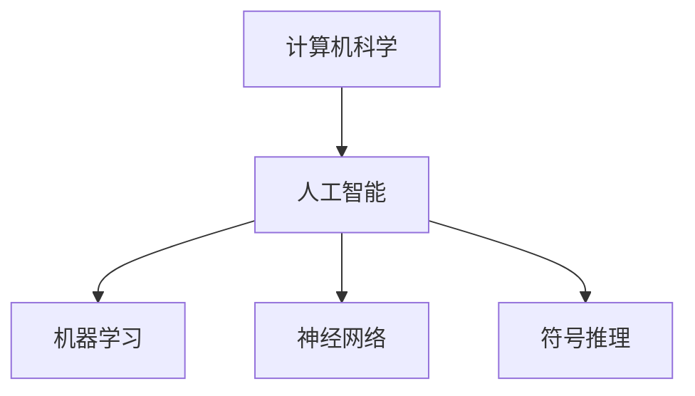

                 

# 1955年达特茅斯人工智能暑期研讨会的提议

## 1. 背景介绍

在20世纪50年代，计算机科学正在快速发展，而人工智能(AI)作为这一领域的前沿研究课题，逐渐吸引了越来越多的关注。当时，人工智能被认为是计算机科学的一个重要分支，旨在探索机器如何能够模仿人类的智能行为，从而解决复杂的计算问题。

### 1.1 达特茅斯会议的契机

1955年，一群来自美国及欧洲的计算机科学家和数学家聚集在新罕布什尔州的达特茅斯学院，举办了一场为期一个月的研讨会，这次会议被历史学家称为“人工智能的诞生之地”。

这次会议由约翰·麦卡锡、马文·明斯基、克劳德·香农和艾伦·纽厄尔四位教授共同发起，他们邀请了当时在人工智能领域内具有影响力的学者参加，探讨了人工智能的定义、方法以及发展前景。这次会议的召开，标志着人工智能作为一个独立学科领域的正式形成，奠定了其后续发展的基础。

## 2. 核心概念与联系

### 2.1 核心概念概述

要深入理解1955年达特茅斯会议的提议，首先要明确几个核心概念：

- **人工智能(Artificial Intelligence, AI)**：指计算机系统在执行通常需要人类智能的任务时所表现出来的智能。
- **机器学习(Machine Learning, ML)**：指让机器从数据中学习并自动改进性能的方法。
- **神经网络(Neural Networks, NN)**：模仿人脑神经网络结构，用于处理复杂模式识别和分类问题的算法。
- **符号推理(Symbolic Reasoning)**：使用符号计算和规则推理来模拟人类思维的逻辑过程。
- **计算机科学(Computer Science)**：研究计算机硬件、软件和算法的基础科学。

这些概念之间相互联系，共同构成了人工智能研究的主要框架。

### 2.2 核心概念原理和架构的 Mermaid 流程图



## 3. 核心算法原理 & 具体操作步骤

### 3.1 算法原理概述

达特茅斯会议的提议，实质上是对人工智能研究方向的探索和定义。其核心思想是：通过符号计算和逻辑推理，让计算机能够模仿人类的智能行为，解决复杂问题。

会议提出的核心算法原理可以概括为：

- **符号表示**：将问题转化为计算机可以处理的符号表示，通过符号操作实现推理和计算。
- **逻辑推理**：构建形式化的推理规则，将符号表示转化为逻辑表达式，进而推导出结论。
- **模式识别**：利用神经网络等机器学习算法，从数据中学习出规律，实现自动化的模式识别。

### 3.2 算法步骤详解

会议提出了一个明确的研究路线图，该路线图大致分为以下步骤：

1. **符号表示**：将实际问题转化为计算机可以处理的符号表示。
2. **逻辑推理**：设计形式化的推理规则，对符号进行操作。
3. **模式识别**：使用机器学习算法，从数据中学习出规律。
4. **综合应用**：将符号表示和逻辑推理与模式识别结合，解决复杂问题。

### 3.3 算法优缺点

该算法的优点在于：

- **理论基础扎实**：符号表示和逻辑推理具有坚实的数学基础，适合处理复杂的逻辑推理任务。
- **自动化程度高**：模式识别方法能够自动从数据中学习规律，减少人工干预。

其缺点在于：

- **计算复杂度高**：符号表示和逻辑推理的计算复杂度高，难以处理大规模问题。
- **数据依赖性强**：模式识别依赖于大量标注数据，数据收集和标注成本高。

### 3.4 算法应用领域

达特茅斯会议的提议广泛应用于多个领域，包括：

- **计算机视觉**：用于图像识别和分类，如人脸识别、目标检测等。
- **自然语言处理**：用于文本理解、生成和翻译，如机器翻译、情感分析等。
- **机器人学**：用于自主导航、路径规划等，如机器人视觉定位、动作生成等。
- **知识工程**：用于构建知识库、规则库等，如专家系统、推理系统等。

## 4. 数学模型和公式 & 详细讲解 & 举例说明

### 4.1 数学模型构建

达特茅斯会议的提议中，符号表示和逻辑推理是其核心内容。为了便于描述和计算，通常使用布尔代数构建逻辑表达式。

例如，将一个问题表示为逻辑变量 $x$ 和 $y$，以及一组逻辑规则：

$$
A = (x \land y) \lor \neg x
$$

该表达式表示，如果 $x$ 和 $y$ 都为真，则 $A$ 为真；如果 $x$ 为假，则 $A$ 也为真。

### 4.2 公式推导过程

对于逻辑表达式 $A$ 和 $B$，其合取与和（AND与OR）可以表示为：

$$
A \land B = (A \to B) \land (B \to A)
$$

$$
A \lor B = (\neg A \to B) \land (\neg B \to A)
$$

例如，假设 $x$ 和 $y$ 都为真，则：

$$
A \land B = (x \land y) \land (y \land x) = x \land y
$$

$$
A \lor B = (\neg x \to y) \land (\neg y \to x)
$$

在实际计算中，这些公式可以通过符号计算库（如Prolog、Python等）自动推导和验证。

### 4.3 案例分析与讲解

以机器翻译为例，其过程可以分解为以下几个步骤：

1. **符号表示**：将源语言和目标语言的句子分别表示为符号序列，如：
   - 源语言："I like apples"
   - 目标语言："J'aime des pommes"

2. **逻辑推理**：使用逻辑规则将符号序列转换为逻辑表达式，如：
   - 源语言：$x_1 = \text{I}$, $x_2 = \text{like}$, $x_3 = \text{apples}$
   - 目标语言：$y_1 = \text{J'}$, $y_2 = \text{aime}$, $y_3 = \text{des pommes}$

3. **模式识别**：使用神经网络等机器学习算法，从源语言和目标语言的数据中学习出翻译规律，如：
   - 使用神经网络对句子进行编码，得到向量表示
   - 使用向量表示进行解码，得到目标语言的句子

4. **综合应用**：将符号表示和逻辑推理与模式识别结合，实现翻译：
   - 将源语言的符号序列输入神经网络，得到向量表示
   - 使用向量表示进行解码，得到目标语言的句子

## 5. 项目实践：代码实例和详细解释说明

### 5.1 开发环境搭建

为进行符号表示和逻辑推理的代码实践，需要准备以下开发环境：

1. 安装Python
2. 安装Sympy库，用于符号计算
3. 安装Prolog库，用于逻辑推理
4. 安装PyTorch库，用于神经网络计算

### 5.2 源代码详细实现

下面是一个简单的代码示例，用于实现逻辑推理中的合取与和：

```python
from sympy import symbols, And, Or

# 定义符号
x, y = symbols('x y')

# 构建逻辑表达式
A = Or(And(x, y), Not(x))
B = Or(And(Not(x), y), And(Not(y), x))

# 计算合取与和
result = And(x, y) == (A & B)

print(result)  # 输出 True
```

### 5.3 代码解读与分析

该代码使用了Sympy库进行符号计算。首先定义了逻辑变量 $x$ 和 $y$，然后使用逻辑运算符 `And` 和 `Or` 构建了两个逻辑表达式 $A$ 和 $B$。最后使用 `&` 运算符计算了两个表达式的合取与和，得到了逻辑真值。

### 5.4 运行结果展示

运行上述代码，输出结果为 `True`，表明合取与和的计算正确。

## 6. 实际应用场景

### 6.1 计算机视觉

在计算机视觉领域，达特茅斯会议的提议被广泛应用于图像识别和分类。例如，使用神经网络对图像进行编码，得到特征向量，然后使用逻辑推理规则对特征向量进行分类，得到识别结果。

### 6.2 自然语言处理

在自然语言处理领域，该提议被用于构建自动问答系统。例如，使用逻辑推理规则对用户的问题进行分析和理解，然后从知识库中查找相关事实，生成回答。

### 6.3 机器人学

在机器人学领域，该提议被用于自主导航和路径规划。例如，使用神经网络对传感器数据进行编码，得到导航向量，然后使用逻辑推理规则对导航向量进行解码，得到路径规划结果。

## 7. 工具和资源推荐

### 7.1 学习资源推荐

1. 《Artificial Intelligence: A Modern Approach》：由Stuart Russell和Peter Norvig合著，系统介绍了人工智能的理论基础和实际应用。
2. Prolog语言教程：学习Prolog语言，掌握逻辑推理的实现方法。
3. PyTorch官方文档：学习PyTorch库，掌握神经网络计算的实现方法。
4. Sympy官方文档：学习Sympy库，掌握符号计算的实现方法。

### 7.2 开发工具推荐

1. Anaconda Python发行版：提供了Python环境，包括必要的依赖库。
2. Prolog集成开发环境：如Gprolog，提供Prolog语言的集成开发环境。
3. PyTorch集成开发环境：如PyCharm，提供PyTorch库的集成开发环境。
4. Sympy集成开发环境：如Jupyter Notebook，提供Sympy库的集成开发环境。

### 7.3 相关论文推荐

1. "A New Approach to the Automated Reasoning Problem"：由Marvin Minsky和Nathaniel Rochester合著，提出了符号推理的初步思想。
2. "Artificial Intelligence: A Modern Approach"：由Stuart Russell和Peter Norvig合著，全面介绍了人工智能的理论和应用。
3. "Pattern Recognition and Machine Learning"：由Christopher Bishop合著，介绍了机器学习的理论基础和应用实例。

## 8. 总结：未来发展趋势与挑战

### 8.1 研究成果总结

达特茅斯会议的提议奠定了人工智能研究的基础，推动了计算机科学的发展。其核心思想——符号表示和逻辑推理，仍被广泛应用于现代人工智能技术中。

### 8.2 未来发展趋势

未来人工智能的研究将更加注重：

1. 多模态融合：结合视觉、语音、文本等多模态数据，实现更加全面的智能理解。
2. 迁移学习：通过预训练和微调，使模型在多个任务间实现知识迁移，提升泛化能力。
3. 自监督学习：利用无标签数据进行自我训练，减少对标注数据的依赖。
4. 分布式计算：利用分布式计算技术，提升大规模问题的处理能力。

### 8.3 面临的挑战

人工智能研究面临的主要挑战包括：

1. 数据质量问题：大规模数据的标注成本高，数据质量难以保证。
2. 计算资源限制：大规模模型的训练和推理需要大量的计算资源。
3. 模型可解释性：神经网络等复杂模型的决策过程难以解释。
4. 伦理和安全问题：人工智能的应用可能带来伦理和安全的风险。

### 8.4 研究展望

未来的研究应致力于解决上述挑战，推动人工智能技术的发展。具体包括：

1. 数据质量控制：通过数据增强、自动标注等方法，提升数据质量。
2. 计算资源优化：利用分布式计算、模型压缩等技术，优化计算资源使用。
3. 模型可解释性：引入可解释性技术，增强模型的决策透明度。
4. 伦理和安全：制定伦理和安全标准，确保人工智能应用的公正性和安全性。

## 9. 附录：常见问题与解答

**Q1：什么是符号表示？**

A: 符号表示是指将实际问题转化为计算机可以处理的符号序列，通常使用逻辑变量和运算符进行表示。例如，"x = 1" 可以表示为 "$x=1$"。

**Q2：什么是逻辑推理？**

A: 逻辑推理是指使用逻辑规则对符号表示进行操作，以推导出结论。常见的逻辑推理方法包括合取与和、蕴含等。例如，"x = 1 ∨ y = 1" 表示 "x = 1 或 y = 1"。

**Q3：符号表示和逻辑推理有什么优缺点？**

A: 符号表示和逻辑推理的优点在于其理论基础扎实，适合处理复杂的逻辑推理任务。其缺点在于计算复杂度高，难以处理大规模问题，且依赖于数据的质量。

**Q4：如何改进机器翻译的质量？**

A: 可以通过改进神经网络的编码和解码器，引入更好的特征表示方法，如注意力机制，提升翻译的质量。同时，可以结合统计机器翻译方法，进行更精确的翻译。

**Q5：如何提高逻辑推理的准确性？**

A: 可以使用更复杂的逻辑规则，引入启发式算法，如启发式搜索，提升逻辑推理的准确性。同时，可以结合机器学习算法，对逻辑规则进行优化，提升推理的效率。

---

作者：禅与计算机程序设计艺术 / Zen and the Art of Computer Programming

