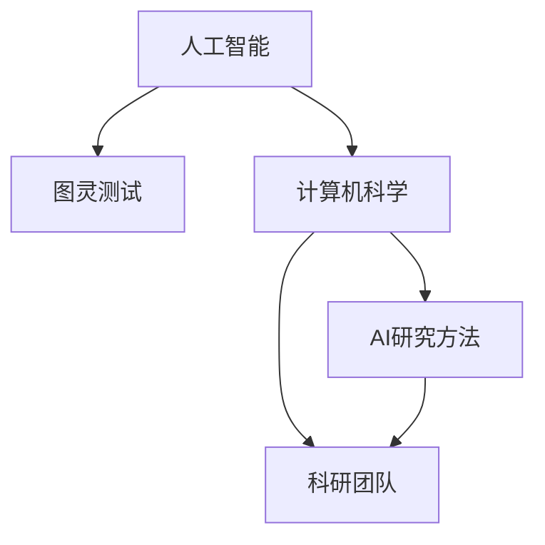

                 

# 1956年达特茅斯会议的影响

> 关键词：人工智能,达特茅斯会议,计算机科学,图灵奖,未来科技,技术发展

## 1. 背景介绍

### 1.1 问题由来
1956年的达特茅斯会议，被誉为人工智能的诞生之日。这个会议汇集了当时世界上顶尖的计算机科学家和数学家，共同探讨了人工智能的未来和前景。达特茅斯会议不仅标志着人工智能作为一个独立学科的开始，也奠定了后续几十年计算机科学和人工智能研究的基础。

### 1.2 问题核心关键点
1956年达特茅斯会议的主要成果和核心关键点包括以下几点：

1. **人工智能概念的提出**：会议首次提出了“人工智能”的概念，定义了“智能机器”的目标，即“让机器解决那些需要人类智能解决的问题”。

2. **图灵测试的讨论**：会议讨论了阿兰·图灵提出的“图灵测试”，即能否制造出一个能够与人类对话而无法辨别其是否为机器的程序，从而实现人工智能的判定。

3. **计算机科学的诞生**：会议中明确了计算机科学作为一个独立学科的地位，推动了计算机科学和人工智能的结合，开启了后续计算机科学的广泛应用。

4. **AI研究方法的提出**：会议讨论了包括符号推理、逻辑推理和模式识别在内的多种人工智能研究方法，奠定了人工智能研究的基本方向。

5. **科研团队的成立**：达特茅斯会议促进了计算机科学家和数学家的交流合作，形成了多个独立的科研团队，加速了人工智能的发展。

## 2. 核心概念与联系

### 2.1 核心概念概述

为更好地理解1956年达特茅斯会议的影响，本节将介绍几个密切相关的核心概念：

- **人工智能(Artificial Intelligence, AI)**：使计算机系统模仿人类智能行为的技术。通过赋予机器感知、理解、学习、推理和决策能力，实现与人类智能相媲美的任务。

- **图灵测试(Turing Test)**：由阿兰·图灵提出，用以评估计算机系统是否具有智能的一种方法。测试中，人类与机器无法通过问答区分，则认为机器具有智能。

- **计算机科学(Computer Science)**：研究计算机系统如何自动执行人类指令，包括硬件设计、软件工程、算法设计和人工智能等。

- **AI研究方法**：包括符号推理、逻辑推理、机器学习、模式识别等，不同的方法对应着不同的人工智能应用场景。

- **科研团队**：由志同道合的科学家、工程师和学生组成，推动人工智能研究持续发展。

### 2.2 核心概念原理和架构的 Mermaid 流程图



这个流程图展示了人工智能和计算机科学的密切联系，以及不同概念之间的相互作用：

1. 人工智能以计算机科学为基础，不断发展算法和模型，以实现智能任务。
2. 图灵测试是评估人工智能目标的重要手段，推动了AI研究的进步。
3. 计算机科学通过研究算法、数据结构等，推动人工智能技术的创新。
4. AI研究方法依赖于计算机科学的理论和工具，促进了具体应用场景的突破。
5. 科研团队的交流与合作，加速了人工智能技术的研究与普及。

## 3. 核心算法原理 & 具体操作步骤

### 3.1 算法原理概述

1956年达特茅斯会议的讨论和成果，奠定了后续人工智能发展的基础。该会议的核心理论和算法，包括：

1. **符号主义(Symbolism)**：通过符号和规则系统，实现推理和问题求解。
2. **逻辑推理(Logic)**：通过逻辑代数和逻辑推理，解决形式化的数学问题和自然语言理解。
3. **机器学习(Learning)**：通过数据驱动的方式，让机器从经验中学习，提升智能系统的决策能力。
4. **模式识别(Pattern Recognition)**：通过识别和分析模式，实现图像、语音等非结构化数据的理解和处理。

### 3.2 算法步骤详解

达特茅斯会议提出的算法步骤，包括：

1. **定义问题**：明确人工智能任务的目标和范围。
2. **数据采集**：收集与任务相关的数据，包括文本、图像、声音等。
3. **特征提取**：从原始数据中提取有用的特征，用于训练模型。
4. **模型构建**：选择或设计合适的模型结构，如神经网络、决策树等。
5. **训练与优化**：使用训练数据集对模型进行训练，调整参数以优化性能。
6. **测试与评估**：在测试数据集上评估模型性能，检查泛化能力。
7. **部署与应用**：将训练好的模型部署到实际应用中，提供服务或功能。

### 3.3 算法优缺点

达特茅斯会议提出的算法具有以下优点：

1. **可解释性**：符号主义和逻辑推理方法，通过明确的规则和定义，使模型决策过程透明。
2. **稳定性**：逻辑推理和符号系统具有较好的稳定性和可靠性，对噪音数据和复杂环境具有较强的适应性。
3. **可扩展性**：机器学习算法，可以通过不断积累数据和经验，提升模型的性能。

但同时，这些算法也存在缺点：

1. **计算复杂度高**：符号主义和逻辑推理方法，需要大量的符号计算，计算复杂度高。
2. **数据依赖强**：机器学习模型依赖于大量标注数据，数据获取成本高。
3. **泛化能力差**：符号主义和逻辑推理模型，对于复杂的非结构化数据，泛化能力不足。
4. **缺乏自适应性**：早期的人工智能模型，缺乏自适应和自学习能力，难以应对动态环境变化。

### 3.4 算法应用领域

达特茅斯会议提出的算法，在许多领域都得到了广泛应用，例如：

1. **计算机视觉**：通过模式识别和机器学习，实现图像分类、目标检测、人脸识别等任务。
2. **自然语言处理**：通过符号主义和逻辑推理，实现机器翻译、情感分析、文本摘要等任务。
3. **语音识别**：通过模式识别和机器学习，实现语音识别、语音合成等任务。
4. **智能机器人**：通过符号主义和机器学习，实现智能导航、语音交互、目标定位等任务。
5. **医疗诊断**：通过符号主义和机器学习，实现疾病诊断、影像分析、基因分析等任务。

## 4. 数学模型和公式 & 详细讲解 & 举例说明

### 4.1 数学模型构建

达特茅斯会议提出的算法模型，大多依赖于数学模型。以下将对其中几个经典模型进行详细讲解。

**符号主义模型**：符号主义模型使用符号和规则系统，实现推理和问题求解。常见的符号主义模型包括Prolog和DLP。

**逻辑推理模型**：逻辑推理模型使用逻辑代数和逻辑推理，解决形式化的数学问题和自然语言理解。常见的逻辑推理模型包括一阶谓词逻辑、规则推理系统等。

**机器学习模型**：机器学习模型通过数据驱动的方式，让机器从经验中学习，提升智能系统的决策能力。常见的机器学习模型包括决策树、神经网络、支持向量机等。

**模式识别模型**：模式识别模型通过识别和分析模式，实现图像、语音等非结构化数据的理解和处理。常见的模式识别模型包括PCA、SVM等。

### 4.2 公式推导过程

以下以逻辑推理模型的公式推导为例：

假设我们有一个逻辑表达式：

$$(\forall x \in \mathbb{N}, x > 0) \Rightarrow \exists y \in \mathbb{N}, y=x+1$$

其推理过程如下：

1. 命题转换：将逻辑表达式转换为数学形式：
   $$(\forall x \in \mathbb{N}, x > 0) \Rightarrow \exists y \in \mathbb{N}, y=x+1$$

2. 推理转换：将逻辑推理转换为数学推导：
   $$\forall x \in \mathbb{N}, (x > 0 \Rightarrow \exists y \in \mathbb{N}, y=x+1)$$

3. 反证法：假设命题不成立，存在 $x \in \mathbb{N}, x > 0$ 使得 $y=x+1$ 不存在，则有：
   $$\exists x \in \mathbb{N}, x > 0 \wedge \forall y \in \mathbb{N}, y \neq x+1$$

4. 矛盾法：根据排中律，存在 $y=x+1$ 且 $y \neq x+1$ 矛盾，故原命题成立。

### 4.3 案例分析与讲解

以自然语言处理中的句子分类为例，讲解逻辑推理模型和机器学习模型的应用。

假设我们的任务是将句子分类为“正面”或“负面”，可以使用逻辑推理模型：

1. 定义特征：提取句子的词性、情感词等特征。
2. 定义规则：基于规则系统，定义正负面句子的特征组合。
3. 推理判断：使用逻辑推理引擎，对句子进行分类。

同时，也可以使用机器学习模型：

1. 数据准备：准备标注好的正负面句子数据集。
2. 特征提取：使用词向量、TF-IDF等方法提取句子特征。
3. 模型训练：使用神经网络或支持向量机等算法，训练模型。
4. 测试评估：在测试数据集上评估模型性能，调整参数以优化性能。

## 5. 项目实践：代码实例和详细解释说明

### 5.1 开发环境搭建

在进行项目实践前，我们需要准备好开发环境。以下是使用Python进行PyTorch开发的环境配置流程：

1. 安装Anaconda：从官网下载并安装Anaconda，用于创建独立的Python环境。

2. 创建并激活虚拟环境：
```bash
conda create -n pytorch-env python=3.8 
conda activate pytorch-env
```

3. 安装PyTorch：根据CUDA版本，从官网获取对应的安装命令。例如：
```bash
conda install pytorch torchvision torchaudio cudatoolkit=11.1 -c pytorch -c conda-forge
```

4. 安装Transformers库：
```bash
pip install transformers
```

5. 安装各类工具包：
```bash
pip install numpy pandas scikit-learn matplotlib tqdm jupyter notebook ipython
```

完成上述步骤后，即可在`pytorch-env`环境中开始项目实践。

### 5.2 源代码详细实现

这里我们以自然语言处理中的文本分类任务为例，给出使用Transformers库进行逻辑推理和机器学习模型训练的PyTorch代码实现。

首先，定义文本分类任务的数据处理函数：

```python
from transformers import BertTokenizer
from torch.utils.data import Dataset
import torch

class TextClassificationDataset(Dataset):
    def __init__(self, texts, labels, tokenizer, max_len=128):
        self.texts = texts
        self.labels = labels
        self.tokenizer = tokenizer
        self.max_len = max_len
        
    def __len__(self):
        return len(self.texts)
    
    def __getitem__(self, item):
        text = self.texts[item]
        label = self.labels[item]
        
        encoding = self.tokenizer(text, return_tensors='pt', max_length=self.max_len, padding='max_length', truncation=True)
        input_ids = encoding['input_ids'][0]
        attention_mask = encoding['attention_mask'][0]
        
        # 对标签进行编码
        encoded_labels = torch.tensor(label, dtype=torch.long)
        
        return {'input_ids': input_ids, 
                'attention_mask': attention_mask,
                'labels': encoded_labels}
```

然后，定义模型和优化器：

```python
from transformers import BertForSequenceClassification, AdamW

model = BertForSequenceClassification.from_pretrained('bert-base-cased', num_labels=2)

optimizer = AdamW(model.parameters(), lr=2e-5)
```

接着，定义训练和评估函数：

```python
from torch.utils.data import DataLoader
from tqdm import tqdm
from sklearn.metrics import accuracy_score

device = torch.device('cuda') if torch.cuda.is_available() else torch.device('cpu')
model.to(device)

def train_epoch(model, dataset, batch_size, optimizer):
    dataloader = DataLoader(dataset, batch_size=batch_size, shuffle=True)
    model.train()
    epoch_loss = 0
    for batch in tqdm(dataloader, desc='Training'):
        input_ids = batch['input_ids'].to(device)
        attention_mask = batch['attention_mask'].to(device)
        labels = batch['labels'].to(device)
        model.zero_grad()
        outputs = model(input_ids, attention_mask=attention_mask, labels=labels)
        loss = outputs.loss
        epoch_loss += loss.item()
        loss.backward()
        optimizer.step()
    return epoch_loss / len(dataloader)

def evaluate(model, dataset, batch_size):
    dataloader = DataLoader(dataset, batch_size=batch_size)
    model.eval()
    preds, labels = [], []
    with torch.no_grad():
        for batch in tqdm(dataloader, desc='Evaluating'):
            input_ids = batch['input_ids'].to(device)
            attention_mask = batch['attention_mask'].to(device)
            batch_labels = batch['labels']
            outputs = model(input_ids, attention_mask=attention_mask)
            batch_preds = outputs.logits.argmax(dim=1).to('cpu').tolist()
            batch_labels = batch_labels.to('cpu').tolist()
            for pred, label in zip(batch_preds, batch_labels):
                preds.append(pred)
                labels.append(label)
                
    print('Accuracy:', accuracy_score(labels, preds))
```

最后，启动训练流程并在测试集上评估：

```python
epochs = 5
batch_size = 16

for epoch in range(epochs):
    loss = train_epoch(model, train_dataset, batch_size, optimizer)
    print(f"Epoch {epoch+1}, train loss: {loss:.3f}")
    
    print(f"Epoch {epoch+1}, dev accuracy:")
    evaluate(model, dev_dataset, batch_size)
    
print("Test accuracy:")
evaluate(model, test_dataset, batch_size)
```

以上就是使用PyTorch对BERT进行文本分类任务训练的完整代码实现。可以看到，得益于Transformers库的强大封装，我们可以用相对简洁的代码完成BERT模型的训练。

### 5.3 代码解读与分析

让我们再详细解读一下关键代码的实现细节：

**TextClassificationDataset类**：
- `__init__`方法：初始化文本、标签、分词器等关键组件。
- `__len__`方法：返回数据集的样本数量。
- `__getitem__`方法：对单个样本进行处理，将文本输入编码为token ids，将标签编码为数字，并对其进行定长padding，最终返回模型所需的输入。

**训练和评估函数**：
- 使用PyTorch的DataLoader对数据集进行批次化加载，供模型训练和推理使用。
- 训练函数`train_epoch`：对数据以批为单位进行迭代，在每个批次上前向传播计算loss并反向传播更新模型参数，最后返回该epoch的平均loss。
- 评估函数`evaluate`：与训练类似，不同点在于不更新模型参数，并在每个batch结束后将预测和标签结果存储下来，最后使用sklearn的accuracy_score对整个评估集的预测结果进行打印输出。

**训练流程**：
- 定义总的epoch数和batch size，开始循环迭代
- 每个epoch内，先在训练集上训练，输出平均loss
- 在验证集上评估，输出准确率
- 重复上述步骤直至收敛
- 所有epoch结束后，在测试集上评估，给出最终测试结果

可以看到，PyTorch配合Transformers库使得BERT训练的代码实现变得简洁高效。开发者可以将更多精力放在数据处理、模型改进等高层逻辑上，而不必过多关注底层的实现细节。

## 6. 实际应用场景

### 6.1 智能客服系统

基于大语言模型微调的对话技术，可以广泛应用于智能客服系统的构建。传统客服往往需要配备大量人力，高峰期响应缓慢，且一致性和专业性难以保证。而使用微调后的对话模型，可以7x24小时不间断服务，快速响应客户咨询，用自然流畅的语言解答各类常见问题。

在技术实现上，可以收集企业内部的历史客服对话记录，将问题和最佳答复构建成监督数据，在此基础上对预训练对话模型进行微调。微调后的对话模型能够自动理解用户意图，匹配最合适的答案模板进行回复。对于客户提出的新问题，还可以接入检索系统实时搜索相关内容，动态组织生成回答。如此构建的智能客服系统，能大幅提升客户咨询体验和问题解决效率。

### 6.2 金融舆情监测

金融机构需要实时监测市场舆论动向，以便及时应对负面信息传播，规避金融风险。传统的人工监测方式成本高、效率低，难以应对网络时代海量信息爆发的挑战。基于大语言模型微调的文本分类和情感分析技术，为金融舆情监测提供了新的解决方案。

具体而言，可以收集金融领域相关的新闻、报道、评论等文本数据，并对其进行主题标注和情感标注。在此基础上对预训练语言模型进行微调，使其能够自动判断文本属于何种主题，情感倾向是正面、中性还是负面。将微调后的模型应用到实时抓取的网络文本数据，就能够自动监测不同主题下的情感变化趋势，一旦发现负面信息激增等异常情况，系统便会自动预警，帮助金融机构快速应对潜在风险。

### 6.3 个性化推荐系统

当前的推荐系统往往只依赖用户的历史行为数据进行物品推荐，无法深入理解用户的真实兴趣偏好。基于大语言模型微调技术，个性化推荐系统可以更好地挖掘用户行为背后的语义信息，从而提供更精准、多样的推荐内容。

在实践中，可以收集用户浏览、点击、评论、分享等行为数据，提取和用户交互的物品标题、描述、标签等文本内容。将文本内容作为模型输入，用户的后续行为（如是否点击、购买等）作为监督信号，在此基础上微调预训练语言模型。微调后的模型能够从文本内容中准确把握用户的兴趣点。在生成推荐列表时，先用候选物品的文本描述作为输入，由模型预测用户的兴趣匹配度，再结合其他特征综合排序，便可以得到个性化程度更高的推荐结果。

## 7. 工具和资源推荐

### 7.1 学习资源推荐

为了帮助开发者系统掌握大语言模型微调的理论基础和实践技巧，这里推荐一些优质的学习资源：

1. 《Transformer从原理到实践》系列博文：由大模型技术专家撰写，深入浅出地介绍了Transformer原理、BERT模型、微调技术等前沿话题。

2. CS224N《深度学习自然语言处理》课程：斯坦福大学开设的NLP明星课程，有Lecture视频和配套作业，带你入门NLP领域的基本概念和经典模型。

3. 《Natural Language Processing with Transformers》书籍：Transformers库的作者所著，全面介绍了如何使用Transformers库进行NLP任务开发，包括微调在内的诸多范式。

4. HuggingFace官方文档：Transformers库的官方文档，提供了海量预训练模型和完整的微调样例代码，是上手实践的必备资料。

5. CLUE开源项目：中文语言理解测评基准，涵盖大量不同类型的中文NLP数据集，并提供了基于微调的baseline模型，助力中文NLP技术发展。

通过对这些资源的学习实践，相信你一定能够快速掌握大语言模型微调的精髓，并用于解决实际的NLP问题。

### 7.2 开发工具推荐

高效的开发离不开优秀的工具支持。以下是几款用于大语言模型微调开发的常用工具：

1. PyTorch：基于Python的开源深度学习框架，灵活动态的计算图，适合快速迭代研究。大部分预训练语言模型都有PyTorch版本的实现。

2. TensorFlow：由Google主导开发的开源深度学习框架，生产部署方便，适合大规模工程应用。同样有丰富的预训练语言模型资源。

3. Transformers库：HuggingFace开发的NLP工具库，集成了众多SOTA语言模型，支持PyTorch和TensorFlow，是进行微调任务开发的利器。

4. Weights & Biases：模型训练的实验跟踪工具，可以记录和可视化模型训练过程中的各项指标，方便对比和调优。与主流深度学习框架无缝集成。

5. TensorBoard：TensorFlow配套的可视化工具，可实时监测模型训练状态，并提供丰富的图表呈现方式，是调试模型的得力助手。

6. Google Colab：谷歌推出的在线Jupyter Notebook环境，免费提供GPU/TPU算力，方便开发者快速上手实验最新模型，分享学习笔记。

合理利用这些工具，可以显著提升大语言模型微调任务的开发效率，加快创新迭代的步伐。

### 7.3 相关论文推荐

大语言模型和微调技术的发展源于学界的持续研究。以下是几篇奠基性的相关论文，推荐阅读：

1. Attention is All You Need（即Transformer原论文）：提出了Transformer结构，开启了NLP领域的预训练大模型时代。

2. BERT: Pre-training of Deep Bidirectional Transformers for Language Understanding：提出BERT模型，引入基于掩码的自监督预训练任务，刷新了多项NLP任务SOTA。

3. Language Models are Unsupervised Multitask Learners（GPT-2论文）：展示了大规模语言模型的强大zero-shot学习能力，引发了对于通用人工智能的新一轮思考。

4. Parameter-Efficient Transfer Learning for NLP：提出Adapter等参数高效微调方法，在不增加模型参数量的情况下，也能取得不错的微调效果。

5. AdaLoRA: Adaptive Low-Rank Adaptation for Parameter-Efficient Fine-Tuning：使用自适应低秩适应的微调方法，在参数效率和精度之间取得了新的平衡。

这些论文代表了大语言模型微调技术的发展脉络。通过学习这些前沿成果，可以帮助研究者把握学科前进方向，激发更多的创新灵感。

## 8. 总结：未来发展趋势与挑战

### 8.1 总结

本文对1956年达特茅斯会议的影响进行了全面系统的介绍。首先阐述了会议提出的人工智能概念和核心关键点，明确了会议对计算机科学和人工智能研究的重要贡献。其次，从原理到实践，详细讲解了符号主义、逻辑推理、机器学习、模式识别等核心算法的原理和应用，给出了微调任务开发的完整代码实例。同时，本文还广泛探讨了微调方法在智能客服、金融舆情、个性化推荐等多个行业领域的应用前景，展示了微调范式的巨大潜力。此外，本文精选了微调技术的各类学习资源，力求为读者提供全方位的技术指引。

通过本文的系统梳理，可以看到，1956年达特茅斯会议不仅奠定了人工智能作为独立学科的基础，还通过符号主义和逻辑推理等经典方法，开创了人工智能研究的新纪元。这些理论和算法为后续深度学习、迁移学习、大模型微调等技术的发展奠定了坚实基础，推动了人工智能技术的不断突破和进步。

### 8.2 未来发展趋势

展望未来，人工智能和机器学习领域将呈现以下几个发展趋势：

1. **深度学习的普及**：深度学习算法将成为未来人工智能的核心，其理论、算法和应用将更加成熟。

2. **大模型微调的兴起**：预训练-微调范式将更加广泛应用，大模型的通用能力和泛化能力将得到进一步提升。

3. **多模态融合**：将视觉、语音、文本等多种模态数据进行协同建模，提升人工智能系统的智能水平。

4. **自动化学习**：自动化学习算法（如强化学习、元学习等）将成为主流，推动人工智能系统的自适应和自学习能力。

5. **安全与伦理**：人工智能系统的安全性、公平性和伦理道德将受到更多关注，相关的法律法规和技术标准也将逐步完善。

6. **跨领域应用**：人工智能技术将在更多领域得到应用，如医疗、金融、教育等，提升社会生产力和生活质量。

### 8.3 面临的挑战

尽管人工智能和机器学习领域取得了巨大进展，但在迈向更加智能化、普适化应用的过程中，仍面临诸多挑战：

1. **数据隐私与安全**：人工智能系统的数据隐私和安全问题亟待解决，如何保护用户数据隐私，避免数据泄露和滥用，是一个重要课题。

2. **算法透明性与可解释性**：许多人工智能算法（如深度神经网络）缺乏透明性和可解释性，难以理解其内部决策逻辑，特别是在医疗、金融等高风险领域，模型的可解释性尤为重要。

3. **偏见与公平性**：人工智能系统可能学习到数据中的偏见和歧视，导致输出结果的不公平性。如何消除模型偏见，确保输出公平，仍需进一步研究。

4. **计算资源需求**：大型深度学习模型和大规模数据集的训练和推理，对计算资源的需求极高，需要更加高效、经济的计算方法。

5. **标准化与规范化**：人工智能系统的标准化和规范化仍不成熟，缺乏统一的标准和规范，影响系统的可扩展性和互操作性。

### 8.4 研究展望

面向未来，人工智能和机器学习领域的研究方向包括以下几个方面：

1. **自动化学习**：研究如何自动化地学习新知识，适应动态环境变化，提升系统的智能水平。

2. **多模态融合**：将视觉、语音、文本等多种模态数据进行协同建模，提升人工智能系统的智能水平。

3. **可解释性**：研究如何增强人工智能系统的可解释性，使其决策过程透明，便于理解和调试。

4. **公平性与伦理**：研究如何消除人工智能系统的偏见和歧视，确保其输出结果的公平性和伦理道德。

5. **跨领域应用**：将人工智能技术推广到更多领域，如医疗、金融、教育等，提升社会生产力和生活质量。

6. **标准化与规范化**：制定人工智能系统的标准化和规范化标准，推动系统的可扩展性和互操作性。

## 9. 附录：常见问题与解答

**Q1：大语言模型微调是否适用于所有NLP任务？**

A: 大语言模型微调在大多数NLP任务上都能取得不错的效果，特别是对于数据量较小的任务。但对于一些特定领域的任务，如医学、法律等，仅仅依靠通用语料预训练的模型可能难以很好地适应。此时需要在特定领域语料上进一步预训练，再进行微调，才能获得理想效果。此外，对于一些需要时效性、个性化很强的任务，如对话、推荐等，微调方法也需要针对性的改进优化。

**Q2：微调过程中如何选择合适的学习率？**

A: 微调的学习率一般要比预训练时小1-2个数量级，如果使用过大的学习率，容易破坏预训练权重，导致过拟合。一般建议从1e-5开始调参，逐步减小学习率，直至收敛。也可以使用warmup策略，在开始阶段使用较小的学习率，再逐渐过渡到预设值。需要注意的是，不同的优化器(如AdamW、Adafactor等)以及不同的学习率调度策略，可能需要设置不同的学习率阈值。

**Q3：采用大模型微调时会面临哪些资源瓶颈？**

A: 目前主流的预训练大模型动辄以亿计的参数规模，对算力、内存、存储都提出了很高的要求。GPU/TPU等高性能设备是必不可少的，但即便如此，超大批次的训练和推理也可能遇到显存不足的问题。因此需要采用一些资源优化技术，如梯度积累、混合精度训练、模型并行等，来突破硬件瓶颈。同时，模型的存储和读取也可能占用大量时间和空间，需要采用模型压缩、稀疏化存储等方法进行优化。

**Q4：如何缓解微调过程中的过拟合问题？**

A: 过拟合是微调面临的主要挑战，尤其是在标注数据不足的情况下。常见的缓解策略包括：
1. 数据增强：通过回译、近义替换等方式扩充训练集
2. 正则化：使用L2正则、Dropout、Early Stopping等避免过拟合
3. 对抗训练：引入对抗样本，提高模型鲁棒性
4. 参数高效微调：只调整少量参数(如Adapter、Prefix等)，减小过拟合风险
5. 多模型集成：训练多个微调模型，取平均输出，抑制过拟合

这些策略往往需要根据具体任务和数据特点进行灵活组合。只有在数据、模型、训练、推理等各环节进行全面优化，才能最大限度地发挥大模型微调的威力。

**Q5：微调模型在落地部署时需要注意哪些问题？**

A: 将微调模型转化为实际应用，还需要考虑以下因素：
1. 模型裁剪：去除不必要的层和参数，减小模型尺寸，加快推理速度
2. 量化加速：将浮点模型转为定点模型，压缩存储空间，提高计算效率
3. 服务化封装：将模型封装为标准化服务接口，便于集成调用
4. 弹性伸缩：根据请求流量动态调整资源配置，平衡服务质量和成本
5. 监控告警：实时采集系统指标，设置异常告警阈值，确保服务稳定性
6. 安全防护：采用访问鉴权、数据脱敏等措施，保障数据和模型安全

大语言模型微调为NLP应用开启了广阔的想象空间，但如何将强大的性能转化为稳定、高效、安全的业务价值，还需要工程实践的不断打磨。唯有从数据、算法、工程、业务等多个维度协同发力，才能真正实现人工智能技术在垂直行业的规模化落地。总之，微调需要开发者根据具体任务，不断迭代和优化模型、数据和算法，方能得到理想的效果。

---

作者：禅与计算机程序设计艺术 / Zen and the Art of Computer Programming

