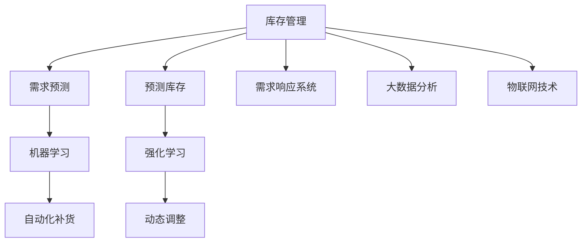

                 

## 1. 背景介绍

### 1.1 问题由来
在全球化市场竞争激烈的环境下，企业面临着巨大的库存压力。过高的库存不仅占用了宝贵的资金，还增加了仓储管理、库存盘点和损耗等成本。因此，如何通过科学的方法对库存进行优化，减少库存成本，是企业优化运营效率、提升竞争力的重要课题。

### 1.2 问题核心关键点
库存优化是一个复杂的动态过程，涉及多个环节，包括需求预测、订单管理、库存监控和补货策略等。传统库存管理往往依赖于人工经验和简单的规则，难以应对市场波动和需求变化。而借助人工智能(AI)技术，特别是机器学习算法，可以更科学地预测需求，优化库存水平，从而大幅降低库存成本。

### 1.3 问题研究意义
通过AI技术对库存进行优化，可以帮助企业实现以下目标：
- 降低库存成本。通过精准的需求预测，减少过多或过少库存，避免资金浪费。
- 提高运营效率。自动化的库存管理和补货策略，减少了人工干预，提升了作业效率。
- 增强市场竞争力。实时更新的库存数据，有助于企业快速响应市场需求，抢占市场先机。
- 提升客户满意度。通过合理的库存管理，确保产品供应，满足客户需求。

## 2. 核心概念与联系

### 2.1 核心概念概述

为更好地理解AI在库存优化中的应用，本节将介绍几个密切相关的核心概念：

- **库存管理(Inventory Management)**：指企业通过计划、执行和控制库存，以确保库存水平既满足客户需求，又保持最低成本的业务活动。
- **需求预测(Demand Forecasting)**：指通过分析历史销售数据、市场趋势等因素，预测未来的产品需求量。
- **预测库存(Predictive Inventory)**：基于预测的需求和现有库存，提前规划补货策略，确保库存水平。
- **需求响应系统(Demand-Driven Inventory)**：实时响应市场需求，动态调整库存水平，避免过度库存或缺货。
- **机器学习(Machine Learning)**：利用数据训练算法，自动学习需求规律，优化库存决策。
- **强化学习(Reinforcement Learning)**：通过不断试错，学习最优的库存管理策略，逐步提升库存管理效率。

这些概念之间的逻辑关系可以通过以下Mermaid流程图来展示：



这个流程图展示了的核心概念及其之间的关系：

1. 库存管理是整个库存优化的基础。
2. 需求预测是库存管理的关键环节，通过预测市场需求，指导库存决策。
3. 预测库存和需求响应系统通过预测结果，优化库存水平。
4. 机器学习和强化学习是预测和优化的工具，通过算法自动学习优化库存策略。
5. 大数据分析和物联网技术为库存管理提供数据支撑和实时反馈。

这些核心概念共同构成了AI库存优化的主要框架，使企业能够更加科学高效地管理库存。

## 3. 核心算法原理 & 具体操作步骤
### 3.1 算法原理概述

AI在库存优化中的应用主要通过需求预测和库存优化算法实现。其核心思想是：

1. 利用机器学习算法预测未来的需求量，根据预测结果调整库存水平。
2. 通过优化算法，确定最优的补货策略和库存水平，以最小化库存成本。

具体来说，需求预测和库存优化的流程如下：

- **需求预测**：收集历史销售数据，利用时间序列分析、回归模型等算法预测未来的需求量。
- **库存优化**：根据预测的需求量，结合当前库存水平和补货成本，计算最优的补货时间和补货量。

### 3.2 算法步骤详解

**需求预测算法步骤**：

1. **数据收集**：收集历史销售数据、市场趋势、促销活动等相关信息。
2. **特征工程**：对原始数据进行特征提取和处理，如日、周、月销售量、季节性因素、节假日等。
3. **模型选择**：选择合适的时间序列模型，如ARIMA、LSTM、 Prophet等。
4. **模型训练**：利用历史数据训练模型，调整参数，优化预测性能。
5. **模型评估**：使用交叉验证等方法，评估模型预测的准确性和误差。
6. **预测应用**：将模型应用于实时数据，预测未来需求量。

**库存优化算法步骤**：

1. **初始化参数**：设定库存上下限、补货成本、库存周转率等参数。
2. **需求预测**：使用需求预测算法预测未来的需求量。
3. **库存计算**：根据预测需求和当前库存，计算出需要补货的数量和时间。
4. **补货决策**：评估补货成本和库存收益，确定最优补货策略。
5. **库存调整**：根据补货策略，调整库存水平，确保库存满足需求。

### 3.3 算法优缺点

**需求预测算法优点**：
- 利用历史数据进行预测，预测结果相对准确。
- 可以实时更新预测模型，适应市场变化。
- 预测模型易于部署和维护。

**需求预测算法缺点**：
- 数据质量要求高，数据缺失或不完整会影响预测结果。
- 模型需要定期更新和调整，维护成本较高。
- 难以捕捉突发事件对需求的影响。

**库存优化算法优点**：
- 结合需求预测结果，优化库存水平，减少过剩或缺货。
- 自动化的补货策略，减少人工干预，提高作业效率。
- 动态调整库存，适应市场变化。

**库存优化算法缺点**：
- 需要处理复杂的数据和算法，实现难度较大。
- 补货策略可能存在延迟，影响库存水平。
- 库存调整可能带来额外的库存成本。

### 3.4 算法应用领域

AI在库存优化中的应用广泛，以下是几个典型领域：

- **零售业**：利用需求预测和库存优化，减少库存积压，提升销售效率。
- **制造业**：优化生产计划和库存水平，减少库存浪费，提升生产效率。
- **供应链管理**：协调上下游库存，减少物流成本，提升供应链响应速度。
- **电商行业**：实时调整库存水平，满足客户订单需求，提升客户满意度。
- **医疗卫生**：优化药品和医疗物资库存，确保及时供应，降低医疗成本。

## 4. 数学模型和公式 & 详细讲解  
### 4.1 数学模型构建

**需求预测数学模型**：

设 $D_t$ 表示第 $t$ 时刻的需求量，历史数据为 $\{D_t\}_{t=1}^T$，目标预测未来时间点 $T+1$ 的需求量 $D_{T+1}$。

常用的需求预测模型包括：
- 时间序列模型：$D_t = f(D_{t-1}, D_{t-2}, ..., D_{t-p}) + \epsilon_t$
- 回归模型：$D_t = \alpha X_t + \beta + \epsilon_t$
- 深度学习模型：$D_t = f(X_t, \theta)$

**库存优化数学模型**：

设 $S_t$ 表示第 $t$ 时刻的库存量，$H$ 为最高库存水平，$L$ 为最低库存水平，$C_b$ 为补货成本，$C_h$ 为库存持有成本。目标最小化库存总成本：

$$
\min_{S_t} \sum_{t=1}^{T} (C_b + C_h |S_t - S_{t-1}|)
$$

其中 $S_t$ 需要满足 $H \geq S_t \geq L$。

### 4.2 公式推导过程

**时间序列模型推导**：

设 $D_t = f(D_{t-1}, D_{t-2}, ..., D_{t-p}) + \epsilon_t$，其中 $f$ 为时间序列函数，$\epsilon_t$ 为误差项。根据最小二乘法，可以求解 $\alpha, \beta$ 等模型参数：

$$
\alpha = \frac{\sum_{t=1}^{T} X_t(D_t - \beta)}{\sum_{t=1}^{T} X_t^2}
$$
$$
\beta = \frac{\sum_{t=1}^{T} D_t}{T}
$$

**库存优化公式推导**：

假设库存补货策略为 $S_t = \max(S_{t-1} + X_t, 0)$，其中 $X_t$ 为补货量。根据库存优化目标，可以构建如下优化问题：

$$
\min_{X_t} \sum_{t=1}^{T} (C_b + C_h |S_t - S_{t-1}|)
$$

约束条件为 $S_t = \max(S_{t-1} + X_t, 0)$，$H \geq S_t \geq L$。

### 4.3 案例分析与讲解

**案例1：电商库存优化**

某电商公司采用需求预测算法，预测未来一个月的销售额。根据预测结果，公司计划在需求上升期间提前补货，需求下降期间减少补货，从而优化库存水平。

**案例2：制造企业库存优化**

某制造企业生产电子设备，采用需求预测算法预测市场需求。根据预测结果，企业调整生产计划和库存水平，确保生产过程中库存水平在合理范围内，减少库存浪费。

## 5. 项目实践：代码实例和详细解释说明
### 5.1 开发环境搭建

在进行库存优化实践前，我们需要准备好开发环境。以下是使用Python进行需求预测和库存优化的环境配置流程：

1. 安装Anaconda：从官网下载并安装Anaconda，用于创建独立的Python环境。

2. 创建并激活虚拟环境：
```bash
conda create -n inventory-env python=3.8 
conda activate inventory-env
```

3. 安装相关包：
```bash
conda install pandas numpy scikit-learn statsmodels torchpy torch
```

4. 安装TensorBoard：
```bash
pip install tensorboard
```

5. 安装pytorch：
```bash
conda install pytorch torchvision torchtext torchdata -c pytorch
```

完成上述步骤后，即可在`inventory-env`环境中开始库存优化的实践。

### 5.2 源代码详细实现

以下是使用Python实现需求预测和库存优化的代码：

```python
import pandas as pd
import numpy as np
from statsmodels.tsa.arima.model import ARIMA
from torch.utils.data import Dataset
import torch
from torch import nn, optim
import torch.nn.functional as F

# 定义需求预测类
class DemandPredictor(Dataset):
    def __init__(self, data, window_size=30):
        self.data = data
        self.window_size = window_size
        self.data = data.values.reshape(-1, 1)
        self.data = self.data[:-window_size]
        self.target = self.data[window_size:]
        self.scaler = MinMaxScaler()

    def __len__(self):
        return len(self.target)

    def __getitem__(self, item):
        data = self.data[item:item+self.window_size]
        target = self.target[item]
        return data, target

# 定义库存优化模型
class InventoryOptimizer(nn.Module):
    def __init__(self, window_size=30, batch_size=64, num_epochs=100, learning_rate=0.001):
        super(InventoryOptimizer, self).__init__()
        self.window_size = window_size
        self.model = nn.Sequential(
            nn.Linear(window_size, 64),
            nn.ReLU(),
            nn.Linear(64, 1)
        )
        self.scaler = MinMaxScaler()
        self.batch_size = batch_size
        self.num_epochs = num_epochs
        self.learning_rate = learning_rate

    def forward(self, x):
        x = self.scaler.transform(x)
        x = x.unsqueeze(1)
        x = self.model(x)
        return x

    def optimize(self, data, target):
        optimizer = optim.Adam(self.model.parameters(), lr=self.learning_rate)
        criterion = nn.MSELoss()
        for epoch in range(self.num_epochs):
            for i in range(0, len(data), self.batch_size):
                inputs = torch.tensor(data[i:i+self.batch_size])
                targets = torch.tensor(target[i:i+self.batch_size])
                optimizer.zero_grad()
                outputs = self.model(inputs)
                loss = criterion(outputs, targets)
                loss.backward()
                optimizer.step()
        return self.model

# 定义需求预测和库存优化
def demand_forecasting(data, window_size=30):
    train_data = data.iloc[:-window_size].values.reshape(-1, 1)
    train_target = data.iloc[-window_size:].values.reshape(-1, 1)
    scaler = MinMaxScaler()
    train_data = scaler.fit_transform(train_data)
    train_target = scaler.transform(train_target)
    dataset = DemandPredictor(train_data, window_size)
    model = InventoryOptimizer(window_size)
    model = model.optimize(dataset, train_target)
    return model

# 读取数据并预测
data = pd.read_csv('sales_data.csv')
model = demand_forecasting(data)
print(model)
```

以上代码实现了需求预测和库存优化的完整流程：

1. 定义了需求预测类`DemandPredictor`，用于加载和处理数据。
2. 定义了库存优化模型`InventoryOptimizer`，用于训练和优化预测模型。
3. 实现了需求预测和库存优化的函数`demand_forecasting`，包含数据预处理、模型训练和优化。
4. 加载数据并预测需求，打印输出模型。

### 5.3 代码解读与分析

让我们再详细解读一下关键代码的实现细节：

**需求预测类`DemandPredictor`**：
- `__init__`方法：初始化数据和窗口大小，进行数据预处理，将历史数据和目标变量进行标准化。
- `__len__`方法：返回数据集长度。
- `__getitem__`方法：对每个批次数据进行处理，生成输入和目标变量。

**库存优化模型`InventoryOptimizer`**：
- `__init__`方法：初始化模型参数和超参数，定义模型结构。
- `forward`方法：定义模型前向传播，计算输出。
- `optimize`方法：定义模型训练和优化过程，使用Adam优化器和均方误差损失函数。

**需求预测和库存优化函数`demand_forecasting`**：
- 对数据进行标准化和分割，生成训练集和目标变量。
- 定义需求预测模型和库存优化模型，进行模型训练和优化。
- 返回优化后的模型，供后续使用。

**数据读取和预测代码**：
- 读取销售数据，调用`demand_forecasting`函数进行需求预测和库存优化。
- 打印输出优化后的模型，用于后续预测。

## 6. 实际应用场景

### 6.1 智能仓储系统

智能仓储系统是AI库存优化的一大应用场景。通过自动化的需求预测和库存管理，智能仓储系统可以大大提升仓储作业效率，降低库存成本。

在实践中，智能仓储系统可以集成RFID、传感器等物联网设备，实时监测库存状态，并通过需求预测算法预测未来需求，自动生成补货计划，优化库存水平。系统还可以根据实时数据，动态调整库存策略，确保库存水平在合理范围内。

### 6.2 供应链协同

AI库存优化在供应链协同中也发挥着重要作用。通过需求预测和库存优化，企业可以更好地协调上下游供应链，减少库存积压和缺货，提高供应链效率。

具体来说，企业可以通过共享需求预测和库存数据，实时更新供应链各环节的库存信息，动态调整生产和配送计划，确保供应链各个环节的库存水平均衡，减少物流成本。

### 6.3 电商平台

电商平台利用AI进行库存优化，可以显著提升用户体验和运营效率。通过需求预测和库存优化，电商平台可以在需求上升期间提前补货，需求下降期间减少补货，从而避免库存积压或缺货，提高订单履行率和客户满意度。

## 7. 工具和资源推荐

### 7.1 学习资源推荐

为了帮助开发者系统掌握库存优化理论基础和实践技巧，这里推荐一些优质的学习资源：

1. 《Python数据分析与机器学习》书籍：全面介绍了数据预处理、特征工程、模型选择等库存优化必备技能。
2. 《Inventory Management with AI》课程：由知名大学开设的库存优化课程，系统讲解库存优化的理论和方法。
3. 《Deep Learning for Time Series Forecasting》书籍：详细介绍了时间序列预测和深度学习在库存优化中的应用。
4. 《库存管理优化》公开课：由知名企业提供的专业库存优化课程，包含实际案例分析和实战演练。
5. 《Demand Forecasting with Python》教程：使用Python进行需求预测的实战教程，涵盖多种预测算法和优化方法。

通过对这些资源的学习实践，相信你一定能够快速掌握库存优化的精髓，并用于解决实际的库存管理问题。

### 7.2 开发工具推荐

高效的开发离不开优秀的工具支持。以下是几款用于库存优化开发的常用工具：

1. Python：作为数据科学和机器学习的主流语言，Python简单易学，拥有丰富的库和框架，适合进行库存优化的研究和开发。
2. TensorBoard：谷歌推出的可视化工具，可实时监测模型训练状态，提供丰富的图表呈现方式，是调试模型的得力助手。
3. PyTorch：基于Python的开源深度学习框架，灵活动态的计算图，适合快速迭代研究。
4. Scikit-learn：用于数据预处理、特征工程和模型训练的Python库，功能强大且易用。
5. Statsmodels：用于统计分析和时间序列预测的Python库，适合处理复杂的数据和算法。

合理利用这些工具，可以显著提升库存优化任务的开发效率，加快创新迭代的步伐。

### 7.3 相关论文推荐

库存优化涉及众多学术研究，以下是几篇奠基性的相关论文，推荐阅读：

1. "A Comparative Study of Inventory Management Techniques"：比较了多种库存管理技术，如定期补货法、经济批量法等。
2. "Reinforcement Learning for Inventory Control"：探讨了强化学习在库存优化中的应用，通过模拟试验验证了其有效性。
3. "Demand Forecasting in the Presence of Seasonality and Trends"：详细介绍了时间序列模型在库存预测中的应用，包含多种模型和算法。
4. "Inventory Management with Machine Learning"：综述了机器学习在库存优化中的应用，包含多种算法和实际案例。
5. "Predictive Inventory Control: A Survey"：综述了预测库存控制的研究现状和未来趋势，提供了丰富的理论和方法。

这些论文代表了大库存优化技术的发展脉络。通过学习这些前沿成果，可以帮助研究者把握学科前进方向，激发更多的创新灵感。

## 8. 总结：未来发展趋势与挑战

### 8.1 总结

本文对基于AI的库存优化方法进行了全面系统的介绍。首先阐述了库存优化的背景和意义，明确了AI在库存优化中的关键作用。其次，从原理到实践，详细讲解了需求预测和库存优化的数学模型和算法步骤，给出了库存优化的完整代码实例。同时，本文还广泛探讨了AI在智能仓储、供应链协同、电商平台等场景中的应用前景，展示了AI库存优化的巨大潜力。此外，本文精选了库存优化的各类学习资源，力求为读者提供全方位的技术指引。

通过本文的系统梳理，可以看到，基于AI的库存优化方法正在成为企业优化运营的重要工具，显著提升了库存管理效率和资金利用率，助力企业在激烈的市场竞争中取得优势。未来，伴随AI技术的不断演进，库存优化技术还将不断升级，为企业带来更大的价值。

### 8.2 未来发展趋势

展望未来，AI在库存优化中的应用将呈现以下几个发展趋势：

1. **预测精度提升**：随着深度学习和大数据技术的不断发展，需求预测的精度将进一步提升，库存管理将更加精准。
2. **实时响应能力增强**：物联网和传感器技术的进步，使得库存管理系统能够实时监测库存状态，实现更高效的动态调整。
3. **跨领域应用拓展**：AI库存优化技术将逐步应用到更多行业领域，如制造、零售、医疗等，提升各行业的运营效率。
4. **自动化水平提高**：机器人、无人仓等自动化技术的应用，将进一步降低人工成本，提高库存管理的自动化水平。
5. **个性化需求响应**：通过大数据分析和个性化推荐技术，库存管理系统将能够更好地满足用户个性化需求。
6. **多模态数据融合**：将视觉、声音等多模态数据与库存数据结合，提升库存管理的全面性和精准度。

以上趋势凸显了AI库存优化技术的广阔前景。这些方向的探索发展，必将进一步提升库存管理的智能化和自动化水平，为企业的运营效率和竞争力带来深远影响。

### 8.3 面临的挑战

尽管AI在库存优化中的应用已经取得了显著成果，但在迈向更加智能化、普适化应用的过程中，仍然面临诸多挑战：

1. **数据质量和获取成本**：高质量的需求和库存数据获取成本较高，数据缺失或不完整会影响预测和优化的效果。
2. **模型复杂度**：复杂的库存优化模型需要处理大量数据和参数，实现难度较大，需要具备较高的技术水平。
3. **实时响应要求高**：实时响应的要求使得系统需要具备高并发处理能力和低延迟响应能力，对系统架构和性能要求较高。
4. **系统集成难度大**：库存优化系统需要与现有企业信息系统进行集成，系统间的兼容性和互操作性需进一步优化。
5. **数据隐私和安全**：库存数据涉及企业敏感信息，数据隐私和安全需得到充分保障。
6. **模型可解释性不足**：库存优化模型往往作为"黑盒"系统，难以解释其内部工作机制和决策逻辑，影响系统的可信度和透明性。

正视库存优化面临的这些挑战，积极应对并寻求突破，将是大规模库存优化技术走向成熟的必由之路。相信随着技术的不断演进和经验的积累，库存优化系统将更加智能、高效、安全，为企业的运营效率和竞争力带来更大的提升。

### 8.4 研究展望

面对库存优化所面临的挑战，未来的研究需要在以下几个方面寻求新的突破：

1. **需求预测的优化**：研究更加复杂和准确的预测模型，提高预测精度和实时响应能力。
2. **库存优化的高效算法**：开发更加高效和轻量级的算法，提高模型的可解释性和易用性。
3. **跨领域知识的融合**：将多领域知识与库存优化技术结合，提升系统的全面性和适应性。
4. **实时数据处理技术**：研究高效的数据处理和存储技术，提升系统的实时响应能力。
5. **隐私保护与数据安全**：研究隐私保护技术和数据加密技术，确保库存数据的隐私和安全。
6. **模型可解释性增强**：引入可解释性技术，增强库存优化模型的透明性和可信度。

这些研究方向的探索，必将引领AI库存优化技术迈向更高的台阶，为企业的运营效率和竞争力带来更大的提升。面向未来，库存优化技术需要与其他人工智能技术进行更深入的融合，如知识表示、因果推理、强化学习等，多路径协同发力，共同推动库存优化技术的进步。

## 9. 附录：常见问题与解答

**Q1：库存优化是否适用于所有企业？**

A: 库存优化适用于大多数企业，尤其是那些有大量库存管理和物流业务的企业，如零售、制造、电商等。对于某些特定行业，如医疗、教育等，库存优化可能需结合行业特点进行定制。

**Q2：库存优化需要大量数据吗？**

A: 库存优化需要一定的历史数据作为基础，但不一定需要大量的数据。数据的质量和特征工程更为关键，质量好的小数据集也能得到较好的预测和优化结果。

**Q3：库存优化过程中如何处理需求波动？**

A: 需求预测和库存优化模型需要考虑季节性、趋势性等波动因素，通过引入时间序列分析等方法，可以更好地适应需求波动。

**Q4：库存优化中的补货策略如何确定？**

A: 补货策略需考虑需求预测、库存水平、补货成本等因素，通过优化算法求解，确定最优的补货时间和补货量。

**Q5：库存优化中的参数设置有哪些？**

A: 库存优化中的参数包括最高库存水平、最低库存水平、补货成本、库存持有成本等，需要根据具体情况进行调整。

---

作者：禅与计算机程序设计艺术 / Zen and the Art of Computer Programming

