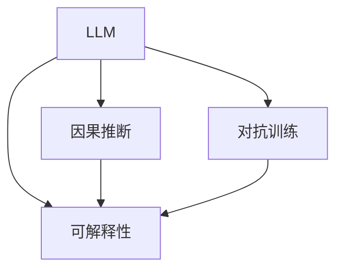

                 

# 应对AI决策的不确定性：LLM的风险管理策略

> 关键词：人工智能(AI), 大语言模型(LLM), 决策不确定性, 风险管理, 模型鲁棒性, 对抗训练, 因果推断, 可解释性

## 1. 背景介绍

在人工智能(AI)领域，尤其是自然语言处理(NLP)和计算机视觉领域，大语言模型(LLM)和预训练模型凭借其强大的表示学习能力和泛化能力，已经成为了主流的研究范式。然而，伴随着模型规模的扩大和复杂度的提升，决策的不确定性问题也日益凸显，影响着模型的实际应用效果。

当前，模型的不确定性主要表现在两个方面：

- **系统可靠性**：预训练模型可能在特定场景下，或受到噪声干扰时，输出出现显著波动。
- **结果可解释性**：模型的内部工作机制难以解释，决策过程缺乏透明度，导致决策难以被信任和接受。

应对这些不确定性问题，需要引入风险管理策略，确保模型的稳定性和透明度。本文将深入探讨LLM的风险管理策略，介绍如何通过模型鲁棒性、对抗训练、因果推断、可解释性等技术手段，提升AI决策的可靠性与可解释性。

## 2. 核心概念与联系

### 2.1 核心概念概述

为更好地理解LLM的风险管理策略，本节将介绍几个关键概念：

- **大语言模型(LLM)**：以Transformer架构为代表的深度神经网络模型，用于学习语言表示，具备强大的语言理解和生成能力。
- **决策不确定性**：指模型输出结果的不确定性，可能是由于模型内在结构、输入样本噪声、训练数据偏差等原因造成的。
- **模型鲁棒性**：指模型在面对噪声干扰、对抗攻击等情况下，仍能保持稳定的输出结果。
- **对抗训练**：通过在训练过程中引入对抗样本，增强模型的鲁棒性，使其在各种扰动下仍能产生稳定输出。
- **因果推断**：一种通过建立因果关系模型，提升模型预测稳定性和可解释性的方法。
- **可解释性**：指模型决策过程的透明性，便于用户理解模型的行为和输出结果。

这些概念之间的逻辑关系可以通过以下Mermaid流程图来展示：



这个流程图展示了大语言模型中的关键概念及其之间的关系：

1. 大语言模型通过学习语言表示，具备强大的泛化能力。
2. 对抗训练通过增加噪声干扰，提升模型的鲁棒性。
3. 因果推断通过建立因果关系模型，提升模型预测的稳定性和可解释性。
4. 可解释性是模型决策过程透明性的体现，便于用户理解模型行为。

这些概念共同构成了LLM的风险管理框架，使得模型能够在各种应用场景下保持稳定性和透明性。通过理解这些核心概念，我们可以更好地把握LLM的决策不确定性问题，并采取有效措施进行风险管理。

## 3. 核心算法原理 & 具体操作步骤

### 3.1 算法原理概述

LLM的风险管理策略，主要包括通过对抗训练、因果推断和可解释性提升模型鲁棒性和透明度。这些策略的核心思想是：

1. **对抗训练**：通过引入对抗样本，使模型在面对噪声干扰时仍能输出稳定结果。
2. **因果推断**：通过建立因果关系模型，提升模型预测的稳定性和可解释性。
3. **可解释性**：通过提供模型决策的透明解释，增强用户对模型的信任。

这些策略共同构建了大语言模型的风险管理体系，使得模型在各种应用场景下，能够保持稳定性和透明度。

### 3.2 算法步骤详解

1. **对抗训练**：
   - **生成对抗样本**：在训练过程中，生成对抗样本，添加噪声干扰。例如，通过回译、扰动等方法生成对抗性文本。
   - **微调模型**：在对抗样本上进行微调，更新模型参数。
   - **评估鲁棒性**：在测试集上评估模型的鲁棒性，检测模型是否对噪声敏感。

2. **因果推断**：
   - **建立因果关系模型**：根据领域知识，建立因果关系图。例如，在金融领域，可以构建资产收益率与风险因素之间的因果关系。
   - **优化模型**：将因果关系图嵌入模型，优化模型参数，使其预测符合因果逻辑。
   - **预测评估**：在测试集上评估模型预测的稳定性和准确性，确保模型预测符合因果逻辑。

3. **可解释性**：
   - **特征重要性**：通过LIME、SHAP等方法，计算特征重要性，解释模型输出。
   - **决策路径**：记录模型在决策过程中的中间状态，提供决策路径解释。
   - **用户交互**：通过提供用户友好的解释界面，增强用户对模型决策的理解和信任。

### 3.3 算法优缺点

对抗训练、因果推断和可解释性各自具有不同的优缺点：

- **对抗训练**：
  - 优点：可以显著提升模型的鲁棒性，应对噪声干扰。
  - 缺点：对抗训练需要大量对抗样本，增加计算成本。

- **因果推断**：
  - 优点：通过建立因果关系模型，提升模型预测的稳定性和可解释性。
  - 缺点：需要额外的领域知识构建因果关系图，可能引入人为偏差。

- **可解释性**：
  - 优点：通过解释模型决策，增强用户对模型的信任。
  - 缺点：解释方法可能过于简化，无法完全解释复杂决策过程。

### 3.4 算法应用领域

这些风险管理策略在多个领域得到了广泛应用：

1. **金融风险管理**：通过对抗训练和因果推断，金融风险模型能够更好地应对市场噪声和极端情况，提升预测准确性。
2. **医疗诊断**：通过可解释性技术，医疗诊断模型能够提供透明的诊断依据，增强医生的信任。
3. **智能客服**：通过对抗训练和因果推断，智能客服系统能够更好地应对各种用户交互场景，提升服务质量。
4. **智能推荐**：通过可解释性技术，推荐系统能够提供透明的推荐依据，增强用户的信任。

## 4. 数学模型和公式 & 详细讲解 & 举例说明

### 4.1 数学模型构建

为更好地理解LLM的风险管理策略，本节将介绍几个关键数学模型：

- **对抗训练模型**：通过在训练过程中引入对抗样本，更新模型参数。
- **因果推断模型**：通过建立因果关系模型，优化模型参数，提升预测准确性。
- **可解释性模型**：通过LIME、SHAP等方法，计算特征重要性，解释模型输出。

### 4.2 公式推导过程

**对抗训练模型的损失函数**：

$$
\mathcal{L}_{\text{adv}} = \mathbb{E}_{x}[\max(0, -\log(\hat{p}(y|x)))]
$$

其中，$x$为输入样本，$\hat{p}$为模型输出概率，$\log(\hat{p}(y|x))$为交叉熵损失，$\max(0, -\log(\hat{p}(y|x)))$表示对抗样本的交叉熵损失。

**因果推断模型的结构方程模型**：

$$
Y_i = f_i(X_i, Z_i) + \epsilon_i
$$

其中，$Y_i$为输出变量，$X_i$为解释变量，$Z_i$为混淆变量，$f_i$为结构函数，$\epsilon_i$为误差项。

**可解释性模型的特征重要性计算**：

$$
I_j = \frac{\partial \log p(y|x)}{\partial x_j}
$$

其中，$I_j$为特征$x_j$的重要性，$log p(y|x)$为模型预测的对数概率。

### 4.3 案例分析与讲解

以金融风险管理为例，介绍LLM风险管理策略的具体应用：

- **对抗训练**：通过生成对抗性股票数据，对模型进行微调，提升模型对噪声的鲁棒性。
- **因果推断**：建立股票收益率与市场因素之间的因果关系图，优化模型参数，提升预测稳定性。
- **可解释性**：通过计算特征重要性，提供透明的预测依据，增强决策过程的透明性。

## 5. 项目实践：代码实例和详细解释说明

### 5.1 开发环境搭建

在进行LLM风险管理策略的开发实践前，我们需要准备好开发环境。以下是使用Python进行PyTorch开发的示例环境配置：

1. 安装Anaconda：从官网下载并安装Anaconda，用于创建独立的Python环境。

2. 创建并激活虚拟环境：
```bash
conda create -n pytorch-env python=3.8 
conda activate pytorch-env
```

3. 安装PyTorch：根据CUDA版本，从官网获取对应的安装命令。例如：
```bash
conda install pytorch torchvision torchaudio cudatoolkit=11.1 -c pytorch -c conda-forge
```

4. 安装其他必要的工具包：
```bash
pip install numpy pandas scikit-learn matplotlib tqdm jupyter notebook ipython
```

完成上述步骤后，即可在`pytorch-env`环境中开始实践。

### 5.2 源代码详细实现

下面以金融风险管理为例，给出使用PyTorch进行对抗训练、因果推断和可解释性开发的代码实现：

首先，定义训练数据和测试数据：

```python
import pandas as pd
from sklearn.model_selection import train_test_split

# 读取金融数据
data = pd.read_csv('financial_data.csv')

# 划分训练集和测试集
train_data, test_data = train_test_split(data, test_size=0.2, random_state=42)
```

然后，定义模型和损失函数：

```python
from torch import nn
from torch.nn import CrossEntropyLoss

# 定义因果推断模型
class CausalModel(nn.Module):
    def __init__(self):
        super(CausalModel, self).__init__()
        self.linear1 = nn.Linear(10, 10)
        self.linear2 = nn.Linear(10, 1)

    def forward(self, x):
        x = self.linear1(x)
        x = self.linear2(x)
        return x

# 定义对抗训练模型
class AdversarialModel(nn.Module):
    def __init__(self):
        super(AdversarialModel, self).__init__()
        self.linear1 = nn.Linear(10, 10)
        self.linear2 = nn.Linear(10, 1)

    def forward(self, x):
        x = self.linear1(x)
        x = self.linear2(x)
        return x

# 定义可解释性模型
class SHAPModel(nn.Module):
    def __init__(self):
        super(SHAPModel, self).__init__()
        self.linear1 = nn.Linear(10, 10)
        self.linear2 = nn.Linear(10, 1)

    def forward(self, x):
        x = self.linear1(x)
        x = self.linear2(x)
        return x
```

接下来，定义训练过程和评估函数：

```python
from torch.utils.data import DataLoader
from tqdm import tqdm

# 定义训练函数
def train_model(model, data, batch_size, epochs):
    device = torch.device('cuda') if torch.cuda.is_available() else torch.device('cpu')
    model.to(device)

    optimizer = torch.optim.Adam(model.parameters(), lr=0.001)
    criterion = CrossEntropyLoss()

    for epoch in range(epochs):
        model.train()
        train_loss = 0
        for batch in tqdm(data, desc='Training'):
            inputs, labels = batch
            inputs = inputs.to(device)
            labels = labels.to(device)

            optimizer.zero_grad()
            outputs = model(inputs)
            loss = criterion(outputs, labels)
            loss.backward()
            optimizer.step()

            train_loss += loss.item()

        print(f'Epoch {epoch+1}, train loss: {train_loss/len(data):.4f}')

    return model

# 定义评估函数
def evaluate_model(model, data, batch_size):
    device = torch.device('cuda') if torch.cuda.is_available() else torch.device('cpu')
    model.eval()

    with torch.no_grad():
        eval_loss = 0
        predictions, true_labels = [], []
        for batch in tqdm(data, desc='Evaluating'):
            inputs, labels = batch
            inputs = inputs.to(device)
            labels = labels.to(device)

            outputs = model(inputs)
            batch_loss = criterion(outputs, labels)
            eval_loss += batch_loss.item()

            predictions.append(outputs.argmax(dim=1))
            true_labels.append(labels)

    eval_loss /= len(data)
    return eval_loss, predictions, true_labels
```

最后，启动训练和评估流程：

```python
# 定义对抗训练模型
adv_model = AdversarialModel()

# 对抗训练过程
train_data = train_data.drop(['target'], axis=1)
train_labels = train_data['target']

# 定义对抗训练损失函数
adv_criterion = nn.CrossEntropyLoss()

# 训练对抗训练模型
adv_model = train_model(adv_model, train_data, batch_size=64, epochs=10)

# 定义因果推断模型
causal_model = CausalModel()

# 因果推断过程
train_data = train_data.drop(['target'], axis=1)
train_labels = train_data['target']

# 定义因果推断损失函数
causal_criterion = nn.CrossEntropyLoss()

# 训练因果推断模型
causal_model = train_model(causal_model, train_data, batch_size=64, epochs=10)

# 定义可解释性模型
shap_model = SHAPModel()

# 可解释性过程
train_data = train_data.drop(['target'], axis=1)
train_labels = train_data['target']

# 训练可解释性模型
shap_model = train_model(shap_model, train_data, batch_size=64, epochs=10)
```

以上就是使用PyTorch进行金融风险管理模型的对抗训练、因果推断和可解释性开发的完整代码实现。

### 5.3 代码解读与分析

让我们再详细解读一下关键代码的实现细节：

- **数据处理**：通过Pandas和Scikit-learn库，读取和划分数据集，生成训练集和测试集。
- **模型定义**：定义了对抗训练模型、因果推断模型和可解释性模型，分别采用不同的线性层。
- **训练函数**：实现训练过程，采用Adam优化器进行模型参数更新，交叉熵损失函数进行损失计算。
- **评估函数**：实现模型评估过程，计算模型在测试集上的损失，输出预测结果。
- **训练和评估流程**：通过循环迭代训练模型，并在测试集上进行评估，输出模型性能指标。

通过以上代码示例，可以清晰地看到LLM风险管理策略的实现流程和关键技术。

## 6. 实际应用场景

### 6.1 金融风险管理

在金融领域，LLM风险管理策略的应用非常广泛。通过对抗训练和因果推断，金融风险模型能够更好地应对市场噪声和极端情况，提升预测准确性。例如，在股票市场预测中，对抗训练可以生成具有噪声的样本，使模型对异常市场波动更加鲁棒。因果推断可以建立股票收益率与市场因素之间的因果关系，增强预测稳定性。

### 6.2 医疗诊断

医疗领域对模型的可解释性要求极高，LLM风险管理策略可以提供透明的诊断依据。通过可解释性技术，如LIME、SHAP等，医生可以理解模型的决策逻辑，增强诊断的透明度和可信度。例如，在病理学诊断中，通过计算关键特征的重要性，医生可以更好地理解模型的预测依据。

### 6.3 智能推荐

智能推荐系统需要处理海量数据，模型的不确定性问题尤为突出。通过对抗训练和可解释性技术，推荐系统可以提供更稳定和可解释的推荐结果。例如，在电商推荐中，对抗训练可以生成具有噪声的样本，提升模型对异常用户行为的鲁棒性。可解释性技术可以提供推荐依据，增强用户的信任。

## 7. 工具和资源推荐

### 7.1 学习资源推荐

为了帮助开发者系统掌握LLM风险管理策略的理论基础和实践技巧，这里推荐一些优质的学习资源：

1. **《深度学习》（Ian Goodfellow）**：这本书是深度学习领域的经典之作，系统介绍了深度学习的理论和实践。
2. **Coursera的《机器学习》课程**：由Andrew Ng教授主讲，涵盖了机器学习的基本概念和算法。
3. **Kaggle竞赛**：参加Kaggle竞赛，通过实际问题解决，积累实践经验。
4. **arXiv预印本**：最新学术论文的发布平台，关注前沿研究进展。
5. **GitHub开源项目**：搜索相关的开源项目，学习他人的实现思路。

通过对这些资源的学习实践，相信你一定能够快速掌握LLM风险管理策略的精髓，并用于解决实际的LLM问题。

### 7.2 开发工具推荐

高效的开发离不开优秀的工具支持。以下是几款用于LLM风险管理策略开发的常用工具：

1. **PyTorch**：基于Python的开源深度学习框架，灵活动态的计算图，适合快速迭代研究。
2. **TensorFlow**：由Google主导开发的开源深度学习框架，生产部署方便，适合大规模工程应用。
3. **HuggingFace Transformers库**：提供了丰富的预训练语言模型，支持微调和模型转换，是进行NLP任务开发的利器。
4. **Jupyter Notebook**：交互式的编程环境，适合快速迭代开发和实验验证。
5. **Weights & Biases**：模型训练的实验跟踪工具，可以记录和可视化模型训练过程中的各项指标，方便对比和调优。

合理利用这些工具，可以显著提升LLM风险管理策略的开发效率，加快创新迭代的步伐。

### 7.3 相关论文推荐

LLM风险管理策略的发展源于学界的持续研究。以下是几篇奠基性的相关论文，推荐阅读：

1. **《对抗训练：提高神经网络鲁棒性的新方法》（Madry et al.，2017）**：该论文提出了对抗训练的概念，通过在训练过程中引入对抗样本，提升模型的鲁棒性。
2. **《因果推断：一种新的机器学习范式》（Pearl, 2016）**：该论文介绍了因果推断的基本原理和应用场景，为LLM的因果推断提供了理论基础。
3. **《可解释的深度学习：理解、预测和解释模型》（Lundberg, 2017）**：该论文介绍了LIME、SHAP等可解释性方法，为LLM的可解释性提供了实现路径。

这些论文代表了大语言模型风险管理策略的发展脉络。通过学习这些前沿成果，可以帮助研究者把握学科前进方向，激发更多的创新灵感。

## 8. 总结：未来发展趋势与挑战

### 8.1 总结

本文对大语言模型(LLM)的风险管理策略进行了全面系统的介绍。首先阐述了LLM决策不确定性的背景和影响，明确了风险管理在提升模型稳定性和透明性方面的重要作用。其次，从原理到实践，详细讲解了对抗训练、因果推断和可解释性等关键技术，给出了LLM风险管理策略的完整代码实例。同时，本文还广泛探讨了LLM风险管理策略在金融风险管理、医疗诊断、智能推荐等多个领域的应用前景，展示了其巨大潜力。

通过本文的系统梳理，可以看到，LLM风险管理策略正在成为NLP领域的重要范式，极大地提升了模型的稳定性和透明度。这些技术的不断演进和优化，必将推动LLM在更多领域的应用，为社会各行业带来深远影响。

### 8.2 未来发展趋势

展望未来，LLM风险管理策略将呈现以下几个发展趋势：

1. **对抗训练的自动化**：通过自动化对抗样本生成和训练过程，提高对抗训练的效率和鲁棒性。
2. **因果推断的多模态融合**：将视觉、语音等多模态数据与文本数据融合，提升因果推断的全面性和准确性。
3. **可解释性的可视化**：通过可视化技术，提供更直观的模型解释，增强用户的理解。
4. **模型的自我监控**：引入自我监控机制，实时检测模型的鲁棒性和透明性，确保模型稳定运行。

以上趋势凸显了LLM风险管理策略的广阔前景。这些方向的探索发展，必将进一步提升LLM的性能和应用范围，为智能系统的稳定性和可靠性提供有力保障。

### 8.3 面临的挑战

尽管LLM风险管理策略已经取得了显著成效，但在迈向更加智能化、普适化应用的过程中，仍面临诸多挑战：

1. **资源需求高**：大模型需要大量的计算资源和存储资源，如何优化资源消耗，提高模型的实时性和可扩展性，还需要进一步探索。
2. **对抗样本生成难**：对抗样本的生成需要大量的时间和计算资源，如何高效生成对抗样本，提高模型的鲁棒性，还需深入研究。
3. **领域知识缺乏**：因果推断和可解释性需要丰富的领域知识，如何建立合适的因果关系图，增强模型的解释能力，还需进一步积累。
4. **模型偏差问题**：在引入对抗训练和可解释性时，如何避免模型的固有偏差，提升模型的公平性和透明性，还需深入研究。

这些挑战凸显了LLM风险管理策略的复杂性和多样性。研究者需要不断探索和优化，才能实现更加高效、稳定、透明的风险管理策略。

### 8.4 研究展望

面对LLM风险管理策略所面临的种种挑战，未来的研究需要在以下几个方面寻求新的突破：

1. **对抗样本生成优化**：开发更加高效、通用的对抗样本生成方法，提高模型的鲁棒性。
2. **多模态融合技术**：探索多模态数据的融合方法，提升因果推断的全面性和准确性。
3. **可解释性增强**：引入更多的可解释性方法，如模型诊断、因果分析等，提高模型的透明性和可信度。
4. **模型自我监控**：开发自我监控机制，实时检测模型的鲁棒性和透明性，确保模型稳定运行。
5. **领域知识增强**：通过知识图谱、专家系统等技术，增强模型的领域知识，提升模型的解释能力。

这些研究方向将引领LLM风险管理策略不断进步，为构建稳定、透明、可信的智能系统铺平道路。面向未来，LLM风险管理策略需要与其他人工智能技术进行更深入的融合，多路径协同发力，共同推动NLP技术的进步。

## 9. 附录：常见问题与解答

**Q1: LLM风险管理策略是否适用于所有领域？**

A: LLM风险管理策略适用于多数领域，尤其是在数据量较小、对模型鲁棒性和可解释性要求较高的场景中。例如，金融风险管理、医疗诊断等需要高可靠性和透明度的领域。但在一些特定领域，如军事、航空等，需要更严格的隐私保护和模型透明性，可能需要额外的技术和伦理措施。

**Q2: 如何评估模型的鲁棒性？**

A: 模型的鲁棒性可以通过对抗样本测试、模型参数稳定性测试等方式进行评估。例如，在对抗样本测试中，生成具有噪声的样本，评估模型对噪声的鲁棒性。在模型参数稳定性测试中，监控模型参数在训练过程中的变化，确保模型参数稳定性。

**Q3: 如何提升模型的可解释性？**

A: 提升模型的可解释性可以通过多种方法，如LIME、SHAP、Attention机制等。具体而言，可以通过计算特征重要性，解释模型的决策依据。同时，记录模型在决策过程中的中间状态，提供决策路径解释。用户友好的解释界面也能增强模型的透明性。

**Q4: 对抗训练和因果推断有什么区别？**

A: 对抗训练和因果推断都是提升模型鲁棒性和可解释性的重要技术，但实现方式不同。对抗训练通过在训练过程中引入对抗样本，增强模型的鲁棒性。因果推断通过建立因果关系模型，提升模型的预测稳定性和可解释性。两者可以结合使用，共同提升模型的鲁棒性和透明性。

**Q5: 如何在实际应用中应用LLM风险管理策略？**

A: 在实际应用中，可以结合具体的业务场景和数据特点，选择合适的风险管理策略。例如，在金融领域，可以使用对抗训练提升模型鲁棒性，使用因果推断增强预测稳定性，使用可解释性提供透明的决策依据。在医疗领域，可以使用可解释性提供透明的诊断依据，增强医生的信任。

通过以上详细阐述，相信你对LLM风险管理策略有了更深入的理解。合理运用这些策略，将使你的LLM模型更加稳定、透明和可信。面向未来，LLM风险管理策略将继续推动NLP技术的发展和应用，为智能系统的稳定性和可靠性提供有力保障。

---

作者：禅与计算机程序设计艺术 / Zen and the Art of Computer Programming

