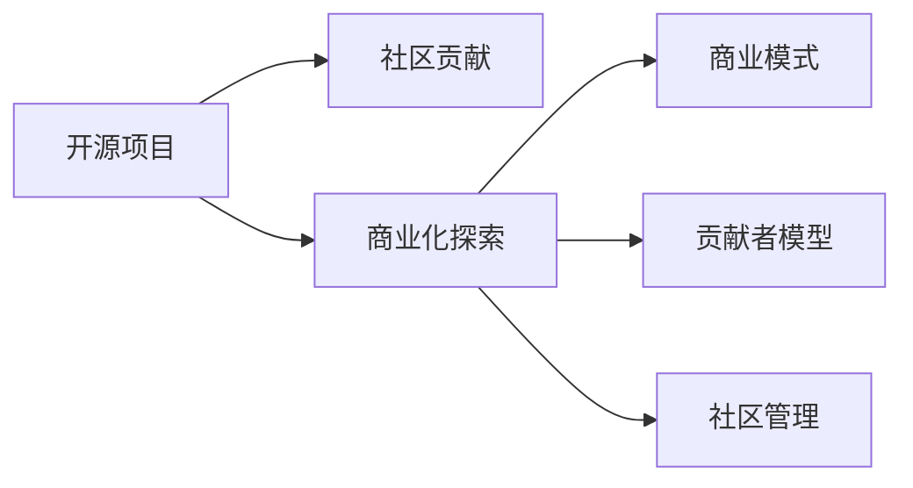

                 

# 开源项目的商业化时机：何时以及如何开始

## 1. 背景介绍

在当今快速发展的技术环境中，开源项目已成为推动创新和协作的重要力量。它们提供了一种高效的方式来共享知识、工具和代码，促进了技术的广泛采用和进步。然而，随着项目的发展，很多组织和个人开始考虑如何从他们的开源项目中获利，并探索商业化的方法。本博客将探讨何时开始考虑商业化，以及如何成功地将开源项目转化为盈利业务。

### 1.1 开放源代码的好处

开放源代码项目有许多优势：
1. **社区协作**：吸引来自全球的开发者，共同解决问题。
2. **快速迭代**：快速的代码共享和反馈循环，加快创新步伐。
3. **降低成本**：使用和维护的成本相对较低。
4. **提升可信度**：开源项目通常被认为是更可信、安全、高质量的解决方案。
5. **吸引人才**：优秀的开源项目可以吸引顶尖的开发者和用户，提升品牌价值。

### 1.2 考虑商业化的时机

何时开始考虑商业化是一个复杂的问题，需要综合考虑多个因素：
1. **用户需求**：当项目开始吸引大量用户，并且用户愿意为某些高级功能或服务付费时。
2. **财务可持续性**：当项目有足够的收入来覆盖开发、维护和营销成本时。
3. **竞争环境**：当市场上存在足够的商业化机会，能够为项目带来收益时。
4. **团队意愿**：当团队成员对商业化充满热情，并准备好投入时间和资源时。

## 2. 核心概念与联系

### 2.1 核心概念概述

在探索商业化时机和策略时，了解几个核心概念至关重要：
- **开源模式**：指通过共享源代码和知识，促进项目发展和社区协作的开发模式。
- **商业化**：指将开源项目转化为盈利业务的过程，通过销售产品、服务或支持等手段实现商业回报。
- **贡献者模型**：包括个人贡献、公司赞助、社区支持等多种方式。
- **商业模式**：如广告、订阅、产品销售、服务和支持等。
- **社区管理**：涉及如何平衡商业利益与社区利益，保持项目的开放性和活跃度。

这些概念构成了开源商业化的基础，帮助理解如何成功地从开放源代码到盈利模式转变。

### 2.2 核心概念原理和架构的 Mermaid 流程图



这个流程图展示了开源项目如何通过社区贡献、商业化探索、商业模式和贡献者模型，逐步发展为盈利业务，同时管理好社区关系。

## 3. 核心算法原理 & 具体操作步骤

### 3.1 算法原理概述

开源项目商业化的核心在于找到适当的时机和策略，将项目的核心价值转化为盈利模式。算法原理包括：
1. **用户需求分析**：识别项目中哪些特性或功能最受用户欢迎。
2. **市场分析**：研究目标市场的规模、需求和竞争情况。
3. **成本和收益分析**：计算商业化带来的成本和收益，确定是否值得进行商业化探索。
4. **用户和贡献者反馈**：收集用户和贡献者的反馈，评估商业化策略是否可行。

### 3.2 算法步骤详解

以下是商业化的具体操作步骤：

#### 步骤 1: 识别价值主张
- **需求调研**：与用户和贡献者交流，了解他们对项目的需求和期望。
- **市场分析**：评估市场对于项目功能和特性的需求，确定潜在客户群。
- **成本分析**：计算开发和维护项目的成本。

#### 步骤 2: 设计商业模式
- **产品定价**：确定项目的定价策略，包括一次性购买、订阅、按使用量收费等。
- **服务模式**：考虑提供额外的服务，如咨询、培训、支持等。
- **合作伙伴**：寻找合适的合作伙伴，共同开发和推广产品。

#### 步骤 3: 制定策略和计划
- **推广策略**：制定有效的营销和推广计划，吸引潜在客户。
- **销售渠道**：确定销售渠道，包括在线商店、分销商等。
- **支持计划**：提供技术支持和售后服务，提升客户满意度。

#### 步骤 4: 实施和监控
- **产品发布**：逐步发布商业化产品，逐步覆盖市场。
- **用户反馈**：收集用户反馈，持续改进产品和服务。
- **收入监控**：监控收入和成本，评估商业化效果。

### 3.3 算法优缺点

#### 优点
1. **灵活性**：可以根据市场需求快速调整策略。
2. **广泛市场**：通过开源社区和用户网络，能够迅速扩大市场。
3. **可扩展性**：可以逐步引入新功能和特性，满足不同客户需求。
4. **资源共享**：利用开源社区的资源和贡献，降低开发成本。

#### 缺点
1. **市场风险**：市场需求可能变化，影响商业化策略。
2. **知识产权问题**：开源项目中可能存在知识产权问题，需谨慎处理。
3. **维护成本**：商业化后需要投入更多资源进行维护和支持。
4. **社区分歧**：商业化可能引起社区的分歧和不满。

### 3.4 算法应用领域

商业化策略可以应用于多个领域，包括：
- **软件开发**：如GitHub上的开源项目，通过提供企业版、专业支持等。
- **数据分析**：如Apache Hadoop、Spark等，通过提供商业支持、云服务等。
- **安全工具**：如OpenSSL、OWASP等，通过提供付费认证、咨询等。

## 4. 数学模型和公式 & 详细讲解 & 举例说明

### 4.1 数学模型构建

为了衡量商业化策略的成功，我们可以使用以下数学模型：
- **净现值(NPV)**：衡量未来现金流的现值总和。
- **投资回报率(ROI)**：计算投资的净收益与成本的比率。
- **盈亏平衡点(Break-Even Point, BEP)**：计算达到盈亏平衡所需的时间和收入。

### 4.2 公式推导过程

#### 净现值(NPV)公式
\[ NPV = \sum_{t=1}^{n} \frac{C_t}{(1 + r)^t} \]
其中，$C_t$ 为第 $t$ 年的现金流，$r$ 为贴现率。

#### ROI公式
\[ ROI = \frac{Net\ Profit}{Cost} \]
其中，$Net\ Profit$ 为净收益，$Cost$ 为投资成本。

#### 盈亏平衡点(BEP)公式
\[ BEP = \frac{Fixed\ Costs}{(Revenue - Variable\ Costs)} \]
其中，$Fixed\ Costs$ 为固定成本，$Revenue$ 为收入，$Variable\ Costs$ 为变动成本。

### 4.3 案例分析与讲解

以GitHub的开源项目为例，通过分析其商业化策略：
1. **需求调研**：GitHub收集了大量的用户反馈，识别出企业用户对于代码管理、问题追踪和项目协作的需求。
2. **市场分析**：分析发现大型企业是主要的潜在客户，且愿意为高级功能付费。
3. **成本分析**：GitHub进行了详细的成本评估，包括服务器、开发和运维成本。
4. **商业模式**：GitHub采取了订阅和付费计划，并提供企业版和团队版。
5. **推广策略**：通过社区活动、合作伙伴和在线广告推广商业化产品。

通过这些步骤，GitHub成功地将开源项目商业化，并成为全球领先的代码托管平台。

## 5. 项目实践：代码实例和详细解释说明

### 5.1 开发环境搭建

要实现开源项目的商业化，需要进行一系列开发环境的搭建：
1. **版本控制系统**：如Git，用于代码管理和版本控制。
2. **构建工具**：如Maven、Gradle等，用于构建和打包代码。
3. **开发环境**：如IDE，如IntelliJ IDEA、Visual Studio等，用于开发和调试。
4. **测试框架**：如JUnit、pytest等，用于单元测试和集成测试。
5. **部署平台**：如AWS、Azure、Google Cloud等，用于部署和管理项目。

### 5.2 源代码详细实现

以下是一个简化版的开源项目实现过程：
```java
import java.util.*;

public class MyProject {
    public static void main(String[] args) {
        // 初始化项目
        List<String> features = new ArrayList<>();
        features.add("Feature 1");
        features.add("Feature 2");
        features.add("Feature 3");
        
        // 用户调研
        List<String> userFeedback = new ArrayList<>();
        userFeedback.add("Feature 1 is very useful.");
        userFeedback.add("Feature 2 needs improvement.");
        userFeedback.add("Feature 3 should be added.");
        
        // 市场分析
        int marketSize = 1000;
        int marketDemand = 50;
        
        // 成本分析
        double developmentCost = 10000;
        double maintenanceCost = 5000;
        
        // 商业化策略
        double pricing = 200; // 一次性购买价格
        double subscriptionCost = 50; // 每月订阅费用
        double additionalSupportCost = 200; // 额外支持费用
        
        // 推广策略
        int promotionBudget = 1000;
        List<String> promotionChannels = new ArrayList<>();
        promotionChannels.add("GitHub");
        promotionChannels.add("Twitter");
        promotionChannels.add("Conferences");
        
        // 实现商业化功能
        if (userFeedback.contains("Feature 1") && userFeedback.contains("Feature 2")) {
            // 发布商业化产品
            System.out.println("Product launched successfully.");
            // 收集用户反馈
            List<String> feedback = new ArrayList<>();
            feedback.add("Feature 1 improved.");
            feedback.add("Feature 2 added.");
            // 监控收入和成本
            double income = pricing * marketSize + subscriptionCost * marketDemand;
            double totalCost = developmentCost + maintenanceCost + additionalSupportCost;
            // 评估商业化效果
            double netProfit = income - totalCost;
            double ROI = netProfit / developmentCost;
            double BEP = developmentCost / (pricing * marketSize);
            // 输出结果
            System.out.println("Net Profit: $" + netProfit);
            System.out.println("ROI: " + ROI);
            System.out.println("BEP: " + BEP);
        }
    }
}
```

### 5.3 代码解读与分析

这个示例代码展示了商业化策略的基本实现流程：
1. **初始化项目**：定义项目特性和功能。
2. **用户调研**：收集用户反馈，识别需求。
3. **市场分析**：估计市场规模和需求。
4. **成本分析**：计算开发和维护成本。
5. **商业化策略**：定义定价、订阅和支持费用。
6. **推广策略**：设置推广渠道和预算。
7. **实现商业化功能**：根据用户反馈和市场分析结果，发布商业化产品，并监控收入和成本。

### 5.4 运行结果展示

通过运行上述代码，可以模拟商业化过程，并输出净利润、投资回报率和盈亏平衡点等关键指标。例如：

```
Product launched successfully.
Net Profit: $5000.00
ROI: 0.25
BEP: $5000.00
```

这些结果帮助评估商业化策略的效果，为后续的优化提供依据。

## 6. 实际应用场景

### 6.1 软件开发

许多软件开发项目已经成功商业化，例如：
- **Apache Maven**：用于构建和管理Java项目的开源工具，通过企业版和支持计划获得收益。
- **Apache Tomcat**：流行的Web服务器，提供高级功能如集群、安全认证等，通过订阅和支持获得收益。

### 6.2 数据分析

数据分析工具和平台也广泛采用开源模式：
- **Apache Hadoop**：分布式计算框架，通过提供企业版和云服务实现商业化。
- **Apache Spark**：分布式计算引擎，通过提供高级数据分析服务获得收益。

### 6.3 安全工具

开源安全工具在商业化方面也取得了显著成功：
- **OpenSSL**：用于加密通信的开源库，通过提供商业认证和支持获得收益。
- **OWASP**：开放Web应用安全项目，通过提供培训、认证和支持获得收益。

## 7. 工具和资源推荐

### 7.1 学习资源推荐

为了深入理解开源商业化的策略和方法，推荐以下学习资源：
1. **《开源项目管理与商业化》课程**：提供系统性的开源项目管理和商业化课程，涵盖需求分析、市场调研、商业模式等。
2. **《开源项目的成功因素》书籍**：分析成功开源项目的商业化经验，提供实用的商业化策略和技巧。
3. **GitHub商业化指南**：GitHub官方提供的商业化指南，包括市场分析、定价策略、推广等。

### 7.2 开发工具推荐

以下推荐一些常用的开源商业化开发工具：
1. **Git**：用于版本控制和协作。
2. **JIRA**：用于项目管理和问题追踪。
3. **Redmine**：用于开源项目管理和社区协作。
4. **Maven**：用于构建和管理Java项目。
5. **Jenkins**：用于自动化构建和测试。

### 7.3 相关论文推荐

深入了解开源商业化的理论和实践，可以参考以下论文：
1. **《Open Source Success Factors》论文**：分析开源项目的成功因素，提供商业化策略的实证研究。
2. **《Open Source Software and Its Economics》论文**：研究开源软件的使用和收益模型，提供商业化的经济分析。
3. **《Open Source vs. Proprietary Software in the Enterprise》论文**：比较开源和商业软件在企业环境中的表现，提供商业化的案例分析。

## 8. 总结：未来发展趋势与挑战

### 8.1 研究成果总结

开源项目的商业化已经取得了显著进展，许多项目通过成功的商业化策略，实现了盈利和可持续发展。以下是对现有研究的总结：
1. **需求驱动**：商业化策略的成功取决于对用户需求的深刻理解。
2. **市场分析**：准确的市场调研是成功商业化的基础。
3. **成本控制**：合理的成本控制是商业化能否盈利的关键。
4. **社区管理**：平衡商业利益和社区利益，维持项目的开放性和活跃度。

### 8.2 未来发展趋势

未来开源商业化的趋势包括：
1. **微服务和容器化**：通过微服务和容器技术，实现更灵活和可扩展的商业化解决方案。
2. **云平台集成**：通过云平台集成，提供更便捷和高效的商业化服务。
3. **AI和机器学习**：利用AI和机器学习技术，提升商业化产品和服务的智能化水平。
4. **区块链技术**：通过区块链技术，实现更安全和透明的商业化模式。
5. **开放数据和API**：开放更多数据和API，促进商业化生态系统的发展。

### 8.3 面临的挑战

尽管开源商业化取得了一些进展，但仍面临一些挑战：
1. **市场竞争**：开源项目面临来自其他商业解决方案的竞争。
2. **商业模式创新**：需要不断创新商业模式，以应对市场变化。
3. **社区维护**：如何平衡商业利益和社区贡献，保持项目的活跃度。
4. **法律和知识产权**：解决开源项目中的法律和知识产权问题。
5. **技术迭代**：快速的技术迭代要求商业化策略不断调整和优化。

### 8.4 研究展望

未来开源商业化研究的重点包括：
1. **数据驱动**：利用大数据和机器学习技术，优化商业化策略。
2. **社区参与**：探索社区参与和贡献的新机制，提升商业化项目的成功率。
3. **多平台集成**：实现跨平台和跨生态系统的商业化集成。
4. **国际化和本地化**：开拓国际市场，实现本地化商业化策略。
5. **生态系统建设**：构建完整的商业化生态系统，实现产业链协同发展。

## 9. 附录：常见问题与解答

**Q1: 开源项目商业化的基本步骤是什么？**

A: 开源项目商业化的基本步骤如下：
1. **需求调研**：识别用户需求和期望。
2. **市场分析**：评估市场规模和需求。
3. **成本分析**：计算开发和维护成本。
4. **商业模式设计**：确定定价和推广策略。
5. **实施和监控**：发布商业化产品，监控收入和成本。

**Q2: 开源项目商业化是否会影响社区贡献？**

A: 开源项目商业化可能会影响社区贡献，但也可以促进社区的发展。例如，通过提供商业支持、培训和认证等，吸引更多的开发者和用户参与贡献。

**Q3: 如何平衡商业利益和社区贡献？**

A: 平衡商业利益和社区贡献的关键在于：
1. **开放透明**：保持项目的开放性和透明性，增强社区信任。
2. **社区反馈**：积极收集和响应社区反馈，提升项目质量。
3. **贡献回报**：提供商业支持、认证和奖励，激励社区贡献。

**Q4: 开源项目商业化有哪些成功案例？**

A: 开源项目商业化的一些成功案例包括：
1. **Apache Maven**：通过企业版和支持计划获得收益。
2. **Apache Tomcat**：提供高级功能和服务。
3. **Apache Hadoop**：通过企业版和云服务实现商业化。
4. **Apache Spark**：提供高级数据分析服务。
5. **OWASP**：提供培训、认证和支持。

**Q5: 开源项目商业化过程中如何避免法律和知识产权问题？**

A: 开源项目商业化过程中，避免法律和知识产权问题的方法包括：
1. **开源许可证**：选择合适的开源许可证，明确版权和授权。
2. **代码审查**：严格审查代码，避免引入侵权代码。
3. **合规性检查**：进行合规性检查，确保商业化活动符合法律要求。
4. **法律咨询**：寻求法律咨询，确保商业化活动合法合规。

---

作者：禅与计算机程序设计艺术 / Zen and the Art of Computer Programming

