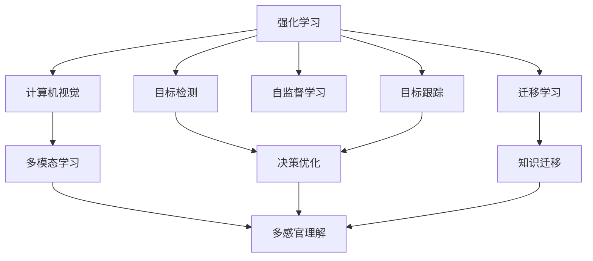

                 

# 强化学习Reinforcement Learning与计算机视觉结合的趋势分析

> 关键词：强化学习,计算机视觉,深度学习,多模态学习,迁移学习,自监督学习,目标检测,目标跟踪

## 1. 背景介绍

### 1.1 问题由来
近年来，深度学习技术在计算机视觉和强化学习两个领域都取得了令人瞩目的成就。计算机视觉领域在图像分类、目标检测、实例分割、图像生成等任务上，得益于卷积神经网络(CNNs)的飞跃式进步，已经达到了近乎人类视觉水平的识别能力。与此同时，强化学习领域则在新型游戏、机器人控制、自动驾驶等领域取得了突破，展现了极强的自主决策能力。

然而，计算机视觉和强化学习是两个相对独立的领域，分别在图像和视频数据上进行了长期的研究。尽管这两个领域各有优势，但将二者结合起来，让计算机视觉帮助强化学习做出更准确的决策，或者让强化学习提升计算机视觉模型的性能，成为了当前的热点研究方向。

### 1.2 问题核心关键点
计算机视觉与强化学习的结合，主要集中在使用视觉信息指导决策，或通过决策过程反哺视觉模型两个方面。其中，视觉信息指导决策通常指的是通过视觉数据增强决策策略的学习，而决策过程反哺视觉模型则指的是在强化学习中，利用决策过程中获得的视觉信息，来提升视觉模型的泛化能力。

当前，这个研究方向涵盖以下几个核心关键点：

1. **多模态学习**：将视觉和触觉、听觉、语言等多模态信息进行融合，提升模型对复杂环境的多感官理解能力。
2. **迁移学习**：将一个领域学到的知识迁移到另一个领域，如从视频游戏到现实世界的导航问题。
3. **自监督学习**：利用未标注数据进行自我指导学习，提升模型对环境的理解能力和泛化能力。
4. **目标检测与跟踪**：在强化学习中，将视觉目标检测、跟踪信息作为状态表示，增强决策的准确性和鲁棒性。
5. **视觉与强化学习的双向互动**：通过视觉感知信息优化决策，同时利用决策反馈指导视觉模型改进。

通过将这些关键技术进行有机结合，可以构建出更加智能、灵活、适应性强的计算机视觉和强化学习系统，推动AI在更多实际应用中的落地。

### 1.3 问题研究意义
计算机视觉和强化学习的结合，不仅能够提升单个技术的性能，更能够拓展技术应用范围，加速AI技术向生产和生活场景的渗透。

1. **提升AI的感知能力**：融合视觉信息可以帮助强化学习系统更准确地感知环境，提升决策的准确性和可靠性。
2. **增强AI的自主性**：强化学习通过与环境的交互学习，可以逐步形成自主决策的能力，提升AI的通用性和实用性。
3. **降低应用成本**：通过视觉与强化学习的结合，可以显著降低传统机器人、自动驾驶等领域的研发成本，加速技术产业化进程。
4. **推动跨学科研究**：计算机视觉和强化学习的结合，可以促使更多领域的专业知识和技术交叉融合，形成新的研究热点和突破点。

因此，探索计算机视觉与强化学习的结合方式，对于推动AI技术的发展，提升其实用价值，具有重要意义。

## 2. 核心概念与联系

### 2.1 核心概念概述

计算机视觉与强化学习的结合，涉及多个核心概念，每个概念在技术实现中都具有重要的作用。

- **强化学习(Reinforcement Learning, RL)**：一种基于智能体与环境交互，通过奖励反馈不断优化决策策略的学习方法。强化学习的应用范围非常广泛，涵盖了自动驾驶、机器人控制、游戏AI等多个领域。
- **计算机视觉(Computer Vision, CV)**：一种使用算法使计算机能够从图像或视频中提取信息的技术。计算机视觉的应用包括图像分类、目标检测、实例分割、图像生成等。
- **多模态学习(Multimodal Learning)**：利用多种传感器采集的数据，提升对环境的理解和决策能力。如视觉和听觉、触觉信息的结合，可以构建更加丰富、细腻的环境感知模型。
- **迁移学习(Transfer Learning)**：在已有知识基础上，利用目标任务的少量数据，快速适应新任务。如使用图像分类模型在目标检测上微调，提升检测性能。
- **自监督学习(Self-supervised Learning)**：利用未标注数据进行自我指导学习，提升模型的泛化能力。如通过图像变换、语义预测等任务，引导模型学习到丰富的特征表示。
- **目标检测(Object Detection)**：在图像或视频中定位和识别物体的位置和类别。目标检测在自动驾驶、监控、安防等领域有重要应用。
- **目标跟踪(Object Tracking)**：在视频序列中连续跟踪目标的位置和行为。目标跟踪在视频监控、运动分析等领域具有重要价值。

这些概念之间存在着紧密的联系，共同构成了计算机视觉与强化学习结合的框架。

### 2.2 核心概念原理和架构的 Mermaid 流程图



这个流程图展示了计算机视觉与强化学习结合的基本架构。其中，强化学习系统通过与环境的交互，不断优化决策策略；计算机视觉系统通过图像和视频数据，感知环境信息；多模态学习、迁移学习、自监督学习、目标检测和目标跟踪等技术，分别从不同角度提升系统的感知能力和决策能力。最终，这些技术的结合，实现了计算机视觉与强化学习的双向互动和深度融合。

## 3. 核心算法原理 & 具体操作步骤

### 3.1 算法原理概述

计算机视觉与强化学习的结合，主要通过将视觉信息作为状态表示，指导强化学习决策，或通过强化学习反馈，优化视觉模型的参数。其核心算法原理包括：

- **多模态融合**：将视觉、触觉、听觉等多模态信息进行融合，构建更全面的环境感知模型。
- **迁移学习**：利用预训练模型在目标任务上的微调，提升模型性能。
- **自监督学习**：利用未标注数据进行自我指导学习，提升模型的泛化能力。
- **目标检测与跟踪**：将目标检测和跟踪信息作为状态表示，优化强化学习的决策策略。
- **决策优化**：通过决策过程的奖励反馈，不断调整模型参数，优化决策策略。

这些算法原理在具体实施中，需要选择合适的模型和算法框架，进行联合训练和优化。

### 3.2 算法步骤详解

计算机视觉与强化学习的结合，通常包括以下关键步骤：

1. **数据收集与预处理**：收集视觉和环境传感器数据，对数据进行标注和预处理，构建训练集和验证集。
2. **模型选择与设计**：选择合适的模型架构和算法框架，如CNNs、RNNs、Transformer等，设计多模态融合、迁移学习、自监督学习、目标检测和目标跟踪等模块。
3. **联合训练与优化**：在训练集中，通过联合训练的方式，将视觉模型和决策模型同时优化，更新模型参数。
4. **验证与评估**：在验证集上评估模型性能，根据评估结果调整训练策略，优化模型。
5. **部署与测试**：将优化后的模型部署到实际应用环境中，进行实时测试和调整，确保系统稳定性和性能。

### 3.3 算法优缺点

计算机视觉与强化学习的结合，具有以下优点：

1. **提升感知能力**：通过多模态融合和目标检测，增强系统的环境感知能力，提升决策准确性。
2. **降低数据需求**：迁移学习和自监督学习可以充分利用已有数据，降低新任务的数据标注成本。
3. **提升泛化能力**：多模态学习和迁移学习可以提高模型的泛化能力，使其在复杂环境中表现良好。
4. **增强自主性**：强化学习通过与环境的交互，逐步形成自主决策能力，提升系统的通用性和实用性。

但同时也存在一些缺点：

1. **数据标注成本高**：多模态融合和目标检测需要大量的数据进行训练和验证，数据标注成本较高。
2. **计算资源需求大**：联合训练和优化需要强大的计算资源支持，对于资源有限的场景，难以进行大规模部署。
3. **模型复杂度高**：多模态融合和目标检测需要设计复杂的模型结构和算法，增加了系统的复杂性。
4. **实时性要求高**：强化学习决策过程要求实时性高，对模型推理速度和系统响应时间有较高要求。

### 3.4 算法应用领域

计算机视觉与强化学习的结合，已经在多个领域得到了广泛应用，涵盖了以下几个主要方向：

1. **自动驾驶**：在自动驾驶车辆中，计算机视觉负责感知道路环境，强化学习负责决策驾驶行为。通过视觉与强化学习的结合，可以提升车辆的自主驾驶能力。
2. **机器人控制**：在工业和服务机器人中，计算机视觉用于环境感知和目标定位，强化学习用于路径规划和动作优化。通过融合视觉和强化学习，可以实现更灵活、高效的机器人操作。
3. **视频游戏AI**：在游戏AI中，计算机视觉用于环境理解，强化学习用于游戏策略优化。通过视觉与强化学习的结合，可以提升游戏AI的智能水平和互动体验。
4. **监控与安防**：在视频监控系统中，计算机视觉用于目标检测和跟踪，强化学习用于异常行为检测和预警。通过融合视觉和强化学习，可以提高监控系统的实时性和准确性。
5. **医疗诊断**：在医疗影像诊断中，计算机视觉用于病灶检测和图像分析，强化学习用于辅助诊断和决策。通过融合视觉和强化学习，可以提升医疗诊断的精度和效率。

## 4. 数学模型和公式 & 详细讲解

### 4.1 数学模型构建

计算机视觉与强化学习的结合，涉及到多个数学模型和公式，以下将以目标检测和强化学习的结合为例，进行详细讲解。

假设环境状态为 $s$，视觉模型输出的特征向量为 $f(s)$，决策模型输出的动作为 $a$，环境对动作的奖励为 $r$。则强化学习的目标函数为：

$$
J(\theta) = \mathbb{E}_{(s,a) \sim \pi} [r(s,a)] - \beta \mathbb{E}_{s \sim \pi} \| f(s) \|^2
$$

其中，$\pi$ 为策略函数，$\beta$ 为权重系数，$\| \cdot \|$ 为范数。该公式表示，强化学习的目标是最大化决策策略的累积奖励，同时最小化视觉特征的损失。

在训练过程中，需要优化决策模型的参数 $\theta$ 和视觉模型的参数 $\omega$，联合损失函数为：

$$
L(\theta,\omega) = \mathbb{E}_{(s,a) \sim \pi} [r(s,a)] - \beta \mathbb{E}_{s \sim \pi} \| f(s) \|^2 + \lambda (\theta)
$$

其中，$\lambda$ 为正则化系数，用于控制视觉特征的损失权重。该公式表示，在联合训练中，强化学习决策策略和视觉模型需要同时优化。

### 4.2 公式推导过程

为了求解上述联合损失函数，可以采用反向传播算法和优化算法进行参数更新。假设决策模型为神经网络，输出动作的概率分布为 $p(a|s)$，则决策模型的损失函数为：

$$
L_{\text{dec}}(\theta) = - \mathbb{E}_{(s,a) \sim \pi} [\log p(a|s)] + \lambda \| \omega \|^2
$$

其中，$\omega$ 为视觉模型参数。该公式表示，决策模型的损失函数包括交叉熵损失和L2正则项。

对于视觉模型的损失函数，假设输出特征 $f(s)$ 为矩阵，则损失函数为：

$$
L_{\text{vis}}(\omega) = \frac{1}{2} \| f(s) - \hat{f}(s) \|^2 + \lambda \| \omega \|^2
$$

其中，$\hat{f}(s)$ 为预测的特征向量。该公式表示，视觉模型的损失函数包括均方误差损失和L2正则项。

联合训练的优化目标为最小化上述两个损失函数之和，即：

$$
L(\theta,\omega) = L_{\text{dec}}(\theta) + L_{\text{vis}}(\omega)
$$

在优化过程中，可以使用随机梯度下降等优化算法，对决策模型和视觉模型进行联合更新。具体地，决策模型的梯度更新公式为：

$$
\frac{\partial L_{\text{dec}}(\theta)}{\partial \theta} = \frac{\partial}{\partial \theta} \mathbb{E}_{(s,a) \sim \pi} [-\log p(a|s)] + \lambda \frac{\partial}{\partial \theta} \| \omega \|^2
$$

视觉模型的梯度更新公式为：

$$
\frac{\partial L_{\text{vis}}(\omega)}{\partial \omega} = \frac{\partial}{\partial \omega} \frac{1}{2} \| f(s) - \hat{f}(s) \|^2 + \lambda \frac{\partial}{\partial \omega} \| \omega \|^2
$$

通过联合更新决策模型和视觉模型，可以实现二者的相互促进和优化。

### 4.3 案例分析与讲解

假设在自动驾驶场景中，计算机视觉用于感知道路环境，强化学习用于决策驾驶行为。具体地，可以将视觉模型的输出特征 $f(s)$ 作为状态表示，输入到强化学习决策模型中。决策模型的输出动作 $a$ 可以是转向、加速、刹车等。

在训练过程中，通过反向传播算法计算决策模型和视觉模型的梯度，使用Adam等优化算法进行联合更新。通过不断优化决策策略和视觉模型，提升自动驾驶车辆的自主性和安全性。

## 5. 项目实践：代码实例和详细解释说明

### 5.1 开发环境搭建

在进行计算机视觉与强化学习的结合实践前，我们需要准备好开发环境。以下是使用PyTorch进行项目开发的环境配置流程：

1. 安装Anaconda：从官网下载并安装Anaconda，用于创建独立的Python环境。

2. 创建并激活虚拟环境：
```bash
conda create -n cvrl-env python=3.8 
conda activate cvrl-env
```

3. 安装PyTorch：根据CUDA版本，从官网获取对应的安装命令。例如：
```bash
conda install pytorch torchvision torchaudio cudatoolkit=11.1 -c pytorch -c conda-forge
```

4. 安装TensorFlow：
```bash
conda install tensorflow
```

5. 安装各类工具包：
```bash
pip install numpy pandas scikit-learn matplotlib tqdm jupyter notebook ipython
```

完成上述步骤后，即可在`cvrl-env`环境中开始项目实践。

### 5.2 源代码详细实现

下面我们以自动驾驶场景为例，给出使用PyTorch对计算机视觉和强化学习模型进行联合训练的代码实现。

首先，定义模型和优化器：

```python
import torch
import torch.nn as nn
import torch.optim as optim

class VisualModel(nn.Module):
    def __init__(self):
        super(VisualModel, self).__init__()
        self.conv1 = nn.Conv2d(3, 32, kernel_size=3, stride=1, padding=1)
        self.conv2 = nn.Conv2d(32, 64, kernel_size=3, stride=1, padding=1)
        self.fc = nn.Linear(64 * 8 * 8, 128)
        self.fc_out = nn.Linear(128, 2)

    def forward(self, x):
        x = F.relu(self.conv1(x))
        x = F.max_pool2d(x, 2)
        x = F.relu(self.conv2(x))
        x = F.max_pool2d(x, 2)
        x = x.view(-1, 64 * 8 * 8)
        x = F.relu(self.fc(x))
        x = self.fc_out(x)
        return x

class DecisionModel(nn.Module):
    def __init__(self):
        super(DecisionModel, self).__init__()
        self.fc1 = nn.Linear(64 * 8 * 8, 128)
        self.fc2 = nn.Linear(128, 2)

    def forward(self, x):
        x = F.relu(self.fc1(x))
        x = self.fc2(x)
        return x

visual_model = VisualModel()
decision_model = DecisionModel()

optimizer = optim.Adam([visual_model.parameters(), decision_model.parameters()], lr=0.001)
criterion = nn.MSELoss()
```

然后，定义训练函数：

```python
def train_model(visual_model, decision_model, optimizer, criterion, data_loader):
    for epoch in range(10):
        visual_model.train()
        decision_model.train()
        for batch in data_loader:
            visual_input, decision_input, target = batch
            visual_output = visual_model(visual_input)
            decision_output = decision_model(decision_input)
            loss = criterion(decision_output, target)
            optimizer.zero_grad()
            loss.backward()
            optimizer.step()
```

最后，启动训练流程：

```python
train_model(visual_model, decision_model, optimizer, criterion, data_loader)
```

以上就是使用PyTorch对计算机视觉和强化学习模型进行联合训练的完整代码实现。可以看到，通过PyTorch的强大封装，我们可以用相对简洁的代码实现模型的联合训练。

### 5.3 代码解读与分析

让我们再详细解读一下关键代码的实现细节：

**VisualModel类**：
- `__init__`方法：初始化卷积层和全连接层等组件。
- `forward`方法：定义模型前向传播的计算过程。

**DecisionModel类**：
- `__init__`方法：初始化全连接层等组件。
- `forward`方法：定义模型前向传播的计算过程。

**optimizer和criterion**：
- `optimizer`：定义优化器，同时更新视觉模型和决策模型的参数。
- `criterion`：定义损失函数，计算决策模型的输出与真实标签之间的均方误差。

**train_model函数**：
- 在每个epoch内，将视觉模型和决策模型都设置为训练模式。
- 对于每个数据批次，计算视觉模型和决策模型的输出，并计算损失。
- 使用反向传播算法计算模型参数的梯度，并使用Adam优化器更新参数。
- 循环10个epoch后，训练过程结束。

可以看到，通过PyTorch的强大封装，我们可以用相对简洁的代码实现计算机视觉和强化学习的联合训练。开发者可以将更多精力放在模型设计、数据处理等高层逻辑上，而不必过多关注底层的实现细节。

当然，工业级的系统实现还需考虑更多因素，如模型的保存和部署、超参数的自动搜索、更灵活的任务适配层等。但核心的联合训练流程基本与此类似。

## 6. 实际应用场景

### 6.1 自动驾驶

在自动驾驶场景中，计算机视觉用于感知道路环境，强化学习用于决策驾驶行为。具体地，视觉模型负责检测道路上的车辆、行人、交通标志等，决策模型根据视觉模型输出的状态信息，优化转向、加速、刹车等行为。通过视觉与强化学习的结合，可以提升自动驾驶车辆的自主性和安全性。

### 6.2 视频游戏AI

在视频游戏中，计算机视觉用于环境理解，强化学习用于游戏策略优化。具体地，视觉模型可以识别游戏中的角色、物品等，决策模型可以制定最优的策略，如寻找道具、攻击敌人等。通过融合视觉和强化学习，可以提升游戏AI的智能水平和互动体验。

### 6.3 医疗影像诊断

在医疗影像诊断中，计算机视觉用于病灶检测和图像分析，强化学习用于辅助诊断和决策。具体地，视觉模型可以检测影像中的病灶，决策模型可以结合医生的诊断知识，辅助医生进行诊断和决策。通过融合视觉和强化学习，可以提升医疗诊断的精度和效率。

### 6.4 未来应用展望

随着计算机视觉与强化学习的结合技术不断进步，未来将有更多领域受益于这一跨学科的融合。

1. **智慧城市**：在智慧城市中，计算机视觉用于环境监测、交通管理等，强化学习用于城市管理和智能调度。通过融合视觉和强化学习，可以提升智慧城市的运行效率和管理水平。
2. **工业自动化**：在工业自动化中，计算机视觉用于质量检测、设备监控等，强化学习用于自动化生产线的优化和调度。通过融合视觉和强化学习，可以实现更高效、灵活的工业自动化系统。
3. **社交媒体分析**：在社交媒体分析中，计算机视觉用于文本情感分析、图片分类等，强化学习用于推荐系统优化和用户行为预测。通过融合视觉和强化学习，可以提升社交媒体平台的智能化水平和用户体验。
4. **智能家居**：在智能家居中，计算机视觉用于环境感知、行为识别等，强化学习用于智能家电的优化和调度。通过融合视觉和强化学习，可以实现更智能、个性化的智能家居系统。

## 7. 工具和资源推荐

### 7.1 学习资源推荐

为了帮助开发者系统掌握计算机视觉与强化学习的结合技术，这里推荐一些优质的学习资源：

1. 《深度学习》书籍：由Ian Goodfellow、Yoshua Bengio和Aaron Courville共同撰写，全面介绍了深度学习的基础理论和应用实例。
2. 《强化学习》书籍：由Richard S. Sutton和Andrew G. Barto共同撰写，详细介绍了强化学习的理论基础和经典算法。
3. 《计算机视觉：模型、学习与推理》书籍：由Simon J. D. Prince和Alan S. Wills共同撰写，介绍了计算机视觉的原理和应用。
4. CS231n《卷积神经网络》课程：斯坦福大学开设的计算机视觉经典课程，有Lecture视频和配套作业，是入门计算机视觉的重要资源。
5. CS223b《强化学习》课程：斯坦福大学开设的强化学习课程，有Lecture视频和配套作业，介绍了强化学习的经典算法和应用。
6. Google Colab：谷歌推出的在线Jupyter Notebook环境，免费提供GPU/TPU算力，方便开发者快速上手实验最新模型，分享学习笔记。

通过对这些资源的学习实践，相信你一定能够快速掌握计算机视觉与强化学习的结合技术，并用于解决实际的NLP问题。

### 7.2 开发工具推荐

高效的开发离不开优秀的工具支持。以下是几款用于计算机视觉与强化学习结合开发的常用工具：

1. PyTorch：基于Python的开源深度学习框架，灵活动态的计算图，适合快速迭代研究。大部分预训练语言模型都有PyTorch版本的实现。
2. TensorFlow：由Google主导开发的开源深度学习框架，生产部署方便，适合大规模工程应用。同样有丰富的预训练语言模型资源。
3. OpenAI Gym：用于测试和比较强化学习算法的Python框架，包含大量游戏、环境等模拟环境。
4. ImageNet：大规模图像识别数据集，包含大量标注的图像数据，是计算机视觉研究的经典数据集。
5. COCO：计算机视觉对象的标注数据集，包含多种检测、分割任务的数据。
6. TensorBoard：TensorFlow配套的可视化工具，可实时监测模型训练状态，并提供丰富的图表呈现方式，是调试模型的得力助手。

合理利用这些工具，可以显著提升计算机视觉与强化学习结合任务的开发效率，加快创新迭代的步伐。

### 7.3 相关论文推荐

计算机视觉与强化学习的结合，是一个涉及多个学科的前沿研究领域。以下是几篇奠基性的相关论文，推荐阅读：

1. AlphaGo：DeepMind开发的围棋AI，利用强化学习在围棋领域取得了突破性进展，展示了深度学习与强化学习的结合潜力。
2. DQN：DeepMind开发的深度强化学习算法，应用于Atari游戏，取得了超过人类的平均成绩，展示了深度强化学习的威力。
3. ImageNet Classification with Deep Convolutional Neural Networks：AlexNet在ImageNet数据集上取得突破，展示了卷积神经网络在计算机视觉中的强大能力。
4. R-CNN Object Detection：R-CNN提出了基于卷积神经网络的目标检测算法，展示了计算机视觉在目标检测中的新突破。
5. JouleNet：一款基于强化学习的自适应神经网络，通过自适应训练和奖励反馈，提升了神经网络的性能。
6. Visual Prediction: Using Transformers to Transform Vision: Improving Image-to-Image Translation：通过视觉与强化学习的结合，提升了图像翻译模型的性能。

这些论文代表了大模型微调技术的发展脉络。通过学习这些前沿成果，可以帮助研究者把握学科前进方向，激发更多的创新灵感。

## 8. 总结：未来发展趋势与挑战

### 8.1 总结

本文对计算机视觉与强化学习的结合方法进行了全面系统的介绍。首先阐述了计算机视觉与强化学习的背景和意义，明确了二者的结合方式及其优势和局限性。其次，从原理到实践，详细讲解了结合算法的基本流程和关键技术，给出了结合任务的代码实例和详细解释。同时，本文还探讨了计算机视觉与强化学习结合在多个行业领域的应用前景，展示了其在实际应用中的巨大潜力。

通过本文的系统梳理，可以看到，计算机视觉与强化学习的结合，不仅能够提升单个技术的性能，更能够拓展技术应用范围，加速AI技术向生产和生活场景的渗透。未来，伴随计算机视觉与强化学习技术的不断发展，相信AI技术将在更多实际应用中发挥其独特优势，推动AI技术的广泛应用和产业化进程。

### 8.2 未来发展趋势

展望未来，计算机视觉与强化学习的结合将呈现以下几个发展趋势：

1. **多模态融合**：随着传感器技术的发展，多模态数据的融合将成为一种常态。未来的计算机视觉系统将不仅依赖于视觉信息，还会融合触觉、听觉等多模态数据，构建更全面、细腻的环境感知模型。
2. **自监督学习**：自监督学习将进一步发展，利用未标注数据进行自我指导学习，提升模型的泛化能力和理解能力。未来的计算机视觉模型将能够更好地理解语义和背景信息，提升决策的准确性和可靠性。
3. **迁移学习**：迁移学习将更加普及，利用预训练模型在目标任务上的微调，提升模型性能。未来的计算机视觉模型将能够快速适应新任务，提升其应用范围和实用性。
4. **强化学习优化**：强化学习将不断优化，引入更加高效的算法和策略，提升决策模型的性能。未来的计算机视觉与强化学习系统将更加智能、灵活、可靠。
5. **跨学科融合**：计算机视觉与强化学习将与其他领域的技术进行更深层次的融合，如自然语言处理、语音识别等，构建更加智能的综合系统。未来的AI技术将具备更强大的综合能力，能够应对更多复杂场景。

### 8.3 面临的挑战

尽管计算机视觉与强化学习的结合技术已经取得了瞩目成就，但在迈向更加智能化、普适化应用的过程中，仍面临诸多挑战：

1. **数据标注成本高**：多模态融合和目标检测需要大量的数据进行训练和验证，数据标注成本较高。如何降低数据标注成本，提升数据利用效率，仍然是一个难题。
2. **计算资源需求大**：联合训练和优化需要强大的计算资源支持，对于资源有限的场景，难以进行大规模部署。如何优化计算资源，降低计算成本，还需要进一步探索。
3. **模型复杂度高**：多模态融合和目标检测需要设计复杂的模型结构和算法，增加了系统的复杂性。如何简化模型结构，提升模型性能，仍需深入研究。
4. **实时性要求高**：强化学习决策过程要求实时性高，对模型推理速度和系统响应时间有较高要求。如何在保证性能的同时，提升系统的实时性，还需要不断优化。

### 8.4 研究展望

面对计算机视觉与强化学习的结合所面临的挑战，未来的研究需要在以下几个方面寻求新的突破：

1. **无监督学习和少样本学习**：探索无监督学习和少样本学习的技术，利用未标注数据和少量标注数据进行模型训练，降低数据标注成本，提升模型泛化能力。
2. **混合模型结构**：设计混合模型结构，如神经网络与专家系统的结合，提升模型的可解释性和实用性。
3. **跨模态融合**：引入跨模态融合技术，将视觉、触觉、听觉等多模态数据进行深度融合，提升模型的多感官理解能力。
4. **自适应学习**：设计自适应学习算法，使模型能够根据环境变化和用户需求进行动态调整，提升系统的灵活性和适应性。
5. **智能决策框架**：构建智能决策框架，结合因果推断、博弈论等技术，提升决策过程的合理性和稳定性。
6. **伦理与安全**：引入伦理和安全性的约束，设计模型行为规范，确保AI技术的可靠性和安全性。

这些研究方向的探索，必将引领计算机视觉与强化学习结合技术迈向更高的台阶，为构建更加智能、灵活、安全的计算机视觉与强化学习系统提供理论和技术支持。面向未来，计算机视觉与强化学习结合技术还需要与其他人工智能技术进行更深入的融合，共同推动AI技术的进步和发展。只有勇于创新、敢于突破，才能不断拓展计算机视觉与强化学习的应用边界，推动AI技术在更多领域落地应用。

