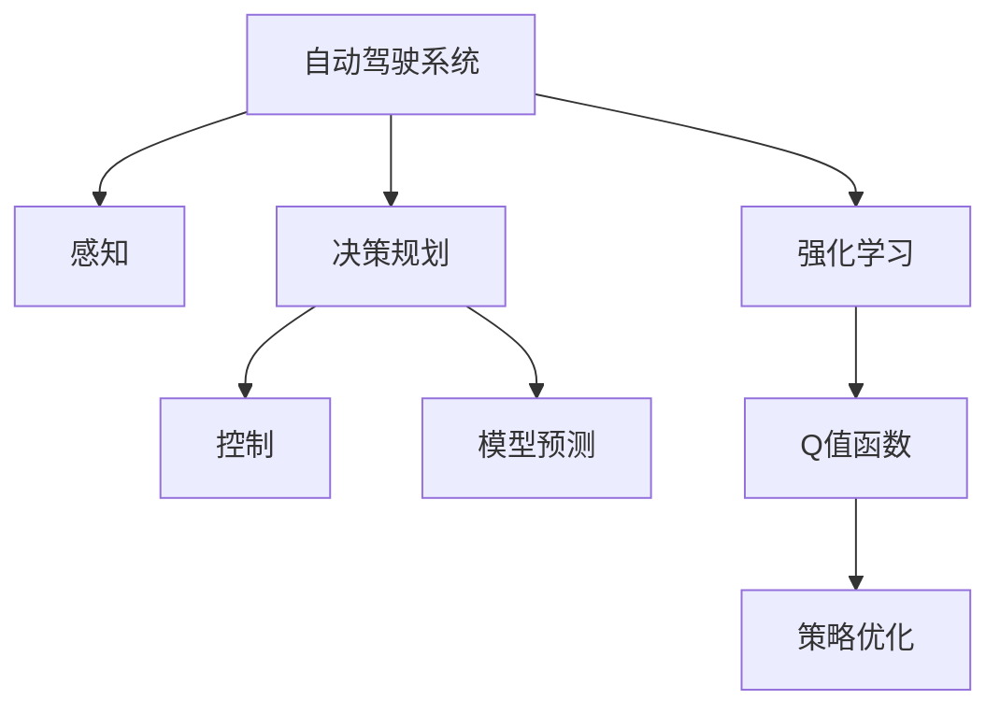

                 

# 强化学习重塑自动驾驶决策规划的范式变革分析

在自动驾驶技术的演进中，决策规划模块扮演着至关重要的角色。传统的基于规则和模型预测的决策规划方法，虽然确保了驾驶的稳定性和安全性，但在面对复杂多变和动态变化的道路环境时，常常显得力不从心。而强化学习（Reinforcement Learning, RL）的引入，为自动驾驶决策规划带来了范式变革，极大地提升了驾驶系统的灵活性和鲁棒性。本文将从背景介绍、核心概念、算法原理、项目实践、应用场景和未来展望等多个维度，深入分析强化学习在自动驾驶决策规划中的运用及其带来的巨大变革。

## 1. 背景介绍

### 1.1 问题由来

自动驾驶技术的发展，依赖于一系列关键技术的突破，包括感知、决策规划和控制等。传统的自动驾驶系统通常采用规则导向和模型预测的方式进行决策规划。例如，通过预先定义的交通规则和交通模型，结合当前车辆位置、车速、周围环境等因素，计算出最优的行驶策略。

然而，这些基于规则和模型的方法存在以下局限性：
- **静态规则限制**：预定义的交通规则无法灵活应对动态变化的道路情况，可能导致决策错误。
- **模型预测误差**：基于模型的预测往往假设了一定程度的静态性和确定性，而实际道路环境具有高度的动态性和不确定性。
- **优化目标单一**：传统的决策规划算法往往只关注单一的优化目标（如速度、距离等），难以综合考虑安全、舒适等多维因素。

### 1.2 问题核心关键点

强化学习技术的引入，有效地克服了上述局限性，为自动驾驶决策规划带来了显著的改进。强化学习的核心思想是通过不断与环境互动，学习如何在特定环境下采取最优行动。其核心要素包括：
- **环境**：自动驾驶系统所处的道路环境，包括交通流、车辆、行人、路标等。
- **行动**：车辆执行的具体操作，如加速、减速、变道、停车等。
- **奖励函数**：根据行动的效果赋予的奖励或惩罚，用于指导模型学习。
- **探索与利用**：在模型决策时，需要在探索新的行动策略和利用已有策略之间找到平衡，以最大化长期奖励。

强化学习与传统决策规划方法的对比如下：
- **静态 vs 动态**：传统方法基于静态规则和模型，强化学习可以动态适应不断变化的环境。
- **预测 vs 学习**：传统方法依赖模型预测，强化学习通过与环境互动，实时学习最优策略。
- **单一目标 vs 多目标**：传统方法多关注单一目标，强化学习可以综合考虑多维优化目标。

## 2. 核心概念与联系

### 2.1 核心概念概述

为了更好地理解强化学习在自动驾驶中的应用，本节将介绍几个密切相关的核心概念：

- **自动驾驶系统**：由感知、决策规划和控制等模块组成的完整自动驾驶系统。决策规划模块通过分析环境信息，生成最优行驶策略。
- **强化学习**：通过与环境互动，学习最优行动策略的方法。强化学习系统通过不断的试错，逐步优化决策过程。
- **Q值函数**：强化学习中用于评估每个状态-行动对的价值函数。通过Q值函数，可以判断当前状态下的最优行动。
- **策略优化**：强化学习中的核心任务，通过优化策略函数，使得模型能够根据当前状态，预测最优行动。
- **模型预测**：传统决策规划方法中的核心部分，通过数学模型预测环境响应，生成行动策略。

这些核心概念之间的逻辑关系可以通过以下Mermaid流程图来展示：



这个流程图展示出自动驾驶系统的决策规划模块，既可以通过传统的方法依赖模型预测，也可以采用强化学习进行优化。

## 3. 核心算法原理 & 具体操作步骤
### 3.1 算法原理概述

强化学习在自动驾驶决策规划中的应用，主要基于以下核心原理：

1. **环境模型**：自动驾驶系统通过传感器收集道路环境信息，如车辆位置、速度、周围车辆和行人等。环境模型将这些信息转化为模型可以处理的形式，供决策规划模块使用。

2. **行动空间**：自动驾驶系统中可执行的行动空间，包括加速、减速、变道、停车等。行动空间的设计需要考虑系统的安全和效率。

3. **奖励函数**：根据行动的效果，赋予相应的奖励或惩罚。奖励函数设计需要考虑多维目标，如安全、速度、舒适等。

4. **策略函数**：根据当前状态，预测最优行动的函数。策略函数可以通过Q值函数优化得到。

5. **值迭代**：通过不断迭代，更新Q值函数，找到最优策略。值迭代过程可以使用动态规划、蒙特卡罗模拟等方法。

### 3.2 算法步骤详解

强化学习在自动驾驶决策规划中的应用，主要包括以下几个关键步骤：

**Step 1: 定义环境模型和行动空间**
- 根据实际道路环境，定义环境模型和行动空间。
- 环境模型通常使用传感器数据进行构建，包括车辆位置、速度、周围环境等信息。

**Step 2: 设计奖励函数**
- 根据自动驾驶系统的目标，设计合理的奖励函数。奖励函数需要综合考虑安全、速度、舒适等多维目标。
- 奖励函数可以设计为加权和的形式，如$R(s, a) = w_1 \cdot R_{安全}(s, a) + w_2 \cdot R_{速度}(s, a) + w_3 \cdot R_{舒适}(s, a)$，其中$R_{安全}$、$R_{速度}$、$R_{舒适}$分别代表安全、速度、舒适的奖励函数。

**Step 3: 定义策略函数**
- 定义策略函数$\pi(s)$，用于根据当前状态$s$，预测最优行动$a$。
- 策略函数可以通过Q值函数优化得到，即$\pi(s) = \arg\max_a Q(s, a)$。

**Step 4: 实现值迭代**
- 使用动态规划或蒙特卡罗模拟等方法，迭代更新Q值函数，找到最优策略。
- 动态规划方法使用贝尔曼方程求解Q值函数，蒙特卡罗方法通过采样，更新Q值函数。

**Step 5: 实现策略优化**
- 使用策略优化算法，如策略梯度方法，优化策略函数$\pi(s)$，使得模型能够根据当前状态，预测最优行动。

### 3.3 算法优缺点

强化学习在自动驾驶决策规划中的应用，具有以下优点：
1. **动态适应性**：强化学习可以动态适应不断变化的环境，无需重新设计规则或模型。
2. **多目标优化**：强化学习可以综合考虑多维目标，如安全、速度、舒适等，提高决策的全面性和合理性。
3. **鲁棒性**：强化学习系统通过不断的试错，学习到稳定的决策策略，具有较强的鲁棒性。

然而，强化学习也存在以下局限性：
1. **计算复杂性**：强化学习的训练过程计算复杂，需要大量的计算资源。
2. **训练样本需求高**：强化学习通常需要大量的训练样本，才能保证模型的泛化能力。
3. **模型可解释性差**：强化学习的决策过程通常缺乏可解释性，难以对其推理逻辑进行分析和调试。

### 3.4 算法应用领域

强化学习在自动驾驶决策规划中的应用，可以拓展到多个领域，例如：

- **路径规划**：自动驾驶系统在动态路网中的路径规划，通过强化学习优化行驶路线。
- **交通流控制**：智能交通系统中，利用强化学习优化交通信号灯和交叉口的控制策略。
- **自主泊车**：自动驾驶车辆在停车场内的自主泊车，通过强化学习学习最优的停车策略。
- **事故预防**：自动驾驶系统通过强化学习学习避免交通事故的策略，提高行车安全。

除了上述这些领域外，强化学习还被创新性地应用到更多场景中，如可控驾驶行为、智能交通管理、车辆自适应巡航等，为自动驾驶技术带来了全新的突破。

## 4. 数学模型和公式 & 详细讲解  
### 4.1 数学模型构建

本节将使用数学语言对强化学习在自动驾驶决策规划中的过程进行更加严格的刻画。

假设自动驾驶系统处于状态$s$，采取行动$a$，产生下一状态$s'$和奖励$r$。状态$s$可以是车辆的位置、速度、方向等，行动$a$可以是加速、减速、变道等。状态转移概率和奖励函数如下：
- 状态转移概率：$P(s'|s,a)$，表示在状态$s$下，采取行动$a$，到达下一状态$s'$的概率。
- 奖励函数：$R(s,a)$，表示在状态$s$下，采取行动$a$，获得的奖励或惩罚。

强化学习的目标是最大化长期奖励，即求解最优策略$\pi^*(s)$，使得期望长期奖励最大化。即：

$$
\pi^*(s) = \arg\max_{\pi(s)} \mathbb{E}[G_t | s_t]
$$

其中$G_t$表示从当前状态$s_t$开始，按照策略$\pi$行动，获得的所有奖励的贴现和，即：

$$
G_t = \sum_{k=0}^{\infty} \gamma^k R(s_{t+k}, a_{t+k})
$$

其中$\gamma$为贴现因子，控制未来奖励的权重。

### 4.2 公式推导过程

以下我们以路径规划为例，推导强化学习在自动驾驶决策规划中的应用公式。

假设自动驾驶系统需要在给定的起点$s_0$和终点$s_1$之间选择最优路径，路径由一系列连续的状态$s_0, s_1, s_2, ..., s_n$组成，其中$s_n$为目标状态。路径规划的决策过程可以表示为：

$$
\pi^*(s) = \arg\max_a Q^{\pi}(s, a)
$$

其中$Q^{\pi}(s, a)$为策略$\pi$下的Q值函数。

通过贝尔曼方程，可以得到Q值函数的递推关系：

$$
Q^{\pi}(s, a) = R(s, a) + \gamma \sum_{s'} P(s'|s, a) Q^{\pi}(s', a)
$$

根据最优性条件，可以进一步推导得到贝尔曼方程的优化解：

$$
\pi^*(s) = \arg\max_a Q^{\pi^*}(s, a)
$$

其中$\pi^*(s)$为最优策略，$Q^{\pi^*}(s, a)$为最优Q值函数。

### 4.3 案例分析与讲解

假设自动驾驶系统需要在城市道路上行驶，通过强化学习学习最优的行驶策略。

**案例背景**：自动驾驶系统需要从起点$s_0$到达终点$s_1$，途中经过多个交叉口和红绿灯。每个交叉口有直行、左转和右转三个方向可以选择，每个方向都有不同的通行规则和交通信号。

**奖励函数设计**：
- 安全：不发生交通事故，奖励+1；发生交通事故，奖励-10。
- 速度：行驶速度达到指定值，奖励+0.1；低于指定值，奖励-0.1。
- 舒适：乘客舒适度评分高，奖励+0.2；乘客舒适度评分低，奖励-0.2。

**策略优化**：
- 使用策略梯度方法，通过采样大量状态-行动对，不断优化策略函数。
- 根据Q值函数，选择最优行动策略。

**案例结果**：经过不断训练，自动驾驶系统能够灵活适应动态变化的环境，快速学习到最优行驶策略，大大提高了行车安全和舒适性。

## 5. 项目实践：代码实例和详细解释说明
### 5.1 开发环境搭建

在进行强化学习在自动驾驶决策规划的实践前，我们需要准备好开发环境。以下是使用Python进行强化学习开发的环境配置流程：

1. 安装Anaconda：从官网下载并安装Anaconda，用于创建独立的Python环境。

2. 创建并激活虚拟环境：
```bash
conda create -n reinforcement-env python=3.8 
conda activate reinforcement-env
```

3. 安装相关库：
```bash
conda install gym numpy scipy matplotlib scikit-learn jupyter notebook ipython
```

4. 安装强化学习相关库：
```bash
pip install gym[atari] pygym gym[discrete] stable-baselines
```

5. 安装Gym环境库：
```bash
pip install gym[atari] gym[discrete]
```

完成上述步骤后，即可在`reinforcement-env`环境中开始强化学习的实践。

### 5.2 源代码详细实现

这里我们以深度强化学习（Deep RL）库Stable Baselines为例，展示如何使用强化学习进行自动驾驶决策规划的代码实现。

首先，定义强化学习环境：

```python
import gym
import gymCartPole

# 创建CartPole环境
env = gym.make('CartPole-v0')
```

然后，定义策略函数和优化器：

```python
from stable_baselines import DQN

# 定义DQN策略
model = DQN(policy="td3", verbose=2)
```

接着，定义训练和评估函数：

```python
import numpy as np
import matplotlib.pyplot as plt

def train(model, env, total_timesteps=10000):
    # 训练模型
    model.learn(total_timesteps, env)
    
    # 评估模型
    with plt.style.context('ggplot'):
        plt.figure()
        plt.title('Return (Return of the mean policy)')
        plt.plot(model.get_stats("return"), label="Return")
        plt.plot(model.get_stats("std"), label="Return std")
        plt.xlabel('Time (timesteps)')
        plt.ylabel('Value')
        plt.legend()
        plt.show()

def evaluate(model, env):
    # 评估模型
    obs = env.reset()
    done = False
    rewards = []
    while not done:
        action, _ = model.predict(obs)
        obs, reward, done, _ = env.step(action)
        rewards.append(reward)
    print('Return: ', np.mean(rewards))
```

最后，启动训练流程并在测试集上评估：

```python
epochs = 10
total_timesteps = 10000 * epochs

for epoch in range(epochs):
    print(f"Epoch {epoch+1}/{epochs}")
    train(model, env, total_timesteps)
    
    evaluate(model, env)
```

以上就是使用Stable Baselines进行强化学习的代码实现。可以看到，使用深度强化学习库，可以方便地实现强化学习在自动驾驶决策规划中的应用。

### 5.3 代码解读与分析

让我们再详细解读一下关键代码的实现细节：

**训练函数**：
- 使用Stable Baselines库的DQN策略进行训练。
- 定义训练总步数`total_timesteps`，表示训练过程中总执行的步数。
- 在每个epoch中，调用训练函数进行模型训练。

**评估函数**：
- 使用训练好的模型对环境进行评估，记录每一步的奖励。
- 使用matplotlib库绘制评估结果的图表。

**训练流程**：
- 定义总epoch数和训练总步数，启动训练循环。
- 在每个epoch开始时，输出当前epoch的编号。
- 调用训练函数进行模型训练。
- 在每个epoch结束后，调用评估函数进行模型评估。

可以看到，使用深度强化学习库，可以大大简化代码实现，提高开发效率。

## 6. 实际应用场景
### 6.1 智能交通管理

强化学习在智能交通管理中的应用，可以优化交通信号灯和交叉口的控制策略，提高道路的通行效率和安全性能。

具体而言，强化学习系统可以收集道路流量、车辆速度、行人数量等数据，通过优化交通信号灯的切换策略，实现交通流的动态管理。通过不断试错，强化学习系统可以学习到最优的交通控制策略，减少交通拥堵和事故发生，提高道路通行效率。

### 6.2 自动驾驶车辆决策规划

自动驾驶车辆通过强化学习学习最优的行驶策略，可以提升行车安全和舒适性，减少交通事故的发生。

具体而言，强化学习系统可以在各种复杂多变的环境中，学习到合理的驾驶策略。例如，在面对突然出现的行人、其他车辆或障碍物时，系统能够快速做出反应，选择最优的避让策略。通过不断学习，强化学习系统可以适应不同的道路环境和驾驶需求，提高自动驾驶的智能性和安全性。

### 6.3 自主泊车

自主泊车系统通过强化学习学习最优的停车策略，可以显著提高停车效率和安全性。

具体而言，强化学习系统可以学习到最优的停车路径和速度控制策略。例如，在面对狭小空间和多障碍物时，系统能够灵活调整停车方向和速度，避免碰撞和刮擦。通过不断学习，强化学习系统可以适应不同的停车环境，提升停车的智能性和安全性。

### 6.4 未来应用展望

随着强化学习在自动驾驶决策规划中的应用不断深入，未来将会在更多领域带来变革性的影响：

1. **动态路径规划**：强化学习系统可以在实时动态的环境中，学习到最优的路径规划策略。例如，在面对突发交通事件和施工路段时，系统能够迅速调整行驶路线，避开拥堵和危险区域。

2. **自适应巡航控制**：强化学习系统可以通过不断学习，学习到最优的车辆速度控制策略，提高行驶的舒适性和安全性。

3. **智能交通流量预测**：强化学习系统可以学习到交通流量的变化规律，预测未来的交通状况，辅助交通管理部门进行实时调度。

4. **多车协同控制**：强化学习系统可以学习到多车协同的策略，实现车辆间的自动避让和协作行驶，提高道路的整体通行效率。

5. **自动驾驶决策树的构建**：强化学习系统可以通过学习，构建决策树，逐步优化决策路径，提高决策的准确性和鲁棒性。

以上应用场景展示了强化学习在自动驾驶决策规划中的巨大潜力。随着技术的不断进步，强化学习必将在自动驾驶领域发挥越来越重要的作用，推动自动驾驶技术向着更智能、更安全的方向发展。

## 7. 工具和资源推荐
### 7.1 学习资源推荐

为了帮助开发者系统掌握强化学习在自动驾驶决策规划中的应用，这里推荐一些优质的学习资源：

1. 《强化学习基础》系列博客：由深度学习专家撰写，详细介绍强化学习的基本原理、算法和应用。

2. 《深度学习与强化学习》课程：由斯坦福大学开设的深度学习课程，涵盖强化学习的核心内容，包括算法实现和应用场景。

3. 《强化学习实战》书籍：详细介绍了强化学习在自动驾驶、游戏AI等领域的实际应用，提供丰富的代码案例和实践指导。

4. OpenAI Gym库：提供了大量的模拟环境和算法，方便开发者进行强化学习的实验和研究。

5. PyTorch Reinforcement Learning库：基于PyTorch的强化学习库，提供了丰富的深度强化学习算法和工具。

通过对这些资源的学习实践，相信你一定能够快速掌握强化学习在自动驾驶决策规划中的应用，并用于解决实际的自动驾驶问题。

### 7.2 开发工具推荐

高效的开发离不开优秀的工具支持。以下是几款用于强化学习开发的常用工具：

1. PyTorch：基于Python的开源深度学习框架，灵活动态的计算图，适合快速迭代研究。主要用于深度强化学习算法实现。

2. TensorFlow：由Google主导开发的开源深度学习框架，生产部署方便，适合大规模工程应用。主要用于深度强化学习算法实现。

3. OpenAI Gym：提供了大量的模拟环境和算法，方便开发者进行强化学习的实验和研究。

4. PyTorch Reinforcement Learning库：基于PyTorch的强化学习库，提供了丰富的深度强化学习算法和工具。

5. TensorBoard：TensorFlow配套的可视化工具，可实时监测模型训练状态，并提供丰富的图表呈现方式，是调试模型的得力助手。

6. Weights & Biases：模型训练的实验跟踪工具，可以记录和可视化模型训练过程中的各项指标，方便对比和调优。

合理利用这些工具，可以显著提升强化学习在自动驾驶决策规划的开发效率，加快创新迭代的步伐。

### 7.3 相关论文推荐

强化学习在自动驾驶决策规划中的应用，源于学界的持续研究。以下是几篇奠基性的相关论文，推荐阅读：

1. "Playing Atari with Deep Reinforcement Learning"（Atari游戏深度强化学习）：DeepMind团队发表的论文，展示了深度强化学习在解决复杂游戏任务上的能力。

2. "Safe and Efficient Off-Road Navigation with Multi-Agent Deep Reinforcement Learning"（基于多智能体深度强化学习的安全高效越野导航）：提出了多智能体强化学习在自动驾驶中的应用，提升了越野导航的安全性和效率。

3. "Deep Driving: Unsupervised Learning of Road-Scenery Understanding"（深度驾驶：无监督的场景理解学习）：提出了基于深度强化学习的自动驾驶系统，提高了驾驶的智能性和安全性。

4. "A Deep Reinforcement Learning Agent for Automated Driving"（基于深度强化学习的自动驾驶代理）：展示了深度强化学习在自动驾驶中的应用，提升了驾驶的智能性和安全性。

5. "AutoDrive: Towards Semi-Autonomous Driving with Deep Reinforcement Learning"（AutoDrive：基于深度强化学习的半自动驾驶）：提出了基于深度强化学习的半自动驾驶系统，提高了驾驶的智能性和安全性。

这些论文代表了大语言模型微调技术的发展脉络。通过学习这些前沿成果，可以帮助研究者把握学科前进方向，激发更多的创新灵感。

## 8. 总结：未来发展趋势与挑战
### 8.1 总结

本文对强化学习在自动驾驶决策规划中的应用进行了全面系统的介绍。首先阐述了强化学习的核心思想和其在自动驾驶中的应用场景，明确了强化学习在提升自动驾驶系统智能性和鲁棒性方面的独特价值。其次，从原理到实践，详细讲解了强化学习在自动驾驶决策规划中的数学模型和算法实现，给出了强化学习任务开发的完整代码实例。同时，本文还广泛探讨了强化学习在智能交通管理、自动驾驶车辆决策规划、自主泊车等多个领域的应用前景，展示了强化学习范式变革的巨大潜力。此外，本文精选了强化学习的学习资源，力求为读者提供全方位的技术指引。

通过本文的系统梳理，可以看到，强化学习在自动驾驶决策规划中的应用，为自动驾驶系统带来了全新的视角和方法。得益于深度强化学习的强大能力，自动驾驶系统能够更加灵活地应对动态变化的道路环境，提升驾驶的智能性和安全性。未来，随着技术的不断进步，强化学习必将在自动驾驶领域发挥越来越重要的作用，推动自动驾驶技术向着更加智能、安全、高效的方向发展。

### 8.2 未来发展趋势

展望未来，强化学习在自动驾驶决策规划中的应用将呈现以下几个发展趋势：

1. **深度强化学习算法的发展**：随着深度强化学习算法的不断优化，强化学习系统将能够处理更加复杂的决策问题，提升自动驾驶系统的智能性。

2. **多智能体强化学习的应用**：多智能体强化学习能够处理多个智能体之间的互动，可以实现车辆间的协作行驶和避让，提升道路通行效率。

3. **跨模态强化学习的应用**：跨模态强化学习能够处理视觉、语音、雷达等多种传感器数据，实现多模态信息的融合，提升驾驶的全面性和安全性。

4. **实时强化学习的应用**：实时强化学习能够动态适应不断变化的环境，及时调整驾驶策略，提升驾驶的实时性和安全性。

5. **深度学习与强化学习的融合**：深度学习与强化学习的融合，能够进一步提升决策规划的准确性和鲁棒性，推动自动驾驶技术的发展。

以上趋势凸显了强化学习在自动驾驶决策规划中的广阔前景。这些方向的探索发展，必将进一步提升自动驾驶系统的智能性和安全性，为未来的自动驾驶技术带来新的突破。

### 8.3 面临的挑战

尽管强化学习在自动驾驶决策规划中的应用已经取得了一定的进展，但在迈向更加智能化、普适化应用的过程中，仍面临诸多挑战：

1. **计算复杂性**：强化学习的训练过程计算复杂，需要大量的计算资源，这对硬件设备和算力提出了更高的要求。

2. **数据需求高**：强化学习通常需要大量的训练数据，才能保证模型的泛化能力，这对于数据获取和处理提出了挑战。

3. **模型可解释性差**：强化学习的决策过程通常缺乏可解释性，难以对其推理逻辑进行分析和调试，这对于安全性和可信性提出了挑战。

4. **鲁棒性不足**：强化学习系统在面对异常情况时，可能容易产生决策失误，这对于系统的稳定性和安全性提出了挑战。

5. **伦理和安全问题**：强化学习系统可能学习到有害的决策策略，导致安全事故和伦理问题，这对于系统的可信性和道德性提出了挑战。

### 8.4 研究展望

面对强化学习在自动驾驶决策规划中面临的挑战，未来的研究需要在以下几个方面寻求新的突破：

1. **高效计算优化**：开发高效计算优化技术，如模型并行、模型压缩、混合精度训练等，降低计算复杂度，提高训练效率。

2. **数据高效采集和处理**：开发高效数据采集和处理技术，如数据增强、数据合成等，减少数据需求，提高数据泛化能力。

3. **模型可解释性提升**：开发可解释性增强技术，如可解释性生成模型、模型可视化等，提高模型的可解释性和可信性。

4. **鲁棒性增强**：开发鲁棒性增强技术，如对抗训练、鲁棒性优化等，提高系统的稳定性和安全性。

5. **伦理和安全约束**：引入伦理和安全约束，如伦理导向的评估指标、安全性保证机制等，确保系统的道德性和安全性。

这些研究方向的探索，必将引领强化学习在自动驾驶决策规划中的深入发展，推动自动驾驶技术向着更加智能、安全、可信的方向迈进。面向未来，强化学习技术还需要与其他人工智能技术进行更深入的融合，如知识表示、因果推理、强化学习等，多路径协同发力，共同推动自动驾驶技术的进步。只有勇于创新、敢于突破，才能不断拓展自动驾驶技术的边界，让智能技术更好地造福人类社会。

## 9. 附录：常见问题与解答

**Q1：强化学习是否适用于所有自动驾驶场景？**

A: 强化学习在处理动态变化和复杂多变的场景中具有优势，但在面对静态规则明确、环境变化较小的场景时，传统的方法可能更为适用。因此，需要根据具体场景选择合适的技术。

**Q2：强化学习是否需要大量标注数据？**

A: 强化学习通常需要大量的训练数据，以确保模型的泛化能力。对于无监督或半监督场景，可以通过模拟环境和蒙特卡罗模拟等方法进行训练。

**Q3：强化学习如何避免过拟合？**

A: 强化学习可以通过引入正则化技术、模型压缩、梯度裁剪等方法，避免过拟合。同时，可以使用基于策略梯度的方法，减小参数更新量，提高模型的泛化能力。

**Q4：强化学习如何确保安全性和可信性？**

A: 强化学习可以通过引入伦理和安全约束，如安全性保证机制、伦理导向的评估指标等，确保系统的道德性和安全性。同时，可以使用模型可解释性增强技术，提高模型的可信性。

**Q5：强化学习在自动驾驶决策规划中的主要优势是什么？**

A: 强化学习在自动驾驶决策规划中的主要优势包括：
1. 动态适应性：能够动态适应不断变化的环境，无需重新设计规则或模型。
2. 多目标优化：能够综合考虑多维目标，如安全、速度、舒适等，提高决策的全面性和合理性。
3. 鲁棒性：通过不断的试错，学习到稳定的决策策略，具有较强的鲁棒性。

这些优势使得强化学习在自动驾驶决策规划中具有重要的应用前景。

---

作者：禅与计算机程序设计艺术 / Zen and the Art of Computer Programming

