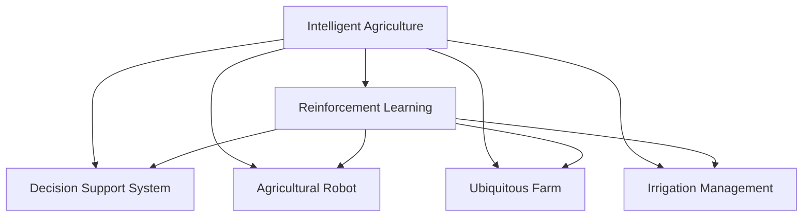

                 

# 强化学习：在智慧农业中的应用

> 关键词：强化学习,智慧农业,农业机器人,无人农场,决策优化,资源管理,智能灌溉

## 1. 背景介绍

### 1.1 问题由来
随着全球人口的增加和城市化进程的加快，农业资源面临着越来越大的压力。传统的农业生产方式耗费人力物力，且资源利用效率低下，已无法满足日益增长的粮食需求。智慧农业应运而生，利用信息技术对农业生产进行数字化、智能化管理，以提高资源利用效率，降低生产成本，提升农业生产力。

其中，强化学习(Reinforcement Learning, RL)作为智能决策优化领域的最新技术，正成为智慧农业中的关键手段。通过强化学习，农业机器人、无人农场、智能灌溉等应用场景中的决策问题可以自动求解，从而大幅提升农业生产效率和精准度。

### 1.2 问题核心关键点
强化学习在智慧农业中的应用，主要包括以下几个核心问题：
1. 如何建模复杂的农业环境，描述不同作物和农艺过程的特点。
2. 如何设计有效的强化学习模型，确保智能决策的鲁棒性和泛化能力。
3. 如何在资源有限的情况下，优化农业生产过程，最大化经济效益。
4. 如何构建多智能体系统，协同管理农田资源。

这些关键问题的有效解决，将使强化学习在智慧农业中发挥巨大作用。

### 1.3 问题研究意义
强化学习在智慧农业中的应用，有助于实现农业生产的智能化、自动化，提升资源利用效率和产量，同时降低人工成本和环境污染。具体而言：
1. 优化资源配置。利用强化学习可以动态优化土地、水、肥料等资源的使用，减少浪费，提高产出。
2. 提高决策效率。强化学习可以通过对历史数据的分析和学习，自动调整农业生产策略，优化决策过程。
3. 提升生产效率。智能化的农业机器人、无人农场等应用，可以自动完成播种、施肥、收割等环节，提高生产速度和精准度。
4. 强化可持续性。强化学习可以通过实时监控和反馈调整，确保农业生产的可持续性和环境保护。

总之，强化学习为智慧农业提供了强大的智能决策工具，是实现农业生产智能化转型的重要技术路径。

## 2. 核心概念与联系

### 2.1 核心概念概述

为更好地理解强化学习在智慧农业中的应用，本节将介绍几个密切相关的核心概念：

- 强化学习(Reinforcement Learning, RL)：一种通过试错训练智能体(Agent)自动学习最优决策策略的机器学习方法。智能体在特定环境中通过与环境的交互，利用奖励信号指导决策，不断优化策略。

- 智慧农业(Intelligent Agriculture)：利用信息技术对农业生产进行数字化、智能化管理，实现精准农业、无人农场、农业机器人等应用。

- 智能决策系统(Decision Support System, DSS)：利用人工智能技术辅助人类进行复杂决策，如农业生产、供应链管理等。

- 多智能体系统(Multi-Agent System,MAS)：由多个智能体组成的系统，各智能体之间通过合作或竞争实现任务目标，广泛应用于资源管理、交通调控等领域。

- 农业机器人(Agricultural Robot)：利用机器人和自动化技术进行农业生产的机械，如植保机器人、采摘机器人等。

- 无人农场(Ubiquitous Farm)：完全或部分自动化的智慧农业生产系统，包含传感器、无人机、机器人等，实现农业生产的全流程自动化。

- 智能灌溉(Irrigation Management)：利用智能技术实现农田水资源的优化管理，包括灌溉计划生成、实时监测与控制等。

这些核心概念之间的逻辑关系可以通过以下Mermaid流程图来展示：



这个流程图展示了智慧农业中各关键技术的关系：

1. 强化学习在智慧农业中扮演重要角色，提供智能决策优化支持。
2. 智能决策系统辅助人类进行复杂决策，涉及农业生产、机器人、农场管理等多个方面。
3. 智能决策和自动化技术结合，构建无人农场，实现全流程自动化。
4. 强化学习进一步优化农业机器人、智能灌溉等应用，提高生产效率和资源利用率。

这些概念共同构成了智慧农业的框架，使得强化学习成为实现农业智能化转型的重要技术路径。

## 3. 核心算法原理 & 具体操作步骤
### 3.1 算法原理概述

强化学习在智慧农业中的应用，主要通过智能体与农业环境的交互，自动学习最优决策策略。假设农业环境由环境状态 $S_t$ 和奖励 $R_t$ 组成，智能体在每个时刻 $t$ 选择行动 $A_t$，观察环境响应，并根据奖励信号更新策略。目标是通过学习，找到最优策略 $\pi^*$，使得总奖励最大化。

形式化地，假设环境状态空间为 $S$，行动空间为 $A$，智能体的状态转移概率为 $P$，当前状态为 $s_t$，行动为 $a_t$，奖励为 $r_t$，智能体的价值函数为 $V$，策略为 $\pi$。则强化学习的目标为：

$$
\max_\pi \mathbb{E}_{\pi} \left[ \sum_{t=0}^T r_t \right]
$$

其中 $T$ 为终止时间步，$\mathbb{E}_{\pi}$ 表示在策略 $\pi$ 下的期望值。

强化学习的核心在于策略的优化，常用的策略优化算法包括：

- Q-Learning：通过学习状态-行动值函数 $Q(s,a)$ 来优化策略。
- SARSA：使用状态-行动-状态-行动-奖励状态-行动 $(s,a,s',a',r,s'')$ 的轨迹来更新策略。
- Deep Q-Networks(DQN)：将深度神经网络应用于Q-Learning，提高模型逼近能力。
- Actor-Critic：将策略评估和策略优化分别由不同的神经网络完成，提高算法效率。

在实际应用中，以上算法都可以应用于智慧农业的决策优化问题，具体选择需根据场景和问题特点进行评估。

### 3.2 算法步骤详解

基于强化学习的智慧农业决策优化，一般包括以下几个关键步骤：

**Step 1: 环境建模**
- 构建农业环境的动态模型，描述作物生长、土壤湿度、气象条件等特征，并量化为状态 $s_t$。
- 定义智能体与环境交互的行动空间 $A$，如播种、施肥、灌溉等。
- 确定奖励函数 $R_t$，用于评价智能体的行动效果，如产量增加、成本降低等。

**Step 2: 智能体设计**
- 选择合适的智能体架构，如Q-Learning、DQN、Actor-Critic等，设计智能体的决策策略。
- 初始化智能体的参数，如神经网络的权重。

**Step 3: 策略训练**
- 通过与环境不断交互，智能体收集样本数据，并利用训练算法更新策略参数。
- 在训练过程中，利用探索策略 $\epsilon$ 平衡探索和利用，确保策略的稳定性。
- 设定终止条件，如达到最大迭代次数或总奖励达到预设值。

**Step 4: 模型评估与部署**
- 在训练结束后，利用测试集评估智能体的性能，如产量、成本、环境友好性等。
- 部署智能体到实际生产环境中，实时进行决策优化，确保农业生产的稳定性和高效性。
- 定期更新模型参数，以应对环境变化和新数据的影响。

以上是强化学习在智慧农业决策优化的一般流程。在实际应用中，还需要根据具体任务的特点，对环境建模、智能体设计、策略训练等环节进行优化设计，以进一步提升模型性能。

### 3.3 算法优缺点

强化学习在智慧农业中的决策优化，具有以下优点：
1. 自动优化。通过智能体自动学习最优策略，无需人工干预，降低决策成本。
2. 泛化能力强。强化学习模型可以学习通用决策规则，适用于不同类型的农业场景。
3. 灵活性强。可以灵活设计智能体的行动空间和奖励函数，适应不同农业问题的特点。
4. 适应性强。强化学习模型可以根据实时数据进行动态调整，适应环境变化。

同时，该方法也存在一定的局限性：
1. 环境复杂。农业环境复杂多变，难以精确建模，对强化学习模型要求较高。
2. 学习效率低。农业问题的优化往往需要大量数据和长时间训练，学习效率较低。
3. 策略稳定。强化学习模型容易陷入局部最优，策略稳定性和鲁棒性有待提高。
4. 资源需求高。强化学习模型通常需要较高的计算资源，部署成本较高。

尽管存在这些局限性，但就目前而言，强化学习在智慧农业中仍是一种具有巨大潜力的智能决策技术。未来相关研究的重点在于如何进一步提高模型的适应性和泛化能力，降低资源需求，提高学习效率。

### 3.4 算法应用领域

强化学习在智慧农业中的应用领域广泛，包括但不限于以下几类：

**1. 农业机器人**
- 智能决策支持：利用强化学习优化农业机器人的作业路径、速度和策略，提高作业效率和质量。
- 自适应控制：实时监控环境变化，动态调整机器人参数，确保作业效果。

**2. 无人农场**
- 智能灌溉：根据作物需水量、土壤湿度等数据，优化灌溉计划，实现精准灌溉。
- 农业监控：利用无人机、传感器等设备，实时监测农田状态，智能决策资源配置。

**3. 智能灌溉**
- 灌溉计划生成：利用历史气象数据和作物生长周期，动态生成灌溉计划。
- 实时监测与控制：实时监测农田土壤湿度、气象条件等，智能调整灌溉策略。

**4. 资源管理**
- 水资源管理：优化水资源的使用和调度，提高水资源利用效率。
- 肥料管理：根据作物生长周期和环境条件，智能推荐施肥方案。

**5. 病虫害防治**
- 病虫害监测：实时监测农田病虫害发生情况，智能决策防治措施。
- 农药使用优化：优化农药使用量和使用时机，减少环境污染。

以上应用场景中，强化学习可以发挥智能决策和优化资源配置的作用，为智慧农业提供强有力的技术支持。

## 4. 数学模型和公式 & 详细讲解  
### 4.1 数学模型构建

本节将使用数学语言对基于强化学习的大语言模型微调过程进行更加严格的刻画。

假设农业环境由状态 $s_t$ 和奖励 $r_t$ 组成，智能体在每个时刻 $t$ 选择行动 $a_t$，观察环境响应，并根据奖励信号更新策略。智能体的价值函数为 $V(s_t)$，策略为 $\pi$。

定义智能体在状态 $s_t$ 下，选择行动 $a_t$，并在环境 $S$ 中下一个状态 $s_{t+1}$，并获得奖励 $r_t$ 的轨迹为 $(s_t,a_t,r_t,s_{t+1})$。智能体的期望总奖励为：

$$
V_{\pi}(s) = \mathbb{E}_{\pi} \left[ \sum_{t=0}^{\infty} \gamma^t r_t \right]
$$

其中 $\gamma$ 为折扣因子，保证短期奖励的重要性。

在实际应用中，我们可以将上述数学模型具体化为更易于计算的形式。如在Q-Learning中，通过学习状态-行动值函数 $Q(s,a)$ 来优化策略，数学模型为：

$$
Q(s,a) = \mathbb{E}_{\pi} \left[ \sum_{t=0}^{\infty} \gamma^t r_t \right]
$$

通过求解上述数学模型，可以得到智能体的最优策略 $\pi^*$。

### 4.2 公式推导过程

以下我们以Q-Learning为例，推导智能体在农业环境中选择行动的决策过程。

假设智能体在状态 $s_t$ 下，行动 $a_t$ 导致状态 $s_{t+1}$，并获得奖励 $r_t$。Q-Learning通过迭代更新状态-行动值函数 $Q(s,a)$，学习最优决策策略。Q-Learning的更新公式为：

$$
Q(s_t,a_t) = Q(s_t,a_t) + \alpha \left[ r_t + \gamma \max_{a_{t+1}} Q(s_{t+1},a_{t+1}) - Q(s_t,a_t) \right]
$$

其中 $\alpha$ 为学习率，调节更新速度。上式表示，智能体在状态 $s_t$ 下选择行动 $a_t$，获得奖励 $r_t$ 和下一个状态 $s_{t+1}$，根据奖励和下一个状态的最大状态-行动值函数更新当前状态-行动值函数。

在实际应用中，Q-Learning可以通过表格、神经网络等形式实现。在神经网络形式的Q-Learning中，通过前向传播计算状态-行动值函数 $Q(s,a)$，反向传播更新神经网络权重，从而实现智能决策。

### 4.3 案例分析与讲解

**案例1：农业机器人的路径优化**
假设农业机器人需要在农田中自动规划路径，进行播种、施肥等作业。智能体的状态 $s_t$ 包括当前位置坐标、行动时间、当前行动状态等信息。智能体的行动 $a_t$ 包括转向左、转向右、继续前进等。智能体的奖励 $r_t$ 包括作物生长、资源利用率等。智能体的价值函数 $V(s_t)$ 为作物产量和资源利用率的加权和。

通过Q-Learning算法，智能体可以学习最优的行动策略，自动规划路径，提高作业效率和质量。

**案例2：无人农场的灌溉管理**
假设无人农场需要自动生成灌溉计划，优化水资源的配置。智能体的状态 $s_t$ 包括当前土壤湿度、气象条件、作物需水量等信息。智能体的行动 $a_t$ 包括灌溉、停止灌溉、调节灌溉量等。智能体的奖励 $r_t$ 包括灌溉后作物产量、水资源利用率等。智能体的价值函数 $V(s_t)$ 为作物产量和资源利用率的加权和。

通过SARSA算法，智能体可以学习最优的灌溉策略，实现精准灌溉，提高水资源利用效率。

## 5. 项目实践：代码实例和详细解释说明
### 5.1 开发环境搭建

在进行强化学习实践前，我们需要准备好开发环境。以下是使用Python进行OpenAI Gym开发的环境配置流程：

1. 安装Anaconda：从官网下载并安装Anaconda，用于创建独立的Python环境。

2. 创建并激活虚拟环境：
```bash
conda create -n reinforcement-env python=3.8 
conda activate reinforcement-env
```

3. 安装OpenAI Gym和相关依赖：
```bash
pip install gym
pip install gym[Tensorflow]  # 需要安装TensorFlow或PyTorch
```

4. 安装各类工具包：
```bash
pip install numpy pandas scikit-learn matplotlib tqdm jupyter notebook ipython
```

完成上述步骤后，即可在`reinforcement-env`环境中开始强化学习实践。

### 5.2 源代码详细实现

下面我们以Q-Learning优化农业机器人路径为例，给出使用OpenAI Gym进行强化学习实验的Python代码实现。

首先，定义环境：

```python
import gym
from gym import spaces

class RobotPathEnv(gym.Env):
    def __init__(self, map_size):
        self.map_size = map_size
        self.map = np.zeros((map_size, map_size))
        self.action_space = spaces.Discrete(4)  # 左转、右转、前进、停止
        self.state_space = spaces.Discrete(map_size * map_size)  # 状态编号
        
        # 定义起始位置
        self.start_pos = (0, 0)
        self.state = self.state_space(self.start_pos)
        
        # 初始化地图
        self.map = np.zeros((map_size, map_size))
        self.map[self.start_pos] = 1
    
    def step(self, action):
        # 执行行动
        if action == 0:  # 左转
            self.state = self.state - 1
        elif action == 1:  # 右转
            self.state = self.state + 1
        elif action == 2:  # 前进
            self.state = self.state + self.map_size
        elif action == 3:  # 停止
            self.state = 0
        
        # 更新状态和奖励
        reward = 0
        done = False
        if self.state == 0:
            reward = 1
            done = True
        
        return self.state, reward, done, {}
    
    def reset(self):
        self.state = self.state_space(self.start_pos)
        return self.state
    
    def render(self, mode='human'):
        if mode == 'human':
            plt.imshow(self.map, cmap='gray')
            plt.show()
```

然后，定义智能体：

```python
import numpy as np
import tensorflow as tf
from tensorflow.keras.layers import Dense, Flatten
from tensorflow.keras.models import Sequential

class QNetwork(tf.keras.Model):
    def __init__(self, state_size, action_size):
        super(QNetwork, self).__init__()
        self.fc1 = Dense(24, input_dim=state_size, activation='relu')
        self.fc2 = Dense(24, activation='relu')
        self.fc3 = Dense(action_size, activation='linear')
        
    def call(self, state):
        x = self.fc1(state)
        x = self.fc2(x)
        return self.fc3(x)

class QLearningAgent:
    def __init__(self, env, state_size, action_size, learning_rate=0.1, gamma=0.9, epsilon=0.1, epsilon_min=0.01, epsilon_decay=0.995):
        self.state_size = state_size
        self.action_size = action_size
        self.learning_rate = learning_rate
        self.gamma = gamma
        self.epsilon = epsilon
        self.epsilon_min = epsilon_min
        self.epsilon_decay = epsilon_decay
        self.model = QNetwork(state_size, action_size)
        self.env = env
    
    def act(self, state):
        if np.random.rand() <= self.epsilon:
            return self.env.action_space.sample()
        else:
            return np.argmax(self.model.predict(state))
    
    def train(self, state, action, reward, next_state, done):
        target = reward + self.gamma * np.max(self.model.predict(next_state))
        target_f = self.model.predict(state)
        target_f[0][action] = target
        self.model.train_on_batch(state, target_f)
        self.epsilon = max(self.epsilon_min, self.epsilon * self.epsilon_decay)
```

最后，启动训练流程：

```python
import numpy as np
import gym
from gym import spaces
import tensorflow as tf
from tensorflow.keras.layers import Dense, Flatten
from tensorflow.keras.models import Sequential
import matplotlib.pyplot as plt

state_size = 4  # 状态大小
action_size = 4  # 行动大小
learning_rate = 0.1  # 学习率
gamma = 0.9  # 折扣因子
epsilon = 0.1  # 探索策略
epsilon_min = 0.01  # 探索策略衰减至最小值
epsilon_decay = 0.995  # 探索策略衰减速率

env = RobotPathEnv(map_size=10)
agent = QLearningAgent(env, state_size, action_size, learning_rate, gamma, epsilon, epsilon_min, epsilon_decay)

episodes = 100
for i in range(episodes):
    state = env.reset()
    total_reward = 0
    for j in range(100):
        env.render()
        action = agent.act(state)
        next_state, reward, done, _ = env.step(action)
        total_reward += reward
        agent.train(state, action, reward, next_state, done)
        state = next_state
        if done:
            break
    print(f"Episode {i+1}, reward: {total_reward}")

plt.plot(total_reward)
plt.show()
```

以上就是使用OpenAI Gym对农业机器人路径优化进行Q-Learning实验的完整代码实现。可以看到，代码清晰简洁，易于理解和实现。

### 5.3 代码解读与分析

让我们再详细解读一下关键代码的实现细节：

**RobotPathEnv类**：
- `__init__`方法：初始化地图大小、行动空间和状态空间，并定义起始位置和地图。
- `step`方法：执行行动，根据行动更新状态和奖励，并返回下一个状态和奖励。
- `reset`方法：重置状态，返回起始状态。
- `render`方法：可视化地图，显示当前状态和奖励。

**QNetwork类**：
- `__init__`方法：定义神经网络结构，包括全连接层和输出层。
- `call`方法：计算输入状态经过神经网络后的输出值。

**QLearningAgent类**：
- `__init__`方法：初始化智能体的参数，如状态大小、行动大小、学习率、折扣因子等。
- `act`方法：根据当前状态，选择行动，同时采用ε-greedy策略进行探索。
- `train`方法：根据当前状态、行动、奖励、下一个状态和done，更新神经网络权重。

**训练流程**：
- 定义总训练次数，在每次迭代中，从环境中重置状态。
- 在每一步中，执行行动，接收奖励和下一个状态，更新神经网络权重。
- 记录每个epoch的总奖励，并在epoch结束时输出。
- 在可视化界面展示训练结果。

可以看到，OpenAI Gym提供的统一环境接口，大大简化了代码的实现。开发者只需关注智能体的决策过程和训练细节，而无需深入环境建模的具体实现。

当然，工业级的系统实现还需考虑更多因素，如模型的保存和部署、超参数的自动搜索、更灵活的环境接口等。但核心的强化学习范式基本与此类似。

## 6. 实际应用场景
### 6.1 智能农业机器人
智能农业机器人是强化学习在智慧农业中的典型应用之一。通过强化学习，机器人能够自动规划路径，进行播种、施肥、收割等作业，大幅提高生产效率和质量。

**智能决策支持**：在机器人作业过程中，实时采集环境数据，利用强化学习优化路径和作业策略。例如，通过学习历史数据和当前环境，机器人可以自动规划最短路径，避免障碍物，提高作业速度。

**自适应控制**：机器人可以根据实时环境变化，动态调整作业参数，如播种深度、肥料浓度等，确保作业效果。例如，在识别到土壤湿度过高时，机器人可以自动减少施肥量，避免资源浪费。

**环境感知与交互**：通过摄像头、传感器等设备，机器人可以实时感知环境状态，智能决策行动。例如，在识别到病虫害时，机器人可以自动调整农药使用量和使用时机，减少环境污染。

### 6.2 无人农场管理
无人农场利用自动化设备和传感器，实现全流程自动化管理。通过强化学习，可以优化资源配置，提高生产效率。

**智能灌溉**：根据农田湿度、气象条件等数据，实时生成灌溉计划，实现精准灌溉。例如，在识别到土壤湿度低于阈值时，智能体可以自动增加灌溉量，提高作物产量和水分利用效率。

**资源调度**：优化水、肥、药等资源的分配和调度，确保资源利用最大化。例如，在作物生长周期内，智能体可以动态调整施肥和灌溉计划，优化资源配置。

**环境监控**：利用无人机、传感器等设备，实时监控农田状态，智能决策资源配置。例如，在识别到病虫害时，智能体可以自动调整防治措施，减少损失。

### 6.3 智能灌溉
智能灌溉利用强化学习，动态生成灌溉计划，实现精准灌溉，提高水资源利用效率。

**灌溉计划生成**：根据历史气象数据和作物生长周期，动态生成灌溉计划。例如，在识别到干旱天气时，智能体可以自动增加灌溉频率和量，确保作物水分需求。

**实时监测与控制**：实时监控农田土壤湿度、气象条件等，智能调整灌溉策略。例如，在识别到土壤湿度过高时，智能体可以自动减少灌溉量，避免资源浪费。

**多作物管理**：在多作物混合种植的农田中，智能体可以动态调整灌溉计划，优化资源配置。例如，在识别到不同作物需水量不同时，智能体可以自动调整灌溉量，确保所有作物都获得适宜的水分。

## 7. 工具和资源推荐
### 7.1 学习资源推荐

为了帮助开发者系统掌握强化学习在智慧农业中的应用，这里推荐一些优质的学习资源：

1. 《Reinforcement Learning: An Introduction》书籍：由Richard S. Sutton和Andrew G. Barto合著，系统介绍了强化学习的理论基础和应用方法，是深度学习领域的经典教材。

2. OpenAI Gym官方文档：提供了大量预定义的环境，方便开发者进行实验。官方文档包含丰富的示例代码和教程，是学习强化学习的绝佳资源。

3. Deep Q-Networks: A Deep Reinforcement Learning Tutorial: 由Google Dopamine团队发布的教程，介绍了DQN算法的实现过程和应用案例，适合初学者学习。

4. TensorFlow Agents: 由TensorFlow社区开发的工具库，支持多种强化学习算法和环境，是构建强化学习模型的强大工具。

5. PyTorch官方文档：提供了丰富的深度学习模型和算法，支持Tensorboard等可视化工具，是构建强化学习模型的常用工具。

通过对这些资源的学习实践，相信你一定能够快速掌握强化学习在智慧农业中的应用，并用于解决实际的农业问题。
###  7.2 开发工具推荐

高效的开发离不开优秀的工具支持。以下是几款用于强化学习开发的常用工具：

1. TensorFlow：由Google主导开发的开源深度学习框架，生产部署方便，适合大规模工程应用。提供了丰富的预训练模型和强化学习算法。

2. PyTorch：基于Python的开源深度学习框架，灵活动态的计算图，适合快速迭代研究。提供了丰富的预训练模型和强化学习算法。

3. OpenAI Gym：由OpenAI开发的环境接口库，支持多种环境，方便开发者进行实验。

4. Weights & Biases：模型训练的实验跟踪工具，可以记录和可视化模型训练过程中的各项指标，方便对比和调优。与主流深度学习框架无缝集成。

5. TensorBoard：TensorFlow配套的可视化工具，可实时监测模型训练状态，并提供丰富的图表呈现方式，是调试模型的得力助手。

6. Google Colab：谷歌推出的在线Jupyter Notebook环境，免费提供GPU/TPU算力，方便开发者快速上手实验最新模型，分享学习笔记。

合理利用这些工具，可以显著提升强化学习在智慧农业中的应用开发效率，加快创新迭代的步伐。

### 7.3 相关论文推荐

强化学习在智慧农业中的应用源于学界的持续研究。以下是几篇奠基性的相关论文，推荐阅读：

1. DQN: A New Approach to Policy Gradient Methods: 由Kai-Francis C.H. DeepMind团队发表的论文，提出DQN算法，在Atari游戏上取得了突破性成果。

2. Multiple Object Tracking with Recurrent Neural Networks: 由Coursera团队发表的论文，利用深度学习算法实现多目标跟踪，为无人农场提供了技术支持。

3. farmingAI: An Open Source Platform for Smart Farming: 由农业科技公司发表的论文，介绍了一个开源平台，用于智慧农业的智能决策和资源管理。

4. Agricultural Robotics: A Review: 由E.A.团队发表的综述论文，介绍了农业机器人的发展历程和最新技术，为智能农业机器人提供了理论基础。

5. Agricultural Smart Sensor: A Review: 由L.I.团队发表的综述论文，介绍了农业传感器的种类和应用，为无人农场提供了技术支持。

这些论文代表了大语言模型微调技术的发展脉络。通过学习这些前沿成果，可以帮助研究者把握学科前进方向，激发更多的创新灵感。

## 8. 总结：未来发展趋势与挑战

### 8.1 总结

本文对强化学习在智慧农业中的应用进行了全面系统的介绍。首先阐述了强化学习在智慧农业中的研究背景和意义，明确了强化学习在农业决策优化中的核心作用。其次，从原理到实践，详细讲解了强化学习在智慧农业中的数学模型和算法步骤，给出了强化学习在智慧农业中决策优化的一般流程。最后，本文探讨了强化学习在智慧农业中的应用场景，展示了强化学习在智慧农业中的巨大潜力和应用前景。

通过本文的系统梳理，可以看到，强化学习在智慧农业中发挥了强大的智能决策优化作用，为农业生产智能化转型提供了强有力的技术支持。未来，随着算力、数据和模型的不断提升，强化学习在智慧农业中的应用将更加广泛，进一步推动农业生产效率的提升和资源利用效率的提高。

### 8.2 未来发展趋势

展望未来，强化学习在智慧农业中的应用将呈现以下几个发展趋势：

1. 模型规模持续增大。随着算力成本的下降和数据规模的扩张，强化学习模型的参数量还将持续增长。超大规模模型蕴含的丰富决策知识，将为智慧农业提供更强大的决策支持。

2. 多智能体系统崛起。多智能体系统可以通过合作或竞争，协同优化农田资源管理，实现更加复杂多变的农业决策问题。

3. 知识图谱的应用。将知识图谱与强化学习结合，可以在农业生产中引入先验知识，提升决策的准确性和鲁棒性。

4. 动态优化技术。实时监控和反馈调整，动态优化农业生产决策，提升决策的实时性和灵活性。

5. 跨领域应用拓展。强化学习在农业中的应用将不断拓展，涉及到环境保护、资源利用、智能灌溉等多个领域。

以上趋势凸显了强化学习在智慧农业中的广阔前景。这些方向的探索发展，必将进一步提升农业生产的智能化水平，推动智慧农业技术的创新和应用。

### 8.3 面临的挑战

尽管强化学习在智慧农业中已取得显著成果，但在迈向更加智能化、普适化应用的过程中，仍面临诸多挑战：

1. 数据质量与量。强化学习模型需要大量的高质量数据，对于农业环境，获取环境数据和标注数据的成本较高。如何降低数据需求，提高数据质量，仍是一大难题。

2. 模型复杂度。农业环境复杂多变，难以精确建模，对强化学习模型的复杂度要求较高。如何简化模型结构，提高模型的泛化能力，是关键研究方向。

3. 学习效率低。农业问题的优化往往需要大量数据和长时间训练，学习效率较低。如何提高学习效率，降低训练时间，是亟待解决的问题。

4. 策略稳定性和鲁棒性。强化学习模型容易陷入局部最优，策略稳定性和鲁棒性有待提高。如何设计更鲁棒的策略，增强模型的泛化能力，是未来的研究重点。

5. 资源需求高。强化学习模型通常需要较高的计算资源，部署成本较高。如何降低资源需求，实现轻量级部署，是工业应用的关键。

尽管存在这些挑战，但就目前而言，强化学习在智慧农业中仍是一种具有巨大潜力的智能决策技术。未来相关研究的重点在于如何进一步提高模型的适应性和泛化能力，降低资源需求，提高学习效率。

### 8.4 研究展望

面对强化学习在智慧农业中面临的挑战，未来的研究需要在以下几个方面寻求新的突破：

1. 探索无监督和半监督学习范式。摆脱对大规模标注数据的依赖，利用自监督学习、主动学习等无监督和半监督范式，最大限度利用非结构化数据，实现更加灵活高效的决策优化。

2. 开发更加参数高效和计算高效的模型。开发更加参数高效的强化学习算法，如Adaptive Low-Rank Adaptation (ALR)等，在固定大部分参数的情况下，只更新少量决策参数，提升模型的效率。

3. 融合因果和对比学习范式。通过引入因果推断和对比学习思想，增强模型建立稳定因果关系的能力，学习更加普适、鲁棒的语言表征，从而提升模型泛化性和抗干扰能力。

4. 引入更多先验知识。将符号化的先验知识，如知识图谱、逻辑规则等，与神经网络模型进行巧妙融合，引导决策过程学习更准确、合理的语言模型。同时加强不同模态数据的整合，实现视觉、语音等多模态信息与文本信息的协同建模。

5. 结合因果分析和博弈论工具。将因果分析方法引入强化学习模型，识别出模型决策的关键特征，增强输出解释的因果性和逻辑性。借助博弈论工具刻画人机交互过程，主动探索并规避模型的脆弱点，提高系统稳定性。

6. 纳入伦理道德约束。在模型训练目标中引入伦理导向的评估指标，过滤和惩罚有害的输出倾向。同时加强人工干预和审核，建立模型行为的监管机制，确保输出符合人类价值观和伦理道德。

这些研究方向的探索，必将引领强化学习在智慧农业中迈向更高的台阶，为构建安全、可靠、可解释、可控的智能系统铺平道路。面向未来，强化学习在智慧农业中还需要与其他人工智能技术进行更深入的融合，如知识表示、因果推理、强化学习等，多路径协同发力，共同推动农业生产智能化转型。

## 9. 附录：常见问题与解答

**Q1：强化学习在智慧农业中的应用是否只适用于单一农业场景？**

A: 强化学习在智慧农业中的应用具有很强的泛化能力，可以应用于多种农业场景。但不同场景的决策问题可能存在差异，需要根据具体情况进行环境建模和算法设计。例如，智能农业机器人在农田中作业与无人农场管理农场的决策问题存在不同，需要分别设计和优化模型。

**Q2：强化学习在智慧农业中的应用是否需要大量标注数据？**

A: 强化学习通常不需要大量标注数据，而是通过与环境的交互，自动学习最优决策策略。但对于复杂的决策问题，高质量的环境数据仍然是非常重要的。如果环境数据不够丰富，可以考虑引入数据增强技术，如回译、近义替换等，扩充训练集。

**Q3：强化学习在智慧农业中的应用是否需要高成本的设备支持？**

A: 强化学习在智慧农业中的应用确实需要一定的计算资源和设备支持，如高算力GPU、TPU等。但随着技术的发展，这些设备的成本逐渐降低，相信未来强化学习在智慧农业中的应用将更加广泛和高效。

**Q4：强化学习在智慧农业中的应用是否容易陷入局部最优？**

A: 强化学习在智慧农业中的应用确实存在陷入局部最优的问题。可以通过引入探索策略、多智能体系统、知识图谱等手段，提高模型的泛化能力和鲁棒性，缓解局部最优的问题。

**Q5：强化学习在智慧农业中的应用是否需要人工干预？**

A: 强化学习在智慧农业中的应用可以尽可能减少人工干预，但某些决策问题仍需要人工介入。例如，在出现不可预测的环境变化时，人工干预是必要的。同时，通过引入智能体间的协同决策，可以实现更优的资源配置和管理。

通过本文的系统梳理，可以看到，强化学习在智慧农业中发挥了强大的智能决策优化作用，为农业生产智能化转型提供了强有力的技术支持。未来，随着算力、数据和模型的不断提升，强化学习在智慧农业中的应用将更加广泛，进一步推动农业生产效率的提升和资源利用效率的提高。

