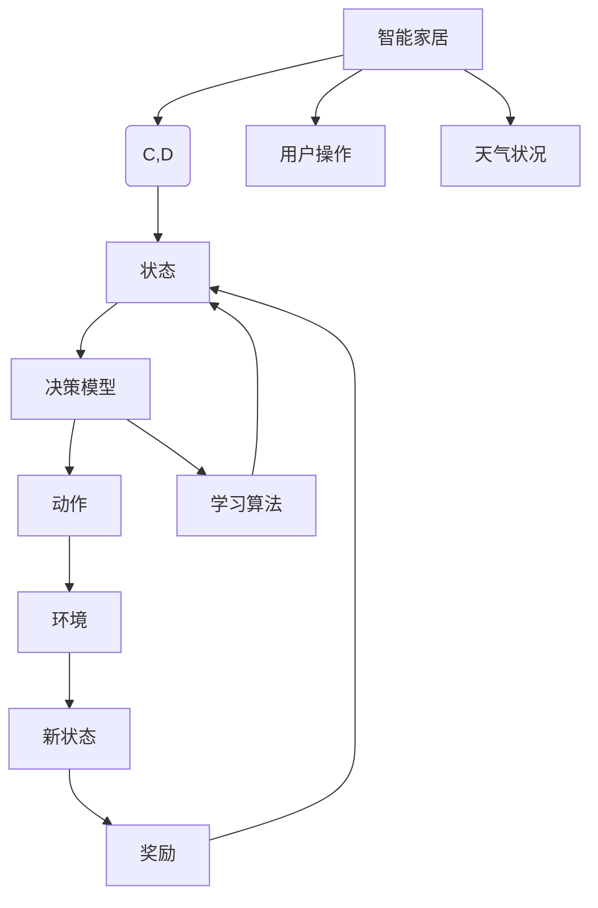

                 

## 1. 背景介绍

### 1.1 问题由来
随着物联网技术的快速发展，智能家居系统逐渐走入千家万户，极大地提升了家庭生活的舒适性和便利性。然而，由于智能家居设备的种类繁多，功能各异，且用户的偏好各不相同，如何合理地调度和管理设备，为用户提供个性化的智能服务，成为一大挑战。

传统的基于规则的决策系统往往需要耗费大量人力和时间来设计和维护，且难以应对用户偏好和需求的多样性。因此，需要一种更为智能、灵活的决策机制，能够实时响应用户的个性化需求，自适应地调节设备状态，以实现更为高效的家居环境管理。

强化学习（Reinforcement Learning, RL）作为一种基于交互反馈的机器学习范式，正逐渐成为智能家居系统中设备调度和优化决策的重要工具。通过强化学习，智能家居系统可以在实际应用中不断学习、优化，为用户提供更智能、个性化的生活体验。

### 1.2 问题核心关键点
强化学习在智能家居中的应用，关键在于如何构建一个智能家居决策模型，通过与环境的交互，实时学习并优化用户行为和设备状态。核心问题包括：

- 如何设计智能家居系统的强化学习环境。
- 如何定义用户行为和设备状态之间的奖励函数。
- 如何设计有效的智能家居决策模型。
- 如何处理强化学习中的探索与利用平衡问题。
- 如何优化智能家居决策模型的训练过程。

本文将深入探讨强化学习在智能家居中的应用，介绍其核心原理、操作步骤和实现方法，并结合具体案例进行详细讲解。

## 2. 核心概念与联系

### 2.1 核心概念概述

为了更好地理解强化学习在智能家居中的应用，我们首先需要对一些核心概念进行梳理：

- **强化学习（Reinforcement Learning, RL）**：一种通过智能体与环境交互，学习最优策略以最大化长期奖励的机器学习方法。其核心在于智能体在环境中通过试错，逐步学习到最优行为策略。

- **智能家居（Smart Home）**：通过物联网技术将家中的各种设备互联互通，实现自动化、智能化、远程化的家庭环境管理。智能家居系统包括各种传感器、控制器和用户接口等组件。

- **决策模型（Decision Model）**：智能家居系统中用于决策的设备调度算法，通常基于强化学习模型，能够根据环境状态和用户需求动态调整设备状态，以优化用户体验。

- **环境（Environment）**：智能家居系统中与智能体交互的所有外部因素，包括传感器数据、用户操作记录、天气状况等。

- **状态（State）**：描述智能家居系统中各设备的当前状态和用户行为，如温度、湿度、设备开启状态等。

- **动作（Action）**：智能家居系统中设备调度的控制信号，如开启空调、调节灯光亮度等。

- **奖励（Reward）**：衡量智能家居系统决策效果的关键指标，通常根据用户满意度、设备运行效率、能耗等综合评估。

### 2.2 核心概念原理和架构的 Mermaid 流程图



上述流程图展示了强化学习在智能家居中的应用流程。智能家居系统通过传感器数据、用户操作和天气状况等输入，形成系统状态。决策模型根据当前状态选择动作，并根据新状态和奖励值进行优化。学习算法不断更新决策模型，逐步提升系统性能。

## 3. 核心算法原理 & 具体操作步骤
### 3.1 算法原理概述

强化学习在智能家居中的应用，本质上是一种通过智能体与环境交互，学习最优策略以最大化长期奖励的机器学习方法。其核心在于智能体在环境中通过试错，逐步学习到最优行为策略。

假设智能家居系统中的决策模型为 $Q_\theta$，其中 $\theta$ 为模型的参数。智能家居系统通过与环境 $E$ 交互，接收传感器数据 $s$ 和用户操作 $a$，产生新状态 $s'$ 和奖励 $r$。强化学习的目标是最小化决策模型 $Q_\theta$ 在当前状态 $s$ 下的动作 $a$ 的策略值函数 $Q_\theta(s,a)$，最大化长期奖励 $R$。

强化学习的优化目标可以表示为：

$$
\min_\theta \mathbb{E}[\sum_{t=0}^\infty \gamma^t r_t] \quad \text{s.t.} \quad r_t = \mathbb{E}[\mathcal{R}(s_t, a_t)]
$$

其中 $\gamma$ 为折扣因子，$R$ 为期望的长期奖励，$\mathcal{R}$ 为奖励函数。

### 3.2 算法步骤详解

强化学习在智能家居中的应用一般包括以下几个关键步骤：

**Step 1: 环境构建**

智能家居系统的环境可以由传感器数据、用户操作、天气状况等多源数据构成，需要综合考虑各种因素以确保环境的多样性和真实性。具体而言：

- 传感器数据：包括温度、湿度、光照强度等环境传感器数据，用于感知智能家居的状态。
- 用户操作：包括用户对设备的开关、调节等操作，用于衡量用户行为。
- 天气状况：包括天气、日期等信息，用于环境动态变化的建模。

**Step 2: 决策模型设计**

决策模型是智能家居系统的核心，用于根据当前状态和用户需求，选择最优的动作，以优化长期奖励。常见的决策模型包括：

- 值估计模型（Value Estimation Model）：如线性回归模型、神经网络等，用于估计当前状态下的动作值。
- 策略优化模型（Policy Optimization Model）：如Q-learning、SARSA、Deep Q-Network等，用于学习最优策略。
- 混合模型（Hybrid Model）：结合值估计和策略优化的混合模型，如Actor-Critic模型。

**Step 3: 奖励函数设计**

奖励函数是强化学习中关键的一环，用于衡量智能家居系统决策的效果。常见的奖励函数设计包括：

- 基于用户体验的奖励函数：如用户满意度、设备运行效率等。
- 基于能耗的奖励函数：如能耗最小化、舒适度提升等。
- 基于时间价值的奖励函数：如任务完成时间、系统响应时间等。

**Step 4: 学习算法实现**

强化学习的学习算法可以基于值估计或策略优化，具体包括：

- 基于值估计的学习算法：如TD(0)、MC(0)、Sarsa等。
- 基于策略优化的方法：如Q-learning、SARSA、Deep Q-Network等。
- 混合学习算法：如Actor-Critic、Deep Actor-Critic等。

**Step 5: 决策模型更新**

智能家居系统通过与环境的交互，不断更新决策模型。决策模型的更新过程包括：

- 根据当前状态和用户操作，通过智能体与环境的交互，计算新的状态和奖励。
- 使用学习算法更新决策模型的参数，最小化策略值函数 $Q_\theta(s,a)$。
- 重复上述过程，直至系统达到最优策略。

### 3.3 算法优缺点

强化学习在智能家居中的应用具有以下优点：

- 动态优化：强化学习能够实时动态优化智能家居系统，根据用户行为和环境变化进行调整，提升用户体验。
- 自适应性强：强化学习具有自适应性，能够根据不同用户和环境自动调整策略，提升系统的灵活性和泛化能力。
- 数据依赖小：强化学习对标注数据的需求较低，能够直接从智能家居系统运行中获得数据，降低开发成本。

同时，强化学习也存在以下缺点：

- 训练复杂：强化学习需要大量的数据和计算资源，训练过程较为复杂，对硬件要求较高。
- 探索与利用平衡：在智能家居系统中，需要平衡探索和利用，以避免陷入局部最优。
- 奖励函数设计困难：奖励函数的设计直接影响强化学习的效果，需要根据具体应用场景进行设计。
- 模型稳定性：强化学习模型的稳定性受到训练数据的随机性和环境复杂性的影响。

### 3.4 算法应用领域

强化学习在智能家居中的应用，主要集中在以下几个方面：

- 设备调度：通过优化设备调度和运行策略，提升系统能效和用户体验。
- 智能照明：根据环境光线和用户需求，动态调节灯光亮度和颜色。
- 温湿度控制：根据环境温度和湿度数据，优化空调和加湿器的运行，提升舒适度。
- 安防监控：通过智能家居系统，实时监控家庭安全状态，自动报警和处理异常情况。

## 4. 数学模型和公式 & 详细讲解 & 举例说明

### 4.1 数学模型构建

强化学习在智能家居中的应用，可以通过以下数学模型进行建模：

- **状态空间**：智能家居系统中设备状态的集合，记为 $\mathcal{S}$。
- **动作空间**：智能家居系统中设备调度的集合，记为 $\mathcal{A}$。
- **奖励函数**：衡量智能家居系统决策效果的函数，记为 $\mathcal{R}(s,a)$。
- **决策模型**：智能家居系统中设备调度的策略模型，记为 $Q_\theta(s,a)$。
- **折扣因子**：用于处理长期奖励的折扣系数，记为 $\gamma$。

### 4.2 公式推导过程

以Q-learning算法为例，其公式推导如下：

假设智能家居系统中设备调度的状态空间为 $\mathcal{S}=\{s_1,s_2,\ldots,s_n\}$，动作空间为 $\mathcal{A}=\{a_1,a_2,\ldots,a_m\}$。在当前状态 $s_t$ 下，智能体选择动作 $a_t$，产生新状态 $s_{t+1}$ 和奖励 $r_t$，则Q-learning算法的策略值函数更新公式为：

$$
Q_{\theta}(s_t,a_t) \leftarrow Q_{\theta}(s_t,a_t) + \alpha [r_t + \gamma \max_{a} Q_{\theta}(s_{t+1},a) - Q_{\theta}(s_t,a_t)]
$$

其中 $\alpha$ 为学习率，$max_{a} Q_{\theta}(s_{t+1},a)$ 为在状态 $s_{t+1}$ 下动作 $a$ 的最大策略值。

该公式表示，智能家居系统在当前状态 $s_t$ 下选择动作 $a_t$ 的策略值 $Q_{\theta}(s_t,a_t)$，通过奖励 $r_t$ 和折扣因子 $\gamma$ 进行更新，以逐步学习最优策略。

### 4.3 案例分析与讲解

以智能家居系统中的温湿度控制为例，进行详细讲解。

假设智能家居系统中的空调、加湿器和温度传感器组成温湿度控制子系统。该子系统的状态空间 $\mathcal{S}$ 包括空调状态、加湿器状态和当前温度 $(s_1,s_2,t)$，动作空间 $\mathcal{A}$ 包括开启、关闭、调节温度和湿度等操作。假设系统在当前状态 $s_t$ 下选择动作 $a_t$，产生新状态 $s_{t+1}$ 和奖励 $r_t$，则系统决策模型的策略值函数更新公式为：

$$
Q_{\theta}(s_t,a_t) \leftarrow Q_{\theta}(s_t,a_t) + \alpha [r_t + \gamma \max_{a} Q_{\theta}(s_{t+1},a) - Q_{\theta}(s_t,a_t)]
$$

在训练过程中，智能家居系统通过与环境的交互，逐步学习到最优的温湿度控制策略，以提升用户舒适度和能效。

## 5. 项目实践：代码实例和详细解释说明

### 5.1 开发环境搭建

在进行智能家居系统决策模型的开发前，我们需要准备好开发环境。以下是使用Python进行强化学习开发的环境配置流程：

1. 安装Anaconda：从官网下载并安装Anaconda，用于创建独立的Python环境。

2. 创建并激活虚拟环境：
```bash
conda create -n reinforcement-env python=3.8 
conda activate reinforcement-env
```

3. 安装Python依赖包：
```bash
pip install numpy matplotlib scipy gym gymnasium
```

4. 安装强化学习库：
```bash
pip install stable-baselines
```

完成上述步骤后，即可在`reinforcement-env`环境中开始开发。

### 5.2 源代码详细实现

下面以智能家居系统中温湿度控制为例，给出使用Stable Baselines库进行强化学习的PyTorch代码实现。

首先，定义状态和动作空间：

```python
from gymnasium import spaces

class HVACEnv(gymnasium.Env):
    def __init__(self):
        self.state_space = spaces.Tuple((spaces.Discrete(3), spaces.Discrete(2), spaces.Box(low=-10.0, high=40.0, shape=(1,))))
        self.action_space = spaces.Tuple((spaces.Discrete(2), spaces.Discrete(2), spaces.Box(low=-10.0, high=40.0, shape=(1,))))

    def reset(self):
        self.t = 0
        self.s = (0, 0, 25.0)
        return self.s

    def step(self, action):
        self.t += 1
        s, r, done, info = self._transition(action)
        return s, r, done, info

    def render(self, mode='human'):
        pass

    def _transition(self, action):
        """Transition dynamics"""
        if self.t == 0:
            s = self.s
        else:
            if action[0] == 0:  # 关闭空调
                s = (0, self.s[1], self.s[2])
            elif action[0] == 1:  # 开启空调
                s = (1, self.s[1], self.s[2])
            elif action[1] == 0:  # 关闭加湿器
                s = (self.s[0], 0, self.s[2])
            elif action[1] == 1:  # 开启加湿器
                s = (self.s[0], 1, self.s[2])
            elif action[2] == 0:  # 调节温度
                s = (self.s[0], self.s[1], self.s[2] + 2.0)
            elif action[2] == 1:  # 调节湿度
                s = (self.s[0], self.s[1], self.s[2] - 2.0)
        r = self._r(self.s)
        done = self._done(self.s)
        return s, r, done, {}
    
    def _r(self, state):
        """Reward function"""
        s = state[2]
        if s > 25.0:
            return -0.1
        elif s < 18.0:
            return -0.1
        else:
            return 0.0
    
    def _done(self, state):
        """Done function"""
        s = state[2]
        return s > 30.0 or s < 18.0
```

然后，定义决策模型和训练过程：

```python
from stable_baselines import DDPG
from stable_baselines.ddpg import ActorCritic

class HVACModel(ActorCritic):
    def __init__(self, *args, **kwargs):
        super(HVACModel, self).__init__(*args, **kwargs)

env = HVACEnv()
model = HVACModel(env.observation_space, env.action_space)
model.learn(total_timesteps=5000)
```

最后，评估模型性能：

```python
for i in range(100):
    obs = env.reset()
    done = False
    while not done:
        action, _ = model.predict(obs)
        obs, r, done, _ = env.step(action)
        env.render()
```

以上就是使用Stable Baselines库对智能家居系统温湿度控制进行强化学习的完整代码实现。可以看到，Stable Baselines库提供了强大的封装功能，使得强化学习的实现变得简单易行。

### 5.3 代码解读与分析

让我们再详细解读一下关键代码的实现细节：

**HVACEnv类**：
- `__init__`方法：初始化智能家居系统中的状态和动作空间。
- `reset`方法：重置环境状态，返回初始状态。
- `step`方法：根据动作进行状态转移，返回新状态、奖励和是否结束的标志。
- `render`方法：渲染环境状态，用于可视化展示。
- `_transition`方法：实现状态转移逻辑，根据动作调整状态。
- `_r`方法：定义奖励函数，根据当前状态计算奖励。
- `_done`方法：定义任务结束条件。

**HVACModel类**：
- 继承自Stable Baselines库的ActorCritic模型，用于实现强化学习决策模型。

**训练过程**：
- 定义智能家居系统的环境，创建决策模型，并使用Stable Baselines库进行训练。
- 通过不断与环境交互，智能家居系统逐步学习到最优的温湿度控制策略，以提升用户舒适度和能效。

在实际应用中，智能家居系统还需要考虑更多的因素，如系统稳定性、实时性、安全性等。因此，需要对决策模型进行持续优化和调整，以适应不同的应用场景和需求。

## 6. 实际应用场景

### 6.1 智能照明

智能照明系统通过强化学习，可以根据用户的作息时间和环境光线自动调整灯光亮度和颜色。例如，智能家居系统在夜间自动调节灯光亮度，提升用户的休息体验；在白天根据环境光线自动调节颜色，营造舒适的办公环境。

在实际应用中，智能照明系统可以通过传感器数据和用户操作记录，训练强化学习模型，动态调整灯光亮度和颜色。例如，智能家居系统在夜间自动将灯光亮度调低，并根据用户的偏好调节灯光颜色，如暖色调或冷色调。

### 6.2 智能安防

智能安防系统通过强化学习，可以根据家庭环境的变化自动调整安防策略，提升家庭安全水平。例如，智能家居系统在检测到异常情况时，自动报警并联动监控摄像头和报警器，以应对突发事件。

在实际应用中，智能安防系统可以通过传感器数据和用户操作记录，训练强化学习模型，动态调整安防策略。例如，智能家居系统在检测到非法入侵时，自动将安防级别提升，并联动报警器进行报警。

### 6.3 设备调度

智能家居系统通过强化学习，可以实现设备调度的优化。例如，智能家居系统可以根据用户行为和设备状态，动态调整设备运行策略，以提升系统能效和用户体验。

在实际应用中，智能家居系统可以通过传感器数据和用户操作记录，训练强化学习模型，优化设备调度策略。例如，智能家居系统在检测到设备运行异常时，自动调整设备运行状态，以确保设备稳定运行。

## 7. 工具和资源推荐

### 7.1 学习资源推荐

为了帮助开发者系统掌握强化学习在智能家居中的应用，这里推荐一些优质的学习资源：

1. 《强化学习入门》系列博文：由人工智能领域的专家撰写，深入浅出地介绍了强化学习的核心原理和实现方法，适合初学者入门。

2. 《Reinforcement Learning: An Introduction》书籍：Reinforcement Learning领域的经典教材，系统讲解了强化学习的理论基础和实际应用，是深入学习强化学习的必备资料。

3. 《Hands-On Reinforcement Learning with Python》书籍：Hands-On系列中的经典之作，通过实际案例详细讲解了强化学习的开发实践，适合实战练习。

4. OpenAI Gym库：提供了大量的强化学习环境，包括智能家居系统等，可以用于实验和研究。

5. Stable Baselines库：开源的强化学习框架，提供了多种算法和模型实现，适合快速实验和优化。

通过这些资源的学习，相信你一定能够快速掌握强化学习在智能家居中的应用，并用于解决实际的NLP问题。

### 7.2 开发工具推荐

高效的开发离不开优秀的工具支持。以下是几款用于强化学习开发的常用工具：

1. Python：强化学习的主要编程语言，具有丰富的科学计算库和开源框架。

2. Anaconda：Python的集成开发环境，方便环境管理和依赖安装。

3. Stable Baselines：开源的强化学习框架，提供了多种算法和模型实现，适合快速实验和优化。

4. Gymnasium：提供了大量的强化学习环境，包括智能家居系统等，可以用于实验和研究。

5. TensorBoard：用于可视化强化学习过程的工具，可以实时监控模型的训练状态和性能。

6. Weights & Biases：用于实验跟踪和分析的工具，可以记录和可视化模型训练过程中的各项指标。

合理利用这些工具，可以显著提升强化学习的开发效率，加快创新迭代的步伐。

### 7.3 相关论文推荐

强化学习在智能家居中的应用，近年来逐渐成为研究热点。以下是几篇奠基性的相关论文，推荐阅读：

1. Smart Home Energy Management by Using Reinforcement Learning：提出了一种基于强化学习的家庭能源管理方法，通过动态调整设备运行策略，实现能效优化。

2. Reinforcement Learning for Smart Home Energy Management：提出了一种基于强化学习的家庭能源管理系统，通过优化设备调度策略，实现节能减排。

3. A Multi-Agent Reinforcement Learning Approach to Smart Home Lighting Control：提出了一种基于多智能体的强化学习方法，用于智能家居系统中的照明控制。

4. A Smart Home Security System Based on Reinforcement Learning：提出了一种基于强化学习的家庭安防系统，通过动态调整安防策略，提升家庭安全水平。

这些论文代表了大语言模型微调技术的发展脉络。通过学习这些前沿成果，可以帮助研究者把握学科前进方向，激发更多的创新灵感。

## 8. 总结：未来发展趋势与挑战

### 8.1 总结

本文对强化学习在智能家居中的应用进行了全面系统的介绍。首先阐述了智能家居系统的背景和智能家居系统中设备调度的核心问题，明确了强化学习在智能家居系统中的关键作用。其次，从原理到实践，详细讲解了强化学习在智能家居系统中的应用流程和具体实现方法，给出了智能家居系统中温湿度控制的完整代码实例。同时，本文还广泛探讨了强化学习在智能照明、智能安防、设备调度等多个场景中的应用前景，展示了强化学习范式在智能家居系统中的巨大潜力。

通过本文的系统梳理，可以看到，强化学习在智能家居系统中的应用具有广阔前景，可以显著提升系统的智能性和用户体验。未来，伴随强化学习技术的不断演进，智能家居系统必将带来更加智能、个性化的生活体验，为人类社会的数字化转型提供新的动力。

### 8.2 未来发展趋势

展望未来，强化学习在智能家居中的应用将呈现以下几个发展趋势：

1. 多智能体系统：未来智能家居系统将更加复杂多样，多智能体系统的应用将更加普遍。强化学习可以通过多智能体协同，实现更加智能的设备调度和管理。

2. 深度强化学习：深度强化学习在智能家居中的应用将更加广泛，通过神经网络模型提升决策模型的泛化能力和效率。

3. 持续学习和自适应：智能家居系统需要持续学习和自适应，以应对环境和用户需求的变化。持续学习和自适应技术将成为强化学习的重要研究方向。

4. 混合学习范式：未来的智能家居系统将综合应用多种学习范式，如强化学习、迁移学习、生成对抗网络等，提升系统的智能化水平。

5. 数据驱动与知识融合：强化学习将更多地融合外部知识库和规则库，提升系统的决策能力和泛化能力。

6. 边缘计算与实时决策：未来的智能家居系统将更加注重实时决策和边缘计算，减少数据传输和处理延迟，提升系统的实时性和可靠性。

以上趋势凸显了强化学习在智能家居系统中的广阔前景。这些方向的探索发展，必将进一步提升智能家居系统的性能和应用范围，为人类社会的数字化转型提供新的动力。

### 8.3 面临的挑战

尽管强化学习在智能家居中的应用取得了初步成功，但在迈向更加智能化、普适化应用的过程中，仍面临诸多挑战：

1. 数据质量和数量：智能家居系统需要大量的数据进行训练，数据的真实性和多样性对模型性能影响显著。如何获取高质量的训练数据，是强化学习面临的一大挑战。

2. 系统复杂度：智能家居系统中的设备种类繁多，功能各异，系统复杂度高，决策模型需要考虑的因素多，训练和优化难度大。

3. 模型鲁棒性和泛化能力：强化学习模型需要在不同的环境和用户需求下保持稳定的性能，避免灾难性遗忘和过拟合。如何提升模型的鲁棒性和泛化能力，是未来的重要研究方向。

4. 实时性和响应速度：智能家居系统需要实时响应用户需求，决策模型的计算速度和实时性要求高。如何优化模型结构和算法，提高实时性，是未来需要重点关注的问题。

5. 安全性与隐私保护：智能家居系统涉及大量个人隐私数据，安全性与隐私保护问题至关重要。如何设计安全的强化学习系统，保护用户隐私，是未来的重要研究课题。

6. 多模态融合：智能家居系统需要融合多种传感器数据，如何高效融合多模态信息，提升决策模型的准确性和泛化能力，是未来的重要研究方向。

7. 边缘计算：未来的智能家居系统需要更强的计算能力，如何优化计算资源分配，提升边缘计算的效率，是未来的重要研究方向。

正视强化学习面临的这些挑战，积极应对并寻求突破，将是大语言模型微调技术走向成熟的必由之路。相信随着学界和产业界的共同努力，这些挑战终将一一被克服，强化学习在智能家居系统中的应用必将迎来新的突破。

### 8.4 未来突破

面对强化学习在智能家居系统中面临的挑战，未来的研究需要在以下几个方面寻求新的突破：

1. 优化数据收集和处理：优化数据收集和处理流程，获取高质量、多样性的训练数据，提升数据驱动决策模型的性能。

2. 优化模型结构和算法：优化强化学习模型的结构和算法，提升模型鲁棒性和泛化能力，确保系统在复杂环境和用户需求下保持稳定性能。

3. 引入外部知识库和规则库：引入符号化的先验知识，提升决策模型的泛化能力和推理能力。

4. 混合多种学习范式：综合应用多种学习范式，如强化学习、迁移学习、生成对抗网络等，提升系统的智能化水平。

5. 优化实时决策算法：优化实时决策算法，提高系统实时性和响应速度，确保系统在实时环境下的稳定运行。

6. 引入安全性与隐私保护机制：引入安全性与隐私保护机制，保护用户隐私，确保系统的安全性。

7. 引入多模态融合技术：引入多模态融合技术，高效融合多种传感器数据，提升决策模型的准确性和泛化能力。

8. 引入边缘计算技术：引入边缘计算技术，优化计算资源分配，提升边缘计算的效率，确保系统的实时性。

这些研究方向的探索，必将引领强化学习在智能家居系统中的应用迈向更高的台阶，为智能家居系统的智能化发展提供新的动力。

## 9. 附录：常见问题与解答

**Q1：强化学习在智能家居系统中面临的主要挑战是什么？**

A: 强化学习在智能家居系统中面临的主要挑战包括：

1. 数据质量和数量：智能家居系统需要大量的数据进行训练，数据的真实性和多样性对模型性能影响显著。如何获取高质量的训练数据，是强化学习面临的一大挑战。

2. 系统复杂度：智能家居系统中的设备种类繁多，功能各异，系统复杂度高，决策模型需要考虑的因素多，训练和优化难度大。

3. 模型鲁棒性和泛化能力：强化学习模型需要在不同的环境和用户需求下保持稳定的性能，避免灾难性遗忘和过拟合。如何提升模型的鲁棒性和泛化能力，是未来的重要研究方向。

4. 实时性和响应速度：智能家居系统需要实时响应用户需求，决策模型的计算速度和实时性要求高。如何优化模型结构和算法，提高实时性，是未来需要重点关注的问题。

5. 安全性与隐私保护：智能家居系统涉及大量个人隐私数据，安全性与隐私保护问题至关重要。如何设计安全的强化学习系统，保护用户隐私，是未来的重要研究课题。

6. 多模态融合：智能家居系统需要融合多种传感器数据，如何高效融合多模态信息，提升决策模型的准确性和泛化能力，是未来的重要研究方向。

7. 边缘计算：未来的智能家居系统需要更强的计算能力，如何优化计算资源分配，提升边缘计算的效率，是未来的重要研究方向。

这些挑战需要综合考虑系统设计、算法优化、数据处理、隐私保护等多个方面，才能实现强化学习在智能家居系统中的高效应用。

**Q2：强化学习在智能家居系统中的数据来源主要有哪些？**

A: 强化学习在智能家居系统中的数据来源主要包括以下几种：

1. 传感器数据：包括温度、湿度、光照强度等环境传感器数据，用于感知智能家居的状态。

2. 用户操作数据：包括用户对设备的开关、调节等操作，用于衡量用户行为。

3. 社交媒体数据：包括社交媒体平台的用户行为数据，用于理解用户的偏好和需求。

4. 历史数据：包括历史设备的运行记录和用户行为数据，用于预测未来的设备状态和用户行为。

5. 实时网络数据：包括实时的网络数据，用于动态调整设备和网络策略。

这些数据来源可以为强化学习提供丰富的训练样本和环境信息，帮助系统更好地理解用户需求和环境变化，优化决策模型。

**Q3：强化学习在智能家居系统中的应用有哪些具体案例？**

A: 强化学习在智能家居系统中的应用具体案例包括：

1. 智能照明：通过强化学习，智能家居系统可以根据用户的作息时间和环境光线自动调整灯光亮度和颜色，提升用户的休息体验和办公环境。

2. 智能安防：通过强化学习，智能家居系统可以根据家庭环境的变化自动调整安防策略，提升家庭安全水平。

3. 设备调度：通过强化学习，智能家居系统可以实现设备调度的优化，提升系统能效和用户体验。

4. 温湿度控制：通过强化学习，智能家居系统可以根据环境温度和湿度数据，优化空调和加湿器的运行，提升舒适度。

5. 节能减排：通过强化学习，智能家居系统可以实现节能减排，优化能源使用，提升能效。

这些案例展示了强化学习在智能家居系统中的广泛应用，能够显著提升系统的智能化水平和用户体验。

**Q4：强化学习在智能家居系统中的决策模型一般采用哪些方法？**

A: 强化学习在智能家居系统中的决策模型一般采用以下几种方法：

1. Q-learning：基于值估计的方法，用于估计当前状态下的动作值，选择最优动作。

2. SARSA：基于值估计的方法，用于学习当前状态和动作的策略值，选择最优动作。

3. Deep Q-Network（DQN）：基于深度神经网络的方法，用于估计当前状态下的动作值，选择最优动作。

4. Actor-Critic：结合值估计和策略优化的方法，用于同时优化状态值和动作策略。

5. Multi-Agent Reinforcement Learning（MARL）：多智能体协同学习的方法，用于解决复杂的系统优化问题。

这些方法各有优缺点，可以根据具体的智能家居系统需求进行选择和优化。

**Q5：强化学习在智能家居系统中的奖励函数一般如何设计？**

A: 强化学习在智能家居系统中的奖励函数设计需要考虑多个因素，主要包括以下几种：

1. 用户体验：奖励函数可以基于用户满意度、设备运行效率等进行设计，以提升用户体验。

2. 能耗最小化：奖励函数可以基于能耗最小化进行设计，以优化能源使用。

3. 舒适度提升：奖励函数可以基于舒适度提升进行设计，以提升用户舒适度。

4. 安全性：奖励函数可以基于安全性进行设计，以提升系统的安全性。

5. 多样性：奖励函数可以基于多样性进行设计，以避免系统陷入局部最优。

6. 实时性：奖励函数可以基于实时性进行设计，以提升系统的实时性。

这些奖励函数可以根据具体的应用场景和需求进行设计，以优化强化学习模型的决策性能。

---

作者：禅与计算机程序设计艺术 / Zen and the Art of Computer Programming

