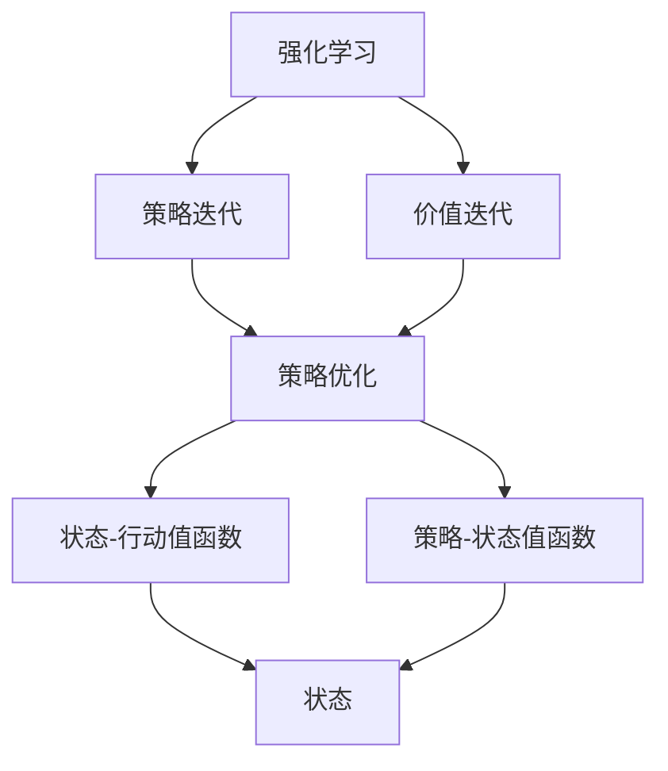

                 

## 1. 背景介绍

### 1.1 问题由来

强化学习（Reinforcement Learning, RL）是一种智能体（agent）在与环境的互动中，通过学习最优策略来最大化累积奖励（cumulative reward）的机器学习框架。与传统的监督学习和无监督学习不同，强化学习侧重于学习在复杂环境下的决策策略，这在许多现实世界问题中具有重要应用，如机器人控制、游戏AI、资源调度等。

在强化学习中，智能体通过观察当前状态，采取一个行动，接收环境反馈（奖励和下一状态），然后根据这些信息调整策略，以期在未来获得更好的奖励。这种“试错”的学习方式，使得强化学习在许多不确定性、非结构化环境问题中具有独特的优势。

### 1.2 问题核心关键点

强化学习的核心在于智能体通过与环境的互动，学习到一个最优策略，使得累计奖励最大化。这一过程可以分为两大类：策略迭代（policy iteration）和价值迭代（value iteration）。策略迭代关注于直接学习策略，而价值迭代则侧重于学习价值函数，再根据价值函数反推策略。本文将深入探讨这两类算法的原理和步骤，并对比它们的优缺点及应用领域。

### 1.3 问题研究意义

强化学习的研究意义主要体现在：
- **解决复杂问题**：强化学习可以处理复杂非结构化问题，如机器人导航、游戏AI等，这些问题是传统机器学习方法难以解决的。
- **提供智能决策**：强化学习能够学习到在特定环境下做出最优决策的策略，为智能决策提供新思路。
- **推动AI技术发展**：强化学习与深度学习、迁移学习等技术结合，可以显著提升AI系统的智能化水平。
- **促进跨领域应用**：强化学习在多个领域中展现了良好的应用前景，如自动驾驶、机器人控制、医疗诊断等。

## 2. 核心概念与联系

### 2.1 核心概念概述

为更好地理解强化学习的策略迭代和价值迭代，本节将介绍几个密切相关的核心概念：

- **强化学习**：智能体通过与环境的互动，学习最优策略，使得累计奖励最大化的过程。
- **策略**：智能体在给定状态下采取行动的策略。
- **价值函数**：描述智能体在某个状态下，采取某行动的长期奖励。
- **状态-行动值函数**：表示在某个状态下采取某行动的价值。
- **策略-状态值函数**：表示在给定策略下，智能体在某个状态的价值。
- **策略优化**：通过优化策略，使得累计奖励最大化。
- **值迭代**：通过不断迭代价值函数，来优化策略。
- **策略迭代**：通过不断迭代策略，来优化价值函数。

这些核心概念之间的逻辑关系可以通过以下Mermaid流程图来展示：



这个流程图展示强化学习的核心概念及其之间的关系：

1. 强化学习通过智能体与环境的互动，学习最优策略。
2. 策略迭代关注于优化策略，使得智能体的行为能够最大化累积奖励。
3. 价值迭代通过优化价值函数，反推最优策略。
4. 状态-行动值函数和策略-状态值函数是策略迭代和价值迭代共同的核心指标。

这些概念共同构成了强化学习的学习和优化框架，使得智能体能够通过与环境的互动，学习到最优的决策策略。通过理解这些核心概念，我们可以更好地把握强化学习的策略迭代和价值迭代的原理和应用。

## 3. 核心算法原理 & 具体操作步骤

### 3.1 算法原理概述

强化学习的策略迭代和价值迭代，本质上是通过不断的优化策略和价值函数，使得智能体能够最大化长期累积奖励的过程。这两种方法虽然侧重点不同，但本质上都关注于智能体行为与环境奖励的相互作用，从而提升智能体的性能。

策略迭代的本质是通过不断优化策略，使得智能体在不同状态下的行为能够最大化长期累积奖励。具体而言，策略迭代算法通过不断改进策略，逐步逼近最优策略，以期在每个状态下采取最优行动。

价值迭代的本质是通过不断优化价值函数，反推最优策略。具体而言，价值迭代算法通过不断更新价值函数，计算出每个状态下采取行动的最优价值，再根据这些最优价值来调整策略，以期在每个状态下采取最优行动。

### 3.2 算法步骤详解

#### 策略迭代

策略迭代的算法步骤如下：

1. **初始策略**：选择一个初始策略 $\pi^0$。
2. **策略评估**：计算在策略 $\pi^k$ 下，每个状态的价值 $V^k$。
3. **策略改进**：根据当前策略 $π$ 和价值函数 $V^k$，改进策略，得到新的策略 $π^{k+1}$。
4. **重复迭代**：重复步骤2和步骤3，直到策略收敛或达到预设的迭代次数。

##### 3.2.1 策略评估

在策略迭代中，策略评估是通过计算每个状态的价值函数来实现的。价值函数 $V^k$ 描述了在策略 $π^k$ 下，智能体在状态 $s$ 下采取行动 $a$ 的长期奖励期望。其计算公式如下：

$$
V^k(s) = \sum_{s'} P(s'|s,a) \left[ R(s,a,s') + \gamma V^k(s') \right]
$$

其中 $P(s'|s,a)$ 表示在状态 $s$ 下，采取行动 $a$ 后转移到状态 $s'$ 的概率，$R(s,a,s')$ 表示采取行动 $a$ 后转移到状态 $s'$ 的即时奖励，$\gamma$ 是折扣因子，通常取值为0.9。

##### 3.2.2 策略改进

在策略迭代中，策略改进是通过选择最优策略来实现的。最优策略 $π^{k+1}$ 是在当前状态 $s$ 下，能够最大化长期累积奖励的行动 $a$。其计算公式如下：

$$
\pi^{k+1}(s) = \arg\max_a Q^k(s,a)
$$

其中 $Q^k(s,a)$ 表示在策略 $π^k$ 下，智能体在状态 $s$ 下采取行动 $a$ 的长期奖励期望。

#### 价值迭代

价值迭代的算法步骤如下：

1. **初始价值函数**：选择一个初始价值函数 $V^0$。
2. **价值评估**：计算每个状态的价值 $V^{k+1}$。
3. **价值改进**：根据当前价值函数 $V^k$，改进价值函数，得到新的价值函数 $V^{k+1}$。
4. **重复迭代**：重复步骤2和步骤3，直到价值函数收敛或达到预设的迭代次数。

##### 3.2.3 价值评估

在价值迭代中，价值评估是通过计算每个状态的价值函数来实现的。价值函数 $V^{k+1}$ 描述了在策略 $\pi$ 下，智能体在状态 $s$ 下采取行动 $a$ 的长期奖励期望。其计算公式如下：

$$
V^{k+1}(s) = \sum_{s'} P(s'|s,a) \left[ R(s,a,s') + \gamma V^{k+1}(s') \right]
$$

##### 3.2.4 价值改进

在价值迭代中，价值改进是通过优化价值函数来实现的。新的价值函数 $V^{k+1}$ 是在当前状态 $s$ 下，能够最大化长期累积奖励的价值。其计算公式如下：

$$
V^{k+1}(s) = \max_a \left[ R(s,a,s') + \gamma V^{k}(s') \right]
$$

### 3.3 算法优缺点

#### 策略迭代的优点：

1. **直接优化策略**：策略迭代通过优化策略本身，逐步逼近最优策略，能够直观地理解和控制智能体的行为。
2. **收敛速度快**：策略迭代往往能够快速收敛到最优策略，尤其适用于问题规模较小的情况。
3. **适合模型优化**：策略迭代适用于模型优化，如神经网络等深度学习模型。

#### 策略迭代的缺点：

1. **计算复杂度高**：策略迭代通常需要计算状态价值函数，计算量较大，不适合大规模问题。
2. **难以处理连续状态**：策略迭代对于连续状态空间的问题，求解过程较为困难。

#### 价值迭代的优点：

1. **易于计算**：价值迭代只需计算状态价值函数，计算量相对较小，适合大规模问题。
2. **计算复杂度低**：价值迭代通过优化价值函数，避免了复杂的状态值函数计算。
3. **适合连续状态**：价值迭代对于连续状态空间的问题，求解过程较为简单。

#### 价值迭代的缺点：

1. **收敛速度慢**：价值迭代通常需要多次迭代才能收敛到最优价值函数，收敛速度较慢。
2. **难以优化策略**：价值迭代只优化价值函数，不能直接控制智能体的行为策略。

### 3.4 算法应用领域

策略迭代和价值迭代在强化学习的不同应用场景中各具优势，广泛应用于以下领域：

- **机器人控制**：如四足机器人、无人驾驶汽车等，通过策略迭代优化路径规划和动作选择，实现智能控制。
- **游戏AI**：如AlphaGo、Dota2 AI等，通过策略迭代优化游戏策略，提升游戏胜率。
- **资源调度**：如云计算资源调度、电网调度等，通过价值迭代优化资源分配，提升系统效率。
- **医疗诊断**：如CT影像诊断、个性化医疗等，通过策略迭代优化诊断路径，提升诊断准确性。
- **金融交易**：如股票交易、风险管理等，通过策略迭代优化交易策略，实现盈利最大化。

## 4. 数学模型和公式 & 详细讲解 & 举例说明

### 4.1 数学模型构建

强化学习的数学模型建立在马尔可夫决策过程（Markov Decision Process, MDP）的基础之上，通常由状态空间 $S$、行动空间 $A$、状态转移概率 $P(s'|s,a)$、即时奖励函数 $R(s,a,s')$ 和折扣因子 $\gamma$ 组成。

在策略迭代中，策略 $\pi$ 表示在每个状态下选择行动的概率分布，策略评估的数学模型如下：

$$
V^k(s) = \sum_{a} \pi^k(a|s) \left[ R(s,a,s') + \gamma \sum_{s'} P(s'|s,a) V^k(s') \right]
$$

在价值迭代中，价值函数 $V$ 表示在每个状态下采取行动的长期奖励期望，价值评估的数学模型如下：

$$
V^{k+1}(s) = \max_a \left[ R(s,a,s') + \gamma \sum_{s'} P(s'|s,a) V^{k}(s') \right]
$$

### 4.2 公式推导过程

#### 策略迭代

策略迭代的公式推导基于马尔可夫决策过程的数学模型，主要分为两个部分：策略评估和策略改进。

策略评估的公式推导如下：

$$
V^k(s) = \sum_{a} \pi^k(a|s) \left[ R(s,a,s') + \gamma \sum_{s'} P(s'|s,a) V^k(s') \right]
$$

策略改进的公式推导如下：

$$
\pi^{k+1}(s) = \arg\max_a Q^k(s,a)
$$

其中 $Q^k(s,a)$ 表示在策略 $π^k$ 下，智能体在状态 $s$ 下采取行动 $a$ 的长期奖励期望。

#### 价值迭代

价值迭代的公式推导同样基于马尔可夫决策过程的数学模型，主要分为两个部分：价值评估和价值改进。

价值评估的公式推导如下：

$$
V^{k+1}(s) = \sum_{s'} P(s'|s,a) \left[ R(s,a,s') + \gamma V^{k+1}(s') \right]
$$

价值改进的公式推导如下：

$$
V^{k+1}(s) = \max_a \left[ R(s,a,s') + \gamma V^{k}(s') \right]
$$

### 4.3 案例分析与讲解

#### 案例：迷宫寻路问题

假设有一个迷宫，智能体需要从起点 $s_0$ 出发，通过一系列行动 $a$，到达终点 $s_t$。在每个状态 $s$ 下，采取行动 $a$ 后转移到状态 $s'$ 的概率为 $P(s'|s,a)$，即时奖励为 $R(s,a,s')$。迷宫状态空间和行动空间较大，因此选择策略迭代进行求解。

1. **初始策略**：假设初始策略为随机策略 $\pi^0(a|s)$。
2. **策略评估**：根据当前策略 $\pi^k$ 和迷宫的马尔可夫决策过程，计算每个状态的价值 $V^k$。
3. **策略改进**：根据当前策略 $π^k$ 和价值函数 $V^k$，改进策略，得到新的策略 $π^{k+1}$。
4. **重复迭代**：重复步骤2和步骤3，直到策略收敛或达到预设的迭代次数。

#### 案例：金融投资问题

假设一个投资者需要在不同的时间点进行投资决策，每个决策对应的即时奖励和状态转移概率已知。投资者希望最大化长期累积收益，选择价值迭代进行求解。

1. **初始价值函数**：假设初始价值函数为 $V^0$。
2. **价值评估**：根据当前价值函数 $V^k$ 和投资决策问题，计算每个状态的价值 $V^{k+1}$。
3. **价值改进**：根据当前价值函数 $V^k$，改进价值函数，得到新的价值函数 $V^{k+1}$。
4. **重复迭代**：重复步骤2和步骤3，直到价值函数收敛或达到预设的迭代次数。

## 5. 项目实践：代码实例和详细解释说明

### 5.1 开发环境搭建

在进行强化学习项目实践前，我们需要准备好开发环境。以下是使用Python进行OpenAI Gym开发的环境配置流程：

1. 安装Anaconda：从官网下载并安装Anaconda，用于创建独立的Python环境。

2. 创建并激活虚拟环境：
```bash
conda create -n reinforcement-env python=3.8 
conda activate reinforcement-env
```

3. 安装OpenAI Gym和其他依赖库：
```bash
pip install gym
pip install numpy matplotlib
```

完成上述步骤后，即可在`reinforcement-env`环境中开始强化学习实践。

### 5.2 源代码详细实现

下面以迷宫寻路问题为例，给出使用OpenAI Gym进行策略迭代和价值迭代的Python代码实现。

首先，导入必要的库：

```python
import gym
import numpy as np
import matplotlib.pyplot as plt
```

然后，定义迷宫状态空间和行动空间：

```python
env = gym.make('LunarLander-v2')
state_dim = env.observation_space.shape[0]
action_dim = env.action_space.shape[0]
```

接着，定义策略迭代和价值迭代算法：

```python
def policy_iteration(env, max_iter=100, discount_factor=0.9, epsilon=1e-3):
    num_states = env.observation_space.n
    num_actions = env.action_space.n
    
    # 初始策略
    pi = np.ones((num_states, num_actions)) / num_actions
    
    # 策略评估函数
    def value_function(pi):
        V = np.zeros(num_states)
        for i in range(num_states):
            V[i] = np.dot(pi[i], env.P[i,:] @ np.array([np.max(env.R[i,:]) + discount_factor * V]))
        return V
    
    # 策略改进函数
    def policy_improvement(pi, V):
        pi_new = np.zeros((num_states, num_actions))
        for i in range(num_states):
            a = np.argmax(V[i] + discount_factor * np.max(env.P[i,:] @ np.array([V[j] for j in range(num_actions)])))
            pi_new[i][a] = epsilon + 1
            pi_new[i][a] = pi_new[i][a] / np.sum(pi_new[i])
        return pi_new
    
    # 策略迭代过程
    for k in range(max_iter):
        V = value_function(pi)
        pi = policy_improvement(pi, V)
        if np.max(np.abs(V - np.max(V))) < epsilon:
            break
    
    return pi, V

def value_iteration(env, max_iter=100, discount_factor=0.9, epsilon=1e-3):
    num_states = env.observation_space.n
    num_actions = env.action_space.n
    
    # 初始价值函数
    V = np.zeros(num_states)
    
    # 价值评估函数
    def value_improvement(V):
        V_new = np.zeros(num_states)
        for i in range(num_states):
            V_new[i] = np.max(np.array([env.R[i,a] + discount_factor * V[j] for a in range(num_actions) for j in range(num_states)]))
        return V_new
    
    # 价值迭代过程
    for k in range(max_iter):
        V = value_improvement(V)
        if np.max(np.abs(V - np.max(V))) < epsilon:
            break
    
    return V
```

最后，启动策略迭代和价值迭代流程：

```python
# 策略迭代
pi, V = policy_iteration(env, max_iter=100, discount_factor=0.9, epsilon=1e-3)

# 价值迭代
V = value_iteration(env, max_iter=100, discount_factor=0.9, epsilon=1e-3)

# 绘制状态价值函数
plt.plot(V)
plt.title('Value Function')
plt.xlabel('Iteration')
plt.ylabel('Value')
plt.show()
```

以上就是使用OpenAI Gym对迷宫寻路问题进行策略迭代和价值迭代的完整代码实现。可以看到，OpenAI Gym封装了大量的环境和任务，使得强化学习开发更加简便高效。

### 5.3 代码解读与分析

让我们再详细解读一下关键代码的实现细节：

**gym.make()函数**：
- 用于创建OpenAI Gym中的特定环境，如LunarLander-v2，该环境模拟了一个月球着陆器的控制问题。

**state_dim和action_dim**：
- 获取环境的观测维度和动作维度，用于定义策略和价值函数。

**policy_iteration函数**：
- 策略迭代算法的实现。其中，`value_function`函数用于评估每个状态的价值，`policy_improvement`函数用于改进策略，`for`循环实现迭代过程。

**value_iteration函数**：
- 价值迭代算法的实现。其中，`value_improvement`函数用于评估每个状态的价值，`for`循环实现迭代过程。

**max_iter参数**：
- 设置最大迭代次数，通常为一个较大的数值，以保证算法的收敛。

**discount_factor参数**：
- 设置折扣因子，通常为一个介于0和1之间的数值，用于计算未来奖励的现值。

**epsilon参数**：
- 设置策略改进的阈值，当策略改进量小于该阈值时，算法终止。

可以看到，OpenAI Gym为强化学习提供了丰富的环境，使得算法开发更加简便，同时通过封装底层计算，使得代码实现更加简洁高效。

当然，在实际应用中，还需要根据具体任务进行算法的优化和改进。但核心的策略迭代和价值迭代算法基本与此类似。

## 6. 实际应用场景

### 6.1 金融投资

在金融投资领域，强化学习算法可以应用于股票交易、资产配置等任务。智能投资者通过学习市场动态，动态调整投资组合，最大化长期收益。例如，AlphaGo等强化学习算法通过学习围棋规则和专家对局，逐步提升对弈水平。

### 6.2 机器人控制

在机器人控制领域，强化学习算法可以应用于四足机器人、无人机等任务。通过模拟环境与实际机器人互动，优化机器人的行动策略，实现智能控制。例如，DeepMind的AlphaStar通过强化学习算法，实现了对星际争霸游戏的顶尖水平。

### 6.3 游戏AI

在游戏AI领域，强化学习算法可以应用于各种电子游戏，如AlphaGo、Dota2 AI等。通过学习游戏规则和玩家对局，逐步提升游戏水平。例如，OpenAI的Dota2 AI通过强化学习算法，实现了与人类顶尖玩家的对弈。

### 6.4 未来应用展望

未来，随着强化学习算法的不断演进，其在更多领域的应用前景将更加广阔。除了上述应用场景外，强化学习还将应用于医疗诊断、资源调度、交通控制等领域，为各行各业带来变革性影响。

在医疗诊断领域，强化学习算法可以应用于图像识别、病情预测等任务。例如，AlphaGo Zero通过强化学习算法，实现了对围棋游戏的顶尖水平，其算法思路同样适用于医疗诊断领域的图像识别任务。

在资源调度领域，强化学习算法可以应用于云计算资源、电网调度等任务。例如，Google的AlphaGo通过强化学习算法，实现了对围棋游戏的顶尖水平，其算法思路同样适用于资源调度领域的任务。

在交通控制领域，强化学习算法可以应用于智能交通管理、自动驾驶等任务。例如，OpenAI的AlphaStar通过强化学习算法，实现了对星际争霸游戏的顶尖水平，其算法思路同样适用于交通控制领域的任务。

总之，强化学习算法在各行各业的应用前景广阔，未来将推动人工智能技术向更加智能化、普适化的方向发展。

## 7. 工具和资源推荐

### 7.1 学习资源推荐

为了帮助开发者系统掌握强化学习的策略迭代和价值迭代原理，这里推荐一些优质的学习资源：

1. 《强化学习：原理、算法与应用》书籍：由Richard S. Sutton和Andrew G. Barto撰写，是强化学习领域的经典教材，系统介绍了强化学习的基本概念和算法。

2. Coursera《强化学习》课程：由斯坦福大学David Silver主讲，是强化学习领域的经典课程，涵盖了强化学习的基本概念和算法。

3. Udacity《强化学习》纳米学位课程：由Vladimir Mnih和Andrew Ng主讲，涵盖了强化学习的基本概念和算法，适合初学者学习。

4. DeepMind《深度强化学习》论文：DeepMind发表的强化学习领域的经典论文，介绍了AlphaGo等算法的原理和应用。

5. OpenAI《强化学习》论文：OpenAI发表的强化学习领域的经典论文，介绍了AlphaStar等算法的原理和应用。

通过对这些资源的学习实践，相信你一定能够快速掌握强化学习的策略迭代和价值迭代的精髓，并用于解决实际的强化学习问题。

### 7.2 开发工具推荐

高效的开发离不开优秀的工具支持。以下是几款用于强化学习开发的常用工具：

1. OpenAI Gym：OpenAI开发的强化学习环境库，提供了丰富的环境任务，方便算法开发和测试。

2. TensorFlow：由Google主导开发的开源深度学习框架，适合强化学习算法的工程化应用。

3. PyTorch：由Facebook主导开发的开源深度学习框架，适合强化学习算法的科研开发。

4. JAX：由Google主导开发的自动微分库，适合强化学习算法的分布式计算和高效优化。

5. Ray：由Ray社区开发的分布式计算框架，适合强化学习算法的分布式训练和模型并行。

6. Gymnasium：OpenAI Gym的增强版本，支持更加丰富的环境和任务，适合算法开发和测试。

合理利用这些工具，可以显著提升强化学习开发和研究的效率，加快创新迭代的步伐。

### 7.3 相关论文推荐

强化学习的研究意义主要体现在：

1. 解决复杂问题：强化学习可以处理复杂非结构化问题，如机器人导航、游戏AI等，这些问题是传统机器学习方法难以解决的。

2. 提供智能决策：强化学习能够学习到在特定环境下做出最优决策的策略，为智能决策提供新思路。

3. 推动AI技术发展：强化学习与深度学习、迁移学习等技术结合，可以显著提升AI系统的智能化水平。

4. 促进跨领域应用：强化学习在多个领域中展现了良好的应用前景，如自动驾驶、机器人控制、医疗诊断等。

这些论文代表强化学习领域的最新进展，通过学习这些前沿成果，可以帮助研究者把握学科前进方向，激发更多的创新灵感。

## 8. 总结：未来发展趋势与挑战

### 8.1 研究成果总结

本文对强化学习的策略迭代和价值迭代方法进行了全面系统的介绍。首先阐述了强化学习的基本原理和应用意义，明确了策略迭代和价值迭代的区别和联系。其次，从原理到实践，详细讲解了策略迭代和价值迭代的数学模型和算法步骤，给出了算法开发和优化的完整代码实现。同时，本文还广泛探讨了强化学习在金融投资、机器人控制、游戏AI等多个领域的应用前景，展示了强化学习算法的广阔应用空间。

通过本文的系统梳理，可以看到，强化学习在复杂环境下的决策优化问题中具有重要应用，为AI技术在各个领域的落地提供了新思路。策略迭代和价值迭代作为强化学习中的两种主要算法，各具优势，能够在不同应用场景中发挥重要作用。未来，随着强化学习算法的研究和应用不断深入，其在更多领域中的应用前景将更加广阔。

### 8.2 未来发展趋势

展望未来，强化学习的研究和应用将呈现以下几个发展趋势：

1. **深度学习与强化学习的结合**：深度学习能够提供强大的特征表示能力，强化学习能够提供智能决策策略，两者的结合将大幅提升AI系统的智能化水平。

2. **分布式训练与优化**：随着大规模强化学习任务的出现，分布式训练和优化技术将变得日益重要。Ray等分布式计算框架将为大规模强化学习任务的训练提供支持。

3. **多智能体系统**：多智能体系统在协作任务中具有重要应用，如分布式机器人控制、团队对抗游戏等，将成为未来研究的热点。

4. **因果推断与强化学习**：因果推断方法能够帮助强化学习更好地理解和解释智能体的决策过程，提高模型的可解释性和鲁棒性。

5. **持续学习和自适应**：持续学习和自适应技术能够使强化学习模型适应动态变化的环境，保持长期稳定性能。

6. **模型压缩与优化**：随着强化学习任务规模的扩大，模型压缩和优化技术将变得日益重要。稀疏化、量化等技术将提升模型的计算效率和存储效率。

### 8.3 面临的挑战

尽管强化学习在多个领域中展现了良好的应用前景，但其研究仍面临诸多挑战：

1. **计算资源需求高**：大规模强化学习任务需要大量的计算资源和存储空间，现有的硬件设施难以满足需求。

2. **高维状态空间**：高维状态空间的问题求解较为困难，需要高效的算法和技术支持。

3. **可解释性不足**：强化学习模型往往难以解释其决策过程，缺乏透明性和可解释性。

4. **对抗攻击脆弱**：强化学习模型容易受到对抗攻击，其决策过程可能受到恶意干扰。

5. **长期稳定性和鲁棒性**：强化学习模型在长期运行中可能面临稳定性问题，需要考虑长期稳定性和鲁棒性。

### 8.4 研究展望

面对强化学习所面临的挑战，未来的研究需要在以下几个方面寻求新的突破：

1. **高效算法与技术**：开发高效的算法和技术，提升计算效率和存储效率，降低对计算资源的依赖。

2. **高维空间表示**：研究高维状态空间表示和求解技术，提升强化学习模型的可扩展性和泛化能力。

3. **模型可解释性**：引入可解释性技术，增强强化学习模型的透明性和可解释性。

4. **对抗攻击防护**：研究对抗攻击防护技术，提升强化学习模型的鲁棒性和安全性。

5. **长期稳定性和鲁棒性**：研究长期稳定性和鲁棒性技术，提升强化学习模型的长期稳定性和鲁棒性。

这些研究方向的探索，必将引领强化学习技术迈向更高的台阶，为构建智能系统提供更多选择和支持。总之，强化学习技术在复杂环境下的决策优化问题中具有重要应用，为AI技术在各个领域的落地提供了新思路。未来，随着强化学习算法的研究和应用不断深入，其在更多领域中的应用前景将更加广阔。

