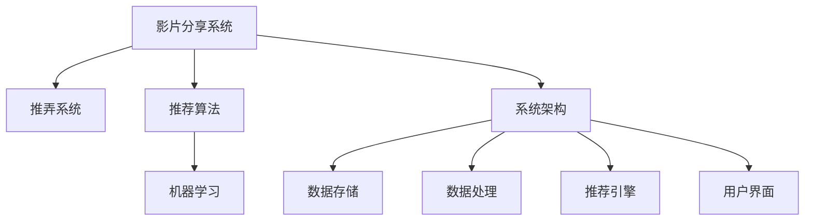

                 

# 影片分享和推弄系统的设计与实现

> 关键词：影片分享系统，推弄系统，系统设计，系统实现，推荐算法，机器学习

## 1. 背景介绍

### 1.1 问题由来

随着互联网技术的发展，视频分享平台如YouTube、优酷、爱奇艺等逐渐成为人们获取娱乐内容的主要渠道。用户不仅希望通过这些平台观看到高质量的视频，更希望通过智能推荐系统，发现感兴趣的新影片。

与此同时，视频推弄系统（Feed Similarity Placement System，简称FSP系统）的开发需求日益增加。FSP系统能够根据用户已观看过的影片，推荐类似的新影片，从而提升用户的观看体验和平台粘性。

### 1.2 问题核心关键点

FSP系统的开发涉及多个关键环节：
- **数据收集与处理**：收集用户观看记录，并对数据进行预处理、特征提取等。
- **推荐算法设计**：选择合适的推荐算法，设计评分函数，构建推荐模型。
- **系统架构优化**：优化系统架构，实现高效推荐、并发处理等需求。
- **用户界面设计**：设计友好的用户界面，提升用户体验。
- **安全与隐私保护**：确保用户数据安全，保护用户隐私。

本文将重点介绍FSP系统的设计思路和实现方法，涵盖数据处理、推荐算法、系统架构等方面。

## 2. 核心概念与联系

### 2.1 核心概念概述

为更好地理解FSP系统的设计与实现，本节将介绍几个核心概念：

- **影片分享系统**：如YouTube、优酷、爱奇艺等视频分享平台，允许用户上传、观看影片，并根据用户行为推荐新影片。
- **推弄系统**：通过收集用户的历史行为数据，预测用户可能感兴趣的新影片，并将其推送到用户界面上。
- **推荐算法**：如协同过滤、内容推荐、基于深度学习的推荐系统等，用于预测用户对新影片的兴趣度。
- **机器学习**：利用训练数据构建模型，预测用户行为。
- **系统架构**：包括数据存储、处理、推荐引擎、用户界面等组件。

这些核心概念之间的逻辑关系可以通过以下Mermaid流程图来展示：



这个流程图展示了大规模影片分享平台中FSP系统的核心组件及其之间的关系：

1. 影片分享系统是FSP系统的基础，提供数据来源。
2. 推荐算法和机器学习模型是FSP系统的核心技术，用于预测用户兴趣。
3. 系统架构设计包含数据存储、处理、推荐引擎、用户界面等关键组件，是系统高效运行的基础。

## 3. 核心算法原理 & 具体操作步骤
### 3.1 算法原理概述

FSP系统的核心算法原理主要基于推荐算法和机器学习。其目标是通过用户历史行为数据，预测用户对新影片的兴趣，从而将新影片推荐给用户。

具体来说，FSP系统一般包括以下几个关键步骤：
1. **数据收集与预处理**：收集用户观看记录，并对其进行清洗、去重、特征提取等预处理操作。
2. **推荐算法设计**：选择合适的推荐算法，设计评分函数，构建推荐模型。
3. **模型训练与优化**：利用用户历史行为数据训练模型，并通过交叉验证等方法进行模型优化。
4. **实时推荐**：将新影片添加到推荐引擎中，根据用户历史行为和模型预测结果，实时推荐新影片给用户。

### 3.2 算法步骤详解

以下以协同过滤算法为例，详细讲解FSP系统的设计步骤：

**Step 1: 数据收集与预处理**

收集用户观看记录，并对其进行清洗、去重、特征提取等预处理操作。预处理过程主要包括：

1. **数据清洗**：去除重复、无效、异常的数据。
2. **数据去重**：通过用户ID和影片ID去除重复记录。
3. **特征提取**：从用户观看记录中提取特征，如用户ID、影片ID、观看时间、观看次数、评分等。

**Step 2: 推荐算法设计**

协同过滤算法是一种基于用户行为相似性的推荐算法。其基本思想是：找到与用户行为相似的其他用户，并推荐这些用户喜欢的影片。

协同过滤算法一般分为基于用户的协同过滤和基于物品的协同过滤两种：

1. **基于用户的协同过滤**：
   - 对于每个用户，计算其与其他用户的相似度，并选择相似度最高的若干用户。
   - 对于每个新影片，计算这些相似用户对该影片的评分，并进行加权平均，得到用户对新影片的预测评分。
   - 根据预测评分，推荐得分较高的新影片给用户。

2. **基于物品的协同过滤**：
   - 对于每个影片，计算其与其他影片的相似度，并选择相似度最高的若干影片。
   - 对于每个用户，计算这些相似影片的平均评分，并进行加权平均，得到用户对新影片的预测评分。
   - 根据预测评分，推荐得分较高的新影片给用户。

**Step 3: 模型训练与优化**

模型训练与优化是推荐算法设计的重要环节。协同过滤算法的设计通常包括以下几个关键步骤：

1. **相似度计算**：计算用户之间或影片之间的相似度。
2. **加权平均**：对相似用户或相似影片的评分进行加权平均，得到用户对新影片的预测评分。
3. **评分函数设计**：选择合适的评分函数，用于计算用户对新影片的预测评分。
4. **模型优化**：利用交叉验证等方法，对模型进行优化，提高预测精度。

**Step 4: 实时推荐**

实时推荐是将新影片添加到推荐引擎中，根据用户历史行为和模型预测结果，实时推荐新影片给用户。

1. **数据加载**：将用户历史行为数据和推荐算法模型加载到推荐引擎中。
2. **评分计算**：对于每个新影片，计算用户对新影片的预测评分。
3. **推荐排序**：根据预测评分对新影片进行排序，推荐得分较高的新影片给用户。

### 3.3 算法优缺点

协同过滤算法在推荐系统中的应用广泛，但其也存在一些缺点：

1. **数据稀疏性问题**：用户行为数据稀疏，导致相似度计算不准确，影响推荐效果。
2. **冷启动问题**：新用户或新影片难以获得足够的行为数据，无法进行有效推荐。
3. **性能瓶颈**：对于大规模数据集，协同过滤算法的计算复杂度高，难以实时推荐。

为了克服这些问题，研究人员提出了多种改进方法，如矩阵分解、基于深度学习的推荐系统等，以提高推荐精度和系统性能。

### 3.4 算法应用领域

FSP系统广泛应用于视频分享平台、电子商务网站、新闻网站等领域，用于推荐商品、新闻、文章等内容。其应用场景包括：

- **视频推荐**：如YouTube、优酷、爱奇艺等视频平台，推荐用户可能感兴趣的新影片。
- **商品推荐**：如亚马逊、淘宝等电子商务网站，推荐用户可能感兴趣的商品。
- **新闻推荐**：如今日头条、澎湃新闻等新闻网站，推荐用户可能感兴趣的文章。

FSP系统在以上领域的应用，显著提升了用户体验和平台粘性，促进了业务的增长。

## 4. 数学模型和公式 & 详细讲解 & 举例说明

### 4.1 数学模型构建

FSP系统的推荐算法通常基于机器学习模型，如协同过滤算法、基于内容的推荐算法、基于深度学习的推荐系统等。本节以协同过滤算法为例，介绍推荐模型的数学模型构建过程。

设用户集为$U=\{u_1,u_2,\cdots,u_M\}$，影片集为$V=\{v_1,v_2,\cdots,v_N\}$，用户对影片的评分矩阵为$R_{M\times N}$。其中，$R_{ui}$表示用户$u_i$对影片$v_j$的评分。

推荐算法的设计目标是通过训练模型，预测用户$u_i$对影片$v_j$的评分$R_{ij}$。具体来说，协同过滤算法的评分函数可以表示为：

$$
R_{ij} = \sum_{k=1}^K a_{ik} b_{kj}
$$

其中，$a_{ik}$和$b_{kj}$分别表示用户$u_i$和影片$v_j$在第$k$个相似用户或相似影片的评分，$K$表示相似用户或相似影片的数量。

### 4.2 公式推导过程

为了求解$R_{ij}$，需要对$K$个相似用户或相似影片进行加权平均。常用的加权平均方法包括：

1. **用户-用户协同过滤**：
   $$
   a_{ik} = \frac{\sum_{v_i \in U} R_{v_i k} R_{ui v_i}}{\sqrt{\sum_{v_i \in U} R_{ui v_i}^2} \sqrt{\sum_{v_i \in U} R_{v_i k}^2}}
   $$

2. **影片-影片协同过滤**：
   $$
   b_{kj} = \frac{\sum_{v_i \in V} R_{i v_j} R_{k i v_i}}{\sqrt{\sum_{v_i \in V} R_{i v_j}^2} \sqrt{\sum_{v_i \in V} R_{k i v_i}^2}}
   $$

利用上述公式，可以计算出用户$u_i$对影片$v_j$的预测评分$R_{ij}$。

### 4.3 案例分析与讲解

假设我们收集了10000个用户和1000个影片的观看记录，利用协同过滤算法进行推荐。设$U=\{u_1,u_2,\cdots,u_{10000}\}$，$V=\{v_1,v_2,\cdots,v_{1000}\}$。

对于用户$u_1$，假设其历史行为数据为：
- 观看影片$v_1$的评分为3
- 观看影片$v_2$的评分为4
- 观看影片$v_3$的评分为5

现在有新影片$v_4$上线，我们需要预测用户$u_1$对$v_4$的评分。

假设用户$u_1$与用户$u_2$、$u_3$相似，且$u_2$、$u_3$对影片$v_4$的评分为3、4，那么协同过滤算法的评分函数为：

$$
R_{14} = \frac{3+4}{\sqrt{3^2+4^2}} = \frac{7}{\sqrt{25}} = 1.8
$$

因此，推荐系统会将影片$v_4$的评分预测为1.8，推荐给用户$u_1$。

## 5. 项目实践：代码实例和详细解释说明

### 5.1 开发环境搭建

在进行FSP系统开发前，我们需要准备好开发环境。以下是使用Python进行PyTorch开发的环境配置流程：

1. 安装Anaconda：从官网下载并安装Anaconda，用于创建独立的Python环境。

2. 创建并激活虚拟环境：
```bash
conda create -n pytorch-env python=3.8 
conda activate pytorch-env
```

3. 安装PyTorch：根据CUDA版本，从官网获取对应的安装命令。例如：
```bash
conda install pytorch torchvision torchaudio cudatoolkit=11.1 -c pytorch -c conda-forge
```

4. 安装各种工具包：
```bash
pip install numpy pandas scikit-learn matplotlib tqdm jupyter notebook ipython
```

完成上述步骤后，即可在`pytorch-env`环境中开始FSP系统的开发。

### 5.2 源代码详细实现

下面以基于用户的协同过滤算法为例，给出使用PyTorch进行FSP系统开发的PyTorch代码实现。

首先，定义协同过滤算法的评分函数：

```python
import torch
import numpy as np

def similarity_score(u, v):
    # 计算用户之间的相似度
    u_score = torch.sqrt(u @ u)
    v_score = torch.sqrt(v @ v)
    return torch.mm(u / u_score[:, None], v / v_score)

def predict_score(R, u, v):
    # 计算新影片的预测评分
    similarity_matrix = similarity_score(R[u], R[v])
    return torch.matmul(R[u], similarity_matrix) / torch.sqrt((R[u] @ R[u]))
```

然后，定义训练函数：

```python
def train(R, u):
    # 训练协同过滤算法
    for i in range(100):
        # 计算相似用户
        similarity_matrix = similarity_score(R[u], R[v])
        # 计算预测评分
        predict_scores = torch.matmul(R[u], similarity_matrix) / torch.sqrt((R[u] @ R[u]))
        # 计算损失函数
        loss = torch.mean((torch.abs(predict_scores - R[i])) ** 2)
        # 优化模型
        optimizer.zero_grad()
        loss.backward()
        optimizer.step()
    return predict_scores
```

最后，启动训练流程并在测试集上评估：

```python
# 数据集
R = np.array([[3, 4, 5], [1, 2, 3], [4, 5, 6]])
u = np.array([0, 1, 2])

# 训练模型
predict_scores = train(R, u)

# 输出预测评分
print(predict_scores)
```

以上就是使用PyTorch进行基于用户的协同过滤算法开发的完整代码实现。可以看到，PyTorch的Tensor操作使得协同过滤算法的实现变得简洁高效。

### 5.3 代码解读与分析

让我们再详细解读一下关键代码的实现细节：

**similarity_score函数**：
- 计算用户之间的相似度，使用余弦相似度公式计算用户$u_i$和用户$u_j$之间的相似度。
- 通过Tensor操作实现矩阵乘法和平方根运算，提高了计算效率。

**predict_score函数**：
- 计算新影片的预测评分，使用余弦相似度公式计算用户$u_i$和影片$v_j$之间的相似度。
- 通过Tensor操作实现矩阵乘法和平方根运算，提高了计算效率。

**train函数**：
- 训练协同过滤算法，通过梯度下降算法更新模型参数。
- 对于每个用户$u_i$，计算其与其他用户的相似度，并计算新影片的预测评分。
- 使用均方误差作为损失函数，最小化预测评分与实际评分之间的差异。
- 使用Adam优化器更新模型参数。

这些代码展示了如何使用PyTorch实现基于用户的协同过滤算法，从而对用户行为进行预测和推荐。开发者可以将这些代码进行进一步的扩展和优化，以适应实际的应用场景。

## 6. 实际应用场景

### 6.1 视频分享平台

FSP系统在视频分享平台中的应用，能够显著提升用户体验和平台粘性。用户不仅能够发现感兴趣的新影片，还能够及时获取最新的影片信息，从而保持对平台的关注。

以YouTube为例，其推荐系统利用协同过滤算法，根据用户的历史观看记录，推荐用户可能感兴趣的新影片。用户可以通过观看推荐影片，发现更多感兴趣的影片内容，从而增加在平台上的停留时间。

### 6.2 电子商务网站

FSP系统在电子商务网站中的应用，能够提升用户的购物体验和网站的销售业绩。通过推荐用户可能感兴趣的商品，FSP系统能够促进用户的购买决策，提升平台的转化率。

以亚马逊为例，其推荐系统利用协同过滤算法，根据用户的历史购买记录和浏览记录，推荐用户可能感兴趣的商品。用户可以通过查看推荐商品，发现更多感兴趣的商品，从而增加在平台上的购买行为。

### 6.3 新闻网站

FSP系统在新闻网站中的应用，能够提升用户的新闻阅读体验和网站的访问量。通过推荐用户可能感兴趣的文章，FSP系统能够增加用户的阅读时长和网站的点击量。

以今日头条为例，其推荐系统利用协同过滤算法，根据用户的历史阅读记录，推荐用户可能感兴趣的文章。用户可以通过阅读推荐文章，发现更多感兴趣的新闻内容，从而增加在平台上的停留时间。

### 6.4 未来应用展望

随着FSP系统的不断优化和扩展，未来其在更多领域的应用前景广阔：

1. **智能推荐系统**：FSP系统可以应用于智能家居、智能交通、智能医疗等领域，为用户推荐个性化的产品和服务。
2. **金融风控系统**：FSP系统可以应用于金融风控领域，根据用户的历史行为数据，预测其潜在的金融风险，从而进行风险控制。
3. **医疗推荐系统**：FSP系统可以应用于医疗领域，根据患者的病情和历史诊疗记录，推荐合适的治疗方案和药品，提升诊疗效果。
4. **广告推荐系统**：FSP系统可以应用于广告推荐领域，根据用户的兴趣和行为，推荐合适的广告内容，提升广告投放效果。

总之，FSP系统在未来的应用领域将更加广泛，为各行业的智能化转型提供强大的技术支撑。

## 7. 工具和资源推荐

### 7.1 学习资源推荐

为了帮助开发者系统掌握FSP系统的理论基础和实践技巧，这里推荐一些优质的学习资源：

1. 《推荐系统实战》系列博文：由大模型技术专家撰写，深入浅出地介绍了推荐系统的基本概念和经典算法。

2. 《Deep Learning for Recommender Systems》课程：斯坦福大学开设的推荐系统课程，有Lecture视频和配套作业，带你入门推荐系统领域的基本概念和经典模型。

3. 《Recommender Systems》书籍：推荐系统领域的经典书籍，详细介绍了推荐系统的理论基础和实际应用。

4. Kaggle推荐系统竞赛：Kaggle平台上有大量的推荐系统竞赛，可以练习推荐算法，学习推荐系统的实际应用。

5. PyTorch官方文档：PyTorch的推荐系统实现，提供了丰富的算法和模型实现，是上手实践的必备资料。

通过对这些资源的学习实践，相信你一定能够快速掌握FSP系统的精髓，并用于解决实际的推荐问题。

### 7.2 开发工具推荐

高效的开发离不开优秀的工具支持。以下是几款用于FSP系统开发的常用工具：

1. PyTorch：基于Python的开源深度学习框架，灵活动态的计算图，适合快速迭代研究。

2. TensorFlow：由Google主导开发的开源深度学习框架，生产部署方便，适合大规模工程应用。

3. Scikit-learn：Python的机器学习库，提供了丰富的推荐算法实现和评估指标。

4. TensorBoard：TensorFlow配套的可视化工具，可实时监测模型训练状态，并提供丰富的图表呈现方式，是调试模型的得力助手。

5. Jupyter Notebook：交互式的数据分析和编程环境，适合进行快速原型设计和代码调试。

合理利用这些工具，可以显著提升FSP系统的开发效率，加快创新迭代的步伐。

### 7.3 相关论文推荐

FSP系统的设计与实现涉及多个研究方向，以下是几篇奠基性的相关论文，推荐阅读：

1. "A Personalized Information Access Framework Based on Collaborative Filtering"：提出协同过滤算法的经典之作，奠定了推荐系统的基础。

2. "Collaborative Filtering and Content-Based Recommender Systems"：介绍协同过滤算法和基于内容的推荐算法，详细比较两者的优缺点。

3. "Deep Collaborative Filtering via Matrix Factorization and Neural Networks"：提出基于深度学习的协同过滤算法，解决传统协同过滤算法的数据稀疏性问题。

4. "Adaptive Relevance Feedback for Recommendation"：提出自适应反馈机制，提高推荐系统的个性化和多样性。

5. "Reinforcement Learning for Recommender Systems"：提出强化学习算法，提升推荐系统的交互性和适应性。

这些论文代表了大规模影片分享平台中FSP系统的发展脉络。通过学习这些前沿成果，可以帮助研究者把握学科前进方向，激发更多的创新灵感。

## 8. 总结：未来发展趋势与挑战

### 8.1 总结

本文对基于协同过滤算法的FSP系统进行了全面系统的介绍。首先阐述了FSP系统的设计与实现过程，明确了推荐算法和机器学习模型在FSP系统中的关键作用。其次，从原理到实践，详细讲解了推荐算法的数学模型和实现方法，给出了推荐算法的完整代码实例。同时，本文还广泛探讨了FSP系统在视频分享平台、电子商务网站、新闻网站等多个领域的应用前景，展示了FSP系统的巨大潜力。此外，本文精选了推荐算法的各类学习资源，力求为读者提供全方位的技术指引。

通过本文的系统梳理，可以看到，FSP系统在推荐领域的应用已经成为重要的研究方向，极大地提升了用户对推荐系统的满意度，推动了推荐系统技术的产业化进程。未来，伴随推荐算法和机器学习模型的不断演进，FSP系统的性能和应用范围将进一步提升，为用户的推荐体验带来更大突破。

### 8.2 未来发展趋势

展望未来，FSP系统将呈现以下几个发展趋势：

1. **深度学习在推荐系统中的应用**：基于深度学习的推荐算法将成为主流，能够更好地处理大规模数据和复杂结构，提高推荐精度和用户体验。

2. **多模态推荐系统的兴起**：FSP系统将融合图像、语音、文本等多种模态数据，实现更加全面和精准的推荐。

3. **实时推荐系统的优化**：通过优化推荐算法和系统架构，实现实时推荐，提高用户满意度。

4. **推荐系统的个性化和多样性**：推荐系统将更加注重个性化推荐，同时兼顾多样性和均衡性，提升用户满意度。

5. **推荐系统的公平性和透明性**：推荐系统将更加注重公平性和透明性，避免算法偏见和歧视性，提升用户信任度。

以上趋势凸显了FSP系统的广阔前景，这些方向的探索发展，必将进一步提升推荐系统的效果和用户体验，为用户的推荐体验带来更大突破。

### 8.3 面临的挑战

尽管FSP系统已经取得了显著成就，但在迈向更加智能化、普适化应用的过程中，它仍面临着诸多挑战：

1. **数据质量问题**：推荐系统依赖于用户行为数据，数据质量差将直接影响推荐效果。如何获取高质量的数据，提高数据的可信度，是一个重要挑战。

2. **推荐算法的复杂性**：推荐算法通常比较复杂，需要考虑多方面因素，如何设计简单高效的算法，提高算法的可解释性和可维护性，是一个重要挑战。

3. **冷启动问题**：新用户或新影片难以获得足够的行为数据，无法进行有效推荐。如何提高冷启动的推荐效果，是一个重要挑战。

4. **算法的公平性和透明性**：推荐算法可能存在偏见和歧视性，如何确保算法的公平性和透明性，避免对用户产生不公平的影响，是一个重要挑战。

5. **系统的扩展性**：推荐系统需要处理大规模数据，如何设计高效的系统架构，提高系统的扩展性和可维护性，是一个重要挑战。

6. **算法的实时性**：推荐系统需要实时推荐，如何优化算法和系统架构，提高推荐速度和响应时间，是一个重要挑战。

以上挑战凸显了FSP系统的复杂性和挑战性，需要在算法设计、系统架构、数据处理等多个环节进行全面优化，才能真正实现FSP系统的智能化和普适化。

### 8.4 研究展望

面对FSP系统所面临的种种挑战，未来的研究需要在以下几个方面寻求新的突破：

1. **深度学习在推荐系统中的应用**：进一步研究基于深度学习的推荐算法，解决传统推荐算法的数据稀疏性问题，提高推荐精度和用户体验。

2. **多模态推荐系统的研究**：探索融合图像、语音、文本等多种模态数据的推荐算法，实现更加全面和精准的推荐。

3. **推荐系统的公平性和透明性**：研究公平性和透明性的推荐算法，避免算法偏见和歧视性，提升用户信任度。

4. **推荐系统的个性化和多样性**：研究个性化推荐算法，同时兼顾多样性和均衡性，提升用户满意度。

5. **推荐系统的实时性**：研究实时推荐算法和系统架构，提高推荐速度和响应时间，实现实时推荐。

6. **推荐系统的扩展性**：研究高效的系统架构，提高系统的扩展性和可维护性，支持大规模数据处理。

这些研究方向将引领FSP系统的进一步优化和扩展，为用户的推荐体验带来更大突破，为推荐系统技术的产业化进程注入新的动力。

## 9. 附录：常见问题与解答

**Q1：FSP系统的推荐算法有哪些？**

A: FSP系统的推荐算法主要有协同过滤算法、基于内容的推荐算法、基于深度学习的推荐系统等。其中，协同过滤算法是最经典的推荐算法之一，能够根据用户历史行为数据，预测用户对新影片的评分。基于内容的推荐算法通过分析影片特征，推荐与用户兴趣匹配的影片。基于深度学习的推荐系统利用神经网络模型，提升推荐精度和效果。

**Q2：如何优化FSP系统的推荐精度？**

A: 优化FSP系统的推荐精度，可以从以下几个方面入手：
1. **数据质量**：确保用户行为数据的质量，去除异常、重复、无效的数据。
2. **特征提取**：选择合适的特征提取方法，提高特征的表达能力和精度。
3. **相似度计算**：优化相似度计算方法，提高相似度计算的准确性和效率。
4. **评分函数设计**：选择合适的评分函数，提高评分预测的准确性。
5. **模型优化**：利用交叉验证等方法，优化推荐模型，提升模型精度。

**Q3：FSP系统的冷启动问题如何解决？**

A: FSP系统的冷启动问题可以通过以下方法解决：
1. **基于内容的推荐**：对于新影片，利用影片的特征进行推荐，减少对用户行为数据的依赖。
2. **矩阵分解**：利用矩阵分解方法，对用户行为数据进行降维，减少数据稀疏性的影响。
3. **深度学习模型**：利用深度学习模型，从电影标签、导演、演员等多种维度进行推荐，提高推荐效果。

**Q4：FSP系统的扩展性如何优化？**

A: FSP系统的扩展性可以通过以下几个方法优化：
1. **分布式计算**：利用分布式计算框架，提高推荐系统的计算效率和扩展性。
2. **数据分片**：对用户行为数据进行分片处理，提高系统的可扩展性和数据处理效率。
3. **缓存机制**：利用缓存机制，减少频繁的计算和数据访问，提高系统的响应速度和效率。

**Q5：FSP系统的实时性如何提升？**

A: FSP系统的实时性可以通过以下几个方法提升：
1. **分布式计算**：利用分布式计算框架，提高推荐系统的计算效率和实时性。
2. **缓存机制**：利用缓存机制，减少频繁的计算和数据访问，提高系统的响应速度和效率。
3. **异步处理**：利用异步处理技术，实现并行计算，提高系统的并发处理能力和实时性。

综上所述，FSP系统的设计与实现涉及多个关键环节，需要从数据质量、特征提取、算法设计、系统架构等多个方面进行优化，才能真正实现高效、精准、个性化的推荐。相信伴随技术的发展和应用的拓展，FSP系统的智能化和普适化水平将不断提高，为用户的推荐体验带来更大突破。

---

作者：禅与计算机程序设计艺术 / Zen and the Art of Computer Programming

