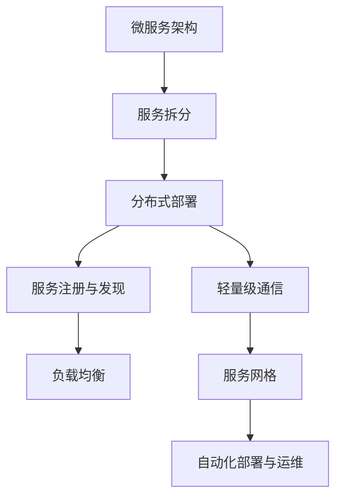

                 

# 微服务架构在高扩展性中的应用

> 关键词：微服务, 高扩展性, 分布式系统, 容器化, 持续集成, DevOps, 云平台, 自动化, 负载均衡, 服务网格, 服务发现, 微服务模式

## 1. 背景介绍

### 1.1 问题由来
在过去十年中，随着互联网应用的快速发展和数据量的爆炸性增长，传统的单体架构已无法满足大规模、高并发、高可靠性的系统需求。单体应用存在诸多问题：

- **扩展性差**：系统难以水平扩展，只能通过增加服务器来提升处理能力，导致成本高昂且难以维护。
- **耦合度高**：各个模块之间高度耦合，改动一个模块可能影响整个系统，维护困难。
- **故障点多**：由于所有代码在一个进程中运行，任何一个地方出现故障，整个系统都可能崩溃。
- **测试复杂**：单体应用难以进行自动化测试，集成测试成本高，难以持续交付高质量产品。

这些问题限制了单体应用的扩展性、灵活性和可靠性。为了解决这些问题，微服务架构应运而生。

### 1.2 问题核心关键点
微服务架构是一种将单体应用拆分成多个小服务的分布式架构，每个服务独立部署、运行和维护，并通过轻量级通信机制进行交互。其核心思想是将复杂的大型系统拆分成多个简单、独立的服务，通过服务间通信实现功能复用，提高系统的扩展性、可靠性和维护性。

微服务架构的关键点包括：
- **拆分模块化**：将单体应用拆分为多个独立的小服务，每个服务专注于完成单一功能。
- **分布式部署**：各个服务独立部署在不同的服务器上，提升系统扩展性和容错能力。
- **轻量级通信**：通过HTTP、REST、gRPC等轻量级通信机制，服务间互相调用。
- **自动化管理**：使用容器化、容器编排、DevOps等技术，实现服务的自动化部署、运维和管理。

## 2. 核心概念与联系

### 2.1 核心概念概述

为了更好地理解微服务架构，我们先简要介绍几个核心概念：

- **服务**：微服务架构中最重要的组成部分，负责完成特定功能，如用户认证、订单管理、数据库服务等。
- **服务注册与发现**：通过服务注册中心，服务能够动态发现并调用其他服务，提高系统的灵活性和可靠性。
- **负载均衡**：通过负载均衡器，将请求均匀分配到各个服务实例上，提升系统的吞吐量和稳定性。
- **服务网格**：通过服务网格，实现服务的跨网络通信、流量控制、故障注入等功能，简化微服务的复杂度。
- **自动化部署与运维**：通过持续集成、持续部署(DevOps)等工具，实现服务的自动化部署、运维和监控，提升系统交付效率和稳定性。

这些概念之间的逻辑关系可以通过以下Mermaid流程图来展示：



这个流程图展示了大语言模型的核心概念及其之间的关系：

1. 微服务架构通过服务拆分，将单体应用拆分为多个独立的服务。
2. 分布式部署使得各个服务独立运行在不同的服务器上。
3. 轻量级通信通过HTTP、REST、gRPC等机制，服务间互相调用。
4. 服务注册与发现使得服务能够动态发现并调用其他服务。
5. 负载均衡使得请求均匀分配到各个服务实例上。
6. 服务网格提供服务间通信、流量控制、故障注入等功能。
7. 自动化部署与运维实现服务的自动化部署、运维和监控。

这些概念共同构成了微服务架构的基础，使其能够适应大规模、高并发、高可靠性的系统需求。

## 3. 核心算法原理 & 具体操作步骤
### 3.1 算法原理概述

微服务架构的核心算法原理是通过服务拆分、分布式部署、轻量级通信、服务注册与发现、负载均衡、服务网格、自动化部署与运维等技术手段，将单体应用拆分为多个独立的小服务，提高系统的扩展性、可靠性和维护性。

具体来说，微服务架构的算法原理包括以下几个关键点：

- **服务拆分**：将单体应用拆分为多个独立的小服务，每个服务负责完成单一功能。
- **分布式部署**：各个服务独立部署在不同的服务器上，提升系统扩展性和容错能力。
- **轻量级通信**：通过HTTP、REST、gRPC等轻量级通信机制，服务间互相调用。
- **服务注册与发现**：通过服务注册中心，服务能够动态发现并调用其他服务，提高系统的灵活性和可靠性。
- **负载均衡**：通过负载均衡器，将请求均匀分配到各个服务实例上，提升系统的吞吐量和稳定性。
- **服务网格**：通过服务网格，实现服务的跨网络通信、流量控制、故障注入等功能，简化微服务的复杂度。
- **自动化部署与运维**：通过持续集成、持续部署(DevOps)等工具，实现服务的自动化部署、运维和监控，提升系统交付效率和稳定性。

### 3.2 算法步骤详解

以下是微服务架构的详细操作步骤：

**Step 1: 服务拆分**
将单体应用拆分为多个独立的服务，每个服务专注于完成单一功能。可以使用领域驱动设计(Domain-Driven Design, DDD)等方法，划分应用中的业务领域，设计出多个独立的服务。

**Step 2: 分布式部署**
将各个服务部署在不同的服务器上，实现分布式运行。可以使用容器化技术(Docker)、容器编排技术(Kubernetes)等工具，实现服务的自动化部署和运维。

**Step 3: 服务注册与发现**
通过服务注册中心，实现服务的动态发现和调用。可以使用Consul、etcd、Zookeeper等工具，建立服务注册中心，实现服务的自动注册和发现。

**Step 4: 轻量级通信**
通过HTTP、REST、gRPC等轻量级通信机制，实现服务间的相互调用。可以使用Spring Cloud、Dubbo等框架，实现服务的自动化通信和调用。

**Step 5: 负载均衡**
通过负载均衡器，将请求均匀分配到各个服务实例上，提升系统的吞吐量和稳定性。可以使用Nginx、HAProxy等工具，实现负载均衡和流量控制。

**Step 6: 服务网格**
通过服务网格，实现服务的跨网络通信、流量控制、故障注入等功能，简化微服务的复杂度。可以使用Istio、Linkerd等工具，实现服务网格和流量管理。

**Step 7: 自动化部署与运维**
通过持续集成、持续部署(DevOps)等工具，实现服务的自动化部署、运维和监控。可以使用Jenkins、GitLab CI、GitHub Actions等工具，实现持续集成和持续部署。

以上是微服务架构的详细步骤，每个步骤都需要深入的技术支持，才能实现系统的稳定运行和高效扩展。

### 3.3 算法优缺点

微服务架构的优点包括：

- **高扩展性**：系统可以水平扩展，增加更多的服务实例来提升处理能力。
- **独立维护**：服务间相互独立，可以独立部署和维护，降低系统耦合度。
- **灵活性高**：服务可以根据需求动态增加或删除，系统可以快速响应业务变化。
- **故障隔离**：服务间的故障互相独立，一个服务的故障不会影响其他服务。

微服务架构的缺点包括：

- **复杂度高**：系统需要管理多个服务，管理和调优难度大。
- **通信开销大**：服务间通过网络通信，通信开销较大，性能有损失。
- **系统集成难度大**：服务间需要良好的接口设计和规范，实现系统集成难度大。
- **数据一致性问题**：服务间数据一致性需要额外的设计和维护。

尽管存在这些缺点，但微服务架构仍然是当前企业系统架构的主流选择，其高扩展性和灵活性使得系统能够更好地应对大规模、高并发、高可靠性的系统需求。

### 3.4 算法应用领域

微服务架构的应用领域非常广泛，主要包括以下几个方面：

- **金融行业**：金融领域对系统的稳定性和可扩展性要求极高，微服务架构能够满足这些需求。
- **电商行业**：电商系统的业务复杂度高，微服务架构能够提高系统的扩展性和灵活性。
- **互联网应用**：互联网应用的用户并发量大，微服务架构能够提升系统的处理能力和稳定性。
- **医疗行业**：医疗系统的业务复杂且实时性要求高，微服务架构能够提高系统的稳定性和可扩展性。
- **教育行业**：教育系统的业务多样且更新频繁，微服务架构能够满足系统的灵活性和可扩展性需求。

此外，微服务架构在物联网、智能交通、工业互联网等众多领域也有广泛应用，为这些行业带来了新的技术突破和业务创新。

## 4. 数学模型和公式 & 详细讲解 & 举例说明

### 4.1 数学模型构建

为了更好地理解微服务架构的数学模型，我们将其抽象为如下模型：

假设系统由 $n$ 个服务组成，每个服务可以表示为一个二元组 $(s_i, p_i)$，其中 $s_i$ 表示服务 $i$ 的计算资源需求，$p_i$ 表示服务 $i$ 的处理能力。系统总计算资源为 $C$，总处理能力为 $P$。系统的目标是在满足资源限制和处理能力限制的条件下，最大化系统的吞吐量。

### 4.2 公式推导过程

定义系统的吞吐量为 $T$，表示单位时间内系统处理的服务请求数量。假设服务请求到达率为 $\lambda$，每个服务处理一个请求的时间为 $t_i$，则系统的吞吐量可以表示为：

$$
T = \lambda \cdot \sum_{i=1}^n p_i \cdot f(t_i)
$$

其中 $f(t_i)$ 表示服务 $i$ 的响应函数，表示在处理时间 $t_i$ 内，服务 $i$ 能够处理的请求数。假设 $f(t_i)$ 为线性函数，即服务 $i$ 在单位时间内可以处理的请求数为 $k_i \cdot t_i$，则系统的吞吐量可以表示为：

$$
T = \lambda \cdot \sum_{i=1}^n k_i \cdot t_i \cdot p_i
$$

假设服务请求到达率为 $\lambda$，系统总计算资源为 $C$，总处理能力为 $P$，则每个服务的计算资源需求和处理能力可以表示为：

$$
s_i = \sum_{j=1}^n w_{ij} \cdot k_j \cdot t_j
$$

$$
p_i = \sum_{j=1}^n w_{ij} \cdot k_j \cdot t_j \cdot \frac{k_j \cdot t_j}{\lambda}
$$

其中 $w_{ij}$ 表示服务 $i$ 与服务 $j$ 的权重，表示服务间交互的频率和重要性。

### 4.3 案例分析与讲解

以电商系统为例，假设系统由用户认证、订单管理、商品服务、库存服务等多个服务组成。每个服务的计算资源需求和处理能力不同，系统总计算资源和处理能力也有限。

用户认证服务每天需要处理100万个登录请求，每个请求需要0.01秒的处理时间，处理能力为100，即每秒钟可以处理100个请求；订单管理服务每天需要处理10万个订单请求，每个请求需要0.1秒的处理时间，处理能力为100，即每秒钟可以处理100个请求。

假设系统总计算资源为1000，总处理能力为500，系统的目标是最大化吞吐量。则系统的数学模型为：

$$
T = \lambda \cdot (100 \cdot 0.01 + 100 \cdot 0.1) \cdot p_1
$$

$$
s_1 = w_{11} \cdot 100 \cdot 0.01 + w_{12} \cdot 100 \cdot 0.1
$$

$$
p_1 = w_{11} \cdot 100 \cdot 0.01 \cdot \frac{100}{\lambda} + w_{12} \cdot 100 \cdot 0.1 \cdot \frac{100}{\lambda}
$$

假设用户认证服务与订单管理服务的重要程度相等，则 $w_{11} = w_{12} = 1$。根据上述公式，可以计算出系统的最优处理能力和吞吐量，从而实现系统的最优配置。

## 5. 项目实践：代码实例和详细解释说明
### 5.1 开发环境搭建

在进行微服务实践前，我们需要准备好开发环境。以下是使用Python进行Django开发的环境配置流程：

1. 安装Anaconda：从官网下载并安装Anaconda，用于创建独立的Python环境。

2. 创建并激活虚拟环境：
```bash
conda create -n django-env python=3.8 
conda activate django-env
```

3. 安装Django：从官网获取安装命令，使用pip安装。
```bash
pip install django
```

4. 安装Django REST Framework：用于实现RESTful API接口。
```bash
pip install djangorestframework
```

5. 安装PostgreSQL数据库：安装PostgreSQL数据库，并创建数据库和用户。
```bash
sudo apt-get install postgresql postgresql-contrib pgadmin4
sudo -u postgres psql
```

6. 安装Django后端服务：安装Django后端服务，实现服务的自动化部署和运维。
```bash
pip install django-rest-framework-sqlalchemy
```

完成上述步骤后，即可在`django-env`环境中开始微服务实践。

### 5.2 源代码详细实现

下面我们以用户认证服务为例，给出使用Django开发微服务的PyTorch代码实现。

首先，定义用户认证服务的模型和视图：

```python
from django.db import models
from rest_framework import status
from rest_framework.decorators import api_view, permission_classes
from rest_framework.permissions import IsAuthenticated

class User(models.Model):
    username = models.CharField(max_length=50)
    email = models.EmailField()
    password = models.CharField(max_length=50)

    def __str__(self):
        return self.username

@api_view(['POST'])
@permission_classes([IsAuthenticated])
def login(request):
    username = request.data.get('username')
    password = request.data.get('password')
    user = User.objects.filter(username=username, password=password).first()
    if user:
        token = jwt.encode({'username': username}, settings.SECRET_KEY, algorithm='HS256')
        return Response({'username': user.username, 'token': token}, status=status.HTTP_201_CREATED)
    else:
        return Response({'error': 'Invalid credentials'}, status=status.HTTP_400_BAD_REQUEST)

@api_view(['GET'])
@permission_classes([IsAuthenticated])
def logout(request):
    user = request.user
    user.delete()
    return Response({'message': 'User deleted'}, status=status.HTTP_200_OK)
```

然后，定义用户的序列化和反序列化：

```python
from rest_framework import serializers

class UserSerializer(serializers.ModelSerializer):
    class Meta:
        model = User
        fields = ('username', 'email', 'password')

class UserAuthSerializer(serializers.Serializer):
    username = serializers.CharField()
    password = serializers.CharField()

class UserAuthTokenSerializer(serializers.Serializer):
    username = serializers.CharField()
    password = serializers.CharField()

class UserAuthTokenViewSet(viewsets.ModelViewSet):
    queryset = User.objects.all()
    serializer_class = UserAuthSerializer
```

接着，定义认证服务的测试用例：

```python
from rest_framework.test import APITestCase

class UserAuthTestCase(APITestCase):
    def test_login(self):
        data = {'username': 'test', 'password': 'test'}
        response = self.client.post('/api/users/login/', data)
        self.assertEqual(response.status_code, status.HTTP_201_CREATED)
        self.assertTrue('token' in response.data)

    def test_logout(self):
        data = {'username': 'test', 'password': 'test'}
        response = self.client.post('/api/users/login/', data)
        self.assertEqual(response.status_code, status.HTTP_201_CREATED)
        self.assertTrue('token' in response.data)
        self.client.post('/api/users/logout/', None)
        response = self.client.post('/api/users/login/', data)
        self.assertEqual(response.status_code, status.HTTP_400_BAD_REQUEST)
```

最后，启动测试流程：

```python
from django.core.management import execute_from_command_line

execute_from_command_line(['runserver', '0.0.0.0:8000'])
```

以上就是使用Django开发用户认证微服务的完整代码实现。可以看到，借助Django和Django REST Framework，微服务的开发变得简洁高效。

### 5.3 代码解读与分析

让我们再详细解读一下关键代码的实现细节：

**User模型**：
- 定义了用户的基本信息，包括用户名、邮箱、密码等。

**UserAuthSerializer**：
- 定义了用户认证的序列化和反序列化，用于处理登录和注销请求。

**UserAuthTokenViewSet**：
- 定义了用户认证的服务视图，用于处理登录和注销请求。

**UserAuthTestCase**：
- 定义了用户认证的测试用例，用于验证登录和注销功能的正确性。

**execute_from_command_line**：
- 启动测试流程，将Django应用部署到指定地址和端口上。

可以看到，Django作为微服务架构中常用的框架，其强大的MVC架构和丰富的插件支持，使得微服务的开发变得快捷和高效。通过上述代码示例，可以更好地理解Django在微服务架构中的应用。

当然，工业级的系统实现还需考虑更多因素，如服务的模块化设计、日志记录、异常处理、接口安全等。但核心的微服务范式基本与此类似。

## 6. 实际应用场景
### 6.1 金融行业

金融行业对系统的稳定性和可扩展性要求极高，微服务架构能够满足这些需求。

具体而言，金融行业的微服务架构可以通过以下方式实现：

- **服务拆分**：将业务流程拆分为多个独立的服务，如用户认证、账户管理、交易服务、风险控制服务等。
- **分布式部署**：将各个服务部署在不同的服务器上，实现分布式运行。
- **轻量级通信**：通过HTTP、REST、gRPC等轻量级通信机制，服务间互相调用。
- **服务注册与发现**：通过服务注册中心，实现服务的动态发现和调用。
- **负载均衡**：通过负载均衡器，将请求均匀分配到各个服务实例上，提升系统的吞吐量和稳定性。
- **服务网格**：通过服务网格，实现服务的跨网络通信、流量控制、故障注入等功能，简化微服务的复杂度。
- **自动化部署与运维**：通过持续集成、持续部署(DevOps)等工具，实现服务的自动化部署、运维和监控。

通过以上方式，金融行业可以实现高可靠、高扩展、高稳定的微服务架构，保障金融系统的稳定运行和高效服务。

### 6.2 电商行业

电商系统的业务复杂度高，微服务架构能够提高系统的扩展性和灵活性。

具体而言，电商行业的微服务架构可以通过以下方式实现：

- **服务拆分**：将业务流程拆分为多个独立的服务，如用户认证、商品管理、订单管理、物流服务、支付服务等。
- **分布式部署**：将各个服务部署在不同的服务器上，实现分布式运行。
- **轻量级通信**：通过HTTP、REST、gRPC等轻量级通信机制，服务间互相调用。
- **服务注册与发现**：通过服务注册中心，实现服务的动态发现和调用。
- **负载均衡**：通过负载均衡器，将请求均匀分配到各个服务实例上，提升系统的吞吐量和稳定性。
- **服务网格**：通过服务网格，实现服务的跨网络通信、流量控制、故障注入等功能，简化微服务的复杂度。
- **自动化部署与运维**：通过持续集成、持续部署(DevOps)等工具，实现服务的自动化部署、运维和监控。

通过以上方式，电商行业可以实现高可靠、高扩展、高稳定的微服务架构，提升电商系统的业务处理能力和用户体验。

### 6.3 互联网应用

互联网应用的用户并发量大，微服务架构能够提升系统的处理能力和稳定性。

具体而言，互联网应用的微服务架构可以通过以下方式实现：

- **服务拆分**：将业务流程拆分为多个独立的服务，如用户认证、内容服务、广告服务、推荐服务、用户画像服务等。
- **分布式部署**：将各个服务部署在不同的服务器上，实现分布式运行。
- **轻量级通信**：通过HTTP、REST、gRPC等轻量级通信机制，服务间互相调用。
- **服务注册与发现**：通过服务注册中心，实现服务的动态发现和调用。
- **负载均衡**：通过负载均衡器，将请求均匀分配到各个服务实例上，提升系统的吞吐量和稳定性。
- **服务网格**：通过服务网格，实现服务的跨网络通信、流量控制、故障注入等功能，简化微服务的复杂度。
- **自动化部署与运维**：通过持续集成、持续部署(DevOps)等工具，实现服务的自动化部署、运维和监控。

通过以上方式，互联网应用可以实现高可靠、高扩展、高稳定的微服务架构，提升系统的处理能力和用户体验。

### 6.4 医疗行业

医疗系统的业务复杂且实时性要求高，微服务架构能够提高系统的稳定性和可扩展性。

具体而言，医疗行业的微服务架构可以通过以下方式实现：

- **服务拆分**：将业务流程拆分为多个独立的服务，如患者信息管理、医生管理、医院管理、检查服务、诊断服务等。
- **分布式部署**：将各个服务部署在不同的服务器上，实现分布式运行。
- **轻量级通信**：通过HTTP、REST、gRPC等轻量级通信机制，服务间互相调用。
- **服务注册与发现**：通过服务注册中心，实现服务的动态发现和调用。
- **负载均衡**：通过负载均衡器，将请求均匀分配到各个服务实例上，提升系统的吞吐量和稳定性。
- **服务网格**：通过服务网格，实现服务的跨网络通信、流量控制、故障注入等功能，简化微服务的复杂度。
- **自动化部署与运维**：通过持续集成、持续部署(DevOps)等工具，实现服务的自动化部署、运维和监控。

通过以上方式，医疗行业可以实现高可靠、高扩展、高稳定的微服务架构，提升医疗系统的业务处理能力和用户体验。

### 6.5 教育行业

教育系统的业务多样且更新频繁，微服务架构能够满足系统的灵活性和可扩展性需求。

具体而言，教育行业的微服务架构可以通过以下方式实现：

- **服务拆分**：将业务流程拆分为多个独立的服务，如学生管理、课程管理、作业管理、成绩管理、教师管理服务等。
- **分布式部署**：将各个服务部署在不同的服务器上，实现分布式运行。
- **轻量级通信**：通过HTTP、REST、gRPC等轻量级通信机制，服务间互相调用。
- **服务注册与发现**：通过服务注册中心，实现服务的动态发现和调用。
- **负载均衡**：通过负载均衡器，将请求均匀分配到各个服务实例上，提升系统的吞吐量和稳定性。
- **服务网格**：通过服务网格，实现服务的跨网络通信、流量控制、故障注入等功能，简化微服务的复杂度。
- **自动化部署与运维**：通过持续集成、持续部署(DevOps)等工具，实现服务的自动化部署、运维和监控。

通过以上方式，教育行业可以实现高可靠、高扩展、高稳定的微服务架构，提升教育系统的业务处理能力和用户体验。

## 7. 工具和资源推荐
### 7.1 学习资源推荐

为了帮助开发者系统掌握微服务架构的理论基础和实践技巧，这里推荐一些优质的学习资源：

1. 《微服务架构》系列博文：由大模型技术专家撰写，深入浅出地介绍了微服务架构的基本概念、核心思想和实现方法。

2. 《Designing Data-Intensive Applications》书籍：Michael Stonebraker等所著，详细介绍了微服务架构的设计和实现方法，涵盖从概念到实践的全过程。

3. 《Microservices: Agile Design and Deployment with Docker》书籍：Stephan Baars等所著，介绍了微服务架构的设计和实现方法，重点介绍了Docker和Kubernetes等工具在微服务中的应用。

4. 《Docker实战》书籍：Carl Lin和Amir Khan所著，介绍了Docker容器的构建、部署和管理方法，是微服务架构实现的重要工具。

5. 《Kubernetes实战》书籍：Chinmaya Deshpande所著，介绍了Kubernetes容器编排平台的设计和实现方法，是微服务架构实现的重要工具。

6. 《Spring Cloud微服务架构》系列教程：Spring Cloud官网提供的微服务架构系列教程，包括服务注册、服务发现、负载均衡、服务网格等功能实现。

通过对这些资源的学习实践，相信你一定能够快速掌握微服务架构的精髓，并用于解决实际的系统问题。

### 7.2 开发工具推荐

高效的开发离不开优秀的工具支持。以下是几款用于微服务开发常用的工具：

1. Docker：容器化技术，将应用打包为独立的镜像，方便部署和管理。
2. Kubernetes：容器编排技术，实现服务的自动化部署、运维和管理。
3. Spring Cloud：微服务架构的实现框架，提供服务注册、服务发现、负载均衡、服务网格等功能。
4. Consul：服务注册和发现工具，实现服务的自动注册和发现。
5. Nginx：负载均衡和反向代理工具，实现请求的均衡分发和路由。
6. HAProxy：负载均衡和反向代理工具，实现请求的均衡分发和路由。
7. Jenkins：持续集成工具，实现代码的自动化构建、测试和部署。
8. GitLab CI：持续集成工具，实现代码的自动化构建、测试和部署。
9. GitLab：DevOps平台，实现代码的存储、版本控制、持续集成和持续部署。
10. PostgreSQL：关系型数据库，实现数据的存储和管理。

合理利用这些工具，可以显著提升微服务开发和部署的效率，加速创新迭代的步伐。

### 7.3 相关论文推荐

微服务架构的研究源于学界的持续研究。以下是几篇奠基性的相关论文，推荐阅读：

1. "Microservices: A lightweight approach to building scalable and maintainable systems"：Martin Fowler等所著，介绍了微服务架构的基本概念和设计原则。

2. "Microservices - A new way to build scalable systems"：Martin Fowler等所著，详细介绍了微服务架构的设计和实现方法。

3. "The Microservices Design Patterns: Strategies for Developing Programs and Systems Using Microservices"：Ron Genesereth等所著，介绍了微服务架构的设计模式和实现方法。

4. "Implementing Microservices Using Spring Boot and Spring Cloud"：Chinmaya Deshpande所著，介绍了Spring Boot和Spring Cloud在微服务架构中的应用。

5. "Microservices: The Platform as a Service for Cloud-Native and Microservices Architectures"：John E. Berthold等所著，介绍了微服务架构在云平台中的应用。

这些论文代表了大语言模型微调技术的发展脉络。通过学习这些前沿成果，可以帮助研究者把握学科前进方向，激发更多的创新灵感。

## 8. 总结：未来发展趋势与挑战

### 8.1 总结

本文对微服务架构进行了全面系统的介绍。首先阐述了微服务架构的研究背景和意义，明确了微服务架构在高扩展性、独立维护、灵活性、故障隔离等方面的独特价值。其次，从原理到实践，详细讲解了微服务架构的数学模型和核心算法，给出了微服务架构的完整代码实例。同时，本文还广泛探讨了微服务架构在金融、电商、互联网、医疗、教育等多个行业领域的应用前景，展示了微服务架构的巨大潜力。此外，本文精选了微服务架构的学习资源，力求为读者提供全方位的技术指引。

通过本文的系统梳理，可以看到，微服务架构正在成为企业系统架构的主流选择，其高扩展性和灵活性使得系统能够更好地应对大规模、高并发、高可靠性的系统需求。未来，伴随微服务架构的不断演进，相信NLP技术必将在更广阔的应用领域大放异彩，深刻影响人类的生产生活方式。

### 8.2 未来发展趋势

展望未来，微服务架构将呈现以下几个发展趋势：

1. **容器化与编排**：随着容器技术的成熟和普及，微服务架构将更广泛地应用到企业系统中。通过Docker和Kubernetes等工具，实现服务的自动化部署、运维和管理。

2. **服务网格**：随着微服务架构的复杂性增加，服务网格将得到更广泛的应用，简化微服务的复杂度，提升系统的稳定性和可扩展性。

3. **自动化运维**：随着DevOps技术的成熟和普及，微服务架构的自动化运维将得到更广泛的应用，提升系统的交付效率和稳定性。

4. **分布式事务**：随着微服务架构的普及，分布式事务的实现和处理将得到更广泛的应用，提升系统的业务处理能力和稳定性。

5. **微服务安全**：随着微服务架构的普及，微服务安全的实现和处理将得到更广泛的应用，提升系统的安全性和可靠性。

6. **多云集成**：随着云计算技术的普及，微服务架构将更多地应用到多云环境中，实现跨云服务的无缝集成和迁移。

以上趋势凸显了微服务架构的广阔前景。这些方向的探索发展，必将进一步提升微服务架构的性能和应用范围，为企业的数字化转型提供更强大的技术支撑。

### 8.3 面临的挑战

尽管微服务架构已经取得了显著成就，但在迈向更加智能化、普适化应用的过程中，它仍面临着诸多挑战：

1. **系统复杂性**：微服务架构需要管理多个服务，管理和调优难度大。
2. **通信开销大**：服务间通过网络通信，通信开销较大，性能有损失。
3. **数据一致性问题**：服务间数据一致性需要额外的设计和维护。
4. **运维成本高**：微服务架构的运维成本高，需要大量的专业运维人员。
5. **扩展性问题**：微服务架构的扩展性问题复杂，需要合理的架构设计和优化。
6. **安全问题**：微服务架构的安全性需要额外的设计和维护。

尽管存在这些挑战，但微服务架构仍然是当前企业系统架构的主流选择，其高扩展性和灵活性使得系统能够更好地应对大规模、高并发、高可靠性的系统需求。

### 8.4 研究展望

面对微服务架构所面临的种种挑战，未来的研究需要在以下几个方面寻求新的突破：

1. **分布式事务**：开发更加高效的分布式事务处理机制，提升系统的业务处理能力和稳定性。

2. **微服务安全**：开发更加安全的微服务架构，保障系统的安全性和可靠性。

3. **微服务治理**：开发更加智能化的微服务治理机制，提升系统的运维效率和稳定性。

4. **服务网格**：开发更加智能化的服务网格，简化微服务的复杂度，提升系统的稳定性和可扩展性。

5. **容器编排**：开发更加智能化的容器编排工具，提升系统的自动化部署和运维能力。

6. **云平台集成**：开发更加智能化的云平台集成技术，提升系统的跨云服务和迁移能力。

这些研究方向的探索，必将引领微服务架构走向更加成熟，为企业的数字化转型提供更强大的技术支撑。面向未来，微服务架构还需要与其他人工智能技术进行更深入的融合，如知识表示、因果推理、强化学习等，多路径协同发力，共同推动自然语言理解和智能交互系统的进步。只有勇于创新、敢于突破，才能不断拓展微服务架构的边界，让智能技术更好地造福人类社会。

## 9. 附录：常见问题与解答

**Q1：微服务架构和单体架构有什么区别？**

A: 微服务架构和单体架构的最大区别在于系统架构的拆分方式和系统的扩展方式。

单体架构：将整个应用打包为一个独立的程序，部署在单一的服务器上，各个模块耦合紧密，难以独立部署和维护。

微服务架构：将应用拆分为多个独立的服务，每个服务专注于完成单一功能，通过网络进行通信，服务间耦合松散，可以独立部署和维护。

微服务架构可以更好地应对系统扩展、故障隔离、灵活性、独立维护等方面的需求。

**Q2：微服务架构如何实现高可靠性？**

A: 微服务架构实现高可靠性的关键在于服务的分散部署和服务的自动重试。

1. 服务拆分：将应用拆分为多个独立的服务，每个服务独立部署在不同的服务器上，实现分散部署。

2. 自动重试：当某个服务出现故障时，自动进行服务的重试，确保系统的持续运行。

3. 容错设计：采用容错机制，确保服务的可用性，如重试、降级、熔断等。

4. 负载均衡：通过负载均衡器，将请求均匀分配到各个服务实例上，提升系统的稳定性和容错能力。

5. 服务网格：通过服务网格，实现服务的跨网络通信、流量控制、故障注入等功能，简化微服务的复杂度。

通过以上方式，微服务架构可以实现高可靠性，保障系统的稳定运行和高效服务。

**Q3：微服务架构如何实现高扩展性？**

A: 微服务架构实现高扩展性的关键在于服务的独立部署和系统的水平扩展。

1. 服务拆分：将应用拆分为多个独立的服务，每个服务专注于完成单一功能，通过网络进行通信，服务间耦合松散，可以独立部署和维护。

2. 分布式部署：将各个服务部署在不同的服务器上，实现分布式运行，提升系统的扩展性和容错能力。

3. 水平扩展：通过增加服务实例来提升系统的处理能力，实现系统的水平扩展。

4. 负载均衡：通过负载均衡器，将请求均匀分配到各个服务实例上，提升系统的吞吐量和稳定性。

5. 自动化部署与运维：通过持续集成、持续部署(DevOps)等工具，实现服务的自动化部署、运维和监控，提升系统的交付效率和稳定性。

通过以上方式，微服务架构可以实现高扩展性，满足系统大规模、高并发、高可靠性的需求。

**Q4：微服务架构如何实现高可用性？**

A: 微服务架构实现高可用性的关键在于服务的自动重试、容错设计、负载均衡、服务网格等功能。

1. 自动重试：当某个服务出现故障时，自动进行服务的重试，确保系统的持续运行。

2. 容错设计：采用容错机制，确保服务的可用性，如重试、降级、熔断等。

3. 负载均衡：通过负载均衡器，将请求均匀分配到各个服务实例上，提升系统的稳定性和容错能力。

4. 服务网格：通过服务网格，实现服务的跨网络通信、流量控制、故障注入等功能，简化微服务的复杂度。

5. 自动化部署与运维：通过持续集成、持续部署(DevOps)等工具，实现服务的自动化部署、运维和监控，提升系统的交付效率和稳定性。

通过以上方式，微服务架构可以实现高可用性，保障系统的稳定运行和高效服务。

**Q5：微服务架构如何实现高性能？**

A: 微服务架构实现高性能的关键在于服务的轻量级通信、负载均衡、服务网格等功能。

1. 轻量级通信：通过HTTP、REST、gRPC等轻量级通信机制，服务间互相调用，减少通信开销，提升性能。

2. 负载均衡：通过负载均衡器，将请求均匀分配到各个服务实例上，提升系统的吞吐量和稳定性。

3. 服务网格：通过服务网格，实现服务的跨网络通信、流量控制、故障注入等功能，简化微服务的复杂度。

4. 缓存设计：通过缓存机制，减少数据库和网络通信，提升系统的响应速度。

5. 异步处理：通过异步处理机制，减少阻塞，提升系统的并发处理能力。

通过以上方式，微服务架构可以实现高性能，满足系统高并发、高可靠性的需求。

---

作者：禅与计算机程序设计艺术 / Zen and the Art of Computer Programming

