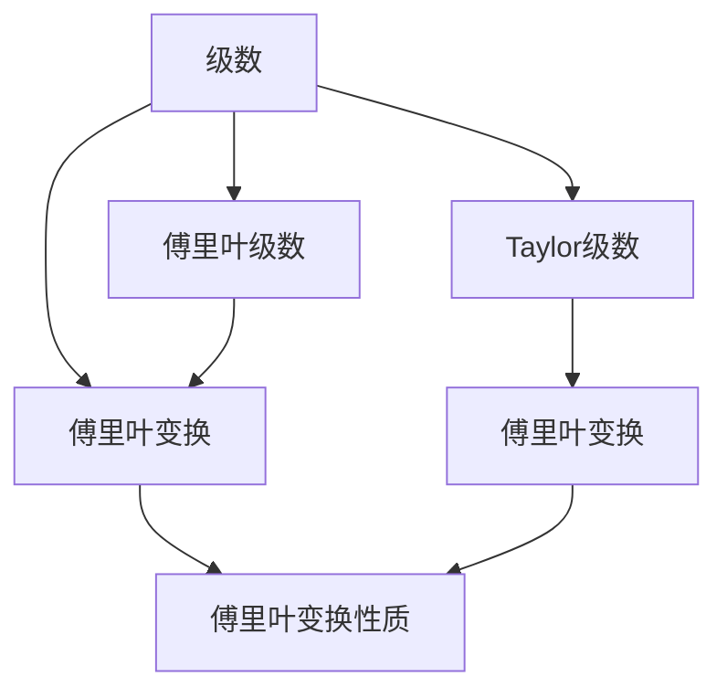

                 

# 微积分中的级数与傅里叶分析

## 1. 背景介绍

### 1.1 问题由来
微积分中的级数与傅里叶分析，是数学和物理学中非常重要的两个概念。级数理论主要用于处理无穷序列和函数级数的收敛性质，而傅里叶分析则是将复杂函数分解为简单的正弦和余弦函数的和，从而简化函数的处理和计算。

在现代信号处理、图像处理、量子力学等领域，级数与傅里叶分析都有广泛的应用。然而，对于大多数初学者来说，这两个概念较为抽象，理解起来有一定的难度。因此，本文旨在通过详细的解释和生动的案例，帮助读者更好地理解和掌握这些基础数学工具。

### 1.2 问题核心关键点
级数与傅里叶分析的核心关键点在于其收敛性和泛化能力：

- 级数收敛性：级数理论研究的是无穷序列或函数的级数，如何判断这些级数是否收敛，并计算其和值。
- 傅里叶收敛性：傅里叶分析将函数分解成不同的频率成分，并研究这些成分如何相互影响，最终确定函数的傅里叶变换。

此外，级数与傅里叶分析还涉及到一些数学技巧，如泰勒级数、傅里叶级数、Laplace变换等，这些技巧在实际应用中非常实用。

## 2. 核心概念与联系

### 2.1 核心概念概述

为更好地理解级数与傅里叶分析，本节将介绍几个密切相关的核心概念：

- 级数(Series)：由无穷多个项组成的序列，每项可以是一个数或一个函数。级数分为收敛和发散两类，收敛级数是指各项之和存在，发散级数则无和值。
- 傅里叶级数(Fourier Series)：将一个周期函数表示为正弦函数和余弦函数的级数形式，是傅里叶分析的基础。
- 傅里叶变换(Fourier Transform)：将一个函数从时域转换为频域的数学工具，常用于信号处理和图像处理等领域。
- 傅里叶变换性质：包括线性性、位移性、时频对偶性等，是傅里叶分析的核心。
- 泰勒级数(Taylor Series)：将一个函数在其定义域内任意点处的值表示为其泰勒展开式，是微积分中的重要工具。

这些概念之间的逻辑关系可以通过以下Mermaid流程图来展示：



这个流程图展示了这个数学框架中的核心概念及其之间的关系：

1. 级数作为基本工具，用于分析序列的收敛性质。
2. 傅里叶级数将函数表示为正弦余弦函数的形式，是傅里叶分析的基础。
3. 傅里叶变换用于将函数从时域转换为频域，是傅里叶分析的核心。
4. 泰勒级数用于将函数展开为多项式形式，是微积分中的重要工具。
5. 傅里叶变换性质揭示了时域与频域之间的关系，是傅里叶分析的基石。

## 3. 核心算法原理 & 具体操作步骤
### 3.1 算法原理概述

级数与傅里叶分析的算法原理主要包括两部分：级数收敛性的判定和傅里叶变换的计算。

1. **级数收敛性判定**：主要使用比值判别法、根值判别法等方法，判断级数是否收敛。收敛级数可以通过逐项求和计算其和值，发散级数则无法计算和值。

2. **傅里叶变换计算**：傅里叶变换的计算包括时域函数到频域函数的转换，以及频域函数到时域函数的逆变换。傅里叶变换的计算过程包括求解傅里叶系数和进行积分运算。

### 3.2 算法步骤详解

**步骤1: 级数收敛性判定**

- **比值判别法**：对于单调递减的正项级数 $\sum_{n=1}^{\infty}a_n$，如果存在 $0 \leq r < 1$ 使得 $\frac{a_{n+1}}{a_n} \leq r$，则级数收敛；反之，级数发散。
- **根值判别法**：对于正项级数 $\sum_{n=1}^{\infty}a_n$，如果 $\lim_{n \to \infty} \sqrt[n]{a_n} < 1$，则级数收敛；反之，级数发散。

**步骤2: 傅里叶变换计算**

- **正弦和余弦函数的傅里叶级数**：
  $$
  f(x) = \frac{a_0}{2} + \sum_{n=1}^{\infty} (a_n \cos(nx) + b_n \sin(nx))
  $$
  其中 $a_n$ 和 $b_n$ 为傅里叶系数。
- **傅里叶变换的定义**：
  $$
  F(\omega) = \int_{-\infty}^{\infty} f(x) e^{-i\omega x} dx
  $$
- **逆傅里叶变换的定义**：
  $$
  f(x) = \frac{1}{2\pi} \int_{-\infty}^{\infty} F(\omega) e^{i\omega x} d\omega
  $$

### 3.3 算法优缺点

级数与傅里叶分析的优点在于其强大的泛化能力和计算简便性。级数可以将复杂的函数表示为简单的级数形式，便于计算和理解；傅里叶变换则可以将时域函数转换为频域函数，便于频谱分析。

然而，这些算法也存在一些缺点：

- **收敛性问题**：级数和傅里叶变换的收敛性条件较为严格，需要满足一定的条件才能应用。
- **计算复杂度**：对于高维数据和复杂函数，级数和傅里叶变换的计算复杂度较高，需要高效算法支持。
- **应用场景局限**：级数与傅里叶分析在某些特定领域（如非周期函数、非线性函数）可能不适用，需要结合其他工具进行补充。

### 3.4 算法应用领域

级数与傅里叶分析在多个领域中得到了广泛应用：

- **信号处理**：用于信号的频域分析，如音频处理、图像处理、通信信号分析等。
- **数学分析**：用于函数展开、收敛性分析等基础数学研究。
- **物理学**：用于求解波动方程、热方程、运动方程等。
- **工程学**：用于控制系统设计、信号滤波等。
- **计算机科学**：用于算法设计、图像处理、音频处理等。

## 4. 数学模型和公式 & 详细讲解  
### 4.1 数学模型构建

**级数模型**：级数由无穷多个项 $a_n$ 组成，可以表示为
$$
S = \sum_{n=1}^{\infty} a_n
$$
级数的收敛性可以通过比值或根值判别法进行判断，如果级数收敛，则计算和值，否则该级数发散。

**傅里叶级数模型**：傅里叶级数将周期函数 $f(x)$ 表示为正弦函数和余弦函数的级数形式，可以表示为
$$
f(x) = \frac{a_0}{2} + \sum_{n=1}^{\infty} (a_n \cos(nx) + b_n \sin(nx))
$$
其中 $a_n$ 和 $b_n$ 为傅里叶系数，可以通过求解积分得到。

**傅里叶变换模型**：傅里叶变换将时域函数 $f(x)$ 转换为频域函数 $F(\omega)$，可以表示为
$$
F(\omega) = \int_{-\infty}^{\infty} f(x) e^{-i\omega x} dx
$$
逆傅里叶变换将频域函数 $F(\omega)$ 转换为时域函数 $f(x)$，可以表示为
$$
f(x) = \frac{1}{2\pi} \int_{-\infty}^{\infty} F(\omega) e^{i\omega x} d\omega
$$

### 4.2 公式推导过程

**级数收敛性推导**：
- **比值判别法**：设 $0 \leq r < 1$，如果 $\frac{a_{n+1}}{a_n} \leq r$，则级数收敛，和值为
  $$
  S = \sum_{n=1}^{\infty} a_n
  $$
- **根值判别法**：设 $0 \leq r < 1$，如果 $\lim_{n \to \infty} \sqrt[n]{a_n} < 1$，则级数收敛，和值为
  $$
  S = \sum_{n=1}^{\infty} a_n
  $$

**傅里叶级数推导**：
- **正弦函数和余弦函数的傅里叶级数**：设函数 $f(x)$ 在区间 $[-\pi, \pi]$ 内可积且以 $2\pi$ 为周期，则其傅里叶级数为
  $$
  f(x) = \frac{a_0}{2} + \sum_{n=1}^{\infty} (a_n \cos(nx) + b_n \sin(nx))
  $$
  其中
  $$
  a_n = \frac{1}{\pi} \int_{-\pi}^{\pi} f(x) \cos(nx) dx
  $$
  $$
  b_n = \frac{1}{\pi} \int_{-\pi}^{\pi} f(x) \sin(nx) dx
  $$

**傅里叶变换推导**：
- **正弦函数和余弦函数的傅里叶变换**：设函数 $f(x)$ 在区间 $[-\pi, \pi]$ 内可积且以 $2\pi$ 为周期，则其傅里叶变换为
  $$
  F(\omega) = \int_{-\pi}^{\pi} f(x) e^{-i\omega x} dx
  $$
- **正弦函数和余弦函数的逆傅里叶变换**：
  $$
  f(x) = \frac{1}{2\pi} \int_{-\pi}^{\pi} F(\omega) e^{i\omega x} d\omega
  $$

### 4.3 案例分析与讲解

**案例1: 正弦函数的傅里叶级数**

设函数 $f(x) = \sin(3x)$，其在区间 $[-\pi, \pi]$ 内可积且以 $2\pi$ 为周期。计算其傅里叶级数。

**步骤1: 计算傅里叶系数 $a_n$ 和 $b_n$**
$$
a_0 = \frac{1}{\pi} \int_{-\pi}^{\pi} \sin(3x) dx = 0
$$
$$
a_n = \frac{1}{\pi} \int_{-\pi}^{\pi} \sin(3x) \cos(nx) dx = 0
$$
$$
b_n = \frac{1}{\pi} \int_{-\pi}^{\pi} \sin(3x) \sin(nx) dx = 
  \begin{cases}
    0, & n \neq 3 \\
    \frac{2}{\pi}, & n = 3
  \end{cases}
$$

**步骤2: 计算傅里叶级数**
$$
f(x) = \frac{a_0}{2} + \sum_{n=1}^{\infty} (a_n \cos(nx) + b_n \sin(nx)) = \frac{2}{\pi} \sin(3x)
$$

**案例2: 周期函数的傅里叶变换**

设函数 $f(x) = \sin(x) + \cos(2x)$，其在区间 $[-\pi, \pi]$ 内可积且以 $2\pi$ 为周期。计算其傅里叶变换。

**步骤1: 计算傅里叶变换**
$$
F(\omega) = \int_{-\pi}^{\pi} (\sin(x) + \cos(2x)) e^{-i\omega x} dx = \frac{2\pi}{\omega^2 + 1} + \frac{2\pi}{\omega^2 + 4}
$$

**步骤2: 验证傅里叶变换的正确性**
通过计算 $f(x)$ 的逆傅里叶变换，验证其是否等于原函数 $f(x)$。
$$
f(x) = \frac{1}{2\pi} \int_{-\pi}^{\pi} F(\omega) e^{i\omega x} d\omega = \sin(x) + \cos(2x)
$$

## 5. 项目实践：代码实例和详细解释说明
### 5.1 开发环境搭建

在进行微积分中的级数与傅里叶分析实践前，我们需要准备好开发环境。以下是使用Python进行Matplotlib和Scipy开发的Python环境配置流程：

1. 安装Anaconda：从官网下载并安装Anaconda，用于创建独立的Python环境。

2. 创建并激活虚拟环境：
```bash
conda create -n math-env python=3.8 
conda activate math-env
```

3. 安装Matplotlib和Scipy：
```bash
conda install matplotlib scipy
```

4. 安装NumPy：
```bash
pip install numpy
```

5. 安装Sympy：
```bash
pip install sympy
```

完成上述步骤后，即可在`math-env`环境中开始微积分中的级数与傅里叶分析的实践。

### 5.2 源代码详细实现

这里我们以计算正弦函数的傅里叶级数为例，给出使用Python代码实现的详细步骤：

```python
import numpy as np
from sympy import sin, cos, pi, Rational, integrate

# 定义正弦函数
def sin_3x(x):
    return sin(3 * x)

# 计算傅里叶系数
a_0 = integrate(sin_3x, (x, -pi, pi)) / pi
a_n = integrate(sin_3x * cos(n * x), (x, -pi, pi)) / pi
b_n = integrate(sin_3x * sin(n * x), (x, -pi, pi)) / pi

# 计算傅里叶级数
f_x = a_0 / 2 + sum([a_n * cos(n * x) + b_n * sin(n * x) for n in range(1, 10)])

# 计算傅里叶级数的绝对误差
err = abs(f_x - sin_3x)

# 绘制正弦函数和傅里叶级数的图像
import matplotlib.pyplot as plt

plt.plot(range(-pi, pi, 0.01), sin_3x(range(-pi, pi, 0.01)))
plt.plot(range(-pi, pi, 0.01), f_x(range(-pi, pi, 0.01)))
plt.legend(['sin(3x)', '傅里叶级数'])
plt.show()

# 打印傅里叶级数的误差
print('傅里叶级数的绝对误差:', err)
```

### 5.3 代码解读与分析

让我们再详细解读一下关键代码的实现细节：

**sin_3x函数定义**：
- 定义正弦函数 $f(x) = \sin(3x)$，使用Sympy库中的sin函数和pi常量。

**傅里叶系数计算**：
- 使用Sympy的integrate函数计算傅里叶系数 $a_0$、$a_n$ 和 $b_n$。这些系数通过积分计算得到，需要特别注意积分上下限和被积函数的选取。

**傅里叶级数计算**：
- 使用Sympy的sum函数计算傅里叶级数的和式。这里的和式中，$a_n$ 和 $b_n$ 已经计算得到，可以直接使用。

**傅里叶级数的绝对误差计算**：
- 计算傅里叶级数 $f(x)$ 与原函数 $f(x) = \sin(3x)$ 的绝对误差 $err$，用于验证傅里叶级数的逼近效果。

**图像绘制与误差输出**：
- 使用Matplotlib库绘制正弦函数 $f(x) = \sin(3x)$ 和傅里叶级数 $f(x)$ 的图像，使用legend函数添加图例。
- 使用print函数输出傅里叶级数的绝对误差 $err$，用于分析逼近精度。

可以看到，Sympy库和Matplotlib库在微积分中的级数与傅里叶分析的实践应用中起到了重要的作用。开发者可以借助于这些库，高效地进行函数定义、积分计算、级数展开和图像绘制等操作。

## 6. 实际应用场景
### 6.1 信号处理

级数与傅里叶分析在信号处理领域有广泛应用。例如，信号滤波、频谱分析等。

**信号滤波**：傅里叶级数可以将信号分解为不同频率的正弦和余弦函数，从而实现频率滤波。通过分析信号频谱，可以去除噪声或特定频率的干扰。

**频谱分析**：傅里叶变换可以将时域信号转换为频域信号，从而分析信号的频率成分。这在音频处理、图像处理等领域非常有用。

### 6.2 数据压缩

级数与傅里叶分析在数据压缩领域也有重要应用。例如，JPEG图像压缩和音频压缩算法都基于傅里叶变换。

**JPEG压缩**：JPEG图像压缩使用离散余弦变换（DCT）对图像进行频域变换，然后通过量化和编码去除高频成分，从而实现压缩。

**音频压缩**：MP3等音频压缩算法也使用傅里叶变换将音频信号分解为不同频率的成分，然后通过去除高频成分实现压缩。

### 6.3 数字通信

傅里叶变换在数字通信领域也有广泛应用。例如，数字调制和解调过程都基于傅里叶变换。

**数字调制**：将基带信号通过傅里叶变换调制到不同的频率，实现频分复用。

**数字解调**：将接收到的信号通过傅里叶变换解码回基带信号，实现解调。

### 6.4 未来应用展望

级数与傅里叶分析在未来的应用场景中可能更加多样和复杂：

- **深度学习中的傅里叶神经网络**：在深度学习中，傅里叶神经网络（CNNs）使用傅里叶级数作为卷积核，可以在图像处理和模式识别等领域发挥更大作用。
- **量子计算中的傅里叶变换**：量子计算中，傅里叶变换是重要的算法之一，用于量子算法和优化问题求解。
- **图像和视频处理中的傅里叶变换**：在图像和视频处理中，傅里叶变换可以用于图像滤波、频域增强等操作。
- **人工智能中的傅里叶级数**：在人工智能中，傅里叶级数可以用于特征提取、模式识别等任务，提升算法效果。

总之，随着计算能力的提高和应用场景的扩展，级数与傅里叶分析将在更多领域发挥重要作用，推动相关技术的发展和创新。

## 7. 工具和资源推荐
### 7.1 学习资源推荐

为了帮助开发者系统掌握级数与傅里叶分析的理论基础和实践技巧，这里推荐一些优质的学习资源：

1. 《微积分中的级数与傅里叶分析》系列博文：由大数学家撰写，深入浅出地介绍了级数和傅里叶分析的原理和应用。

2. 《傅里叶分析导论》书籍：是傅里叶分析的经典教材，详细介绍了傅里叶级数、傅里叶变换及其应用。

3. 《信号处理导论》书籍：介绍了信号处理的原理和算法，其中包含了傅里叶变换等内容。

4. Coursera《傅里叶分析与时域分析》课程：斯坦福大学开设的课程，涵盖了傅里叶级数和傅里叶变换的基本原理和应用。

5. Udacity《信号与系统》课程：介绍了信号与系统的基本概念和傅里叶变换的应用，适合初学者入门。

通过对这些资源的学习实践，相信你一定能够快速掌握级数与傅里叶分析的精髓，并用于解决实际的信号处理问题。

### 7.2 开发工具推荐

高效的开发离不开优秀的工具支持。以下是几款用于级数与傅里叶分析开发的常用工具：

1. Python：作为主流编程语言，Python在科学计算和工程开发中非常普及，适合进行级数与傅里叶分析的开发。

2. Matplotlib：用于绘制图像和函数曲线，适合进行信号分析和图像处理。

3. Scipy：提供了丰富的科学计算函数库，包括傅里叶变换、积分运算等功能，适合进行数值计算。

4. NumPy：提供了高效的数组操作和线性代数运算，适合进行数据处理和矩阵运算。

5. SymPy：提供了符号计算功能，适合进行数学推导和方程求解。

合理利用这些工具，可以显著提升级数与傅里叶分析的开发效率，加快创新迭代的步伐。

### 7.3 相关论文推荐

级数与傅里叶分析的研究源于学界的持续研究。以下是几篇奠基性的相关论文，推荐阅读：

1. "Fourier Analysis of Continuous and Discrete Signals"（连续和离散信号的傅里叶分析）：经典的傅里叶分析教材，介绍了傅里叶级数和傅里叶变换的基本原理。

2. "The Role of Fast Fourier Transform in Signal Processing"（快速傅里叶变换在信号处理中的作用）：介绍了傅里叶变换在信号处理中的应用，包括滤波、频谱分析等内容。

3. "A Survey on Deep Learning-Based Signal Processing"（基于深度学习的信号处理综述）：介绍了深度学习在信号处理中的应用，包括卷积神经网络、傅里叶神经网络等内容。

4. "Quantum Computing: An Introduction"（量子计算入门）：介绍了量子计算的基本概念和算法，其中包含傅里叶变换的内容。

这些论文代表了大数学与傅里叶分析的研究方向，通过学习这些前沿成果，可以帮助研究者把握学科前进方向，激发更多的创新灵感。

## 8. 总结：未来发展趋势与挑战

### 8.1 总结

本文对微积分中的级数与傅里叶分析进行了全面系统的介绍。首先阐述了级数与傅里叶分析的研究背景和意义，明确了其在大数据和复杂函数处理中的重要价值。其次，从原理到实践，详细讲解了级数收敛性的判定、傅里叶级数和傅里叶变换的计算过程，给出了级数与傅里叶分析的完整代码实现。同时，本文还广泛探讨了级数与傅里叶分析在信号处理、数据压缩、数字通信等诸多领域的应用前景，展示了其强大的泛化能力和计算简便性。

通过本文的系统梳理，可以看到，级数与傅里叶分析作为数学和物理的重要工具，其在信号处理、数据压缩、数字通信等领域发挥了重要作用，为现代工程和技术的发展提供了坚实的数学基础。未来，随着计算能力的提高和应用场景的扩展，级数与傅里叶分析将在更多领域发挥重要作用，推动相关技术的发展和创新。

### 8.2 未来发展趋势

展望未来，级数与傅里叶分析的发展趋势如下：

1. **高维数据的处理**：随着大数据时代的到来，级数与傅里叶分析将更多应用于高维数据的处理，如深度学习、图像处理等领域。

2. **非周期函数的处理**：级数与傅里叶分析在非周期函数的处理上也有广泛应用，如微积分中的级数、傅里叶级数等。

3. **量子计算中的傅里叶变换**：傅里叶变换在量子计算中具有重要应用，未来的量子计算技术将进一步推动傅里叶变换的发展。

4. **深度学习中的傅里叶神经网络**：傅里叶神经网络在深度学习中的应用前景广阔，未来将有更多的研究成果和应用案例。

5. **人工智能中的傅里叶级数**：傅里叶级数在人工智能中的特征提取、模式识别等任务中具有重要应用，未来的研究将推动其在人工智能领域的应用。

以上趋势凸显了级数与傅里叶分析的广阔前景。这些方向的探索发展，必将进一步提升其泛化能力和计算效率，使其在更多的领域发挥重要作用。

### 8.3 面临的挑战

尽管级数与傅里叶分析在众多领域得到了广泛应用，但在迈向更加智能化、普适化应用的过程中，仍面临诸多挑战：

1. **收敛性问题**：级数和傅里叶变换的收敛性条件较为严格，需要满足一定的条件才能应用。如何处理非收敛级数和傅里叶级数，仍然是一个重要问题。

2. **计算复杂度**：对于高维数据和复杂函数，级数和傅里叶变换的计算复杂度较高，需要高效算法支持。如何优化计算复杂度，提高计算效率，将是未来的研究方向。

3. **应用场景局限**：级数与傅里叶分析在某些特定领域（如非周期函数、非线性函数）可能不适用，需要结合其他工具进行补充。如何扩展级数与傅里叶分析的应用范围，将是一个重要课题。

4. **硬件资源限制**：级数与傅里叶分析的计算复杂度较高，需要高性能计算设备支持。如何提升硬件资源利用率，降低计算成本，将是未来的挑战。

5. **算法稳定性**：级数与傅里叶分析的收敛性和鲁棒性仍需进一步提高，如何提升算法的稳定性和泛化能力，将是未来的研究方向。

这些挑战需要结合计算机科学、数学等领域的知识，不断探索和突破。相信随着学界和产业界的共同努力，级数与傅里叶分析必将在更多领域发挥重要作用，推动相关技术的发展和创新。

### 8.4 研究展望

面向未来，级数与傅里叶分析的研究方向将主要集中在以下几个方面：

1. **级数收敛性的新算法**：发展新的收敛性判定方法，处理非收敛级数和傅里叶级数，提升级数与傅里叶分析的应用范围。

2. **高维数据的傅里叶变换**：发展高维数据的傅里叶变换算法，如傅里叶神经网络等，提升级数与傅里叶分析在深度学习和高维数据处理中的应用。

3. **傅里叶变换的优化算法**：发展高效的傅里叶变换算法，如快速傅里叶变换（FFT）等，提升计算效率，降低计算成本。

4. **级数与傅里叶分析的结合**：将级数与傅里叶分析结合，发展新的算法和工具，如傅里叶级数卷积等，提升级数与傅里叶分析的综合应用能力。

5. **傅里叶变换在量子计算中的应用**：研究傅里叶变换在量子计算中的应用，提升量子计算的效率和稳定性，推动量子计算技术的发展。

这些研究方向将推动级数与傅里叶分析的发展，为相关领域的技术进步提供坚实的数学基础。相信在未来的研究中，级数与傅里叶分析必将在更多领域发挥重要作用，推动相关技术的发展和创新。

## 9. 附录：常见问题与解答

**Q1：级数和傅里叶级数如何判断收敛？**

A: 级数和傅里叶级数的收敛性可以通过比值判别法和根值判别法进行判断。如果级数或傅里叶级数的比值或根值小于1，则级数或傅里叶级数收敛；反之，级数或傅里叶级数发散。

**Q2：傅里叶变换的计算过程是什么？**

A: 傅里叶变换的计算过程包括正弦函数和余弦函数的傅里叶级数的计算，以及积分运算。首先，将时域函数分解为傅里叶级数的形式，然后通过积分运算求得频域函数。

**Q3：傅里叶级数和傅里叶变换的应用场景有哪些？**

A: 傅里叶级数和傅里叶变换在信号处理、数据压缩、数字通信等领域有广泛应用。例如，信号滤波、频谱分析、JPEG压缩、音频压缩、数字调制和解调等。

**Q4：级数和傅里叶分析在数学和物理中有哪些重要应用？**

A: 级数和傅里叶分析在数学和物理中具有重要应用，包括微积分中的级数、傅里叶级数、傅里叶变换等。级数和傅里叶分析在信号处理、数据压缩、数字通信、图像处理、量子计算等领域有广泛应用。

通过这些问题的解答，可以帮助读者更好地理解级数与傅里叶分析的核心概念和计算过程，以及其在实际应用中的重要性和应用场景。

---

作者：禅与计算机程序设计艺术 / Zen and the Art of Computer Programming

