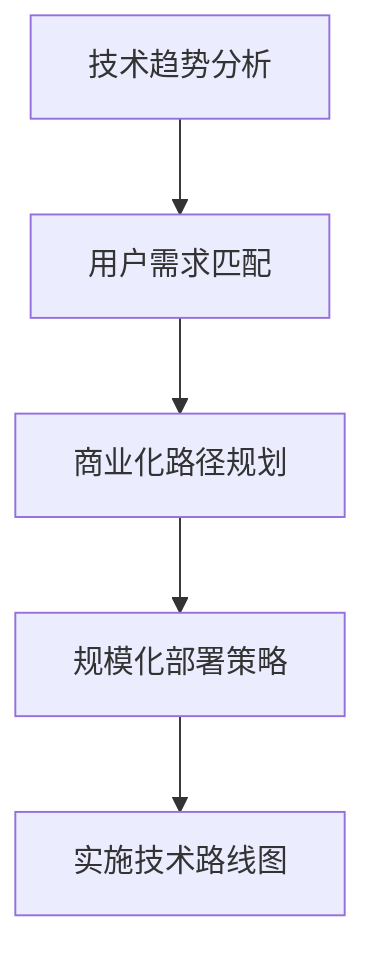

                 

## 1. 背景介绍

### 1.1 问题由来

在当今快速发展的技术环境中，软件产品的成功不仅仅取决于技术创新，更在于能够快速响应市场需求，高效实现产品商业化和规模化。然而，随着技术的日新月异，如何有效规划并实施技术路线图，既满足客户需求，又能紧跟前沿技术趋势，成为一个关键难题。本文旨在探讨这一问题，并提出具体规划和实施软件产品技术路线图的策略和步骤。

### 1.2 问题核心关键点

1. **技术趋势分析**：准确识别当前及未来技术趋势，确保产品技术路线图与市场需求和技术前沿保持一致。
2. **需求匹配**：确保技术路线图与用户需求紧密结合，从而有效提升用户体验。
3. **商业化路径**：明确产品从技术研发到市场推广的路径，确保产品能够快速商业化。
4. **规模化部署**：确保产品能够在大规模生产环境下稳定运行，满足海量用户需求。

### 1.3 问题研究意义

准确规划并实施软件产品技术路线图，对于提升产品竞争力、加速商业化进程、实现规模化生产具有重要意义：

1. 降低技术风险：通过合理规划，确保产品技术路线图与技术趋势和市场需求一致，减少技术引入带来的不确定性。
2. 提升用户体验：确保产品技术路线图与用户需求紧密结合，提升用户满意度和忠诚度。
3. 加速商业化进程：明确产品从技术研发到市场推广的路径，缩短产品上市时间，抢占市场先机。
4. 实现规模化生产：通过优化产品架构和设计，确保产品在大规模生产环境下能够稳定运行，提升生产效率和质量。

## 2. 核心概念与联系

### 2.1 核心概念概述

为更好地理解如何规划和实施软件产品技术路线图，本节将介绍几个核心概念：

- **技术趋势分析**：通过收集和分析行业报告、学术论文、技术博客等，识别当前及未来技术趋势。
- **用户需求匹配**：通过市场调研、用户反馈、产品数据分析等方式，识别和理解用户需求。
- **商业化路径规划**：制定产品从技术研发到市场推广的具体路径和时间表。
- **规模化部署策略**：设计产品架构，确保产品能够在大规模生产环境下稳定运行，支持海量用户需求。

这些核心概念之间的逻辑关系可以通过以下Mermaid流程图来展示：



这个流程图展示了这个过程的关键步骤：首先进行技术趋势分析，其次匹配用户需求，然后规划商业化路径，最后设计规模化部署策略，以实现技术路线图的实施。

## 3. 核心算法原理 & 具体操作步骤
### 3.1 算法原理概述

规划和实施软件产品技术路线图的过程，本质上是一个多目标优化问题。其核心思想是：通过对技术趋势、用户需求、商业化和规模化等因素的综合分析，选择最优的技术路线图，并在整个开发过程中进行动态调整，确保最终产品能够满足市场需求和技术趋势。

### 3.2 算法步骤详解

具体来说，技术路线图的规划和实施可以遵循以下步骤：

**Step 1: 收集和分析数据**

- **技术趋势分析**：通过阅读行业报告、学术论文、技术博客等，识别当前及未来技术趋势。使用关键词分析、趋势对比等方法，筛选出对产品最有影响的技术。
- **用户需求匹配**：通过市场调研、用户反馈、产品数据分析等方式，识别和理解用户需求。使用用户画像、需求分析等工具，形成详细的需求文档。
- **商业化路径规划**：结合技术趋势和用户需求，制定产品从技术研发到市场推广的具体路径和时间表。使用价值链分析、SWOT分析等方法，评估市场潜力和竞争优势。
- **规模化部署策略**：设计产品架构，确保产品能够在大规模生产环境下稳定运行，支持海量用户需求。使用云计算架构、分布式系统等技术，优化系统性能和可扩展性。

**Step 2: 设计技术路线图**

- **技术选型**：根据技术趋势和用户需求，选择最适合的技术和工具。
- **版本规划**：制定产品的版本计划，明确每个版本的关键功能和性能目标。
- **里程碑设置**：设置关键里程碑，用于评估和调整技术路线图。

**Step 3: 实施技术路线图**

- **原型开发**：基于技术路线图，开发产品原型，并进行功能验证。
- **用户反馈**：收集用户反馈，进行产品迭代和优化。
- **测试与部署**：进行产品测试，确保产品稳定性和性能，部署至生产环境。
- **监控与优化**：实时监控产品运行情况，进行性能调优和问题修复。

### 3.3 算法优缺点

技术路线图的规划和实施具有以下优点：

- **系统性**：通过系统性的分析和技术选型，确保产品技术路线图的科学性和可行性。
- **灵活性**：通过动态调整和技术迭代，能够快速响应市场变化和技术趋势。
- **用户导向**：通过深入理解用户需求，确保产品能够满足用户期望，提升用户体验。

同时，该方法也存在以下局限性：

- **复杂性**：技术路线图的规划和实施涉及多方面的因素，操作复杂。
- **资源消耗**：规划和实施过程中需要大量的时间、人力和资金投入。
- **风险管理**：技术引入和市场推广过程中存在一定的风险，需要有效的风险管理策略。

尽管存在这些局限性，但通过合理规划和科学实施，技术路线图仍然能够显著提升产品的技术竞争力和市场表现。

### 3.4 算法应用领域

技术路线图的规划和实施方法，已经广泛应用于软件产品开发、智能硬件设计、互联网应用等多个领域，帮助企业快速响应市场需求，实现技术突破和商业化成功。

- **软件开发**：通过技术趋势分析、用户需求匹配和商业化路径规划，帮助软件开发团队制定详细的产品技术路线图。
- **智能硬件设计**：结合硬件特性和技术趋势，设计符合市场需求的产品硬件架构和软件系统。
- **互联网应用**：通过技术选型和版本规划，确保互联网应用能够快速迭代和扩展，满足用户需求。

## 4. 数学模型和公式 & 详细讲解 & 举例说明（备注：数学公式请使用latex格式，latex嵌入文中独立段落使用 $$，段落内使用 $)
### 4.1 数学模型构建

本节将使用数学语言对技术路线图的规划和实施过程进行更加严格的刻画。

设产品技术路线图为 $T$，包含关键技术节点 $t_1, t_2, ..., t_n$，用户需求为 $U$，商业化路径为 $B$，规模化部署策略为 $S$。则技术路线图的构建可以表示为以下优化问题：

$$
\min_{T} \sum_{i=1}^n C_{t_i} + \omega_U U + \omega_B B + \omega_S S
$$

其中 $C_{t_i}$ 表示技术节点 $t_i$ 的实施成本，$\omega_U$、$\omega_B$、$\omega_S$ 分别表示用户需求、商业化路径、规模化部署策略的权重系数。

### 4.2 公式推导过程

对于技术路线图的构建，可以使用线性规划、整数规划等优化方法，求解上述优化问题。这里以线性规划为例，进行公式推导：

设 $T = (t_1, t_2, ..., t_n)$，则目标函数可以表示为：

$$
\min \sum_{i=1}^n C_{t_i} + \omega_U \sum_{j=1}^m u_j + \omega_B \sum_{k=1}^K b_k + \omega_S \sum_{l=1}^L s_l
$$

其中 $u_j$、$b_k$、$s_l$ 分别表示用户需求、商业化路径、规模化部署策略的评估得分。

根据技术路线图的约束条件，可以建立以下约束方程：

$$
\begin{cases}
u_j = f_j(t_i) \\
b_k = g_k(t_i) \\
s_l = h_l(t_i)
\end{cases}
$$

其中 $f_j(t_i)$、$g_k(t_i)$、$h_l(t_i)$ 分别表示用户需求、商业化路径、规模化部署策略与技术节点之间的映射关系。

### 4.3 案例分析与讲解

假设我们要开发一款智能推荐系统，技术路线图如下：

- 技术节点 $t_1$：数据预处理
- 技术节点 $t_2$：模型训练
- 技术节点 $t_3$：推荐引擎开发
- 技术节点 $t_4$：前端界面设计
- 技术节点 $t_5$：系统测试

用户需求包括：

- 准确性：推荐结果要准确反映用户兴趣
- 实时性：推荐结果要能够实时生成
- 可扩展性：系统要能够支持海量用户

商业化路径包括：

- 市场推广：通过社交媒体、广告投放等方式推广产品
- 用户反馈：收集用户反馈，进行产品迭代和优化

规模化部署策略包括：

- 云计算架构：采用云计算平台，确保系统可扩展性和可靠性
- 分布式系统：设计分布式架构，确保系统高可用性和负载均衡

通过建立上述数学模型和约束条件，可以使用优化算法求解最优的技术路线图。

## 5. 项目实践：代码实例和详细解释说明
### 5.1 开发环境搭建

在进行技术路线图规划和实施实践前，我们需要准备好开发环境。以下是使用Python进行环境配置的流程：

1. 安装Anaconda：从官网下载并安装Anaconda，用于创建独立的Python环境。

2. 创建并激活虚拟环境：
```bash
conda create -n tech-env python=3.8 
conda activate tech-env
```

3. 安装必要的工具包：
```bash
pip install pandas numpy scipy matplotlib networkx
```

完成上述步骤后，即可在`tech-env`环境中开始技术路线图规划和实施的实践。

### 5.2 源代码详细实现

下面以推荐系统为例，展示如何使用Python进行技术路线图的规划和实施。

首先，定义技术节点、用户需求、商业化路径和规模化部署策略的评估得分函数：

```python
def eval_tech_node(node, data, params):
    # 评估技术节点的得分
    return ...

def eval_user需求的得分(node, data, params):
    # 评估用户需求的得分
    return ...

def eval_commercial_path(path, data, params):
    # 评估商业化路径的得分
    return ...

def eval_scale_strategy(strategy, data, params):
    # 评估规模化部署策略的得分
    return ...
```

然后，使用优化算法求解最优的技术路线图：

```python
from scipy.optimize import linprog

# 构建优化问题
costs = [eval_tech_node(node, data, params) for node in tech_nodes]
user_demands = [eval_user需求的得分(node, data, params) for node in tech_nodes]
commercial_paths = [eval_commercial_path(path, data, params) for path in commercial_paths]
scale_strategies = [eval_scale_strategy(strategy, data, params) for strategy in scale_strategies]

A = ...
b = ...
c = ...

# 求解优化问题
res = linprog(c, A_ub=A, b_ub=b)
```

最后，根据求解结果，输出最优的技术路线图：

```python
tech路线图 = res.x
print("最优技术路线图：", tech路线图)
```

### 5.3 代码解读与分析

让我们再详细解读一下关键代码的实现细节：

**eval_tech_node等函数**：
- 定义了评估技术节点、用户需求、商业化路径和规模化部署策略的函数。

**linprog函数**：
- 使用scipy库中的linprog函数求解线性规划问题。
- 其中，costs、A、b、c等变量分别表示目标函数和约束条件。

**输出结果**：
- 根据求解结果，输出最优的技术路线图。

可以看到，Python配合SciPy库使得技术路线图的规划和实施代码实现变得简洁高效。开发者可以将更多精力放在数据处理、模型改进等高层逻辑上，而不必过多关注底层的实现细节。

当然，工业级的系统实现还需考虑更多因素，如多目标优化、动态调整、用户反馈等。但核心的技术路线图规划和实施范式基本与此类似。

## 6. 实际应用场景
### 6.1 智能推荐系统

智能推荐系统是技术路线图规划和实施的典型应用场景。通过科学规划技术路线图，可以有效提升推荐系统的准确性、实时性和可扩展性，提升用户满意度和系统性能。

在技术路线图规划阶段，需考虑以下关键技术节点：

- 数据预处理：清洗、标注、划分数据集
- 模型训练：选择合适算法，进行模型训练和调优
- 推荐引擎开发：实现推荐算法和引擎
- 前端界面设计：设计用户界面，提升用户体验
- 系统测试：进行功能测试、性能测试、安全测试

在实施阶段，需结合用户需求和商业化路径，进行持续优化和迭代。例如：

- 用户需求分析：收集用户反馈，进行需求分析
- 商业化推广：通过广告投放、社交媒体推广等方式，提升产品知名度
- 技术迭代：根据用户反馈，进行系统优化和功能迭代

### 6.2 智能制造系统

智能制造系统是技术路线图规划和实施的另一个重要应用场景。通过科学规划技术路线图，可以有效提升生产效率和产品质量，实现智能化、数字化生产。

在技术路线图规划阶段，需考虑以下关键技术节点：

- 数据采集：通过传感器、摄像头等设备，采集生产数据
- 数据处理：清洗、分析生产数据，提取关键信息
- 模型训练：选择合适算法，进行模型训练和调优
- 控制系统开发：实现智能控制系统
- 系统集成：将各子系统集成，实现系统互联互通

在实施阶段，需结合用户需求和商业化路径，进行持续优化和迭代。例如：

- 用户需求分析：收集生产数据，进行需求分析
- 商业化推广：通过生产订单、销售渠道等方式，提升产品市场份额
- 技术迭代：根据用户反馈，进行系统优化和功能迭代

### 6.3 智慧医疗系统

智慧医疗系统是技术路线图规划和实施的另一个重要应用场景。通过科学规划技术路线图，可以有效提升医疗服务的智能化水平，提升诊疗效率和患者体验。

在技术路线图规划阶段，需考虑以下关键技术节点：

- 数据采集：通过医疗设备、传感器等设备，采集患者数据
- 数据处理：清洗、分析患者数据，提取关键信息
- 模型训练：选择合适算法，进行模型训练和调优
- 医疗应用开发：实现智能诊疗应用
- 系统集成：将各子系统集成，实现系统互联互通

在实施阶段，需结合用户需求和商业化路径，进行持续优化和迭代。例如：

- 用户需求分析：收集患者反馈，进行需求分析
- 商业化推广：通过医院合作、医疗设备销售等方式，提升产品市场份额
- 技术迭代：根据用户反馈，进行系统优化和功能迭代

### 6.4 未来应用展望

随着技术路线图规划和实施方法的发展，未来将会有更多领域应用这一方法，为各个行业带来变革性影响。

在智慧城市治理中，通过科学规划技术路线图，可以实现城市事件监测、舆情分析、应急指挥等环节的智能化，提高城市管理的自动化和智能化水平，构建更安全、高效的未来城市。

在智慧教育领域，通过科学规划技术路线图，可以实现作业批改、学情分析、知识推荐等功能的智能化，因材施教，促进教育公平，提高教学质量。

在智慧农业中，通过科学规划技术路线图，可以实现农业数据采集、分析、决策等方面的智能化，提高农业生产效率和产品质量。

总之，技术路线图规划和实施方法将在更多领域得到应用，为各行各业带来新的技术突破和发展机遇。

## 7. 工具和资源推荐
### 7.1 学习资源推荐

为了帮助开发者系统掌握技术路线图的规划和实施的理论基础和实践技巧，这里推荐一些优质的学习资源：

1. **《软件工程原理与实践》**：介绍软件工程基本概念和方法，包括需求分析、系统设计、软件测试等。
2. **《系统架构设计与实践》**：深入介绍系统架构设计的基本原理和方法，包括分布式系统、微服务架构等。
3. **《项目管理理论与实践》**：介绍项目管理基本概念和方法，包括项目规划、资源管理、风险管理等。
4. **《敏捷开发与实践》**：介绍敏捷开发基本概念和方法，包括Scrum、Kanban等。
5. **《软件技术路线图规划与实施》**：全面介绍技术路线图规划和实施的理论基础和实践技巧。

通过对这些资源的学习实践，相信你一定能够快速掌握技术路线图规划和实施的精髓，并用于解决实际的业务问题。

### 7.2 开发工具推荐

高效的开发离不开优秀的工具支持。以下是几款用于技术路线图规划和实施开发的常用工具：

1. **JIRA**：项目管理工具，用于任务分配、进度跟踪、需求管理等。
2. **Confluence**：协作文档工具，用于知识共享、文档管理、需求分析等。
3. **Git**：版本控制工具，用于代码管理、协作开发等。
4. **Visual Studio**：软件开发工具，支持多种编程语言和开发环境。
5. **Docker**：容器化技术，用于系统部署、环境管理等。

合理利用这些工具，可以显著提升技术路线图规划和实施任务的开发效率，加快创新迭代的步伐。

### 7.3 相关论文推荐

技术路线图规划和实施技术的发展源于学界的持续研究。以下是几篇奠基性的相关论文，推荐阅读：

1. **《软件架构的演化：理论、方法与实践》**：介绍软件架构演化基本概念和方法，包括演化原则、演化技术等。
2. **《软件项目的风险管理：方法与实践》**：介绍软件项目管理中风险管理基本概念和方法，包括风险识别、风险评估、风险应对等。
3. **《敏捷软件开发：原则、实践与模式》**：介绍敏捷开发基本概念和方法，包括Scrum、Kanban等。

这些论文代表了大规模软件开发和管理的研究脉络。通过学习这些前沿成果，可以帮助研究者把握学科前进方向，激发更多的创新灵感。

## 8. 总结：未来发展趋势与挑战
### 8.1 总结

本文对技术路线图规划和实施方法进行了全面系统的介绍。首先阐述了技术路线图规划和实施的理论基础和实际应用场景，明确了技术路线图在提升产品技术竞争力和市场表现方面的重要价值。其次，从原理到实践，详细讲解了技术路线图的构建和实施步骤，给出了技术路线图规划和实施的完整代码实例。同时，本文还广泛探讨了技术路线图在多个领域的应用前景，展示了技术路线图方法的广阔前景。

通过本文的系统梳理，可以看到，技术路线图规划和实施方法在大规模软件开发和管理中具有重要意义。它能够有效提升产品技术竞争力和市场表现，加速技术商业化和规模化进程。未来，随着技术的进一步发展，技术路线图规划和实施方法必将在大规模软件开发和管理中发挥更大的作用。

### 8.2 未来发展趋势

展望未来，技术路线图规划和实施方法将呈现以下几个发展趋势：

1. **智能化**：结合人工智能、大数据等技术，进行需求分析、系统设计、测试优化等，提升技术路线图规划和实施的智能化水平。
2. **自动化**：使用自动化工具和系统，进行需求管理、任务分配、进度跟踪等，提升技术路线图规划和实施的效率和准确性。
3. **全生命周期管理**：结合产品生命周期管理理论，进行需求分析、系统设计、测试优化、发布部署等全生命周期管理，提升产品竞争力。
4. **跨领域应用**：结合不同领域的特殊需求，进行技术路线图规划和实施方法的优化和创新，提升技术路线图的应用范围和效果。

### 8.3 面临的挑战

尽管技术路线图规划和实施方法已经取得了一定的成就，但在迈向更加智能化、普适化应用的过程中，它仍面临诸多挑战：

1. **复杂性**：技术路线图规划和实施涉及多方面的因素，操作复杂。
2. **资源消耗**：规划和实施过程中需要大量的时间、人力和资金投入。
3. **风险管理**：技术引入和市场推广过程中存在一定的风险，需要有效的风险管理策略。
4. **用户体验**：技术路线图规划和实施过程中需要持续关注用户需求和反馈，以提升用户体验。
5. **技术演进**：技术路线图需要根据技术演进不断调整和优化，保持与技术前沿一致。

尽管存在这些挑战，但通过合理规划和科学实施，技术路线图规划和实施方法仍然能够显著提升产品的技术竞争力和市场表现。

### 8.4 研究展望

未来，技术路线图规划和实施方法需要在以下几个方面寻求新的突破：

1. **智能优化**：结合人工智能、大数据等技术，进行需求分析、系统设计、测试优化等，提升技术路线图规划和实施的智能化水平。
2. **自动化工具**：开发更加自动化、智能化的工具，进行需求管理、任务分配、进度跟踪等，提升技术路线图规划和实施的效率和准确性。
3. **全生命周期管理**：结合产品生命周期管理理论，进行需求分析、系统设计、测试优化、发布部署等全生命周期管理，提升产品竞争力。
4. **跨领域应用**：结合不同领域的特殊需求，进行技术路线图规划和实施方法的优化和创新，提升技术路线图的应用范围和效果。
5. **风险管理**：结合风险管理理论，进行需求分析、系统设计、测试优化等，提升技术路线图规划和实施的风险管理能力。

这些研究方向将进一步提升技术路线图规划和实施方法的科学性和实用性，为大规模软件开发和管理带来新的突破。

## 9. 附录：常见问题与解答
----------------------------------------------------------------

**Q1: 技术路线图规划和实施的复杂性是否可以降低？**

A: 通过引入自动化工具和智能化方法，可以显著降低技术路线图规划和实施的复杂性。例如，使用JIRA进行任务管理和进度跟踪，使用Confluence进行文档管理和需求分析，使用Git进行代码管理和协作开发，使用Docker进行环境管理和系统部署，使用机器学习和数据挖掘技术进行需求分析和系统设计。

**Q2: 技术路线图规划和实施过程中如何保证用户体验？**

A: 通过用户需求分析和持续反馈机制，可以保证技术路线图规划和实施过程中始终关注用户需求和反馈。例如，定期进行用户满意度调查，收集用户反馈，进行需求分析和系统优化。

**Q3: 技术路线图规划和实施过程中如何避免技术引入的风险？**

A: 通过需求分析、系统设计和风险评估，可以避免技术引入的风险。例如，进行详细的需求分析，评估技术引入的风险和收益，制定风险应对策略，进行系统设计和优化，减少技术引入的风险。

**Q4: 技术路线图规划和实施过程中如何实现全生命周期管理？**

A: 通过结合产品生命周期管理理论，可以实现在需求分析、系统设计、测试优化、发布部署等全生命周期管理。例如，制定详细的需求分析文档，进行系统设计和技术选型，进行测试优化和性能调优，进行发布部署和系统集成，实现全生命周期管理。

**Q5: 技术路线图规划和实施过程中如何结合跨领域需求进行优化和创新？**

A: 通过结合不同领域的特殊需求，进行技术路线图规划和实施方法的优化和创新。例如，结合医疗、金融、教育等领域的特殊需求，进行需求分析和系统设计，进行技术选型和优化，进行测试优化和性能调优，实现跨领域应用。

总之，技术路线图规划和实施方法需要在各个环节进行全面优化和创新，才能真正实现产品技术竞争力和市场表现的提升。只有不断创新、不断优化，才能在技术变革中保持领先地位，实现产品商业化和规模化。

