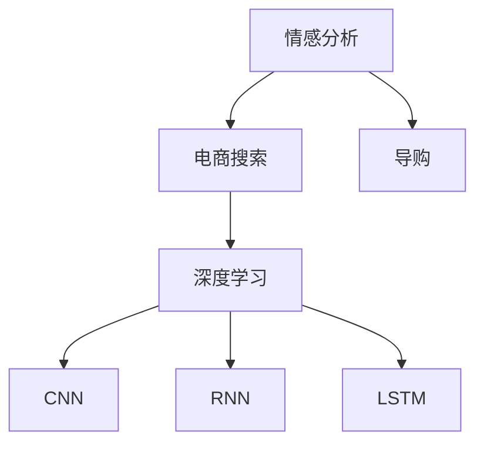

                 

# 情感分析：AI助力电商搜索导购更懂用户

## 1. 背景介绍

随着互联网购物的普及，电商平台已经逐渐成为消费者进行购物选择的主要渠道之一。消费者在进行购物时，往往会通过搜索界面查找和对比商品，以找到最合适的购买选项。然而，由于信息过载，消费者的选择往往需要花费大量时间和精力，尤其是在选择商品时，用户的决策容易受到负面情绪的影响，从而影响其购买决策。

为了提升用户的购物体验，电商平台逐渐引入了情感分析技术，通过分析用户的评论、评分等情感信息，帮助用户更快、更准确地找到符合其情感需求的商品。这不仅能够提升用户的购物满意度，还能帮助电商平台优化商品推荐策略，提升转化率和用户黏性。

## 2. 核心概念与联系

### 2.1 核心概念概述

为更好地理解情感分析技术在电商搜索导购中的应用，本节将介绍几个密切相关的核心概念：

- **情感分析（Sentiment Analysis）**：通过自然语言处理（NLP）技术，自动分析文本中的情感倾向，如正面、负面或中性。
- **电商搜索（E-commerce Search）**：电商平台提供的一种功能，用户可以通过输入关键词或描述来查找商品。
- **导购（Concierge）**：电商平台根据用户的历史行为、偏好等数据，提供个性化的商品推荐和购物建议。
- **深度学习（Deep Learning）**：一种基于神经网络的机器学习方法，能够从大量数据中自动学习特征和模式。
- **卷积神经网络（Convolutional Neural Network, CNN）**：一种常用的深度学习网络结构，擅长处理序列和时序数据。
- **循环神经网络（Recurrent Neural Network, RNN）**：另一种常用的深度学习网络结构，具有记忆功能，能够处理变长的序列数据。
- **长短时记忆网络（Long Short-Term Memory, LSTM）**：一种特殊的RNN，通过门控机制能够有效处理长序列数据。

这些核心概念之间的逻辑关系可以通过以下Mermaid流程图来展示：



这个流程图展示了几者之间的内在联系：

1. 情感分析技术对电商搜索进行情感分析，帮助用户找到符合其情感需求的搜索结果。
2. 导购系统根据用户的历史行为数据，生成个性化推荐。
3. 深度学习是实现这些功能的技术手段，包括卷积神经网络、循环神经网络和长短时记忆网络等。

## 3. 核心算法原理 & 具体操作步骤

### 3.1 算法原理概述

情感分析的核心目标是自动识别和分类文本中的情感倾向，通常包括正面、负面和中性。在电商搜索导购中，情感分析技术可以应用于以下场景：

- 商品评价分析：分析用户对商品的评价和评分，提供情感倾向标签，帮助用户筛选出符合其情感需求的商品。
- 评论分析：分析用户评论中的情感信息，识别负面评论，及时采取措施，提升用户满意度。
- 情感驱动推荐：根据用户的历史情感倾向和当前情感需求，生成符合用户情感偏好的个性化推荐。

情感分析的一般流程如下：

1. 数据收集：收集用户评论、评分、留言等情感信息。
2. 数据预处理：清洗文本，去除停用词、标点符号等，进行词性标注、词形还原等操作。
3. 特征提取：将文本转换为模型可以处理的数值特征，如词袋模型、TF-IDF、词嵌入等。
4. 模型训练：使用深度学习模型，如CNN、RNN、LSTM等，对文本情感进行分类或回归预测。
5. 模型评估：在测试集上评估模型性能，如准确率、召回率、F1分数等。

### 3.2 算法步骤详解

下面以使用LSTM进行情感分析为例，详细介绍情感分析的实现步骤。

#### 数据收集与预处理

- **数据收集**：收集电商平台上用户对商品的评价和评分数据。这些数据可以包括用户评论、产品评分、客户满意度调查等。
- **数据清洗**：去除重复文本、去除停用词（如“的”、“是”、“在”等）、去除标点符号、进行词性标注和词形还原等操作。可以使用开源工具如NLTK、spaCy等进行预处理。

#### 特征提取

- **词袋模型（Bag of Words, BOW）**：将文本转换成词汇的集合，每个词汇对应一个计数器，表示在文本中出现的次数。
- **TF-IDF（Term Frequency-Inverse Document Frequency）**：计算每个词汇在文本中的重要性，去除常见词汇的影响。
- **词嵌入（Word Embedding）**：将词汇转换为低维向量表示，保留词汇之间的语义关系。常用的词嵌入模型包括Word2Vec、GloVe等。

#### 模型训练

- **LSTM模型构建**：使用Keras或TensorFlow构建LSTM模型，模型包括输入层、LSTM层、全连接层和输出层。
- **模型训练**：使用训练集数据，调整模型参数，最小化损失函数，优化模型预测性能。
- **超参数调优**：调整模型参数（如学习率、批量大小、迭代轮数等），找到最优模型性能。

#### 模型评估

- **测试集划分**：将数据集划分为训练集和测试集，通常测试集占总数据集的20%。
- **模型评估指标**：使用准确率、召回率、F1分数等指标评估模型性能。
- **模型改进**：根据模型评估结果，调整模型参数或特征提取方法，进一步提升模型性能。

### 3.3 算法优缺点

情感分析技术在电商搜索导购中具有以下优点：

- **个性化推荐**：能够根据用户的历史情感倾向和当前情感需求，生成符合用户情感偏好的个性化推荐，提升用户满意度。
- **减少决策时间**：通过情感分析，用户可以快速筛选出符合其情感需求的搜索结果，减少决策时间。
- **提升平台收入**：情感分析技术可以帮助电商平台识别负面评论，及时采取措施，提升用户满意度，增加用户回购率，提升平台收入。

同时，情感分析技术也存在以下局限性：

- **数据质量依赖**：情感分析的性能很大程度上依赖于标注数据的质量和数量，标注数据质量不高会导致模型性能下降。
- **多义性问题**：自然语言的多义性问题使得情感分析的准确率难以保证，同一句话在不同的上下文中情感倾向可能不同。
- **计算资源需求高**：深度学习模型需要大量的计算资源进行训练和推理，对于计算资源有限的平台可能难以实现。

### 3.4 算法应用领域

情感分析技术已经在电商、社交媒体、金融等多个领域得到广泛应用，帮助企业提升用户体验、优化决策策略。在电商搜索导购中，情感分析主要应用于以下场景：

- **商品评价分析**：分析用户对商品的评价和评分，提供情感倾向标签，帮助用户筛选出符合其情感需求的商品。
- **评论分析**：分析用户评论中的情感信息，识别负面评论，及时采取措施，提升用户满意度。
- **情感驱动推荐**：根据用户的历史情感倾向和当前情感需求，生成符合用户情感偏好的个性化推荐。
- **舆情监测**：实时监测社交媒体上的用户情感，及时发现和处理负面舆情，提升品牌形象。
- **客户服务**：分析用户客服聊天记录中的情感信息，优化客户服务策略，提升用户满意度。

除了上述这些应用场景，情感分析技术还可以应用于健康、教育、公共服务等更多领域，帮助企业更好地理解用户需求，提升用户体验和服务质量。

## 4. 数学模型和公式 & 详细讲解 & 举例说明

### 4.1 数学模型构建

情感分析通常分为两类：情感分类和情感回归。本节以情感分类为例，详细讲解情感分析的数学模型构建。

假设文本数据集为 $D = \{(x_i, y_i)\}_{i=1}^N$，其中 $x_i$ 为输入文本，$y_i \in \{1, -1\}$ 为情感标签，$1$ 表示正面情感，$-1$ 表示负面情感。

目标是将模型 $M$ 训练为将文本 $x$ 映射到情感标签 $y$ 的映射关系。常用的模型包括CNN、RNN和LSTM等。

以LSTM模型为例，其结构如图：


其中，输入层 $x$ 表示输入的文本序列，LSTM层 $h_t$ 表示序列中的每个时间步的隐藏状态，全连接层 $W$ 将LSTM层输出映射到情感标签 $y$。

### 4.2 公式推导过程

情感分类问题的目标是最小化损失函数 $\mathcal{L}$：

$$
\mathcal{L} = -\frac{1}{N}\sum_{i=1}^N \ell(y_i, M(x_i))
$$

其中，$\ell(y_i, M(x_i))$ 表示情感分类问题的损失函数，常用的有交叉熵损失函数：

$$
\ell(y_i, M(x_i)) = -(y_i \log \sigma(M(x_i)) + (1-y_i) \log (1-\sigma(M(x_i)))
$$

其中 $\sigma(z)$ 为Sigmoid函数，表示输出概率。

模型的训练过程为：

1. 初始化模型参数 $\theta$。
2. 对训练集数据 $D$ 进行遍历，前向传播计算模型输出 $M(x_i)$。
3. 计算损失函数 $\ell(y_i, M(x_i))$，反向传播更新模型参数 $\theta$。
4. 重复步骤2和3，直到收敛或达到预设的迭代次数。

### 4.3 案例分析与讲解

以电商评论情感分析为例，详细分析情感分类的实现过程。

#### 数据收集

假设我们已经收集到电商平台商品评论数据集 $D = \{(x_i, y_i)\}_{i=1}^N$，其中 $x_i$ 为评论文本，$y_i \in \{1, -1\}$ 为情感标签。

#### 数据预处理

1. 去除停用词、标点符号等。
2. 进行词性标注和词形还原。
3. 将文本转换为词袋模型或TF-IDF表示。

#### 模型训练

1. 构建LSTM模型，设置输入层、LSTM层、全连接层和输出层。
2. 使用训练集数据，调整模型参数，最小化损失函数，优化模型预测性能。
3. 调整超参数（如学习率、批量大小、迭代轮数等），找到最优模型性能。

#### 模型评估

1. 将数据集划分为训练集和测试集。
2. 使用测试集数据评估模型性能，计算准确率、召回率、F1分数等指标。
3. 根据评估结果，调整模型参数或特征提取方法，进一步提升模型性能。

## 5. 项目实践：代码实例和详细解释说明

### 5.1 开发环境搭建

在进行情感分析实践前，我们需要准备好开发环境。以下是使用Python进行Keras和TensorFlow开发的环境配置流程：

1. 安装Anaconda：从官网下载并安装Anaconda，用于创建独立的Python环境。

2. 创建并激活虚拟环境：
```bash
conda create -n pytorch-env python=3.8 
conda activate pytorch-env
```

3. 安装Keras：
```bash
pip install keras tensorflow
```

4. 安装各类工具包：
```bash
pip install numpy pandas scikit-learn matplotlib tqdm jupyter notebook ipython
```

完成上述步骤后，即可在`pytorch-env`环境中开始情感分析实践。

### 5.2 源代码详细实现

下面以使用LSTM进行电商评论情感分析为例，给出使用Keras和TensorFlow实现的代码。

首先，定义数据处理函数：

```python
import numpy as np
from keras.preprocessing.text import Tokenizer
from keras.preprocessing.sequence import pad_sequences
from keras.utils import to_categorical

def preprocess_data(data, max_len):
    tokenizer = Tokenizer(num_words=10000)
    tokenizer.fit_on_texts(data['text'])
    sequences = tokenizer.texts_to_sequences(data['text'])
    padded_sequences = pad_sequences(sequences, maxlen=max_len)
    labels = to_categorical(data['label'])
    return padded_sequences, labels
```

然后，定义LSTM模型：

```python
from keras.models import Sequential
from keras.layers import Embedding, LSTM, Dense

def build_model(input_dim, output_dim):
    model = Sequential()
    model.add(Embedding(input_dim, 100, input_length=max_len))
    model.add(LSTM(128))
    model.add(Dense(output_dim, activation='sigmoid'))
    model.compile(loss='binary_crossentropy', optimizer='adam', metrics=['accuracy'])
    return model
```

接着，训练模型：

```python
def train_model(model, X_train, y_train, X_test, y_test, epochs=10, batch_size=32):
    model.fit(X_train, y_train, epochs=epochs, batch_size=batch_size, validation_data=(X_test, y_test))
    _, accuracy = model.evaluate(X_test, y_test)
    print('Test accuracy:', accuracy)
```

最后，评估模型：

```python
X_train, y_train, X_test, y_test = preprocess_data(train_data, max_len)
model = build_model(input_dim, output_dim)
train_model(model, X_train, y_train, X_test, y_test)
```

以上就是使用Keras和TensorFlow实现电商评论情感分析的完整代码实现。可以看到，使用深度学习框架可以快速构建和训练情感分析模型。

### 5.3 代码解读与分析

让我们再详细解读一下关键代码的实现细节：

**preprocess_data函数**：
- 对文本数据进行预处理，包括分词、停用词去除、词形还原等操作。
- 使用Keras的Tokenizer将文本转换为序列表示。
- 对序列进行padding，确保所有序列的长度一致。
- 将标签转换为one-hot编码形式。

**build_model函数**：
- 构建LSTM模型，包括嵌入层、LSTM层和全连接层。
- 设置损失函数为二元交叉熵，优化器为Adam，评估指标为准确率。

**train_model函数**：
- 使用训练集数据训练模型，验证集为测试集。
- 设置迭代轮数和批量大小。
- 评估模型在测试集上的性能，输出准确率。

可以看到，使用深度学习框架可以显著简化情感分析模型的实现过程。开发者可以将更多精力放在数据处理、模型改进等高层逻辑上，而不必过多关注底层的实现细节。

## 6. 实际应用场景

### 6.1 智能客服系统

在智能客服系统中，情感分析技术可以帮助客服系统更好地理解用户情感，提高服务质量。智能客服系统可以分析用户对话中的情感信息，及时调整服务策略，解决用户问题，提升用户满意度。

在技术实现上，可以收集用户对话记录，将对话文本作为情感分析的输入，识别用户情感，生成情感标签，实时调整客服机器人回复策略，提升用户对话体验。

### 6.2 个性化推荐系统

在个性化推荐系统中，情感分析技术可以帮助推荐系统更好地理解用户情感需求，生成符合用户情感偏好的个性化推荐。推荐系统可以分析用户的历史评论和评分，识别用户情感倾向，生成符合用户情感偏好的商品推荐。

在技术实现上，可以收集用户评论和评分数据，使用情感分析技术提取情感信息，生成情感标签，结合其他特征（如浏览历史、购买记录等）进行推荐排序，生成符合用户情感偏好的推荐结果。

### 6.3 舆情监测

在舆情监测中，情感分析技术可以帮助企业及时发现和处理负面舆情，提升品牌形象。企业可以收集社交媒体上的用户评论和讨论，使用情感分析技术识别负面情感信息，及时采取措施，应对负面舆情。

在技术实现上，可以收集社交媒体数据，使用情感分析技术提取情感信息，生成情感标签，分析负面情感集中度，及时采取措施，提升品牌形象。

### 6.4 未来应用展望

随着情感分析技术的发展，其应用场景将不断扩展。未来的情感分析技术将更加智能化、个性化，能够更好地理解用户情感需求，提升用户体验和服务质量。

1. **多模态情感分析**：未来的情感分析技术将不仅仅局限于文本数据，还可以扩展到图像、视频、音频等多模态数据。多模态情感分析可以更好地理解用户的情感需求，提升用户体验。

2. **实时情感分析**：未来的情感分析技术将能够实时处理大量数据，快速识别用户情感变化，提升用户体验。实时情感分析技术可以应用于智能客服、个性化推荐、舆情监测等多个场景。

3. **情感驱动决策**：未来的情感分析技术将能够更好地驱动业务决策。通过分析用户情感信息，企业可以及时调整产品策略、服务策略，提升用户满意度，增加用户黏性。

## 7. 工具和资源推荐

### 7.1 学习资源推荐

为了帮助开发者系统掌握情感分析技术的理论基础和实践技巧，这里推荐一些优质的学习资源：

1. **《深度学习》书籍**：由Goodfellow、Bengio、Courville合著的深度学习经典教材，详细介绍了深度学习的基本原理和应用。
2. **Coursera深度学习课程**：由Andrew Ng教授开设的深度学习课程，通过视频和作业形式，介绍深度学习的基本概念和实现方法。
3. **Kaggle情感分析竞赛**：Kaggle平台上举行的情感分析竞赛，通过实际比赛形式，提升开发者的情感分析技能。
4. **NLTK情感分析教程**：NLTK平台提供的情感分析教程，介绍了情感分析的基本概念和实现方法。
5. **spaCy情感分析示例**：spaCy平台提供的情感分析示例，演示了如何使用spaCy进行情感分析。

通过对这些资源的学习实践，相信你一定能够快速掌握情感分析技术的精髓，并用于解决实际的NLP问题。

### 7.2 开发工具推荐

高效的开发离不开优秀的工具支持。以下是几款用于情感分析开发的常用工具：

1. **Keras**：由François Chollet开发的深度学习框架，易于使用，支持多种深度学习模型。
2. **TensorFlow**：由Google主导开发的深度学习框架，功能强大，支持分布式训练和部署。
3. **NLTK**：自然语言处理工具包，提供了多种文本处理和分析功能。
4. **spaCy**：自然语言处理库，提供了高效的文本处理和分析功能。
5. **gensim**：主题建模和文本相似度计算工具包，支持多种文本处理和分析功能。

合理利用这些工具，可以显著提升情感分析任务的开发效率，加快创新迭代的步伐。

### 7.3 相关论文推荐

情感分析技术的发展离不开学界的持续研究。以下是几篇奠基性的相关论文，推荐阅读：

1. **《情感分析：情感识别的新视角》（Emotion Recognition: A New Perspective）**：Lingfei Wu等人的情感分析论文，提出了一种基于情感词典和机器学习的方法，用于情感识别。
2. **《基于深度学习的情感分析》（Deep Learning for Sentiment Analysis）**：David Kim等人提出的深度学习情感分析方法，使用CNN和LSTM等模型，对文本进行情感分类。
3. **《情感分析的新方法》（New Methods for Sentiment Analysis）**：Ian B. Initio等人提出的情感分析方法，使用卷积神经网络（CNN）和递归神经网络（RNN）等模型，对文本进行情感分类。
4. **《多模态情感分析》（Multimodal Sentiment Analysis）**：Meng Xu等人提出的多模态情感分析方法，使用深度学习模型对文本、图像和视频等进行情感分析。
5. **《情感分析的评价指标》（Evaluation Metrics for Sentiment Analysis）**：David Kim等人提出的情感分析评价指标，包括准确率、召回率、F1分数等。

这些论文代表了大语言模型微调技术的发展脉络。通过学习这些前沿成果，可以帮助研究者把握学科前进方向，激发更多的创新灵感。

## 8. 总结：未来发展趋势与挑战

### 8.1 研究成果总结

本文对基于深度学习的情感分析技术进行了全面系统的介绍。首先阐述了情感分析技术的研究背景和意义，明确了情感分析在电商搜索导购中的应用价值。其次，从原理到实践，详细讲解了情感分析的数学原理和关键步骤，给出了情感分析任务开发的完整代码实例。同时，本文还广泛探讨了情感分析技术在智能客服、个性化推荐、舆情监测等多个行业领域的应用前景，展示了情感分析范式的巨大潜力。此外，本文精选了情感分析技术的各类学习资源，力求为读者提供全方位的技术指引。

通过本文的系统梳理，可以看到，情感分析技术正在成为电商搜索导购的重要范式，极大地提升了用户体验和平台收入。未来，伴随深度学习技术的发展，情感分析技术还将进一步提升在智能客服、个性化推荐、舆情监测等多个领域的应用效果。

### 8.2 未来发展趋势

展望未来，情感分析技术将呈现以下几个发展趋势：

1. **多模态情感分析**：未来的情感分析技术将不仅仅局限于文本数据，还可以扩展到图像、视频、音频等多模态数据。多模态情感分析可以更好地理解用户的情感需求，提升用户体验。
2. **实时情感分析**：未来的情感分析技术将能够实时处理大量数据，快速识别用户情感变化，提升用户体验。实时情感分析技术可以应用于智能客服、个性化推荐、舆情监测等多个场景。
3. **情感驱动决策**：未来的情感分析技术将能够更好地驱动业务决策。通过分析用户情感信息，企业可以及时调整产品策略、服务策略，提升用户满意度，增加用户黏性。

以上趋势凸显了情感分析技术的广阔前景。这些方向的探索发展，必将进一步提升NLP系统的性能和应用范围，为人类认知智能的进化带来深远影响。

### 8.3 面临的挑战

尽管情感分析技术已经取得了瞩目成就，但在迈向更加智能化、普适化应用的过程中，它仍面临着诸多挑战：

1. **数据质量瓶颈**：情感分析的性能很大程度上依赖于标注数据的质量和数量，标注数据质量不高会导致模型性能下降。如何进一步降低情感分析对标注样本的依赖，将是一大难题。
2. **多义性问题**：自然语言的多义性问题使得情感分析的准确率难以保证，同一句话在不同的上下文中情感倾向可能不同。如何处理多义性问题，提升情感分析的准确率，还需要更多理论和实践的积累。
3. **计算资源需求高**：深度学习模型需要大量的计算资源进行训练和推理，对于计算资源有限的平台可能难以实现。如何优化模型结构和计算图，减少资源消耗，提高情感分析的效率，还需要更多的研究。

### 8.4 研究展望

面对情感分析面临的这些挑战，未来的研究需要在以下几个方面寻求新的突破：

1. **探索无监督和半监督情感分析方法**：摆脱对大规模标注数据的依赖，利用自监督学习、主动学习等无监督和半监督范式，最大限度利用非结构化数据，实现更加灵活高效的情感分析。
2. **开发更加高效的情感分析模型**：优化模型结构和计算图，减少资源消耗，提高情感分析的效率。开发更加参数高效、计算高效的情感分析模型。
3. **引入更多先验知识**：将符号化的先验知识，如知识图谱、逻辑规则等，与情感分析模型进行巧妙融合，引导情感分析过程学习更准确、合理的情感表示。
4. **结合因果分析和博弈论工具**：将因果分析方法引入情感分析模型，识别出情感分析的关键特征，增强输出解释的因果性和逻辑性。借助博弈论工具刻画人机交互过程，主动探索并规避情感分析的脆弱点，提高系统稳定性。
5. **纳入伦理道德约束**：在情感分析模型的训练目标中引入伦理导向的评估指标，过滤和惩罚有偏见、有害的输出倾向。加强人工干预和审核，建立情感分析行为的监管机制，确保输出符合人类价值观和伦理道德。

这些研究方向的探索，必将引领情感分析技术迈向更高的台阶，为构建安全、可靠、可解释、可控的智能系统铺平道路。面向未来，情感分析技术还需要与其他人工智能技术进行更深入的融合，如知识表示、因果推理、强化学习等，多路径协同发力，共同推动情感分析技术的进步。

## 9. 附录：常见问题与解答

**Q1：情感分析的输入数据有哪些？**

A: 情感分析的输入数据通常为文本，可以是评论、评分、留言等。在电商搜索导购中，情感分析的输入数据通常是用户对商品的评价和评分数据。

**Q2：如何选择合适的特征提取方法？**

A: 特征提取方法的选择取决于具体的情感分析任务和数据特点。常用的特征提取方法包括词袋模型、TF-IDF、词嵌入等。词袋模型适用于简单情感分类任务，TF-IDF适用于带有停用词的情感分类任务，词嵌入适用于带有语义信息的情感分类任务。

**Q3：情感分析在电商搜索导购中的应用场景有哪些？**

A: 情感分析在电商搜索导购中的应用场景包括商品评价分析、评论分析、情感驱动推荐等。商品评价分析可以分析用户对商品的评价和评分，提供情感倾向标签，帮助用户筛选出符合其情感需求的商品。评论分析可以分析用户评论中的情感信息，识别负面评论，及时采取措施，提升用户满意度。情感驱动推荐可以根据用户的历史情感倾向和当前情感需求，生成符合用户情感偏好的个性化推荐。

**Q4：情感分析在智能客服系统中的应用场景有哪些？**

A: 情感分析在智能客服系统中的应用场景包括客户情感识别、情感驱动决策、情感驱动客服策略调整等。客户情感识别可以分析用户对话中的情感信息，及时调整服务策略，解决用户问题，提升用户对话体验。情感驱动决策可以根据用户对话中的情感信息，生成符合用户情感偏好的服务策略，提升用户满意度。情感驱动客服策略调整可以根据用户对话中的情感信息，实时调整客服机器人回复策略，提升用户对话体验。

**Q5：情感分析在个性化推荐系统中的应用场景有哪些？**

A: 情感分析在个性化推荐系统中的应用场景包括用户情感识别、情感驱动推荐等。用户情感识别可以分析用户的历史评论和评分数据，识别用户情感倾向，生成情感标签，结合其他特征（如浏览历史、购买记录等）进行推荐排序，生成符合用户情感偏好的推荐结果。情感驱动推荐可以根据用户情感信息，生成符合用户情感偏好的个性化推荐，提升用户满意度。

这些常见问题的解答，可以帮助读者更好地理解情感分析技术的实现方法和应用场景。希望本文的介绍能够为读者提供有价值的学习资源和实践指导，帮助读者更好地掌握情感分析技术，应用于电商搜索导购和智能客服系统等实际场景。

---

作者：禅与计算机程序设计艺术 / Zen and the Art of Computer Programming

