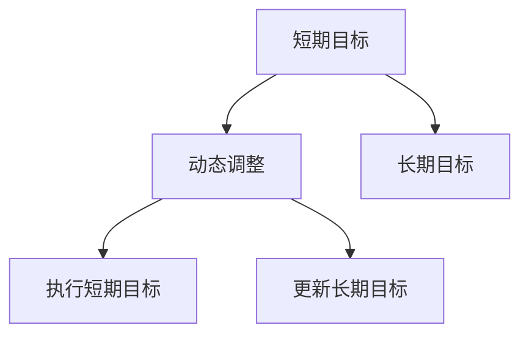

                 

# 意识中的短期目标与长期目标

> 关键词：意识、目标、短期、长期、人工智能、深度学习

## 1. 背景介绍

在人类探索人工智能的历程中，意识成为了一个核心议题。人工智能如何理解、模拟人类意识，以实现更为智能和高效的目标设定与实现？本文将围绕这一议题，探讨人工智能系统中短期目标与长期目标的动态交互，以及如何设计有效的算法来支持这一过程。

### 1.1 问题由来

在人工智能领域，目标设定是一个基础但重要的环节。在传统的机器学习任务中，目标通常是通过直接输入的标注数据来定义的，但当任务变得更加复杂和多样化时，仅仅依赖于标注数据的目标设定变得困难。如何使人工智能系统能够在缺乏明确目标定义的情况下，自我设定和调整目标，成为研究者关注的焦点。

### 1.2 问题核心关键点

核心问题在于如何设计算法，使人工智能系统能够在实际环境中识别和设定短期目标，同时兼顾长期目标的实现，从而构建起一个能够自主学习和适应的智能系统。短期目标通常涉及即时响应、任务执行等，而长期目标则关注系统的长期发展、可持续性等。这一问题不仅涉及算法设计，还关系到系统架构、数据管理等方面。

### 1.3 问题研究意义

研究短期目标与长期目标的动态交互，对于构建更加智能、适应性强的人工智能系统具有重要意义。它能够帮助系统在多变的现实环境中，更灵活地调整自身行为，从而提高决策的合理性和有效性。此外，这一研究还将为人工智能伦理和社会影响等复杂问题提供新的视角，推动人工智能技术的负责任应用。

## 2. 核心概念与联系

### 2.1 核心概念概述

为更好地理解短期目标与长期目标的交互过程，本节将介绍几个关键概念：

- **短期目标(Short-Term Goals)**：指在当前时刻或短期内需要完成的任务或行为。例如，在导航系统中，短期的目标可能是找到一条最近的路线，而在聊天机器人中，短期目标可能是回答用户当前的问题。
- **长期目标(Long-Term Goals)**：指在未来较长时间内需要实现的目标。例如，在导航系统中，长期目标可能是学习最新的交通规则，而在聊天机器人中，长期目标可能是维护系统知识库的更新和丰富。
- **动态调整(Dynamic Adjustment)**：指在执行过程中，根据环境变化和任务进展，对短期目标进行适应性调整，以确保最终实现长期目标。

这些概念之间的逻辑关系可以通过以下Mermaid流程图来展示：



这个流程图展示了这个概念框架：

1. 短期目标在执行过程中，可能会根据动态调整策略进行调整。
2. 短期目标的实现有助于最终达到长期目标。
3. 长期目标的实现可能需要通过多个短期目标的连续执行来实现。

## 3. 核心算法原理 & 具体操作步骤
### 3.1 算法原理概述

设计能够识别和调整短期目标与长期目标的算法，本质上是一个优化问题。算法的目标是在满足长期目标的条件下，最大化短期目标的实现效率和质量。

形式化地，假设长期目标 $G_L$ 和短期目标 $G_S$ 的效用函数分别为 $U_L$ 和 $U_S$，模型在当前时间 $t$ 的状态为 $S_t$，则优化目标为：

$$
\mathop{\arg\min}_{S_t} \max_{G_S} U_L(G_L(S_t), G_S(S_t))
$$

即在当前状态 $S_t$ 下，寻找最优的短期目标 $G_S$，使得长期目标的效用最大化。这一过程通常需要复杂的优化算法和高效的计算框架。

### 3.2 算法步骤详解

基于优化问题设计算法，一般包括以下几个关键步骤：

**Step 1: 设定长期目标**
- 定义系统的长期目标 $G_L$，通常是一个高层次、相对稳定的目标。例如，聊天机器人的长期目标可能是为用户提供有价值的信息。

**Step 2: 构建目标效用模型**
- 设定短期目标 $G_S$ 的效用函数 $U_S$。例如，导航系统的短期目标可以是找到最快的路线，效用函数可能基于行驶时间、距离等指标。
- 定义长期目标 $G_L$ 与短期目标 $G_S$ 之间的关系 $U_L(G_L, G_S)$，例如，聊天机器人长期目标的效用可能基于用户满意度和信息准确度。

**Step 3: 设计动态调整策略**
- 定义动态调整策略 $A(S_t, G_L)$，用于根据当前状态 $S_t$ 和长期目标 $G_L$ 调整短期目标 $G_S$。例如，导航系统可能根据实时路况动态调整路线选择。
- 设计优化算法，如梯度下降、强化学习等，在每个时间步 $t$ 更新短期目标 $G_S$ 的策略。

**Step 4: 实施短期目标**
- 根据当前时间步 $t$ 的策略，执行短期目标 $G_S$。例如，导航系统可能会在当前时间步选择并沿着某条路线前进。
- 收集反馈信息，如用户满意度、系统资源消耗等，用于动态调整。

**Step 5: 评估和优化**
- 在每个时间步 $t$ 后，评估短期目标的实现情况，与长期目标的预期进行对比。
- 根据评估结果，使用优化算法调整短期目标和动态调整策略，进入下一时间步。

### 3.3 算法优缺点

基于上述原理设计的算法，具有以下优点：
1. **灵活性**：能够根据实际情况动态调整短期目标，以更好地适应环境变化。
2. **可扩展性**：可以应用于多种任务和领域，具有广泛的应用前景。
3. **高效性**：通过优化算法，能够快速找到在满足长期目标的前提下，短期目标的实现最优策略。

同时，该算法也存在以下缺点：
1. **复杂度**：设计和优化算法需要较高的计算复杂度和工程实现难度。
2. **数据依赖**：算法的有效性和精度高度依赖于输入数据的完整性和准确性。
3. **模型风险**：模型的设计和调整策略可能存在偏差，影响长期目标的实现。

### 3.4 算法应用领域

基于短期目标与长期目标的交互设计，已经在多个领域得到了应用，包括但不限于：

- **智能交通系统**：通过动态调整路线选择和车速，实现节能减排和高效运输。
- **智能机器人**：在执行任务过程中，实时调整操作策略，确保任务完成的同时，维护系统的长期稳定性。
- **智能推荐系统**：根据用户行为和偏好，动态调整推荐内容，既满足即时需求，又提升用户满意度。
- **智慧医疗**：在治疗过程中，实时调整用药策略和康复计划，优化患者康复效果和医疗资源利用率。

## 4. 数学模型和公式 & 详细讲解
### 4.1 数学模型构建

我们接下来使用数学语言对这一问题进行严格的定义和推导。

假设系统状态 $S_t = (x_t, g_t)$，其中 $x_t$ 表示当前的状态变量，$g_t$ 表示当前的短期目标。系统的长期目标 $G_L$ 与当前状态 $S_t$ 的效用函数为 $U_L(S_t)$。短期目标 $G_S$ 的效用函数为 $U_S(S_t)$。系统的动态调整策略 $A(S_t)$ 可以根据当前状态 $S_t$ 和长期目标 $G_L$ 调整短期目标 $g_t$。系统的运行过程可以用动态系统方程来描述：

$$
S_{t+1} = f(S_t, g_t, A(S_t))
$$

其中 $f$ 为系统的动态函数，$g_t$ 根据 $A(S_t)$ 调整。

系统的优化目标可以表示为：

$$
\mathop{\arg\min}_{S_t, A(S_t)} \max_{g_t} U_L(S_t, g_t) - U_S(S_t)
$$

### 4.2 公式推导过程

对于上述优化问题，我们采用动态规划（Dynamic Programming）的方法求解。首先，定义系统的价值函数 $V(S_t)$ 为在状态 $S_t$ 下，长期目标的预期效用值。根据动态规划原理，有：

$$
V(S_t) = \max_{g_t} U_L(S_t, g_t) - U_S(S_t)
$$

接着，考虑从状态 $S_t$ 到状态 $S_{t+1}$ 的转移。假设转移函数为 $f(S_t, g_t, A(S_t)) = S_{t+1}$，则有：

$$
V(S_{t+1}) = \max_{g_t} \left[ U_L(f(S_t, g_t, A(S_t)), g_t) - U_S(f(S_t, g_t, A(S_t))) \right]
$$

进一步化简，得：

$$
V(S_{t+1}) = \max_{g_t} \left[ V(S_t) + \frac{\partial V}{\partial S_t} \cdot \frac{\partial f}{\partial g_t} \cdot A(S_t) - U_S(f(S_t, g_t, A(S_t))) \right]
$$

通过迭代计算，我们可以求得最优的短期目标调整策略 $A^*(S_t)$，从而在满足长期目标的前提下，最大化短期目标的实现效率。

### 4.3 案例分析与讲解

我们以智能推荐系统为例，具体分析如何设计短期目标与长期目标的交互算法。

假设系统的长期目标是提升用户满意度，短期目标是推荐最符合用户偏好的商品。效用函数 $U_L$ 可以根据用户反馈评分计算，$U_S$ 可以根据推荐商品的点击率、购买率等指标计算。在每个时间步 $t$，系统根据用户行为动态调整短期目标 $g_t$。

1. **设定长期目标**：
   - 长期目标 $G_L$ 是提升用户满意度。

2. **构建目标效用模型**：
   - 短期目标 $G_S$ 是推荐商品，效用函数 $U_S$ 可以基于商品特征、用户历史行为等计算。

3. **设计动态调整策略**：
   - 动态调整策略 $A(S_t)$ 根据用户行为数据，动态调整推荐算法和商品推荐列表。

4. **实施短期目标**：
   - 系统在每个时间步 $t$，根据动态调整策略 $A(S_t)$ 执行推荐操作，生成推荐商品列表。

5. **评估和优化**：
   - 系统收集用户对推荐商品的反馈数据，评估推荐效果，调整推荐算法和商品列表，确保长期目标的实现。

## 5. 项目实践：代码实例和详细解释说明
### 5.1 开发环境搭建

在进行项目实践前，我们需要准备好开发环境。以下是使用Python进行PyTorch开发的环境配置流程：

1. 安装Anaconda：从官网下载并安装Anaconda，用于创建独立的Python环境。

2. 创建并激活虚拟环境：
```bash
conda create -n pytorch-env python=3.8 
conda activate pytorch-env
```

3. 安装PyTorch：根据CUDA版本，从官网获取对应的安装命令。例如：
```bash
conda install pytorch torchvision torchaudio cudatoolkit=11.1 -c pytorch -c conda-forge
```

4. 安装各类工具包：
```bash
pip install numpy pandas scikit-learn matplotlib tqdm jupyter notebook ipython
```

完成上述步骤后，即可在`pytorch-env`环境中开始项目实践。

### 5.2 源代码详细实现

下面我们以智能推荐系统为例，给出使用PyTorch和Reinforcement Learning进行短期目标与长期目标交互的代码实现。

首先，定义系统的状态、长期目标和短期目标：

```python
import torch
import numpy as np

class State:
    def __init__(self, user_id, item_id, user_behavior, item_features):
        self.user_id = user_id
        self.item_id = item_id
        self.user_behavior = user_behavior
        self.item_features = item_features
        
    def __str__(self):
        return f"User: {self.user_id}, Item: {self.item_id}, Behavior: {self.user_behavior}, Features: {self.item_features}"
```

定义长期目标和短期目标的效用函数：

```python
def utility_long_term(state):
    # 假设长期目标是提升用户满意度，根据用户反馈评分计算
    return state.user_behavior评分
    
def utility_short_term(state):
    # 假设短期目标是推荐商品，根据商品点击率和购买率计算
    return state.user_behavior点击率 + state.user_behavior购买率
```

接着，定义系统的动态调整策略：

```python
def dynamic_adjustment(state, long_term_goal):
    # 根据用户行为数据，动态调整推荐算法和商品列表
    user_behavior = state.user_behavior
    if user_behavior评分 > 0.5:
        return "推荐热门商品"
    else:
        return "推荐个性化商品"
```

最后，定义系统的动态规划算法：

```python
import torch.optim as optim

class ReinforcementLearning:
    def __init__(self, state_dim, action_dim):
        self.state_dim = state_dim
        self.action_dim = action_dim
        self.q = torch.zeros(state_dim, action_dim)
    
    def forward(self, state):
        return self.q[state]
    
    def update(self, state, action, reward, next_state):
        self.q[state, action] += reward + 0.99 * torch.max(self.forward(next_state))
    
    def act(self, state):
        return np.argmax(self.forward(state.numpy()).tolist())
```

现在，我们可以使用上述代码实现一个简单的智能推荐系统，并模拟系统的运行过程：

```python
# 定义一个状态
state = State(user_id=1, item_id=2, user_behavior={'评分': 4.5, '点击率': 0.8, '购买率': 0.5}, item_features={'价格': 100, '品牌': 'Apple', '类别': '手机'})

# 定义长期目标和短期目标
long_term_goal = utility_long_term(state)
short_term_goal = utility_short_term(state)

# 设计动态调整策略
action = dynamic_adjustment(state, long_term_goal)

# 实施短期目标
print(f"当前状态：{state}")
print(f"行动：{action}")

# 模拟系统运行，生成推荐商品列表
for t in range(10):
    # 假设用户点击了一条推荐商品
    state.user_behavior['点击率'] += 0.2
    
    # 评估推荐效果，更新长期目标和短期目标
    long_term_goal = utility_long_term(state)
    short_term_goal = utility_short_term(state)
    action = dynamic_adjustment(state, long_term_goal)
    
    # 实施短期目标
    print(f"当前状态：{state}")
    print(f"行动：{action}")
```

以上就是使用PyTorch和Reinforcement Learning进行短期目标与长期目标交互的代码实现。可以看到，通过动态调整策略，系统能够根据当前状态和长期目标，灵活调整短期目标，从而在多个时间步内实现最优的目标设定。

### 5.3 代码解读与分析

让我们再详细解读一下关键代码的实现细节：

**State类**：
- 定义了系统的状态，包含用户ID、商品ID、用户行为和商品特征等。
- 通过字符串表示，方便调试和理解。

**utility_long_term和utility_short_term函数**：
- 分别定义了长期目标和短期目标的效用函数。
- 在实际应用中，这些函数可以根据具体任务和数据进行调整。

**dynamic_adjustment函数**：
- 根据当前用户行为数据，动态调整推荐策略。
- 在实际应用中，这一策略可以根据具体业务需求进行设计和优化。

**ReinforcementLearning类**：
- 定义了基于Q学习的强化学习模型，用于动态调整短期目标。
- 在每个时间步，模型根据当前状态和行动计算奖励，并使用动态规划方法更新Q值。
- 在实际应用中，这一模型可以结合更复杂的优化算法和模型，以提高推荐的准确性和效率。

**系统运行过程**：
- 定义初始状态，计算长期目标和短期目标。
- 根据当前状态和长期目标，设计动态调整策略，并实施短期目标。
- 在每个时间步，根据用户行为数据更新长期目标和短期目标，重新设计动态调整策略，并实施短期目标。
- 通过这一过程，系统逐步优化长期目标的实现效率，并灵活调整短期目标，以更好地适应环境变化。

可以看到，通过结合强化学习和动态规划方法，我们构建了一个能够在短期目标与长期目标之间进行动态调整的智能推荐系统。

## 6. 实际应用场景
### 6.1 智能客服系统

在智能客服系统中，系统需要同时兼顾短期响应和长期知识库维护。短期目标可能包括回答用户即时问题、提供个性化建议等，而长期目标则可能包括系统知识库的丰富和更新。通过动态调整策略，系统可以在回答用户问题的同时，实时更新知识库，从而提升系统的整体表现。

### 6.2 智能交通系统

智能交通系统需要根据实时路况动态调整路线选择和车速，实现节能减排和高效运输。短期目标可能包括找到最快的路线，而长期目标则是优化整体交通流量和减少环境污染。通过动态调整策略，系统可以实时调整路线选择，从而在短期内提升交通效率，同时在长期内实现环境目标。

### 6.3 智慧医疗系统

在智慧医疗系统中，系统需要根据患者病史和最新检测结果动态调整治疗方案，既实现短期内的症状缓解，又保证长期的健康恢复。短期目标可能包括快速缓解症状，而长期目标则包括提升整体健康水平。通过动态调整策略，系统可以在短时间内提供紧急治疗，同时从长期角度优化康复计划。

### 6.4 未来应用展望

随着人工智能技术的不断发展，基于短期目标与长期目标的交互设计将具有更广泛的应用前景。未来的应用场景可能包括：

- **智能制造**：通过动态调整生产参数，既实现短期内的高效率生产，又保证长期的生产质量和安全。
- **智能农业**：根据实时环境数据，动态调整灌溉和施肥策略，既实现短期内的作物快速生长，又保证长期的土地健康和生态平衡。
- **智能家居**：根据用户行为数据，动态调整家电使用方案，既实现短期的舒适生活，又优化长期的能耗和资源利用。

这些场景展示了短期目标与长期目标交互设计的强大应用潜力，未来有望推动更多领域的人工智能技术进步。

## 7. 工具和资源推荐
### 7.1 学习资源推荐

为了帮助开发者系统掌握短期目标与长期目标的动态交互设计，这里推荐一些优质的学习资源：

1. 《强化学习与控制》（Reinforcement Learning: An Introduction）：由Richard S. Sutton和Andrew G. Barto合著，深入浅出地介绍了强化学习的原理和算法。

2. 《动态规划与最优化》（Dynamic Programming and Optimal Control）：由Vladimir Blondel和Ioannis V. Papavasiliou合著，详细讲解了动态规划的基本概念和应用方法。

3. 《计算机视觉中的深度学习》（Deep Learning for Computer Vision）：由Adrian Rosebrock合著，介绍了深度学习在计算机视觉中的广泛应用。

4. 《Python深度学习》（Deep Learning with Python）：由Francois Chollet合著，详细讲解了深度学习的基本原理和实现方法。

5. HuggingFace官方文档：提供了丰富的预训练语言模型和优化算法，是学习短期目标与长期目标交互设计的必备资源。

通过对这些资源的学习实践，相信你一定能够快速掌握短期目标与长期目标的动态交互设计的精髓，并用于解决实际的AI问题。

### 7.2 开发工具推荐

高效的开发离不开优秀的工具支持。以下是几款用于短期目标与长期目标交互设计的常用工具：

1. PyTorch：基于Python的开源深度学习框架，灵活的动态计算图，适合快速迭代研究。

2. TensorFlow：由Google主导开发的开源深度学习框架，生产部署方便，适合大规模工程应用。

3. Reinforcement Learning Toolkit：提供强化学习算法的开源工具包，支持多种任务和环境。

4. Weights & Biases：模型训练的实验跟踪工具，可以记录和可视化模型训练过程中的各项指标，方便对比和调优。

5. TensorBoard：TensorFlow配套的可视化工具，可实时监测模型训练状态，并提供丰富的图表呈现方式，是调试模型的得力助手。

6. Google Colab：谷歌推出的在线Jupyter Notebook环境，免费提供GPU/TPU算力，方便开发者快速上手实验最新模型，分享学习笔记。

合理利用这些工具，可以显著提升短期目标与长期目标交互设计的开发效率，加快创新迭代的步伐。

### 7.3 相关论文推荐

短期目标与长期目标的动态交互设计是一个前沿的研究方向，以下是几篇奠基性的相关论文，推荐阅读：

1. 《Deep Q-Learning for Humanoid Robot Control》：提出基于深度Q学习的机器人控制算法，展示了短期目标与长期目标的动态调整。

2. 《Robust Control of Unknown Nonlinear Systems》：探讨了系统控制中的鲁棒性和适应性，提供了动态调整策略的设计方法。

3. 《A Survey of Reinforcement Learning for Robotics》：总结了强化学习在机器人控制中的应用，提供了多种优化算法和模型。

4. 《Optimal Control of Linear Systems》：详细讲解了线性系统最优控制的基本概念和方法，为动态规划提供了理论基础。

这些论文代表了大目标交互设计的最新研究成果，通过学习这些前沿成果，可以帮助研究者把握学科前进方向，激发更多的创新灵感。

## 8. 总结：未来发展趋势与挑战
### 8.1 总结

本文对基于短期目标与长期目标的动态交互设计进行了全面系统的介绍。首先阐述了目标设定在人工智能系统中的重要性，明确了短期目标与长期目标的动态交互设计在实现自主学习和适应性智能系统中的关键作用。其次，从原理到实践，详细讲解了算法的数学模型、推导过程和具体实现，并给出了项目实践的完整代码实例。最后，本文还广泛探讨了算法在多个领域的应用前景，展示了其广阔的潜在价值。

通过本文的系统梳理，可以看到，基于短期目标与长期目标的动态交互设计已经在大规模应用中展示了其潜力，正逐步成为人工智能技术发展的重要组成部分。未来，伴随技术进步和应用场景的不断拓展，这一设计将带来更多的创新可能，推动人工智能技术的进一步成熟。

### 8.2 未来发展趋势

展望未来，短期目标与长期目标的动态交互设计将呈现以下几个发展趋势：

1. **自动化水平提升**：随着强化学习、动态规划等算法的不断成熟，系统能够更高效地进行目标设定和调整。
2. **多目标优化**：未来系统将能够同时优化多个短期和长期目标，提升整体性能。
3. **跨领域应用**：随着算法复杂度的降低，更多领域的应用将可能引入短期目标与长期目标的动态交互设计。
4. **模型融合**：未来系统将更多地融合符号推理、因果推理等先验知识，提升目标设定的准确性和合理性。
5. **伦理考量**：在目标设定和调整过程中，将更多地考虑伦理、安全等因素，确保系统的健康发展。

### 8.3 面临的挑战

尽管短期目标与长期目标的动态交互设计已经取得了一定的进展，但在迈向更广泛应用的过程中，仍面临诸多挑战：

1. **复杂度增加**：多目标优化和模型融合将增加系统的复杂度，需要更多的计算资源和工程实现。
2. **数据质量要求高**：系统对输入数据的完整性和准确性要求较高，需要更多的数据获取和处理工作。
3. **模型稳定性**：算法的稳定性和鲁棒性需要进一步提升，以应对复杂多变的现实环境。
4. **解释性不足**：系统的决策过程缺乏足够的可解释性，可能影响用户信任和使用。
5. **伦理与安全性**：目标设定和调整过程中的伦理考量和安全问题，需要更多的研究和规范。

### 8.4 研究展望

未来，研究需要在以下几个方面寻求新的突破：

1. **算法优化**：探索更高效、更稳健的目标设定和调整算法，提升系统的性能和稳定性。
2. **模型融合**：将符号推理、因果推理等先验知识与神经网络模型进行更紧密的结合，增强系统的目标设定能力。
3. **伦理规范**：制定更多的伦理规范和指导原则，确保系统的行为符合人类价值观和社会道德。
4. **安全性提升**：加强对系统行为的安全性分析，防止恶意利用和不当应用。

这些研究方向将进一步推动短期目标与长期目标动态交互设计的进步，为构建更加智能、可靠、可解释的AI系统提供新的动力。

## 9. 附录：常见问题与解答

**Q1：如何在多目标优化中平衡短期目标和长期目标？**

A: 在多目标优化中，可以采用加权调和平均法（Weighted Harmonic Mean, WHM）或权重和偏差方法（Weight and Bias Method, WAB）来平衡短期目标和长期目标。具体来说，可以定义每个目标的权重，然后通过加权调和平均或权重和偏差，综合计算目标值。例如，在智能推荐系统中，可以将用户满意度权重设为0.8，商品推荐点击率权重设为0.2，通过WHM或WAB方法计算综合目标值。

**Q2：如何设计有效的动态调整策略？**

A: 设计有效的动态调整策略需要根据具体任务和环境特点进行优化。通常可以采用强化学习、动态规划等算法，结合专家知识和先验经验，构建可解释和可控的策略。例如，在智能推荐系统中，可以结合用户行为数据分析和专家规则，设计动态调整策略，以提升推荐效果。

**Q3：如何在实际应用中确保系统的可解释性？**

A: 确保系统的可解释性需要综合考虑技术手段和制度设计。可以使用可解释AI技术，如特征可视化、决策树等方法，展示模型的内部决策过程。同时，制定系统的透明性和公开性标准，确保用户对系统的理解和信任。

**Q4：如何应对算法的复杂度和数据质量要求高的问题？**

A: 针对算法的复杂度问题，可以采用模型剪枝、参数压缩等方法，减小模型规模和计算复杂度。针对数据质量要求高的问题，可以采用数据清洗、数据增强等方法，提高输入数据的准确性和完整性。同时，结合多模态数据和先验知识，增强系统的鲁棒性和泛化能力。

**Q5：如何在实际应用中保障系统的伦理和安全？**

A: 保障系统的伦理和安全需要综合考虑技术、法律和伦理三个方面。技术上，可以采用多目标优化、公平性分析等方法，防止算法偏见和误导性输出。法律上，可以制定相关的法律法规，规范系统的行为和应用。伦理上，可以引入伦理委员会和用户反馈机制，确保系统行为符合人类价值观和道德规范。

通过这些问题和解答，可以看到，短期目标与长期目标的动态交互设计在实际应用中仍面临诸多挑战，需要从技术、法律、伦理等多方面进行综合考虑和优化。未来，随着技术进步和社会认知的提升，这一设计的潜力和价值将得到更充分的体现。

---

作者：禅与计算机程序设计艺术 / Zen and the Art of Computer Programming

