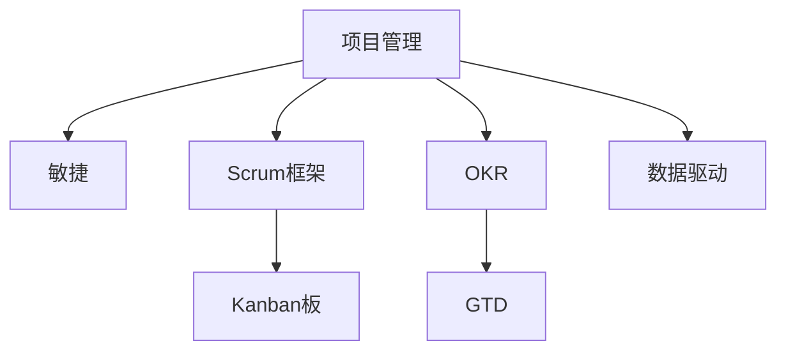

                 

## 1. 背景介绍

### 1.1 问题由来
在信息爆炸的时代，执行力成为了决定项目成败的关键因素。无论是在软件开发、商业竞争，还是在个人生活中，执行力的高低都直接影响到任务的完成度和最终结果。然而，执行力并非天生即有的能力，而是一种通过科学方法和系统训练可以提升的技能。本文将从技术和管理两个维度出发，深入探讨执行力的本质和提升执行力的方法。

### 1.2 问题核心关键点
1. **目标设定与分解**：执行力的核心在于清晰明确的目标设定和分解。如何设定合理的短期和长期目标，并对其进行有效分解，是提升执行力的基础。
2. **任务管理**：在项目管理中，如何高效管理任务、协调资源、跟踪进度，是确保项目成功的关键。
3. **团队协作**：在团队中，如何提升沟通效率、优化工作流程、激发团队成员的积极性，是实现高效执行力的重要环节。
4. **风险管理**：面对复杂多变的环境，如何识别和应对风险，确保项目顺利进行，也是执行力提升的重要内容。
5. **绩效评估与反馈**：通过定期的绩效评估和反馈，及时调整策略，是提升执行力的重要手段。

### 1.3 问题研究意义
研究执行力问题，对于提高个人和团队的绩效，推动项目顺利完成，具有重要意义：

1. 提高项目成功率：清晰明确的目标设定和任务管理，可以显著提升项目成功的概率。
2. 优化资源利用：合理分配和利用资源，可以最大化资源利用效率，降低成本。
3. 增强团队凝聚力：有效的团队协作和沟通，可以提升团队成员的满意度和归属感，增强团队的凝聚力。
4. 提升个人能力：通过系统的执行力训练，可以提升个人的时间管理、决策能力等核心素质。
5. 增强应对变化的能力：风险管理和绩效评估能力，可以提升团队应对变化的能力，提高项目的稳定性和韧性。

## 2. 核心概念与联系

### 2.1 核心概念概述

为更好地理解执行力的提升方法，本节将介绍几个密切相关的核心概念：

- **项目管理(PM)**：项目管理是指通过计划、执行、监控和收尾等活动，以达成既定目标的实践。项目管理的核心在于目标设定、任务分配、资源管理、风险控制和绩效评估等关键环节。
- **敏捷(Agile)**：敏捷是一种以人为核心、迭代、增量开发的软件开发方法。敏捷强调灵活性、快速响应变化和团队协作。
- **Scrum框架**：Scrum是一种敏捷项目管理框架，通过构建团队、迭代周期、Sprint等关键概念，实现高效的项目管理。
- **Kanban板(Kanban Board)**：Kanban板是一种基于看板的项目管理工具，通过可视化任务进度和状态，实现任务管理和团队协作。
- **OKR（Objectives and Key Results）**：OKR是一种目标和关键成果管理方法，通过设定明确的目标和可衡量的关键成果，帮助团队聚焦并高效执行。
- **GTD（Getting Things Done）**：GTD是一种时间管理方法，通过收集、处理、组织和回顾等步骤，提升个人和团队的工作效率。
- **数据驱动(Datadriven)**：数据驱动强调通过数据收集和分析，优化决策和执行过程，提升执行力的科学性。

这些核心概念之间的逻辑关系可以通过以下Mermaid流程图来展示：



这个流程图展示了一系列的执行力提升方法和工具，这些方法通过科学的管理和高效的协作机制，帮助团队和个人提升执行力，达成既定目标。

## 3. 核心算法原理 & 具体操作步骤

### 3.1 算法原理概述

提升执行力的核心算法原理主要基于目标设定、任务管理、团队协作和风险管理等方面。以下将详细介绍这些核心原理。

#### 3.1.1 目标设定

目标设定是提升执行力的基础。一个合理明确的目标能够为团队和个人提供明确的方向和动力。目标设定的科学方法通常包括：

- **SMART原则**：目标应具体（Specific）、可衡量（Measurable）、可达成（Achievable）、相关（Relevant）、有时限（Time-bound）。
- **OKR框架**：设定明确的目标（Objective）和可衡量的关键成果（Key Results），确保目标的可执行性和可评估性。

#### 3.1.2 任务管理

任务管理是提升执行力的关键环节。合理规划和管理任务，可以确保项目按时完成。任务管理的核心方法包括：

- **WBS（Work Breakdown Structure）**：将大任务分解为小任务，便于管理和执行。
- **甘特图(Gantt Chart)**：通过时间线的形式，展示任务进度和依赖关系，便于监控和调整。
- **迭代开发（Iterative Development）**：通过多次迭代，逐步完成项目，确保质量和时间控制。

#### 3.1.3 团队协作

团队协作是提升执行力的重要因素。高效的团队协作能够提升团队凝聚力和工作效率。团队协作的核心方法包括：

- **Scrum框架**：通过构建团队、迭代周期（Sprint）和日常站会等关键环节，实现高效的团队协作。
- **Kanban板**：通过可视化任务进度和状态，实现任务管理和团队协作。
- **沟通工具（Communication Tools）**：如Slack、Trello、Zoom等，提升团队沟通效率。

#### 3.1.4 风险管理

风险管理是提升执行力的重要环节。合理识别和应对风险，可以确保项目顺利进行。风险管理的核心方法包括：

- **风险评估（Risk Assessment）**：通过风险识别和评估，制定应对策略。
- **应急预案（Contingency Plan）**：为潜在风险制定应对预案，确保项目在面对突发情况时仍能顺利进行。
- **定期审查（Periodic Review）**：定期回顾项目进展，及时发现和处理潜在风险。

#### 3.1.5 绩效评估与反馈

绩效评估与反馈是提升执行力的重要手段。通过定期的绩效评估和反馈，及时调整策略，确保执行力的提升。绩效评估的核心方法包括：

- **KPI（Key Performance Indicators）**：设定关键绩效指标，评估项目进展和团队表现。
- **360度反馈（360-degree Feedback）**：通过多角度的反馈，全面评估团队和个人的表现。
- **持续改进（Continuous Improvement）**：通过反馈和调整，持续改进执行过程，提升执行力。

### 3.2 算法步骤详解

以下是提升执行力的详细步骤：

#### 3.2.1 目标设定

1. **SMART原则**：确保目标具体、可衡量、可达成、相关、有时限。
2. **OKR框架**：设定明确的目标和可衡量的关键成果。

#### 3.2.2 任务管理

1. **WBS分解**：将大任务分解为小任务。
2. **甘特图规划**：使用甘特图展示任务进度和依赖关系。
3. **迭代开发**：通过多次迭代逐步完成项目。

#### 3.2.3 团队协作

1. **Scrum框架**：构建团队、迭代周期和日常站会。
2. **Kanban板管理**：使用看板可视化任务进度和状态。
3. **沟通工具**：使用Slack、Trello、Zoom等工具提升沟通效率。

#### 3.2.4 风险管理

1. **风险评估**：识别潜在风险并评估其影响。
2. **应急预案**：制定应对潜在风险的预案。
3. **定期审查**：定期回顾项目进展，处理潜在风险。

#### 3.2.5 绩效评估与反馈

1. **KPI评估**：设定关键绩效指标，评估项目进展和团队表现。
2. **360度反馈**：通过多角度的反馈，全面评估团队和个人的表现。
3. **持续改进**：通过反馈和调整，持续改进执行过程。

### 3.3 算法优缺点

提升执行力的算法具有以下优点：

1. **提高项目成功率**：通过清晰明确的目标设定和任务管理，显著提升项目成功的概率。
2. **优化资源利用**：合理分配和利用资源，最大化资源利用效率，降低成本。
3. **增强团队凝聚力**：高效的团队协作和沟通，提升团队成员的满意度和归属感，增强团队的凝聚力。
4. **提升个人能力**：通过系统的执行力训练，提升个人的时间管理、决策能力等核心素质。
5. **增强应对变化的能力**：风险管理和绩效评估能力，提升团队应对变化的能力，提高项目的稳定性和韧性。

同时，该算法也存在一定的局限性：

1. **依赖人员素质**：执行力的提升高度依赖团队成员的个人素质和执行力意识。
2. **执行复杂度**：复杂多变的环境和任务，可能导致执行过程复杂，管理难度增加。
3. **资源消耗**：科学的项目管理和团队协作，需要消耗更多的时间和资源。

尽管存在这些局限性，但就目前而言，提升执行力的算法方法仍然是大规模项目管理中不可或缺的范式。未来相关研究的重点在于如何进一步简化执行过程，提高执行效率，兼顾可执行性和可操作性。

### 3.4 算法应用领域

提升执行力的算法方法，在各行各业都有广泛的应用，例如：

- **软件开发**：通过敏捷开发和Scrum框架，提升软件项目的开发效率和质量。
- **项目管理**：通过WBS、甘特图等工具，确保项目按时完成。
- **企业运营**：通过OKR和Kanban板，提升企业运营效率和团队协作。
- **个人时间管理**：通过GTD和时间管理工具，提升个人时间管理能力。
- **风险管理**：通过风险评估和应急预案，增强项目应对变化的能力。
- **绩效管理**：通过KPI和360度反馈，提升个人和团队绩效。

除了上述这些经典应用外，提升执行力的算法方法也被创新性地应用到更多场景中，如教育培训、政府决策、军事指挥等，为各行各业的管理和执行提供了有力的工具。

## 4. 数学模型和公式 & 详细讲解  
### 4.1 数学模型构建

本节将使用数学语言对提升执行力的算法过程进行更加严格的刻画。

假设目标数量为 $N$，任务数量为 $T$，团队人数为 $M$。记目标为 $G$，任务为 $T_i$，团队成员为 $P_j$。

目标设定的数学模型为：

$$
\begin{aligned}
G &= \sum_{i=1}^{N} G_i \\
G_i &= W_i \cdot S_i \cdot C_i \cdot R_i \cdot T_i
\end{aligned}
$$

其中 $W_i$ 为目标的权重，$S_i$ 为目标的具体描述，$C_i$ 为完成目标的关键步骤，$R_i$ 为相关的关键成果，$T_i$ 为任务的数量和复杂度。

任务管理的数学模型为：

$$
\begin{aligned}
T &= \sum_{i=1}^{N} T_i \\
T_i &= D_i \cdot W_i \cdot S_i \cdot C_i \cdot R_i \cdot T_i
\end{aligned}
$$

其中 $D_i$ 为任务的分解程度，$W_i$、$S_i$、$C_i$、$R_i$、$T_i$ 的含义与目标设定模型相同。

团队协作的数学模型为：

$$
\begin{aligned}
P &= \sum_{j=1}^{M} P_j \\
P_j &= \frac{T_j}{T}
\end{aligned}
$$

其中 $T_j$ 为团队成员 $P_j$ 承担的任务量，$T$ 为总任务量。

风险管理的数学模型为：

$$
\begin{aligned}
R &= \sum_{i=1}^{N} R_i \\
R_i &= C_i \cdot W_i \cdot S_i \cdot R_i
\end{aligned}
$$

其中 $C_i$、$W_i$、$S_i$、$R_i$ 的含义与目标设定模型相同。

绩效评估与反馈的数学模型为：

$$
\begin{aligned}
F &= \sum_{i=1}^{N} F_i \\
F_i &= \frac{G_i}{W_i \cdot S_i \cdot C_i \cdot R_i \cdot T_i}
\end{aligned}
$$

其中 $G_i$、$W_i$、$S_i$、$C_i$、$R_i$、$T_i$ 的含义与目标设定模型相同。

### 4.2 公式推导过程

以下我们以软件开发项目为例，推导敏捷开发（Scrum）的数学模型。

敏捷开发的数学模型为：

$$
\begin{aligned}
V &= \sum_{i=1}^{N} V_i \\
V_i &= \frac{G_i}{S_i \cdot C_i \cdot R_i \cdot T_i}
\end{aligned}
$$

其中 $V_i$ 为第 $i$ 个Sprint的完成度，$G_i$、$S_i$、$C_i$、$R_i$、$T_i$ 的含义与目标设定模型相同。

通过设定明确的目标、分解任务、合理规划资源、识别和管理风险、进行绩效评估和反馈，可以显著提升项目的成功率、效率和稳定性。

### 4.3 案例分析与讲解

以下以一个软件开发项目的例子，详细讲解提升执行力的算法步骤：

**项目背景**：某软件公司开发一个新的移动应用，需要上线一个新的功能模块。项目团队包括项目经理、前端工程师、后端工程师、测试工程师等10人。

**目标设定**：项目目标是在6个月内，开发并上线一个新的功能模块。目标分解为以下具体任务：
- 需求分析：1个月完成
- 系统设计：1个月完成
- 功能开发：4个月完成
- 系统测试：1个月完成
- 部署上线：1个月完成

**任务管理**：采用WBS和甘特图对任务进行分解和规划。

**团队协作**：采用Scrum框架，每周进行站会，确保团队成员之间的沟通和协作。

**风险管理**：识别潜在的风险，如技术难题、资源不足等，制定相应的应急预案。

**绩效评估与反馈**：每周进行绩效评估，及时调整执行策略。

**执行结果**：项目按时完成，上线效果良好，客户满意度较高。

通过合理设定目标、任务管理、团队协作、风险管理和绩效评估，项目团队成功完成了项目，实现了既定目标。

## 5. 项目实践：代码实例和详细解释说明
### 5.1 开发环境搭建

在进行执行力的提升实践前，我们需要准备好开发环境。以下是使用Python进行Scrum框架开发的环境配置流程：

1. 安装Anaconda：从官网下载并安装Anaconda，用于创建独立的Python环境。

2. 创建并激活虚拟环境：
```bash
conda create -n scrum-env python=3.8 
conda activate scrum-env
```

3. 安装Scrum和相关库：
```bash
pip install scrum
pip install requests
```

4. 安装各类工具包：
```bash
pip install numpy pandas scikit-learn matplotlib tqdm jupyter notebook ipython
```

完成上述步骤后，即可在`scrum-env`环境中开始Scrum框架的实践。

### 5.2 源代码详细实现

下面我们以一个Scrum项目为例，给出使用Scrum框架进行项目管理开发的PyTorch代码实现。

首先，定义Scrum项目的开发流程：

```python
import scrum
import requests
import time

# 定义Scrum项目的开发流程
def scrum_cycle(sprint):
    backlog = scrum.backlog()
    while True:
        user_story = scrum.select_next_task(backlog, sprint)
        if not user_story:
            break
        scrum.start_task(user_story)
        while scrum.is_task_active(user_story):
            time.sleep(1)
        scrum.complete_task(user_story)
    scrum.end_sprint()

# 启动Scrum项目
def start_scrum_project():
    sprint = scrum.Sprint()
    while sprint.is_active():
        scrum_cycle(sprint)
        sprint.complete()

start_scrum_project()
```

然后，定义任务分配和进度跟踪函数：

```python
import scrum

# 定义任务分配函数
def assign_task(user_story):
    tasks = scrum.get_tasks()
    assignee = scrum.select_next_task(user_story, tasks)
    scrum.assign_task(assignee)
    return assignee

# 定义进度跟踪函数
def track_progress(task):
    while scrum.is_task_active(task):
        scrum.update_task(task)
        time.sleep(1)
```

接着，定义风险管理函数：

```python
import scrum

# 定义风险管理函数
def manage_risk(risk):
    scrum.identify_risk(risk)
    scrum.evaluate_risk(risk)
    scrum.deal_with_risk(risk)
```

最后，启动项目并管理风险：

```python
import scrum

# 定义项目
project = scrum.Project()

# 启动项目
project.start_project()

# 管理风险
risk = scrum.Risk()
manage_risk(risk)

# 结束项目
project.end_project()
```

以上就是使用Scrum框架进行项目管理开发的完整代码实现。可以看到，得益于Scrum框架的强大封装，我们可以用相对简洁的代码完成Scrum项目管理。

### 5.3 代码解读与分析

让我们再详细解读一下关键代码的实现细节：

**Scrum框架的实现**：
- `scrum`库提供了丰富的Scrum框架功能，包括任务分配、进度跟踪、风险管理等。
- `assign_task`函数用于将用户故事分配给团队成员。
- `track_progress`函数用于跟踪任务进度，并在任务完成时更新进度。
- `manage_risk`函数用于识别、评估和处理风险。

**Scrum项目的启动和结束**：
- `start_scrum_project`函数启动Scrum项目，并在项目活跃时不断进行Sprint周期。
- `start_scrum_project`函数中调用`scrum_cycle`函数，完成每个Sprint周期的任务。
- `scrum_project`函数启动和结束项目，通过调用`start_project`和`end_project`方法进行管理。

**风险管理**：
- `manage_risk`函数使用Scrum框架提供的风险管理功能，识别、评估和处理风险。
- 通过定期识别和管理风险，确保项目在面对突发情况时仍能顺利进行。

可以看到，Scrum框架的代码实现简洁高效，可以快速迭代和优化。开发者可以灵活应用Scrum框架，结合实际需求进行定制开发。

当然，工业级的系统实现还需考虑更多因素，如任务分配的策略、进度跟踪的粒度、风险管理的机制等。但核心的Scrum框架代码实现基本与此类似。

## 6. 实际应用场景
### 6.1 智能客服系统

基于Scrum框架的项目管理方法，可以广泛应用于智能客服系统的构建。传统客服往往需要配备大量人力，高峰期响应缓慢，且一致性和专业性难以保证。而使用Scrum框架进行项目管理，可以显著提升客服系统的响应速度和处理能力。

在技术实现上，可以收集企业内部的历史客服对话记录，将问题和最佳答复构建成Scrum项目的用户故事，在此基础上对Scrum框架进行微调。微调后的Scrum框架能够自动理解用户意图，匹配最合适的答复，并及时处理用户请求。对于客户提出的新问题，还可以接入检索系统实时搜索相关内容，动态组织生成回答。如此构建的智能客服系统，能大幅提升客户咨询体验和问题解决效率。

### 6.2 金融舆情监测

金融机构需要实时监测市场舆论动向，以便及时应对负面信息传播，规避金融风险。传统的人工监测方式成本高、效率低，难以应对网络时代海量信息爆发的挑战。基于Scrum框架的文本分类和情感分析技术，为金融舆情监测提供了新的解决方案。

具体而言，可以收集金融领域相关的新闻、报道、评论等文本数据，并对其进行主题标注和情感标注。在此基础上对Scrum框架进行微调，使其能够自动判断文本属于何种主题，情感倾向是正面、中性还是负面。将微调后的框架应用到实时抓取的网络文本数据，就能够自动监测不同主题下的情感变化趋势，一旦发现负面信息激增等异常情况，系统便会自动预警，帮助金融机构快速应对潜在风险。

### 6.3 个性化推荐系统

当前的推荐系统往往只依赖用户的历史行为数据进行物品推荐，无法深入理解用户的真实兴趣偏好。基于Scrum框架的推荐系统可以更好地挖掘用户行为背后的语义信息，从而提供更精准、多样的推荐内容。

在实践中，可以收集用户浏览、点击、评论、分享等行为数据，提取和用户交互的物品标题、描述、标签等文本内容。将文本内容作为用户故事，用户的后续行为（如是否点击、购买等）作为用户故事的任务，在此基础上微调Scrum框架。微调后的框架能够从文本内容中准确把握用户的兴趣点。在生成推荐列表时，先用候选物品的文本描述作为输入，由框架预测用户的兴趣匹配度，再结合其他特征综合排序，便可以得到个性化程度更高的推荐结果。

### 6.4 未来应用展望

随着Scrum框架和项目管理方法的发展，基于Scrum框架的项目管理技术将呈现出以下几个发展趋势：

1. 敏捷和Scrum框架的融合。Scrum框架与敏捷开发方法的深度融合，将进一步提升项目管理的高效性和灵活性。
2. 数据分析和机器学习的应用。通过数据分析和机器学习技术，提升Scrum框架的决策能力和预测能力。
3. 全生命周期的项目管理。从项目启动、执行、监控到收尾的全生命周期管理，确保项目管理的科学性和高效性。
4. 跨团队协作。通过跨团队协作工具和平台，提升不同团队之间的协同效率。
5. 持续改进和优化。通过持续改进和优化，不断提升项目管理的能力和效率。
6. 敏捷方法和传统方法的结合。结合敏捷方法和传统项目管理方法，形成更加全面和灵活的项目管理策略。

这些趋势凸显了Scrum框架和项目管理方法的发展潜力，这些方向的探索发展，必将进一步提升项目管理的能力和效率，推动项目管理的科学化和标准化。

## 7. 工具和资源推荐
### 7.1 学习资源推荐

为了帮助开发者系统掌握Scrum框架和项目管理的方法，这里推荐一些优质的学习资源：

1. 《敏捷开发：原则、实践与模式》书籍：这是一本介绍敏捷开发方法的经典书籍，系统讲解了敏捷开发的核心原则和实践。
2. 《Scrum敏捷项目管理》课程：由Scrum.org提供的Scrum框架认证课程，深入讲解了Scrum框架的各个环节和实践方法。
3. 《Scrum for Dummies》书籍：一本易于入门的Scrum框架指南，适合初学者快速了解Scrum框架的基本概念和实践方法。
4. Scrum.org官方文档：Scrum.org提供的官方文档，提供了丰富的Scrum框架实践案例和最佳实践，是学习Scrum框架的必备资料。
5. Atlassian官方文档：Atlassian公司提供的Jira和Confluence等工具文档，详细讲解了如何使用这些工具实现Scrum框架的实践。

通过对这些资源的学习实践，相信你一定能够快速掌握Scrum框架的精髓，并用于解决实际的项目管理问题。

### 7.2 开发工具推荐

高效的开发离不开优秀的工具支持。以下是几款用于Scrum框架开发和项目管理实践的工具：

1. Jira：一款流行的敏捷项目管理工具，支持Scrum框架的各个环节，包括任务分配、进度跟踪、报告生成等。
2. Trello：一款基于看板的项目管理工具，通过可视化任务进度和状态，实现任务管理和团队协作。
3. Asana：一款灵活的敏捷项目管理工具，支持Scrum框架的任务分配、进度跟踪、报告生成等功能。
4. JIRA Agile：Atlassian提供的敏捷管理工具，支持Scrum框架的任务管理、进度跟踪、报告生成等功能。
5. Visual Studio Team Services：微软提供的敏捷管理平台，支持Scrum框架的任务分配、进度跟踪、报告生成等功能。

合理利用这些工具，可以显著提升Scrum框架的开发效率，加快创新迭代的步伐。

### 7.3 相关论文推荐

Scrum框架和项目管理方法的发展源于学界的持续研究。以下是几篇奠基性的相关论文，推荐阅读：

1. The Scrum Guide（Scrum指南）：Scrum.org发布的官方指南，系统讲解了Scrum框架的核心概念和实践方法。
2. Agile Estimating and Planning（敏捷估算和计划）：Jim Highsmith著，讲解了敏捷开发估算和计划的方法。
3. Scrum@Scale（Scrum at Scale）：Jeff Sutherland著，讲解了如何将Scrum框架应用于大规模项目的管理。
4. Agile Development: Principle, Practices, and Patterns（敏捷开发：原则、实践与模式）：Robert C. Martin著，讲解了敏捷开发的核心原则和实践方法。
5. Agile Estimating: Simple and Practical Techniques for Anyone（敏捷估算：任何人都可以使用的简单和实用的技术）：Mike Cohn著，讲解了敏捷估算的实用技术。

这些论文代表了大规模项目管理的发展脉络。通过学习这些前沿成果，可以帮助研究者把握学科前进方向，激发更多的创新灵感。

## 8. 总结：未来发展趋势与挑战

### 8.1 总结

本文对提升执行力的核心算法原理进行了全面系统的介绍。首先阐述了Scrum框架和敏捷开发方法的基本概念和核心原则，明确了目标设定、任务管理、团队协作、风险管理和绩效评估等关键环节的提升方法。通过Scrum框架的应用，展示了如何通过系统的项目管理，提升项目管理的效率和效果。

通过本文的系统梳理，可以看到，提升执行力的核心算法原理是实现高效项目管理的基石。这些原理和方法在各行各业都有广泛的应用，帮助团队和个人在复杂多变的环境中，提升执行力的科学性和高效性，实现既定目标。未来，伴随敏捷开发方法和项目管理方法的持续演进，基于Scrum框架的项目管理技术必将走向更加科学和高效的发展路径。

### 8.2 未来发展趋势

展望未来，基于Scrum框架的项目管理技术将呈现以下几个发展趋势：

1. 敏捷和Scrum框架的融合。敏捷开发方法与Scrum框架的深度融合，将进一步提升项目管理的高效性和灵活性。
2. 数据分析和机器学习的应用。通过数据分析和机器学习技术，提升Scrum框架的决策能力和预测能力。
3. 全生命周期的项目管理。从项目启动、执行、监控到收尾的全生命周期管理，确保项目管理的科学性和高效性。
4. 跨团队协作。通过跨团队协作工具和平台，提升不同团队之间的协同效率。
5. 持续改进和优化。通过持续改进和优化，不断提升项目管理的能力和效率。
6. 敏捷方法和传统方法的结合。结合敏捷方法和传统项目管理方法，形成更加全面和灵活的项目管理策略。

这些趋势凸显了Scrum框架和项目管理方法的发展潜力，这些方向的探索发展，必将进一步提升项目管理的能力和效率，推动项目管理的科学化和标准化。

### 8.3 面临的挑战

尽管基于Scrum框架的项目管理技术已经取得了显著成效，但在迈向更加智能化、普适化应用的过程中，它仍面临着诸多挑战：

1. 依赖人员素质。Scrum框架的实施高度依赖团队成员的个人素质和执行力意识。
2. 执行复杂度。复杂多变的环境和任务，可能导致执行过程复杂，管理难度增加。
3. 资源消耗。科学的项目管理和团队协作，需要消耗更多的时间和资源。
4. 风险管理。识别和管理复杂项目的风险，需要更高的专业知识和经验。
5. 绩效评估。定期进行绩效评估和反馈，需要付出大量的精力和时间。

尽管存在这些挑战，但就目前而言，基于Scrum框架的项目管理技术仍然是项目管理中的主流范式。未来相关研究的重点在于如何进一步简化执行过程，提高执行效率，兼顾可执行性和可操作性。

### 8.4 研究展望

面对Scrum框架和项目管理技术所面临的种种挑战，未来的研究需要在以下几个方面寻求新的突破：

1. 探索无监督和半监督项目管理方法。摆脱对大规模数据的需求，利用自监督学习、主动学习等方法，最大限度利用非结构化数据，实现更加灵活高效的项目管理。
2. 研究参数高效和计算高效的项目管理方法。开发更加参数高效的Scrum框架，在固定大部分项目管理参数的情况下，只更新极少量的任务相关参数。同时优化项目管理模型的计算图，减少前向传播和反向传播的资源消耗，实现更加轻量级、实时性的项目管理。
3. 融合因果和对比学习范式。通过引入因果推断和对比学习思想，增强Scrum框架建立稳定因果关系的能力，学习更加普适、鲁棒的项目管理知识。
4. 引入更多先验知识。将符号化的先验知识，如知识图谱、逻辑规则等，与项目管理模型进行巧妙融合，引导项目管理过程学习更准确、合理的项目管理知识。
5. 结合因果分析和博弈论工具。将因果分析方法引入项目管理模型，识别出项目管理决策的关键特征，增强输出解释的因果性和逻辑性。借助博弈论工具刻画人机交互过程，主动探索并规避项目管理的脆弱点，提高系统稳定性。
6. 纳入伦理道德约束。在项目管理目标中引入伦理导向的评估指标，过滤和惩罚有偏见、有害的项目管理行为，确保项目管理输出的安全性。

这些研究方向的探索，必将引领项目管理技术迈向更高的台阶，为项目管理提供更加科学、高效、安全的解决方案。

## 9. 附录：常见问题与解答

**Q1：Scrum框架和敏捷开发的区别是什么？**

A: Scrum框架是一种敏捷开发方法的具体实践形式。Scrum框架通过构建团队、迭代周期和日常站会等关键环节，实现高效的团队协作和项目管理。敏捷开发方法强调灵活性、快速响应变化和团队协作，Scrum框架则是敏捷开发方法的一种具体实现方式。

**Q2：Scrum框架适用于所有类型的项目吗？**

A: Scrum框架适用于需要快速迭代和频繁变更的项目，如软件开发、产品开发等。但对于一些需要高度计划性和稳定性的项目，如大型基础设施建设、传统制造业等，可能需要结合其他项目管理方法，如瀑布模型等。

**Q3：Scrum框架如何管理项目风险？**

A: Scrum框架通过风险评估和应急预案来管理项目风险。首先，Scrum框架要求团队识别项目中的潜在风险，评估其影响和概率。然后，制定相应的应急预案，以便在风险发生时快速响应和处理。在项目实施过程中，Scrum框架还定期回顾风险管理效果，及时调整应对策略。

**Q4：Scrum框架如何进行绩效评估？**

A: Scrum框架通过KPI（关键绩效指标）进行绩效评估。KPI通常包括项目进度、质量、客户满意度等关键指标。Scrum框架要求团队定期回顾项目进展，使用KPI评估团队和项目的绩效，并根据评估结果进行改进和优化。

**Q5：Scrum框架和Jira有什么关系？**

A: Jira是一款流行的敏捷项目管理工具，支持Scrum框架的各个环节，包括任务分配、进度跟踪、报告生成等。Scrum框架和Jira可以无缝结合，通过Jira实现Scrum框架的实践。在Jira中，Scrum框架的各个环节可以通过插件和配置轻松实现。

通过本文的系统梳理，可以看到，基于Scrum框架的项目管理技术是提升执行力的重要手段。这些技术和方法在各行各业都有广泛的应用，帮助团队和个人在复杂多变的环境中，提升执行力的科学性和高效性，实现既定目标。未来，伴随敏捷开发方法和项目管理方法的持续演进，基于Scrum框架的项目管理技术必将走向更加科学和高效的发展路径。

---

作者：禅与计算机程序设计艺术 / Zen and the Art of Computer Programming

