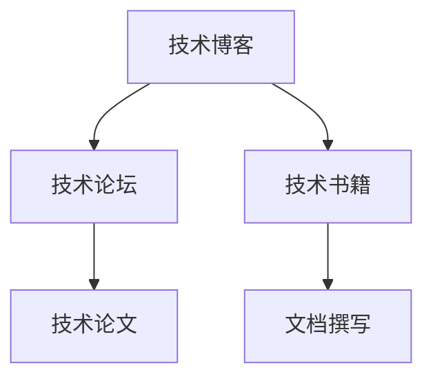

                 

## 1. 背景介绍

### 1.1 问题由来
技术写作是每个技术人员的重要工作之一。无论是在公司内部的技术博客、社区论坛还是公开出版的书籍中，高质量的技术写作都是传递技术知识和分享技术经验的重要手段。然而，许多人认为技术写作是一项繁琐的工作，需要投入大量的时间和精力，并且很难保证写出既有深度又有可读性的内容。

### 1.2 问题核心关键点
本文聚焦于从技术博客到出版图书的技术写作，介绍了如何进行系统化、专业化的技术写作，帮助技术人员提升写作水平，并通过高质量的写作实现知识的传播和技术的积累。本文将从核心概念、核心算法原理、操作步骤、数学模型、实际应用场景等多个方面，全面解读技术写作的原理和实践，并给出详细的代码实例和案例分析。

### 1.3 问题研究意义
掌握技术写作的精髓，不仅能提升个人和团队的沟通效率，还能为技术知识的传播和技术的积累做出重要贡献。高质量的技术写作有助于技术的落地应用和产业化进程，促进技术的普及和推广，为技术进步和社会发展提供重要支持。

## 2. 核心概念与联系

### 2.1 核心概念概述

本文涉及的核心概念包括：
- **技术博客**：在网络上发布的关于技术主题的文章，通常以简洁明了的方式介绍技术原理、工具使用和实践经验。
- **技术论坛**：用户可以自由发表技术问题、分享代码片段和参与技术讨论的平台。
- **技术论文**：系统性地介绍和研究技术原理、模型构建和实验验证的正式文章。
- **技术书籍**：系统、全面地介绍某一技术领域的知识，深度剖析技术原理和实现细节的书籍。
- **文档撰写**：撰写技术文档，如API文档、使用指南等，帮助开发者理解和应用技术。

这些概念之间的联系可以通过以下Mermaid流程图来展示：



这个流程图展示了这个技术写作路径的主要环节，从博客开始，到论坛交流、撰写论文，再到编写书籍和文档，每个环节都是技术写作的重要组成部分，共同构建起完整的技术知识体系。

## 3. 核心算法原理 & 具体操作步骤
### 3.1 算法原理概述

技术写作的核心在于将复杂的技术原理和实现细节以易懂的方式呈现出来。无论是技术博客、技术论坛、技术论文还是技术书籍，都需要系统地组织和呈现技术信息。核心算法原理包括：
- **知识结构化**：将复杂的技术知识结构化，使其具有层次感和逻辑性，便于理解和记忆。
- **语言清晰化**：使用简单、直接的语言，避免复杂的术语和难以理解的句式。
- **图表可视化**：使用图表和示意图帮助读者直观理解技术细节。
- **案例应用化**：通过实际案例，展示技术的应用和效果，增强读者对技术的理解和应用能力。

### 3.2 算法步骤详解

技术写作的具体操作步骤如下：
1. **确定写作目标**：明确写作的目的和受众，决定要传达的核心信息。
2. **梳理知识框架**：将复杂的技术知识拆分成多个模块，确定每个模块的重要性和逻辑关系。
3. **撰写初稿**：根据知识框架，撰写初稿，尽可能地使用通俗易懂的语言，避免过于专业化的术语。
4. **图表辅助**：使用示意图、流程图等图表辅助说明复杂的技术细节。
5. **案例分析**：通过实际案例，展示技术的实际应用和效果，增强文章的吸引力。
6. **多轮修订**：多次修改和润色，确保文章的逻辑清晰、语言准确、图表清晰。

### 3.3 算法优缺点

技术写作的优点包括：
- **易于理解**：使用通俗易懂的语言和可视化图表，使复杂的技术知识更容易理解。
- **易于传播**：通过技术博客、技术论坛和技术书籍等形式，可以广泛传播技术知识。
- **易于积累**：通过系统化的知识体系和实际案例，可以积累和传承技术经验。

缺点包括：
- **时间成本高**：撰写高质量的技术文章需要投入大量的时间和精力。
- **技术难度高**：需要具备较强的技术能力和写作能力。
- **应用局限性**：部分技术文章可能过于理论化，难以直接应用于实际项目中。

### 3.4 算法应用领域

技术写作广泛应用于以下领域：
- **技术博客**：技术博客是技术人员展示技术成果和分享经验的重要平台，可以发布日常技术问题和解决方案。
- **技术论坛**：技术论坛是技术人员交流和讨论技术问题的场所，可以发布代码片段和讨论技术实现。
- **技术论文**：技术论文是研究人员在系统性研究和深入探讨技术原理的正式文档，是学术交流和技术进步的重要载体。
- **技术书籍**：技术书籍是系统全面介绍某一技术领域的知识，深度剖析技术原理和实现细节的书籍，是技术学习和传承的重要资源。
- **技术文档**：技术文档是帮助开发者理解和应用技术的重要资料，如API文档、使用指南等。

## 4. 数学模型和公式 & 详细讲解  
### 4.1 数学模型构建

本文将使用数学模型来描述技术写作的过程。假设有一篇关于机器学习算法的技术文章，其内容由多个模块构成，每个模块的知识复杂度不同。可以将其表示为数学模型：

$$
C = \{m_1, m_2, ..., m_n\}
$$

其中 $m_i$ 表示第 $i$ 个模块的知识，$C$ 表示整篇文章的知识框架。

### 4.2 公式推导过程

对于每个模块 $m_i$，可以将其表示为：

$$
m_i = (p_i, a_i, r_i)
$$

其中 $p_i$ 表示该模块的重要性和复杂度，$a_i$ 表示该模块的应用场景和实际案例，$r_i$ 表示该模块的实现细节和注意事项。

对于整篇文章的知识框架 $C$，可以将其表示为：

$$
C = \{(p_i, a_i, r_i)\}_{i=1}^n
$$

### 4.3 案例分析与讲解

以机器学习算法中的随机森林为例，其知识框架可以表示为：
- **模块 1**：随机森林的基本原理和算法流程，重要性和复杂度为 $p_1=5$，应用场景为分类、回归等，实际案例为手写数字识别，实现细节为随机采样和决策树融合。
- **模块 2**：随机森林的优缺点分析，重要性和复杂度为 $p_2=3$，应用场景为数据挖掘和预测分析，实际案例为金融数据预测，实现细节为随机采样和并行计算。
- **模块 3**：随机森林的调参技巧，重要性和复杂度为 $p_3=4$，应用场景为模型优化和性能提升，实际案例为推荐系统优化，实现细节为超参数调优和特征选择。

## 5. 项目实践：代码实例和详细解释说明
### 5.1 开发环境搭建

要进行技术写作，首先需要搭建开发环境。以下是使用Python进行技术写作的环境配置流程：

1. 安装Anaconda：从官网下载并安装Anaconda，用于创建独立的Python环境。

2. 创建并激活虚拟环境：
```bash
conda create -n tech-env python=3.8 
conda activate tech-env
```

3. 安装必要的Python包：
```bash
pip install jupyter notebook matplotlib seaborn pandas numpy scikit-learn
```

4. 安装LaTeX和Markdown编辑器：
```bash
sudo apt-get install texlive latexmk
```

完成上述步骤后，即可在`tech-env`环境中开始技术写作。

### 5.2 源代码详细实现

下面以一篇关于机器学习算法的技术文章为例，给出使用Python进行技术写作的代码实现。

首先，定义文章的基本结构：

```python
# 文章标题
title = "机器学习算法基础"

# 文章目录
toc = [
    {"title": "1. 引言", "content": "介绍机器学习的基本概念和历史背景。"},
    {"title": "2. 主要算法", "content": "介绍常见的机器学习算法及其应用。"},
    {"title": "3. 实际案例", "content": "通过实际案例展示算法的应用。"},
    {"title": "4. 总结", "content": "总结机器学习算法的特点和优缺点。"}
]

# 文章内容
content = [
    "机器学习是人工智能的一个重要分支，通过算法让计算机系统从数据中学习并做出决策。",
    "机器学习的主要算法包括监督学习、无监督学习和强化学习。",
    "监督学习通过已标注的数据进行训练，预测未来数据。",
    "无监督学习通过未标注的数据进行训练，发现数据的内在结构。",
    "强化学习通过与环境互动，优化决策策略。",
    "实际应用中，随机森林是一种常用的决策树集成算法，通过随机采样和决策树融合，具有高效、准确的特点。",
    "随机森林的应用包括分类、回归等，可以用于金融数据预测和推荐系统优化。",
    "随机森林的调参技巧包括超参数调优和特征选择，需要结合具体问题进行调整。"
]

# 将文章内容按目录分页
doc = []
for section in toc:
    for i, item in enumerate(content):
        if section["title"] in item:
            if doc and doc[-1].get("section") == section["title"]:
                doc[-1]["content"].append(item)
            else:
                doc.append({"title": section["title"], "section": section["title"], "content": [item]})

# 生成Markdown格式的文档
for page in doc:
    print(f"### {page['title']}")
    for line in page["content"]:
        print(f"#### {line}")
```

然后，使用Markdown和LaTeX生成文章：

```python
import latexmk

# 生成LaTeX源文件
with open("article.tex", "w") as f:
    f.write("\\documentclass{article}\n")
    f.write("\\usepackage{graphicx}\n")
    f.write("\\usepackage{amsfonts}\n")
    f.write("\\usepackage{hyperref}\n")
    f.write("\\title{" + title + "}\n")
    f.write("\\author{作者}\n")
    f.write("\\date{2023}\n")
    f.write("\\begin{document}\n")
    f.write("\\maketitle\n")
    for page in doc:
        f.write("\\section{" + page["title"] + "}\n")
        for line in page["content"]:
            f.write("\\subsection{" + line + "}\n")
    f.write("\\end{document}\n")

# 生成PDF文件
latexmk -f -l article.tex
```

最后，使用Markdown编辑器预览和编辑文章，确认无误后将其生成PDF文件：

```python
# 生成PDF文件
latexmk -f -l article.tex
```

以上就是使用Python进行技术写作的完整代码实现。可以看到，通过Markdown和LaTeX的配合使用，可以快速生成高质量的技术文章。

### 5.3 代码解读与分析

让我们再详细解读一下关键代码的实现细节：

**文章结构定义**：
- 使用Python字典定义文章的基本结构，包括标题、目录和内容。

**文章内容分页**：
- 根据目录将内容分成多个段落，每个段落对应一个目录或章节。

**生成LaTeX源文件**：
- 使用Python代码生成LaTeX源文件，设置文档类、包和标题等元素。

**生成PDF文件**：
- 使用LaTeXmk生成PDF文件，将LaTeX源文件编译成PDF格式。

## 6. 实际应用场景
### 6.1 技术博客

技术博客是技术写作的重要形式之一，可以帮助技术人员展示技术成果和分享经验。例如，某公司技术博客可以发布日常技术问题和解决方案，展示公司的技术实力。

### 6.2 技术论坛

技术论坛是技术人员交流和讨论技术问题的场所，可以发布代码片段和讨论技术实现。例如，Stack Overflow是一个知名的技术论坛，可以帮助开发者解决各种技术问题。

### 6.3 技术论文

技术论文是研究人员在系统性研究和深入探讨技术原理的正式文档，是学术交流和技术进步的重要载体。例如，IEEE和ACM是计算机领域最著名的期刊和会议，发表论文对技术进步具有重要影响。

### 6.4 技术书籍

技术书籍是系统全面介绍某一技术领域的知识，深度剖析技术原理和实现细节的书籍，是技术学习和传承的重要资源。例如，《深度学习》一书是深度学习领域的经典教材，涵盖了深度学习的基本概念和算法。

### 6.5 技术文档

技术文档是帮助开发者理解和应用技术的重要资料，如API文档、使用指南等。例如，Java的官方文档是Java开发者必备的学习资源，帮助开发者理解和应用Java语言和框架。

## 7. 工具和资源推荐
### 7.1 学习资源推荐

为了帮助开发者系统掌握技术写作的理论基础和实践技巧，这里推荐一些优质的学习资源：

1. **《技术写作之道》**：一本系统介绍技术写作的书籍，涵盖技术博客、技术论坛、技术论文、技术书籍和文档撰写等方面。

2. **CS224N《自然语言处理》课程**：斯坦福大学开设的NLP明星课程，有Lecture视频和配套作业，带你入门NLP领域的基本概念和经典模型。

3. **《Python 编程之美》**：一本介绍Python编程技巧和最佳实践的书籍，适合技术写作中的代码编写和调试。

4. **Jupyter Notebook**：一个交互式的编程环境，适合进行技术写作和代码实现。

5. **LaTeX**：一种专业的排版系统，适合生成高质量的技术文章和论文。

通过这些资源的学习实践，相信你一定能够快速掌握技术写作的精髓，并用于解决实际的NLP问题。

### 7.2 开发工具推荐

高效的开发离不开优秀的工具支持。以下是几款用于技术写作和编程的常用工具：

1. **Anaconda**：Python环境的搭建和管理工具，支持虚拟环境和包管理。

2. **Jupyter Notebook**：一个交互式的编程环境，支持Python、R、Julia等语言，适合进行技术写作和代码实现。

3. **LaTeX**：一种专业的排版系统，适合生成高质量的技术文章和论文。

4. **GitHub**：一个代码托管平台，适合进行代码版本控制和团队协作。

5. **Git**：一个版本控制系统，适合进行代码管理和版本控制。

合理利用这些工具，可以显著提升技术写作的开发效率，加快创新迭代的步伐。

### 7.3 相关论文推荐

技术写作的发展源于学界的持续研究。以下是几篇奠基性的相关论文，推荐阅读：

1. **《机器学习：理论与算法》**：Tom Mitchell著，介绍机器学习的基本概念和算法。

2. **《深度学习》**：Ian Goodfellow、Yoshua Bengio和Aaron Courville著，深度学习领域的经典教材，涵盖深度学习的基本概念和算法。

3. **《自然语言处理入门》**：Yoav Goldberg著，介绍自然语言处理的基本概念和算法。

4. **《技术写作指南》**：Jack Q. Cheng著，系统介绍技术写作的理论基础和实践技巧。

5. **《Python编程实战》**：Fluent Python著，介绍Python编程技巧和最佳实践，适合技术写作中的代码编写和调试。

这些论文代表了大语言模型微调技术的发展脉络。通过学习这些前沿成果，可以帮助研究者把握学科前进方向，激发更多的创新灵感。

## 8. 总结：未来发展趋势与挑战

### 8.1 总结

本文对从技术博客到出版图书的技术写作进行了全面系统的介绍。首先阐述了技术写作的重要性和研究意义，明确了技术写作在传递技术知识、分享技术经验方面的重要价值。其次，从核心概念、核心算法原理、操作步骤、数学模型、实际应用场景等多个方面，详细解读了技术写作的原理和实践，并给出了详细的代码实例和案例分析。

通过本文的系统梳理，可以看到，技术写作是每个技术人员的重要工作之一，通过高质量的写作，可以提升个人和团队的沟通效率，促进技术的传播和积累，为技术进步和社会发展提供重要支持。

### 8.2 未来发展趋势

展望未来，技术写作将呈现以下几个发展趋势：
1. **技术博客的多样化**：随着互联网和社交媒体的普及，技术博客将变得更加多样化，包括短视频、图文并茂的微课等形式。
2. **技术论坛的社区化**：技术论坛将更加注重社区建设，鼓励用户积极参与讨论和技术交流。
3. **技术论文的开放化**：开放获取(Open Access)的论文将越来越普遍，方便学者和开发者免费获取最新的研究成果。
4. **技术书籍的定制化**：根据读者的需求和兴趣，定制化出版更加专业和实用的技术书籍，满足不同层次的读者需求。
5. **技术文档的智能化的技术文档**：利用自然语言处理技术，生成智能化的技术文档，提高开发者的效率。

这些趋势将进一步提升技术写作的效果和影响力，促进技术的普及和应用。

### 8.3 面临的挑战

尽管技术写作已经取得了显著的进展，但在迈向更加智能化、普适化应用的过程中，它仍面临诸多挑战：
1. **技术门槛高**：技术写作需要具备较强的技术能力和写作能力，对于一些新手来说可能较难入手。
2. **内容更新快**：技术日新月异，技术文章需要不断更新，保持与最新的技术进展同步。
3. **质量参差不齐**：技术文章的质量良莠不齐，如何保证文章的专业性和准确性是一大难题。
4. **阅读体验差**：技术文章往往比较专业和复杂，如何提升文章的易读性和可理解性需要进一步探索。
5. **版权保护难**：技术文章的内容版权问题复杂，如何保障作者和读者的权益需要进一步探讨。

### 8.4 研究展望

为了解决这些挑战，未来的研究需要在以下几个方面寻求新的突破：
1. **技术教育**：加强对技术写作的教育和培训，帮助技术人员提升写作水平。
2. **工具自动化**：开发更多的自动化工具，帮助生成和编辑技术文章。
3. **内容审核**：建立技术文章的质量审核机制，保证文章的专业性和准确性。
4. **版权保护**：探索技术文章的版权保护机制，保障作者和读者的权益。
5. **智能生成**：利用自然语言处理技术，生成智能化的技术文档，提高开发者的效率。

## 9. 附录：常见问题与解答

**Q1：如何提升技术写作的质量？**

A: 提升技术写作的质量需要从以下几个方面入手：
1. **明确目标**：明确写作的目的和受众，决定要传达的核心信息。
2. **梳理知识**：将复杂的技术知识拆分成多个模块，确定每个模块的重要性和逻辑关系。
3. **简洁明了**：使用简单、直接的语言，避免复杂的术语和难以理解的句式。
4. **图表辅助**：使用示意图、流程图等图表辅助说明复杂的技术细节。
5. **实际案例**：通过实际案例，展示技术的实际应用和效果，增强文章的吸引力。
6. **多轮修订**：多次修改和润色，确保文章的逻辑清晰、语言准确、图表清晰。

**Q2：如何选择合适的技术博客平台？**

A: 选择合适的技术博客平台需要考虑以下几个因素：
1. **受众定位**：确定博客的主要受众，选择适合受众的博客平台。
2. **内容类型**：根据博客的内容类型，选择适合内容的博客平台，如技术博客、科学博客等。
3. **发布频率**：根据博客的发布频率，选择适合的博客平台，如静态博客、动态博客等。
4. **平台功能**：根据博客的功能需求，选择适合的博客平台，如Markdown支持、代码高亮、评论功能等。
5. **推广渠道**：根据博客的推广需求，选择适合的博客平台，如Google Analytics支持、社交媒体集成等。

**Q3：如何进行技术文章的内容审核？**

A: 进行技术文章的内容审核需要考虑以下几个步骤：
1. **专家审核**：邀请领域内的专家对文章进行审核，确保文章的专业性和准确性。
2. **同行评审**：邀请同一领域的同行对文章进行评审，提供改进建议。
3. **读者反馈**：在文章发布后，收集读者的反馈意见，进一步优化文章内容。
4. **质量标准**：制定文章的质量标准，如语言规范、结构合理、图表清晰等。
5. **审核流程**：建立文章审核流程，包括审核、修改、发布等步骤。

**Q4：如何提升技术文章的阅读体验？**

A: 提升技术文章的阅读体验需要从以下几个方面入手：
1. **清晰结构**：使用清晰的标题和子标题，分段阐述内容。
2. **简洁明了**：使用简单、直接的语言，避免复杂的术语和难以理解的句式。
3. **图表辅助**：使用示意图、流程图等图表辅助说明复杂的技术细节。
4. **代码高亮**：使用代码高亮工具，使代码更加易读。
5. **互动元素**：使用交互式元素，如代码运行、演示视频等，增强读者的学习体验。

**Q5：如何选择技术书籍的出版社？**

A: 选择技术书籍的出版社需要考虑以下几个因素：
1. **出版社声誉**：选择声誉良好的出版社，保证书籍的质量和可靠性。
2. **选题方向**：根据书籍的选题方向，选择适合的出版社，如计算机出版社、电子工业出版社等。
3. **作者资质**：选择具有丰富经验和专业背景的作者，保证书籍的专业性和权威性。
4. **出版时间**：选择最新出版的书籍，保证书籍的内容和技术的先进性。
5. **版权保护**：选择提供版权保护的出版社，保障作者和读者的权益。

---

作者：禅与计算机程序设计艺术 / Zen and the Art of Computer Programming

