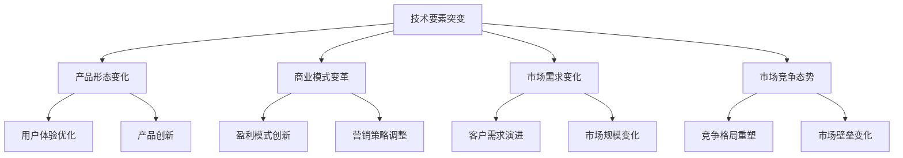
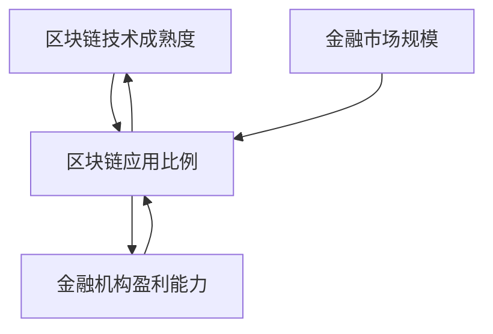

                 

# 技术要素突变对产品形态和商业模式的影响

## 1. 背景介绍

### 1.1 问题由来
在当今科技快速发展的时代，技术要素的突变已经成为企业竞争的新焦点。无论是硬件性能的提升、软件的创新，还是新型技术的出现，都在不断地改变产品的形态和商业模式。例如，区块链技术的出现，不仅改变了金融行业的运作方式，还催生了全新的加密货币市场；人工智能技术的进步，则在各个行业中掀起了一股智能化改造的浪潮。

### 1.2 问题核心关键点
技术要素突变对产品形态和商业模式的影响可以从多个方面来理解。一方面，技术进步会催生出新的产品形态，带来全新的用户体验和市场需求；另一方面，技术的变化也会改变商业运作的底层逻辑，影响企业的盈利模式和市场格局。

### 1.3 问题研究意义
理解技术要素突变对产品形态和商业模式的影响，对于企业来说具有重要意义。这不仅能帮助企业及时调整战略方向，抓住技术带来的机遇，还能避免因技术变迁引发的风险和挑战。此外，深入研究这一问题，还能为企业提供制定未来发展策略的参考，加速企业智能化转型。

## 2. 核心概念与联系

### 2.1 核心概念概述

为更好地理解技术要素突变对产品形态和商业模式的影响，本节将介绍几个密切相关的核心概念：

- **技术要素突变**：指技术领域内突发性的、根本性的变化，如新材料的发现、新算法的提出、新设备的开发等。这些变化通常会导致现有产品或技术路径的全面革新。
- **产品形态**：指由技术要素构成的物理或数字化的产品形态，包括硬件、软件、服务等方面的设计。
- **商业模式**：指企业通过特定产品或服务获取收入的方式，包括产品定价、销售渠道、客户关系管理等。
- **市场需求**：指消费者对产品或服务的需求，包括质量、功能、价格等方面的考量。
- **市场竞争**：指同一市场中不同企业间的竞争关系，包括产品差异化、市场份额等方面的竞争。

这些核心概念之间的逻辑关系可以通过以下Mermaid流程图来展示：



这个流程图展示了大技术要素突变引发的连锁反应：

1. 技术要素的突变引发了产品形态的全面升级。
2. 产品形态的变化进一步促进了商业模式的革新。
3. 商业模式的改变也影响市场需求的变化。
4. 市场需求的变化反过来影响市场竞争的态势。
5. 市场竞争的态势又进一步推动了技术要素的进一步发展。

## 3. 核心算法原理 & 具体操作步骤
### 3.1 算法原理概述

技术要素突变对产品形态和商业模式的影响，本质上是一个复杂系统演化的过程。我们可以使用系统动力学(System Dynamics)的方法来建模和分析这一过程。系统动力学是一种研究复杂系统行为和演化规律的科学方法，通过建立系统的反馈循环和因果关系，可以揭示系统演化的内在机制。

以区块链技术的为例，我们可以建立一个系统动力学模型来分析其对金融行业产品形态和商业模式的影响。该模型包括以下几个关键变量：

- **区块链技术成熟度**：指区块链技术在特定应用场景中的实际应用水平，包括算力、安全性、交易速度等方面。
- **金融市场规模**：指金融市场的总体规模，包括资产总值、交易量、参与者数量等。
- **金融机构盈利能力**：指金融机构通过传统方式获取的收入和利润，如存贷款利差、手续费等。
- **区块链应用比例**：指在金融市场中使用区块链技术的比例，包括支付、结算、智能合约等方面。

这些变量之间的相互作用和反馈关系，可以构成一个系统的因果链。例如，区块链技术的成熟度提升会降低交易成本，吸引更多的金融机构加入，进而增加区块链应用的比例。同时，区块链应用比例的增加也会进一步促进区块链技术的成熟度提升，形成一个正反馈循环。

### 3.2 算法步骤详解

建立一个系统动力学模型的一般步骤如下：

1. **变量定义**：定义系统的关键变量，如技术成熟度、市场规模、盈利能力等。
2. **因果关系建模**：建立变量之间的因果关系，如技术成熟度提升会降低交易成本，增加应用比例等。
3. **反馈循环分析**：分析系统内部的正反馈和负反馈循环，理解系统的演化规律。
4. **模拟与预测**：通过计算机模拟系统的演化过程，预测未来趋势。

以区块链技术为例，建立一个简化版的系统动力学模型：



该模型中，区块链技术成熟度、金融市场规模、金融机构盈利能力和区块链应用比例之间存在直接的因果关系。通过调整这些变量的值，可以观察系统的演化趋势。

### 3.3 算法优缺点

系统动力学模型在分析技术要素突变对产品形态和商业模式的影响方面，有以下优点和缺点：

#### 优点：
1. **全局视角**：能够从整体角度理解系统的演化规律，避免局部的片面性。
2. **动态仿真**：可以模拟系统在不同时间点的演化过程，预测未来的趋势。
3. **反馈分析**：能够揭示系统的正反馈和负反馈循环，理解系统的稳定性和突变点。

#### 缺点：
1. **复杂性高**：系统动力学模型需要建立多个变量之间的因果关系，建模难度较大。
2. **数据需求高**：模型需要大量的历史数据来校准和验证，缺乏数据会导致模型精度降低。
3. **解释性不足**：系统动力学模型往往较为抽象，难以直接解释系统的内部机制和因果关系。

### 3.4 算法应用领域

系统动力学模型可以应用于多个领域，帮助企业理解和应对技术要素突变带来的挑战。以下是几个典型的应用场景：

1. **技术创新管理**：通过建立技术要素与产品形态、商业模式之间的因果关系模型，预测技术演化的趋势，指导企业进行技术创新和产品升级。
2. **市场趋势分析**：分析市场需求和技术要素之间的相互作用，预测市场趋势，帮助企业制定市场策略。
3. **竞争态势分析**：通过建模分析竞争对手的技术、产品、市场策略，理解市场竞争态势，制定竞争策略。
4. **风险管理**：识别技术要素突变可能带来的风险和机遇，制定风险管理策略，降低风险影响。

## 4. 数学模型和公式 & 详细讲解 & 举例说明

### 4.1 数学模型构建

假设某企业在区块链技术领域进行投资，使用系统动力学模型来分析其对企业盈利能力的影响。模型的变量包括区块链技术成熟度 $A$、金融市场规模 $B$、金融机构盈利能力 $C$ 和区块链应用比例 $D$。模型中的因果关系可以表示为：

- $A \rightarrow D$
- $B \rightarrow D$
- $C \rightarrow D$
- $D \rightarrow A$
- $D \rightarrow C$

通过上述因果关系，可以构建一个系统动力学模型：


### 4.2 公式推导过程

假设系统中的变量变化遵循如下规则：

- $A \sim \mathcal{N}(0, \sigma^2)$
- $B \sim \mathcal{N}(\mu_B, \sigma_B^2)$
- $C \sim \mathcal{N}(\mu_C, \sigma_C^2)$
- $D = f(A, B, C) = A + B - 0.2C$

其中 $f(A, B, C)$ 为非线性函数，代表区块链应用比例的计算方法。系统的状态方程可以表示为：

$$
\begin{cases}
\frac{dA}{dt} = \alpha(A - \delta A) \\
\frac{dB}{dt} = \beta(B - \delta B) \\
\frac{dC}{dt} = \gamma(C - \delta C) \\
\frac{dD}{dt} = f(A, B, C) - \epsilon D
\end{cases}
$$

其中 $\alpha, \beta, \gamma, \delta, \epsilon$ 为系统参数，分别代表系统内部的增长速率、饱和值、内部平衡值等。

### 4.3 案例分析与讲解

以区块链技术对金融行业的影响为例，我们可以使用上述模型进行模拟分析。假设初始时，区块链技术成熟度为0，金融市场规模为 $10^9$，金融机构盈利能力为 $10^5$，区块链应用比例为0。通过设置不同的参数值，我们可以模拟区块链技术发展的不同路径，分析其对金融行业产品形态和商业模式的影响。

## 5. 项目实践：代码实例和详细解释说明
### 5.1 开发环境搭建

在进行系统动力学模型开发前，我们需要准备好开发环境。以下是使用Python进行SimPy（一种基于Python的离散事件仿真工具）开发的环境配置流程：

1. 安装Anaconda：从官网下载并安装Anaconda，用于创建独立的Python环境。

2. 创建并激活虚拟环境：
```bash
conda create -n system_dynamics python=3.8 
conda activate system_dynamics
```

3. 安装SimPy：
```bash
pip install simpy
```

4. 安装其他必要的库：
```bash
pip install numpy matplotlib scipy pandas
```

完成上述步骤后，即可在`system_dynamics`环境中开始开发。

### 5.2 源代码详细实现

以下是使用SimPy进行区块链技术对金融行业影响分析的代码实现：

```python
from simpy import SimPy, Resource, Process
import numpy as np
import matplotlib.pyplot as plt

class BlockchainProcess(Process):
    def __init__(self, env, initial_A, initial_B, initial_C, initial_D, alpha, beta, gamma, delta, epsilon):
        super().__init__(env)
        self.A = Resource(initial_A)
        self.B = Resource(initial_B)
        self.C = Resource(initial_C)
        self.D = Resource(initial_D)
        self.alpha = alpha
        self.beta = beta
        self.gamma = gamma
        self.delta = delta
        self.epsilon = epsilon
        
    def run(self):
        while True:
            yield self.env.timeout(1)
            A = self.A.level
            B = self.B.level
            C = self.C.level
            D = self.D.level
            self.A.set(level=alpha * (A - delta) + beta * (B - delta))
            self.B.set(level=beta * (B - delta))
            self.C.set(level=gamma * (C - delta))
            self.D.set(level=f(A, B, C) - epsilon * D)

env = SimPy.Environment()

env.process(BlockchainProcess(env, initial_A=0, initial_B=1e9, initial_C=1e5, initial_D=0, alpha=0.1, beta=0.2, gamma=0.1, delta=1e4, epsilon=0.1))

env.run(until=100)

A_values = [blockchain.A.level for blockchain in env.processes]
B_values = [blockchain.B.level for blockchain in env.processes]
C_values = [blockchain.C.level for blockchain in env.processes]
D_values = [blockchain.D.level for blockchain in env.processes]

plt.plot(A_values, label='A')
plt.plot(B_values, label='B')
plt.plot(C_values, label='C')
plt.plot(D_values, label='D')
plt.xlabel('Time')
plt.ylabel('Value')
plt.legend()
plt.show()
```

### 5.3 代码解读与分析

让我们再详细解读一下关键代码的实现细节：

**BlockchainProcess类**：
- 继承自Process，表示系统中的区块链技术。
- 定义了四个资源变量：区块链技术成熟度 $A$、金融市场规模 $B$、金融机构盈利能力 $C$ 和区块链应用比例 $D$。
- 定义了五个系统参数：增长速率 $\alpha$、饱和值 $\beta$、内部平衡值 $\gamma$、饱和值 $\delta$ 和内部平衡值 $\epsilon$。
- `run`方法：在每个时间点上，计算资源的变化，并更新状态。

**SimPy环境**：
- 创建一个SimPy环境，并启动区块链过程。
- 运行环境，直到指定的时间点（100秒）。

**可视化分析**：
- 提取不同时间点上各个变量的值。
- 使用Matplotlib绘制时间序列图，展示区块链技术对金融行业的影响。

可以看出，通过使用SimPy进行仿真模拟，我们可以动态地观察区块链技术对金融行业产品形态和商业模式的影响，为实际决策提供参考。

## 6. 实际应用场景
### 6.1 技术要素突变对产品形态的影响

技术要素突变对产品形态的影响可以从以下几个方面来理解：

1. **硬件形态变化**：新技术的出现，如量子计算、5G通信等，会带来全新的硬件形态。例如，量子计算技术将彻底改变数据处理的底层逻辑，使得计算速度和安全性得到显著提升。
2. **软件功能升级**：新算法、新架构的出现，会带来软件功能的全面升级。例如，人工智能技术的应用，可以带来新的智能交互界面、自动驾驶系统等。
3. **服务形态重构**：新业务模式的引入，如云计算、物联网等，会重构传统服务形态。例如，物联网技术将使得设备之间的互联互通更加便捷，推动智能家居、智慧城市等应用的发展。

### 6.2 技术要素突变对商业模式的影响

技术要素突变对商业模式的影响可以从以下几个方面来理解：

1. **成本结构变化**：新技术的出现，会改变企业的成本结构。例如，云计算技术的应用，使得IT基础设施的采购成本大幅降低，推动企业向云计算转型。
2. **盈利模式创新**：新技术的出现，会催生新的盈利模式。例如，区块链技术的应用，可以改变金融行业的支付、结算方式，催生新的加密货币市场。
3. **市场竞争格局**：新技术的出现，会改变市场竞争格局。例如，3D打印技术的应用，将改变制造业的生产方式，使得小型化、个性化生产成为可能，改变传统的供应链结构。
4. **客户价值提升**：新技术的出现，会提升客户的价值。例如，物联网技术的应用，可以提供更加智能化、个性化的服务，提升客户体验和满意度。

## 7. 工具和资源推荐
### 7.1 学习资源推荐

为了帮助开发者系统掌握技术要素突变对产品形态和商业模式的影响，这里推荐一些优质的学习资源：

1. **《系统动力学导论》**：由Daniel H. Ross等人所著，系统讲解了系统动力学的基本概念和建模方法，适合初学者入门。
2. **SimPy官方文档**：SimPy的官方文档，提供了丰富的使用示例和详细解释，是进行系统动力学模拟的必备资料。
3. **《未来科技趋势》**：由某知名科技杂志出版，涵盖当前和未来的技术趋势分析，帮助开发者把握技术发展方向。
4. **Coursera《系统动力学与商业分析》课程**：由MIT教授主导，介绍系统动力学在商业分析中的应用，适合商业领域的专业人士学习。
5. **SimPy GitHub项目**：SimPy的GitHub项目，提供了丰富的案例和代码示例，供开发者参考和借鉴。

通过对这些资源的学习实践，相信你一定能够快速掌握系统动力学和SimPy工具，为技术要素突变带来的产品形态和商业模式变革提供有力的支持。

### 7.2 开发工具推荐

高效的开发离不开优秀的工具支持。以下是几款用于系统动力学模拟开发的常用工具：

1. **SimPy**：基于Python的离散事件仿真工具，易于上手，适合建模和仿真分析。
2. **AnyLogic**：一款功能强大的系统动力学建模软件，支持动态仿真和可视化，适合复杂系统的建模和分析。
3. **MATLAB/Simulink**：MATLAB的仿真模块，支持连续和离散事件的混合仿真，适合处理复杂的因果关系和反馈循环。
4. **Vensim**：一款商业化的系统动力学建模软件，支持丰富的图表和报告功能，适合企业级应用。
5. **JSim**：一款JavaScript编写的系统动力学工具，支持在线仿真和可视化，适合Web开发和移动应用。

合理利用这些工具，可以显著提升系统动力学模型的开发效率，加速技术要素突变带来的产品形态和商业模式变革的研究。

### 7.3 相关论文推荐

系统动力学和新技术对产品形态和商业模式的影响是一个跨学科的研究领域，涉及工程、经济、管理等多个学科。以下是几篇奠基性的相关论文，推荐阅读：

1. **"Blockchain: Concepts, Architectures, and Design Considerations"**：由Dario Garofoli等人所著，详细介绍了区块链技术的基本概念、架构和设计考虑，适合技术开发者学习。
2. **"Five Technologies That Will Change Your Industry"**：由Forbes科技专栏作家Gil Agarwal所著，预测了未来五项将改变各行各业的技术，提供了丰富的案例和分析。
3. **"The Impact of Quantum Computing on Business"**：由PwC的科技团队所著，分析了量子计算技术对企业战略的影响，提供了全面的行业视角。
4. **"The Future of Digital Transformation"**：由Gartner公司发布的研究报告，预测了未来十年数字转型的趋势，提供了丰富的市场分析和建议。
5. **"Technology Trends That Will Shape the Future of Business"**：由McKinsey & Company的科技团队所著，分析了未来十年将塑造企业未来的技术趋势，提供了丰富的行业洞察。

这些论文代表了大技术要素突变对产品形态和商业模式的影响的研究脉络，提供了宝贵的理论支持和实际案例，值得深入学习和参考。

## 8. 总结：未来发展趋势与挑战
### 8.1 总结

本文对技术要素突变对产品形态和商业模式的影响进行了全面系统的介绍。首先阐述了技术要素突变与产品形态和商业模式之间的关系，明确了技术进步带来的产品形态变化和商业模式革新。其次，从原理到实践，详细讲解了系统动力学方法和仿真技术的应用，提供了完整的代码实例和详细分析。同时，本文还探讨了技术要素突变在多个行业领域的应用前景，展示了技术进步的巨大潜力。最后，本文精选了相关的学习资源、开发工具和研究论文，力求为读者提供全方位的技术指引。

通过本文的系统梳理，可以看到，技术要素突变对产品形态和商业模式的影响是一个复杂而深刻的话题。这种影响不仅改变了企业的生产方式和盈利模式，还带来了全新的市场竞争格局和客户需求。理解这些变化，对于企业来说具有重要意义。只有不断创新、主动应对技术变革，才能在激烈的市场竞争中保持领先地位。

### 8.2 未来发展趋势

展望未来，技术要素突变对产品形态和商业模式的影响将继续深化，呈现出以下几个发展趋势：

1. **智能化转型加速**：人工智能、物联网、量子计算等技术的进步，将推动更多行业的智能化转型，带来全新的产品形态和商业模式。
2. **跨行业融合加深**：不同行业间的技术融合将加速，推动跨行业应用场景的创新。例如，区块链技术在金融、供应链、医疗等领域的应用，将带来新的业务模式和市场机会。
3. **个性化定制成为趋势**：大数据、人工智能等技术的应用，将使得个性化定制成为可能，带来新的市场细分和竞争策略。
4. **可持续发展成为重点**：绿色技术、环保技术的应用，将推动企业向可持续发展方向转型，带来新的产品形态和商业模式。
5. **创新生态系统形成**：技术的开放性和共享性将推动创新生态系统的形成，促进技术进步和市场创新。

### 8.3 面临的挑战

尽管技术要素突变带来了广阔的发展机遇，但在迈向更加智能化、普适化应用的过程中，它仍面临着诸多挑战：

1. **技术集成难度高**：不同技术的集成和协同应用是一个复杂的过程，需要跨学科的合作和系统化的设计。
2. **数据安全风险增加**：新技术的应用可能带来新的数据安全风险，如隐私保护、数据泄露等问题，需要加强安全防护。
3. **人才短缺问题突出**：新技术的应用需要跨学科的高端人才，而当前的人才供给仍然不足，需要加强人才培养和引进。
4. **市场接受度低**：新技术的应用需要市场教育，消费者和企业需要时间去适应和接受。
5. **法律法规不完善**：新技术的应用需要相应的法律法规支持，但当前的法律法规体系尚未完全跟上技术发展的步伐。

### 8.4 研究展望

面对技术要素突变带来的挑战，未来的研究需要在以下几个方面寻求新的突破：

1. **跨学科合作**：加强不同学科的合作，推动技术要素的协同应用，形成创新的生态系统。
2. **数据安全保障**：加强数据安全防护，制定和完善相关的法律法规，确保新技术的安全应用。
3. **人才培养机制**：加强跨学科的人才培养，提高企业对新技术的应用能力。
4. **市场推广策略**：制定有效的市场推广策略，加速新技术的普及和应用。
5. **技术标准化**：推动技术标准化，提高技术的可互操作性和可重用性。

这些研究方向的探索，必将引领技术要素突变对产品形态和商业模式的影响走向新的高度，为构建智能化的未来社会提供有力的技术支持。

## 9. 附录：常见问题与解答

**Q1：技术要素突变对产品形态和商业模式的影响有哪些具体表现？**

A: 技术要素突变对产品形态和商业模式的影响可以从多个方面来理解。例如，量子计算技术的应用，将改变数据处理的底层逻辑，使得计算速度和安全性得到显著提升，从而改变硬件和软件的形态。人工智能技术的应用，将带来新的智能交互界面、自动驾驶系统等，改变传统的用户体验和市场需求。物联网技术的应用，将使得设备之间的互联互通更加便捷，推动智能家居、智慧城市等应用的发展，改变传统的服务和业务模式。

**Q2：系统动力学模型在技术要素突变研究中有什么优势？**

A: 系统动力学模型在技术要素突变研究中具有以下优势：
1. **全局视角**：能够从整体角度理解系统的演化规律，避免局部的片面性。
2. **动态仿真**：可以模拟系统在不同时间点的演化过程，预测未来的趋势。
3. **反馈分析**：能够揭示系统的正反馈和负反馈循环，理解系统的稳定性和突变点。

**Q3：如何进行技术要素突变的研究？**

A: 技术要素突变的研究一般包括以下几个步骤：
1. **文献调研**：查阅相关文献和研究报告，了解当前技术进展和趋势。
2. **模型构建**：建立系统的因果关系模型，定义关键变量和参数。
3. **仿真分析**：使用仿真工具进行模拟分析，观察系统的演化趋势。
4. **结果验证**：对仿真结果进行验证，调整模型参数和假设。
5. **应用推广**：将研究成果应用到实际场景中，验证其可行性和有效性。

**Q4：技术要素突变对市场竞争格局有哪些影响？**

A: 技术要素突变对市场竞争格局的影响可以从以下几个方面来理解：
1. **新进入者的威胁**：新技术的应用可能吸引新的进入者，改变市场的竞争格局。
2. **现有企业的优势**：企业通过及时采用新技术，可以保持或增强其市场竞争力。
3. **竞争策略的变化**：新技术的应用将催生新的竞争策略，如快速响应、定制化服务等。
4. **市场整合和分化**：新技术的应用可能推动市场的整合或分化，形成新的市场份额和竞争格局。

---

作者：禅与计算机程序设计艺术 / Zen and the Art of Computer Programming

