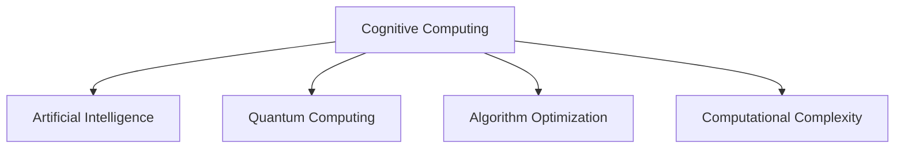

                 

# 拓展认知边界：人类计算的科学探索

> 关键词：认知计算、量子计算、人工智能、算法优化、计算复杂度

## 1. 背景介绍

### 1.1 问题由来
在信息爆炸的互联网时代，数据量呈指数级增长，人类大脑已无法单凭传统认知模式处理如此海量的信息。计算机技术，尤其是人工智能和量子计算等新兴技术，为人类认知模式的拓展提供了新的可能性。这种计算机与人类认知的结合，被称为“认知计算”。

认知计算旨在赋予计算机某种程度的“理解力”和“情感”，使其能够像人一样进行逻辑推理、情感分析、知觉学习等高级认知活动。这种计算方式不仅能在信息处理上取得突破，还能为人类认知能力的拓展开辟新天地。

### 1.2 问题核心关键点
认知计算涉及的领域广泛，包括但不限于自然语言处理、图像识别、推荐系统、情绪分析等。其核心问题包括：

1. 如何实现人机协同。让计算机与人类大脑协作，共同处理复杂问题。
2. 如何强化算法的可解释性。让认知算法像人类思考一样透明可解释。
3. 如何优化计算资源。在有限的计算资源下，提高算法效率。
4. 如何保障数据安全。在计算过程中保障数据的隐私和安全。

这些问题具有高度的复杂性和跨学科特点，是认知计算研究的热点和难点。

### 1.3 问题研究意义
研究认知计算，对于人类认知模式拓展、信息处理能力提升、以及新科技在各行业的应用具有重要意义：

1. 拓展认知边界。认知计算有望开辟认知科学的新领域，推动人类认知能力的质的飞跃。
2. 提升信息处理能力。通过对大规模数据的高效处理，解决海量信息带来的人类思维瓶颈。
3. 促进跨学科融合。认知计算涉及到计算机科学、神经科学、心理学等多个学科，有助于跨领域知识体系的构建。
4. 加速科技落地。通过认知计算，将前沿科技应用于实际业务，加速各行各业数字化转型。

## 2. 核心概念与联系

### 2.1 核心概念概述

在认知计算中，有几个核心概念：

- **认知计算(Cognitive Computing)**：一种结合人工智能与人类认知的新计算范式，旨在模拟人脑处理信息的方式，提升计算系统的智能水平。

- **人工智能(Artificial Intelligence, AI)**：通过算法和计算模型，让计算机模仿人类智能行为的技术。

- **量子计算(Quantum Computing)**：利用量子力学原理，实现比特态叠加和纠缠，以量子比特替代传统比特，提供超算能力。

- **算法优化(Algorithm Optimization)**：通过数学模型和算法，提升计算效率，优化资源配置。

- **计算复杂度(Computational Complexity)**：计算问题所需计算资源的量度，包括时间复杂度和空间复杂度。

这些概念之间的逻辑关系可以通过以下Mermaid流程图来展示：



这个流程图展示了几大核心概念之间的联系：

1. 认知计算以人工智能为基础，通过引入人类认知特性，提升系统的智能水平。
2. 量子计算为认知计算提供了超算能力，突破了传统计算的瓶颈。
3. 算法优化通过高效算法，优化了计算资源的配置，提升了计算效率。
4. 计算复杂度是衡量计算资源需求的关键指标，影响着算法优化和系统设计。

## 3. 核心算法原理 & 具体操作步骤
### 3.1 算法原理概述

认知计算的算法原理可以归结为以下几个关键点：

1. **模拟人脑处理信息**：采用神经网络、符号推理、模糊逻辑等模型，模仿人脑神经元之间的连接方式，实现信息处理和推理。

2. **融合多模态数据**：结合文本、图像、音频等多模态数据，通过跨模态学习，提升信息综合分析能力。

3. **强化学习与进化计算**：通过强化学习、进化算法等，让系统在动态环境中不断学习优化。

4. **优化算法设计**：应用遗传算法、蚁群算法、粒子群算法等，优化算法效率和准确性。

5. **并行计算与分布式计算**：利用并行计算和分布式计算，提升系统处理能力，适应复杂大规模计算任务。

### 3.2 算法步骤详解

一个典型的认知计算流程包括以下步骤：

**Step 1: 数据收集与预处理**
- 收集相关领域的文本、图像、音频等多模态数据。
- 对数据进行去噪、归一化、标注等预处理操作，确保数据质量和可用性。

**Step 2: 建立认知模型**
- 选择合适的认知模型，如神经网络、决策树、模糊逻辑等，建立初步认知模型。
- 调整模型参数，使模型适应具体应用场景。

**Step 3: 模型训练与评估**
- 使用训练集对模型进行有监督或无监督训练。
- 在验证集上评估模型效果，根据指标（如准确率、召回率等）进行调整优化。

**Step 4: 模型应用与反馈优化**
- 将训练好的模型应用于实际问题，通过反馈调整模型参数，提升模型性能。
- 持续监测模型表现，根据新数据和新任务进行模型迭代优化。

### 3.3 算法优缺点

认知计算的算法优势主要体现在以下几个方面：

1. **高智能性**：通过模拟人脑，具备较强的逻辑推理和情感分析能力，能处理复杂的认知任务。

2. **高效性**：通过并行计算和分布式计算，提高信息处理效率，适应大规模计算需求。

3. **可解释性**：通过可视化的认知过程，提升算法的透明度和可解释性。

4. **跨学科融合**：整合神经科学、心理学等多学科知识，推动认知科学新领域发展。

5. **灵活性**：适应不同应用场景，通过微调和反馈优化不断进步。

然而，认知计算也存在一些局限：

1. **计算资源需求高**：由于模拟人脑和并行计算，计算资源消耗较大。

2. **算法复杂度高**：算法设计复杂，需要大量研究和调试。

3. **数据质量要求高**：对数据的标注和清洗要求较高，且多模态数据集成难度大。

4. **计算速度慢**：部分复杂算法和模型训练耗时较长。

5. **实际应用场景有限**：认知计算理论还处于发展初期，实际应用场景有限。

### 3.4 算法应用领域

认知计算已经在多个领域得到应用，以下是几个典型领域：

1. **金融风险管理**：利用认知计算对市场情绪、舆情进行分析，预测金融市场趋势，进行风险控制。

2. **医疗诊断**：通过图像识别、文本分析等技术，辅助医生诊断疾病，提升诊疗准确性。

3. **智能制造**：利用认知计算进行设备监控、故障诊断、生产调度等，提升制造业智能化水平。

4. **智慧城市**：对城市交通、安防、环保等数据进行分析，优化城市管理，提升居民生活质量。

5. **教育辅助**：对学生行为进行分析，提供个性化学习方案，提升教育质量。

6. **社交媒体分析**：对社交媒体数据进行情感分析、舆情监测，辅助企业决策。

## 4. 数学模型和公式 & 详细讲解  
### 4.1 数学模型构建

认知计算的数学模型构建通常涉及以下几类模型：

1. **神经网络模型**：用于模拟人脑神经元之间的连接方式，实现信息处理和推理。

2. **决策树模型**：通过树形结构，实现决策推理。

3. **模糊逻辑模型**：处理不确定性信息，实现模糊推理。

4. **遗传算法模型**：模拟生物进化过程，优化算法参数。

5. **蚁群算法模型**：模拟蚂蚁觅食路径，优化问题求解。

### 4.2 公式推导过程

以神经网络模型为例，介绍认知计算的数学公式推导过程。

假设有 $N$ 个输入 $x_i$，$M$ 个输出 $y_j$，网络有 $L$ 层，第 $l$ 层有 $n_l$ 个神经元。神经元激活函数为 $f$。

神经网络的前向传播过程可以表示为：

$$
z^{(l+1)}_j = \sum_{i=1}^{n_l} w^{(l+1)}_{ij}f(z^{(l)}_i + b^{(l+1)}_j)
$$

其中 $w^{(l+1)}_{ij}$ 为权重矩阵，$b^{(l+1)}_j$ 为偏置项，$z^{(l+1)}_j$ 为第 $j$ 个输出节点的输入。

反向传播过程可以表示为：

$$
\frac{\partial E}{\partial z^{(l+1)}_j} = \frac{\partial E}{\partial y_j} \frac{\partial y_j}{\partial z^{(l+1)}_j}
$$

其中 $E$ 为损失函数，$y_j$ 为输出节点，$z^{(l+1)}_j$ 为输出节点的输入。

通过不断迭代上述公式，更新权重和偏置项，优化神经网络模型。

### 4.3 案例分析与讲解

以图像识别为例，介绍认知计算在实际应用中的案例。

**Step 1: 数据收集与预处理**
- 收集包含动物、汽车等类别的图像数据，并进行标注。
- 对数据进行预处理，如缩放、裁剪、归一化等，确保数据质量和可用性。

**Step 2: 建立认知模型**
- 选择卷积神经网络 (CNN) 作为认知模型，用于处理图像特征。
- 调整网络参数，优化模型结构，提高图像分类精度。

**Step 3: 模型训练与评估**
- 使用训练集对模型进行训练，通过交叉熵损失函数计算损失。
- 在验证集上评估模型效果，根据准确率进行调整优化。

**Step 4: 模型应用与反馈优化**
- 将训练好的模型应用于实际图像分类任务，持续监测模型表现。
- 根据新数据和新任务进行模型迭代优化，提高分类精度。

## 5. 项目实践：代码实例和详细解释说明
### 5.1 开发环境搭建

要进行认知计算的项目实践，首先需要准备好开发环境。以下是使用Python进行TensorFlow开发的环境配置流程：

1. 安装Anaconda：从官网下载并安装Anaconda，用于创建独立的Python环境。

2. 创建并激活虚拟环境：
```bash
conda create -n tf-env python=3.8 
conda activate tf-env
```

3. 安装TensorFlow：根据CUDA版本，从官网获取对应的安装命令。例如：
```bash
conda install tensorflow -c tf -c conda-forge
```

4. 安装TensorBoard：TensorFlow配套的可视化工具，用于监测模型训练状态和结果。

5. 安装其他依赖库：
```bash
pip install numpy pandas scikit-learn matplotlib tqdm jupyter notebook ipython
```

完成上述步骤后，即可在`tf-env`环境中开始认知计算的实践。

### 5.2 源代码详细实现

下面我们以金融风险管理为例，给出使用TensorFlow进行认知计算的PyTorch代码实现。

首先，定义风险评估任务的数学模型：

```python
import tensorflow as tf
from tensorflow.keras import layers

def create_model(input_shape):
    model = tf.keras.Sequential([
        layers.Dense(64, activation='relu', input_shape=input_shape),
        layers.Dense(32, activation='relu'),
        layers.Dense(1, activation='sigmoid')
    ])
    return model

input_shape = (128, 128)
model = create_model(input_shape)
model.compile(optimizer='adam', loss='binary_crossentropy', metrics=['accuracy'])
```

然后，定义训练和评估函数：

```python
from sklearn.model_selection import train_test_split
from sklearn.metrics import accuracy_score

# 加载金融数据
data = ...

# 数据预处理
x_train, x_val, y_train, y_val = train_test_split(data['X'], data['y'], test_size=0.2)

# 训练模型
model.fit(x_train, y_train, batch_size=32, epochs=50, validation_data=(x_val, y_val))

# 评估模型
y_pred = model.predict(x_val)
accuracy = accuracy_score(y_val, y_pred)
print(f'Accuracy: {accuracy:.2f}')
```

最后，启动训练流程并在验证集上评估：

```python
epochs = 50

for epoch in range(epochs):
    model.fit(x_train, y_train, batch_size=32, epochs=1, validation_data=(x_val, y_val))
    y_pred = model.predict(x_val)
    accuracy = accuracy_score(y_val, y_pred)
    print(f'Epoch {epoch+1}, validation accuracy: {accuracy:.2f}')
```

以上就是使用TensorFlow进行金融风险管理任务认知计算的完整代码实现。可以看到，得益于TensorFlow的强大封装，我们可以用相对简洁的代码完成认知计算任务的开发。

### 5.3 代码解读与分析

让我们再详细解读一下关键代码的实现细节：

**create_model函数**：
- 定义了多层感知器 (MLP) 模型，包括输入层、隐藏层和输出层，使用ReLU激活函数。
- 输出层使用Sigmoid函数，用于二分类任务。

**模型训练和评估**：
- 使用sklearn的train_test_split函数对数据进行划分，将数据分为训练集和验证集。
- 定义损失函数为二分类交叉熵损失，优化器为Adam。
- 使用validation_data参数在验证集上评估模型性能。

**训练循环**：
- 使用模型fit函数进行模型训练，每次epoch只更新一次模型参数。
- 在每个epoch结束时，计算验证集的准确率，打印输出。

## 6. 实际应用场景
### 6.1 智能制造系统

在智能制造领域，认知计算的应用可以显著提高生产效率和产品质量。通过认知计算，可以实时监测设备运行状态，预测设备故障，优化生产调度。

具体而言，可以收集生产过程中的各种传感器数据，如温度、压力、振动等，通过认知计算对数据进行分析，识别出异常点，预测设备故障。同时，可以通过认知计算优化生产调度，减少停机时间和生产成本。

### 6.2 智慧城市治理

在智慧城市治理中，认知计算可以提升城市管理的智能化水平。通过认知计算，可以实现城市事件的实时监测和预警，优化城市交通，提升居民生活质量。

例如，可以使用认知计算对交通流量、天气数据进行分析，预测交通拥堵，优化红绿灯配时。同时，通过对社交媒体数据的分析，实时监测舆情，及时响应紧急事件，保障城市安全。

### 6.3 教育辅助系统

在教育领域，认知计算可以提供个性化的学习方案，提升教学质量。通过认知计算，可以分析学生的学习行为，提供个性化推荐和反馈，帮助学生更好地掌握知识。

例如，可以对学生的作业和测试数据进行分析，识别出学生的薄弱环节，提供针对性的学习建议。同时，可以通过认知计算对教学内容进行优化，提升教学效果。

## 7. 工具和资源推荐
### 7.1 学习资源推荐

为了帮助开发者系统掌握认知计算的理论基础和实践技巧，这里推荐一些优质的学习资源：

1. 《Cognitive Computing: An Introduction to the Future of Human-AI Collaboration》书籍：深入浅出地介绍了认知计算的基本概念和应用。

2. CS223《人工智能与机器学习》课程：斯坦福大学开设的认知计算经典课程，涵盖神经网络、认知推理等主题。

3. 《Deep Learning for Computer Vision: A Complete Course》视频教程：由斯坦福大学教授李飞飞主讲的深度学习课程，涵盖图像识别、自然语言处理等认知计算的重要方向。

4. HuggingFace官方文档：提供了丰富的认知计算模型和案例，是学习实践的重要参考。

5. Google AI博文：谷歌AI团队发布的认知计算博文，涵盖了最新的研究和实践进展。

通过对这些资源的学习实践，相信你一定能够快速掌握认知计算的精髓，并用于解决实际的认知问题。

### 7.2 开发工具推荐

高效的开发离不开优秀的工具支持。以下是几款用于认知计算开发的常用工具：

1. TensorFlow：谷歌开源的深度学习框架，支持分布式计算和自动微分，适合大规模认知计算任务的开发。

2. PyTorch：Facebook开源的深度学习框架，灵活高效，支持动态计算图，适合学术研究和实验。

3. Keras：高级神经网络API，简单易用，适合快速原型设计和实验。

4. Jupyter Notebook：交互式计算环境，支持代码和结果的同步展示，方便实验和教学。

5. TensorBoard：TensorFlow配套的可视化工具，用于监测模型训练状态和结果，是调试算法的得力助手。

6. H2O.ai：分布式机器学习平台，支持大规模认知计算任务，适合产业应用。

合理利用这些工具，可以显著提升认知计算任务的开发效率，加快创新迭代的步伐。

### 7.3 相关论文推荐

认知计算的发展离不开学界的持续研究。以下是几篇奠基性的相关论文，推荐阅读：

1. 《A Survey on Cognitive Computing and Its Applications in Industry》：总结了认知计算在各行业的应用案例和未来趋势。

2. 《Cognitive Computing: A Survey of the Evolution, Technological Advancements, and Future Directions》：详细介绍了认知计算技术的发展脉络和未来方向。

3. 《Cognitive Computing: Opportunities and Challenges》：探讨了认知计算的机遇与挑战，提出了一系列研究方向。

4. 《Cognitive Computing: A Brain Inspired Approach to Data Mining》：介绍了认知计算在数据挖掘中的应用。

5. 《Cognitive Computing: A Survey of Recent Advances and Future Directions》：综述了认知计算领域的最新进展和未来发展趋势。

这些论文代表了大认知计算的发展脉络。通过学习这些前沿成果，可以帮助研究者把握学科前进方向，激发更多的创新灵感。

## 8. 总结：未来发展趋势与挑战
### 8.1 总结

本文对认知计算进行了全面系统的介绍。首先阐述了认知计算的研究背景和意义，明确了认知计算在拓展人机协同、提升信息处理能力等方面的独特价值。其次，从原理到实践，详细讲解了认知计算的数学模型和操作步骤，给出了认知计算任务开发的完整代码实例。同时，本文还广泛探讨了认知计算在智能制造、智慧城市、教育辅助等多个行业领域的应用前景，展示了认知计算范式的巨大潜力。此外，本文精选了认知计算的相关资源，力求为读者提供全方位的技术指引。

通过本文的系统梳理，可以看到，认知计算正开启人机协同的新纪元，有望在各个行业带来变革性影响。随着认知计算技术的不断进步，相信人类认知能力的拓展将迎来新的飞跃，为社会发展带来新的动力。

### 8.2 未来发展趋势

展望未来，认知计算将呈现以下几个发展趋势：

1. **计算资源智能化**：通过增强学习、进化计算等技术，使计算机具备自适应和学习能力，更加智能化。

2. **多模态融合深入**：结合文本、图像、音频等多模态数据，提升信息综合分析能力。

3. **跨学科融合深化**：认知计算将与更多学科交叉融合，形成新的知识体系和应用模式。

4. **边缘计算兴起**：将认知计算任务下沉到边缘设备，提高实时性和效率。

5. **量子计算与认知计算结合**：利用量子计算的高效并行能力，提升认知计算处理大规模数据的能力。

6. **跨领域应用扩展**：认知计算将应用于更多行业，提升各领域的智能化水平。

以上趋势凸显了认知计算的广阔前景。这些方向的探索发展，必将进一步提升认知计算的智能水平，推动跨学科融合和产业应用。

### 8.3 面临的挑战

尽管认知计算技术已经取得了一定进展，但在迈向更加智能化、普适化应用的过程中，它仍面临着诸多挑战：

1. **计算资源消耗高**：由于认知计算模拟人脑和并行计算，资源消耗较大，计算资源成为瓶颈。

2. **算法复杂度高**：认知算法设计复杂，需要大量研究和调试，缺乏简单易用的工具。

3. **数据质量要求高**：对数据标注和清洗要求较高，且多模态数据集成难度大。

4. **计算速度慢**：部分复杂算法和模型训练耗时较长，影响实际应用部署。

5. **跨学科知识整合难**：认知计算涉及跨学科知识，知识整合和应用复杂。

6. **系统安全性问题**：认知计算系统需要考虑安全性和隐私保护，防止系统被恶意利用。

正视认知计算面临的这些挑战，积极应对并寻求突破，将使认知计算技术更加成熟，更好地服务于各行业。

### 8.4 研究展望

面对认知计算所面临的挑战，未来的研究需要在以下几个方面寻求新的突破：

1. **算法优化和模型压缩**：开发更加高效的算法和模型压缩技术，降低资源消耗，提高计算速度。

2. **跨学科知识整合**：加强跨学科知识体系的构建，促进认知计算与更多学科的融合。

3. **认知计算与量子计算结合**：利用量子计算的高效并行能力，提升认知计算处理大规模数据的能力。

4. **认知计算系统安全**：加强系统安全性和隐私保护，确保认知计算系统可靠和可信。

这些研究方向的探索，必将引领认知计算技术迈向更高的台阶，为构建更加智能化、普适化的未来社会铺平道路。面向未来，认知计算技术还需要与其他前沿技术进行更深入的融合，如知识表示、因果推理、强化学习等，多路径协同发力，共同推动认知科学的新发展。

## 9. 附录：常见问题与解答

**Q1: 认知计算与人工智能有什么区别？**

A: 认知计算强调模拟人脑的认知过程，关注信息理解、推理、决策等高级认知活动，而人工智能则侧重于知识表示、逻辑推理等较低层次的认知活动。

**Q2: 如何提高认知计算系统的计算效率？**

A: 可以采用分布式计算、异构计算等技术，通过并行计算和优化算法，提升计算效率。

**Q3: 认知计算在实际应用中面临哪些问题？**

A: 主要问题包括计算资源消耗高、算法复杂度高、数据质量要求高、计算速度慢等，需要通过优化算法和改进工具加以解决。

**Q4: 认知计算的未来发展趋势是什么？**

A: 未来趋势包括计算资源智能化、多模态融合深入、跨学科融合深化、边缘计算兴起、量子计算与认知计算结合等。

**Q5: 如何确保认知计算系统的安全性？**

A: 需要通过加密技术、访问控制、审计日志等手段，确保系统的可靠和可信。

---

作者：禅与计算机程序设计艺术 / Zen and the Art of Computer Programming

