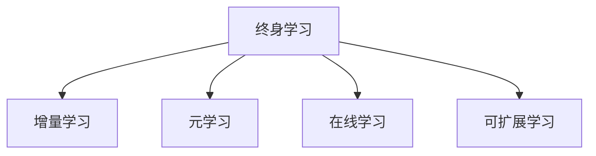

                 

## 1. 背景介绍

### 1.1 问题由来
随着深度学习技术的发展，人工智能(AI)模型在各个领域取得了显著的进展。然而，模型一旦训练完成，其知识和能力便会固定，难以适应不断变化的环境和任务需求。持续学习(A lifelong learning)方法可以使AI模型能够持续地从新数据中学习和适应，从而实现知识的长久保持和不断进化。

### 1.2 问题核心关键点
持续学习方法旨在使模型能够随着环境的变化和数据的增加，动态更新自身的知识和技能，保持其长期效用。该方法依赖于在线学习、增量学习、元学习等多种技术手段，以提高模型对新数据的适应性和泛化能力。

持续学习的核心目标包括：
1. **终身适应性**：模型能够适应数据分布的变化，持续学习新的知识。
2. **高效性**：模型能够以较小的代价，学习新的任务和知识。
3. **鲁棒性**：模型能够抵抗噪声和干扰，保持稳定性和准确性。
4. **可扩展性**：模型能够处理多任务、多领域的学习需求。

本文将系统地介绍持续学习的基本概念、关键算法和实际应用，并通过具体实例展示其应用效果。

## 2. 核心概念与联系

### 2.1 核心概念概述
- **终身学习(Lifelong Learning)**：模型能够持续地从新数据中学习和适应，保持其长期效用。
- **增量学习(Incremental Learning)**：模型能够不断更新已有知识，学习新任务，而无需重新训练整个模型。
- **元学习(Meta-Learning)**：模型能够通过少量样本快速适应新任务，泛化能力更强。
- **在线学习(Online Learning)**：模型能够实时地从流数据中学习，适应环境的变化。
- **可扩展学习(Scalable Learning)**：模型能够处理多任务、多领域的学习需求。

这些概念之间的逻辑关系可以通过以下Mermaid流程图来展示：



这个流程图展示了几大核心概念之间的联系：
- 终身学习是持续学习的基础，强调模型需要具备长期效用。
- 增量学习、元学习和在线学习是终身学习的具体实现方式，通过不断更新知识来保持长期效用。
- 可扩展学习是终身学习的应用延伸，能够处理多任务、多领域的学习需求。

## 3. 核心算法原理 & 具体操作步骤

### 3.1 算法原理概述

持续学习的核心原理是使模型能够在在线流数据上不断更新其知识和技能，以适应环境的变化和任务需求。常用的算法包括增量学习算法、元学习算法和在线学习算法。

### 3.2 算法步骤详解

#### 增量学习算法步骤
增量学习算法通过不断地接收新数据，更新模型参数，以适应新的任务需求。其基本步骤如下：

1. **初始化模型**：选择基础模型并初始化其参数。
2. **数据流处理**：逐批次接收新数据，进行训练。
3. **模型更新**：根据新数据更新模型参数。
4. **模型评估**：评估模型在新数据上的表现。
5. **迭代更新**：重复上述步骤，直至满足预设的停止条件。

#### 元学习算法步骤
元学习算法通过少量样本快速适应新任务，其基本步骤如下：

1. **初始化元参数**：选择基础元参数并初始化。
2. **样本选取**：选取少量样本作为训练集。
3. **模型训练**：训练模型以适应新任务。
4. **模型评估**：评估模型在新任务上的表现。
5. **模型更新**：更新元参数以优化模型性能。
6. **迭代更新**：重复上述步骤，直至满足预设的停止条件。

#### 在线学习算法步骤
在线学习算法通过实时流数据不断更新模型参数，其基本步骤如下：

1. **模型初始化**：选择基础模型并初始化其参数。
2. **流数据处理**：实时接收流数据。
3. **模型更新**：根据新数据实时更新模型参数。
4. **模型评估**：评估模型在流数据上的表现。
5. **迭代更新**：重复上述步骤，直至满足预设的停止条件。

### 3.3 算法优缺点

#### 增量学习算法优缺点
**优点**：
- 实时性高，适应性强。
- 数据需求量小，训练时间短。
- 能够处理大规模数据流。

**缺点**：
- 更新后的模型可能无法适应原有任务。
- 模型参数更新可能导致稳定性下降。

#### 元学习算法优缺点
**优点**：
- 泛化能力强，快速适应新任务。
- 能够在数据量较少的情况下学习新任务。

**缺点**：
- 初始化选择对模型性能影响大。
- 学习过程复杂，计算成本高。

#### 在线学习算法优缺点
**优点**：
- 实时性强，适应性强。
- 能够处理大规模数据流。

**缺点**：
- 数据噪声对模型影响大。
- 模型参数更新可能导致稳定性下降。

### 3.4 算法应用领域

持续学习技术已经在许多领域得到了应用，包括但不限于：

- **金融预测**：通过持续学习，金融模型能够实时更新市场数据，预测股票价格、汇率等。
- **医疗诊断**：医疗模型能够持续学习新的患者数据，提高诊断准确性和治疗效果。
- **自动驾驶**：自动驾驶模型能够实时更新路网数据和传感器数据，提升驾驶安全性和稳定性。
- **智能推荐**：推荐模型能够持续学习用户行为数据，提供个性化的推荐服务。
- **智能客服**：客服模型能够实时更新用户对话数据，提升服务质量和用户体验。

## 4. 数学模型和公式 & 详细讲解  
### 4.1 数学模型构建

持续学习的数学模型通常由基础模型和增量模型组成。基础模型用于初始化模型参数，增量模型用于实时更新参数。

#### 增量学习模型
增量学习模型通常使用在线梯度下降算法，其基本形式为：

$$
\theta_{t+1} = \theta_t - \eta_t \nabla_\theta \ell_t
$$

其中，$\theta_t$ 表示模型在第 $t$ 步的参数，$\eta_t$ 表示学习率，$\ell_t$ 表示第 $t$ 步的损失函数。

#### 元学习模型
元学习模型通常使用条件生成器网络(Conditional Generative Network)，其基本形式为：

$$
\theta_{t+1} = f_\phi(\theta_t, \alpha_t, \mathcal{D}_t)
$$

其中，$f_\phi$ 表示元学习算法，$\theta_t$ 表示基础模型参数，$\alpha_t$ 表示元参数，$\mathcal{D}_t$ 表示第 $t$ 步的样本数据集。

#### 在线学习模型
在线学习模型通常使用在线梯度下降算法，其基本形式为：

$$
\theta_{t+1} = \theta_t - \eta_t \nabla_\theta \ell_t
$$

其中，$\theta_t$ 表示模型在第 $t$ 步的参数，$\eta_t$ 表示学习率，$\ell_t$ 表示第 $t$ 步的损失函数。

### 4.2 公式推导过程

以增量学习为例，其基本推导如下：

$$
\begin{aligned}
&\theta_{t+1} = \theta_t - \eta_t \nabla_\theta \ell_t \\
&= \theta_t - \eta_t \frac{1}{N_t} \sum_{i=1}^{N_t} \nabla_\theta \ell(x_i, y_i, \theta_t)
\end{aligned}
$$

其中，$N_t$ 表示第 $t$ 步的样本数，$x_i$ 表示样本特征，$y_i$ 表示样本标签，$\ell(x_i, y_i, \theta)$ 表示损失函数。

### 4.3 案例分析与讲解

以金融预测为例，假设模型的任务是预测股票价格。在增量学习中，模型可以定期接收新股票数据，更新其参数以适应市场变化。其基本流程如下：

1. **初始化模型**：选择基础模型（如线性回归模型）并初始化其参数。
2. **数据流处理**：逐批次接收新股票数据，进行训练。
3. **模型更新**：根据新数据更新模型参数。
4. **模型评估**：评估模型在新数据上的表现。
5. **迭代更新**：重复上述步骤，直至满足预设的停止条件。

通过持续学习，金融模型能够实时更新市场数据，预测股票价格，从而提高预测准确性和决策效率。

## 5. 项目实践：代码实例和详细解释说明

### 5.1 开发环境搭建

在进行持续学习项目实践前，我们需要准备好开发环境。以下是使用Python进行TensorFlow开发的环境配置流程：

1. 安装Anaconda：从官网下载并安装Anaconda，用于创建独立的Python环境。

2. 创建并激活虚拟环境：
```bash
conda create -n tensorflow-env python=3.8 
conda activate tensorflow-env
```

3. 安装TensorFlow：根据CUDA版本，从官网获取对应的安装命令。例如：
```bash
conda install tensorflow -c tf
```

4. 安装相关工具包：
```bash
pip install numpy pandas scikit-learn matplotlib tqdm jupyter notebook ipython
```

完成上述步骤后，即可在`tensorflow-env`环境中开始持续学习实践。

### 5.2 源代码详细实现

这里以金融预测为例，使用TensorFlow实现一个简单的增量学习模型。

首先，定义增量学习的基本结构：

```python
import tensorflow as tf

# 定义模型结构
class IncrementalModel(tf.keras.Model):
    def __init__(self):
        super(IncrementalModel, self).__init__()
        self.dense1 = tf.keras.layers.Dense(64, activation='relu')
        self.dense2 = tf.keras.layers.Dense(1)

    def call(self, inputs):
        x = self.dense1(inputs)
        x = self.dense2(x)
        return x

# 定义损失函数
def loss_fn(y_true, y_pred):
    return tf.reduce_mean(tf.square(y_true - y_pred))

# 定义模型更新函数
def update_model(model, optimizer, inputs, labels, learning_rate):
    optimizer.apply_gradients(zip(model.trainable_variables, [tf.GradientTape().grad(loss_fn(inputs, labels), model.trainable_variables)])
    return model

# 定义训练过程
def train_epoch(model, dataset, batch_size, optimizer, learning_rate):
    for batch in dataset:
        inputs, labels = batch
        with tf.GradientTape() as tape:
            outputs = model(inputs)
            loss = loss_fn(labels, outputs)
        model = update_model(model, optimizer, inputs, labels, learning_rate)
    return loss
```

然后，定义数据集和训练过程：

```python
# 定义数据集
class FinancialData(tf.data.Dataset):
    def __init__(self, data):
        self.data = data

    def __len__(self):
        return len(self.data)

    def __getitem__(self, item):
        return self.data[item]

# 加载金融数据
train_data = FinancialData(train_data)
test_data = FinancialData(test_data)

# 定义优化器
optimizer = tf.keras.optimizers.Adam(learning_rate=0.01)

# 定义训练过程
train_losses = []
for epoch in range(epochs):
    loss = train_epoch(model, train_data, batch_size, optimizer, learning_rate)
    train_losses.append(loss)
    print(f"Epoch {epoch+1}, loss: {loss:.3f}")

# 评估模型
test_loss = loss_fn(test_data, model(test_data))
print(f"Test loss: {test_loss:.3f}")
```

最后，启动训练流程：

```python
epochs = 100
batch_size = 32
learning_rate = 0.01

# 初始化模型
model = IncrementalModel()

# 加载数据集
train_data = ...
test_data = ...

# 定义训练过程
train_losses = []
for epoch in range(epochs):
    loss = train_epoch(model, train_data, batch_size, optimizer, learning_rate)
    train_losses.append(loss)
    print(f"Epoch {epoch+1}, loss: {loss:.3f}")

# 评估模型
test_loss = loss_fn(test_data, model(test_data))
print(f"Test loss: {test_loss:.3f}")
```

### 5.3 代码解读与分析

让我们再详细解读一下关键代码的实现细节：

**IncrementalModel类**：
- `__init__`方法：初始化模型结构，包括两个全连接层。
- `call`方法：前向传播，对输入数据进行两次全连接操作。

**loss_fn函数**：
- 定义损失函数，计算预测值与真实值之间的平方误差。

**update_model函数**：
- 定义模型更新函数，通过反向传播计算梯度，并使用优化器更新模型参数。

**train_epoch函数**：
- 定义训练过程，通过前向传播计算损失函数，反向传播更新模型参数，并返回损失值。

**train_model函数**：
- 定义训练过程，在每个epoch结束时评估模型性能，并记录训练损失。

通过上述代码，可以清晰地看到TensorFlow实现增量学习的全过程。代码简洁高效，易于扩展和优化。

## 6. 实际应用场景

### 6.1 金融预测

金融预测是持续学习的一个重要应用场景。金融市场数据动态变化，模型的预测能力需要不断更新以适应市场变化。增量学习算法可以定期接收新的金融数据，更新模型参数，从而提高预测准确性。

### 6.2 医疗诊断

医疗诊断模型需要不断更新新的患者数据，以提高诊断准确性和治疗效果。通过持续学习，医疗模型能够实时更新患者数据，提升诊断性能。

### 6.3 自动驾驶

自动驾驶模型需要实时更新路网数据和传感器数据，以提升驾驶安全和稳定性。通过增量学习算法，自动驾驶模型可以不断学习新数据，优化驾驶策略。

### 6.4 智能推荐

推荐模型需要不断更新用户行为数据，以提供个性化的推荐服务。通过持续学习，推荐模型能够实时学习新用户行为，优化推荐算法。

## 7. 工具和资源推荐

### 7.1 学习资源推荐

为了帮助开发者系统掌握持续学习技术，这里推荐一些优质的学习资源：

1. **深度学习入门书籍**：如《深度学习》（Ian Goodfellow等著），介绍了深度学习的基本概念和算法。
2. **在线课程**：如Coursera上的《深度学习专项课程》，由斯坦福大学教授讲授，涵盖深度学习的各个方面。
3. **学术论文**：如《Lifelong Learning with Very Few Labelled Data》（Gao Huang等，NIPS 2016），介绍了零样本学习在持续学习中的应用。
4. **开源项目**：如TensorFlow官方文档，提供了丰富的持续学习样例和API文档。
5. **博客和社区**：如Deep Learning，提供了持续学习技术相关的博客和论文资源。

通过学习这些资源，相信你一定能够快速掌握持续学习的精髓，并用于解决实际的AI问题。

### 7.2 开发工具推荐

高效的开发离不开优秀的工具支持。以下是几款用于持续学习开发的常用工具：

1. **TensorFlow**：由Google主导开发的开源深度学习框架，生产部署方便，适合大规模工程应用。
2. **PyTorch**：基于Python的开源深度学习框架，灵活动态的计算图，适合快速迭代研究。
3. **JAX**：基于Python的自动微分库，支持动态计算图，易于并行和分布式优化。
4. **MXNet**：由亚马逊开发的深度学习框架，支持多GPU多机器学习，适合大规模分布式训练。
5. **HuggingFace Transformers库**：用于自然语言处理任务，提供了丰富的预训练模型和微调样例。

合理利用这些工具，可以显著提升持续学习任务的开发效率，加快创新迭代的步伐。

### 7.3 相关论文推荐

持续学习技术的发展源于学界的持续研究。以下是几篇奠基性的相关论文，推荐阅读：

1. **Lifelong Deep Learning for Continual Learning Problems**（Vince Vanhoucke等，ICML 2007）：介绍了基于神经网络的增量学习算法。
2. **Continual Learning with Neural Networks: A Survey**（Claudio Gentile等，IEEE Access 2019）：综述了基于神经网络的增量学习算法。
3. **Meta-Learning with Limited Demonstrations**（Vitor A. S. Forte等，ICML 2016）：介绍了元学习算法在少样本学习中的应用。
4. **Online Learning with Momentum: Accelerating Stochastic Gradient Descent**（Shai Shalev-Shwartz等，JMLR 2012）：介绍了在线学习算法的基本原理和优化策略。
5. **A Meta-Learning Algorithm for Deep Generative Models**（Benjamin Klicpera等，ICLR 2019）：介绍了元学习算法在生成模型中的应用。

这些论文代表了大持续学习技术的发展脉络。通过学习这些前沿成果，可以帮助研究者把握学科前进方向，激发更多的创新灵感。

## 8. 总结：未来发展趋势与挑战

### 8.1 总结

本文对持续学习的基本概念、关键算法和实际应用进行了全面系统的介绍。首先阐述了持续学习的基本原理和核心技术，明确了其在终身学习、增量学习、元学习、在线学习和可扩展学习等方面的应用。其次，通过具体实例展示了持续学习在金融预测、医疗诊断、自动驾驶、智能推荐等实际场景中的应用效果。最后，推荐了相关的学习资源、开发工具和研究论文，为持续学习的深入学习和应用提供了全面的支持。

通过本文的系统梳理，可以看到，持续学习技术在AI模型训练中的重要作用，及其在实际应用中的广阔前景。未来，伴随深度学习技术的不断进步，持续学习技术必将得到更加广泛的应用，为AI模型的长期效用和智能系统的动态适应提供坚实的基础。

### 8.2 未来发展趋势

展望未来，持续学习技术将呈现以下几个发展趋势：

1. **更高效的学习算法**：未来的增量学习算法将更加高效，能够在更短的时间内完成模型的更新。
2. **更强大的泛化能力**：未来的元学习算法将具备更强的泛化能力，能够在更少的数据下快速适应新任务。
3. **更灵活的应用场景**：未来的在线学习算法将能够处理更多样化的应用场景，如实时数据流、多模态数据等。
4. **更广泛的应用领域**：未来的持续学习技术将在更多领域得到应用，如智能交通、智能家居、智慧城市等。
5. **更强的可扩展性**：未来的持续学习模型将具备更强的可扩展性，能够处理大规模、高维度数据的动态更新。

以上趋势凸显了持续学习技术的发展方向，未来的研究将集中在提高学习效率、增强泛化能力、优化应用场景、拓展应用领域和提升可扩展性等方面。

### 8.3 面临的挑战

尽管持续学习技术已经取得了瞩目成就，但在迈向更加智能化、普适化应用的过程中，它仍面临着诸多挑战：

1. **数据噪声的影响**：持续学习模型需要不断更新数据，数据中的噪声和偏差将影响模型的稳定性和准确性。
2. **模型复杂度的问题**：大规模、高维度的数据更新将增加模型的复杂度，增加训练和推理的难度。
3. **计算资源的需求**：持续学习需要实时处理大规模数据流，对计算资源的需求将不断增加。
4. **模型的稳定性和鲁棒性**：持续学习模型需要在数据分布变化的情况下保持稳定性和鲁棒性，避免灾难性遗忘。
5. **模型的可解释性和透明性**：持续学习模型的决策过程通常缺乏可解释性，难以对其推理逻辑进行分析和调试。

这些挑战需要我们在未来的研究中不断探索和解决，以确保持续学习技术的稳定性和可靠性。

### 8.4 研究展望

面对持续学习所面临的挑战，未来的研究需要在以下几个方面寻求新的突破：

1. **提升数据清洗和预处理能力**：改进数据处理技术，降低数据噪声和偏差对模型的影响。
2. **优化模型结构和参数优化**：设计更高效的模型结构和参数优化策略，降低模型复杂度。
3. **探索新的计算资源**：研究新的计算资源分配和管理策略，提高计算效率。
4. **增强模型稳定性和鲁棒性**：开发更加鲁棒和稳定化的持续学习算法，避免灾难性遗忘。
5. **提升模型的可解释性和透明性**：引入可解释性和透明性技术，提高模型的可解释性和透明性。

这些研究方向将为持续学习技术的深入研究和应用提供新的思路和方法，推动AI模型在实际应用中的进一步发展。总之，持续学习技术具有广阔的应用前景和研究价值，未来的研究将为构建智能、动态、终身适应的AI系统提供坚实的技术基础。

## 9. 附录：常见问题与解答

**Q1：持续学习是否适用于所有AI任务？**

A: 持续学习适用于大部分AI任务，但需要根据具体任务进行设计和优化。对于一些实时性要求高、数据分布变化小的任务，增量学习、在线学习等技术更加适用。而对于一些数据变化较大的任务，如医疗、金融等领域，元学习技术可能更加适用。

**Q2：如何选择合适的学习算法？**

A: 选择学习算法需要根据具体任务和数据特点进行评估。对于增量学习任务，可以选择基于梯度的在线学习算法，如Adam、SGD等。对于元学习任务，可以选择基于神经网络的算法，如MAML（模型平均学习）、NASNet等。在线学习任务则可以选择增量学习算法，如AdaGrad、Adagrad-D、Online-Auxiliary等。

**Q3：持续学习需要多少数据？**

A: 持续学习对数据需求量相对较小，但需要根据具体任务进行评估。对于增量学习任务，需要保持数据流的一定稳定性，避免过多的数据波动。对于元学习任务，需要少量的高质量数据，以便于快速适应新任务。在线学习任务则需要持续不断地接收新数据，以保持模型的实时更新。

**Q4：持续学习中的模型更新频率和策略如何确定？**

A: 模型更新频率和策略需要根据具体任务和数据特点进行评估。一般建议根据数据流的大小和稳定性，设置合适的更新频率和策略。对于增量学习任务，可以使用梯度累积、学习率调整等策略，以提高模型的更新效率。对于元学习任务，可以使用模型平均、对比学习等策略，以提高模型的泛化能力。在线学习任务则可以使用增量学习算法，以实现实时更新。

**Q5：持续学习的计算成本如何控制？**

A: 持续学习的计算成本较高，需要合理分配和利用计算资源。一般建议采用分布式计算、并行计算等技术，降低计算成本。同时，可以使用模型压缩、稀疏化存储等技术，减少模型的存储空间和计算量。

通过持续学习，AI模型能够适应不断变化的环境和任务需求，实现长期效用和智能系统的动态适应。未来，伴随深度学习技术的不断进步，持续学习技术必将得到更加广泛的应用，为AI模型的长期效用和智能系统的动态适应提供坚实的基础。相信随着学界和产业界的共同努力，持续学习技术将在构建智能、动态、终身适应的AI系统中扮演越来越重要的角色。

