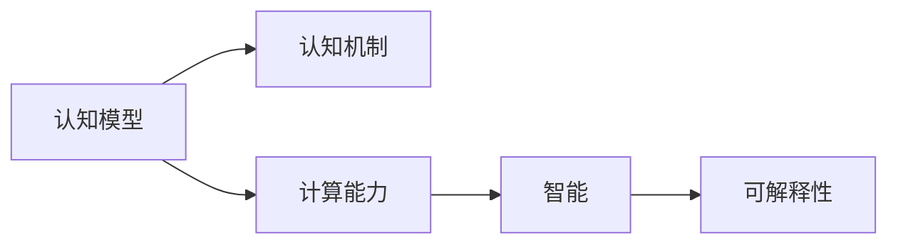

                 

# 探索人类思维的奥秘：人类计算的认知价值

## 1. 背景介绍

### 1.1 问题由来

随着人工智能技术的飞速发展，机器的计算能力正逐步逼近甚至超越人类的认知水平。这一现象引发了人们对于人类计算本质、认知机制以及计算与智能关系的深刻思考。通过对人类计算的深入探索，不仅有助于我们更好地理解和设计智能系统，也有助于揭示人类思维的奥秘。

### 1.2 问题核心关键点

人类计算的核心在于如何模拟和扩展人类的认知能力。具体而言，以下几点是研究人类计算时需要关注的重点：

- 认知模型的构建：如何建立能够模拟人类认知过程的计算模型？
- 计算能力的提升：如何提升计算系统的智能水平，使其具备类人推理、学习、决策等能力？
- 认知机制的探究：人类的认知机制是如何工作的？计算与智能之间存在何种关系？

通过解决这些问题，我们可以深入理解人类思维的本质，并推动人工智能技术的进一步发展。

## 2. 核心概念与联系

### 2.1 核心概念概述

为更好地理解人类计算的认知价值，本节将介绍几个关键概念及其相互联系：

- **认知模型**：模拟人类认知过程的计算模型，包括感知、记忆、推理、学习等环节。
- **认知机制**：人类认知的生物学和心理学基础，包括神经元活动、信息编码、记忆存储、认知加工等。
- **计算能力**：计算机或计算系统在特定任务上的处理能力，可以通过算法、硬件、数据等因素进行优化。
- **智能**：机器或系统具备的类人推理、决策、学习等高级认知能力。
- **可解释性**：计算系统输出结果的可解释性，即能否清晰地解释其决策依据。

这些概念之间存在着密切的联系和相互作用。认知模型是模拟人类认知过程的工具，而计算能力是实现智能的基础。智能的实现不仅依赖于强大的计算能力，还需要对认知机制的深入理解。可解释性则是为了确保计算系统的决策透明和可信。

### 2.2 核心概念原理和架构的 Mermaid 流程图(Mermaid 流程节点中不要有括号、逗号等特殊字符)


## 3. 核心算法原理 & 具体操作步骤

### 3.1 算法原理概述

人类计算的核心算法原理包括符号计算、计算图、深度学习等。这些算法不仅用于实现具体的计算任务，还体现了对人类认知机制的模拟。

- **符号计算**：基于符号表示的计算方法，模拟人类语言理解和推理过程。经典算法包括Prolog、Deductive Reasoning等。
- **计算图**：通过构建计算图描述计算过程，模拟人类大脑神经元的连接方式。
- **深度学习**：模拟人类视觉、听觉等感官的感知过程，通过多层次的神经网络实现复杂的非线性映射。

### 3.2 算法步骤详解

以下是实现人类计算的典型算法步骤：

1. **数据收集与预处理**：
   - 收集人类行为数据，如语言、图像、视频等。
   - 对数据进行清洗、标注、划分等预处理工作。

2. **模型构建与训练**：
   - 选择合适的计算模型（如神经网络、逻辑规则、贝叶斯网络等）。
   - 使用训练数据对模型进行参数优化。

3. **模型评估与测试**：
   - 使用测试数据评估模型性能，包括准确率、召回率、F1分数等。
   - 对模型进行调参和优化，提升性能。

4. **模型部署与应用**：
   - 将模型部署到实际应用系统中。
   - 根据应用场景进行模型优化，提升用户体验。

5. **持续学习与迭代**：
   - 不断收集新数据，对模型进行重新训练和优化。
   - 应用在线学习技术，实现模型动态更新。

### 3.3 算法优缺点

人类计算的算法具有以下优点：
- 高度灵活性：可以根据具体任务进行调整和优化。
- 高效性：通过自动化处理，大幅提升计算效率。
- 可扩展性：可以应用于多种数据类型和任务。

同时，这些算法也存在一些缺点：
- 数据依赖性强：需要大量高质量的数据进行训练。
- 复杂度较高：对于大规模、高复杂度的任务，计算需求较大。
- 模型可解释性不足：深度学习模型往往缺乏清晰的决策逻辑。

### 3.4 算法应用领域

人类计算的算法广泛应用于以下几个领域：

- **自然语言处理(NLP)**：用于机器翻译、问答、情感分析、文本分类等任务。
- **计算机视觉(CV)**：用于图像识别、目标检测、图像生成、图像分割等任务。
- **语音识别与生成**：用于语音识别、自动语音生成、语音合成等任务。
- **推荐系统**：用于个性化推荐、协同过滤、兴趣匹配等任务。
- **金融分析**：用于市场预测、风险评估、智能投顾等任务。
- **医疗诊断**：用于疾病诊断、影像分析、基因组学等任务。

## 4. 数学模型和公式 & 详细讲解 & 举例说明

### 4.1 数学模型构建

人类计算的数学模型构建通常涉及以下步骤：

1. **模型假设**：基于领域知识，构建合理的计算模型假设。
2. **数学表达**：使用数学公式表达模型中各变量的关系。
3. **算法设计**：设计具体的算法步骤，实现模型计算。

### 4.2 公式推导过程

以下是一个简单的线性回归模型的推导过程：

设输入特征为 $\mathbf{x} \in \mathbb{R}^n$，目标变量为 $y \in \mathbb{R}$。假设存在线性关系 $y = \mathbf{w}^T \mathbf{x} + b$，其中 $\mathbf{w} \in \mathbb{R}^n$ 为权重向量，$b \in \mathbb{R}$ 为偏置。

给定训练数据集 $\mathcal{D} = \{(\mathbf{x}_i, y_i)\}_{i=1}^m$，线性回归模型的最小二乘损失函数为：

$$
\mathcal{L}(\mathbf{w}, b) = \frac{1}{2m} \sum_{i=1}^m (\mathbf{w}^T \mathbf{x}_i + b - y_i)^2
$$

通过求解损失函数的极小值，可以得到最优权重向量 $\mathbf{w}^*$ 和偏置 $b^*$：

$$
\mathbf{w}^* = \arg\min_{\mathbf{w}} \frac{1}{2m} \sum_{i=1}^m (\mathbf{w}^T \mathbf{x}_i + b - y_i)^2
$$

$$
b^* = \arg\min_{b} \frac{1}{2m} \sum_{i=1}^m (\mathbf{w}^* \mathbf{x}_i + b - y_i)^2
$$

### 4.3 案例分析与讲解

以一个简单的图像分类问题为例，使用卷积神经网络(CNN)实现图像识别。

输入为 $n \times n$ 的图像矩阵 $\mathbf{I} \in \mathbb{R}^{n \times n}$，输出为 $k$ 类别的概率向量 $\mathbf{p} \in \mathbb{R}^k$。

首先，通过卷积层、池化层等构建卷积神经网络模型：

$$
\mathbf{I} \rightarrow \mathbf{F}_1 \rightarrow \mathbf{P}_1 \rightarrow \ldots \rightarrow \mathbf{F}_L \rightarrow \mathbf{P}_L
$$

其中 $\mathbf{F}_l$ 表示卷积层，$\mathbf{P}_l$ 表示池化层。

然后，使用softmax函数将输出向量转化为概率分布：

$$
\mathbf{p} = \text{softmax}(\mathbf{P}_L)
$$

最终，通过交叉熵损失函数 $\mathcal{L}(\mathbf{w}) = -\frac{1}{m} \sum_{i=1}^m y_i \log \mathbf{p}_i$ 进行训练优化，得到最优权重向量 $\mathbf{w}^*$。

## 5. 项目实践：代码实例和详细解释说明

### 5.1 开发环境搭建

以下是使用Python进行TensorFlow开发的开发环境配置流程：

1. 安装Anaconda：从官网下载并安装Anaconda，用于创建独立的Python环境。
2. 创建并激活虚拟环境：
   ```bash
   conda create -n tf-env python=3.8 
   conda activate tf-env
   ```
3. 安装TensorFlow：
   ```bash
   conda install tensorflow
   ```
4. 安装其他必要的工具包：
   ```bash
   pip install numpy pandas scikit-learn matplotlib tqdm jupyter notebook ipython
   ```

完成上述步骤后，即可在`tf-env`环境中开始项目实践。

### 5.2 源代码详细实现

以下是一个简单的图像分类项目的实现，使用TensorFlow实现卷积神经网络。

首先，定义CNN模型的层结构：

```python
import tensorflow as tf

def create_cnn_model():
    model = tf.keras.Sequential([
        tf.keras.layers.Conv2D(32, (3, 3), activation='relu', input_shape=(28, 28, 1)),
        tf.keras.layers.MaxPooling2D((2, 2)),
        tf.keras.layers.Conv2D(64, (3, 3), activation='relu'),
        tf.keras.layers.MaxPooling2D((2, 2)),
        tf.keras.layers.Flatten(),
        tf.keras.layers.Dense(10, activation='softmax')
    ])
    return model
```

然后，加载和预处理数据集：

```python
(train_images, train_labels), (test_images, test_labels) = tf.keras.datasets.mnist.load_data()
train_images = train_images.reshape((60000, 28, 28, 1)) / 255.0
test_images = test_images.reshape((10000, 28, 28, 1)) / 255.0
```

接着，定义损失函数和优化器：

```python
model = create_cnn_model()

loss_fn = tf.keras.losses.SparseCategoricalCrossentropy(from_logits=True)
optimizer = tf.keras.optimizers.Adam()
```

最后，训练模型并进行预测：

```python
@tf.function
def train_step(images, labels):
    with tf.GradientTape() as tape:
        logits = model(images, training=True)
        loss_value = loss_fn(labels, logits)
    grads = tape.gradient(loss_value, model.trainable_variables)
    optimizer.apply_gradients(zip(grads, model.trainable_variables))
    return loss_value

@tf.function
def predict_step(images):
    logits = model(images, training=False)
    return tf.argmax(logits, axis=1)

batch_size = 32
num_epochs = 10

for epoch in range(num_epochs):
    for batch in tf.data.Dataset.from_tensor_slices((train_images, train_labels)).batch(batch_size):
        loss_value = train_step(*batch)
        if batch_index % 100 == 0:
            print(f"Epoch {epoch+1}, Batch {batch_index}, Loss: {loss_value.numpy()}")
    
test_loss = train_step(test_images, test_labels)
print(f"Test Loss: {test_loss.numpy()}")
```

### 5.3 代码解读与分析

让我们再详细解读一下关键代码的实现细节：

**create_cnn_model函数**：
- 定义了一个简单的卷积神经网络模型，包含卷积层、池化层和全连接层。

**数据预处理**：
- 将训练和测试数据转换为模型期望的输入格式。
- 对像素值进行归一化，使得数据更易于训练。

**loss_fn和optimizer定义**：
- 使用交叉熵损失函数和Adam优化器进行模型训练。

**train_step和predict_step函数**：
- 定义了训练和预测的具体步骤，包括前向传播、损失计算、梯度更新等。

**训练循环**：
- 在每个epoch内，对数据集进行批量迭代，进行模型训练，并打印损失值。

**测试预测**：
- 在测试集上评估模型性能，输出预测结果。

以上代码实现了简单的图像分类任务，展示了TensorFlow在模型构建、数据处理、训练预测等方面的应用。通过类似的技术，可以实现更加复杂的计算任务。

## 6. 实际应用场景

### 6.1 医疗诊断

在医疗诊断领域，人类计算的算法可以用于辅助医生进行疾病诊断和治疗决策。例如，基于机器学习的影像分析技术，可以自动识别X光、CT等医学影像中的病灶，提供初步诊断结果。

具体实现时，可以使用卷积神经网络对医学影像进行特征提取，再通过分类器对不同疾病进行分类。例如，针对乳腺癌的诊断，可以通过训练一个包含多个卷积层和全连接层的CNN模型，对乳腺X光影像进行分类。模型通过学习大量带有标注的影像数据，可以逐步提高诊断的准确性。

### 6.2 智能交通

在智能交通领域，人类计算的算法可以用于交通流预测、路况监控等任务。例如，基于机器学习的时间序列预测技术，可以预测未来交通流量，帮助交通管理中心优化交通控制。

具体实现时，可以使用RNN或LSTM等时间序列模型对交通流量数据进行建模。模型通过学习历史交通数据，预测未来一段时间内的交通流量，并生成相应的交通控制策略。例如，在预测到某路段交通流量显著增加时，交通管理中心可以提前调整红绿灯周期，缓解交通拥堵。

### 6.3 金融分析

在金融分析领域，人类计算的算法可以用于市场预测、风险评估等任务。例如，基于机器学习的交易策略预测技术，可以预测股票价格趋势，帮助投资者制定交易策略。

具体实现时，可以使用神经网络对历史交易数据进行建模。模型通过学习市场数据中的各种特征，预测未来的股票价格变化趋势，并生成相应的交易信号。例如，在预测到某只股票价格将出现上涨趋势时，投资者可以及时买入股票，获得收益。

### 6.4 未来应用展望

未来，随着计算能力的进一步提升和数据量的不断增加，人类计算的应用将更加广泛。

- **智能制造**：在制造业中，人类计算可以用于生产过程优化、设备维护预测等任务。例如，基于机器学习的质量检测技术，可以自动识别产品缺陷，提高产品质量。
- **个性化教育**：在教育领域，人类计算可以用于个性化学习推荐、学习效果评估等任务。例如，基于机器学习的学习行为分析技术，可以为学生推荐适合的学习资源，提高学习效果。
- **环境保护**：在环境保护领域，人类计算可以用于气候变化预测、污染源追踪等任务。例如，基于机器学习的气候模型，可以预测未来的气候变化趋势，为环境保护提供决策支持。

## 7. 工具和资源推荐

### 7.1 学习资源推荐

为了帮助开发者系统掌握人类计算的理论基础和实践技巧，这里推荐一些优质的学习资源：

1. **《深度学习》课程**：斯坦福大学开设的深度学习课程，详细讲解了深度学习的基本概念和算法原理。
2. **《TensorFlow官方文档》**：TensorFlow官方提供的详细文档，包括模型构建、数据处理、训练优化等方面的指南。
3. **《TensorFlow实战》书籍**：介绍了TensorFlow在NLP、CV等领域的典型应用案例，适合实战学习。
4. **Kaggle竞赛平台**：提供了大量的数据集和比赛项目，适合锻炼模型构建和调优能力。
5. **arXiv论文库**：最新的人工智能研究成果发布平台，适合跟踪领域前沿进展。

### 7.2 开发工具推荐

高效的开发离不开优秀的工具支持。以下是几款用于人类计算开发的常用工具：

1. **TensorFlow**：由Google主导开发的深度学习框架，支持大规模分布式计算。
2. **PyTorch**：由Facebook开发的高性能深度学习框架，支持动态图和静态图两种计算方式。
3. **Scikit-learn**：开源机器学习库，提供了多种常见的机器学习算法和工具函数。
4. **Keras**：高级神经网络API，简化了深度学习的模型构建和训练过程。
5. **MXNet**：高效分布式深度学习框架，支持多种编程语言和硬件平台。

### 7.3 相关论文推荐

人类计算的研究源于学界的持续探索。以下是几篇奠基性的相关论文，推荐阅读：

1. **《卷积神经网络》**：Yann LeCun等提出的卷积神经网络，奠定了深度学习在图像处理领域的基础。
2. **《深度学习》**：Ian Goodfellow等编写的深度学习经典教材，详细讲解了深度学习的基本概念和算法。
3. **《机器学习》**：Tom Mitchell编写的机器学习教材，介绍了机器学习的基本框架和方法。
4. **《计算智能》**：Dawkins等编写的计算智能经典教材，介绍了计算智能的基本概念和算法。
5. **《神经网络与深度学习》**：Michael Nielsen编写的深度学习入门教材，适合初学者理解深度学习的基本原理。

这些论文代表了大计算领域的理论进展，对深入理解人类计算提供了重要参考。

## 8. 总结：未来发展趋势与挑战

### 8.1 研究成果总结

本文对人类计算的认知价值进行了全面系统的介绍。通过系统梳理人类计算的核心概念、算法原理、实际操作和实际应用，展示了人类计算在自然语言处理、计算机视觉、医疗诊断等领域的巨大潜力。

### 8.2 未来发展趋势

未来，人类计算技术将呈现以下几个发展趋势：

1. **计算能力的提升**：随着硬件设备的不断发展，计算能力将进一步提升，能够处理更加复杂、高维度的数据。
2. **跨领域应用的拓展**：人类计算技术将逐步拓展到更多的领域，如智能制造、个性化教育等。
3. **智能化水平的提升**：基于深度学习的智能系统将逐步实现更加智能化的任务处理，如自动驾驶、机器人控制等。
4. **人机协同的深化**：人类计算技术将与人类认知系统深度融合，实现更加高效、智能的人机协同。

### 8.3 面临的挑战

尽管人类计算技术已经取得了显著进展，但仍面临诸多挑战：

1. **数据质量和数量**：高质量的数据是训练高效计算模型的关键，但获取大规模、高质量的数据仍然是一个难题。
2. **计算资源的需求**：计算能力的提升需要强大的硬件支持，计算资源的消耗仍然较高。
3. **模型可解释性**：深度学习模型的黑盒性质使其难以解释其决策过程，这对高风险领域的应用是一个重大挑战。
4. **安全性问题**：人类计算技术在处理敏感数据时可能面临数据泄露、隐私侵犯等安全问题。
5. **伦理道德问题**：计算技术的应用必须遵循伦理道德原则，避免对人类产生负面影响。

### 8.4 研究展望

未来的研究需要在以下几个方面寻求新的突破：

1. **多模态计算**：将不同模态的数据（如文本、图像、语音等）融合到一个计算模型中，提升计算系统的综合能力。
2. **跨领域知识整合**：将不同领域的知识（如知识图谱、规则库等）与计算模型进行融合，提升模型的普适性和鲁棒性。
3. **可解释性增强**：开发更加可解释的计算模型，增强模型的透明度和可信度。
4. **安全性和隐私保护**：开发安全性更高、隐私保护更强的计算模型，保障数据安全和个人隐私。
5. **伦理道德规范**：制定明确的伦理道德规范，确保计算技术的应用符合人类价值观和伦理道德。

## 9. 附录：常见问题与解答

**Q1：人类计算与人工智能有什么区别？**

A: 人类计算是一种模拟人类认知过程的计算技术，强调对人类认知机制的理解和模仿；而人工智能则更加侧重于实现机器的智能行为，关注机器如何通过学习、推理、决策等手段实现任务。

**Q2：如何选择合适的机器学习算法？**

A: 选择合适的机器学习算法需要考虑以下因素：
1. 任务类型：根据任务类型选择合适的算法，如分类、回归、聚类等。
2. 数据特点：根据数据的特点选择合适的算法，如稀疏数据、高维数据等。
3. 计算资源：根据计算资源选择适合的算法，如分布式计算、GPU加速等。
4. 模型可解释性：根据模型可解释性的需求选择合适的算法，如决策树、逻辑回归等。

**Q3：数据预处理有哪些步骤？**

A: 数据预处理通常包括以下步骤：
1. 数据清洗：去除噪声、缺失值等。
2. 数据转换：如归一化、标准化、独热编码等。
3. 特征选择：选择对任务有预测能力的特征。
4. 数据增强：通过变换、扩充数据集来提升模型性能。

**Q4：深度学习中的过拟合和欠拟合问题如何处理？**

A: 过拟合和欠拟合是深度学习中常见的问题，处理方式包括：
1. 过拟合：通过正则化、Dropout、早停等方法减少过拟合。
2. 欠拟合：通过增加模型复杂度、增加训练数据等方法减少欠拟合。

**Q5：人类计算有哪些潜在应用？**

A: 人类计算在多个领域都有潜在应用，包括：
1. 自然语言处理：机器翻译、情感分析、文本分类等。
2. 计算机视觉：图像识别、目标检测、图像生成等。
3. 智能交通：交通流量预测、路况监控等。
4. 医疗诊断：影像分析、疾病预测等。
5. 金融分析：市场预测、风险评估等。

总之，人类计算技术具有广泛的应用前景，将在未来推动各领域的智能化发展。

