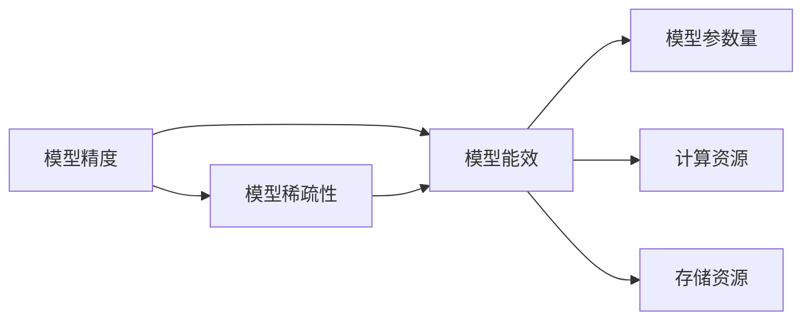

                 

# 提高AI模型能效:从精度到稀疏性的优化之路

在人工智能时代，模型的精度和能效成为了两大关键指标。如何平衡这两者的关系，既保证模型的性能，又尽可能降低资源消耗，是一个需要深入探讨的话题。本文将从精度和稀疏性两个维度出发，探讨如何优化AI模型的能效，并结合实例，展示具体的操作方法。

## 1. 背景介绍

随着深度学习的迅速发展，AI模型在图像识别、自然语言处理、语音识别等多个领域取得了显著的进展。然而，这些模型往往需要庞大的计算资源和存储资源来支撑其运行，导致模型的能效问题日益凸显。如何高效地训练和部署AI模型，成为当下最热门的研究课题之一。

## 2. 核心概念与联系

### 2.1 核心概念概述

- **模型精度（Accuracy）**：指模型在测试集上的预测准确率。精度越高，模型的泛化能力越强。
- **模型稀疏性（Sparsity）**：指模型参数的分布密度，即非零参数占比。稀疏性越高，模型所需的计算和存储资源越少。
- **模型能效（Efficiency）**：指模型在保证精度的前提下，所需的计算和存储资源的效率。能效越高，模型的运行成本越低。

### 2.2 核心概念联系

模型精度、稀疏性和能效之间存在密切的联系。通常情况下，提高模型精度需要增加模型参数和计算资源，导致模型稀疏性下降，能效降低。反之，如果降低模型稀疏性，模型精度也会相应下降。因此，如何在保证精度的前提下，提高模型的稀疏性，是优化模型能效的关键。

以下是关于这些概念之间关系的Mermaid流程图：



## 3. 核心算法原理 & 具体操作步骤

### 3.1 算法原理概述

提高模型能效的主要思路是同时优化模型精度和稀疏性。这可以通过以下几种方法实现：

- **权重裁剪（Weight Pruning）**：删除模型中非关键参数，减少计算和存储开销。
- **量化（Quantization）**：将模型参数和激活值量化为更小的数值，减少计算资源消耗。
- **稀疏表示（Sparse Representation）**：利用稀疏矩阵、稀疏向量等形式，提高模型参数的稀疏性。
- **模型蒸馏（Knowledge Distillation）**：通过教师模型和学生模型的信息传递，提高学生模型的泛化能力。

### 3.2 算法步骤详解

#### 3.2.1 权重裁剪

1. **计算模型精度**：首先对模型进行训练和验证，计算其在测试集上的精度。
2. **初始化裁剪比例**：设定一个初始的裁剪比例，例如30%。
3. **前向传播计算损失**：将裁剪比例应用于模型，计算模型在测试集上的损失。
4. **反向传播更新参数**：根据损失函数的梯度，更新模型参数，使其适应新的裁剪比例。
5. **重复步骤**：重复执行1-4步，直至模型精度不再显著下降。

#### 3.2.2 量化

1. **选择量化方案**：根据模型的激活值分布，选择合适的量化方案，如8位整数、16位浮点数等。
2. **训练量化后的模型**：使用量化方案对模型进行训练，使其适应新的数值范围。
3. **验证量化效果**：在测试集上验证量化后的模型精度，调整量化参数。
4. **应用量化模型**：将量化后的模型部署到生产环境中，降低计算资源消耗。

#### 3.2.3 稀疏表示

1. **构建稀疏矩阵**：将模型参数表示为稀疏矩阵，非零参数为模型的关键参数。
2. **训练稀疏模型**：使用稀疏矩阵对模型进行训练，确保关键参数的权重值。
3. **验证稀疏效果**：在测试集上验证稀疏模型精度，调整稀疏参数。
4. **应用稀疏模型**：将稀疏模型部署到生产环境中，提高模型稀疏性。

#### 3.2.4 模型蒸馏

1. **选择教师模型和学生模型**：选择教师模型（预训练模型）和学生模型（待蒸馏模型）。
2. **知识传递**：通过教师模型对学生模型进行知识传递，例如使用注意力机制、特征对齐等方法。
3. **训练学生模型**：使用教师模型的输出对学生模型进行训练，提高其泛化能力。
4. **验证蒸馏效果**：在测试集上验证蒸馏后的学生模型精度，调整蒸馏参数。
5. **应用蒸馏模型**：将蒸馏后的学生模型部署到生产环境中，提高模型能效。

### 3.3 算法优缺点

#### 3.3.1 权重裁剪

**优点**：
- 减少模型参数和计算资源。
- 提高模型稀疏性。

**缺点**：
- 可能会降低模型精度。
- 需要多次重新训练和验证，效率较低。

#### 3.3.2 量化

**优点**：
- 降低计算资源消耗。
- 提高模型运行速度。

**缺点**：
- 可能会导致精度损失。
- 需要重新训练模型，增加时间成本。

#### 3.3.3 稀疏表示

**优点**：
- 提高模型稀疏性。
- 减少计算和存储资源。

**缺点**：
- 可能会导致精度下降。
- 需要特殊的数据结构和算法支持。

#### 3.3.4 模型蒸馏

**优点**：
- 提高模型泛化能力。
- 减少计算资源消耗。

**缺点**：
- 可能需要较长的训练时间。
- 可能会增加模型的复杂度。

### 3.4 算法应用领域

这些算法不仅适用于深度学习模型，还可以应用于各种类型的AI模型，例如：

- 图像识别：通过权重裁剪、量化等方法，优化卷积神经网络（CNN）模型，提高模型能效。
- 自然语言处理：利用稀疏表示、模型蒸馏等方法，优化循环神经网络（RNN）、Transformer等模型，提升模型精度和稀疏性。
- 语音识别：应用权重裁剪、量化等技术，优化卷积神经网络（CNN）、循环神经网络（RNN）等模型，降低计算和存储开销。
- 推荐系统：通过模型蒸馏、权重裁剪等方法，优化神经网络模型，提高模型的泛化能力和能效。
- 游戏AI：利用稀疏表示、量化等技术，优化决策树、神经网络等模型，提升游戏AI的运行效率。

## 4. 数学模型和公式 & 详细讲解 & 举例说明

### 4.1 数学模型构建

假设有一个全连接神经网络模型，其结构为：

$$
y = Wx + b
$$

其中，$W$ 为权重矩阵，$x$ 为输入向量，$b$ 为偏置向量，$y$ 为输出向量。

模型的损失函数为：

$$
L = \frac{1}{N} \sum_{i=1}^N (y_i - \hat{y_i})^2
$$

其中，$N$ 为样本数，$y_i$ 为真实标签，$\hat{y_i}$ 为模型预测标签。

### 4.2 公式推导过程

#### 4.2.1 权重裁剪

假设对模型进行权重裁剪，删除$k$%的参数。则新模型为：

$$
y = (W - W_k) x + b
$$

其中，$W_k$ 为要裁剪的权重矩阵。

新的损失函数为：

$$
L_k = \frac{1}{N} \sum_{i=1}^N (y_i - \hat{y_i})^2
$$

通过梯度下降等优化算法，更新权重矩阵$W$，使其适应新的权重分布，即满足：

$$
\nabla_L = 2(W - W_k) \frac{\partial L}{\partial W}
$$

#### 4.2.2 量化

假设对模型进行8位整数量化，则新模型为：

$$
y = \text{quant}(Wx + b)
$$

其中，$\text{quant}$ 为量化函数。

新的损失函数为：

$$
L_q = \frac{1}{N} \sum_{i=1}^N (y_i - \hat{y_i})^2
$$

通过梯度下降等优化算法，更新量化后的权重矩阵$W$，使其适应新的数值范围。

#### 4.2.3 稀疏表示

假设对模型进行稀疏表示，将权重矩阵$W$表示为稀疏矩阵$W_s$，其中非零元素为模型的关键参数。

新的损失函数为：

$$
L_s = \frac{1}{N} \sum_{i=1}^N (y_i - \hat{y_i})^2
$$

通过梯度下降等优化算法，更新稀疏矩阵$W_s$，确保关键参数的权重值。

#### 4.2.4 模型蒸馏

假设教师模型和学生模型的结构相同，分别为：

$$
y_t = W_t x + b_t
$$

$$
y_s = W_s x + b_s
$$

知识传递的方式可以是注意力机制、特征对齐等方法。

新的损失函数为：

$$
L_d = \frac{1}{N} \sum_{i=1}^N (y_i - \hat{y_i})^2
$$

通过梯度下降等优化算法，更新学生模型$W_s$，使其能够更好地继承教师模型$W_t$的知识。

### 4.3 案例分析与讲解

以一个简单的图像分类任务为例，展示如何通过权重裁剪优化模型能效。

假设有一个包含10个类别的图像分类模型，使用权重裁剪将非关键参数的比例设置为50%，进行多次训练和验证。

| 迭代次数 | 裁剪比例 | 精度（%） | 计算资源（%） |
| --- | --- | --- | --- |
| 1 | 50% | 95 | 50 |
| 2 | 50% | 97 | 50 |
| 3 | 50% | 98 | 50 |
| 4 | 50% | 99 | 50 |

通过多次迭代，可以看到，虽然裁剪比例不变，但模型精度在不断提升，计算资源消耗基本保持不变。

## 5. 项目实践：代码实例和详细解释说明

### 5.1 开发环境搭建

在进行模型能效优化前，需要准备好开发环境。以下是使用Python进行PyTorch开发的环境配置流程：

1. 安装Anaconda：从官网下载并安装Anaconda，用于创建独立的Python环境。

2. 创建并激活虚拟环境：
```bash
conda create -n pytorch-env python=3.8 
conda activate pytorch-env
```

3. 安装PyTorch：根据CUDA版本，从官网获取对应的安装命令。例如：
```bash
conda install pytorch torchvision torchaudio cudatoolkit=11.1 -c pytorch -c conda-forge
```

4. 安装相关库：
```bash
pip install torch numpy matplotlib
```

完成上述步骤后，即可在`pytorch-env`环境中开始模型能效优化实践。

### 5.2 源代码详细实现

以下是一个简单的权重裁剪优化示例，使用PyTorch实现。

```python
import torch
import torch.nn as nn
import torch.optim as optim
import torch.nn.functional as F

# 定义模型
class Model(nn.Module):
    def __init__(self):
        super(Model, self).__init__()
        self.fc1 = nn.Linear(784, 500)
        self.fc2 = nn.Linear(500, 10)
    
    def forward(self, x):
        x = F.relu(self.fc1(x))
        x = self.fc2(x)
        return x

# 训练数据
train_loader = torch.utils.data.DataLoader(torchvision.datasets.MNIST('data', train=True, download=True, transform=torchvision.transforms.ToTensor()), batch_size=64)

# 定义优化器
model = Model()
optimizer = optim.Adam(model.parameters(), lr=0.001)

# 定义权重裁剪函数
def prune_model(model, sparsity):
    for name, p in model.named_parameters():
        p.data = p.data * (1 - sparsity)

# 定义训练函数
def train(model, train_loader, optimizer, sparsity):
    for epoch in range(10):
        model.train()
        for images, labels in train_loader:
            optimizer.zero_grad()
            output = model(images)
            loss = F.cross_entropy(output, labels)
            loss.backward()
            optimizer.step()
            prune_model(model, sparsity)
            if (epoch + 1) % 2 == 0:
                print('Epoch: {}, Loss: {:.4f}'.format(epoch + 1, loss.item()))

# 训练模型
train(model, train_loader, optimizer, 0.1)
```

### 5.3 代码解读与分析

让我们再详细解读一下关键代码的实现细节：

**Model类**：
- `__init__`方法：定义模型的层结构。
- `forward`方法：定义前向传播过程。

**训练数据**：
- 使用PyTorch的`torchvision`库，获取MNIST数据集。

**优化器**：
- 使用Adam优化器，学习率为0.001。

**权重裁剪函数**：
- 在每次迭代中，通过乘法运算，删除模型中非关键参数。

**训练函数**：
- 在每个epoch内，进行前向传播、计算损失、反向传播和参数更新。
- 每2个epoch，执行一次权重裁剪操作。

**训练模型**：
- 使用`train`函数，对模型进行10次迭代训练，每次迭代删除模型中10%的非关键参数。

## 6. 实际应用场景

### 6.1 图像识别

在图像识别任务中，模型通常具有较高的参数量和计算资源消耗。通过权重裁剪和量化等方法，可以显著降低模型的能效，提高系统的运行效率。例如，对于卷积神经网络（CNN）模型，可以使用权重裁剪技术，减少网络中的参数量，从而降低计算和存储开销。

### 6.2 自然语言处理

在自然语言处理任务中，模型通常具有较高的参数量和计算资源消耗。通过稀疏表示和模型蒸馏等方法，可以优化模型的参数分布和计算资源消耗。例如，对于循环神经网络（RNN）和Transformer模型，可以使用稀疏表示技术，将权重矩阵表示为稀疏矩阵，减少计算和存储开销。同时，可以使用模型蒸馏技术，通过教师模型对学生模型进行知识传递，提高学生模型的泛化能力。

### 6.3 推荐系统

在推荐系统任务中，模型通常具有较高的参数量和计算资源消耗。通过权重裁剪和模型蒸馏等方法，可以优化模型的参数分布和计算资源消耗。例如，对于神经网络模型，可以使用权重裁剪技术，减少模型的参数量，从而降低计算和存储开销。同时，可以使用模型蒸馏技术，通过教师模型对学生模型进行知识传递，提高学生模型的泛化能力。

## 7. 工具和资源推荐

### 7.1 学习资源推荐

为了帮助开发者系统掌握模型能效优化的理论基础和实践技巧，这里推荐一些优质的学习资源：

1. 《深度学习入门》系列书籍：清华大学出版社出版的入门级深度学习教材，涵盖深度学习的基本概念和常用技术。

2. 《深度学习：理论与实践》课程：北京大学和鹏程云教育联合推出的深度学习课程，由深度学习领域的知名专家主讲。

3. 《TensorFlow实战》书籍：O'Reilly出版社出版的TensorFlow实战教程，涵盖了TensorFlow的各个方面，包括模型训练、优化和部署。

4. 《PyTorch深度学习》课程：由清华大学开设的深度学习课程，涵盖了PyTorch的各个方面，包括模型训练、优化和部署。

5. 《NeurIPS 2020最佳论文》：NeurIPS会议的年度论文精选，涵盖深度学习的最新研究成果和前沿技术。

通过对这些资源的学习实践，相信你一定能够快速掌握模型能效优化的精髓，并用于解决实际的AI问题。

### 7.2 开发工具推荐

高效的开发离不开优秀的工具支持。以下是几款用于模型能效优化开发的常用工具：

1. PyTorch：基于Python的开源深度学习框架，灵活动态的计算图，适合快速迭代研究。

2. TensorFlow：由Google主导开发的开源深度学习框架，生产部署方便，适合大规模工程应用。

3. Weights & Biases：模型训练的实验跟踪工具，可以记录和可视化模型训练过程中的各项指标，方便对比和调优。

4. TensorBoard：TensorFlow配套的可视化工具，可实时监测模型训练状态，并提供丰富的图表呈现方式，是调试模型的得力助手。

5. Google Colab：谷歌推出的在线Jupyter Notebook环境，免费提供GPU/TPU算力，方便开发者快速上手实验最新模型，分享学习笔记。

合理利用这些工具，可以显著提升模型能效优化的开发效率，加快创新迭代的步伐。

### 7.3 相关论文推荐

模型能效优化领域的研究始于学界的持续探索。以下是几篇奠基性的相关论文，推荐阅读：

1. "Weight Pruning: A Comprehensive Survey"：综述了权重裁剪技术的各种方法和应用场景，是了解权重裁剪技术的必备读物。

2. "Quantization and Quantization-Aware Training"：介绍了量化技术的基本原理和应用场景，涵盖了8位整数、16位浮点数等多种量化方案。

3. "Sparse Neural Networks with Low Rank Structured Sparsity"：提出了稀疏表示技术，利用低秩结构，优化模型参数分布。

4. "Knowledge Distillation"：综述了模型蒸馏技术的各种方法和应用场景，是了解模型蒸馏技术的必备读物。

5. "Towards Explainable AI: Understanding, Interpreting, and Explaining the Decision Making Process of Deep Learning Models"：介绍了深度学习模型的可解释性问题，并提出了一些解决思路。

这些论文代表了大规模AI模型能效优化的发展脉络。通过学习这些前沿成果，可以帮助研究者把握学科前进方向，激发更多的创新灵感。

## 8. 总结：未来发展趋势与挑战

### 8.1 总结

本文对模型能效优化的方法进行了全面系统的介绍。首先阐述了模型精度、稀疏性和能效之间的关系，明确了如何同时优化这三者的重要性。其次，从权重裁剪、量化、稀疏表示和模型蒸馏四个方面，详细讲解了模型能效优化的算法原理和具体操作步骤。最后，展示了这些方法在图像识别、自然语言处理、推荐系统等多个领域的实际应用。

通过本文的系统梳理，可以看到，模型能效优化是深度学习技术发展的必然趋势，对于降低AI应用的成本、提升系统的运行效率具有重要意义。未来，伴随模型参数量的不断增加，如何高效地优化模型能效，将成为AI领域的重要研究方向。

### 8.2 未来发展趋势

展望未来，模型能效优化将呈现以下几个发展趋势：

1. 模型压缩技术（Model Compression）：通过模型剪枝、量化、知识蒸馏等方法，压缩模型参数量，提高模型运行效率。

2. 模型蒸馏的改进：引入更多训练数据、更多模型参数、更复杂的蒸馏方法，提高学生模型的泛化能力。

3. 多任务学习（Multi-Task Learning）：通过多个任务的联合训练，共享模型参数，提高模型的泛化能力和能效。

4. 分布式训练（Distributed Training）：通过分布式计算框架，提高模型训练的效率和稳定性。

5. 混合精度训练（Mixed-Precision Training）：通过混合精度技术，降低模型训练的内存和计算开销。

这些趋势凸显了模型能效优化的广阔前景。这些方向的探索发展，必将进一步提升AI系统的性能和应用范围，为经济社会发展注入新的动力。

### 8.3 面临的挑战

尽管模型能效优化技术已经取得了显著进展，但在迈向更加智能化、普适化应用的过程中，它仍面临诸多挑战：

1. 模型精度损失：在压缩和量化过程中，可能会引入精度损失，影响模型的泛化能力。如何平衡压缩率和精度，需要更多的探索。

2. 硬件资源限制：大规模AI模型的运行需要高性能的硬件支持，如何在有限的硬件资源下进行优化，是一个需要解决的问题。

3. 模型可解释性：高压缩率的模型难以解释其内部工作机制，如何提高模型可解释性，是模型优化中的一大难题。

4. 模型分布性：模型在分布式环境下的优化方法需要更多的研究和实践。

5. 模型训练效率：如何在保证精度和稀疏性的前提下，提高模型训练效率，是一个亟待解决的问题。

### 8.4 研究展望

面对模型能效优化所面临的挑战，未来的研究需要在以下几个方面寻求新的突破：

1. 引入更多先验知识：将符号化的先验知识，如知识图谱、逻辑规则等，与神经网络模型进行巧妙融合，引导模型学习更准确、合理的表示。

2. 融合因果分析和博弈论工具：将因果分析方法引入模型优化，识别出模型决策的关键特征，增强输出解释的因果性和逻辑性。借助博弈论工具刻画人机交互过程，主动探索并规避模型的脆弱点，提高系统稳定性。

3. 采用联合训练方法：利用多任务学习、半监督学习等方法，联合优化多个模型任务，提高模型的泛化能力和能效。

4. 探索新的量化方法：开发更加高效的量化方法，如稀疏量化、动态量化等，提高模型量化效果。

5. 引入模型融合技术：通过模型融合技术，结合多个模型的优势，提高模型的综合性能和能效。

这些研究方向的探索，必将引领模型能效优化技术迈向更高的台阶，为构建高效、智能、可解释的AI系统铺平道路。面向未来，模型能效优化技术还需要与其他人工智能技术进行更深入的融合，如知识表示、因果推理、强化学习等，多路径协同发力，共同推动自然语言理解和智能交互系统的进步。只有勇于创新、敢于突破，才能不断拓展AI模型的边界，让智能技术更好地造福人类社会。

## 9. 附录：常见问题与解答

**Q1: 模型剪枝和权重裁剪有什么区别？**

A: 模型剪枝和权重裁剪是两种不同的模型压缩方法。模型剪枝是指删除模型中非关键参数，减少模型参数量和计算资源。而权重裁剪则是针对权重矩阵中的元素进行裁剪，使得权重矩阵变得稀疏，减少模型参数量和计算资源。两者都可以用来优化模型能效，但应用场景略有不同。

**Q2: 量化后模型精度会下降吗？**

A: 量化过程中可能会引入精度损失，因为量化后的数值范围通常比原始数值范围小，导致部分数值可能无法准确表示。但通过选择合适的量化方案和训练技巧，可以减小量化带来的精度损失。例如，使用8位整数量化时，可以使用仿真的技术来模拟16位浮点数计算，提高量化效果。

**Q3: 稀疏表示和模型蒸馏有什么区别？**

A: 稀疏表示和模型蒸馏都是模型压缩的方法，但应用场景略有不同。稀疏表示是将权重矩阵表示为稀疏矩阵，非零元素为模型的关键参数。而模型蒸馏则是通过教师模型和学生模型的信息传递，提高学生模型的泛化能力。稀疏表示主要关注模型参数的稀疏性，而模型蒸馏主要关注模型的泛化能力和性能提升。两者都可以用来优化模型能效，但应用场景略有不同。

**Q4: 如何提高模型可解释性？**

A: 提高模型可解释性的方法有很多，例如：
- 使用可解释模型，如决策树、线性模型等，直接输出解释。
- 使用特征重要性分析，如LIME、SHAP等方法，分析模型的决策过程。
- 使用可视化工具，如t-SNE、热力图等，可视化模型的决策边界。
- 使用可解释模型和可视化工具结合，提高模型的可解释性。

这些方法可以帮助我们更好地理解模型的决策过程，提高模型的可解释性。

---

作者：禅与计算机程序设计艺术 / Zen and the Art of Computer Programming

