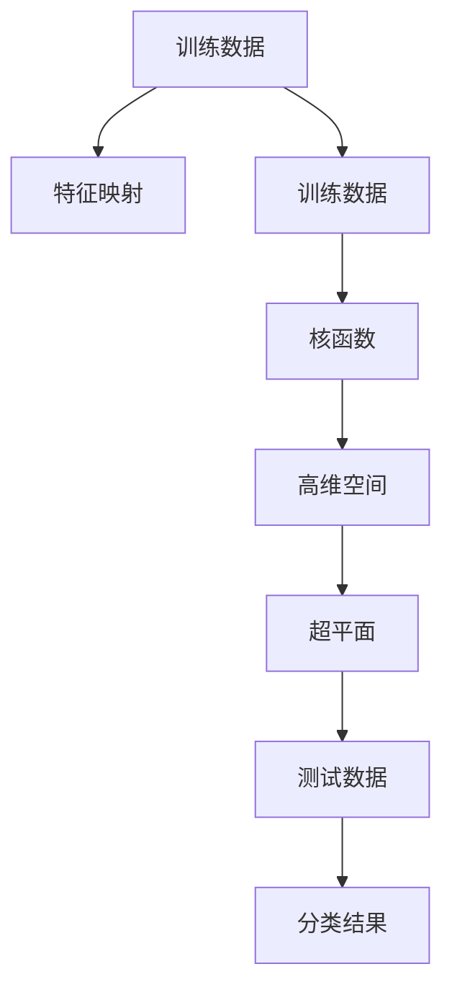

                 

# 支持向量机 (Support Vector Machine)

## 1. 背景介绍

### 1.1 问题由来
支持向量机（Support Vector Machine, SVM）是一种经典的机器学习算法，广泛应用于分类和回归任务。其基于统计学习理论，通过寻找最优超平面，实现样本的线性或非线性分割，从而达到分类或回归的目标。

支持向量机算法诞生于20世纪90年代，由Vapnik等人提出，并迅速在学术界和工业界得到广泛应用。其在图像识别、自然语言处理、生物信息学等领域表现出色，并成为许多机器学习工具库（如scikit-learn）中不可或缺的一部分。

### 1.2 问题核心关键点
SVM算法通过将数据映射到高维空间，寻找能够最大化间隔（Margin）的超平面，实现样本的线性分割。对于非线性问题，可以通过核函数（Kernel）将其映射到高维空间，进一步求解最优超平面。SVM的核心思想是利用有限的训练样本，在模型复杂性和泛化能力之间找到平衡点，从而避免过拟合（Overfitting）。

SVM算法的主要优点包括：
- 在小样本数据集上表现优异。
- 可以处理高维数据。
- 具有较好的泛化能力。

同时，SVM算法也存在以下局限性：
- 对于大规模数据集，计算复杂度较高。
- 对噪声和异常值敏感。
- 核函数的选择和调参较为复杂。

## 2. 核心概念与联系

### 2.1 核心概念概述

为了更好地理解SVM算法的核心思想和实现细节，我们先介绍几个关键概念：

- **超平面（Hyperplane）**：高维空间中能够分割不同类别的平面。在二维空间中，超平面是一条直线；在三维空间中，超平面是一个平面。
- **间隔（Margin）**：超平面到最近的数据点的距离。SVM的目标是最大化间隔。
- **支持向量（Support Vector）**：在最小化间隔的同时，距离超平面最近的训练样本。
- **核函数（Kernel）**：将低维空间的数据映射到高维空间，用于处理非线性问题。
- **对偶问题（Dual Problem）**：将原始的优化问题转化为对偶问题，进一步简化求解过程。

这些概念构成了SVM算法的核心框架，帮助我们在高维空间中找到最优超平面，实现样本的线性或非线性分割。

### 2.2 核心概念原理和架构的 Mermaid 流程图



上述图表展示了SVM算法的基本流程：首先对训练数据进行特征映射，然后通过核函数将其映射到高维空间，寻找最大化间隔的超平面。最后，利用测试数据进行分类，得到分类结果。

## 3. 核心算法原理 & 具体操作步骤
### 3.1 算法原理概述

SVM算法的核心在于寻找一个最优超平面，该平面能够最大化样本之间的间隔。假设样本数据为 $(x_i, y_i)$，其中 $x_i \in \mathbb{R}^n$ 为特征向量，$y_i \in \{-1, 1\}$ 为标签。目标是在特征空间中找到一个超平面 $w \cdot x + b = 0$，使得以下条件成立：

$$
\begin{align*}
w \cdot x_i + b &\geq -1 &\text{if} &\ y_i = 1 \\
w \cdot x_i + b &\leq 1 &\text{if} &\ y_i = -1
\end{align*}
$$

同时最大化间隔：

$$
\begin{align*}
\text{Maximize} \quad \frac{1}{\|w\|} \\
\text{subject to} \quad y_i(w \cdot x_i + b) \geq 1 &\ \forall i
\end{align*}
$$

上述问题可以转化为一个凸二次优化问题，并求解。当样本数据线性可分时，SVM算法的目标为：

$$
\min_{w,b} \frac{1}{2} \|w\|^2 \\
\text{subject to} \quad y_i(w \cdot x_i + b) \geq 1 &\ \forall i
$$

### 3.2 算法步骤详解

以下是SVM算法的详细步骤：

**Step 1: 数据预处理**
- 收集并准备训练数据 $(x_i, y_i)$，进行数据清洗和归一化处理。

**Step 2: 特征映射**
- 将数据映射到高维特征空间。对于线性可分的数据，可以使用原始的特征向量。对于非线性数据，可以使用核函数进行映射。

**Step 3: 求解对偶问题**
- 构建拉格朗日乘子 $\alpha_i$，求解对偶问题：
$$
\min_{\alpha} \frac{1}{2} \sum_{i,j} \alpha_i \alpha_j y_i y_j (w \cdot x_i - w \cdot x_j)^2 - \sum_{i=1}^n \alpha_i \\
\text{subject to} \quad \sum_{i=1}^n \alpha_i y_i = 0 \\
0 \leq \alpha_i \leq C
$$

**Step 4: 求解支持向量**
- 求解上述对偶问题，得到支持向量 $(x_i, y_i)$，其中 $\alpha_i > 0$。

**Step 5: 求解最优超平面**
- 根据支持向量计算最优超平面的参数 $w$ 和 $b$。

**Step 6: 预测**
- 对于新样本 $x$，通过计算 $w \cdot x + b$ 的符号，进行分类预测。

### 3.3 算法优缺点

SVM算法的主要优点包括：
- 在小样本数据集上表现优异。
- 可以处理高维数据。
- 具有较好的泛化能力。

同时，SVM算法也存在以下局限性：
- 对于大规模数据集，计算复杂度较高。
- 对噪声和异常值敏感。
- 核函数的选择和调参较为复杂。

### 3.4 算法应用领域

SVM算法广泛应用于各种分类和回归任务，例如：

- 图像识别：识别手写数字、物体识别等。
- 自然语言处理：文本分类、情感分析等。
- 生物信息学：基因分类、蛋白质折叠等。
- 金融预测：股票价格预测、信用评分等。
- 医疗诊断：疾病诊断、医学影像分析等。

## 4. 数学模型和公式 & 详细讲解 & 举例说明

### 4.1 数学模型构建

SVM算法可以用于二分类和回归任务。在二分类任务中，假设训练数据为 $(x_i, y_i)$，其中 $y_i \in \{-1, 1\}$。目标是在高维特征空间中找到一个超平面 $w \cdot x + b = 0$，使得：

$$
\begin{align*}
y_i(w \cdot x_i + b) &\geq 1 &\ \forall i
\end{align*}
$$

其中 $w \in \mathbb{R}^n$ 为权重向量，$b \in \mathbb{R}$ 为偏置。

### 4.2 公式推导过程

以二分类任务为例，SVM算法可以进一步表示为拉格朗日乘子法：

$$
\min_{w,b,\alpha} \frac{1}{2} \|w\|^2 + \sum_{i=1}^n \alpha_i (y_i(w \cdot x_i + b) - 1) \\
\text{subject to} \quad 0 \leq \alpha_i \leq C \quad \text{and} \quad \sum_{i=1}^n \alpha_i y_i = 0
$$

其中 $\alpha \in [0, C]$ 为拉格朗日乘子，$C$ 为正则化参数，控制模型的复杂度。

根据对偶问题，将原始问题转化为拉格朗日乘子问题，可以得到：

$$
\max_{\alpha} \sum_{i=1}^n \alpha_i - \frac{1}{2} \sum_{i,j=1}^n \alpha_i \alpha_j y_i y_j (w \cdot x_i - w \cdot x_j)^2 - \sum_{i=1}^n \alpha_i \\
\text{subject to} \quad \sum_{i=1}^n \alpha_i y_i = 0 \\
0 \leq \alpha_i \leq C
$$

求解上述对偶问题，得到支持向量 $\alpha_i > 0$，然后求解最优超平面的参数 $w$ 和 $b$：

$$
w = \sum_{i=1}^n \alpha_i y_i x_i \\
b = \frac{1}{\sum_{i=1}^n \alpha_i y_i} - \sum_{i=1}^n \alpha_i y_i (w \cdot x_i + b)
$$

### 4.3 案例分析与讲解

假设有一组手写数字数据，如图像分类任务。通过SVM算法，我们可以找到最优超平面，实现数字分类。


## 5. 项目实践：代码实例和详细解释说明

### 5.1 开发环境搭建

在进行SVM实践前，我们需要准备好开发环境。以下是使用Python进行scikit-learn开发的环境配置流程：

1. 安装Anaconda：从官网下载并安装Anaconda，用于创建独立的Python环境。

2. 创建并激活虚拟环境：
```bash
conda create -n svm-env python=3.8 
conda activate svm-env
```

3. 安装scikit-learn：
```bash
pip install scikit-learn
```

4. 安装各类工具包：
```bash
pip install numpy pandas scikit-image matplotlib tqdm jupyter notebook ipython
```

完成上述步骤后，即可在`svm-env`环境中开始SVM实践。

### 5.2 源代码详细实现

下面我们以手写数字识别任务为例，给出使用scikit-learn进行SVM训练的Python代码实现。

```python
from sklearn import datasets, svm, metrics
from sklearn.model_selection import train_test_split

# 加载手写数字数据集
digits = datasets.load_digits()

# 划分训练集和测试集
X_train, X_test, y_train, y_test = train_test_split(digits.data, digits.target, test_size=0.2, random_state=42)

# 创建SVM分类器
clf = svm.SVC(kernel='linear', C=1.0, gamma='scale', probability=True)

# 训练模型
clf.fit(X_train, y_train)

# 预测结果
y_pred = clf.predict(X_test)

# 评估模型
print(f"Accuracy: {metrics.accuracy_score(y_test, y_pred)}")
```

以上代码展示了使用scikit-learn进行SVM模型训练和评估的完整流程。

### 5.3 代码解读与分析

让我们再详细解读一下关键代码的实现细节：

- `datasets.load_digits()`函数：从scikit-learn库加载手写数字数据集。
- `train_test_split()`函数：将数据集划分为训练集和测试集，返回训练集和测试集的特征和标签。
- `svm.SVC()`类：创建SVM分类器，其中`kernel='linear'`表示使用线性核函数，`C=1.0`表示正则化参数，`gamma='scale'`表示内核参数的缩放，`probability=True`表示开启概率估计。
- `clf.fit()`方法：在训练集上训练模型。
- `clf.predict()`方法：在测试集上进行预测。
- `metrics.accuracy_score()`函数：计算预测结果与真实标签之间的准确率。

可以看到，使用scikit-learn进行SVM训练的代码实现相对简单。scikit-learn库提供了丰富的工具和方法，可以快速迭代实验，评估模型性能。

## 6. 实际应用场景

### 6.1 智能推荐系统

基于SVM算法的智能推荐系统，可以广泛应用于电商、视频、音乐等平台。通过对用户的历史行为数据进行分析，找到用户对不同物品的偏好，从而进行个性化推荐。

在技术实现上，可以收集用户浏览、购买、评分等行为数据，构建用户物品评分矩阵，将数据映射到高维特征空间，使用SVM算法寻找最优超平面，实现用户偏好预测和物品推荐。

### 6.2 金融风控

在金融领域，SVM算法可以用于信用评分、欺诈检测等任务。通过对客户的财务信息、行为数据进行分析，预测客户的信用等级或是否存在欺诈行为。

具体而言，可以收集客户的收入、负债、消费、社交网络等数据，构建特征向量，使用SVM算法寻找最优超平面，实现分类预测。同时，SVM算法的泛化能力较强，可以有效应对未知样本的欺诈检测问题。

### 6.3 医疗诊断

在医疗领域，SVM算法可以用于疾病分类、医学影像分析等任务。通过对患者的病历、影像数据进行分析，预测疾病的类型或严重程度。

具体而言，可以收集患者的病历记录、影像数据，构建特征向量，使用SVM算法寻找最优超平面，实现疾病分类预测。SVM算法的鲁棒性和泛化能力，可以处理高维度的医疗数据，从而实现精准的诊断。

## 7. 工具和资源推荐

### 7.1 学习资源推荐

为了帮助开发者系统掌握SVM算法的理论基础和实践技巧，这里推荐一些优质的学习资源：

1. 《机器学习实战》系列书籍：由李航所著，介绍了机器学习的基本概念和常用算法，包括SVM算法的原理和实现。

2. 《Pattern Recognition and Machine Learning》（《模式识别与机器学习》）书籍：由Christopher M. Bishop所著，是机器学习领域的经典教材，详细介绍了SVM算法及其应用。

3. Scikit-learn官方文档：scikit-learn库的官方文档，提供了丰富的机器学习算法和示例代码，是学习SVM算法的必备资料。

4. Kaggle竞赛：参加Kaggle机器学习竞赛，实战练习SVM算法，提高技能。

5. Coursera课程：斯坦福大学开设的机器学习课程，涵盖了SVM算法的理论推导和实践应用。

通过对这些资源的学习实践，相信你一定能够快速掌握SVM算法的精髓，并用于解决实际的机器学习问题。

### 7.2 开发工具推荐

高效的开发离不开优秀的工具支持。以下是几款用于SVM开发常用的工具：

1. Scikit-learn：基于Python的机器学习库，支持多种机器学习算法，包括SVM算法，提供了丰富的特征映射和核函数，方便模型训练。

2. TensorFlow：由Google主导开发的深度学习框架，支持分布式训练，适合大规模数据集的处理。

3. Keras：基于TensorFlow的高层神经网络API，简化了深度学习模型的搭建和训练过程。

4. Jupyter Notebook：交互式编程环境，方便代码调试和实验记录。

5. Weights & Biases：模型训练的实验跟踪工具，可以记录和可视化模型训练过程中的各项指标，方便对比和调优。

6. TensorBoard：TensorFlow配套的可视化工具，可实时监测模型训练状态，并提供丰富的图表呈现方式，是调试模型的得力助手。

合理利用这些工具，可以显著提升SVM算法的开发效率，加快创新迭代的步伐。

### 7.3 相关论文推荐

SVM算法的发展源于学界的持续研究。以下是几篇奠基性的相关论文，推荐阅读：

1. Support Vector Networks：Boser等人在1992年提出的SVM算法，奠定了SVM算法的理论基础。

2. SVMs for Pattern Recognition：Cortes等人在1995年提出的SVM算法，详细介绍了SVM算法的原理和实现。

3. Using the Kernel Trick to Optimize Hyperparameters in SVMs：Hsieh等人在2008年提出的SVM算法，引入了核技巧（Kernel Trick），提高了SVM算法的计算效率。

4. Robust Multiple Kernel Learning with SVMs：Duan等人在2011年提出的SVM算法，扩展了SVM算法的适用场景，提高了泛化能力。

5. The Elements of Statistical Learning：Hastie等人在2009年出版的机器学习经典书籍，详细介绍了SVM算法及其应用。

这些论文代表了大规模机器学习算法的研究脉络。通过学习这些前沿成果，可以帮助研究者把握学科前进方向，激发更多的创新灵感。

## 8. 总结：未来发展趋势与挑战

### 8.1 总结

本文对支持向量机（SVM）算法进行了全面系统的介绍。首先阐述了SVM算法的研究背景和意义，明确了SVM在机器学习中的核心地位。其次，从原理到实践，详细讲解了SVM算法的数学原理和实现步骤，给出了SVM算法训练和预测的完整代码实现。同时，本文还探讨了SVM算法在多个领域的应用前景，展示了SVM算法的广泛适用性和强大能力。

通过本文的系统梳理，可以看到，SVM算法作为经典机器学习算法，具有坚实的理论基础和广泛的应用前景。其在二分类和回归任务上表现优异，尤其在处理高维数据和小样本数据集时具有独特的优势。未来，随着机器学习技术的不断进步，SVM算法将会在更多领域大放异彩，推动机器学习技术的产业化进程。

### 8.2 未来发展趋势

展望未来，SVM算法的应用和发展趋势如下：

1. 算法效率提升：随着硬件性能的提升和优化技术的改进，SVM算法的计算效率将进一步提高，适合处理更大规模的数据集。

2. 泛化能力增强：通过引入更多的特征和更复杂的核函数，SVM算法的泛化能力将进一步提升，能够应对更复杂的分类和回归问题。

3. 鲁棒性改进：通过引入鲁棒性技术，如异常值检测和鲁棒核函数，SVM算法将更加适应噪声和异常值影响，提高模型的鲁棒性。

4. 集成学习应用：通过与其他机器学习算法进行集成，如集成SVM和随机森林等，可以进一步提高模型的性能和稳定性。

5. 多任务学习：通过将SVM算法应用于多个相关任务，如文本分类和情感分析，可以提高模型的整体性能。

6. 实时化处理：通过优化计算图和利用GPU等硬件资源，SVM算法将更加适合实时化处理，应用于流数据处理等场景。

这些趋势凸显了SVM算法的广阔前景。这些方向的探索发展，必将进一步提升SVM算法的性能和应用范围，为机器学习技术带来新的突破。

### 8.3 面临的挑战

尽管SVM算法已经取得了瞩目成就，但在迈向更加智能化、普适化应用的过程中，它仍面临着诸多挑战：

1. 计算复杂度高：SVM算法对于大规模数据集的计算复杂度较高，需要消耗大量时间和内存资源。如何进一步提升计算效率，降低资源消耗，是未来的一个重要研究方向。

2. 参数调优困难：SVM算法涉及多个超参数（如核函数、正则化参数等），需要仔细调参。如何自动优化这些参数，避免调参困难，也是未来的一个重要研究方向。

3. 数据分布变化：当数据分布发生变化时，SVM算法需要重新训练模型，以适应新数据的分布。如何实时更新模型，避免过拟合和遗忘旧数据，是未来的一个重要研究方向。

4. 模型解释性不足：SVM算法通常被视为"黑盒"模型，难以解释其内部工作机制。如何赋予SVM算法更好的解释性，提高模型的可解释性，是未来的一个重要研究方向。

5. 实时处理困难：SVM算法对于实时数据的处理较为困难，需要优化计算图和算法架构，提高实时处理能力。

6. 分布式训练困难：SVM算法对于分布式训练的支持不足，需要优化分布式训练架构，提高并行处理能力。

7. 硬件资源限制：SVM算法对于高性能硬件资源的需求较高，如何利用更广泛的硬件资源，降低硬件成本，是未来的一个重要研究方向。

8. 数据分布不均衡：当数据分布不均衡时，SVM算法容易过拟合少数类数据。如何处理数据分布不均衡问题，提高模型的公平性和泛化能力，是未来的一个重要研究方向。

这些挑战凸显了SVM算法的局限性，需要在理论和实践上进行更多探索和改进。只有不断优化算法架构和调参方法，才能真正发挥SVM算法的优势，推动机器学习技术的进一步发展。

### 8.4 研究展望

面对SVM算法所面临的诸多挑战，未来的研究需要在以下几个方面寻求新的突破：

1. 探索新的核函数：设计和引入更加高效和鲁棒的核函数，进一步提升SVM算法的泛化能力和计算效率。

2. 引入深度学习技术：将SVM算法与深度学习技术进行融合，提高模型的表示能力和泛化能力。

3. 引入集成学习技术：将SVM算法与其他机器学习算法进行集成，提高模型的整体性能和鲁棒性。

4. 引入自适应学习技术：利用自适应学习技术，动态调整模型参数，适应数据分布的变化。

5. 引入鲁棒性技术：引入鲁棒性技术，如异常值检测和鲁棒核函数，提高模型的鲁棒性和泛化能力。

6. 引入在线学习技术：引入在线学习技术，实时更新模型，适应数据分布的变化。

7. 引入可解释性技术：引入可解释性技术，提高模型的可解释性和鲁棒性。

8. 引入分布式学习技术：引入分布式学习技术，优化分布式训练架构，提高并行处理能力。

9. 引入硬件加速技术：引入硬件加速技术，如GPU、TPU等，提高SVM算法的计算效率和实时处理能力。

这些研究方向将进一步推动SVM算法的发展，提升其在实际应用中的性能和鲁棒性。相信随着更多研究的深入和技术的进步，SVM算法必将在未来机器学习领域继续发挥重要作用，为各行各业提供更强大的机器学习支持。

## 9. 附录：常见问题与解答

**Q1: SVM算法的优缺点是什么？**

A: SVM算法的优点包括：
- 在小样本数据集上表现优异。
- 可以处理高维数据。
- 具有较好的泛化能力。

SVM算法的缺点包括：
- 对于大规模数据集，计算复杂度较高。
- 对噪声和异常值敏感。
- 核函数的选择和调参较为复杂。

**Q2: SVM算法的主要应用场景有哪些？**

A: SVM算法广泛应用于各种分类和回归任务，例如：
- 图像识别：识别手写数字、物体识别等。
- 自然语言处理：文本分类、情感分析等。
- 生物信息学：基因分类、蛋白质折叠等。
- 金融预测：股票价格预测、信用评分等。
- 医疗诊断：疾病诊断、医学影像分析等。

**Q3: 如何优化SVM算法的计算效率？**

A: 优化SVM算法的计算效率，可以从以下几个方面进行：
- 使用更高效的核函数，如RBF核函数、多项式核函数等，降低计算复杂度。
- 使用特征选择技术，选择对分类有重要影响的特征，减少计算量。
- 使用分布式训练技术，利用多台机器并行计算，提高计算效率。
- 使用硬件加速技术，如GPU、TPU等，加速计算过程。

**Q4: 如何在SVM算法中引入深度学习技术？**

A: 在SVM算法中引入深度学习技术，可以通过以下方式：
- 将SVM算法与深度学习模型进行集成，如集成SVM和神经网络，利用深度学习模型的表示能力和SVM算法的泛化能力。
- 使用深度学习模型对原始数据进行预处理，提高数据质量和SVM算法的性能。
- 使用深度学习模型对SVM算法进行优化，如使用梯度提升SVM等，提高模型的泛化能力和计算效率。

**Q5: SVM算法在实际应用中如何处理噪声和异常值？**

A: SVM算法在实际应用中，可以通过以下方式处理噪声和异常值：
- 使用鲁棒核函数，如Huber核函数、Tukey核函数等，提高模型的鲁棒性。
- 使用异常值检测技术，如基于距离、密度的异常值检测算法，识别和过滤异常值。
- 使用集成学习技术，如集成多个SVM模型，利用集成的鲁棒性，提高模型的鲁棒性。

通过不断优化SVM算法，引入深度学习技术和鲁棒性技术，我们可以进一步提升SVM算法的性能和应用范围，推动机器学习技术的不断进步。

