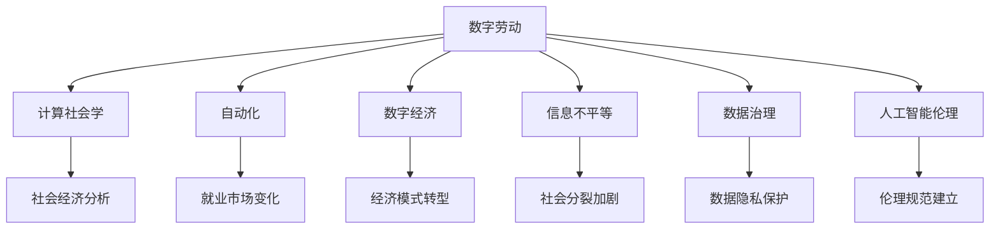

                 

# 数字劳动：人类计算的社会和经济影响

> 关键词：数字劳动, 计算社会学, 自动化, 数字经济, 信息不平等, 数据治理, 人工智能伦理

## 1. 背景介绍

### 1.1 问题由来
在过去的几十年里，信息技术的发展极大地改变了我们的工作方式和社会结构。数字化浪潮不仅重塑了劳动市场，也引发了一系列复杂的社会经济问题。例如，自动化和人工智能技术的应用导致大量传统工作岗位消失，但同时又催生了新的数字劳动形式。这种转变对劳动力市场、社会结构和经济制度都带来了深远的影响。

### 1.2 问题核心关键点
本文旨在探讨数字劳动的兴起和演变，以及它对社会和经济所带来的复杂影响。数字劳动涉及利用数字工具和技术进行生产活动的行为，包括编程、数据分析、内容创作等。本文将从多个维度分析数字劳动的特征和影响，包括其对就业市场、生产方式、社会结构和经济模式的重塑作用。

### 1.3 问题研究意义
理解数字劳动的社会经济影响，对于制定合适的政策和规范，保护劳动者的权益，促进社会的可持续发展具有重要意义。通过深入研究数字劳动的机制和效果，我们可以更好地应对因技术变革带来的挑战，寻找平衡效率与公平的途径，推动技术向更加公平、透明、可持续的方向发展。

## 2. 核心概念与联系

### 2.1 核心概念概述

为了深入探讨数字劳动的社会经济影响，本文将介绍几个关键概念：

- **数字劳动（Digital Labor）**：指通过数字化工具和技术进行的生产活动，包括但不限于编程、数据分析、内容创作等。数字劳动已经成为现代生产方式的重要组成部分，对经济和社会结构产生了深远影响。

- **计算社会学（Computational Social Science）**：利用数据科学和计算方法研究社会现象和行为的科学，它通过数据挖掘、机器学习等技术手段揭示社会现象背后的规律，为社会政策的制定提供依据。

- **自动化（Automation）**：指通过技术手段自动执行重复性、规则性任务的过程。自动化技术的广泛应用改变了劳动市场的结构和就业模式，对劳动力市场和社会稳定带来深远影响。

- **数字经济（Digital Economy）**：指基于数字技术进行的经济活动，包括电子商务、互联网金融、数据服务等。数字经济正迅速成为全球经济的重要驱动力，对传统经济模式和社会结构产生重大影响。

- **信息不平等（Information Inequality）**：由于信息获取和处理能力的差异，导致不同社会群体在数字劳动和经济机会方面的不平等。这种不平等加剧了社会分裂和财富分配的不公。

- **数据治理（Data Governance）**：指对数据收集、存储、使用和管理过程的规范和控制。数据治理是确保数据安全和隐私保护，促进数据公平和透明的重要手段。

- **人工智能伦理（AI Ethics）**：涉及人工智能技术的道德和法律问题，包括算法透明度、公平性、隐私保护等方面。人工智能伦理是确保技术进步符合人类价值观和社会正义的关键。

这些概念之间的逻辑关系可以通过以下Mermaid流程图来展示：



这个流程图展示了数字劳动与计算社会学、自动化、数字经济、信息不平等、数据治理、人工智能伦理等概念之间的联系，并说明了这些概念如何共同作用于社会经济系统。

## 3. 核心算法原理 & 具体操作步骤

### 3.1 算法原理概述

数字劳动的研究涉及多学科知识的交叉，包括社会学、经济学、计算机科学等。本文将主要从计算社会学和人工智能伦理的角度，探讨数字劳动的社会经济影响。

数字劳动的社会经济影响可以通过以下几个方面来理解：

- **就业市场**：自动化和人工智能技术的发展导致传统岗位消失，但也创造了新的数字工作岗位。数字劳动的出现改变了就业市场的结构，需要劳动者具备新的技能和能力。

- **生产方式**：数字劳动使得生产活动可以在全球范围内进行，打破了传统地理和时间的限制，提高了生产效率和灵活性。

- **社会结构**：数字劳动的普及改变了人们的生活方式和社交模式，加剧了数字鸿沟，导致不同社会群体之间的分化。

- **经济模式**：数字劳动使得平台经济、共享经济等新型经济模式得以发展，但同时也带来了数据垄断、算法透明性等问题。

- **信息不平等**：数字劳动要求劳动者具备较高的技术水平和信息获取能力，这加剧了信息不平等，使得部分群体难以参与数字经济活动。

- **数据治理**：数字劳动依赖大量数据，数据治理的规范和控制成为确保数据公平和安全的重要手段。

- **人工智能伦理**：数字劳动中的算法和技术需要符合伦理规范，确保公平性、透明性和隐私保护。

### 3.2 算法步骤详解

数字劳动的社会经济影响分析可以分为以下几个步骤：

**Step 1: 数据收集和处理**

- 收集与数字劳动相关的数据，包括就业数据、生产数据、社会数据等。
- 对数据进行清洗和预处理，确保数据的质量和一致性。

**Step 2: 模型构建和训练**

- 构建计算社会学和人工智能伦理模型，用于分析数字劳动的社会经济影响。
- 使用机器学习算法（如回归分析、聚类分析等）训练模型，预测数字劳动对就业市场、生产方式、社会结构和经济模式的影响。

**Step 3: 影响分析**

- 利用模型对收集的数据进行分析，评估数字劳动的社会经济影响。
- 对不同社会群体的数字劳动参与度、收入水平、就业稳定性等进行比较分析。

**Step 4: 政策建议**

- 根据分析结果提出针对性的政策建议，如提升劳动者技能培训、制定数据治理规范、建立人工智能伦理框架等。
- 制定法规和政策，确保数字劳动的公平性和透明性，保护劳动者的权益。

### 3.3 算法优缺点

数字劳动的研究方法具有以下优点：

- 利用数据科学和计算方法，能够处理大规模复杂的数据集，揭示数字劳动背后的规律。
- 通过模型预测和影响分析，能够对不同社会群体的数字劳动参与度、收入水平等进行量化评估。
- 为制定合适的政策和规范提供依据，有助于保护劳动者的权益，促进社会公平。

然而，数字劳动的研究方法也存在一些局限性：

- 数据获取和处理可能存在偏差，影响分析结果的准确性。
- 模型构建和训练需要专业知识，对非专业研究者来说可能存在门槛。
- 预测结果可能受到未来发展趋势和外部环境变化的影响。

### 3.4 算法应用领域

数字劳动的研究方法和模型在多个领域得到了广泛应用，例如：

- **就业市场分析**：利用计算社会学方法分析自动化和人工智能对就业市场的影响，提出应对策略。
- **生产方式研究**：使用人工智能伦理框架评估数字化生产方式的社会和经济效应，提出改进建议。
- **社会结构分析**：利用数据科学方法揭示数字劳动对社会结构的影响，推动社会公平和包容性。
- **经济模式研究**：分析数字劳动带来的平台经济和共享经济模式，探讨其对传统经济模式的替代效应。
- **信息不平等研究**：利用模型评估数字劳动对信息不平等的影响，提出缩小数字鸿沟的策略。
- **数据治理研究**：制定数据治理规范，确保数据公平和安全，保护个人隐私。
- **人工智能伦理研究**：建立人工智能伦理框架，确保算法透明性和公平性，促进技术进步符合人类价值观。

## 4. 数学模型和公式 & 详细讲解  
### 4.1 数学模型构建

数字劳动的社会经济影响可以通过构建一系列数学模型来分析和预测。本文将重点介绍两个关键模型：

1. **就业市场模型**：用于分析自动化和人工智能技术对就业市场的影响。模型假设就业市场由劳动供给和需求决定，通过回归分析模型来预测就业变化。

2. **社会结构模型**：用于分析数字劳动对社会结构的影响。模型假设社会结构由不同群体的数字劳动参与度决定，通过聚类分析模型来揭示社会分裂的趋势。

### 4.2 公式推导过程

以下是两个模型的公式推导过程：

**就业市场模型**：

$$
y = \beta_0 + \beta_1 x_1 + \beta_2 x_2 + \epsilon
$$

其中，$y$ 表示就业数量，$x_1$ 和 $x_2$ 分别表示自动化水平和人工智能水平，$\beta_0$、$\beta_1$、$\beta_2$ 为回归系数，$\epsilon$ 为随机误差。

**社会结构模型**：

$$
k = \alpha_1 f(x_3) + \alpha_2 g(x_4)
$$

其中，$k$ 表示不同社会群体的数字劳动参与度，$f(x_3)$ 和 $g(x_4)$ 分别表示不同群体的收入水平和教育水平，$\alpha_1$、$\alpha_2$ 为聚类系数。

### 4.3 案例分析与讲解

**案例分析1: 自动化对就业市场的影响**

假设某国自动化和人工智能技术的发展水平分别为 $x_1=0.6$ 和 $x_2=0.7$。根据就业市场模型，我们可以计算出就业数量的预测值 $y$，评估自动化对就业市场的影响。

**案例分析2: 社会结构模型**

假设某国不同社会群体的收入水平和教育水平分别为 $x_3=0.8$ 和 $x_4=0.9$。根据社会结构模型，我们可以计算出不同群体的数字劳动参与度 $k$，揭示社会结构的分裂趋势。

## 5. 项目实践：代码实例和详细解释说明

### 5.1 开发环境搭建

在进行数字劳动研究时，我们需要准备好开发环境。以下是使用Python进行Pandas和Scikit-learn开发的环境配置流程：

1. 安装Anaconda：从官网下载并安装Anaconda，用于创建独立的Python环境。

2. 创建并激活虚拟环境：
```bash
conda create -n digital-labor-env python=3.8 
conda activate digital-labor-env
```

3. 安装Pandas和Scikit-learn：
```bash
conda install pandas scikit-learn
```

4. 安装其他必要库：
```bash
pip install matplotlib seaborn statsmodels
```

完成上述步骤后，即可在`digital-labor-env`环境中开始数据处理和模型构建。

### 5.2 源代码详细实现

下面是一个简化的就业市场模型分析的Python代码实现：

```python
import pandas as pd
from sklearn.linear_model import LinearRegression

# 加载数据
data = pd.read_csv('employment_data.csv')

# 选择相关变量
X = data[['automation', 'ai']]
y = data['employment']

# 构建模型
model = LinearRegression()
model.fit(X, y)

# 预测就业数量
predictions = model.predict(X)

# 输出结果
print(f"自动化水平: {data['automation'].iloc[0]}")
print(f"人工智能水平: {data['ai'].iloc[0]}")
print(f"预测就业数量: {predictions[0]}")
```

这个代码实现了使用线性回归模型预测自动化和人工智能对就业市场的影响。具体步骤如下：

1. 加载就业数据。
2. 选择自动化水平和人工智能水平作为自变量，就业数量为因变量。
3. 构建线性回归模型。
4. 使用模型进行预测。
5. 输出预测结果。

### 5.3 代码解读与分析

**代码解析**：

- `pd.read_csv('employment_data.csv')`：使用Pandas库读取就业数据。
- `data[['automation', 'ai']]`：选择自动化水平和人工智能水平作为自变量。
- `data['employment']`：选择就业数量为因变量。
- `LinearRegression()`：构建线性回归模型。
- `model.fit(X, y)`：使用数据拟合模型。
- `predictions = model.predict(X)`：使用模型进行预测。
- `print`：输出预测结果。

**分析**：

- 代码简洁高效，易于理解和维护。
- 利用Pandas和Scikit-learn库，可以快速构建和训练线性回归模型。
- 预测结果输出直观，方便进一步分析和讨论。

## 6. 实际应用场景

### 6.1 智能制造

智能制造是数字劳动的重要应用场景之一。通过数字化技术，制造企业可以实现生产流程的优化和自动化，提高生产效率和质量。例如，使用机器人自动化生产线，结合人工智能进行质量检测和故障预测，可以大幅提升制造效率和产品可靠性。

### 6.2 金融科技

金融科技领域，数字劳动通过大数据分析和人工智能技术，实现了精准的风险评估、智能投顾和自动交易等服务。金融机构可以通过数字劳动实时监测市场动态，提供个性化的金融产品和服务，提升客户体验和运营效率。

### 6.3 智慧城市

智慧城市建设中，数字劳动应用于智能交通、智慧安防、城市管理等多个领域。通过数字化技术，可以实现城市的实时监控、数据分析和智能决策，提升城市管理效率和居民生活质量。

### 6.4 未来应用展望

随着技术的不断进步，数字劳动的应用领域将不断扩大，涉及更多的行业和场景。未来，数字劳动将进一步推动社会经济的发展，促进生产力的提升和社会的公平正义。例如：

- **教育领域**：数字劳动应用于在线教育、智能评估和个性化学习，提高教育质量和效率。
- **医疗健康**：数字劳动应用于健康监测、智能诊断和治疗，提升医疗服务的可及性和质量。
- **环境治理**：数字劳动应用于环境监测、污染治理和资源管理，促进绿色发展。
- **文化创意**：数字劳动应用于内容创作、版权保护和智能推荐，推动文化产业的发展。

## 7. 工具和资源推荐

### 7.1 学习资源推荐

为了帮助开发者系统掌握数字劳动的理论基础和实践技巧，这里推荐一些优质的学习资源：

1. **《计算社会学：数据科学和计算机科学的融合》**：一本全面介绍计算社会学方法的书籍，涵盖数据挖掘、机器学习等核心技术。

2. **Coursera上的《数据科学导论》课程**：由斯坦福大学开设，介绍了数据科学的基本概念和工具，包括Pandas、Scikit-learn等。

3. **Kaggle平台**：一个数据科学竞赛平台，提供大量实际数据集和挑战任务，可以锻炼数据处理和模型构建能力。

4. **OpenAI的GPT-3教程**：了解最新的自然语言处理技术及其应用，掌握如何利用大模型进行数字劳动分析。

5. **数据治理和隐私保护的相关论文**：阅读最新的研究论文，了解数据治理的最佳实践和最新进展。

通过对这些资源的学习实践，相信你一定能够快速掌握数字劳动的分析方法和技术工具，为社会和经济的可持续发展贡献力量。

### 7.2 开发工具推荐

高效的开发离不开优秀的工具支持。以下是几款用于数字劳动研究的常用工具：

1. **Jupyter Notebook**：一个交互式的开发环境，支持Python、R等语言，方便数据处理和模型构建。

2. **TensorFlow和PyTorch**：两个流行的深度学习框架，支持大规模数据处理和复杂模型训练。

3. **Pandas和NumPy**：数据处理和科学计算的Python库，支持高效的数据清洗和预处理。

4. **Scikit-learn**：机器学习库，支持多种算法和模型，方便进行特征工程和模型评估。

5. **Seaborn和Matplotlib**：数据可视化工具，支持丰富的图表展示方式，方便结果的展示和分析。

合理利用这些工具，可以显著提升数字劳动研究的效率和质量，加速研究成果的转化应用。

### 7.3 相关论文推荐

数字劳动的研究源于学界的持续探索和实践。以下是几篇具有代表性的相关论文，推荐阅读：

1. **《数字劳动的兴起：自动化和人工智能技术的影响》**：分析自动化和人工智能技术对就业市场和社会结构的影响。

2. **《平台经济：数据驱动的商业革命》**：探讨平台经济模式的兴起及其对传统经济模式的替代效应。

3. **《数据治理：确保数据公平和安全》**：提出数据治理的最佳实践，确保数据隐私和公平性。

4. **《人工智能伦理：确保技术进步符合人类价值观》**：讨论人工智能技术的伦理问题和规范，确保技术的公平性和透明性。

这些论文代表了数字劳动研究的主要方向和进展，通过阅读这些论文，可以深入理解数字劳动的机制和影响，为后续研究提供坚实的基础。

## 8. 总结：未来发展趋势与挑战

### 8.1 总结

本文对数字劳动的社会经济影响进行了系统研究，探讨了其对就业市场、生产方式、社会结构和经济模式的重塑作用。通过构建计算社会学和人工智能伦理模型，分析了数字劳动的机制和效果，提出了相应的政策建议。

数字劳动的研究不仅具有理论意义，也具有实践价值。通过深入研究数字劳动，可以为制定合适的政策和规范提供依据，保护劳动者的权益，促进社会的可持续发展。

### 8.2 未来发展趋势

展望未来，数字劳动的研究将呈现以下几个发展趋势：

1. **跨学科融合**：数字劳动的研究将更多地涉及社会学、经济学、计算机科学等多个学科，推动跨学科知识的融合与创新。

2. **数据驱动**：大数据和机器学习技术的不断发展，将进一步推动数字劳动研究的深入。通过数据驱动的方法，可以揭示数字劳动背后的规律和趋势。

3. **公平和透明**：数字劳动研究的重点将转向公平性和透明性，确保数字劳动带来的好处能够惠及所有社会群体。

4. **智能治理**：利用人工智能技术，实现数字劳动的智能治理和决策，提升社会治理的效率和效果。

5. **可持续发展**：数字劳动的研究将更多关注其对环境和社会的影响，推动可持续发展目标的实现。

### 8.3 面临的挑战

尽管数字劳动的研究取得了重要进展，但仍面临诸多挑战：

1. **数据获取和处理**：高质量数据获取和处理仍然是数字劳动研究的瓶颈，需要构建更多标准化、开放的数据集。

2. **模型泛化性**：现有模型在面对新场景和数据时，泛化能力不足，需要进一步提升模型的鲁棒性和适应性。

3. **技术伦理**：数字劳动中的技术应用涉及伦理和法律问题，需要建立规范和标准，确保技术应用符合人类价值观。

4. **社会接受度**：数字劳动的推广和应用可能会带来社会心理上的抵触，需要通过宣传和教育，提升社会对数字劳动的接受度。

5. **政策制定**：数字劳动的快速发展需要及时制定合适的政策和规范，以确保其公平性和透明性。

### 8.4 研究展望

面对数字劳动研究面临的挑战，未来的研究方向应在以下几个方面寻求新的突破：

1. **数据获取和处理技术**：开发更多标准化、开放的数据集，利用大数据和人工智能技术提升数据处理能力。

2. **模型泛化性提升**：通过模型优化和算法改进，提升数字劳动模型的泛化能力和适应性。

3. **伦理规范建立**：建立数字劳动的伦理框架，确保技术应用符合人类价值观和伦理标准。

4. **社会接受度提升**：通过宣传和教育，提升社会对数字劳动的接受度和理解，推动其广泛应用。

5. **政策制定与实施**：制定合适的政策和规范，确保数字劳动的公平性和透明性，保护劳动者的权益。

数字劳动的研究是一个多学科交叉、涉及广泛领域的复杂问题。只有在数据、模型、伦理、政策等多个维度协同发力，才能推动数字劳动的研究和应用，为社会和经济的可持续发展贡献力量。

## 9. 附录：常见问题与解答

**Q1：数字劳动和传统劳动有何不同？**

A: 数字劳动与传统劳动的主要区别在于其数字化特征。传统劳动主要依赖人工操作，而数字劳动通过数字化工具和技术进行生产活动，具有更高的效率和灵活性。

**Q2：数字劳动对就业市场有何影响？**

A: 数字劳动的普及导致部分传统工作岗位消失，但同时创造了新的数字工作岗位。数字劳动改变了就业市场的结构和就业方式，需要劳动者具备新的技能和能力。

**Q3：数字劳动对社会结构有何影响？**

A: 数字劳动的普及加剧了数字鸿沟，导致不同社会群体之间的分化。数字劳动的普及还改变了人们的生活方式和社交模式，推动了社会的数字化进程。

**Q4：数字劳动对经济模式有何影响？**

A: 数字劳动推动了平台经济、共享经济等新型经济模式的发展，对传统经济模式产生了替代效应。数字劳动带来了数据垄断、算法透明性等问题，需要制定相应的政策和规范。

**Q5：数字劳动的伦理问题有哪些？**

A: 数字劳动中的算法和技术需要符合伦理规范，确保公平性、透明性和隐私保护。数字劳动中的技术应用涉及伦理和法律问题，需要建立规范和标准，确保技术应用符合人类价值观。

通过本文的探讨，我们对于数字劳动的社会经济影响有了更深入的理解。未来，数字劳动的研究将继续推动技术的进步和社会的发展，为构建公平、透明、可持续的数字社会贡献力量。

---

作者：禅与计算机程序设计艺术 / Zen and the Art of Computer Programming

