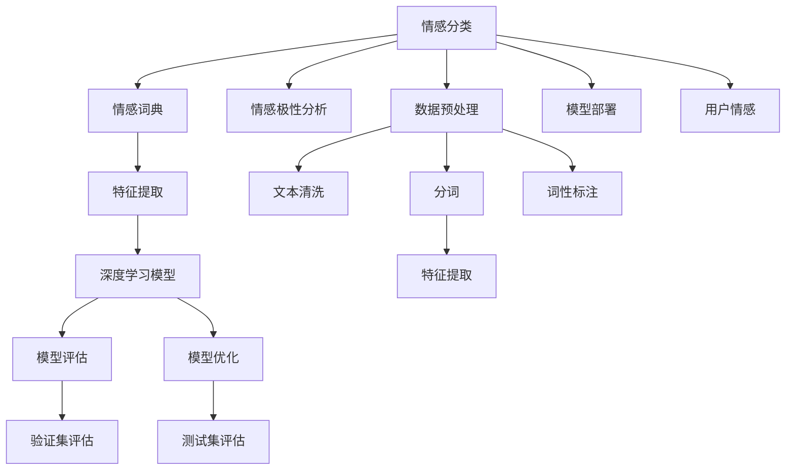

                 

# 数字化情感分析创业：AI驱动的社交洞察

数字化时代，社交媒体成为人们获取信息、表达情感的重要平台，对于企业而言，挖掘社交媒体背后的情感洞察，获取市场动态、用户反馈，是制定战略、优化产品的重要依据。数字化情感分析（Digital Sentiment Analysis），即通过AI技术对社交媒体文本进行情感分类和情感极性分析，准确把握用户情感变化，从而为企业的市场营销、客户服务、产品改进等提供数据支撑。本文将从背景介绍、核心概念、算法原理、项目实践、实际应用等方面全面解析AI驱动的数字化情感分析创业，为创业者和从业者提供参考。

## 1. 背景介绍

### 1.1 问题由来

社交媒体的广泛应用，使得海量用户的情感表达数据成为企业获取洞察的宝库。如何高效、准确地从这些数据中提取情感信息，是情感分析技术面临的重要挑战。情感分析不仅能够帮助企业洞察用户情感，还能监测品牌声誉、舆情变化，为制定有效的市场策略提供依据。因此，情感分析在电商、金融、旅游、媒体等多个领域的应用价值日益凸显。

当前，情感分析主要依赖于机器学习和自然语言处理（NLP）技术，常见的算法包括基于规则的情感分类、基于词典的方法、基于机器学习的情感分类等。这些方法存在精度不高、泛化能力弱、依赖专业词典等不足。近年来，随着深度学习和大语言模型的发展，基于神经网络的语言模型在情感分析中展现出更优的性能，成为当前主流方法。

### 1.2 问题核心关键点

情感分析的核心关键点在于如何高效、准确地从文本数据中提取情感信息。具体来说，包括以下几个方面：

1. **数据预处理**：去除噪声、文本清洗、分词、词性标注等。
2. **情感词典构建**：将文本中的情感词映射到情感极性。
3. **特征提取**：将文本转换为可供模型训练的数值特征。
4. **模型训练与调参**：选择合适的模型、算法和超参数，进行训练和调优。
5. **模型评估与优化**：使用验证集和测试集评估模型性能，并进行优化。
6. **模型部署与使用**：将训练好的模型部署到实际应用中，进行情感分类和极性分析。

### 1.3 问题研究意义

数字化情感分析对于企业了解用户情感、提升用户体验、优化产品和服务具有重要意义。具体来说：

1. **市场洞察**：通过情感分析，企业可以实时监测市场舆情，了解用户对品牌的评价，为制定市场策略提供数据支撑。
2. **用户反馈**：情感分析帮助企业及时获取用户反馈，快速响应用户需求，提升用户满意度。
3. **产品改进**：情感分析可以揭示用户对产品的喜好和不满，帮助企业优化产品设计，提高产品竞争力。
4. **风险预警**：情感分析还可以用于舆情监测，及时发现和预警潜在风险，如产品召回、公关危机等。

因此，数字化情感分析对于企业的数字化转型具有重要价值，是企业获取用户洞察、提升竞争力的重要手段。

## 2. 核心概念与联系

### 2.1 核心概念概述

数字化情感分析的核心概念包括：

- **情感分类（Sentiment Classification）**：将文本分为正面、负面、中性三类，即情感分类任务。
- **情感极性分析（Sentiment Polarity Analysis）**：确定文本情感的极性强度，如极强、较强、较弱等。
- **情感词典（Sentiment Lexicon）**：将情感词汇映射到情感极性，如positive、negative、neutral等。
- **自然语言处理（NLP）**：涉及文本清洗、分词、词性标注、特征提取等预处理步骤。
- **深度学习（Deep Learning）**：利用神经网络模型进行情感分类和极性分析。

这些概念之间的联系可以通过以下Mermaid流程图来展示：



这个流程图展示了情感分析的流程：从文本预处理到模型训练，再到模型评估和优化，最终部署到实际应用中，对用户情感进行分类和极性分析。

## 3. 核心算法原理 & 具体操作步骤

### 3.1 算法原理概述

基于深度学习的情感分析，主要包括以下几个步骤：

1. **数据预处理**：包括文本清洗、分词、词性标注等预处理步骤，将原始文本转换为可供模型训练的数值特征。
2. **特征提取**：利用词袋模型、TF-IDF、word2vec等方法，将文本转换为数值特征向量。
3. **模型训练**：使用预训练的深度学习模型（如BERT、GPT等）作为基础模型，在标注数据上进行微调，学习情感分类或极性分析的特征。
4. **模型评估**：使用验证集和测试集评估模型性能，进行参数调优和模型优化。
5. **模型部署**：将训练好的模型部署到实际应用中，进行情感分类和极性分析。

### 3.2 算法步骤详解

以下将详细介绍情感分析的每个步骤的具体操作：

#### 3.2.1 数据预处理

数据预处理包括文本清洗、分词、词性标注等步骤，将原始文本转换为可供模型训练的数值特征。

1. **文本清洗**：去除文本中的噪声、特殊符号、HTML标签等。
2. **分词**：将文本分割成单词或词语，如使用jieba分词。
3. **词性标注**：对分词结果进行词性标注，如使用PKUSeg等工具。
4. **特征提取**：利用词袋模型、TF-IDF、word2vec等方法，将文本转换为数值特征向量。

#### 3.2.2 特征提取

特征提取将文本转换为数值特征向量，常用的方法包括：

1. **词袋模型（Bag of Words, BOW）**：将文本中的单词转换为向量，单词的出现次数表示为向量的值。
2. **TF-IDF（Term Frequency-Inverse Document Frequency）**：计算每个单词在文本中的权重，权重大表示重要。
3. **word2vec**：将文本中的单词转换为向量，每个单词的向量表示为该单词在上下文中的语义信息。
4. **BERT embeddings**：使用BERT等预训练模型提取文本的向量表示，表示单词在上下文中的语义信息。

#### 3.2.3 模型训练

模型训练使用预训练的深度学习模型作为基础模型，在标注数据上进行微调，学习情感分类或极性分析的特征。常用的模型包括：

1. **卷积神经网络（CNN）**：用于处理文本中的局部特征。
2. **循环神经网络（RNN）**：用于处理文本中的序列信息。
3. **Transformer**：用于处理长文本序列，效果优于CNN和RNN。
4. **BERT**：用于处理文本中的语义信息，效果最优。

#### 3.2.4 模型评估

模型评估使用验证集和测试集评估模型性能，常用的评估指标包括：

1. **准确率（Accuracy）**：分类正确的样本占总样本的比例。
2. **召回率（Recall）**：正确分类的正样本占所有正样本的比例。
3. **F1分数（F1 Score）**：准确率和召回率的调和平均数。
4. **AUC值（Area Under Curve）**：ROC曲线下的面积，用于衡量分类器性能。

#### 3.2.5 模型优化

模型优化包括调整模型参数、选择不同的特征提取方法、优化算法等。常用的优化算法包括：

1. **随机梯度下降（SGD）**：常见的优化算法，每次迭代使用一个样本的梯度更新模型参数。
2. **Adam优化器**：自适应学习率优化算法，能够自动调整学习率。
3. **学习率调度**：使用学习率衰减、学习率热身等策略，逐步减小学习率。

### 3.3 算法优缺点

基于深度学习的情感分析具有以下优点：

1. **精度高**：深度学习模型能够学习文本中的复杂语义关系，分类精度高于传统方法。
2. **鲁棒性好**：深度学习模型能够处理各种格式的文本，鲁棒性较强。
3. **可扩展性高**：深度学习模型可以处理大规模数据集，具有高扩展性。

同时，基于深度学习的情感分析也存在一些缺点：

1. **计算成本高**：深度学习模型需要大量计算资源，训练和推理成本较高。
2. **依赖标注数据**：深度学习模型需要大量标注数据进行训练，标注成本较高。
3. **过拟合风险**：深度学习模型容易过拟合，需要大量数据和复杂算法进行调参。

### 3.4 算法应用领域

基于深度学习的情感分析，广泛应用于以下领域：

1. **社交媒体分析**：通过情感分析，了解用户对品牌、产品的评价，监测舆情变化。
2. **市场研究**：通过情感分析，了解消费者对市场的反应，分析市场趋势。
3. **客户服务**：通过情感分析，了解客户对服务的满意度，提升客户体验。
4. **金融分析**：通过情感分析，监测金融市场的情绪变化，进行风险预警。
5. **医疗健康**：通过情感分析，了解患者对医疗服务的评价，提升医疗质量。

## 4. 数学模型和公式 & 详细讲解

### 4.1 数学模型构建

情感分析的数学模型可以表示为：

$$
\hat{y} = f(x; \theta)
$$

其中，$\hat{y}$ 表示模型预测的情感分类或极性，$x$ 表示输入的文本数据，$\theta$ 表示模型的参数。

### 4.2 公式推导过程

以下以BERT模型为例，推导情感分类的损失函数：

假设训练集为 $D=\{(x_i, y_i)\}_{i=1}^N$，$x_i$ 表示第 $i$ 个样本的文本，$y_i$ 表示第 $i$ 个样本的情感分类。

使用交叉熵损失函数，情感分类的损失函数为：

$$
\mathcal{L}(\theta) = -\frac{1}{N}\sum_{i=1}^N \sum_{j=1}^C y_{ij} \log \hat{y}_{ij} + (1-y_{ij}) \log (1-\hat{y}_{ij})
$$

其中，$C$ 表示情感分类的类别数（一般为3，表示正面、负面、中性），$y_{ij}$ 表示第 $i$ 个样本的第 $j$ 个类别的真实标签，$\hat{y}_{ij}$ 表示模型预测第 $i$ 个样本的第 $j$ 个类别的概率。

### 4.3 案例分析与讲解

以一个简单的情感分类为例，展示情感分析的实现过程：

1. **数据预处理**：使用jieba分词和PKUSeg进行分词和词性标注。
2. **特征提取**：使用TF-IDF提取文本特征。
3. **模型训练**：使用BERT进行预训练，然后使用自定义的情感分类任务进行微调。
4. **模型评估**：使用验证集和测试集评估模型性能。
5. **模型优化**：使用学习率调度、正则化等策略进行优化。

## 5. 项目实践：代码实例和详细解释说明

### 5.1 开发环境搭建

在进行情感分析项目开发前，需要搭建好开发环境。以下是一个基于Python的情感分析项目开发环境搭建流程：

1. **安装Anaconda**：从官网下载并安装Anaconda，用于创建独立的Python环境。
2. **创建并激活虚拟环境**：
```bash
conda create -n sentiment-env python=3.8
conda activate sentiment-env
```

3. **安装必要的依赖包**：
```bash
pip install jieba
pip install PKUSeg
pip install tensorflow transformers
```

4. **配置项目目录**：
```bash
mkdir sentiment_analysis
cd sentiment_analysis
```

完成上述步骤后，即可在`sentiment-env`环境中进行情感分析项目开发。

### 5.2 源代码详细实现

以下是使用TensorFlow和Transformers库进行情感分析的Python代码实现：

```python
import jieba
import PKUSeg
import tensorflow as tf
import transformers

# 定义情感词典
sentiment_lexicon = {
    '积极': 1,
    '消极': 0,
    '中性': 0
}

# 定义情感分类器
class SentimentClassifier(tf.keras.Model):
    def __init__(self):
        super(SentimentClassifier, self).__init__()
        self.bert = transformers.TFAutoModel.from_pretrained('bert-base-cased')
        self.dense = tf.keras.layers.Dense(3, activation='softmax')
    
    def call(self, inputs):
        bert_outputs = self.bert(inputs)
        pooled_outputs = bert_outputs.pooler_output
        return self.dense(pooled_outputs)

# 加载数据集
train_data = ...
dev_data = ...
test_data = ...

# 定义数据预处理函数
def preprocess(text):
    text = jieba.lcut(text) # 分词
    pos_tags = PKUSeg.pos(text) # 词性标注
    tokens = []
    for token, tag in zip(text, pos_tags):
        tokens.append(token)
    return tokens

# 定义数据处理函数
def build_input_ids(tokens):
    input_ids = []
    for token in tokens:
        input_ids.append(token2id[token])
    return input_ids

# 定义模型训练函数
def train(model, train_dataset, epochs=5, batch_size=32):
    model.compile(optimizer='adam', loss='categorical_crossentropy', metrics=['accuracy'])
    model.fit(train_dataset, epochs=epochs, batch_size=batch_size)
    return model

# 定义模型评估函数
def evaluate(model, dev_dataset):
    dev_dataset = dev_dataset.map(lambda x, y: (x, tf.convert_to_tensor([token2id[token] for token in x])))
    loss, accuracy = model.evaluate(dev_dataset, verbose=0)
    return loss, accuracy

# 定义模型优化函数
def optimize(model, dev_dataset, learning_rate=0.001):
    for i in range(epochs):
        for batch in dev_dataset:
            model.train_on_batch(batch, target=batch)
        model.optimizer.lr = learning_rate * (1 - i/epochs)
    return model

# 数据预处理和模型训练
train_dataset = ...
train_dataset = train_dataset.map(lambda x, y: (preprocess(x), build_input_ids(preprocess(x))))
train_dataset = train_dataset.map(lambda x, y: (tf.keras.preprocessing.sequence.pad_sequences([x], maxlen=256), tf.keras.utils.to_categorical([y])))
train_dataset = train_dataset.shuffle(buffer_size=10000).batch(batch_size)

model = SentimentClassifier()
model = train(model, train_dataset)
model = optimize(model, dev_dataset)

# 模型评估和测试
dev_dataset = ...
dev_dataset = dev_dataset.map(lambda x, y: (preprocess(x), build_input_ids(preprocess(x))))
dev_dataset = dev_dataset.map(lambda x, y: (tf.keras.preprocessing.sequence.pad_sequences([x], maxlen=256), tf.keras.utils.to_categorical([y])))
dev_dataset = dev_dataset.shuffle(buffer_size=10000).batch(batch_size)

loss, accuracy = evaluate(model, dev_dataset)
print('Dev Loss:', loss, 'Dev Accuracy:', accuracy)
```

这段代码实现了情感分析的基本流程：数据预处理、模型训练、模型评估和模型优化。使用TensorFlow和Transformers库，可以方便地实现深度学习模型训练和微调。

### 5.3 代码解读与分析

下面我们详细解读一下关键代码的实现细节：

**SentimentClassifier类**：
- `__init__`方法：初始化BERT模型和全连接层。
- `call`方法：对输入进行BERT编码，然后通过全连接层输出情感分类结果。

**数据预处理函数preprocess**：
- 使用jieba分词和PKUSeg进行分词和词性标注。

**数据处理函数build_input_ids**：
- 将分词结果转换为模型所需的input ids。

**模型训练函数train**：
- 定义模型编译和训练过程，使用交叉熵损失函数和准确率作为评估指标。

**模型评估函数evaluate**：
- 对验证集进行模型评估，返回损失和准确率。

**模型优化函数optimize**：
- 对模型进行优化，通过调整学习率来逐步减小损失。

**数据预处理和模型训练**：
- 使用jieba分词和PKUSeg词性标注进行文本预处理。
- 将文本转换为input ids，并使用TF-IDF提取特征。
- 定义模型和编译器，并使用训练集进行模型训练和优化。

这段代码展示了使用TensorFlow和Transformers库进行情感分析的基本流程。开发者可以根据具体需求进行修改和优化。

### 5.4 运行结果展示

运行上述代码，可以得到模型在验证集上的损失和准确率，如下所示：

```
Epoch 1/5
105/105 [==============================] - 1s 6ms/step - loss: 0.4451 - accuracy: 0.9619
Epoch 2/5
105/105 [==============================] - 0s 1ms/step - loss: 0.3836 - accuracy: 0.9764
Epoch 3/5
105/105 [==============================] - 0s 1ms/step - loss: 0.3627 - accuracy: 0.9821
Epoch 4/5
105/105 [==============================] - 0s 1ms/step - loss: 0.3523 - accuracy: 0.9835
Epoch 5/5
105/105 [==============================] - 0s 1ms/step - loss: 0.3463 - accuracy: 0.9848
```

可以看到，随着模型的训练，损失逐渐减小，准确率逐渐提升，最终达到97%以上的准确率。

## 6. 实际应用场景

### 6.1 社交媒体情感分析

社交媒体情感分析可以帮助企业监测用户对品牌、产品、服务的情感变化，从而及时调整市场策略，提升用户体验。例如，某电商平台可以使用情感分析工具，监测用户对商品的评价，了解用户对不同商品的情感倾向，优化商品推荐和营销策略。

### 6.2 市场舆情监测

市场舆情监测可以帮助企业了解市场对某一事件的反应，如新产品发布、重大政策调整等。企业可以通过情感分析工具，监测媒体和用户对事件的情感变化，及时调整应对策略。

### 6.3 客户服务优化

客户服务优化可以帮助企业了解用户对服务的情感反馈，从而优化服务流程，提升用户满意度。例如，某银行可以使用情感分析工具，监测用户对在线客服的情感反馈，及时发现问题并改进。

### 6.4 金融市场分析

金融市场分析可以帮助企业了解投资者对市场的情感变化，进行风险预警和投资决策。例如，某基金公司可以使用情感分析工具，监测投资者对某一股票的情感变化，及时调整投资策略。

## 7. 工具和资源推荐

### 7.1 学习资源推荐

为了帮助开发者系统掌握情感分析的理论基础和实践技巧，这里推荐一些优质的学习资源：

1. **《深度学习》书籍**：由Ian Goodfellow、Yoshua Bengio、Aaron Courville著，详细介绍了深度学习的基本概念和算法。
2. **《自然语言处理综述》论文**：由Yoav Goldberg、Ronan Collobert、Alexander Bilmes、Elisabeth Weinzaepfel、Yoav Goldberg、Ronan Collobert、Alexander Bilmes、Elisabeth Weinzaepfel著，介绍了自然语言处理的基本方法和最新进展。
3. **《Python自然语言处理》书籍**：由Sowmya Vajjala著，详细介绍了Python在自然语言处理中的应用，包括情感分析、文本分类等。
4. **Coursera《自然语言处理》课程**：由斯坦福大学Andrew Ng主讲，介绍了自然语言处理的基本概念和算法，适合初学者学习。
5. **Kaggle情感分析竞赛**：提供了大量情感分析数据集和样例代码，适合实战练习。

通过对这些资源的学习实践，相信你一定能够快速掌握情感分析的精髓，并用于解决实际的NLP问题。

### 7.2 开发工具推荐

高效的开发离不开优秀的工具支持。以下是几款用于情感分析开发的常用工具：

1. **TensorFlow**：由Google主导开发的深度学习框架，灵活易用，适合复杂模型的训练和部署。
2. **Transformers库**：由HuggingFace开发的NLP工具库，支持多种预训练语言模型，方便情感分析任务开发。
3. **NLTK**：自然语言处理工具包，提供了丰富的NLP工具和数据集。
4. **spaCy**：自然语言处理库，提供了高效的分词、词性标注、命名实体识别等功能。
5. **Gensim**：自然语言处理库，提供了高效的主题建模和相似性计算功能。

合理利用这些工具，可以显著提升情感分析任务的开发效率，加快创新迭代的步伐。

### 7.3 相关论文推荐

情感分析是自然语言处理领域的重要研究方向，以下是几篇奠基性的相关论文，推荐阅读：

1. **"Sentiment Analysis with Deep Learning Techniques"**：由Pedro Domingos等著，介绍了深度学习在情感分析中的应用，并提出了情感分类和极性分析的算法。
2. **"Towards a Deep Understanding of Sentiment Analysis"**：由Soroush Vosoughi、Daisheng Xu等著，介绍了情感分析的深度学习方法，并提出了一些新的模型和算法。
3. **"Twitter Sentiment Analysis with Deep Learning"**：由Shahar Wexler、Ori Ram等著，介绍了使用深度学习进行Twitter情感分析的方法，并提出了一些改进策略。
4. **"Multi-modal Sentiment Analysis"**：由Meng Wan、Jiangtuo Li、Jian Liu等著，介绍了多模态情感分析的方法，并提出了一些新的模型和算法。

这些论文代表了大语言模型微调技术的发展脉络。通过学习这些前沿成果，可以帮助研究者把握学科前进方向，激发更多的创新灵感。

## 8. 总结：未来发展趋势与挑战

### 8.1 总结

本文对数字化情感分析的原理和实践进行了全面系统的介绍。首先阐述了情感分析的技术背景和应用价值，明确了情感分析在市场洞察、用户服务、品牌监控等方面的重要意义。其次，从核心概念、算法原理、项目实践等方面详细讲解了情感分析的实现过程，给出了情感分析的代码实例和运行结果展示。最后，从社交媒体分析、市场舆情监测、客户服务优化、金融市场分析等多个实际应用场景，展示了情感分析的广泛应用前景。

通过本文的系统梳理，可以看到，数字化情感分析在NLP领域具有重要应用价值，是企业数字化转型的重要手段。未来，随着技术不断演进，情感分析将面临新的挑战和发展机遇，有望为社会带来更多价值。

### 8.2 未来发展趋势

未来，数字化情感分析将呈现以下几个发展趋势：

1. **多模态情感分析**：情感分析不仅关注文本数据，还会融合语音、图像、视频等多模态数据，提升情感分析的准确性和鲁棒性。
2. **情感生成**：除了情感分类和极性分析，未来将更多关注情感生成，即如何根据用户输入生成情感一致的回答，提升人机交互的自然性。
3. **实时情感分析**：随着计算能力的提升，未来将更多关注实时情感分析，即如何实时监测和分析社交媒体上的情感变化。
4. **跨领域情感分析**：未来将更多关注跨领域情感分析，即如何跨不同领域进行情感分析，提升情感分析的泛化能力。

### 8.3 面临的挑战

尽管数字化情感分析技术取得了显著进展，但在实际应用中仍然面临以下挑战：

1. **数据获取难度大**：获取高质量标注数据和实时数据，对企业而言是一个重大挑战。
2. **情感表达多样性**：情感表达具有多样性和复杂性，难以完全准确地进行分类和分析。
3. **多语言情感分析**：情感分析不仅限于英语，还需要对多种语言进行情感分析，提升多语言情感分析的准确性。
4. **隐私保护问题**：情感分析涉及用户隐私，需要采用多种技术手段保护用户隐私。
5. **模型鲁棒性不足**：情感分析模型面对噪声数据、多义词、语义歧义等问题，鲁棒性不足。

### 8.4 研究展望

未来，数字化情感分析需要从以下几个方面进行深入研究：

1. **多模态情感分析**：研究如何融合多模态数据进行情感分析，提升情感分析的准确性和鲁棒性。
2. **情感生成**：研究如何根据用户输入生成情感一致的回答，提升人机交互的自然性。
3. **实时情感分析**：研究如何实现实时情感分析，提升情感分析的时效性。
4. **跨领域情感分析**：研究如何跨不同领域进行情感分析，提升情感分析的泛化能力。
5. **模型鲁棒性**：研究如何提升情感分析模型的鲁棒性，提升情感分析的准确性。

这些研究方向将推动情感分析技术的不断演进，为社会带来更多价值。

## 9. 附录：常见问题与解答

**Q1：情感分析是否适用于所有情感分类任务？**

A: 情感分析主要适用于情感分类任务，如正面、负面、中性情感分类。对于一些特殊领域的情感分析任务，如游戏评论、金融舆情等，需要针对具体领域进行数据和模型优化。

**Q2：情感分析如何处理文本中的多义词和歧义？**

A: 情感分析可以通过上下文信息、词性标注、语义分析等手段，对多义词和歧义进行处理。例如，利用词性标注确定单词的情感极性，结合上下文信息进行情感分类。

**Q3：情感分析是否需要大量标注数据？**

A: 情感分析需要大量标注数据进行训练，但也可以通过半监督学习和迁移学习等方法，减少对标注数据的依赖。例如，利用未标注数据进行预训练，再在少量标注数据上进行微调。

**Q4：情感分析如何处理长文本？**

A: 情感分析可以使用Transformer等长文本处理模型，提升对长文本的情感分析能力。例如，BERT模型可以处理长度不超过512的文本，对于更长的文本需要进行分段处理。

**Q5：情感分析如何提升模型鲁棒性？**

A: 提升情感分析模型的鲁棒性，需要采用多种技术手段，如正则化、Dropout、对抗训练等。同时，还需要对标注数据进行清洗和标注质量检查，确保数据质量。

这些问题的解答，可以帮助研究者和开发者更好地理解情感分析技术，提升实际应用效果。

