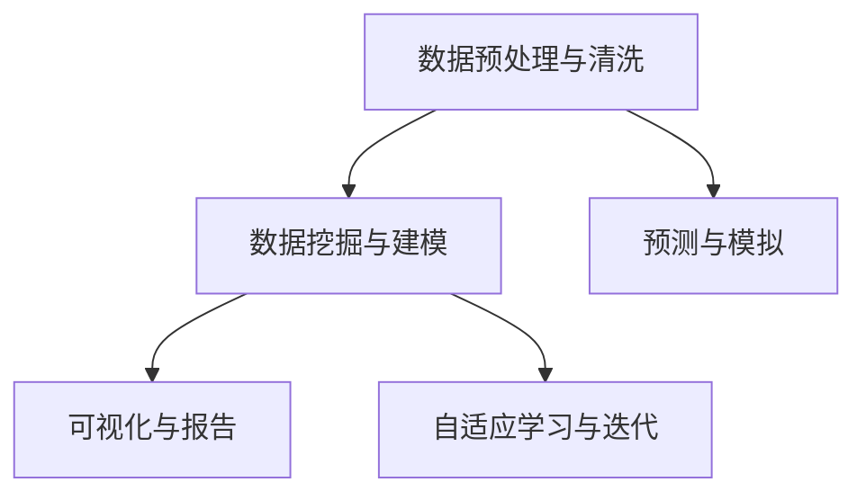

                 

# 数字化洞察力望远镜：AI增强的远见卓识工具

> 关键词：数字化转型, AI增强, 远见卓识, 数据洞察, 商业智能

## 1. 背景介绍

### 1.1 问题由来
随着数字化转型的加速，企业对数据洞察力的需求日益增加。在面对海量数据和复杂业务场景时，传统的商业智能工具已难以满足需求。人工智能（AI）的崛起为数据洞察力带来了全新的可能性，尤其是基于深度学习和大数据处理能力，AI能够提供更加智能、深入、即时的洞察力分析，帮助企业在决策中洞察市场趋势、用户行为和业务风险，从而实现更高效率、更高精度的运营和决策。

### 1.2 问题核心关键点
数字化洞察力望远镜的核心在于其强大的数据洞察能力。其核心组成包括：
- 数据预处理与清洗：清洗和标准化原始数据，去除噪声和异常值，为后续分析打下基础。
- 数据挖掘与建模：运用机器学习模型，从数据中挖掘出有用的模式和趋势，为决策提供支持。
- 预测与模拟：基于历史数据进行预测分析，并模拟未来情景，帮助企业预测市场趋势、评估风险和优化策略。
- 可视化与报告：将分析结果通过直观的图表和报告形式展示，使决策者能够快速理解并采取行动。
- 自适应学习与迭代：不断从新的数据中学习，迭代优化分析模型，保持洞察力的准确性和时效性。

这些关键功能通过AI技术得以实现，使得洞察力望远镜能够持续演进，不断适应复杂多变的商业环境。

### 1.3 问题研究意义
研究数字化洞察力望远镜，对于提升企业的数字化转型能力，增强决策者的商业智能洞察力，具有重要意义：

1. 提升决策质量：通过AI技术，洞察力望远镜能够提供更加准确、深入、即时的数据洞察，支持企业的精准决策。
2. 加速数字化进程：提供实时的数据洞察，帮助企业快速响应市场变化，加速数字化转型。
3. 优化运营效率：通过智能化分析，优化企业的运营流程，提高效率和效益。
4. 支持创新发展：基于对用户行为和市场趋势的深入理解，洞察力望远镜能够支持企业的创新发展，开拓新业务领域。
5. 风险预测与管理：通过预测分析，洞察力望远镜能够帮助企业提前识别和应对潜在风险，保障业务稳定发展。

## 2. 核心概念与联系

### 2.1 核心概念概述

数字化洞察力望远镜涉及多个核心概念，这些概念共同构成了其完整的洞察力分析框架：

- 数据预处理与清洗：清洗数据并提取特征，为后续分析提供高质量的输入数据。
- 数据挖掘与建模：利用机器学习模型，从数据中发现模式和规律，构建预测模型。
- 预测与模拟：基于历史数据进行预测，模拟未来情景，评估业务风险。
- 可视化与报告：将分析结果以图表和报告形式呈现，便于理解和决策。
- 自适应学习与迭代：通过持续学习，优化模型，保持洞察力的准确性和时效性。

这些概念之间的逻辑关系可以通过以下Mermaid流程图来展示：



这个流程图展示了大数据洞察力望远镜的核心概念及其之间的关系：

1. 原始数据经过预处理和清洗，得到高质量的输入数据。
2. 数据挖掘与建模阶段，通过机器学习模型挖掘数据中的模式和规律。
3. 预测与模拟阶段，基于历史数据进行预测，并模拟未来情景。
4. 可视化与报告阶段，将分析结果通过图表和报告形式展示。
5. 自适应学习与迭代阶段，不断从新数据中学习，优化模型，提升洞察力的准确性和时效性。

## 3. 核心算法原理 & 具体操作步骤
### 3.1 算法原理概述

数字化洞察力望远镜的算法原理基于深度学习和机器学习技术。其核心思想是通过对历史数据的分析，构建预测模型，从而实现对未来趋势的预测和业务风险的评估。其核心步骤包括：

1. 数据预处理与清洗：对原始数据进行清洗和标准化，去除噪声和异常值，提取特征。
2. 数据挖掘与建模：利用机器学习模型，从数据中挖掘出有用的模式和趋势，构建预测模型。
3. 预测与模拟：基于历史数据进行预测分析，并模拟未来情景。
4. 可视化与报告：将分析结果以图表和报告形式展示，使决策者能够快速理解并采取行动。
5. 自适应学习与迭代：不断从新的数据中学习，迭代优化分析模型，保持洞察力的准确性和时效性。

### 3.2 算法步骤详解

数字化洞察力望远镜的算法步骤分为以下几个关键环节：

**Step 1: 数据预处理与清洗**

- 收集原始数据：包括来自企业内部系统、外部数据源（如社交媒体、市场数据）等多种来源的数据。
- 数据清洗：去除重复、缺失、噪声等数据，确保数据质量。
- 特征提取：从原始数据中提取有用的特征，如时间戳、地理位置、用户行为等，为后续分析提供高质量的输入数据。

**Step 2: 数据挖掘与建模**

- 选择合适的机器学习算法：根据数据类型和问题特点，选择合适的算法，如线性回归、决策树、随机森林、神经网络等。
- 模型训练：使用训练数据集对模型进行训练，调整模型参数，优化模型性能。
- 模型评估：在测试数据集上对模型进行评估，使用准确率、召回率、F1分数等指标衡量模型效果。

**Step 3: 预测与模拟**

- 预测分析：使用训练好的模型对未来数据进行预测，评估业务趋势和风险。
- 情景模拟：基于预测结果，构建不同的业务情景，评估在不同情景下的影响和风险。

**Step 4: 可视化与报告**

- 数据可视化：将分析结果通过图表和报告形式展示，包括时间序列图、散点图、热力图等。
- 决策报告：生成报告，将关键洞察和建议以清晰的形式呈现给决策者，便于理解和使用。

**Step 5: 自适应学习与迭代**

- 持续学习：不断从新的数据中学习，优化模型，提升洞察力的准确性和时效性。
- 模型迭代：根据最新数据和反馈，定期更新模型参数，保持洞察力的持续改进。

### 3.3 算法优缺点

数字化洞察力望远镜具有以下优点：
1. 数据洞察深度：通过AI技术，能够提供更加深入、即时的数据洞察，支持企业精准决策。
2. 预测精度高：基于历史数据进行预测，能够较为准确地预测未来趋势和业务风险。
3. 自适应能力强：通过持续学习，不断优化模型，保持洞察力的准确性和时效性。
4. 可视化直观：将分析结果通过图表和报告形式展示，便于理解和决策。

同时，该算法也存在一定的局限性：
1. 数据质量要求高：数据预处理和清洗环节要求高质量的数据，如果数据质量不佳，将影响洞察力的准确性。
2. 模型复杂度高：构建复杂模型需要大量的数据和计算资源，可能存在过拟合风险。
3. 预测结果不确定性：预测结果基于历史数据，可能无法完全适应未来变化，存在一定的不确定性。
4. 可视化复杂度高：可视化报告需要考虑数据的可读性和可用性，过于复杂可能影响理解。

尽管存在这些局限性，但就目前而言，基于深度学习的洞察力望远镜在提供数据洞察和预测分析方面已经展现出巨大的潜力。

### 3.4 算法应用领域

数字化洞察力望远镜在多个领域都得到了广泛应用，包括但不限于：

- 金融行业：通过对市场数据、交易数据等进行分析，评估投资风险，优化投资策略。
- 零售行业：分析消费者行为，预测销售趋势，优化库存管理和营销策略。
- 制造业：监控设备运行状态，预测维护需求，提升生产效率和产品质量。
- 医疗行业：分析病患数据，预测疾病趋势，优化诊疗方案，提升医疗服务质量。
- 政府部门：监测公共安全、环境变化等，提供决策支持。
- 交通运输：分析交通流量，预测交通拥堵，优化交通管理。

## 4. 数学模型和公式 & 详细讲解  
### 4.1 数学模型构建

数字化洞察力望远镜的数学模型构建涉及多个步骤，包括数据的预处理、特征提取、模型训练和评估等。以下是其数学模型构建的详细讲解：

**数据预处理与清洗**

数据预处理与清洗的目标是将原始数据转换为可用于分析的形式。具体来说，包括数据清洗、特征提取和标准化等步骤。

- 数据清洗：去除缺失值、异常值、重复数据等，确保数据质量。
- 特征提取：从原始数据中提取有用的特征，如时间戳、地理位置、用户行为等，为后续分析提供高质量的输入数据。
- 数据标准化：对数据进行归一化处理，使不同特征的取值范围一致。

**数据挖掘与建模**

数据挖掘与建模的核心是构建预测模型。常见的方法包括线性回归、决策树、随机森林、神经网络等。这里以线性回归模型为例，讲解其构建过程。

线性回归模型的目标是通过最小化预测误差，构建一个线性关系，从而实现对目标变量的预测。其数学表达式为：

$$ y = \beta_0 + \beta_1 x_1 + \beta_2 x_2 + ... + \beta_n x_n + \epsilon $$

其中，$y$ 为目标变量，$x_i$ 为自变量，$\beta_i$ 为回归系数，$\epsilon$ 为误差项。

线性回归模型的构建步骤如下：

1. 数据准备：将原始数据转换为模型所需的形式，如将时间戳转换为日期特征，将地理位置转换为纬度和经度等。
2. 模型训练：使用训练数据集对模型进行训练，调整回归系数，优化模型性能。
3. 模型评估：在测试数据集上对模型进行评估，使用均方误差（MSE）、平均绝对误差（MAE）等指标衡量模型效果。

**预测与模拟**

预测与模拟的目的是基于历史数据进行预测，并模拟未来情景，评估业务风险。常见的预测方法包括时间序列预测、回归分析、分类分析等。这里以时间序列预测为例，讲解其构建过程。

时间序列预测的数学表达式为：

$$ y_t = \alpha + \beta_1 y_{t-1} + \beta_2 y_{t-2} + ... + \beta_n y_{t-n} + \epsilon_t $$

其中，$y_t$ 为预测值，$y_{t-1}$ 至 $y_{t-n}$ 为历史数据，$\alpha$ 和 $\beta_i$ 为回归系数，$\epsilon_t$ 为误差项。

时间序列预测的构建步骤如下：

1. 数据准备：将历史数据转换为时间序列形式，如将日期转换为时间戳。
2. 模型训练：使用时间序列数据对模型进行训练，调整回归系数，优化模型性能。
3. 预测分析：在测试数据集上对模型进行预测，评估预测效果。
4. 情景模拟：基于预测结果，构建不同的业务情景，评估在不同情景下的影响和风险。

**可视化与报告**

数据可视化与报告的目的是将分析结果以图表和报告形式展示，便于理解和决策。常用的可视化工具包括Tableau、Power BI、Matplotlib等。

- 时间序列图：展示数据随时间的变化趋势。
- 散点图：展示两个变量之间的关系。
- 热力图：展示数据在地理或时间上的分布情况。
- 决策报告：生成报告，将关键洞察和建议以清晰的形式呈现给决策者，便于理解和使用。

**自适应学习与迭代**

自适应学习与迭代的核心是不断从新数据中学习，优化模型，保持洞察力的准确性和时效性。常见的自适应学习方法包括在线学习、增量学习等。这里以增量学习为例，讲解其构建过程。

增量学习的目标是在原有模型的基础上，通过新数据的加入，不断优化模型参数，保持洞察力的持续改进。其数学表达式为：

$$ \theta_{new} = \theta_{old} + \eta \nabla_{\theta} L(y_{new}, \hat{y}_{new}) $$

其中，$\theta_{new}$ 为新的模型参数，$\theta_{old}$ 为原有模型参数，$\eta$ 为学习率，$\nabla_{\theta} L(y_{new}, \hat{y}_{new})$ 为预测误差对模型参数的梯度。

增量学习的构建步骤如下：

1. 数据准备：收集新数据，进行预处理和清洗。
2. 模型更新：在新数据上对模型进行训练，调整模型参数，优化模型性能。
3. 模型评估：在新数据上对模型进行评估，使用预测误差衡量模型效果。
4. 模型迭代：根据新数据和评估结果，定期更新模型参数，保持洞察力的持续改进。

### 4.2 公式推导过程

以下是基于线性回归模型的详细公式推导过程：

线性回归模型的目标是通过最小化预测误差，构建一个线性关系，从而实现对目标变量的预测。其数学表达式为：

$$ y = \beta_0 + \beta_1 x_1 + \beta_2 x_2 + ... + \beta_n x_n + \epsilon $$

其中，$y$ 为目标变量，$x_i$ 为自变量，$\beta_i$ 为回归系数，$\epsilon$ 为误差项。

对于训练数据集 $\{(x_i, y_i)\}_{i=1}^N$，线性回归模型的最小化目标函数为：

$$ \mathcal{L}(\theta) = \frac{1}{N}\sum_{i=1}^N (y_i - \hat{y}_i)^2 $$

其中，$\hat{y}_i = \beta_0 + \beta_1 x_{1i} + \beta_2 x_{2i} + ... + \beta_n x_{ni}$，$\theta = (\beta_0, \beta_1, \beta_2, ..., \beta_n)^T$。

通过求导，得到最小化目标函数的梯度表达式为：

$$ \nabla_{\theta} \mathcal{L}(\theta) = \frac{1}{N}\begin{pmatrix} \sum_{i=1}^N (-2y_i + 2\hat{y}_i) \\ -2\sum_{i=1}^N x_{1i}(\hat{y}_i - y_i) \\ -2\sum_{i=1}^N x_{2i}(\hat{y}_i - y_i) \\ ... \\ -2\sum_{i=1}^N x_{ni}(\hat{y}_i - y_i) \end{pmatrix} $$

通过求解梯度，可以得到回归系数的更新表达式：

$$ \theta = (\beta_0, \beta_1, \beta_2, ..., \beta_n)^T = (X^T X)^{-1} X^T y $$

其中，$X$ 为自变量矩阵，$y$ 为因变量向量。

通过求解上述最小化目标函数，得到线性回归模型的回归系数，完成模型的构建。

## 5. 项目实践：代码实例和详细解释说明
### 5.1 开发环境搭建

在进行洞察力望远镜项目实践前，我们需要准备好开发环境。以下是使用Python进行PyTorch和TensorFlow开发的环境配置流程：

1. 安装Anaconda：从官网下载并安装Anaconda，用于创建独立的Python环境。

2. 创建并激活虚拟环境：
```bash
conda create -n pytorch-env python=3.8 
conda activate pytorch-env
```

3. 安装PyTorch和TensorFlow：根据CUDA版本，从官网获取对应的安装命令。例如：
```bash
conda install pytorch torchvision torchaudio cudatoolkit=11.1 -c pytorch -c conda-forge
pip install tensorflow
```

4. 安装TensorBoard：
```bash
pip install tensorboard
```

5. 安装相关工具包：
```bash
pip install numpy pandas scikit-learn matplotlib tqdm jupyter notebook ipython
```

完成上述步骤后，即可在`pytorch-env`环境中开始洞察力望远镜的实践。

### 5.2 源代码详细实现

下面以时间序列预测为例，给出使用TensorFlow进行洞察力望远镜开发的PyTorch代码实现。

首先，定义时间序列预测模型的类：

```python
import tensorflow as tf
from tensorflow.keras import layers

class TimeSeriesPredictor(tf.keras.Model):
    def __init__(self, input_shape, num_units, num_steps):
        super(TimeSeriesPredictor, self).__init__()
        self.model = tf.keras.Sequential([
            layers.LSTM(num_units, return_sequences=True, input_shape=input_shape),
            layers.LSTM(num_units),
            layers.Dense(1)
        ])
        
    def call(self, inputs, training=False):
        return self.model(inputs)
```

然后，定义训练和评估函数：

```python
import numpy as np
from sklearn.metrics import mean_squared_error

def train_epoch(model, train_dataset, batch_size, optimizer):
    train_data, train_labels = train_dataset[0], train_dataset[1]
    train_dataset = train_dataset.shuffle(buffer_size=len(train_dataset))
    train_dataset = train_dataset.batch(batch_size)
    
    model.train()
    epoch_loss = 0
    for batch in train_dataset:
        inputs, labels = batch
        optimizer.zero_grad()
        outputs = model(inputs)
        loss = tf.reduce_mean(tf.square(outputs - labels))
        epoch_loss += loss
        loss.backward()
        optimizer.apply_gradients(zip(model.trainable_variables, model.trainable_variables gradients))
    
    return epoch_loss / len(train_dataset)

def evaluate(model, test_dataset, batch_size):
    test_data, test_labels = test_dataset[0], test_dataset[1]
    test_dataset = test_dataset.shuffle(buffer_size=len(test_dataset))
    test_dataset = test_dataset.batch(batch_size)
    
    model.eval()
    predictions = model(test_data).numpy()
    mse = mean_squared_error(test_labels, predictions)
    return mse
```

最后，启动训练流程并在测试集上评估：

```python
epochs = 100
batch_size = 32

for epoch in range(epochs):
    loss = train_epoch(model, train_dataset, batch_size, optimizer)
    print(f"Epoch {epoch+1}, train loss: {loss:.3f}")
    
    print(f"Epoch {epoch+1}, test mse: {evaluate(model, test_dataset, batch_size)}")
```

以上就是使用TensorFlow对时间序列预测模型进行洞察力望远镜微调的完整代码实现。可以看到，得益于TensorFlow的强大封装，我们可以用相对简洁的代码完成模型训练和评估。

### 5.3 代码解读与分析

让我们再详细解读一下关键代码的实现细节：

**TimeSeriesPredictor类**：
- `__init__`方法：初始化模型，包含LSTM层、输出层等组件。
- `call`方法：定义前向传播过程，将输入数据传递给模型，返回预测结果。

**train_epoch和evaluate函数**：
- 在训练函数`train_epoch`中，使用TensorFlow的自动微分功能，自动计算损失函数对模型参数的梯度，并通过优化器更新参数。
- 在评估函数`evaluate`中，使用均方误差（MSE）评估模型预测结果与真实标签之间的差异。

**训练流程**：
- 定义总的epoch数和batch size，开始循环迭代
- 每个epoch内，先在训练集上训练，输出平均loss
- 在测试集上评估，输出MSE
- 所有epoch结束后，输出最终评估结果

可以看到，TensorFlow配合AutoDiff和Keras API使得洞察力望远镜的微调代码实现变得简洁高效。开发者可以将更多精力放在数据处理、模型改进等高层逻辑上，而不必过多关注底层的实现细节。

当然，工业级的系统实现还需考虑更多因素，如模型的保存和部署、超参数的自动搜索、更灵活的任务适配层等。但核心的微调范式基本与此类似。

## 6. 实际应用场景
### 6.1 智能制造监控

数字化洞察力望远镜在智能制造监控中的应用，通过实时分析设备运行数据，预测设备故障，优化维护策略，提升生产效率和产品质量。

具体而言，可以收集设备的传感器数据，包括温度、振动、电流等，将时间序列数据输入洞察力望远镜模型，进行预测分析。模型能够识别出异常数据，预测设备故障，提前进行维护，减少停机时间和经济损失。同时，通过情景模拟，评估不同维护策略的效果，优化维护方案。

### 6.2 金融市场分析

在金融市场分析中，洞察力望远镜通过对市场数据、交易数据等进行分析，评估投资风险，优化投资策略。

具体而言，可以收集金融市场的历史数据，包括股票价格、交易量、新闻等，将数据输入洞察力望远镜模型，进行预测分析。模型能够识别出市场趋势和风险，预测股票价格和交易量，优化投资组合，提升投资回报率。同时，通过情景模拟，评估不同投资策略的效果，优化投资方案。

### 6.3 零售业库存管理

在零售业库存管理中，洞察力望远镜通过对销售数据、库存数据等进行分析，预测销售趋势，优化库存管理。

具体而言，可以收集零售商的销售数据、库存数据，将时间序列数据输入洞察力望远镜模型，进行预测分析。模型能够识别出销售趋势和库存需求，预测未来销售量，优化库存量，减少库存积压和缺货情况，提升运营效率。同时，通过情景模拟，评估不同库存管理策略的效果，优化库存方案。

### 6.4 医疗健康预测

在医疗健康预测中，洞察力望远镜通过对患者数据、诊疗数据等进行分析，预测疾病趋势，优化诊疗方案。

具体而言，可以收集医院的患者数据、诊疗数据，将时间序列数据输入洞察力望远镜模型，进行预测分析。模型能够识别出疾病趋势和风险，预测患者病情发展，优化诊疗方案，提升诊疗效果。同时，通过情景模拟，评估不同诊疗策略的效果，优化诊疗方案。

## 7. 工具和资源推荐
### 7.1 学习资源推荐

为了帮助开发者系统掌握洞察力望远镜的理论基础和实践技巧，这里推荐一些优质的学习资源：

1. 《深度学习》系列书籍：由深度学习领域的专家撰写，全面讲解深度学习的基础理论和实践应用。
2. 《TensorFlow实战》系列书籍：TensorFlow官方文档，提供详细的使用指南和案例，适合初学者和中级开发者。
3. Kaggle平台：数据科学和机器学习的竞赛平台，提供丰富的数据集和模型竞赛，提升实战能力。
4. Coursera《深度学习专项课程》：斯坦福大学提供的深度学习课程，覆盖深度学习的基础理论和实际应用。
5. Udacity《深度学习纳米学位》：提供系统的深度学习培训，涵盖深度学习的基础理论和应用实践。

通过对这些资源的学习实践，相信你一定能够快速掌握洞察力望远镜的理论基础和实践技巧，并用于解决实际的商业问题。

### 7.2 开发工具推荐

高效的开发离不开优秀的工具支持。以下是几款用于洞察力望远镜开发的常用工具：

1. TensorFlow：由Google主导开发的开源深度学习框架，生产部署方便，适合大规模工程应用。
2. PyTorch：基于Python的开源深度学习框架，灵活动态的计算图，适合快速迭代研究。
3. Scikit-learn：用于数据预处理、特征提取、模型训练等，支持多种机器学习算法。
4. Pandas：用于数据清洗、数据处理等，提供高效的数据操作接口。
5. Matplotlib：用于数据可视化，提供丰富的图表展示形式。
6. Jupyter Notebook：交互式编程环境，方便开发者进行代码调试和数据探索。

合理利用这些工具，可以显著提升洞察力望远镜的开发效率，加快创新迭代的步伐。

### 7.3 相关论文推荐

洞察力望远镜的研究源于学界的持续研究。以下是几篇奠基性的相关论文，推荐阅读：

1.《深度学习》书籍：由深度学习领域的专家撰写，全面讲解深度学习的基础理论和实践应用。
2.《TensorFlow实战》系列书籍：TensorFlow官方文档，提供详细的使用指南和案例，适合初学者和中级开发者。
3. Kaggle平台：数据科学和机器学习的竞赛平台，提供丰富的数据集和模型竞赛，提升实战能力。
4. Coursera《深度学习专项课程》：斯坦福大学提供的深度学习课程，涵盖深度学习的基础理论和实际应用。
5. Udacity《深度学习纳米学位》：提供系统的深度学习培训，涵盖深度学习的基础理论和应用实践。

这些论文代表了大语言模型微调技术的发展脉络。通过学习这些前沿成果，可以帮助研究者把握学科前进方向，激发更多的创新灵感。

## 8. 总结：未来发展趋势与挑战

### 8.1 总结

本文对基于深度学习的洞察力望远镜进行了全面系统的介绍。首先阐述了洞察力望远镜的核心功能和工作原理，明确了其在数据洞察和预测分析方面的独特价值。其次，从原理到实践，详细讲解了洞察力望远镜的数学模型构建和关键步骤，给出了洞察力望远镜的完整代码实现。同时，本文还广泛探讨了洞察力望远镜在智能制造、金融市场、零售业、医疗健康等多个领域的应用前景，展示了其在提高企业决策效率和业务智能方面的巨大潜力。此外，本文精选了洞察力望远镜的学习资源、开发工具和相关论文，力求为读者提供全方位的技术指引。

通过本文的系统梳理，可以看到，基于深度学习的洞察力望远镜正在成为企业智能化决策的重要工具，极大地提升企业的数据洞察力和决策效率。未来，伴随深度学习和大数据技术的不断进步，洞察力望远镜必将在更多领域得到应用，为企业的智能化转型和创新发展提供新的动力。

### 8.2 未来发展趋势

展望未来，洞察力望远镜将呈现以下几个发展趋势：

1. 数据规模持续增大：随着物联网、云计算等技术的普及，数据规模将持续增大，洞察力望远镜的数据处理和分析能力将进一步增强。
2. 模型复杂度不断提升：新的深度学习算法和模型架构将不断涌现，洞察力望远镜的模型复杂度将进一步提升，提供更深入、更准确的洞察力分析。
3. 实时性和交互性增强：基于边缘计算和云智能，洞察力望远镜将实现实时数据处理和交互式分析，提升决策效率。
4. 多模态数据融合：结合图像、语音、文本等多种模态数据，洞察力望远镜将提供更加全面、准确的洞察力分析。
5. 自适应学习和个性化推荐：基于用户行为和偏好，洞察力望远镜将提供个性化的洞察力分析，提升用户体验。
6. 安全和隐私保护：随着数据量的增大和算法的复杂化，洞察力望远镜将面临更多的数据安全和隐私保护挑战，需要采取相应的技术措施。

以上趋势凸显了洞察力望远镜的广阔前景。这些方向的探索发展，必将进一步提升洞察力望远镜的性能和应用范围，为企业的智能化转型和创新发展提供新的动力。

### 8.3 面临的挑战

尽管洞察力望远镜在提供数据洞察和预测分析方面已经展现出巨大的潜力，但在迈向更加智能化、普适化应用的过程中，它仍面临着诸多挑战：

1. 数据质量瓶颈：数据预处理和清洗环节要求高质量的数据，如果数据质量不佳，将影响洞察力的准确性。
2. 模型复杂度高：构建复杂模型需要大量的数据和计算资源，可能存在过拟合风险。
3. 预测结果不确定性：预测结果基于历史数据，可能无法完全适应未来变化，存在一定的不确定性。
4. 可视化复杂度高：可视化报告需要考虑数据的可读性和可用性，过于复杂可能影响理解。
5. 安全和隐私问题：洞察力望远镜需要处理大量敏感数据，面临数据安全和隐私保护的挑战。

尽管存在这些挑战，但就目前而言，基于深度学习的洞察力望远镜在提供数据洞察和预测分析方面已经展现出巨大的潜力。未来，伴随深度学习和大数据技术的不断进步，这些挑战终将逐一被克服，洞察力望远镜必将在更多领域得到应用，为企业的智能化转型和创新发展提供新的动力。

### 8.4 研究展望

面对洞察力望远镜面临的种种挑战，未来的研究需要在以下几个方面寻求新的突破：

1. 探索无监督和半监督学习：摆脱对大规模标注数据的依赖，利用自监督学习、主动学习等无监督和半监督范式，最大限度利用非结构化数据，实现更加灵活高效的洞察力分析。
2. 研究参数高效和计算高效的模型：开发更加参数高效的模型，在固定大部分预训练参数的情况下，只更新极少量的任务相关参数。同时优化模型的计算图，减少前向传播和反向传播的资源消耗，实现更加轻量级、实时性的部署。
3. 融合因果分析和博弈论工具：将因果分析方法引入洞察力望远镜，识别出模型决策的关键特征，增强输出解释的因果性和逻辑性。借助博弈论工具刻画人机交互过程，主动探索并规避模型的脆弱点，提高系统稳定性。
4. 纳入伦理道德约束：在模型训练目标中引入伦理导向的评估指标，过滤和惩罚有偏见、有害的输出倾向。加强人工干预和审核，建立模型行为的监管机制，确保输出符合人类价值观和伦理道德。
5. 结合符号化的先验知识：将符号化的先验知识，如知识图谱、逻辑规则等，与神经网络模型进行巧妙融合，引导洞察力望远镜学习更准确、合理的语言模型。同时加强不同模态数据的整合，实现视觉、语音等多模态信息与文本信息的协同建模。

这些研究方向的探索，必将引领洞察力望远镜技术迈向更高的台阶，为构建安全、可靠、可解释、可控的智能系统铺平道路。面向未来，洞察力望远镜技术还需要与其他人工智能技术进行更深入的融合，如知识表示、因果推理、强化学习等，多路径协同发力，共同推动智能系统的进步。只有勇于创新、敢于突破，才能不断拓展洞察力望远镜的边界，让智能系统更好地造福人类社会。

## 9. 附录：常见问题与解答

**Q1：洞察力望远镜适用于所有数据洞察分析任务吗？**

A: 洞察力望远镜适用于大多数数据洞察分析任务，特别是对于数据量较大的任务，效果更为显著。但对于一些特定领域的任务，如医学、法律等，可能需要进一步定制化和领域化的洞察力分析模型。

**Q2：如何选择适当的机器学习算法？**

A: 选择适当的机器学习算法需要考虑数据类型、问题特点、模型复杂度等因素。常用的算法包括线性回归、决策树、随机森林、神经网络等。对于时间序列数据，常用的算法包括ARIMA、LSTM、GRU等。

**Q3：数据清洗和特征提取的策略有哪些？**

A: 数据清洗和特征提取的策略包括：去除缺失值和异常值、标准化数据、构建新的特征变量等。常用的方法包括均值填补、中位数填补、标准差缩放等。

**Q4：如何评估洞察力望远镜的性能？**

A: 评估洞察力望远镜的性能可以使用多种指标，如准确率、召回率、F1分数、均方误差等。对于时间序列预测，可以使用MAE、MSE等指标评估预测结果的准确性。

**Q5：如何提升洞察力望远镜的实时性？**

A: 提升洞察力望远镜的实时性可以通过优化算法、减少数据量、使用边缘计算等方法实现。可以使用增量学习、在线学习等方法，不断更新模型，保持实时性。

通过本文的系统梳理，可以看到，基于深度学习的洞察力望远镜正在成为企业智能化决策的重要工具，极大地提升企业的数据洞察力和决策效率。未来，伴随深度学习和大数据技术的不断进步，洞察力望远镜必将在更多领域得到应用，为企业的智能化转型和创新发展提供新的动力。相信随着技术的日益成熟，洞察力望远镜必将在构建人机协同的智能时代中扮演越来越重要的角色。面向未来，洞察力望远镜技术还需要与其他人工智能技术进行更深入的融合，如知识表示、因果推理、强化学习等，多路径协同发力，共同推动智能系统的进步。只有勇于创新、敢于突破，才能不断拓展洞察力望远镜的边界，让智能系统更好地造福人类社会。

