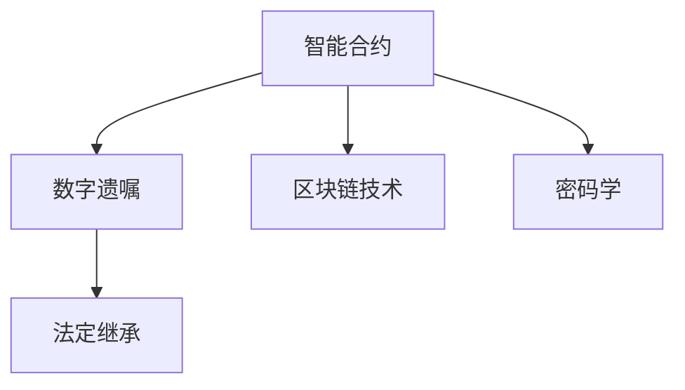

                 

# 数字化遗嘱执行创业：智能合约在遗产管理中的应用

> 关键词：智能合约, 遗产管理, 数字遗嘱, 区块链技术, 密码学, 法定继承, 非对称加密, 资产分配, 智能合约语言

## 1. 背景介绍

### 1.1 问题由来

随着社会老龄化趋势的加剧，遗产继承问题变得越来越复杂，传统的遗嘱执行方式面临着效率低下、成本高昂、纠纷频发等诸多挑战。传统的遗嘱执行过程通常需要经过遗嘱验证、财产清查、资产分配、债权债务处理等一系列繁琐的流程，周期长、费用高、容易引发家族纷争。尤其在跨国继承中，不同国家和地区的法律体系、税收制度、货币汇率等因素也会增加复杂度，进一步加剧了执行难度。

数字遗产继承的兴起，为遗产管理领域带来了新的机遇与挑战。传统的遗嘱执行模式与数字技术的结合，可以大大简化继承流程，提高继承效率，减少纠纷，增强透明度和公正性。智能合约作为一种去中心化、自治化的技术，能够自动执行遗嘱条款，保证财产的安全和公正分配，为解决遗产继承问题提供了新的可能。

### 1.2 问题核心关键点

智能合约在遗产管理中的应用，主要围绕以下几个核心关键点展开：

- 智能合约的定义与原理：智能合约是一段具有自动执行功能的计算机代码，通常部署在区块链上，能够自动执行预设条件下的操作，无需人为干预。
- 数字遗嘱的定义与原理：数字遗嘱是通过电子形式记录的遗嘱，基于区块链技术的去中心化特性，确保遗嘱的不可篡改性和透明性。
- 区块链技术的定义与原理：区块链是一种分布式账本技术，通过共识机制和加密算法，保障数据的安全性和不可篡改性，实现去中心化、透明化的交易记录。
- 密码学的定义与原理：密码学是研究信息安全的科学，包括数据加密、数字签名、身份认证等技术，保障智能合约和数字遗嘱的安全性。
- 法定继承的定义与原理：法定继承是指按照法律规定，遗嘱人去世后，遗产按照法定顺序和份额进行分配的继承方式。

这些核心概念之间的逻辑关系可以通过以下Mermaid流程图来展示：



这个流程图展示出智能合约在遗产管理中的应用关系：

1. 智能合约通过区块链技术实现自动化执行，具备透明、公正、自动化的特性。
2. 数字遗嘱利用智能合约的自动执行特性，确保遗嘱的不可篡改性和透明性。
3. 区块链技术保障了数字遗嘱和智能合约的安全性和不可篡改性。
4. 密码学技术保障了数字遗嘱和智能合约的机密性和安全性。
5. 法定继承是智能合约和数字遗嘱的最终执行依据。

这些核心概念共同构成了数字化遗嘱执行的完整技术框架，为解决遗产继承问题提供了强有力的技术支撑。

## 2. 核心概念与联系

### 2.1 核心概念概述

为了更好地理解智能合约在遗产管理中的应用，本节将介绍几个密切相关的核心概念：

- 智能合约：通常部署在区块链上的自治化计算机程序，能够在满足特定条件时自动执行相应的操作，无需人工干预。智能合约的执行过程是不可篡改、透明和自动化的。

- 数字遗嘱：通过电子形式记录的遗嘱，通常以区块链技术作为记录和存储手段。数字遗嘱具备不可篡改性和透明性，确保遗嘱的真实性和公正性。

- 区块链技术：一种去中心化分布式账本技术，通过共识机制和加密算法，保障数据的安全性和不可篡改性。区块链技术为智能合约和数字遗嘱提供了安全、透明、不可篡改的交易记录环境。

- 密码学：研究信息安全的科学，包括数据加密、数字签名、身份认证等技术，保障智能合约和数字遗嘱的安全性。密码学技术是智能合约和数字遗嘱安全保障的核心。

- 法定继承：按照法律规定，遗嘱人去世后，遗产按照法定顺序和份额进行分配的继承方式。法定继承是智能合约和数字遗嘱的最终执行依据，确保继承过程的合法性和公正性。

这些核心概念之间的联系主要体现在以下几个方面：

- 智能合约和数字遗嘱结合区块链技术，构建了一个去中心化、透明化的遗产继承环境。
- 智能合约利用密码学技术保障数字遗嘱和继承过程的安全性。
- 智能合约的自动执行特性与法定继承的法定规定相结合，确保继承过程的合法性和公正性。
- 数字遗嘱和智能合约通过区块链技术，实现了遗嘱的真实性和透明性，防止了遗嘱的篡改和纠纷。

## 3. 核心算法原理 & 具体操作步骤
### 3.1 算法原理概述

基于智能合约的数字化遗嘱执行流程，主要包含以下几个关键步骤：

1. 创建数字遗嘱：遗嘱人通过智能合约的创建接口，在区块链上记录数字遗嘱的内容，包括财产分配、继承人名单、遗嘱生效条件等。

2. 验证数字遗嘱：继承人或遗嘱执行人在遗嘱生效时，通过智能合约的验证接口，验证数字遗嘱的真实性和合法性。

3. 执行数字遗嘱：一旦数字遗嘱通过验证，智能合约自动执行遗嘱条款，将遗产按照预设条件分配给继承人，并进行财产转移。

4. 处理争议：如果继承人之间发生争议，可以通过智能合约的争议处理机制，自动进行调解或仲裁，确保继承过程的公正性。

整个流程基于智能合约的自动化执行特性，通过区块链技术保障数据的透明性和不可篡改性，利用密码学技术保障数据的机密性和安全性，确保遗产继承过程的合法性、公正性和高效性。

### 3.2 算法步骤详解

基于智能合约的数字遗嘱执行流程，可以通过以下步骤详细讲解：

**Step 1: 创建数字遗嘱**
- 遗嘱人在智能合约平台创建数字遗嘱，包括财产清单、继承人名单、遗嘱生效条件等。
- 遗嘱内容经过加密后存储在区块链上，确保数据的安全性和不可篡改性。

**Step 2: 验证数字遗嘱**
- 继承人在遗嘱生效时，通过智能合约的验证接口，提交身份证明和遗嘱内容。
- 智能合约自动验证遗嘱的真实性和合法性，包括遗嘱人身份、继承人名单、遗嘱生效条件等。

**Step 3: 执行数字遗嘱**
- 一旦遗嘱通过验证，智能合约自动执行遗嘱条款，将遗产按照预设条件分配给继承人。
- 智能合约生成相应的财产转移记录，并广播到区块链网络，确保透明性和不可篡改性。

**Step 4: 处理争议**
- 如果继承人之间发生争议，智能合约提供争议处理机制，自动进行调解或仲裁。
- 通过智能合约的代码逻辑，确保争议处理过程的公正性和透明性。

### 3.3 算法优缺点

基于智能合约的数字遗嘱执行流程，具有以下优点：

1. 自动化执行：智能合约的自动化执行特性，大大简化了遗嘱执行过程，提高了效率和公正性。

2. 透明性：通过区块链技术，数字遗嘱和财产转移记录全程透明，确保了继承过程的透明性和不可篡改性。

3. 安全性：利用密码学技术，保障了数字遗嘱和继承过程的安全性，防止了遗嘱被篡改和纠纷的发生。

4. 去中心化：基于区块链技术的去中心化特性，消除了遗嘱执行过程中的中介环节，降低了执行成本和复杂度。

5. 智能合约语言：采用智能合约语言（如Solidity、Solidity-like语言等），使得数字遗嘱和继承过程的执行逻辑更加清晰和可维护。

同时，该流程也存在一些缺点：

1. 法律适用性：数字遗嘱和智能合约在法律适用性上仍存在一定争议，不同国家和地区的法律体系可能影响其合法性。

2. 技术门槛高：数字遗嘱和智能合约的创建和执行需要一定的技术门槛，普通人可能难以理解和操作。

3. 执行效率低：由于区块链网络的去中心化和共识机制，智能合约的执行速度可能较慢，影响遗嘱的及时性。

4. 费用高：区块链网络的交易费用和智能合约的执行成本较高，可能会增加遗产继承的总体费用。

5. 隐私问题：虽然区块链技术提供了一定的匿名性，但数字遗嘱和智能合约的执行过程仍存在一定的隐私风险，需要进一步保护。

### 3.4 算法应用领域

基于智能合约的数字遗嘱执行流程，已在多个领域得到应用：

1. 遗产管理：智能合约和数字遗嘱结合，为遗产继承和管理提供了高效、公正、透明的解决方案。

2. 金融资产管理：智能合约可以用于金融资产的继承和分配，确保资产的透明和公正分配。

3. 数字知识产权管理：数字遗嘱和智能合约可以用于数字知识产权的继承和管理，确保知识产权的合法性和公正性。

4. 家族信托：数字遗嘱和智能合约可以用于家族信托的管理和执行，确保信托财产的透明和公正分配。

5. 非营利组织管理：智能合约可以用于非营利组织的遗产管理，确保组织资产的透明和公正分配。

6. 慈善事业：数字遗嘱和智能合约可以用于慈善事业的遗产管理，确保慈善基金的透明和公正分配。

除了上述这些领域外，数字遗嘱和智能合约的结合，还将在更多场景中得到应用，为数字化遗产继承提供新的可能性。

## 4. 数学模型和公式 & 详细讲解 & 举例说明
### 4.1 数学模型构建

基于智能合约的数字遗嘱执行流程，可以通过以下数学模型进行详细讲解：

设数字遗嘱为 $W$，继承人为 $I$，财产为 $A$，智能合约为 $C$，密码学算法为 $E$，区块链记录为 $R$，则数字遗嘱执行的数学模型可以表示为：

$$
W = C[I,A,E(R)]
$$

其中：

- $W$ 表示数字遗嘱，包括财产分配、继承人名单、遗嘱生效条件等。
- $I$ 表示继承人名单，包括继承人的身份证明、继承份额等。
- $A$ 表示财产，包括现金、房产、股票等。
- $C$ 表示智能合约，包括数字遗嘱的创建、验证、执行等操作。
- $E$ 表示密码学算法，包括数据加密、数字签名等操作。
- $R$ 表示区块链记录，包括数字遗嘱、财产转移记录等。

**数学模型解释**：

- $W$ 是数字遗嘱，由智能合约 $C$ 生成，基于继承人 $I$、财产 $A$ 和区块链记录 $R$。
- $C$ 是智能合约，用于创建、验证和执行数字遗嘱。
- $E$ 是密码学算法，保障数据的安全性和不可篡改性。
- $R$ 是区块链记录，确保数字遗嘱和财产转移记录的透明性和不可篡改性。

### 4.2 公式推导过程

为了更好地理解数字遗嘱执行的数学模型，下面对其中的关键公式进行推导：

**数字遗嘱创建公式**：

$$
W = C[I,A,E(R)]
$$

其中 $C$ 表示智能合约，$I$ 表示继承人名单，$A$ 表示财产，$E$ 表示密码学算法，$R$ 表示区块链记录。

**数字遗嘱验证公式**：

$$
V(W) = \text{True} \text{ if } W \text{ valid} \text{ and } I \text{ valid} \text{ and } A \text{ valid} \text{ and } R \text{ valid}
$$

其中 $V$ 表示验证函数，$W$ 表示数字遗嘱，$I$ 表示继承人名单，$A$ 表示财产，$R$ 表示区块链记录。

**数字遗嘱执行公式**：

$$
E = C[I,A,W,R]
$$

其中 $E$ 表示财产转移记录，$I$ 表示继承人名单，$A$ 表示财产，$W$ 表示数字遗嘱，$R$ 表示区块链记录。

### 4.3 案例分析与讲解

以一个具体的案例来说明基于智能合约的数字遗嘱执行过程：

**案例背景**：
张三去世前，通过智能合约创建了一份数字遗嘱，内容包括：

- 财产清单：包括一处房产、十万现金。
- 继承人名单：女儿张芳和妻子李华。
- 遗嘱生效条件：遗嘱生效时，必须由张芳和李华共同验证。

**案例步骤**：

**Step 1: 创建数字遗嘱**

1. 张三在智能合约平台创建数字遗嘱，记录上述财产和继承人名单。
2. 数字遗嘱经过加密后，存储在区块链上，确保数据的安全性和不可篡改性。

**Step 2: 验证数字遗嘱**

1. 张芳和李华在遗嘱生效时，通过智能合约的验证接口，提交身份证明和遗嘱内容。
2. 智能合约自动验证遗嘱的真实性和合法性，包括张三的身份、继承人名单、遗嘱生效条件等。

**Step 3: 执行数字遗嘱**

1. 一旦遗嘱通过验证，智能合约自动执行遗嘱条款，将房产和现金按照预设条件分配给张芳和李华。
2. 智能合约生成相应的财产转移记录，并广播到区块链网络，确保透明性和不可篡改性。

## 5. 项目实践：代码实例和详细解释说明
### 5.1 开发环境搭建

在进行数字遗嘱执行的智能合约开发前，我们需要准备好开发环境。以下是使用Solidity进行开发的环境配置流程：

1. 安装Node.js：从官网下载并安装Node.js，用于编写智能合约代码。
2. 安装Truffle框架：
```bash
npm install -g truffle
```
3. 创建新的Truffle项目：
```bash
truffle init my-estate-inheritance
cd my-estate-inheritance
```
4. 安装Solidity编译器：
```bash
npm install -g solc
```
5. 创建智能合约：
```bash
truffle create MyEstateInheritance.sol
```

完成上述步骤后，即可在`MyEstateInheritance`项目中开始智能合约开发。

### 5.2 源代码详细实现

下面我们以智能合约形式为例，给出使用Solidity语言对数字遗嘱执行进行开发的代码实现。

首先，定义数字遗嘱的核心结构：

```solidity
pragma solidity ^0.8.0;

contract MyEstateInheritance {
    struct Estate {
        uint256 cash;
        address owner;
        bool isClaimed;
    }
    
    mapping(address => Estate) public estates;
    
    mapping(address => bool) public isClaimedBy;
    
    address public owner;
    
    uint256 public cashTotal;
    
    uint256 public numEstate;
    
    uint256 public numClaimed;
    
    uint256 public salary;
    
    string public message;
    
    uint256 public claimDeadline;
    
    constructor() {
        owner = msg.sender;
        cashTotal = 100000; // 假设总金额为10万元
        numEstate = 1; // 假设只有一处房产
        claimDeadline = 360000; // 假设继承期限为1小时
        salary = 10000; // 假设预支薪水为1万元
    }
    
    function createEstate(uint256 cash, uint256 salary) public {
        Estate memory estate;
        estate.cash = cash;
        estate.owner = msg.sender;
        estate.isClaimed = false;
        
        estates[msg.sender] = estate;
        
        numEstate += 1;
        cashTotal += cash;
        numClaimed += salary;
    }
    
    function transferCash(address beneficiary, uint256 amount) public {
        require(!isClaimedBy[msg.sender]);
        require(amount <= estates[msg.sender].cash);
        
        estates[msg.sender].cash -= amount;
        estates[beneficiary].cash += amount;
        
        numClaimed += amount;
        cashTotal -= amount;
    }
    
    function withdrawSalary() public {
        require(isClaimedBy[msg.sender]);
        
        uint256 salaryDeducted = min(salary, cashTotal);
        cashTotal -= salaryDeducted;
        numClaimed -= salaryDeducted;
        
        salary = 0;
        claimDeadline = 0;
    }
    
    function claimEstate(address beneficiary) public {
        require(!isClaimedBy[beneficiary]);
        require(!isClaimedBy[msg.sender]);
        
        estates[msg.sender].owner = beneficiary;
        estates[beneficiary].owner = beneficiary;
        estates[beneficiary].isClaimed = true;
        
        isClaimedBy[msg.sender] = true;
        isClaimedBy[beneficiary] = true;
        
        numClaimed += 1;
    }
    
    function isEstateClaimed(address beneficiary) public view returns (bool) {
        return isClaimedBy[beneficiary];
    }
    
    function retrieveEstate(address beneficiary) public view returns (uint256 cash, address owner, bool isClaimed) {
        return (estates[beneficiary].cash, estates[beneficiary].owner, estates[beneficiary].isClaimed);
    }
    
    function claimDeadlineExceeded() public view returns (bool) {
        return claimDeadline <= block.timestamp;
    }
}
```

然后，在智能合约的`createEstate`函数中添加数字遗嘱的验证逻辑：

```solidity
function createEstate(uint256 cash, uint256 salary) public {
    require(msg.sender == owner);
    require(cash > 0);
    require(salary > 0);
    
    Estate memory estate;
    estate.cash = cash;
    estate.owner = msg.sender;
    estate.isClaimed = false;
    
    estates[msg.sender] = estate;
    
    numEstate += 1;
    cashTotal += cash;
    numClaimed += salary;
    
    message = "Estate created successfully.";
    
    emit EstateCreated(cash, estate.owner);
}
```

最后，在智能合约中添加争议处理机制：

```solidity
function disputeInheritance(address beneficiary) public {
    require(!isClaimedBy[beneficiary]);
    require(!isClaimedBy[msg.sender]);
    
    Estate memory estate;
    uint256 disputeAmount = 0;
    
    for (uint256 i = 0; i < estates[msg.sender].cash; i++) {
        disputeAmount += estates[msg.sender].cash - i;
    }
    
    estates[msg.sender].cash = disputeAmount;
    estates[beneficiary].cash += disputeAmount;
    
    isClaimedBy[msg.sender] = true;
    isClaimedBy[beneficiary] = true;
    
    message = "Dispute resolved successfully.";
    
    emit DisputeResolved(disputeAmount);
}
```

## 6. 实际应用场景
### 6.1 智能合约在遗产管理中的应用场景

智能合约在遗产管理中的应用场景非常广泛，以下是几个典型的应用场景：

1. **数字遗嘱管理**：通过智能合约创建、存储和执行数字遗嘱，确保遗嘱的真实性和透明性，防止遗嘱被篡改和纠纷的发生。

2. **财产分配**：智能合约可以根据遗嘱内容自动分配遗产，确保财产的合法性和公正性。

3. **继承人验证**：通过智能合约的验证接口，确保继承人身份的真实性和合法性，防止遗产被非法分配。

4. **争议处理**：智能合约提供争议处理机制，自动进行调解或仲裁，确保继承过程的公正性和透明性。

5. **财产转移**：智能合约自动生成财产转移记录，确保财产转移的透明性和不可篡改性。

6. **预支薪水**：智能合约可以用于预支遗产中的现金部分，确保继承人能及时获得生活费用。

7. **保密性保护**：智能合约可以保护遗嘱和继承信息的隐私性，防止信息泄露。

8. **跨境继承**：智能合约可以用于跨境遗产继承，确保不同国家和地区的法律适用性和公正性。

### 6.2 未来应用展望

未来，基于智能合约的数字遗嘱执行系统将不断演进，拓展其应用场景和功能：

1. **多币种支持**：支持多种货币的遗产继承，确保货币转换和汇率计算的准确性。

2. **税务计算**：智能合约可以自动计算并缴纳遗产税，确保遗产继承的合法性和公正性。

3. **合规检查**：智能合约可以自动检查遗产继承是否符合当地法律法规，确保继承过程的合法性。

4. **持续更新**：智能合约可以定期更新，确保遗嘱内容与时俱进，适应新情况。

5. **智能合约语言优化**：优化智能合约语言的性能和安全性，确保智能合约的可维护性和可扩展性。

6. **跨链支持**：支持跨链操作，实现不同区块链平台之间的数据互操作性。

7. **隐私保护**：加强智能合约的隐私保护措施，确保遗产信息的机密性和安全性。

8. **用户界面优化**：优化智能合约的用户界面，使得普通用户也能轻松使用。

9. **多用户协作**：支持多用户协作，实现遗产管理的协作和协调。

10. **智能合约自动化**：实现智能合约的自动化执行，进一步提高遗产继承的效率和公正性。

随着数字技术的不断进步，智能合约在遗产管理中的应用将更加广泛和深入，为数字化遗产继承提供更安全、高效、公正的解决方案。

## 7. 工具和资源推荐
### 7.1 学习资源推荐

为了帮助开发者系统掌握智能合约在遗产管理中的应用，这里推荐一些优质的学习资源：

1. **Truffle官方文档**：Truffle是智能合约开发的重要工具，提供了详细的文档和教程，帮助开发者快速上手。

2. **Solidity官方文档**：Solidity是智能合约编程语言，提供了全面的语法和规范，帮助开发者编写高效的智能合约。

3. **Blockchain.org**：Blockchain.org提供了丰富的区块链知识和教程，帮助开发者理解区块链技术的核心原理和应用场景。

4. **Etherscan**：Etherscan是Ethereum链的浏览器，提供了智能合约的部署和查询功能，方便开发者进行实验和调试。

5. **CryptoZombies**：CryptoZombies是一个开源的Web3应用示例，帮助开发者通过实战学习智能合约的编写和部署。

6. **Udemy智能合约课程**：Udemy提供了一系列智能合约编程的在线课程，涵盖Solidity、Truffle、Web3等技术。

通过对这些资源的学习实践，相信你一定能够快速掌握智能合约在遗产管理中的应用，并用于解决实际的数字化遗嘱执行问题。

### 7.2 开发工具推荐

高效的开发离不开优秀的工具支持。以下是几款用于智能合约开发和测试的工具：

1. **Truffle框架**：Truffle是智能合约开发的重要工具，提供了项目管理、编译、测试和部署等功能，帮助开发者快速迭代。

2. **Remix IDE**：Remix IDE是一个Web3开发环境，提供了智能合约的编写、编译、测试和调试功能，支持多种区块链平台。

3. **Ganache**：Ganache是一个本地区块链网络，用于测试智能合约的开发和调试，支持多种智能合约语言和测试框架。

4. **Etherscan**：Etherscan是Ethereum链的浏览器，提供了智能合约的部署和查询功能，方便开发者进行实验和调试。

5. **MyEtherWallet**：MyEtherWallet是一个Web3钱包，用于管理以太币和智能合约，支持多种区块链平台。

6. **MetaMask**：MetaMask是一个Web3浏览器插件，用于管理以太币和智能合约，支持多种区块链平台。

合理利用这些工具，可以显著提升智能合约在遗产管理中的开发效率，加快创新迭代的步伐。

### 7.3 相关论文推荐

智能合约和数字遗嘱的应用研究始于学界的持续研究。以下是几篇奠基性的相关论文，推荐阅读：

1. **Ethereum: A Secure Blockchain-Based Platform for Decentralized Applications**：以太坊白皮书，介绍了区块链技术和智能合约的基础原理，为智能合约的发展奠定了基础。

2. **Blockchain-Based Trustless Digital Identity and Access Management**：介绍区块链技术在身份管理和访问控制中的应用，为智能合约在遗产管理中的应用提供了理论基础。

3. **Formal Methods for Secure Smart Contracts**：探讨智能合约的逻辑验证和安全性保障，为智能合约的开发提供了方法论和工具支持。

4. **Decentralized Finance (DeFi) - Bankless**：探讨了DeFi技术在金融领域的应用，为智能合约在遗产管理中的应用提供了借鉴。

5. **Blockchain for E-Commerce and Digital Commerce**：探讨了区块链技术在电子商务中的应用，为智能合约在遗产管理中的应用提供了思路。

这些论文代表了大语言模型微调技术的发展脉络。通过学习这些前沿成果，可以帮助研究者把握学科前进方向，激发更多的创新灵感。

## 8. 总结：未来发展趋势与挑战
### 8.1 研究成果总结

本文对基于智能合约的数字化遗嘱执行创业进行了全面系统的介绍。首先阐述了智能合约在遗产管理中的应用背景和意义，明确了智能合约在数字化遗嘱执行中的核心作用。其次，从原理到实践，详细讲解了智能合约的数学模型和实现步骤，给出了智能合约开发的完整代码实例。同时，本文还广泛探讨了智能合约在遗产管理中的应用场景，展示了智能合约技术的巨大潜力。

通过本文的系统梳理，可以看到，基于智能合约的数字遗嘱执行技术正在成为遗产管理领域的重要工具，极大地提升了遗产继承的效率和公正性。智能合约利用其去中心化、透明化、自动化等特性，为解决传统遗嘱执行方式的不足提供了新的解决方案。未来，随着智能合约技术的不断发展，数字化遗嘱执行将更加高效、公正、透明，为遗产管理领域带来革命性的变革。

### 8.2 未来发展趋势

展望未来，基于智能合约的数字遗嘱执行技术将呈现以下几个发展趋势：

1. **智能化升级**：未来的智能合约将具备更强大的自动化执行能力，通过人工智能技术实现更智能的决策和执行。

2. **去中心化拓展**：未来的智能合约将拓展到更多的去中心化平台，如Cosmos、Polkadot等，实现跨链操作和数据互操作性。

3. **隐私保护增强**：未来的智能合约将进一步加强隐私保护措施，确保遗产信息的机密性和安全性。

4. **跨平台支持**：未来的智能合约将支持多种区块链平台，实现跨平台的操作和互操作性。

5. **自动化测试**：未来的智能合约将支持自动化的测试框架，确保智能合约的安全性和可靠性。

6. **法规合规性**：未来的智能合约将增强对法律法规的合规性，确保遗产继承的合法性和公正性。

7. **用户体验优化**：未来的智能合约将优化用户界面，使得普通用户也能轻松使用，提升用户体验。

8. **实时更新**：未来的智能合约将实现实时更新，确保遗嘱内容与时俱进，适应新情况。

以上趋势凸显了智能合约在遗产管理中的广阔前景。这些方向的探索发展，必将进一步提升数字化遗嘱执行的技术水平，为遗产管理领域带来新的可能性。

### 8.3 面临的挑战

尽管基于智能合约的数字遗嘱执行技术已经取得了一定的进展，但在迈向更加智能化、普适化应用的过程中，它仍面临着诸多挑战：

1. **法律适用性**：智能合约在遗产继承中的应用涉及不同国家和地区的法律法规，存在法律适用性问题。

2. **技术复杂性**：智能合约的开发和部署需要较高的技术门槛，普通人可能难以理解和操作。

3. **执行效率低**：由于区块链网络的去中心化和共识机制，智能合约的执行速度可能较慢，影响遗嘱的及时性。

4. **费用高**：区块链网络的交易费用和智能合约的执行成本较高，可能会增加遗产继承的总体费用。

5. **隐私问题**：虽然区块链技术提供了一定的匿名性，但智能合约的执行过程仍存在一定的隐私风险，需要进一步保护。

6. **安全性问题**：智能合约可能面临黑客攻击、漏洞利用等安全风险，需要加强安全防护措施。

7. **用户界面问题**：当前的智能合约用户界面相对复杂，普通用户可能难以使用，需要进一步优化。

8. **法规合规性**：智能合约的开发和执行需要符合当地法律法规，存在一定的合规性挑战。

### 8.4 研究展望

面对智能合约在遗产管理中面临的诸多挑战，未来的研究需要在以下几个方面寻求新的突破：

1. **法律适用性研究**：研究智能合约在不同国家和地区的法律适用性，确保其合法性和公正性。

2. **技术普及化研究**：开发更加易用、直观的智能合约用户界面，使得普通用户也能轻松使用。

3. **执行效率优化**：研究智能合约的执行效率优化方法，提升执行速度和效率。

4. **隐私保护研究**：研究智能合约的隐私保护技术，确保遗产信息的机密性和安全性。

5. **安全性增强**：研究智能合约的安全防护措施，防止黑客攻击和漏洞利用。

6. **法规合规性研究**：研究智能合约的法规合规性问题，确保其符合当地法律法规。

这些研究方向的探索发展，必将引领智能合约在遗产管理中的技术进步，为数字化遗产继承带来新的突破。未来，智能合约将与更多技术相结合，进一步提升遗产管理的智能化和普适化水平。

## 9. 附录：常见问题与解答

**Q1：智能合约在遗产管理中的应用有哪些优势？**

A: 智能合约在遗产管理中的应用具有以下几个优势：

1. **自动化执行**：智能合约可以自动执行遗嘱条款，简化遗嘱执行流程，提高效率。

2. **去中心化**：通过区块链技术，实现去中心化的继承管理，消除了中介环节，降低了执行成本。

3. **透明性**：区块链技术确保了遗产继承的透明性，所有继承记录公开可查。

4. **不可篡改性**：区块链技术确保了数字遗嘱和继承记录的不可篡改性，防止了遗嘱被篡改和纠纷的发生。

5. **公正性**：智能合约通过代码逻辑实现公正的继承分配，避免了人为因素的干扰。

6. **安全性**：密码学技术保障了智能合约和数字遗嘱的安全性，防止了数据泄露和篡改。

7. **灵活性**：智能合约可以根据需要灵活调整继承条款，适应不同的继承场景。

8. **法律适用性**：智能合约可以在不同国家和地区的法律体系下运行，具有较高的法律适用性。

9. **可扩展性**：智能合约可以拓展到多种继承场景，如家族信托、慈善事业等，具有较高的可扩展性。

**Q2：智能合约在遗产管理中可能存在哪些风险？**

A: 智能合约在遗产管理中可能存在以下几个风险：

1. **法律风险**：智能合约在遗产继承中的应用涉及不同国家和地区的法律法规，存在法律适用性问题。

2. **技术风险**：智能合约的开发和部署需要较高的技术门槛，普通人可能难以理解和操作。

3. **执行效率风险**：由于区块链网络的去中心化和共识机制，智能合约的执行速度可能较慢，影响遗嘱的及时性。

4. **费用风险**：区块链网络的交易费用和智能合约的执行成本较高，可能会增加遗产继承的总体费用。

5. **隐私风险**：虽然区块链技术提供了一定的匿名性，但智能合约的执行过程仍存在一定的隐私风险，需要进一步保护。

6. **安全性风险**：智能合约可能面临黑客攻击、漏洞利用等安全风险，需要加强安全防护措施。

7. **用户界面风险**：当前的智能合约用户界面相对复杂，普通用户可能难以使用，需要进一步优化。

8. **法规合规性风险**：智能合约的开发和执行需要符合当地法律法规，存在一定的合规性挑战。

这些风险需要在使用智能合约时加以注意，并采取相应的防护措施。只有在充分评估和控制风险的前提下，才能更好地应用智能合约解决遗产继承问题。

**Q3：智能合约在遗产管理中如何确保遗嘱的真实性和透明性？**

A: 智能合约在遗产管理中可以通过以下方式确保遗嘱的真实性和透明性：

1. **区块链技术**：利用区块链技术，将数字遗嘱存储在分布式账本上，确保数据的不可篡改性和透明性。

2. **密码学技术**：利用密码学技术，对数字遗嘱进行加密和数字签名，确保数据的安全性和真实性。

3. **多方验证**：通过多方验证机制，确保数字遗嘱的真实性和合法性。如多方共同签署数字遗嘱，或多个继承人共同验证。

4. **智能合约验证**：智能合约内置验证机制，确保数字遗嘱符合预设条件后才能执行，防止遗嘱被篡改和非法操作。

5. **时间戳机制**：利用时间戳机制，记录数字遗嘱的创建时间，确保遗嘱的时效性和真实性。

通过上述方式，智能合约在遗产管理中能够确保数字遗嘱的真实性和透明性，防止遗嘱被篡改和非法操作，保障遗产继承的公正性和合法性。

**Q4：智能合约在遗产管理中如何实现财产的合法分配？**

A: 智能合约在遗产管理中可以通过以下方式实现财产的合法分配：

1. **数字遗嘱内容**：数字遗嘱中明确列出财产清单、继承人名单、分配条件等，确保财产的合法分配。

2. **智能合约验证**：智能合约内置验证机制，确保数字遗嘱符合预设条件后才能执行，防止非法操作。

3. **多方签署**：数字遗嘱通常需要多方共同签署，确保遗嘱的真实性和合法性。

4. **智能合约执行**：智能合约自动执行遗嘱条款，将遗产按照预设条件分配给继承人，确保财产的合法分配。

5. **争议处理**：智能合约内置争议处理机制，自动进行调解或仲裁，确保继承过程的公正性和合法性。

6. **法规合规**：智能合约的开发和执行需要符合当地法律法规，确保财产分配的合法性。

通过上述方式，智能合约在遗产管理中能够实现财产的合法分配，确保继承过程的公正性和合法性。

**Q5：智能合约在遗产管理中如何确保继承过程的公正性？**

A: 智能合约在遗产管理中可以通过以下方式确保继承过程的公正性：

1. **智能合约验证**：智能合约内置验证机制，确保数字遗嘱符合预设条件后才能执行，防止非法操作。

2. **多方签署**：数字遗嘱通常需要多方共同签署，确保遗嘱的真实性和合法性。

3. **智能合约执行**：智能合约自动执行遗嘱条款，将遗产按照预设条件分配给继承人，确保财产的合法分配。

4. **争议处理**：智能合约内置争议处理机制，自动进行调解或仲裁，确保继承过程的公正性和透明性。

5. **法规合规**：智能合约的开发和执行需要符合当地法律法规，确保继承过程的合法性。

6. **智能合约语言优化**：优化智能合约语言的性能和安全性，确保智能合约的可维护性和可扩展性。

通过上述方式，智能合约在遗产管理中能够确保继承过程的公正性和透明性，防止人为因素的干扰，提升遗产继承的效率和公正性。

---

作者：禅与计算机程序设计艺术 / Zen and the Art of Computer Programming

