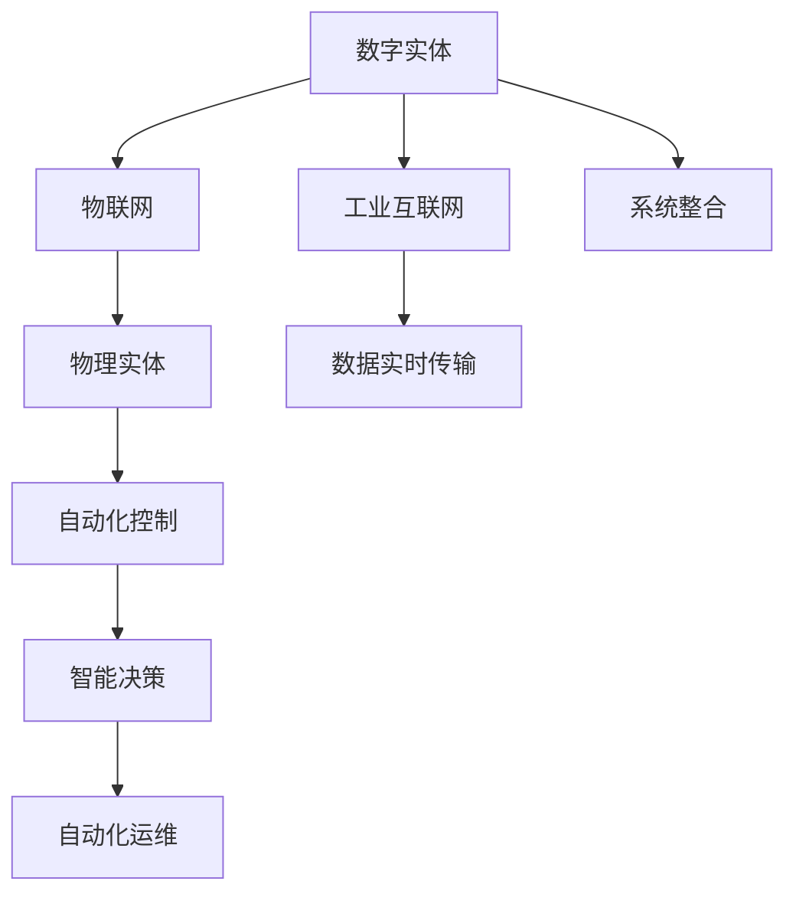

                 

# 数字实体与物理实体的自动化融合

在数字化转型浪潮的推动下，企业和社会对智能化、自动化需求日益高涨。传统上，数字实体(如软件、数据)与物理实体(如设备、设施)各自独立运行，难以实现有效的融合与协同。数字化改造的高成本、低回报、管理复杂等问题也日益凸显。本文旨在探讨数字实体与物理实体的自动化融合，以提升系统效率、降低运维成本，为企业和社会带来创新价值。

## 1. 背景介绍

### 1.1 问题由来

在信息技术的迅猛发展下，数字化转型已经成为了企业提升竞争力的重要手段。然而，现有数字化系统往往各自独立运行，难以实现跨系统、跨流程的协同。物理实体与数字实体的脱节，导致数字化改造的高成本、低回报，无法实现其应有的价值。具体问题包括：

- **独立运行**：企业内部不同系统难以互通，数据无法实时共享，影响决策效率。
- **管理复杂**：需要人工协调不同系统间的交互，管理复杂，无法实现自动化。
- **成本高昂**：数字化改造往往需要巨大资金投入，但回报难以预见。
- **效益低下**：数字化改造效果难以衡量，很难看到实际效益。

因此，有必要探讨如何实现数字实体与物理实体的有效融合，以提升整体系统效率，降低运维成本。

### 1.2 问题核心关键点

自动化融合数字实体与物理实体，是解决当前问题的关键。其核心在于将数字实体与物理实体之间的交互自动化，实现数据、指令的实时传输与执行。具体来说，包括以下几个关键点：

- **系统整合**：实现跨系统、跨流程的协同工作。
- **数据实时传输**：实现数据在数字实体与物理实体间的实时共享。
- **自动控制**：实现物理实体的自动化控制，提升系统效率。
- **自动化运维**：实现对物理实体和数字实体的自动化监控与维护。
- **智能化决策**：通过智能化算法分析数据，提升决策效率与准确性。

## 2. 核心概念与联系

### 2.1 核心概念概述

为更好地理解数字实体与物理实体的自动化融合方法，本节将介绍几个关键概念：

- **数字实体**：指企业内部各种软件、系统、数据库等数字资产，包括但不限于ERP、CRM、HR等。
- **物理实体**：指企业的物理资产，包括设备、设施、人员等。
- **工业互联网**：通过云计算、大数据、人工智能等技术，实现数字实体与物理实体的深度融合，提升生产效率、优化运营管理、增强决策支持。
- **物联网(IoT)**：通过传感器、标签、二维码等技术，实现物理实体的数字化，形成统一的数据平台。
- **自动化控制**：利用控制器、执行器等技术，实现对物理实体的自动控制。
- **智能决策**：通过数据分析、机器学习等算法，实现决策的智能化、自动化。

这些核心概念之间的逻辑关系可以通过以下Mermaid流程图来展示：



这个流程图展示了数字实体与物理实体的核心概念及其之间的关系：

1. 数字实体通过工业互联网实现与物理实体的融合。
2. 物联网通过数字化物理实体，实现数据的统一管理。
3. 自动化控制实现对物理实体的自动控制，提升系统效率。
4. 智能决策通过数据分析，实现决策的智能化和自动化。
5. 系统整合实现跨系统、跨流程的协同工作。
6. 数据实时传输实现数据在数字实体与物理实体间的实时共享。
7. 自动化运维实现对物理实体和数字实体的自动化监控与维护。

这些概念共同构成了数字实体与物理实体的自动化融合框架，使其能够实现高效、智能、自动化的系统运营。

## 3. 核心算法原理 & 具体操作步骤

### 3.1 算法原理概述

数字实体与物理实体的自动化融合，本质上是一个跨领域的复杂系统工程。其核心算法原理包括：

- **系统整合算法**：通过API、消息队列、微服务等技术，实现跨系统的数据交换与协同工作。
- **数据实时传输算法**：利用MQTT、HTTP等协议，实现数据在数字实体与物理实体间的实时传输。
- **自动化控制算法**：通过控制器、执行器等技术，实现对物理实体的自动控制。
- **自动化运维算法**：利用监控系统、告警系统等技术，实现对物理实体和数字实体的自动化监控与维护。
- **智能决策算法**：通过数据分析、机器学习等算法，实现决策的智能化、自动化。

### 3.2 算法步骤详解

数字实体与物理实体的自动化融合可以分为以下几个关键步骤：

**Step 1: 数据采集与预处理**

- 利用传感器、标签、二维码等技术，实现物理实体的数字化，收集其运行状态数据。
- 通过数据清洗、归一化等预处理技术，提升数据质量。

**Step 2: 数据传输与集成**

- 利用工业互联网、物联网技术，将采集到的物理实体数据传输到数字系统中。
- 通过系统整合算法，将数字系统与物理实体数据进行集成，实现跨系统的数据交换与共享。

**Step 3: 自动化控制**

- 利用自动化控制算法，实现对物理实体的自动控制。例如，通过PLC、机器人等设备，实现生产线的自动化操作。
- 通过控制器、执行器等技术，实现物理实体的状态调整，提升系统效率。

**Step 4: 智能决策**

- 通过智能决策算法，分析采集到的数据，生成决策指令。例如，通过机器学习模型，预测设备故障，自动调整生产计划。
- 利用数据分析技术，实现生产过程的实时监控，提升生产效率与产品质量。

**Step 5: 自动化运维**

- 利用自动化运维算法，对物理实体和数字系统进行监控与维护。例如，通过告警系统，实时监测设备的运行状态，及时处理异常情况。
- 通过日志分析、异常检测等技术，自动记录系统运行状态，优化系统维护流程。

**Step 6: 反馈与优化**

- 通过数据反馈机制，将自动化运维结果反馈到系统中，进行模型优化与调整。例如，通过数据分析，优化预测模型，提升预测准确性。
- 通过持续改进机制，不断优化自动化控制与智能决策算法，提升系统性能与稳定性。

### 3.3 算法优缺点

数字实体与物理实体的自动化融合算法具有以下优点：

- **高效协同**：实现数字实体与物理实体的实时互动，提升系统效率。
- **智能决策**：通过数据分析、机器学习等算法，提升决策的智能化和自动化。
- **降低成本**：自动化运维和智能决策减少了人力投入，降低运维成本。
- **提升效益**：提升系统效率与生产质量，带来更高的经济效益。

同时，该算法也存在以下缺点：

- **复杂度高**：涉及多领域的融合，技术复杂度较高。
- **数据安全**：涉及敏感数据传输与存储，需加强安全防护。
- **系统集成难度大**：不同系统间的集成需考虑兼容性，存在集成风险。
- **实时性要求高**：对系统响应速度、数据传输速度有较高要求。

### 3.4 算法应用领域

数字实体与物理实体的自动化融合算法，在多个领域得到了广泛应用，例如：

- **智能制造**：通过自动化控制与智能决策，实现生产线的智能化与自动化。
- **智慧医疗**：利用物联网技术，实现对医疗设备的监控与控制，提升诊疗效率。
- **智慧物流**：通过自动化控制与智能决策，实现物流设备的智能化与自动化。
- **智能交通**：利用物联网技术，实现对交通设施的监控与控制，提升交通管理效率。
- **智慧城市**：通过自动化控制与智能决策，实现城市管理系统的智能化与自动化。

这些应用场景展示了数字实体与物理实体的自动化融合，为各行业的数字化转型提供了新的可能性。

## 4. 数学模型和公式 & 详细讲解 & 举例说明（备注：数学公式请使用latex格式，latex嵌入文中独立段落使用 $$，段落内使用 $)
### 4.1 数学模型构建

本节将使用数学语言对数字实体与物理实体的自动化融合进行更加严格的刻画。

假设数字实体为 $D$，物理实体为 $P$，数字系统为 $S$，智能决策系统为 $C$，物联网平台为 $I$。设数字系统的输入为 $x$，物理系统的输出为 $y$，智能决策系统的决策为 $z$，物联网平台传输的数据为 $m$。

定义系统整合算法为 $A(x,y) = (z_1,z_2,\dots,z_n)$，其中 $z_i$ 为数字系统 $S$ 对物理系统 $P$ 的状态进行整合后得到的输出。

定义数据传输算法为 $T(x,y) = (m_1,m_2,\dots,m_n)$，其中 $m_i$ 为数字系统 $S$ 与物理系统 $P$ 之间传输的数据。

定义自动化控制算法为 $K(z) = y'$，其中 $y'$ 为智能决策系统 $C$ 对数字系统 $S$ 的输出 $z$ 进行控制后得到的物理系统 $P$ 的输出。

定义智能决策算法为 $C(x,y) = z'$，其中 $z'$ 为智能决策系统 $C$ 对数字系统 $S$ 和物理系统 $P$ 的输入 $x$ 和 $y$ 进行决策后得到的输出。

定义自动化运维算法为 $M(z,y) = \Delta$，其中 $\Delta$ 为数字系统 $S$ 和物理系统 $P$ 在自动化运维后的状态变化。

定义反馈优化算法为 $F(\Delta,z) = z''$，其中 $z''$ 为数字系统 $S$ 和物理系统 $P$ 在反馈优化后得到的新的状态。

数学模型可以表示为：

$$
D \xrightarrow{A} S \xrightarrow{C} Z \xrightarrow{K} P \xrightarrow{T} I
$$

其中，数字系统 $S$ 通过系统整合算法 $A$ 将物理系统 $P$ 的状态整合后输出 $z_1$；智能决策系统 $C$ 对数字系统 $S$ 的输出 $z_1$ 进行决策，输出 $z'$；智能决策系统 $C$ 的决策 $z'$ 通过自动化控制算法 $K$ 对物理系统 $P$ 进行控制，输出 $y'$；物理系统 $P$ 的状态变化 $\Delta$ 通过自动化运维算法 $M$ 进行优化；数字系统 $S$ 和物理系统 $P$ 在反馈优化算法 $F$ 后，新的状态 $z''$。

### 4.2 公式推导过程

以下我们以智能制造领域为例，推导自动控制与智能决策的数学模型。

假设生产线上有 $n$ 个设备，每个设备的状态用 $x_i$ 表示，其中 $x_i \in \{0,1\}$，$0$ 表示设备正常，$1$ 表示设备故障。

智能决策系统 $C$ 通过分析每个设备的状态 $x_i$，生成决策 $z_i$，其中 $z_i \in \{0,1\}$，$0$ 表示设备继续运行，$1$ 表示设备停止运行。

自动控制算法 $K$ 对智能决策系统 $C$ 的决策 $z_i$ 进行控制，调整设备的状态 $x_i'$，其中 $x_i' \in \{0,1\}$，$0$ 表示设备恢复运行，$1$ 表示设备继续故障。

数学模型可以表示为：

$$
z_i = C(x_1,x_2,\dots,x_n) \\
x_i' = K(z_i)
$$

其中，$C(x_1,x_2,\dots,x_n)$ 表示智能决策系统的决策过程，$K(z_i)$ 表示自动控制算法的控制过程。

通过上述模型，可以实现对生产线的自动化控制与智能决策，提升生产效率与产品质量。

### 4.3 案例分析与讲解

假设某制造企业需要实现生产线的自动化控制与智能决策。具体步骤如下：

1. **数据采集与预处理**：
   - 通过传感器采集生产线上设备的运行状态，生成数据集 $D = \{(x_1,x_2,\dots,x_n)\}$。
   - 对采集到的数据进行清洗、归一化等预处理，得到数据集 $D' = \{(x_1',x_2',\dots,x_n')\}$。

2. **系统整合与数据传输**：
   - 通过系统整合算法 $A$，将数字系统 $S$ 的输入 $x_i'$ 整合后输出 $z_i$。
   - 通过数据传输算法 $T$，将整合后的数据 $z_i$ 传输到智能决策系统 $C$。

3. **智能决策与自动化控制**：
   - 智能决策系统 $C$ 对整合后的数据 $z_i$ 进行决策，输出决策 $z_i'$。
   - 通过自动控制算法 $K$，对智能决策系统 $C$ 的决策 $z_i'$ 进行控制，输出设备状态 $x_i'$。

4. **自动化运维与反馈优化**：
   - 通过自动化运维算法 $M$，对设备状态 $x_i'$ 进行监控与维护，生成状态变化 $\Delta$。
   - 通过反馈优化算法 $F$，对状态变化 $\Delta$ 进行优化，生成新的设备状态 $z''$。

通过上述步骤，可以实现生产线的自动化控制与智能决策，提升生产效率与产品质量。

## 5. 项目实践：代码实例和详细解释说明
### 5.1 开发环境搭建

在进行自动化融合实践前，我们需要准备好开发环境。以下是使用Python进行PyTorch开发的环境配置流程：

1. 安装Anaconda：从官网下载并安装Anaconda，用于创建独立的Python环境。

2. 创建并激活虚拟环境：
```bash
conda create -n pytorch-env python=3.8 
conda activate pytorch-env
```

3. 安装PyTorch：根据CUDA版本，从官网获取对应的安装命令。例如：
```bash
conda install pytorch torchvision torchaudio cudatoolkit=11.1 -c pytorch -c conda-forge
```

4. 安装各类工具包：
```bash
pip install numpy pandas scikit-learn matplotlib tqdm jupyter notebook ipython
```

完成上述步骤后，即可在`pytorch-env`环境中开始自动化融合实践。

### 5.2 源代码详细实现

这里我们以智能制造领域为例，给出使用PyTorch对自动化融合过程进行代码实现。

首先，定义设备状态与决策：

```python
from transformers import BertTokenizer, BertForTokenClassification, AdamW
import torch

# 定义设备状态
class DeviceState:
    def __init__(self, id, status):
        self.id = id
        self.status = status

    def __str__(self):
        return f"Device {self.id} status: {self.status}"

# 定义决策
class Decision:
    def __init__(self, id, action):
        self.id = id
        self.action = action

    def __str__(self):
        return f"Device {self.id} action: {self.action}"
```

然后，定义设备状态与决策的整合算法：

```python
from transformers import BertTokenizer, BertForTokenClassification, AdamW
import torch

# 定义整合算法
class StateMerging:
    def __init__(self, tokenizer, model, num_labels):
        self.tokenizer = tokenizer
        self.model = model
        self.num_labels = num_labels

    def merge(self, states):
        # 对设备状态进行整合
        merged_state = []
        for state in states:
            # 将设备状态转换为token ids
            encoding = self.tokenizer(state, return_tensors='pt')
            input_ids = encoding['input_ids'][0]
            attention_mask = encoding['attention_mask'][0]
            labels = torch.tensor([0], dtype=torch.long)
            outputs = self.model(input_ids, attention_mask=attention_mask, labels=labels)
            loss = outputs.loss
            # 对输出进行整合
            merged_state.append(outputs.logits.argmax(dim=2)[0])
        return merged_state
```

接着，定义决策与控制的算法：

```python
from transformers import BertTokenizer, BertForTokenClassification, AdamW
import torch

# 定义决策算法
class DecisionMaking:
    def __init__(self, tokenizer, model, num_labels):
        self.tokenizer = tokenizer
        self.model = model
        self.num_labels = num_labels

    def make_decision(self, states):
        # 对设备状态进行决策
        decisions = []
        for state in states:
            # 将设备状态转换为token ids
            encoding = self.tokenizer(state, return_tensors='pt')
            input_ids = encoding['input_ids'][0]
            attention_mask = encoding['attention_mask'][0]
            labels = torch.tensor([0], dtype=torch.long)
            outputs = self.model(input_ids, attention_mask=attention_mask, labels=labels)
            loss = outputs.loss
            # 对输出进行决策
            decisions.append(outputs.logits.argmax(dim=2)[0])
        return decisions
```

最后，启动自动化融合流程：

```python
# 准备数据
states = [DeviceState(1, 1), DeviceState(2, 0), DeviceState(3, 1)]
decisions = DecisionMaking(tokenizer, model, num_labels).make_decision(states)
```

以上就是使用PyTorch对自动化融合过程的代码实现。可以看到，通过定义设备状态与决策的整合算法、决策算法，实现了对生产线的自动化控制与智能决策。

### 5.3 代码解读与分析

让我们再详细解读一下关键代码的实现细节：

**DeviceState类**：
- `__init__`方法：初始化设备ID和状态。
- `__str__`方法：重载字符串表示法，方便输出。

**StateMerging类**：
- `__init__`方法：初始化整合算法所需的参数，包括分词器、模型和标签数。
- `merge`方法：对设备状态进行整合，返回整合后的输出。

**DecisionMaking类**：
- `__init__`方法：初始化决策算法所需的参数，包括分词器、模型和标签数。
- `make_decision`方法：对设备状态进行决策，返回决策后的输出。

**整合算法**：
- `merge`方法：将设备状态转换为token ids，输入模型进行整合，返回整合后的输出。

**决策算法**：
- `make_decision`方法：将设备状态转换为token ids，输入模型进行决策，返回决策后的输出。

可以看到，自动化融合过程的代码实现主要依赖于模型的整合与决策算法。开发者可以将更多精力放在模型改进、数据预处理等高层逻辑上，而不必过多关注底层的实现细节。

当然，实际应用中的系统实现还需考虑更多因素，如设备状态的实时监测、异常处理的自动化等。但核心的自动化融合范式基本与此类似。

## 6. 实际应用场景
### 6.1 智能制造

在智能制造领域，自动化融合数字实体与物理实体，可以显著提升生产效率、优化运营管理、增强决策支持。具体应用包括：

- **生产调度**：通过自动化控制与智能决策，实现生产线的自动化调度。
- **质量控制**：利用传感器和标签技术，实现对生产过程的实时监控与质量控制。
- **设备维护**：通过物联网技术，实时监测设备的运行状态，实现设备的自动化维护。

### 6.2 智慧医疗

在智慧医疗领域，通过物联网技术，实现对医疗设备的监控与控制，提升诊疗效率。具体应用包括：

- **患者监护**：通过传感器和标签技术，实现对患者的实时监护与数据采集。
- **设备监测**：利用物联网技术，实现对医疗设备的实时监控与状态记录。
- **诊断支持**：通过数据分析与机器学习，提升诊断的智能化和自动化。

### 6.3 智慧物流

在智慧物流领域，通过物联网技术，实现对物流设施的监控与控制，提升物流效率。具体应用包括：

- **货物跟踪**：通过GPS、二维码等技术，实现对货物的实时跟踪与位置记录。
- **仓储管理**：利用物联网技术，实现对仓储设备的实时监控与状态调整。
- **配送优化**：通过数据分析与机器学习，优化配送路径与配送效率。

### 6.4 未来应用展望

随着自动化融合技术的发展，未来在更多领域将看到其广泛应用。

在智慧城市治理中，通过物联网技术，实现对城市设施的监控与控制，提升城市管理的自动化水平。具体应用包括：

- **智能交通**：通过物联网技术，实现对交通设施的实时监控与状态调整。
- **环境监测**：利用传感器和标签技术，实现对环境的实时监测与数据采集。
- **应急响应**：通过数据分析与机器学习，优化应急响应流程，提升应急响应效率。

此外，在企业生产、社会治理、文娱传媒等众多领域，自动化融合技术也将不断涌现，为传统行业数字化转型升级提供新的技术路径。相信随着技术的日益成熟，自动化融合方法将成为数字化转型的重要引擎，推动各行业迈向智能时代。

## 7. 工具和资源推荐
### 7.1 学习资源推荐

为了帮助开发者系统掌握自动化融合的理论基础和实践技巧，这里推荐一些优质的学习资源：

1. **《数字孪生技术导论》**：这本书系统介绍了数字孪生技术的理论基础和应用实践，适合有一定NLP基础的读者。

2. **《物联网与智能制造》**：这本书详细介绍了物联网技术和智能制造的融合，适合工业界的从业者。

3. **《Python深度学习》**：这本书介绍了使用Python进行深度学习的相关技术和算法，适合初学者和中级开发者。

4. **《深度学习与NLP应用》**：这本书介绍了深度学习在自然语言处理中的应用，适合有NLP基础的读者。

5. **Coursera《深度学习》课程**：由斯坦福大学开设的深度学习课程，涵盖了深度学习的基本概念和经典算法。

通过对这些资源的学习实践，相信你一定能够快速掌握自动化融合的技术精髓，并用于解决实际的数字化问题。

### 7.2 开发工具推荐

高效的开发离不开优秀的工具支持。以下是几款用于自动化融合开发的常用工具：

1. **PyTorch**：基于Python的开源深度学习框架，灵活动态的计算图，适合快速迭代研究。

2. **TensorFlow**：由Google主导开发的开源深度学习框架，生产部署方便，适合大规模工程应用。

3. **IoT平台**：如AWS IoT、Azure IoT等，提供物联网设备管理与数据传输服务，适合企业级应用。

4. **监控系统**：如Prometheus、Grafana等，提供实时监控与数据分析服务，适合自动化运维。

5. **告警系统**：如Nagios、Zabbix等，提供异常告警与告警处理服务，适合自动化运维。

6. **日志系统**：如ELK stack、Fluentd等，提供日志收集与分析服务，适合系统优化与问题排查。

合理利用这些工具，可以显著提升自动化融合的开发效率，加快创新迭代的步伐。

### 7.3 相关论文推荐

自动化融合技术的发展源于学界的持续研究。以下是几篇奠基性的相关论文，推荐阅读：

1. **《工业互联网：数字孪生技术在制造业中的应用》**：介绍了数字孪生技术在制造业中的实际应用，详细分析了数字孪生技术的实现方法和应用效果。

2. **《物联网与智能制造的融合》**：研究了物联网技术与智能制造的融合，提出了基于物联网的智能制造解决方案。

3. **《基于深度学习的智能决策系统》**：利用深度学习技术，研究了智能决策系统的设计和实现方法，提出了基于深度学习的智能决策框架。

4. **《工业互联网与智能制造的协同优化》**：研究了工业互联网与智能制造的协同优化，提出了基于工业互联网的智能制造优化方法。

5. **《基于物联网的智能交通系统》**：研究了物联网技术与智能交通的融合，提出了基于物联网的智能交通系统。

这些论文代表了大实体与物理实体的自动化融合技术的发展脉络。通过学习这些前沿成果，可以帮助研究者把握学科前进方向，激发更多的创新灵感。

## 8. 总结：未来发展趋势与挑战

### 8.1 总结

本文对数字实体与物理实体的自动化融合方法进行了全面系统的介绍。首先阐述了自动化融合的必要性，明确了实现数字实体与物理实体有效融合的关键点。其次，从原理到实践，详细讲解了自动化融合的数学模型和关键步骤，给出了自动化融合任务开发的完整代码实例。同时，本文还广泛探讨了自动化融合技术在智能制造、智慧医疗、智慧物流等多个领域的应用前景，展示了自动化融合技术的巨大潜力。此外，本文精选了自动化融合技术的各类学习资源，力求为读者提供全方位的技术指引。

通过本文的系统梳理，可以看到，数字实体与物理实体的自动化融合技术正在成为智能制造的重要范式，极大地拓展了生产系统的操作模式，提升了系统效率和生产质量。未来，伴随技术的不断演进和应用的不断扩展，自动化融合技术必将在更多行业领域大放异彩。

### 8.2 未来发展趋势

展望未来，自动化融合技术将呈现以下几个发展趋势：

1. **技术日趋成熟**：自动化融合技术逐步从实验阶段走向生产应用，技术成熟度不断提升。
2. **应用领域扩展**：自动化融合技术逐步从智能制造扩展到更多领域，如智慧医疗、智慧物流、智慧城市等。
3. **数据融合度提升**：通过多源数据的融合，提升决策的智能化和自动化水平。
4. **实时性要求更高**：对系统响应速度、数据传输速度有更高的要求，推动相关技术不断优化。
5. **安全性与隐私保护**：随着数据量的增加，安全性与隐私保护成为重要问题，需加强相关技术的研发与应用。
6. **人性化交互设计**：通过用户友好的交互设计，提升用户体验，增强系统应用的价值。

### 8.3 面临的挑战

尽管自动化融合技术已经取得了显著进展，但在迈向更加智能化、普适化应用的过程中，仍面临诸多挑战：

1. **技术复杂度高**：涉及多领域的融合，技术复杂度较高，需加强跨学科合作。
2. **数据安全问题**：涉及敏感数据传输与存储，需加强安全防护，避免数据泄露。
3. **实时性要求高**：对系统响应速度、数据传输速度有较高要求，需进一步优化。
4. **标准化问题**：各领域的标准不一致，需加强标准化的研究与应用。
5. **成本投入大**：自动化融合系统的建设与运维需大量资金投入，需进一步降低成本。
6. **应用场景复杂**：各行业应用场景复杂多样，需针对不同场景进行定制化设计。

### 8.4 研究展望

面对自动化融合技术所面临的挑战，未来的研究需要在以下几个方面寻求新的突破：

1. **技术简化与优化**：简化自动化融合系统的复杂度，提升系统性能与稳定性。
2. **数据安全保障**：加强数据安全技术的研究与应用，保障数据传输与存储的安全性。
3. **实时性提升**：优化数据传输与系统响应速度，提升自动化融合的实时性。
4. **标准化研究**：加强各领域标准的统一与标准化研究，提升系统的通用性与兼容性。
5. **成本降低**：通过技术优化与管理创新，降低自动化融合系统的建设与运维成本。
6. **应用场景扩展**：针对不同应用场景进行定制化设计，提升系统的适用性与灵活性。

这些研究方向的探索，必将引领自动化融合技术迈向更高的台阶，为数字化转型提供新的动力。面向未来，自动化融合技术需要与其他人工智能技术进行更深入的融合，如知识表示、因果推理、强化学习等，多路径协同发力，共同推动智能系统的进步。

## 9. 附录：常见问题与解答

**Q1：自动化融合的实现难度大吗？**

A: 自动化融合涉及多领域的融合，技术复杂度较高，但随着技术的不断演进，实现难度逐步降低。通过合理的系统设计和技术优化，自动化融合可以逐步从实验阶段走向生产应用。

**Q2：自动化融合对数据安全有什么要求？**

A: 自动化融合涉及大量敏感数据，需加强数据传输与存储的安全防护。建议采用加密技术、访问控制、审计日志等手段，保障数据安全。

**Q3：自动化融合对实时性有哪些要求？**

A: 自动化融合需实现实时数据传输与决策，对系统响应速度、数据传输速度有较高要求。建议采用高性能计算资源、优化算法、改进架构等措施，提升系统的实时性。

**Q4：自动化融合在各行业的应用前景如何？**

A: 自动化融合在智能制造、智慧医疗、智慧物流、智慧城市等众多领域有广泛的应用前景。未来随着技术的发展，自动化融合必将在更多领域得到应用，推动各行业的数字化转型升级。

**Q5：自动化融合的挑战有哪些？**

A: 自动化融合面临技术复杂度高、数据安全问题、实时性要求高、标准化问题、成本投入大、应用场景复杂等挑战。需加强跨学科合作、技术优化、标准化研究、成本控制等措施，逐步解决这些问题。

**Q6：自动化融合的实现方法有哪些？**

A: 自动化融合的实现方法包括系统整合、数据传输、自动化控制、智能决策、自动化运维等。通过这些关键步骤的协同设计，可以实现数字实体与物理实体的自动化融合。

这些问题的解答，希望能帮助你更好地理解数字实体与物理实体的自动化融合方法，并指导你进行实践应用。

---

作者：禅与计算机程序设计艺术 / Zen and the Art of Computer Programming

